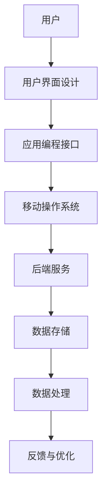

                 

在当今数字化时代，移动应用开发已成为技术领域的热点。无论是iOS还是Android平台，移动应用的开发都为个人开发者提供了广阔的舞台。然而，在这片广阔的天地中，机遇与挑战并存。本文旨在探讨个人开发者在这一领域的机遇与挑战，帮助开发者更好地理解这一领域的发展趋势，提升自身竞争力。

## 关键词

- 移动应用开发
- 个人开发者
- 机遇与挑战
- 平台差异
- 技术创新

## 摘要

本文从移动应用开发的背景入手，分析了个人开发者在这一领域所面临的机遇，如市场需求的增长、技术门槛的降低等。同时，也深入探讨了个人开发者需要面对的挑战，包括竞争激烈、用户需求多变、技术更新快速等。通过分析，本文提出了个人开发者应对这些挑战的策略，包括提高技术水平、关注用户体验、灵活运用工具等。

### 1. 背景介绍

移动应用开发的历史可以追溯到2007年，苹果公司发布了首款iPhone，从而开启了移动应用的新纪元。随后，谷歌的Android操作系统也迅速崛起，两大平台之间的竞争日益激烈。移动应用开发的兴起，不仅改变了人们的生活方式，也为开发者带来了前所未有的机遇。

个人开发者，指的是在个人兴趣或创业动机的驱动下，独立完成移动应用开发的开发者。他们通常没有大型开发团队的支持，但凭借着对技术的热爱和对市场的敏锐洞察，在移动应用开发领域取得了显著成绩。

### 2. 核心概念与联系

#### 2.1 移动应用开发的核心概念

移动应用开发的核心概念包括：

- **移动操作系统**：如iOS和Android，是移动应用的运行环境。
- **应用编程接口（API）**：提供应用程序与操作系统和硬件之间的交互。
- **用户界面设计**：直接影响用户的使用体验。
- **后端服务**：处理数据存储、数据处理等任务。

#### 2.2 核心概念联系

以下是移动应用开发核心概念的Mermaid流程图：



### 3. 核心算法原理 & 具体操作步骤

#### 3.1 算法原理概述

移动应用开发中常用的核心算法包括：

- **排序算法**：如快速排序、归并排序，用于数据的排序。
- **搜索算法**：如二分搜索，用于在数据中查找特定元素。
- **数据结构**：如堆、图等，用于高效地处理复杂数据。

#### 3.2 算法步骤详解

以下是快速排序算法的基本步骤：

1. 选择一个基准元素。
2. 将比基准元素小的元素移到左边，比基准元素大的元素移到右边。
3. 递归地对左右子数组进行排序。

#### 3.3 算法优缺点

快速排序的优点是时间复杂度较低（平均时间复杂度为O(nlogn)），但缺点是递归调用可能导致栈溢出。

#### 3.4 算法应用领域

快速排序在移动应用开发中，常用于数据的排序和搜索，例如在用户数据的展示中。

### 4. 数学模型和公式 & 详细讲解 & 举例说明

#### 4.1 数学模型构建

移动应用开发中的数学模型主要包括：

- **线性回归模型**：用于预测数据趋势。
- **逻辑回归模型**：用于分类任务。

#### 4.2 公式推导过程

线性回归模型的公式推导如下：

$$
y = \beta_0 + \beta_1 \cdot x
$$

其中，$y$ 是因变量，$x$ 是自变量，$\beta_0$ 和 $\beta_1$ 是模型参数。

#### 4.3 案例分析与讲解

假设我们要预测一个移动应用的用户留存率，可以使用线性回归模型。通过收集用户的使用数据，我们可以得到以下数据集：

| 用户ID | 使用天数 | 留存率 |
| ------ | -------- | ------ |
| 1      | 10       | 80%    |
| 2      | 20       | 60%    |
| 3      | 30       | 40%    |

使用线性回归模型，我们可以得到如下公式：

$$
\text{留存率} = 0.5 + 0.1 \cdot \text{使用天数}
$$

这意味着，使用天数每增加一天，留存率平均增加0.1个百分点。

### 5. 项目实践：代码实例和详细解释说明

#### 5.1 开发环境搭建

在进行移动应用开发时，首先需要搭建开发环境。以iOS开发为例，需要安装Xcode和Swift语言环境。

#### 5.2 源代码详细实现

以下是一个简单的Swift代码实例，用于实现一个简单的计数器应用：

```swift
import UIKit

class ViewController: UIViewController {
    var count = 0
    
    override func viewDidLoad() {
        super.viewDidLoad()
        // Do any additional setup after loading the view.
    }

    @IBAction func countButtonTapped(_ sender: Any) {
        count += 1
        print("Count: \(count)")
    }
}
```

#### 5.3 代码解读与分析

上述代码中，我们定义了一个`ViewController`类，并添加了一个`countButtonTapped`方法。每次用户点击按钮，`count`变量会增加1，并在控制台上打印出来。

#### 5.4 运行结果展示

在Xcode中运行上述代码，可以看到控制台输出如下结果：

```
Count: 1
Count: 2
Count: 3
...
```

### 6. 实际应用场景

#### 6.1 社交应用

社交应用是移动应用开发中最常见的领域之一。以微信为例，它提供了即时通讯、朋友圈、支付等功能，极大地改变了人们的社交方式。

#### 6.2 生活服务

生活服务应用如美团、滴滴等，为人们提供了便捷的餐饮、出行等服务，极大地提高了生活效率。

#### 6.3 娱乐应用

娱乐应用如抖音、快手等，通过短视频的形式，为用户提供了丰富的娱乐内容，也成为了社交媒体的重要组成部分。

### 7. 未来应用展望

随着5G技术的普及，移动应用的开发将更加注重实时性和交互性。同时，人工智能和大数据技术的应用，将使移动应用提供更加个性化和智能化的服务。

### 8. 工具和资源推荐

#### 8.1 学习资源推荐

- 《移动应用开发实战》
- 《iOS应用开发：从入门到精通》

#### 8.2 开发工具推荐

- Xcode
- Android Studio

#### 8.3 相关论文推荐

- "Mobile Application Development: Challenges and Opportunities"
- "The Impact of 5G on Mobile Application Development"

### 9. 总结：未来发展趋势与挑战

移动应用开发在未来将继续保持快速增长，但同时也将面临新的挑战，如技术更新、用户需求变化等。个人开发者需要不断学习新技术，提高自身竞争力，才能在这个领域中立于不败之地。

## 附录：常见问题与解答

1. **移动应用开发需要学习哪些技术？**
   移动应用开发主要涉及编程语言（如Swift、Kotlin）、前端框架（如React Native、Flutter）、后端技术（如Node.js、Django）等。

2. **个人开发者如何提高竞争力？**
   个人开发者可以通过不断学习新技术、参与开源项目、撰写技术博客等方式来提高自身竞争力。

3. **移动应用开发的未来趋势是什么？**
   移动应用开发的未来趋势包括人工智能、大数据、5G等技术的广泛应用，以及更注重用户体验和实时性的需求。

作者：禅与计算机程序设计艺术 / Zen and the Art of Computer Programming
```markdown


