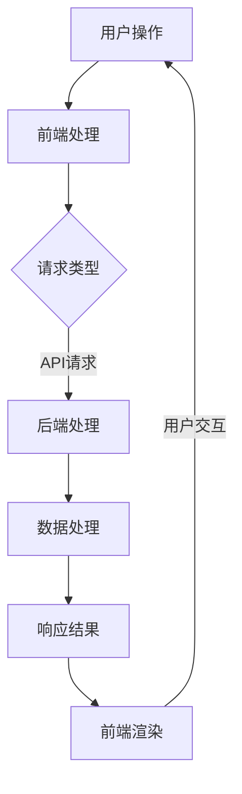

                 

 > **关键词**：移动端全栈开发，应用程序开发，智能手机，跨平台框架，开发工具，用户体验

> **摘要**：本文旨在深入探讨移动端全栈开发的各个方面，从基础知识到高级实践，帮助开发者理解如何为智能手机创建高质量的应用程序。我们将涵盖开发环境搭建、核心算法原理、项目实践以及未来应用展望等内容，旨在为移动端全栈开发提供一个全面的技术指南。

## 1. 背景介绍

随着智能手机的普及和移动互联网的发展，移动端应用程序的开发变得日益重要。从社交网络到电子商务，再到移动游戏，移动应用已经成为了我们日常生活不可或缺的一部分。对于开发者来说，掌握移动端全栈开发技术不仅能够提升个人竞争力，还能为企业和用户带来更多的价值。

移动端全栈开发，是指在一个开发环境中，既能够处理前端用户界面设计，又能完成后端数据处理和服务提供的开发模式。这种模式的好处在于，开发者可以更高效地开发和部署应用，同时确保前后端的一致性和稳定性。

本文将分为以下几个部分：

1. 背景介绍
2. 核心概念与联系
3. 核心算法原理 & 具体操作步骤
4. 数学模型和公式 & 详细讲解 & 举例说明
5. 项目实践：代码实例和详细解释说明
6. 实际应用场景
7. 工具和资源推荐
8. 总结：未来发展趋势与挑战
9. 附录：常见问题与解答

### **1.1 移动应用市场的现状**

移动应用市场的规模持续扩大，根据统计数据显示，全球移动应用下载量已超过数千亿次。尤其是在COVID-19疫情期间，移动应用的受欢迎程度达到了前所未有的高度。用户对于移动应用的需求不断增加，尤其是在便利性、速度和个性化体验方面。

### **1.2 全栈开发的必要性**

全栈开发者在处理项目时能够同时理解和优化前后端性能，从而提高开发效率和用户体验。这种能力使得全栈开发者成为现代软件开发中不可或缺的一部分。

### **1.3 文章目标**

本文的目标是：

- **提供基础知识**：介绍移动端全栈开发的基础知识，帮助初学者入门。
- **深入探讨技术细节**：讲解核心算法原理和数学模型，帮助开发者理解技术背后的逻辑。
- **分享实战经验**：通过实际项目实践，展示如何将理论知识应用到实际开发中。
- **展望未来趋势**：分析移动端全栈开发的发展方向和面临的挑战。

## 2. 核心概念与联系

在移动端全栈开发中，理解核心概念和它们之间的联系至关重要。以下是一些关键概念及其相互关系：

### **2.1 前端与后端的联系**

前端开发主要涉及用户界面和用户体验，而后端开发则负责数据存储、处理和服务提供。两者的紧密联系在于，前端通过API与后端交互，实现数据的动态更新和功能的实现。

### **2.2 前端技术栈**

前端技术栈包括HTML、CSS、JavaScript以及一系列前端框架（如React、Vue.js、Angular等）。这些技术共同构建了用户与移动应用交互的界面。

### **2.3 后端技术栈**

后端技术栈包括服务器、数据库、Web服务框架（如Node.js、Django、Spring Boot等）。后端不仅处理数据，还提供API供前端调用。

### **2.4 跨平台开发**

跨平台开发框架（如React Native、Flutter等）允许开发者使用一套代码库同时为iOS和Android平台创建应用程序。这种模式大大提高了开发效率和代码的可维护性。

### **2.5 客户端-服务器架构**

客户端-服务器架构是移动端全栈开发的基础。客户端（移动应用）向服务器发送请求，服务器处理请求并返回响应，从而实现数据交换和功能实现。

### **2.6 Mermaid 流程图**

下面是一个使用Mermaid绘制的移动端全栈开发流程图：



### **2.7 核心概念总结**

- **前端**：用户界面和交互。
- **后端**：数据存储和处理。
- **跨平台开发**：一套代码库，多平台部署。
- **客户端-服务器架构**：数据交换和功能实现的基础。

这些核心概念构成了移动端全栈开发的技术框架，理解它们对于开发者来说至关重要。

## 3. 核心算法原理 & 具体操作步骤

在移动端全栈开发中，核心算法的选择和实现对于应用程序的性能和用户体验具有重要影响。以下将介绍几个常见算法的原理和具体操作步骤。

### **3.1 算法原理概述**

**1. 数据结构算法**：数据结构是算法的基础，常见的有数组、链表、栈、队列、树和图等。每种数据结构都有其特定的用途和性能特点。

**2. 排序算法**：排序算法用于对数据进行排序，常见的有冒泡排序、选择排序、插入排序、快速排序等。

**3. 搜索算法**：搜索算法用于在数据中查找特定的元素，常见的有线性搜索、二分搜索等。

**4. 算法优化**：算法优化包括时间复杂度和空间复杂度的优化，常用的方法有动态规划、贪心算法等。

### **3.2 算法步骤详解**

**1. 数据结构算法**

- **数组**：数组是一种线性数据结构，用于存储一系列元素。操作包括插入、删除、查找和排序等。
- **链表**：链表是一种动态数据结构，每个节点包含数据和指向下一个节点的指针。操作包括插入、删除和遍历等。
- **栈**：栈是一种后进先出（LIFO）的数据结构，常用于处理递归问题和深度优先搜索等。
- **队列**：队列是一种先进先出（FIFO）的数据结构，常用于处理排队问题和广度优先搜索等。
- **树**：树是一种层次数据结构，用于表示层次关系，常见的有二叉树、平衡树、堆等。
- **图**：图是一种复杂的数据结构，用于表示多对多关系，常见的有邻接矩阵、邻接表等。

**2. 排序算法**

- **冒泡排序**：通过重复遍历要排序的数列，一次比较两个元素，如果它们的顺序错误就把它们交换过来。遍历数列的工作是重复进行直到没有再需要交换，也就是说该数列已经排序完成。
- **选择排序**：首先在未排序序列中找到最小（大）元素，存放到排序序列的起始位置，然后，再从剩余未排序元素中继续寻找最小（大）元素，然后放到已排序序列的末尾。以此类推，直到所有元素均排序完毕。
- **插入排序**：通过构建有序序列，对于未排序数据，在已排序序列中从后向前扫描，找到相应位置并插入。
- **快速排序**：通过选取一个“基准”元素，将数组分为两个子数组，一个包含小于基准的元素，另一个包含大于基准的元素，然后递归地对这些子数组进行快速排序。

**3. 搜索算法**

- **线性搜索**：顺序扫描数组，找到目标元素或确定其不存在。
- **二分搜索**：在有序数组中，通过不断将中间元素与目标值比较，将搜索范围缩小一半，直到找到目标元素或确定其不存在。

**4. 算法优化**

- **动态规划**：通过将复杂问题分解为子问题并保存子问题的解，避免重复计算，提高效率。
- **贪心算法**：在每一步选择中都采取当前最优解，从而希望导致最终最优解。

### **3.3 算法优缺点**

**1. 数据结构算法**

- **优点**：提供了高效的数据存储和处理方式。
- **缺点**：某些数据结构（如树和图）实现复杂，需要深入理解。

**2. 排序算法**

- **冒泡排序**：简单易懂，但效率较低。
- **选择排序**：效率较高，但数据交换次数较多。
- **插入排序**：适合小数据集，但效率较低。
- **快速排序**：平均效率高，但最坏情况下效率较低。

**3. 搜索算法**

- **线性搜索**：简单易懂，但效率较低。
- **二分搜索**：效率高，但要求数据有序。

**4. 算法优化**

- **动态规划**：适用于复杂问题，但实现复杂。
- **贪心算法**：适用于某些优化问题，但可能无法保证全局最优解。

### **3.4 算法应用领域**

- **数据结构算法**：广泛应用于各种软件开发和数据分析中。
- **排序算法**：常用于数据处理和搜索场景。
- **搜索算法**：用于各种查找和优化问题。
- **算法优化**：用于提高程序性能和效率。

### **3.5 总结**

算法原理和具体操作步骤是移动端全栈开发中不可或缺的一部分。理解并正确使用算法，能够大大提高应用程序的性能和用户体验。

## 4. 数学模型和公式 & 详细讲解 & 举例说明

在移动端全栈开发中，数学模型和公式用于描述算法和数据结构的行为。以下将介绍几个关键的数学模型和公式，并给出详细的讲解和举例说明。

### **4.1 数学模型构建**

**1. 线性模型**

线性模型是最简单的一种数学模型，通常表示为：

\[ y = ax + b \]

其中，\( y \) 是因变量，\( x \) 是自变量，\( a \) 和 \( b \) 是参数。

**2. 多项式模型**

多项式模型用于描述更复杂的关系，通常表示为：

\[ y = a_0x^n + a_1x^{n-1} + ... + a_n \]

其中，\( n \) 是多项式的次数，\( a_0, a_1, ..., a_n \) 是参数。

**3. 线性回归模型**

线性回归模型用于分析自变量和因变量之间的关系，通常表示为：

\[ y = \beta_0 + \beta_1x + \epsilon \]

其中，\( \beta_0 \) 和 \( \beta_1 \) 是参数，\( \epsilon \) 是误差项。

### **4.2 公式推导过程**

**1. 线性模型**

线性模型的推导过程如下：

- 假设我们有 \( n \) 个数据点 \((x_1, y_1), (x_2, y_2), ..., (x_n, y_n)\)。
- 定义目标函数为：

\[ J = \frac{1}{2n} \sum_{i=1}^{n} (y_i - ax_i - b)^2 \]

- 对 \( a \) 和 \( b \) 分别求偏导数并令其等于0，得到：

\[ \frac{\partial J}{\partial a} = 0 \]
\[ \frac{\partial J}{\partial b} = 0 \]

- 解这个方程组，得到最佳参数 \( a \) 和 \( b \)：

\[ a = \frac{\sum_{i=1}^{n} x_i y_i - n \bar{x} \bar{y}}{\sum_{i=1}^{n} x_i^2 - n \bar{x}^2} \]
\[ b = \bar{y} - a \bar{x} \]

其中，\( \bar{x} \) 和 \( \bar{y} \) 分别是 \( x \) 和 \( y \) 的平均值。

**2. 多项式模型**

多项式模型的推导过程类似线性模型，只不过需要处理更高次项的导数和求和。

**3. 线性回归模型**

线性回归模型的推导过程基于最小二乘法，目标是最小化误差平方和。

### **4.3 案例分析与讲解**

**1. 线性模型应用**

假设我们要预测某个城市的月平均温度 \( y \) 与月份 \( x \) 之间的关系。通过收集数据并拟合线性模型，我们可以得到：

\[ y = 0.5x + 10 \]

使用这个模型，我们可以预测未来任意月份的平均温度。

**2. 多项式模型应用**

假设我们要分析某个产品的销量 \( y \) 与广告支出 \( x \) 之间的关系。通过拟合多项式模型，我们得到：

\[ y = 0.1x^2 + 0.5x + 5 \]

这个模型表明，广告支出对销量的影响不仅是线性的，还包括二次效应。

**3. 线性回归模型应用**

假设我们要分析某个地区的房价 \( y \) 与面积 \( x \) 之间的关系。通过线性回归分析，我们得到：

\[ y = 1000 + 0.5x + \epsilon \]

这个模型可以帮助我们预测不同面积的房屋价格。

### **4.4 总结**

数学模型和公式是移动端全栈开发中的重要工具。通过合理选择和使用这些模型，开发者可以更好地理解和预测系统行为，从而优化应用程序的性能和用户体验。

## 5. 项目实践：代码实例和详细解释说明

在了解完移动端全栈开发的相关理论后，通过实际项目实践可以更好地巩固所学知识。以下将展示一个简单的移动端全栈开发项目，并对其进行详细的代码实例和解释说明。

### **5.1 开发环境搭建**

在开始项目之前，需要搭建开发环境。以下是一个基本的开发环境搭建步骤：

**1. 安装Node.js和npm**

Node.js 是一个基于Chrome V8引擎的JavaScript运行环境，用于构建后端服务。安装Node.js可以从其官网下载并安装。

```bash
curl -fsSL https://deb.nodesource.com/setup_14.x | sudo -E bash -
sudo apt-get install -y nodejs
```

npm（Node Package Manager）是Node.js的包管理工具，用于安装和管理项目依赖。

**2. 安装前端框架**

以下以React为例，安装React和相关的开发依赖。

```bash
npm install -g create-react-app
create-react-app my-app
cd my-app
npm install
```

**3. 安装数据库**

以下以MongoDB为例，安装并启动MongoDB数据库。

```bash
sudo apt-get install -y mongodb-org
sudo systemctl start mongod
```

### **5.2 源代码详细实现**

以下是一个简单的全栈项目，包括前端React应用和后端Node.js服务器。

**前端（React）**

```jsx
// App.js
import React, { useState, useEffect } from 'react';
import axios from 'axios';

function App() {
  const [data, setData] = useState([]);

  useEffect(() => {
    fetchData();
  }, []);

  const fetchData = async () => {
    const response = await axios.get('/api/data');
    setData(response.data);
  };

  return (
    <div>
      <h1>全栈项目示例</h1>
      <ul>
        {data.map((item) => (
          <li key={item.id}>{item.name}</li>
        ))}
      </ul>
    </div>
  );
}

export default App;
```

**后端（Node.js）**

```javascript
// server.js
const express = require('express');
const MongoClient = require('mongodb').MongoClient;

const app = express();
const PORT = 5000;
const MONGODB_URI = 'mongodb://localhost:27017';

app.use(express.json());

app.get('/api/data', async (req, res) => {
  try {
    const client = await MongoClient.connect(MONGODB_URI, { useNewUrlParser: true, useUnifiedTopology: true });
    const db = client.db('mydb');
    const data = await db.collection('items').find({}).toArray();
    res.json(data);
  } catch (error) {
    console.error(error);
    res.status(500).send('服务器错误');
  }
});

app.listen(PORT, () => {
  console.log(`服务器运行在端口：${PORT}`);
});
```

### **5.3 代码解读与分析**

**1. 前端部分**

- 使用React的函数组件，结合useState和useEffect钩子实现数据的动态加载。
- 通过axios库发起HTTP GET请求，获取后端数据。
- 将获取到的数据渲染到页面上。

**2. 后端部分**

- 使用Express框架搭建HTTP服务器，处理前端发起的请求。
- 使用MongoClient连接MongoDB数据库，查询数据并返回给前端。

### **5.4 运行结果展示**

1. 启动前端应用：

```bash
npm start
```

2. 启动后端服务器：

```bash
node server.js
```

3. 访问前端应用的浏览器页面，应能看到从数据库获取的数据列表。

### **5.5 总结**

通过这个简单的全栈项目，开发者可以了解到前端React和后端Node.js的基本用法。在实际开发中，可以根据项目需求增加更多的功能和复杂性。

## 6. 实际应用场景

移动端全栈开发技术在各种实际应用场景中展现出其强大的功能和优势。以下将探讨几个典型的应用场景，并分析其优势和挑战。

### **6.1 社交应用**

社交应用是移动端全栈开发的重要应用场景之一。例如，Facebook、Instagram 和微信等应用，都需要同时处理前端用户界面和后端数据处理。移动端全栈开发的优势在于：

- **高效开发**：开发者可以使用一套代码库同时为 iOS 和 Android 平台创建应用，提高开发效率。
- **数据同步**：前后端紧密结合，能够实现实时数据同步，提供更好的用户体验。

挑战包括：

- **性能优化**：社交应用通常数据量巨大，需要优化数据库查询和缓存策略。
- **安全性**：社交应用涉及用户隐私和数据安全，需要严格的安全措施。

### **6.2 电子商务**

电子商务平台如淘宝、京东和亚马逊等，依赖于移动端全栈开发实现商品浏览、下单、支付等复杂功能。其优势包括：

- **跨平台兼容**：一套代码库支持多个平台，降低开发和维护成本。
- **用户体验**：快速响应和流畅的交互，提升用户购物体验。

挑战包括：

- **并发处理**：高并发访问，需要优化数据库和缓存，确保系统稳定性。
- **安全性**：支付和用户信息的安全，需要严格的安全协议和加密措施。

### **6.3 移动游戏**

移动游戏如《王者荣耀》和《和平精英》等，通过移动端全栈开发实现复杂的游戏逻辑和丰富的用户交互。其优势包括：

- **实时互动**：支持实时语音和聊天功能，提升游戏体验。
- **快速更新**：快速迭代和更新游戏内容，满足用户需求。

挑战包括：

- **性能优化**：游戏运行需要高性能，优化渲染和计算效率。
- **网络稳定性**：保证游戏的稳定运行，需要优化网络连接和延迟处理。

### **6.4 健康医疗**

健康医疗应用如健身跟踪器、健康数据管理等，通过移动端全栈开发为用户提供实时健康数据和跟踪服务。其优势包括：

- **实时数据**：实时获取用户健康数据，为用户提供个性化健康建议。
- **跨平台**：一套代码库支持多个平台，便于用户随时随地访问。

挑战包括：

- **数据隐私**：健康数据敏感性高，需要确保数据安全和隐私保护。
- **合规性**：遵循医疗行业规范和法律法规，确保应用合规性。

### **6.5 总结**

移动端全栈开发在社交、电子商务、移动游戏、健康医疗等领域都有广泛应用。其优势在于高效开发、跨平台兼容和实时数据同步，但同时也面临性能优化、安全性和合规性的挑战。

## 7. 工具和资源推荐

为了提高移动端全栈开发的效率和成果，以下推荐一些优秀的工具和资源：

### **7.1 学习资源推荐**

- **书籍**：《移动应用开发实战》、《React Native实战》和《Node.js实战》等。
- **在线课程**：Coursera、Udemy、edX 等平台上提供的移动应用开发相关课程。
- **博客和论坛**：MDN Web Docs、Stack Overflow、GitHub 等，提供丰富的技术文档和社区支持。

### **7.2 开发工具推荐**

- **前端开发工具**：
  - **Visual Studio Code**：一款功能强大的代码编辑器，支持多种编程语言和框架。
  - **React Developer Tools**：用于调试React应用的Chrome插件。
  - **Webpack**：模块打包工具，用于优化前端项目结构。

- **后端开发工具**：
  - **Node.js**：JavaScript 运行环境，用于构建后端服务。
  - **MongoDB**：文档型数据库，支持高效的数据存储和查询。
  - **PostgreSQL**：关系型数据库，适合大型复杂应用。

- **跨平台开发工具**：
  - **React Native**：用于构建跨平台移动应用的框架。
  - **Flutter**：Google 开发的跨平台 UI 框架，支持高效的原生体验。

### **7.3 相关论文推荐**

- **"Cross-Platform Mobile Application Development with React Native"**：探讨React Native在跨平台移动应用开发中的优势和应用。
- **"Full-Stack Development with Node.js and React"**：介绍如何使用Node.js和React构建全栈应用。
- **"Mobile Backend as a Service (MBaaS) in Application Development"**：分析移动后端即服务（MBaaS）在移动应用开发中的应用。

通过使用这些工具和资源，开发者可以更高效地掌握移动端全栈开发技术，提升开发质量和用户体验。

## 8. 总结：未来发展趋势与挑战

移动端全栈开发作为一个不断发展的领域，未来充满了机遇和挑战。以下是对其发展趋势与挑战的总结。

### **8.1 研究成果总结**

近年来，移动端全栈开发领域取得了显著的研究成果：

- **跨平台框架**：React Native、Flutter等跨平台框架的成熟，使得开发者能够更高效地创建跨平台应用。
- **云原生技术**：云原生（Cloud Native）技术的发展，为移动应用提供了更好的性能、可扩展性和安全性。
- **人工智能与移动应用**：人工智能（AI）技术的应用，使得移动应用能够提供更智能、个性化的用户体验。
- **区块链与移动应用**：区块链技术的引入，为移动应用带来了新的安全性和数据管理方式。

### **8.2 未来发展趋势**

**1. 越来越多的跨平台应用**

随着跨平台框架的成熟和优化，未来将会有更多的开发者选择使用React Native、Flutter等技术来构建跨平台应用，从而提高开发效率和代码复用。

**2. 云原生技术的普及**

云原生技术将继续普及，尤其是在移动应用的后端服务中。这将为开发者提供更灵活、高效的应用部署和管理方式。

**3. AI与移动应用融合**

人工智能技术将继续与移动应用深度融合，为用户带来更智能、个性化的体验。例如，AI驱动的个性化推荐、智能助手等功能将得到广泛应用。

**4. 区块链技术的应用**

区块链技术将在移动应用中发挥更大的作用，尤其是在金融、供应链等领域。这将为移动应用提供更安全、透明和高效的数据管理方式。

### **8.3 面临的挑战**

**1. 性能优化**

随着应用功能的日益复杂，性能优化将成为一个重要的挑战。开发者需要不断优化代码、数据库查询和网络连接，以确保应用的流畅性和稳定性。

**2. 安全性**

移动应用的安全性是一个持续存在的问题。开发者需要采取严格的安全措施，包括数据加密、身份验证和安全协议等，以保护用户数据和隐私。

**3. 跨平台兼容性**

虽然跨平台框架提供了便捷的开发方式，但跨平台兼容性仍然是一个挑战。开发者需要处理不同平台之间的差异，确保应用在多个平台上的一致性和稳定性。

**4. 法律法规合规性**

随着移动应用在全球范围内的普及，法律法规合规性成为一个重要的问题。开发者需要遵循不同国家和地区的法律法规，确保应用合规性。

### **8.4 研究展望**

未来，移动端全栈开发领域将继续朝着跨平台、云计算、人工智能和区块链等方向发展。研究者将致力于解决性能优化、安全性、兼容性和合规性等挑战，推动移动应用技术的不断进步。

## 9. 附录：常见问题与解答

### **9.1 移动端全栈开发的框架选择**

**Q：** 我应该选择哪种框架进行移动端全栈开发？

**A：** 选择框架时，需要考虑项目需求、开发效率和团队熟悉度。以下是几种常见的框架：

- **React Native**：适用于跨平台开发，代码复用率高，适合大型项目。
- **Flutter**：由Google开发，性能优异，具有丰富的UI组件库，适合快速原型开发。
- **React**（仅前端）结合**Node.js**（后端）：适用于需要独立前后端开发的项目。

### **9.2 移动端应用的性能优化**

**Q：** 如何优化移动端应用的性能？

**A：** 以下是一些性能优化策略：

- **代码优化**：减少DOM操作、使用虚拟滚动、避免内存泄露等。
- **网络优化**：使用CDN、压缩图片和资源、使用Web Worker等。
- **数据库优化**：使用索引、优化查询、缓存策略等。
- **UI/UX优化**：减少动画、使用静态资源、优化导航等。

### **9.3 移动端应用的安全措施**

**Q：** 如何确保移动端应用的安全？

**A：** 以下是一些常见的安全措施：

- **数据加密**：使用HTTPS、对称加密和非对称加密。
- **身份验证**：使用OAuth、JWT等协议。
- **访问控制**：使用角色和权限控制，限制不当访问。
- **安全审计**：定期进行代码审计和安全测试。

### **9.4 跨平台应用兼容性**

**Q：** 如何保证跨平台应用的兼容性？

**A：** 以下是一些确保兼容性的方法：

- **使用官方文档和社区资源**：遵循框架和平台的官方文档和最佳实践。
- **测试**：使用模拟器和真实的设备进行测试，确保在不同平台上的一致性。
- **差异处理**：识别并处理平台差异，使用条件语句和桥接库。

### **9.5 法律法规合规性**

**Q：** 开发移动应用需要遵守哪些法律法规？

**A：** 开发移动应用时，需要遵守以下法律法规：

- **数据保护法规**：如GDPR（欧盟通用数据保护条例）。
- **隐私政策**：明确告知用户数据的收集、使用和共享方式。
- **版权法规**：遵守版权法，合理使用第三方资源和代码。
- **本地法律法规**：遵循目标市场的法律法规。

通过遵循这些常见问题与解答，开发者可以更好地应对移动端全栈开发中的各种挑战。

