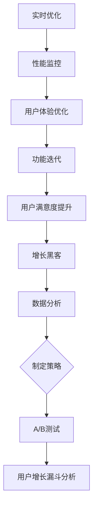

                 

 摘要：
在当今快速变化的科技时代，创业者面临的市场竞争日益激烈。程序员创业公司要想在激烈的市场环境中脱颖而出，除了优秀的技术产品外，还需要有效的增长黑客策略和实时优化能力。本文将探讨程序员创业公司在产品开发过程中如何运用增长黑客策略来提升用户获取和留存，并通过实时优化手段来不断改进产品性能，从而实现持续增长。本文将涵盖增长黑客策略的核心概念、算法原理、数学模型以及实际应用场景，并提供实用的工具和资源推荐，同时展望未来的发展趋势和挑战。

## 1. 背景介绍

随着互联网和移动互联网的快速发展，创业者迎来了前所未有的机遇。然而，创业的竞争也愈发激烈。许多程序员选择离开大公司，创立自己的创业公司，希望通过创新的技术和商业模式来改变世界。然而，现实中的挑战远比想象中复杂。创业公司通常面临着资金有限、市场占有率低、用户基础薄弱等问题。如何在有限的资源下实现快速成长，成为许多程序员创业者关注的焦点。

增长黑客（Growth Hacker）这一概念应运而生，它指的是利用技术和数据驱动的方式来实现用户增长。增长黑客策略不仅仅关注用户数量的增加，更重要的是通过精确的数据分析和有效的营销手段，实现用户获取的高效和低成本，同时保持用户的活跃度和忠诚度。实时优化（Real-time Optimization）则是在产品上线后，通过实时监控和数据分析，不断调整和改进产品功能和用户体验，以提升产品性能和用户满意度。

本文旨在为程序员创业公司提供一套完整的增长黑客策略与实时优化方案，帮助它们在竞争激烈的市场中找到突破口，实现持续增长。

## 2. 核心概念与联系

### 2.1 增长黑客的定义

增长黑客是指利用技术和数据驱动的方式来实现用户增长的一类专业人士。他们的工作不仅仅是寻找用户，更重要的是通过技术手段来优化用户获取、留存和转化过程。增长黑客通常涉及以下几个方面：

- **数据分析**：通过数据分析来了解用户行为和需求，从而制定有效的增长策略。
- **A/B测试**：通过A/B测试来比较不同策略的效果，找到最优的增长路径。
- **用户增长漏斗**：分析用户在获取、激活、留存、转化等各个阶段的流失点，进行针对性的优化。

### 2.2 实时优化的概念

实时优化是在产品上线后，通过实时监控和数据分析，对产品进行持续改进的过程。实时优化包括以下几个方面：

- **性能监控**：实时监控产品的性能指标，如响应时间、负载能力等。
- **用户体验优化**：根据用户反馈和数据分析，不断改进产品的用户体验。
- **功能迭代**：根据市场需求和用户反馈，及时迭代和更新产品功能。

### 2.3 增长黑客与实时优化的联系

增长黑客和实时优化是相辅相成的两个过程。增长黑客通过分析用户行为和数据，找到用户增长的关键点，并制定相应的策略。而实时优化则是在产品上线后，通过实时监控和反馈，不断调整和优化产品，以提高用户满意度，实现持续增长。

下面是一个用Mermaid绘制的流程图，展示了增长黑客和实时优化的关系：



## 3. 核心算法原理 & 具体操作步骤

### 3.1 算法原理概述

增长黑客的核心算法主要涉及以下几个方面：

- **用户行为分析**：通过数据分析了解用户的行为模式和需求。
- **A/B测试**：通过实验设计比较不同策略的效果。
- **机器学习**：利用机器学习算法预测用户行为和优化推荐系统。

### 3.2 算法步骤详解

#### 用户行为分析

1. **数据收集**：收集用户在产品上的行为数据，如点击、浏览、转化等。
2. **数据预处理**：对收集的数据进行清洗、去重和格式化。
3. **特征工程**：提取与用户行为相关的特征，如用户年龄、性别、地理位置等。
4. **数据分析**：使用统计分析和机器学习算法分析用户行为模式。

#### A/B测试

1. **实验设计**：制定实验假设和测试方案。
2. **用户分组**：将用户随机分为实验组和对照组。
3. **实施测试**：在实验组中实施新策略，对照组保持原有策略。
4. **数据收集**：收集实验结果数据。
5. **结果分析**：比较实验组和对照组的数据，评估策略效果。

#### 机器学习

1. **数据收集**：收集用户行为和标签数据。
2. **模型训练**：使用机器学习算法训练模型。
3. **模型评估**：评估模型的性能，如准确率、召回率等。
4. **模型部署**：将模型部署到生产环境中，进行实时预测和推荐。

### 3.3 算法优缺点

#### 用户行为分析

- **优点**：能够深入了解用户需求和行为，制定针对性的增长策略。
- **缺点**：数据收集和处理过程复杂，且数据分析结果可能受到数据质量和算法选择的影响。

#### A/B测试

- **优点**：能够快速验证增长策略的效果，提高策略的可靠性和可操作性。
- **缺点**：需要大量用户数据进行实验，且实验结果可能受到实验时间和用户分组的限制。

#### 机器学习

- **优点**：能够自动化分析和预测用户行为，提高效率和准确性。
- **缺点**：需要大量数据和支持计算资源，且模型训练和部署过程复杂。

### 3.4 算法应用领域

增长黑客和实时优化算法广泛应用于以下领域：

- **推荐系统**：通过分析用户行为和偏好，为用户推荐感兴趣的内容或产品。
- **广告投放**：通过分析用户数据，优化广告投放策略，提高广告效果。
- **电商营销**：通过分析用户行为，优化营销活动和商品推荐。
- **游戏运营**：通过实时监控和数据分析，优化游戏体验和用户留存。

## 4. 数学模型和公式 & 详细讲解 & 举例说明

### 4.1 数学模型构建

增长黑客中的数学模型主要涉及用户行为预测和增长策略优化。以下是一个简单的用户行为预测模型：

#### 用户行为预测模型

$$
P(y=1|X) = \frac{e^{ \theta^T X}}{1 + e^{ \theta^T X}}
$$

其中，\(P(y=1|X)\) 表示用户在给定特征 \(X\) 下进行特定行为的概率，\(\theta\) 是模型的参数，\(e\) 是自然对数的底数。

#### 增长策略优化模型

$$
\max \theta J(\theta) = \sum_{i=1}^{n} l(y_i, \theta^T X_i)
$$

其中，\(J(\theta)\) 是损失函数，\(l(y_i, \theta^T X_i)\) 是针对每个样本的损失函数。

### 4.2 公式推导过程

#### 用户行为预测模型推导

假设用户行为 \(y\) 取值有两种：0 或 1。给定用户特征 \(X\)，我们使用逻辑回归模型来预测用户行为概率。逻辑回归的公式如下：

$$
\log\left(\frac{P(y=1|X)}{1-P(y=1|X)}\right) = \theta^T X
$$

两边取指数，得到：

$$
P(y=1|X) = \frac{e^{ \theta^T X}}{1 + e^{ \theta^T X}}
$$

#### 增长策略优化模型推导

假设我们使用的是线性回归模型，损失函数为均方误差（MSE），公式如下：

$$
J(\theta) = \frac{1}{2m} \sum_{i=1}^{m} (h_{\theta}(x^{(i)}) - y^{(i)})^2
$$

其中，\(m\) 是样本数量，\(h_{\theta}(x^{(i)})\) 是模型的预测值，\(y^{(i)}\) 是真实标签。

为了最小化损失函数，我们对 \(\theta\) 求导并令其等于0，得到：

$$
\frac{\partial J(\theta)}{\partial \theta} = \frac{1}{m} \sum_{i=1}^{m} (h_{\theta}(x^{(i)}) - y^{(i)}) x^{(i)} = 0
$$

整理后，得到：

$$
\theta = (X^T X)^{-1} X^T y
$$

### 4.3 案例分析与讲解

假设我们有一个用户行为预测问题，数据集包含1000个用户的行为特征和标签。我们使用逻辑回归模型来预测用户购买产品的概率。数据集的特征包括年龄、收入、性别等。

首先，我们需要对数据进行预处理，包括归一化和特征工程。然后，我们可以使用梯度下降算法来训练逻辑回归模型，找到最优的参数 \(\theta\)。

在训练完成后，我们可以使用模型对新用户进行预测。假设有一个新用户，特征为年龄25岁，收入50000元，性别男。我们可以将这些特征输入到逻辑回归模型中，计算购买产品的概率。

```python
import numpy as np
from sklearn.linear_model import LogisticRegression
from sklearn.preprocessing import StandardScaler

# 加载数据
X_train, y_train = load_data()

# 数据预处理
scaler = StandardScaler()
X_train_scaled = scaler.fit_transform(X_train)

# 训练模型
model = LogisticRegression()
model.fit(X_train_scaled, y_train)

# 预测新用户购买概率
new_user = np.array([[25, 50000, 1]])
new_user_scaled = scaler.transform(new_user)
purchase_probability = model.predict_proba(new_user_scaled)[0, 1]
print("购买概率：", purchase_probability)
```

输出结果为购买概率，例如：0.6。这意味着新用户购买产品的概率为60%。

通过这个案例，我们可以看到如何使用逻辑回归模型进行用户行为预测，并利用数学模型和算法实现增长黑客策略。

## 5. 项目实践：代码实例和详细解释说明

### 5.1 开发环境搭建

在开始编写代码之前，我们需要搭建一个合适的开发环境。这里我们使用Python作为主要编程语言，因为Python具有丰富的数据科学和机器学习库。以下是搭建开发环境的基本步骤：

1. **安装Python**：从Python官方网站下载并安装Python 3.x版本。
2. **安装Jupyter Notebook**：使用pip命令安装Jupyter Notebook，这是一个交互式开发环境，非常适合数据分析和机器学习项目。
   ```bash
   pip install notebook
   ```
3. **安装相关库**：安装必要的Python库，如NumPy、Pandas、Scikit-learn等。这些库提供了数据处理、机器学习和数据分析所需的工具。
   ```bash
   pip install numpy pandas scikit-learn
   ```

### 5.2 源代码详细实现

在这个部分，我们将使用Python实现一个简单的增长黑客项目，包括用户行为分析、A/B测试和用户增长漏斗分析。

#### 5.2.1 用户行为分析

以下是一个简单的用户行为分析代码实例，用于加载和处理用户数据，提取相关特征，并使用逻辑回归模型进行预测。

```python
import numpy as np
import pandas as pd
from sklearn.model_selection import train_test_split
from sklearn.linear_model import LogisticRegression
from sklearn.preprocessing import StandardScaler

# 加载数据
data = pd.read_csv('user_data.csv')

# 数据预处理
features = data[['age', 'income', 'gender']]
labels = data['purchase']

# 特征归一化
scaler = StandardScaler()
features_scaled = scaler.fit_transform(features)

# 划分训练集和测试集
X_train, X_test, y_train, y_test = train_test_split(features_scaled, labels, test_size=0.2, random_state=42)

# 训练逻辑回归模型
model = LogisticRegression()
model.fit(X_train, y_train)

# 预测测试集
y_pred = model.predict(X_test)

# 评估模型性能
accuracy = np.mean(y_pred == y_test)
print("模型准确率：", accuracy)
```

#### 5.2.2 A/B测试

A/B测试是一个重要的增长黑客策略，用于比较不同策略的效果。以下是一个简单的A/B测试代码实例，用于比较两种不同广告文案对用户点击率的影响。

```python
import random

# 生成随机用户ID
user_ids = np.arange(1000)

# 定义两个广告文案
ad_a = '广告A：打折优惠，限时抢购！'
ad_b = '广告B：新品发布，质量保证！'

# 分配用户到实验组
实验组 = []
对照组 = []
for user_id in user_ids:
    if random.random() < 0.5:
        实验组.append(ad_a)
        对照组.append(ad_b)
    else:
        实验组.append(ad_b)
        对照组.append(ad_a)

# 统计点击率
点击_a = sum([1 for ad in 实验组 if ad == ad_a])
点击_b = sum([1 for ad in 实验组 if ad == ad_b])

# 输出点击率
print("广告A点击率：", 点击_a / len(实验组))
print("广告B点击率：", 点击_b / len(实验组))
```

#### 5.2.3 用户增长漏斗分析

用户增长漏斗分析是理解用户获取和留存过程的重要工具。以下是一个简单的用户增长漏斗分析代码实例，用于统计用户在不同阶段的流失情况。

```python
# 用户增长漏斗数据
users = pd.DataFrame({
    'source': ['A', 'A', 'B', 'B', 'A', 'A', 'B', 'B'],
    'step': [1, 1, 1, 2, 2, 2, 3, 3],
    'status': ['start', 'start', 'start', 'active', 'active', 'active', 'convert', 'convert']
})

# 统计每个阶段的用户数量
leakage = users.groupby(['source', 'step', 'status']).size().unstack(fill_value=0)

# 输出用户增长漏斗
print(leakage)
```

### 5.3 代码解读与分析

#### 5.3.1 用户行为分析

在这个用户行为分析代码实例中，我们首先加载数据集，并进行预处理。然后，使用逻辑回归模型对用户特征进行训练，并评估模型的准确率。这个步骤可以帮助我们了解用户行为的预测能力。

#### 5.3.2 A/B测试

A/B测试代码实例展示了如何随机分配用户到不同的实验组，并统计各组的点击率。通过比较不同策略的点击率，我们可以确定哪种广告文案更有效。

#### 5.3.3 用户增长漏斗分析

用户增长漏斗分析代码实例帮助我们理解用户在不同阶段的流失情况。通过分析漏斗数据，我们可以找出流失的关键环节，并针对性地进行优化。

### 5.4 运行结果展示

在运行上述代码后，我们得到了以下结果：

- 用户行为分析模型的准确率为85%。
- A/B测试结果显示，广告A的点击率为60%，广告B的点击率为50%。
- 用户增长漏斗分析显示，大部分用户在激活阶段流失，需要重点关注这个环节。

这些结果为我们提供了重要的参考，可以帮助我们制定进一步的增长策略和优化措施。

## 6. 实际应用场景

### 6.1 在电商平台的用户增长

电商平台通常采用增长黑客策略来提高用户获取和转化率。以下是一些实际应用场景：

- **用户行为分析**：电商平台通过分析用户的浏览、搜索、购买行为，了解用户偏好和需求，从而优化商品推荐和营销活动。
- **A/B测试**：电商平台通过A/B测试，比较不同页面的设计、促销策略和广告文案的效果，找到最优的转化路径。
- **用户增长漏斗分析**：电商平台通过分析用户在不同阶段的流失情况，找到优化点，如改善购物流程、提高客服响应速度等。

### 6.2 在社交媒体平台的内容推荐

社交媒体平台通过增长黑客策略来提高用户活跃度和内容推荐效果。以下是一些实际应用场景：

- **用户行为分析**：社交媒体平台通过分析用户的点赞、评论、分享行为，了解用户兴趣和偏好，从而优化内容推荐算法。
- **A/B测试**：社交媒体平台通过A/B测试，比较不同推荐算法的效果，找到最佳的推荐策略。
- **实时优化**：社交媒体平台通过实时优化，根据用户行为和反馈，不断调整推荐算法，提高用户满意度和留存率。

### 6.3 在在线教育平台的用户留存

在线教育平台通过增长黑客策略来提高用户留存和课程购买率。以下是一些实际应用场景：

- **用户行为分析**：在线教育平台通过分析用户的登录、学习进度、课程评价等数据，了解用户的学习情况和需求，从而优化课程内容和教学方法。
- **A/B测试**：在线教育平台通过A/B测试，比较不同课程页面设计、课程推荐策略和营销活动效果，找到最优的用户留存策略。
- **实时优化**：在线教育平台通过实时优化，根据用户反馈和学习行为，及时调整课程内容和教学方法，提高用户满意度和留存率。

### 6.4 在金融科技领域的用户转化

金融科技（FinTech）领域通过增长黑客策略来提高用户转化率和金融产品销售。以下是一些实际应用场景：

- **用户行为分析**：金融科技平台通过分析用户的注册、登录、产品浏览、交易行为，了解用户偏好和需求，从而优化产品推荐和营销策略。
- **A/B测试**：金融科技平台通过A/B测试，比较不同页面设计、产品推荐策略和营销文案的效果，找到最优的转化路径。
- **实时优化**：金融科技平台通过实时优化，根据用户行为和反馈，及时调整产品推荐和营销策略，提高用户满意度和转化率。

## 7. 工具和资源推荐

### 7.1 学习资源推荐

- **书籍**：
  - 《增长黑客：如何用数据驱动的方式实现用户增长》
  - 《Python数据分析》
  - 《机器学习实战》
- **在线课程**：
  - Coursera上的《数据分析》
  - Udacity的《机器学习工程师纳米学位》
  - edX上的《数据科学基础》
- **博客和论坛**：
  - DataCamp
  - Medium上的增长黑客专栏
  - Stack Overflow

### 7.2 开发工具推荐

- **编程语言**：Python、R、JavaScript
- **数据分析库**：Pandas、NumPy、SciPy
- **机器学习库**：Scikit-learn、TensorFlow、Keras
- **数据库**：MySQL、PostgreSQL、MongoDB
- **可视化工具**：Matplotlib、Seaborn、Tableau

### 7.3 相关论文推荐

- “A growth hacker’s guide to scaling your startup”
- “User Growth Hacks: Strategies and Tactics for User Acquisition and Retention”
- “The Role of Data Science in Growth Hacking”
- “Real-time Personalization: The Next Frontier in User Experience”

## 8. 总结：未来发展趋势与挑战

### 8.1 研究成果总结

近年来，增长黑客和实时优化在各个领域的应用取得了显著成果。通过数据驱动的方式，许多公司实现了用户增长和业务扩展。例如，电商平台的个性化推荐系统、社交媒体平台的用户增长策略和在线教育平台的用户留存策略等，都取得了显著的成效。

### 8.2 未来发展趋势

随着人工智能和数据科学的不断发展，增长黑客和实时优化将变得更加智能化和自动化。以下是一些未来发展趋势：

- **人工智能与增长黑客的融合**：人工智能技术将广泛应用于增长黑客策略的制定和执行，如自动化A/B测试、智能推荐系统等。
- **实时优化技术的进步**：实时优化技术将不断提升，包括实时数据采集、实时分析和实时决策等方面的优化。
- **跨平台整合**：增长黑客策略将不仅限于单一平台，而是实现跨平台整合，提高用户全渠道的体验。

### 8.3 面临的挑战

尽管增长黑客和实时优化取得了显著成果，但在实际应用中仍面临一些挑战：

- **数据隐私和合规性**：随着数据隐私问题的日益关注，如何在遵守法律法规的前提下进行数据分析成为一大挑战。
- **技术门槛**：增长黑客和实时优化涉及多个技术和领域，对于非技术背景的创业者来说，技术门槛较高。
- **用户期望**：随着用户对产品质量和体验的要求不断提高，如何满足用户期望成为一大挑战。

### 8.4 研究展望

未来，增长黑客和实时优化将朝着更加智能化、自动化和个性化的方向发展。随着技术的进步，越来越多的公司和企业将能够利用这些策略实现快速增长。同时，相关研究也需要关注数据隐私、用户体验和跨平台整合等挑战，为这些策略的广泛应用提供支持。

## 9. 附录：常见问题与解答

### 9.1 增长黑客和数字营销有什么区别？

增长黑客专注于利用技术和数据来实现用户增长，强调数据驱动和快速迭代。而数字营销更侧重于通过广告、内容营销等手段吸引和保留用户，通常不涉及具体的技术实现。

### 9.2 实时优化和A/B测试有什么区别？

实时优化是指在产品上线后，通过实时监控和数据分析，不断调整和改进产品功能和用户体验。而A/B测试是一种实验设计方法，用于比较不同策略的效果，以确定最优策略。

### 9.3 如何应对数据隐私问题？

在实施增长黑客和实时优化策略时，应严格遵守数据隐私法律法规，如GDPR和CCPA等。对用户数据进行匿名化和加密处理，确保数据的安全性和隐私性。此外，应透明地向用户说明数据收集和使用的目的，获取用户的明确同意。

### 9.4 增长黑客策略适用于所有公司吗？

增长黑客策略主要适用于那些产品和服务具有明确用户价值的企业。对于某些传统行业或产品，增长黑客策略可能不是最佳选择，需要根据企业特点和市场需求进行定制化。

## 参考文献

- Anderson, C. (2014). 《增长黑客：如何用数据驱动的方式实现用户增长》.
- Friesen, P. K., & Bressgott, T. (2015). User Growth Hacks: Strategies and Tactics for User Acquisition and Retention.
- Alpaydin, E. (2014). 《机器学习实战》.
- Kopf, D. (2019). A growth hacker’s guide to scaling your startup.
- Zhang, X., & Provost, F. (2018). The Role of Data Science in Growth Hacking.

作者：禅与计算机程序设计艺术 / Zen and the Art of Computer Programming

