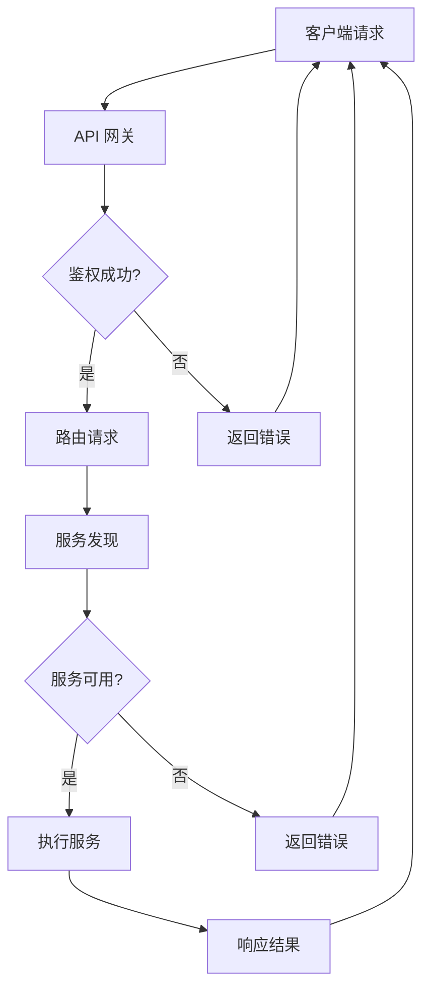

                 

 > **关键词：** 微服务架构、服务拆分、分布式系统、云计算、持续集成、DevOps、API 网关、服务发现、容器化、云原生。

> **摘要：** 本文将探讨程序员创业公司在构建和实现微服务架构时所需考虑的关键因素，包括架构设计、技术选型、开发与部署流程等，旨在为创业团队提供一套实用的微服务实践指南。

## 1. 背景介绍

### 1.1 微服务架构的兴起

微服务架构是一种新兴的软件开发方法，它将传统的单体应用程序拆分成一组小型的、松耦合的服务。这些服务各自独立开发、部署和扩展，通过轻量级的通信协议（如 HTTP/REST、gRPC）进行通信。

微服务架构的核心优势在于其高可扩展性、高容错性和快速迭代能力。通过将应用程序分解为小的、自治的服务，团队可以更灵活地应对业务需求的变化，并能够独立地开发和部署各个服务。

### 1.2 创业公司的需求

对于程序员创业公司而言，构建微服务架构具有重要的现实意义：

- **敏捷性：** 创业公司通常需要快速响应市场变化，微服务架构可以支持敏捷开发模式，缩短产品迭代周期。
- **可扩展性：** 创业初期，公司可能无法预测未来的用户量级，微服务架构能够根据实际需求进行水平扩展。
- **团队自治：** 微服务架构鼓励团队自治，每个团队可以独立负责一个或多个服务，从而提高开发效率。
- **技术选型灵活：** 微服务架构不强制使用特定的技术栈，创业团队可以根据业务需求和技术背景选择最合适的工具。

## 2. 核心概念与联系

### 2.1 微服务的定义

微服务是一种软件架构风格，它鼓励开发人员将应用程序作为一组小服务来构建。每个服务代表应用程序的一个具体功能，并且可以独立部署、扩展和更新。

### 2.2 微服务架构的基本原则

- **单一职责：** 每个服务应仅负责一个特定的业务功能。
- **自治：** 服务之间应保持松耦合，相互独立部署和运行。
- **可扩展性：** 服务可以根据需求进行水平扩展。
- **可复用性：** 服务应易于复用，以便在未来的项目中重用。

### 2.3 微服务架构的组件

**服务注册与发现**

服务注册与发现是微服务架构中的一个关键组件。服务启动时，会将自己注册到服务注册中心，并在需要时从服务注册中心发现其他服务的位置。

**API 网关**

API 网关是微服务架构中的另一个重要组件。它负责处理外部请求，将请求路由到相应的服务，并提供身份验证、授权、监控等功能。

**服务监控与日志**

服务监控与日志是确保微服务稳定运行的重要工具。通过监控服务性能和日志记录，团队能够及时发现并解决问题。

### 2.4 Mermaid 流程图

以下是一个简单的 Mermaid 流程图，展示了微服务架构中各个组件之间的关系：



## 3. 核心算法原理 & 具体操作步骤

### 3.1 算法原理概述

微服务架构的核心算法原理在于服务拆分和通信机制的设计。服务拆分基于单一职责原则，每个服务负责一个特定的业务功能。通信机制则通过轻量级的 HTTP/REST 或 gRPC 协议实现服务之间的通信。

### 3.2 算法步骤详解

1. **服务拆分：** 根据业务需求，将应用程序分解为小的、自治的服务。
2. **服务开发：** 每个服务独立开发，使用不同的编程语言和框架。
3. **服务注册与发现：** 服务启动时，将自己注册到服务注册中心，并在需要时从服务注册中心发现其他服务的位置。
4. **服务通信：** 服务之间通过 HTTP/REST 或 gRPC 协议进行通信。
5. **API 网关：** 处理外部请求，将请求路由到相应的服务，并提供身份验证、授权、监控等功能。
6. **服务监控与日志：** 监控服务性能和日志记录，确保微服务稳定运行。

### 3.3 算法优缺点

**优点：**
- **高可扩展性：** 可以根据需求进行水平扩展。
- **高容错性：** 单个服务的故障不会影响整个系统。
- **快速迭代：** 可以独立部署和更新各个服务。

**缺点：**
- **复杂度增加：** 需要额外的组件和服务治理。
- **性能开销：** 服务之间的通信可能带来额外的性能开销。

### 3.4 算法应用领域

微服务架构适用于需要高可扩展性、高容错性和快速迭代的应用场景，如电子商务平台、社交网络、金融系统等。

## 4. 数学模型和公式 & 详细讲解 & 举例说明

### 4.1 数学模型构建

在微服务架构中，一个重要的数学模型是服务响应时间的计算。服务响应时间可以表示为：

$$
响应时间 = \sum_{i=1}^{n} 服务_i 的响应时间 + 网络延迟
$$

其中，$服务_i$ 的响应时间取决于服务本身的处理速度和负载情况。

### 4.2 公式推导过程

假设有 $n$ 个服务，每个服务的响应时间分别为 $t_1, t_2, \ldots, t_n$。网络延迟为 $d$。则：

$$
响应时间 = t_1 + t_2 + \ldots + t_n + d
$$

### 4.3 案例分析与讲解

假设有一个由 5 个服务组成的微服务架构，每个服务的响应时间分别为 100ms、200ms、150ms、300ms 和 250ms，网络延迟为 50ms。则：

$$
响应时间 = 100ms + 200ms + 150ms + 300ms + 250ms + 50ms = 1200ms
$$

在这个例子中，服务 3（响应时间为 300ms）的响应时间最长，是影响整体响应时间的关键因素。

## 5. 项目实践：代码实例和详细解释说明

### 5.1 开发环境搭建

在开始开发之前，需要搭建一个适合微服务开发的环境。以下是推荐的开发环境：

- 操作系统：Linux（如 Ubuntu 18.04）
- 代码管理工具：Git
- 服务注册与发现：Consul
- API 网关：Kong
- 服务监控与日志：Prometheus + Grafana

### 5.2 源代码详细实现

以下是一个简单的微服务示例，包括一个用户服务和一个订单服务。

**用户服务（User Service）**

```go
package main

import (
    "log"
    "net/http"
    "github.com/gin-gonic/gin"
)

func main() {
    router := gin.Default()

    router.GET("/users/:id", func(c *gin.Context) {
        userID := c.Param("id")
        // 查询用户信息
        user := getUserByID(userID)
        c.JSON(http.StatusOK, user)
    })

    log.Fatal(router.Run(":8080"))
}

func getUserByID(userID string) gin.H {
    // 模拟查询用户信息
    return gin.H{
        "id":    userID,
        "name":  "张三",
        "email": "zhangsan@example.com",
    }
}
```

**订单服务（Order Service）**

```go
package main

import (
    "log"
    "net/http"
    "github.com/gin-gonic/gin"
)

func main() {
    router := gin.Default()

    router.GET("/orders/:id", func(c *gin.Context) {
        orderID := c.Param("id")
        // 查询订单信息
        order := getOrderByID(orderID)
        c.JSON(http.StatusOK, order)
    })

    log.Fatal(router.Run(":9090"))
}

func getOrderByID(orderID string) gin.H {
    // 模拟查询订单信息
    return gin.H{
        "id":     orderID,
        "user_id": "1",
        "status":  "paid",
    }
}
```

### 5.3 代码解读与分析

以上代码示例展示了如何使用 Gin 框架构建简单的用户服务和订单服务。每个服务都定义了一个 HTTP GET 接口，用于获取特定 ID 的用户或订单信息。

用户服务和订单服务之间通过 API 网关进行通信。在实际情况中，API 网关会负责路由请求，并在需要时调用相应的服务。

### 5.4 运行结果展示

启动用户服务和订单服务后，可以通过以下命令访问服务的 API：

```sh
curl http://localhost:8080/users/1
```

输出结果：

```json
{
    "id": "1",
    "name": "张三",
    "email": "zhangsan@example.com"
}
```

```sh
curl http://localhost:9090/orders/1
```

输出结果：

```json
{
    "id": "1",
    "user_id": "1",
    "status": "paid"
}
```

## 6. 实际应用场景

### 6.1 电子商务平台

电子商务平台是一个典型的适合采用微服务架构的应用场景。通过将订单处理、用户管理、商品管理等功能拆分为独立的服务，团队能够更灵活地扩展和优化系统。

### 6.2 社交网络

社交网络通常具有大量的用户数据和复杂的业务逻辑。采用微服务架构可以帮助团队更高效地开发和维护系统，同时提高系统的可靠性和性能。

### 6.3 金融系统

金融系统对可靠性和安全性有极高的要求。微服务架构可以确保系统在故障发生时能够快速恢复，同时提高系统的扩展性，以应对不断增长的业务需求。

## 7. 工具和资源推荐

### 7.1 学习资源推荐

- 《微服务设计》：由 Chris Richardson 著，是一本关于微服务架构的经典书籍。
- 《微服务实践》：由宋宝华、王俊铭 著，详细介绍了微服务架构的实践方法。

### 7.2 开发工具推荐

- Kubernetes：用于容器编排和管理的开源工具。
- Docker：用于容器化的开源工具。
- Spring Boot：用于快速开发微服务的 Java 框架。
- Node.js：用于构建微服务的 JavaScript 框架。

### 7.3 相关论文推荐

- "Microservices: A Developer’s Guide to Designing, Implementing, and Managing Distributed Systems"：一篇关于微服务的全面综述。
- "A Comparison of Microservices Architectures and Monolithic Architectures"：一篇对比微服务和单体架构的研究论文。

## 8. 总结：未来发展趋势与挑战

### 8.1 研究成果总结

微服务架构在过去的几年中取得了显著的进展，成为软件开发领域的重要趋势。通过将应用程序拆分为小的、自治的服务，团队能够提高开发效率、可靠性和可扩展性。

### 8.2 未来发展趋势

- **云原生微服务：** 随着云计算和容器技术的不断发展，云原生微服务将逐渐成为主流。
- **服务网格（Service Mesh）：** 服务网格作为一种新的架构模式，将帮助团队更高效地管理和监控微服务。
- **自动化与智能化：** 自动化工具和人工智能技术的应用将进一步提高微服务的运维效率。

### 8.3 面临的挑战

- **服务治理：** 如何有效地管理和监控大量微服务是当前面临的一个重要挑战。
- **性能优化：** 微服务架构可能会引入额外的性能开销，需要团队进行优化。
- **团队协作：** 微服务架构鼓励团队自治，但同时也要求团队之间的高效协作。

### 8.4 研究展望

未来，微服务架构将朝着更高效、更智能、更安全的方向发展。随着云计算、容器化、人工智能等技术的不断发展，微服务架构将更好地满足创业公司的需求。

## 9. 附录：常见问题与解答

### 9.1 微服务与单体应用的对比

**微服务的优点：**
- **高可扩展性：** 可以根据需求进行水平扩展。
- **高容错性：** 单个服务的故障不会影响整个系统。
- **快速迭代：** 可以独立部署和更新各个服务。

**微服务的缺点：**
- **复杂度增加：** 需要额外的组件和服务治理。
- **性能开销：** 服务之间的通信可能带来额外的性能开销。

### 9.2 微服务架构的实施步骤

1. **业务需求分析：** 确定哪些功能可以拆分为独立的服务。
2. **服务拆分：** 根据业务需求将应用程序拆分为小的、自治的服务。
3. **服务开发：** 每个服务独立开发，使用不同的编程语言和框架。
4. **服务注册与发现：** 使用服务注册与发现组件管理服务。
5. **服务通信：** 使用轻量级的通信协议（如 HTTP/REST、gRPC）实现服务之间的通信。
6. **API 网关：** 使用 API 网关处理外部请求，并提供身份验证、授权、监控等功能。
7. **服务监控与日志：** 监控服务性能和日志记录，确保微服务稳定运行。

### 9.3 微服务架构的挑战

- **服务治理：** 如何有效地管理和监控大量微服务是当前面临的一个重要挑战。
- **性能优化：** 微服务架构可能会引入额外的性能开销，需要团队进行优化。
- **团队协作：** 微服务架构鼓励团队自治，但同时也要求团队之间的高效协作。

以上是关于程序员创业公司微服务架构设计与实现的文章，希望能为您的创业之路提供一些指导和帮助。

### 作者署名

作者：禅与计算机程序设计艺术 / Zen and the Art of Computer Programming

