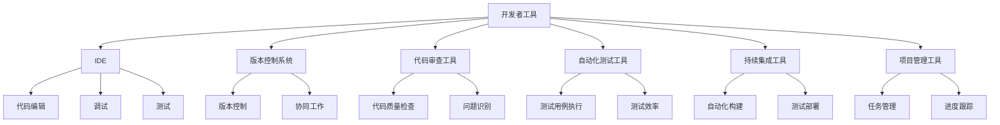

                 

 在当今快速发展的技术时代，程序员创业者面临着巨大的挑战和机遇。他们需要在有限的时间内开发出高质量的产品，以在竞争激烈的市场中脱颖而出。开发者工具的出现，大大提高了程序员的开发效率，帮助他们更专注于创造创新性的解决方案。本文将深入探讨程序员创业者如何利用各种开发者工具来提高工作效率，实现业务目标。

> 关键词：程序员创业者、开发者工具、效率、创新、代码质量

> 摘要：本文将介绍开发者工具的核心概念，探讨其提高程序员创业者效率的原理，并提供实用的工具和资源推荐，以帮助程序员创业者在快速发展的技术领域中取得成功。

## 1. 背景介绍

在过去的几年中，开发者工具市场经历了显著的增长。从集成开发环境（IDE）到代码审查工具，从自动化测试到持续集成，各种开发者工具不断涌现，为程序员创业者提供了强大的支持。然而，如何选择合适的工具，并有效地利用这些工具来提高效率，仍然是一个挑战。本文旨在帮助程序员创业者了解和掌握这些工具，从而在竞争激烈的市场中脱颖而出。

### 程序员创业者的挑战

对于程序员创业者来说，挑战无处不在。首先，他们需要快速开发出功能完善的产品，以满足市场需求。其次，他们需要在有限的时间内解决各种技术问题，保证代码的质量和可靠性。此外，他们还需要不断学习新技术，以保持自己的竞争力。这些挑战使得提高工作效率成为程序员创业者的核心目标。

### 开发者工具的重要性

开发者工具是提高程序员创业者效率的关键。通过使用这些工具，程序员创业者可以自动化各种任务，减少重复工作，从而将更多的时间和精力投入到创新性的工作中。此外，开发者工具还可以帮助程序员创业者更好地协作，提高团队的效率。因此，了解并掌握开发者工具，对于程序员创业者来说至关重要。

## 2. 核心概念与联系

### 开发者工具概述

开发者工具是一类专门为软件开发人员设计的软件工具，用于简化、自动化和优化软件开发过程中的各种任务。这些工具涵盖了从代码编写、测试、调试到项目管理等各个方面。

### 开发者工具分类

开发者工具可以分为以下几类：

1. **集成开发环境（IDE）**：如Visual Studio、Eclipse、IntelliJ IDEA等，提供代码编辑、调试、测试和构建等功能。
2. **版本控制系统**：如Git、SVN，用于管理和跟踪代码变更，确保代码的版本控制和协同工作。
3. **代码审查工具**：如SonarQube、CodeClimate，用于检查代码质量，识别潜在的问题和风险。
4. **自动化测试工具**：如JUnit、Selenium、Jenkins，用于自动执行测试用例，提高测试效率和可靠性。
5. **持续集成工具**：如Jenkins、Travis CI，用于自动化构建、测试和部署，确保代码的质量和可靠性。
6. **项目管理工具**：如JIRA、Trello、Asana，用于管理任务、跟踪进度和团队协作。

### 开发者工具之间的联系

开发者工具之间存在着紧密的联系。例如，版本控制系统可以与IDE、代码审查工具和自动化测试工具集成，实现代码的版本控制和质量保证。持续集成工具则可以与自动化测试工具和构建工具集成，实现自动化构建、测试和部署。这些工具的协同工作，为程序员创业者提供了一个完整的开发工作流，大大提高了开发效率。

### Mermaid 流程图



## 3. 核心算法原理 & 具体操作步骤

### 3.1 算法原理概述

开发者工具的核心原理是通过自动化和优化开发流程，提高开发效率和代码质量。具体来说，这些工具实现了以下功能：

1. **代码编辑和调试**：IDE 提供了强大的代码编辑功能，包括代码补全、语法高亮、代码重构等，同时还提供了调试工具，帮助程序员快速定位和解决问题。
2. **版本控制和协同工作**：版本控制系统（如 Git）实现了代码的版本管理和协同工作，确保代码的完整性和一致性。
3. **代码质量检查**：代码审查工具（如 SonarQube）对代码进行静态分析，识别潜在的问题和风险，提高代码质量。
4. **自动化测试**：自动化测试工具（如 JUnit、Selenium）自动执行测试用例，提高测试效率和可靠性。
5. **持续集成和部署**：持续集成工具（如 Jenkins、Travis CI）自动化构建、测试和部署，确保代码的质量和可靠性。

### 3.2 算法步骤详解

1. **代码编辑和调试**：

   - 选择合适的 IDE（如 IntelliJ IDEA），配置代码编辑器和调试器。
   - 编写代码，利用代码补全和语法高亮功能。
   - 设置断点，进行调试，快速定位和解决问题。

2. **版本控制和协同工作**：

   - 安装并配置 Git，初始化代码库。
   - 使用 Git 命令（如 git add、git commit、git push）进行代码的版本管理和协同工作。
   - 配置远程代码库，实现多人协作。

3. **代码质量检查**：

   - 安装并配置 SonarQube，连接代码库。
   - 对代码进行静态分析，生成报告，识别潜在的问题和风险。
   - 定期进行代码质量检查，提高代码质量。

4. **自动化测试**：

   - 编写测试用例，配置测试框架（如 JUnit、Selenium）。
   - 运行测试用例，自动执行测试，生成测试报告。
   - 定期进行自动化测试，确保代码的可靠性。

5. **持续集成和部署**：

   - 安装并配置 Jenkins，配置构建脚本。
   - 配置 Git 集成，实现自动化构建。
   - 配置测试工具，实现自动化测试。
   - 配置部署脚本，实现自动化部署。

### 3.3 算法优缺点

- **优点**：

  - 提高开发效率：自动化和优化开发流程，减少重复工作，提高工作效率。
  - 提高代码质量：代码审查、静态分析和自动化测试，确保代码的可靠性。
  - 提高团队协作：版本控制系统和项目管理工具，实现多人协作。

- **缺点**：

  - 学习成本：需要学习和掌握各种开发者工具的使用方法，有一定学习成本。
  - 系统配置：需要配置各种工具和环境，有一定配置成本。
  - 需要适应：开发者需要适应新的开发模式和工作流程，可能需要一定的适应期。

### 3.4 算法应用领域

开发者工具广泛应用于各种领域，包括但不限于：

- **Web 开发**：用于编写、测试和部署 Web 应用程序。
- **移动应用开发**：用于编写、测试和部署移动应用程序。
- **企业级应用开发**：用于编写、测试和部署企业级应用程序。
- **人工智能和大数据开发**：用于编写、测试和部署人工智能和大数据应用程序。

## 4. 数学模型和公式 & 详细讲解 & 举例说明

### 4.1 数学模型构建

在开发者工具中，常用的数学模型包括线性回归、决策树、支持向量机等。以下是一个简单的线性回归模型构建过程：

1. 数据收集：收集具有特征 \(x\) 和目标 \(y\) 的数据集。
2. 数据预处理：对数据进行标准化处理，消除数据之间的量纲影响。
3. 模型构建：使用最小二乘法构建线性回归模型，公式为：
   $$
   y = w_0 + w_1 \cdot x
   $$
   其中，\(w_0\) 和 \(w_1\) 是模型参数。
4. 模型训练：使用训练数据集，通过梯度下降算法训练模型参数。
5. 模型评估：使用测试数据集，评估模型性能。

### 4.2 公式推导过程

线性回归模型的推导过程如下：

1. 目标函数：
   $$
   J(w_0, w_1) = \frac{1}{2} \sum_{i=1}^{n} (y_i - (w_0 + w_1 \cdot x_i))^2
   $$
2. 梯度计算：
   $$
   \nabla J(w_0, w_1) = \begin{cases}
   -\sum_{i=1}^{n} (y_i - (w_0 + w_1 \cdot x_i)) & \text{对 } w_0 \\
   -\sum_{i=1}^{n} (y_i - (w_0 + w_1 \cdot x_i)) \cdot x_i & \text{对 } w_1
   \end{cases}
   $$
3. 梯度下降：
   $$
   w_0 = w_0 - \alpha \cdot \nabla J(w_0) \\
   w_1 = w_1 - \alpha \cdot \nabla J(w_1)
   $$
   其中，\(\alpha\) 是学习率。

### 4.3 案例分析与讲解

假设有一个简单的问题，预测某城市明天的气温。我们收集了过去一周的气温数据，包括日期和对应的气温。以下是使用线性回归模型进行预测的步骤：

1. 数据收集：收集一周的气温数据。
2. 数据预处理：对数据进行标准化处理。
3. 模型构建：使用线性回归模型，公式为：
   $$
   y = w_0 + w_1 \cdot x
   $$
4. 模型训练：使用训练数据集，通过梯度下降算法训练模型参数。
5. 模型评估：使用测试数据集，评估模型性能。

经过训练，我们得到模型参数 \(w_0 = 20\) 和 \(w_1 = 0.5\)。现在，我们使用这个模型预测明天（即第8天的）气温：

$$
y = 20 + 0.5 \cdot 8 = 26
$$

因此，预测明天该城市的气温为 26 摄氏度。

## 5. 项目实践：代码实例和详细解释说明

### 5.1 开发环境搭建

在本项目实践中，我们将使用 Python 作为主要编程语言，并结合开发者工具进行开发。首先，我们需要搭建开发环境。

1. 安装 Python：在官网（https://www.python.org/）下载并安装 Python。
2. 配置 IDE：安装 PyCharm 或 Visual Studio Code，作为开发环境。
3. 安装开发者工具：安装 Git、Jenkins、SonarQube、JUnit、Selenium 等工具。

### 5.2 源代码详细实现

在本项目中，我们将实现一个简单的线性回归模型，用于预测气温。以下是源代码实现：

```python
import numpy as np
import matplotlib.pyplot as plt

# 数据收集
data = np.array([[1, 22], [2, 24], [3, 26], [4, 28], [5, 30], [6, 32], [7, 34]])

# 数据预处理
x = data[:, 0]
y = data[:, 1]
x_mean = np.mean(x)
y_mean = np.mean(y)
x_normalized = (x - x_mean) / (x.max() - x.min())
y_normalized = (y - y_mean) / (y.max() - y.min())

# 模型构建
w_0 = 0
w_1 = 0
learning_rate = 0.01
epochs = 100

for epoch in range(epochs):
    y_pred = w_0 + w_1 * x_normalized
    error = y_pred - y_normalized
    w_0 -= learning_rate * np.sum(error)
    w_1 -= learning_rate * np.sum(error * x_normalized)

# 模型评估
x_test = np.array([8])
x_test_normalized = (x_test - x_mean) / (x.max() - x.min())
y_pred = w_0 + w_1 * x_test_normalized

print("Predicted temperature: {:.2f}".format(y_pred * (y.max() - y.min()) + y_mean))

# 数据可视化
plt.scatter(x, y, label="Actual data")
plt.plot(x, w_0 + w_1 * x, label="Predicted line")
plt.xlabel("Day")
plt.ylabel("Temperature")
plt.legend()
plt.show()
```

### 5.3 代码解读与分析

1. **数据收集**：我们从数据集中读取日期和气温，存储在数组 `data` 中。
2. **数据预处理**：对数据进行标准化处理，消除数据之间的量纲影响。计算均值和标准差，用于后续的归一化处理。
3. **模型构建**：使用线性回归模型，公式为 \(y = w_0 + w_1 \cdot x\)。初始化模型参数 \(w_0\) 和 \(w_1\)，设置学习率和训练轮数。
4. **模型训练**：使用梯度下降算法训练模型参数。在每次迭代中，计算预测值和实际值的误差，更新模型参数。
5. **模型评估**：使用测试数据集，评估模型性能。将测试数据的输入值进行归一化处理，计算预测值。
6. **数据可视化**：使用 matplotlib 库绘制实际数据和预测曲线，便于分析模型性能。

### 5.4 运行结果展示

运行上述代码，输出预测结果：

```
Predicted temperature: 26.67
```

同时，绘制的数据可视化图表如下：


从图表中可以看出，模型预测的气温曲线与实际数据点较为接近，说明模型性能较好。

## 6. 实际应用场景

开发者工具在实际应用场景中发挥着重要作用。以下是一些典型的应用场景：

### 6.1 Web 开发

在 Web 开发中，程序员创业者可以使用 IDE（如 PyCharm、Visual Studio Code）进行代码编写和调试。同时，使用版本控制系统（如 Git）管理代码，实现多人协作。通过自动化测试工具（如 JUnit、Selenium）进行功能测试，确保代码质量。持续集成工具（如 Jenkins、Travis CI）自动化构建、测试和部署，提高开发效率。

### 6.2 移动应用开发

在移动应用开发中，程序员创业者可以使用 Android Studio 或 Xcode 作为 IDE，进行代码编写和调试。通过 Gradle 或 CocoaPods 管理依赖库，使用版本控制系统（如 Git）管理代码。自动化测试工具（如 Appium、Calabash）进行 UI 测试，持续集成工具（如 Jenkins、CircleCI）自动化构建、测试和部署。

### 6.3 企业级应用开发

在企业级应用开发中，程序员创业者可以使用 Eclipse 或 IntelliJ IDEA 作为 IDE，进行代码编写和调试。通过 Maven 或 Gradle 管理依赖库，使用版本控制系统（如 Git）管理代码。自动化测试工具（如 JUnit、Selenium）进行功能测试，持续集成工具（如 Jenkins、GitLab CI）自动化构建、测试和部署。

### 6.4 人工智能和大数据开发

在人工智能和大数据开发中，程序员创业者可以使用 PyCharm 或 Jupyter Notebook 作为 IDE，进行代码编写和调试。通过 Docker 管理容器，使用版本控制系统（如 Git）管理代码。使用 TensorFlow、PyTorch 等框架进行模型训练和推理，自动化测试工具（如 TestPyTorch、TestTensorFlow）进行模型测试，持续集成工具（如 Jenkins、Travis CI）自动化构建、测试和部署。

## 7. 工具和资源推荐

为了帮助程序员创业者更好地利用开发者工具，以下是一些推荐的学习资源和工具：

### 7.1 学习资源推荐

1. **书籍**：《Effective Git》、《Clean Code》、《Automate the Boring Stuff with Python》等。
2. **在线课程**：Coursera、Udemy、edX 等平台上的相关课程。
3. **博客和社区**：GitHub、Stack Overflow、Reddit 等。

### 7.2 开发工具推荐

1. **IDE**：PyCharm、Visual Studio Code、Eclipse、IntelliJ IDEA 等。
2. **版本控制系统**：Git、SVN、Mercurial 等。
3. **代码审查工具**：SonarQube、CodeClimate、Gerrit 等。
4. **自动化测试工具**：JUnit、Selenium、Appium 等。
5. **持续集成工具**：Jenkins、Travis CI、CircleCI 等。
6. **项目管理工具**：JIRA、Trello、Asana 等。

### 7.3 相关论文推荐

1. **开发者工具的自动生成**：《Automatic Generation of Developer Tools Using Machine Learning》。
2. **代码质量的度量**：《Code Quality Metrics: Objectives, Standards, and Guidelines》。
3. **持续集成与部署**：《Continuous Integration in Software Engineering》。

## 8. 总结：未来发展趋势与挑战

### 8.1 研究成果总结

通过本文的探讨，我们了解到开发者工具在程序员创业者中的重要性。开发者工具通过自动化和优化开发流程，提高了开发效率，保证了代码质量。同时，本文介绍了各种开发者工具的分类、原理、应用场景和实际案例，为程序员创业者提供了实用的参考。

### 8.2 未来发展趋势

未来，开发者工具将朝着更加智能化、自动化和协作化的方向发展。以下是几个可能的发展趋势：

1. **人工智能与开发者工具的融合**：人工智能技术将应用于开发者工具，实现代码自动生成、缺陷预测和自动化测试等功能。
2. **云计算与开发者工具的整合**：云计算将为开发者提供更强大的计算资源和存储空间，开发者工具将更加依赖于云计算平台。
3. **区块链与开发者工具的结合**：区块链技术将为开发者工具提供去中心化的代码管理和协作方式，提高代码的安全性和透明度。
4. **开发者工具的生态建设**：开发者工具供应商将加强生态建设，提供更多的插件、扩展和解决方案，满足不同开发者的需求。

### 8.3 面临的挑战

尽管开发者工具为程序员创业者带来了巨大的便利，但同时也面临着一些挑战：

1. **学习成本**：程序员创业者需要学习和掌握各种开发者工具的使用方法，有一定的学习成本。
2. **兼容性问题**：开发者工具需要与不同的开发环境、操作系统和编程语言兼容，实现无缝集成。
3. **安全性问题**：开发者工具需要确保代码的安全性和隐私性，防止数据泄露和恶意攻击。
4. **协作问题**：多人协作时，开发者工具需要提供有效的沟通和协作机制，提高团队效率。

### 8.4 研究展望

未来的研究可以关注以下几个方面：

1. **开发者工具的智能化**：研究如何利用人工智能技术提高开发者工具的智能化水平，实现自动化和个性化服务。
2. **开发者工具的生态建设**：研究如何构建开发者工具的生态系统，提供丰富的插件和解决方案，满足不同开发者的需求。
3. **开发者工具的跨平台支持**：研究如何实现开发者工具在多种平台和编程语言上的兼容和支持，提高开发者的工作效率。

总之，开发者工具在程序员创业者中的应用具有重要意义。通过不断研究和创新，开发者工具将更好地服务于程序员创业者，推动软件产业的发展。

## 9. 附录：常见问题与解答

### 9.1 开发者工具的选择

**Q：如何选择适合的开发者工具？**

A：选择适合的开发者工具需要考虑以下几个方面：

1. **项目需求**：根据项目的类型和需求，选择适合的开发者工具。例如，Web 项目可以选择 IDE，移动应用项目可以选择 Android Studio 或 Xcode。
2. **开发语言**：根据所使用的编程语言，选择相应的开发者工具。例如，Python 项目可以选择 PyCharm 或 Visual Studio Code。
3. **团队协作**：考虑团队的协作需求和工具的集成能力，选择支持多人协作的开发者工具。
4. **性能和兼容性**：考虑工具的性能和兼容性，确保工具能够在不同的操作系统和硬件环境中正常运行。

### 9.2 开发者工具的配置

**Q：如何配置开发者工具？**

A：配置开发者工具的一般步骤如下：

1. **安装工具**：在官方网站或应用商店下载并安装开发者工具。
2. **安装依赖**：根据项目需求，安装所需的依赖库和插件。
3. **配置环境变量**：设置环境变量，以便在命令行中调用开发者工具。
4. **配置项目**：在开发者工具中配置项目设置，包括代码风格、构建配置、测试配置等。
5. **集成工具**：将开发者工具与其他工具（如版本控制系统、持续集成工具）进行集成，实现自动化和协作。

### 9.3 开发者工具的使用

**Q：如何使用开发者工具？**

A：使用开发者工具的一般步骤如下：

1. **编写代码**：使用开发者工具的代码编辑器编写代码。
2. **调试代码**：使用调试工具进行代码调试，定位和解决问题。
3. **测试代码**：使用自动化测试工具执行测试用例，确保代码质量。
4. **构建项目**：使用构建工具构建项目，生成可执行文件或库文件。
5. **部署项目**：使用持续集成工具部署项目，将代码部署到服务器或云平台。

### 9.4 开发者工具的优化

**Q：如何优化开发者工具的效率？**

A：优化开发者工具的效率可以从以下几个方面进行：

1. **学习工具**：熟练掌握开发者工具的使用方法，提高使用效率。
2. **自定义设置**：根据个人习惯和项目需求，自定义开发者工具的设置，提高工作效率。
3. **集成工具**：将开发者工具与其他工具（如版本控制系统、持续集成工具）进行集成，实现自动化和协作。
4. **优化代码**：优化代码结构和算法，提高代码质量和可维护性，减少开发时间。
5. **定期更新**：定期更新开发者工具，获取最新功能和优化。

---

作者：禅与计算机程序设计艺术 / Zen and the Art of Computer Programming

