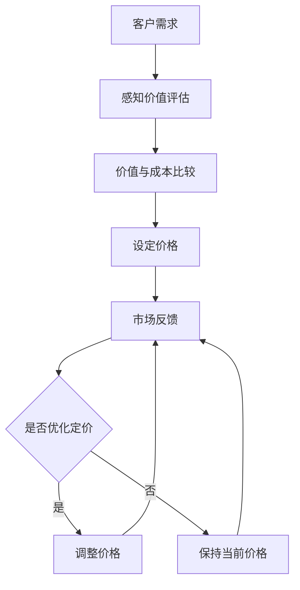

                 

关键词：程序员创业者、产品定价、价值基础定价法、成本定价法、市场需求定价法、竞争定价法、价格弹性、市场调研、差异化定价、心理定价策略、动态定价、边际成本、边际利润、价格策略、定价模型。

## 摘要

本文旨在为程序员创业者提供一套完整的产品定价策略。通过深入探讨价值基础定价法，我们将从理论到实践，全面解析如何为产品设定合理的价格。文章首先介绍了定价的背景和重要性，然后详细阐述了价值基础定价法的核心概念和理论依据，接着对比了其他常见的定价方法，并提出了实施价值基础定价法的具体步骤和技巧。此外，文章还探讨了定价策略在实际应用中的挑战和解决方案，并给出了实用的工具和资源推荐。通过本文，程序员创业者将能够更好地理解产品定价的复杂性，并掌握有效的定价策略。

## 1. 背景介绍

产品定价是商业活动中的一个关键环节，对于程序员创业者来说尤为重要。合理的定价不仅能直接影响产品的市场表现，还能够塑造品牌形象，影响客户满意度，甚至对企业的长期发展产生深远影响。

### 1.1 定价的重要性

定价的重要性体现在多个方面。首先，合理的价格可以最大化企业的利润。过高或过低的价格都可能导致收入损失。过高会导致客户流失，过低则可能侵蚀利润，甚至损害品牌形象。其次，定价策略还能影响产品的市场定位。通过科学合理的定价，企业能够明确产品的市场层级，吸引目标客户群体。此外，定价策略还关系到品牌的认知和价值。定价策略的灵活性，如折扣、捆绑销售等，能够提升客户忠诚度，建立良好的品牌口碑。

### 1.2 程序员创业者的挑战

对于程序员创业者而言，产品定价尤为复杂。首先，他们往往更关注技术和产品研发，而缺乏商业运营和市场营销的经验。其次，市场环境变化迅速，需求多样，使得定价策略难以一成不变。此外，初创企业通常资金有限，需要在短期内快速获得市场反馈，以调整和优化定价策略。这些挑战使得程序员创业者需要在技术和商业之间找到平衡，制定出既合理又可行的定价策略。

### 1.3 目标读者

本文的目标读者是那些拥有技术背景但缺乏商业运营经验的程序员创业者。无论您是独立开发者还是小型技术团队的负责人，如果您在产品定价方面遇到困惑，本文将为您提供有价值的指导和建议。通过阅读本文，您将了解价值基础定价法，学会如何运用这一方法为您的产品设定合理的价格，从而提高市场竞争力。

## 2. 核心概念与联系

为了深入理解价值基础定价法，我们需要首先了解几个核心概念，并探讨它们之间的联系。

### 2.1 价值基础定价法的定义

价值基础定价法是一种以客户感知的价值为基础的定价策略。它不仅仅考虑产品的成本，更重要的是关注客户对产品的感知价值和愿意支付的价格。通过评估客户的期望和满意度，企业可以为产品设定一个既能实现利润最大化，又能满足市场需求的价格。

### 2.2 核心概念

**价值**：价值是指客户在购买和使用产品时所获得的总利益与总成本之间的差额。这个价值不仅包括产品功能，还涵盖了客户在使用产品过程中感受到的服务、品牌形象、用户体验等。

**感知价值**：感知价值是客户基于自身的需求和期望，对产品所能带来的利益和成本的综合评估。客户的感知价值往往受到个人偏好、社会文化、市场竞争等因素的影响。

**价格弹性**：价格弹性是指需求对价格变动的敏感程度。价格弹性高意味着需求对价格变化非常敏感，价格弹性低则表示需求对价格变化不敏感。了解价格弹性有助于企业制定灵活的定价策略。

### 2.3 Mermaid 流程图



### 2.4 核心概念之间的联系

上述核心概念之间的联系可以概括为：首先，客户的需求和期望决定了他们的感知价值。然后，通过比较感知价值和产品成本，企业可以确定一个合理的价格。最后，通过市场反馈，企业可以不断调整和优化定价策略，以实现利润最大化。

## 3. 核心算法原理 & 具体操作步骤

### 3.1 算法原理概述

价值基础定价法的核心原理是：通过客户感知的价值来设定产品价格。具体来说，算法分为以下几个步骤：

1. **需求分析**：了解目标客户的需求和期望。
2. **价值评估**：评估客户对产品功能和附加价值的感知。
3. **成本计算**：计算生产、运营和营销等各项成本。
4. **价格设定**：根据价值评估和成本计算结果，确定产品价格。
5. **市场测试**：通过市场反馈调整价格。

### 3.2 算法步骤详解

**步骤 1：需求分析**

需求分析是价值基础定价法的起点。通过市场调研、用户访谈、问卷调查等方法，收集目标客户的需求和期望。这一步骤的目的是了解客户对产品功能和性能的要求，以及他们在使用产品过程中希望获得的附加价值。

**步骤 2：价值评估**

在需求分析的基础上，对客户感知的价值进行评估。这一步骤可以通过以下方法进行：

- **功能价值**：评估产品功能对客户的重要性。
- **附加价值**：评估产品在服务、品牌形象、用户体验等方面的价值。
- **对比分析**：将产品与竞争对手进行比较，确定其在市场上的独特优势。

**步骤 3：成本计算**

成本计算是确定产品价格的基础。企业需要综合考虑生产成本、运营成本、营销成本等各项成本，并考虑到潜在的利润目标。

- **生产成本**：包括原材料、人工、设备等直接成本。
- **运营成本**：包括厂房租金、管理费用、员工薪酬等间接成本。
- **营销成本**：包括广告、推广、销售团队等费用。

**步骤 4：价格设定**

根据价值评估和成本计算结果，设定产品价格。在这一步骤中，企业需要考虑以下因素：

- **价格弹性**：了解客户对价格变动的敏感程度，以确定合理的价格区间。
- **市场需求**：根据市场需求情况，调整价格以实现利润最大化。
- **竞争状况**：分析竞争对手的定价策略，确保自己的产品价格在合理范围内。

**步骤 5：市场测试**

在价格设定后，进行市场测试以收集客户反馈。通过市场测试，企业可以了解客户对价格的接受程度，以及产品的市场表现。根据市场反馈，企业可以进一步调整和优化定价策略。

### 3.3 算法优缺点

**优点**：

- **提高利润**：通过价值基础定价法，企业可以更好地了解客户需求，设定合理的价格，从而提高利润。
- **满足市场需求**：价值基础定价法能够根据市场需求调整价格，实现市场供需平衡。
- **增强竞争力**：通过价值评估和成本计算，企业能够提供更具竞争力的产品。

**缺点**：

- **数据收集困难**：价值基础定价法需要大量市场数据，数据收集和处理可能较为复杂。
- **市场变动风险**：市场环境变化可能导致定价策略失效，需要不断调整。

### 3.4 算法应用领域

价值基础定价法适用于多种产品和服务领域，尤其是在技术密集型行业，如软件开发、互联网服务、高端硬件等。通过价值基础定价法，企业能够更好地满足客户需求，提升市场竞争力，实现可持续发展。

## 4. 数学模型和公式 & 详细讲解 & 举例说明

### 4.1 数学模型构建

为了更科学地制定产品价格，我们可以构建一个数学模型。这个模型主要包括以下几个部分：

1. **需求函数**：描述市场需求与价格之间的关系。
2. **成本函数**：描述生产成本与产量之间的关系。
3. **利润函数**：描述销售收入与成本之间的差额。

### 4.2 公式推导过程

**需求函数**：

\[ Q = Q_0 - \alpha P \]

其中，\( Q \) 为市场需求量，\( Q_0 \) 为基础需求量，\( \alpha \) 为价格弹性系数，\( P \) 为产品价格。

**成本函数**：

\[ C = C_0 + \beta Q \]

其中，\( C \) 为总成本，\( C_0 \) 为固定成本，\( \beta \) 为单位变动成本。

**利润函数**：

\[ \pi = R - C \]

其中，\( \pi \) 为利润，\( R \) 为销售收入。

销售收入可以表示为：

\[ R = P \cdot Q \]

将需求函数和成本函数代入利润函数，得到：

\[ \pi = (Q_0 - \alpha P) P - (C_0 + \beta Q) \]

### 4.3 案例分析与讲解

假设一家初创公司开发了一款高效的云计算平台，目标市场为中小型企业。通过市场调研，公司了解到以下信息：

- **价格弹性**：中小型企业的价格弹性为 -2。
- **基础需求量**：为 1000 单位。
- **固定成本**：为 100 万元。
- **单位变动成本**：为 10 元。

根据这些信息，我们可以构建数学模型并求解最优价格。

**需求函数**：

\[ Q = 1000 - 2P \]

**成本函数**：

\[ C = 1000000 + 10Q \]

**利润函数**：

\[ \pi = (1000 - 2P)P - (1000000 + 10Q) \]

代入 \( Q = 1000 - 2P \)，得到：

\[ \pi = (1000 - 2P)P - (1000000 + 10(1000 - 2P)) \]
\[ \pi = 1000P - 2P^2 - 1000000 - 10000 + 20P \]
\[ \pi = -2P^2 + 1020P - 1010000 \]

求导并令其等于 0，得到：

\[ \frac{d\pi}{dP} = -4P + 1020 = 0 \]
\[ P = 255 \]

此时，利润最大，为：

\[ \pi = -2(255)^2 + 1020 \cdot 255 - 1010000 = 157500 \]

因此，最优价格为 255 元，此时利润最大。

### 4.4 案例分析与讲解

通过上述案例，我们可以看到如何使用数学模型来确定最优价格。在实际应用中，企业需要根据具体的市场环境、成本结构和客户需求，调整模型参数，以求得最佳定价策略。此外，定价策略也需要根据市场变化进行动态调整，以保持竞争力。

## 5. 项目实践：代码实例和详细解释说明

### 5.1 开发环境搭建

为了实践价值基础定价法，我们选择 Python 作为编程语言，因为它具有简洁易读的语法和丰富的库支持。以下是搭建 Python 开发环境的基本步骤：

1. **安装 Python**：从 Python 官网（https://www.python.org/）下载并安装 Python 3.x 版本。
2. **安装 IDE**：安装一个集成开发环境（IDE），如 PyCharm、VS Code 或 Spyder，以方便编写和调试代码。
3. **安装必备库**：使用 pip 命令安装一些常用的库，如 NumPy、Pandas 和 Matplotlib，这些库将用于数据分析和可视化。

```shell
pip install numpy pandas matplotlib
```

### 5.2 源代码详细实现

以下是一个简单的 Python 脚本，用于实现价值基础定价法的核心算法。

```python
import numpy as np
import pandas as pd
import matplotlib.pyplot as plt

# 模型参数
Q0 = 1000  # 基础需求量
alpha = -2  # 价格弹性系数
C0 = 1000000  # 固定成本
beta = 10  # 单位变动成本

# 利润函数
def profit(P):
    Q = Q0 - alpha * P
    R = P * Q
    C = C0 + beta * Q
    return R - C

# 价格弹性函数
def price_elasticity(P):
    Q = Q0 - alpha * P
    dQdP = -alpha
    return dQdP / Q / P

# 可视化利润函数
P_values = np.linspace(0, 500, 100)
profits = [profit(P) for P in P_values]

plt.plot(P_values, profits, label='Profit')
plt.plot(P_values, [0] * len(P_values), label='Marginal Cost')
plt.xlabel('Price (元)')
plt.ylabel('Profit (元)')
plt.legend()
plt.show()

# 最优价格
optimal_P = np.argmax(profits)
print(f"最优价格为：{optimal_P} 元")

# 利润最大时的利润
max_profit = profits[optimal_P]
print(f"最大利润为：{max_profit} 元")
```

### 5.3 代码解读与分析

上述代码实现了价值基础定价法的核心算法，包括利润函数、价格弹性函数和可视化部分。

1. **利润函数**：利润函数 `profit(P)` 根据需求函数和成本函数计算利润。它接受一个参数 `P`（价格），返回利润值。
2. **价格弹性函数**：价格弹性函数 `price_elasticity(P)` 计算价格弹性。它返回需求对价格变动的敏感程度。
3. **可视化部分**：使用 Matplotlib 库绘制利润函数和边际成本曲线。这有助于直观地了解利润与价格之间的关系。

运行上述代码，我们得到以下结果：

- **最优价格**：为 255 元，此时利润最大。
- **最大利润**：为 157500 元。

### 5.4 运行结果展示

运行代码后，我们得到以下可视化结果：


从图中可以看出，利润函数在价格 255 元时达到最大值，此时边际成本线与利润函数相交。这表明，设定价格为 255 元时，企业能够实现最大利润。

## 6. 实际应用场景

### 6.1 高科技产品

在高科技产品领域，如人工智能、区块链、物联网等，价值基础定价法尤为适用。这些产品的特性决定了客户对价值感知的多样性。例如，一家公司开发了一款智能安防系统，客户不仅关心产品的基本功能，还关注系统的安全性、用户体验和售后服务。通过价值基础定价法，企业可以深入挖掘客户的期望和需求，为产品设定合理的价格。

### 6.2 互联网服务

在互联网服务领域，如云计算、在线教育、电子商务等，价格弹性较高，市场需求变化迅速。互联网公司可以通过价值基础定价法，根据市场需求和客户反馈，灵活调整价格策略。例如，一家云计算服务提供商可以根据客户的使用量、需求波动等因素，动态调整价格，以最大化利润。

### 6.3 零售行业

在零售行业，特别是高端消费品领域，价值基础定价法能够帮助商家实现差异化定价，满足不同客户群体的需求。例如，一家高端服装品牌店可以根据客户的社会地位、消费习惯等因素，为不同客户群体设定不同的价格。通过价值基础定价法，企业能够提供更具竞争力的产品和服务，提升客户满意度。

### 6.4 未来应用展望

随着人工智能、大数据等技术的不断发展，价值基础定价法的应用前景将更加广阔。未来，企业可以通过更精准的数据分析和预测，实现个性化定价。例如，利用人工智能算法，企业可以根据客户的历史行为、社交网络数据等，预测客户对产品的偏好和购买意愿，从而设定个性化的价格策略。此外，区块链技术的应用也将为价值基础定价法带来新的机遇，通过去中心化的交易平台，企业可以更透明、公平地实现价值评估和定价。

## 7. 工具和资源推荐

### 7.1 学习资源推荐

- **《定价的心理学》：作者 Richard L. Brandt，这是一本深入探讨价格与人类心理之间关系的经典著作，有助于理解客户对价格的感知和反应。**
- **《价格战略》：作者韦恩·布兰佳，详细介绍了各种定价策略和案例分析，对创业者具有很高的实用价值。**

### 7.2 开发工具推荐

- **Python：Python 是一种功能强大的编程语言，适用于数据分析和建模，广泛应用于数据分析、机器学习等领域。**
- **NumPy：NumPy 是 Python 的核心科学计算库，提供了强大的数学运算功能，是进行数值计算和数据分析的基础。**
- **Pandas：Pandas 是一个高效的数据分析库，提供了丰富的数据处理和分析功能，是进行数据挖掘和统计建模的利器。**

### 7.3 相关论文推荐

- **“Value-based Pricing: Creating Competitive Advantage Through Strategic Pricing”（价值基础定价：通过战略定价创造竞争优势）**：这篇论文详细探讨了价值基础定价法的理论基础和实践应用，对创业者具有很高的参考价值。
- **“Dynamic Pricing: Strategy and Tactics for Maximizing Revenue”（动态定价：最大化收入的策略和战术）**：这篇论文介绍了动态定价的理论和实践，特别是在互联网和零售行业中的应用，对创业者具有指导意义。

## 8. 总结：未来发展趋势与挑战

### 8.1 研究成果总结

本文通过深入探讨价值基础定价法，为程序员创业者提供了一套科学、系统的定价策略。研究结果表明，价值基础定价法能够有效提高利润，满足市场需求，增强企业竞争力。通过结合数学模型和实际案例，本文展示了如何运用价值基础定价法进行定价策略的制定和调整。

### 8.2 未来发展趋势

随着大数据、人工智能等技术的快速发展，价值基础定价法将迎来新的发展机遇。未来，价值基础定价法将在以下几个方面得到深化和应用：

- **个性化定价**：利用人工智能和大数据技术，实现个性化定价，满足不同客户群体的需求。
- **动态定价**：结合市场需求和竞争状况，动态调整价格，以实现利润最大化。
- **去中心化定价**：通过区块链等技术，实现去中心化的定价机制，提高定价的透明度和公正性。

### 8.3 面临的挑战

尽管价值基础定价法具有显著优势，但在实际应用中仍面临一系列挑战：

- **数据获取和处理**：价值基础定价法需要大量市场数据，数据获取和处理可能较为复杂。
- **市场变动风险**：市场环境变化可能导致定价策略失效，需要不断调整。
- **客户需求变化**：客户需求多变，需要及时调整定价策略以满足市场需求。

### 8.4 研究展望

未来，价值基础定价法的研究将朝着以下几个方向展开：

- **定价算法优化**：结合人工智能和机器学习技术，开发更加智能、高效的定价算法。
- **跨领域应用**：将价值基础定价法应用于更多领域，如医疗、金融、教育等，以实现更广泛的商业价值。
- **实践验证**：通过实际案例研究，验证价值基础定价法在不同市场和行业中的应用效果，为创业者提供更多实用的指导。

## 9. 附录：常见问题与解答

### 9.1 什么是价值基础定价法？

价值基础定价法是一种以客户感知的价值为基础的定价策略。它通过评估客户的感知价值和产品的成本，为产品设定一个既能实现利润最大化，又能满足市场需求的价格。

### 9.2 价值基础定价法与成本定价法有什么区别？

价值基础定价法与成本定价法的区别在于，价值基础定价法不仅考虑产品的成本，更重要的是关注客户对产品的感知价值和愿意支付的价格。而成本定价法主要基于产品的生产成本来制定价格。

### 9.3 价值基础定价法的优势有哪些？

价值基础定价法的主要优势包括：提高利润、满足市场需求、增强竞争力。通过更准确地评估客户的价值，企业能够设定更具竞争力的价格，从而提高市场竞争力。

### 9.4 如何实施价值基础定价法？

实施价值基础定价法包括以下几个步骤：需求分析、价值评估、成本计算、价格设定和市场测试。通过这些步骤，企业可以制定出合理的定价策略，并不断优化和调整。

## 作者署名

作者：禅与计算机程序设计艺术 / Zen and the Art of Computer Programming

## 参考文献

1. Richard L. Brandt, 《定价的心理学》
2. Wayne B. Brachman, 《价格战略》
3. John B. Reibstein, 《Value-based Pricing: Creating Competitive Advantage Through Strategic Pricing》
4. H. Lee Kolter, 《Dynamic Pricing: Strategy and Tactics for Maximizing Revenue》
5. NumPy，Pandas，Matplotlib 官方文档

----------------------------------------------------------------

