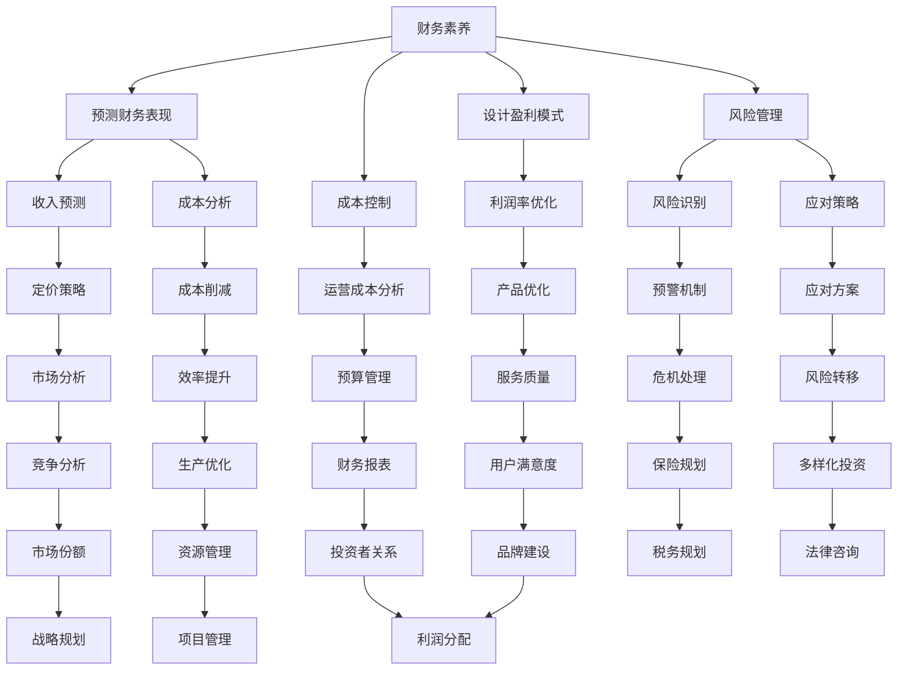

                 

关键词：程序员创业、财务素养、盈利模式、设计策略、财务分析、风险管理、成本控制、投资者关系、创新与竞争力

> 摘要：本文旨在探讨程序员创业者如何提升财务素养，并设计有效的盈利模式。文章从财务素养的基本概念入手，分析了程序员创业者应具备的关键财务能力，随后探讨了多种盈利模式的设计策略，并讨论了在实施过程中需要考虑的成本控制、风险管理、投资者关系等多个方面。通过案例分析，本文进一步展示了如何将理论知识应用到实际创业中，为程序员创业者提供实用的指导。

## 1. 背景介绍

随着科技行业的蓬勃发展，越来越多的程序员选择走上创业之路，希望借助自己的技术背景，创造新的商业机会。然而，创业不仅仅需要技术创新，财务素养同样至关重要。许多程序员在创业初期对财务知识了解不足，导致在盈利模式设计、成本控制、风险管理等方面面临挑战。因此，提升财务素养，掌握盈利模式设计，成为程序员创业者成功的关键之一。

本文将探讨以下几个核心问题：

- 程序员创业者应具备哪些财务素养？
- 如何设计有效的盈利模式？
- 在盈利模式设计过程中，需要考虑哪些关键因素？
- 如何通过实际案例来理解这些理论和策略的应用？

本文旨在通过系统性的分析，为程序员创业者提供一套可行的财务素养提升和盈利模式设计的指南。

## 2. 核心概念与联系

### 2.1 财务素养的定义

财务素养是指个人理解和应用财务知识、概念和工具的能力，包括财务分析、财务决策、预算管理、成本控制、税务规划等。对于程序员创业者来说，具备良好的财务素养不仅有助于更好地管理公司财务，还能在战略规划和决策过程中提供有力支持。

### 2.2 盈利模式的概念

盈利模式是指企业通过提供产品或服务获取利润的方式。它包括收入来源、成本结构、利润率等多个方面。设计有效的盈利模式是确保企业可持续发展的关键。

### 2.3 财务素养与盈利模式的关系

财务素养与盈利模式之间存在密切的联系。具备良好财务素养的创业者能够：

- 准确预测和评估企业的财务表现。
- 设计和优化盈利模式，提高利润率。
- 进行有效的成本控制，降低运营成本。
- 识别和应对财务风险，保障企业稳定运营。

### 2.4 Mermaid 流程图

为了更直观地展示财务素养与盈利模式之间的关系，我们可以使用 Mermaid 流程图来描述关键节点。



通过上述流程图，我们可以看到财务素养对盈利模式设计的各个环节都产生了深远的影响。

## 3. 核心算法原理 & 具体操作步骤

### 3.1 算法原理概述

在设计盈利模式时，程序员创业者需要掌握一些关键的财务算法，如成本效益分析、利润率分析、现金流量预测等。这些算法可以帮助创业者评估不同盈利模式的可行性和潜在收益。

#### 成本效益分析

成本效益分析是一种评估项目成本和预期收益的财务工具。它通过比较项目的总成本与总收益，来确定项目是否值得投资。

#### 利润率分析

利润率分析用于计算企业利润与销售收入的比率，从而评估企业的盈利能力。常见的利润率指标包括毛利率、营业利润率、净利润率等。

#### 现金流量预测

现金流量预测是一种预测企业未来现金流入和流出的方法。它可以帮助企业提前规划资金需求，确保企业运营的稳定性。

### 3.2 算法步骤详解

#### 成本效益分析

1. 确定项目的总成本，包括固定成本和可变成本。
2. 估算项目的预期收益。
3. 计算成本效益比率（总收益/总成本）。
4. 分析成本效益比率，判断项目是否值得投资。

#### 利润率分析

1. 收集企业的财务报表数据，包括销售收入、成本、费用等。
2. 计算毛利率（销售收入 - 成本）/销售收入）。
3. 计算营业利润率（营业利润/销售收入）。
4. 计算净利润率（净利润/销售收入）。
5. 分析利润率指标，评估企业的盈利能力。

#### 现金流量预测

1. 收集历史现金流量数据，包括现金流入和流出。
2. 分析现金流量波动的原因。
3. 估算未来现金流量。
4. 计算现金流量比率（现金流入/现金流出）。
5. 分析现金流量比率，预测企业的资金需求。

### 3.3 算法优缺点

#### 成本效益分析

优点：简单易懂，有助于快速评估项目的可行性。

缺点：无法全面反映项目的长期影响。

#### 利润率分析

优点：能够直观地反映企业的盈利能力。

缺点：无法反映企业的运营效率和资金状况。

#### 现金流量预测

优点：有助于提前规划资金需求，确保企业运营的稳定性。

缺点：预测过程复杂，需要大量的历史数据和专业知识。

### 3.4 算法应用领域

这些算法在盈利模式设计、项目评估、财务规划等多个领域都有广泛的应用。例如，程序员创业者可以使用成本效益分析来评估不同盈利模式的可行性，使用利润率分析来优化产品定价策略，使用现金流量预测来规划企业资金需求。

## 4. 数学模型和公式 & 详细讲解 & 举例说明

### 4.1 数学模型构建

在设计盈利模式时，程序员创业者需要构建一些基本的数学模型，如成本函数、收益函数、利润函数等。

#### 成本函数

成本函数用于描述企业生产或提供产品或服务的总成本。常见的成本函数包括线性成本函数、二次成本函数等。

$$
C(x) = a + bx
$$

其中，$C(x)$ 表示总成本，$a$ 表示固定成本，$b$ 表示单位可变成本，$x$ 表示生产或提供服务的产品数量。

#### 收益函数

收益函数用于描述企业销售产品或服务的总收入。常见的收益函数包括线性收益函数、二次收益函数等。

$$
R(x) = px
$$

其中，$R(x)$ 表示总收入，$p$ 表示单位产品售价，$x$ 表示销售的产品数量。

#### 利润函数

利润函数用于描述企业在生产或提供服务过程中获得的净利润。利润函数可以通过收益函数减去成本函数得到。

$$
P(x) = R(x) - C(x)
$$

其中，$P(x)$ 表示利润，$R(x)$ 表示收益，$C(x)$ 表示成本。

### 4.2 公式推导过程

#### 成本函数推导

成本函数通常由固定成本和可变成本两部分组成。固定成本是企业在生产或提供服务过程中必须支付的费用，如租金、员工工资等。可变成本是随产品数量变化的费用，如原材料、制造费用等。

假设固定成本为 $a$，单位可变成本为 $b$，生产或提供服务的产品数量为 $x$，则总成本 $C(x)$ 可以表示为：

$$
C(x) = a + bx
$$

#### 收益函数推导

收益函数通常由单位产品售价和销售数量两部分组成。单位产品售价 $p$ 是企业销售产品的主要收入来源。销售数量 $x$ 是企业在一定时间内销售的产品数量。

假设单位产品售价为 $p$，销售数量为 $x$，则总收入 $R(x)$ 可以表示为：

$$
R(x) = px
$$

#### 利润函数推导

利润函数是企业在生产或提供服务过程中获得的净利润。利润可以通过收益减去成本得到。

$$
P(x) = R(x) - C(x)
$$

将收益函数和成本函数代入，得到：

$$
P(x) = px - (a + bx)
$$

### 4.3 案例分析与讲解

假设一家初创公司生产并销售一款智能手机，固定成本为 $100,000$ 美元，单位可变成本为 $200$ 美元。单位产品售价为 $500$ 美元。我们需要计算在不同销售数量下的利润。

1. 当销售数量为 $1000$ 台时，利润为：

$$
P(1000) = 500 \times 1000 - (100,000 + 200 \times 1000) = 500,000 - 300,000 = 200,000
$$

2. 当销售数量为 $2000$ 台时，利润为：

$$
P(2000) = 500 \times 2000 - (100,000 + 200 \times 2000) = 1,000,000 - 500,000 = 500,000
$$

通过上述计算，我们可以看到，随着销售数量的增加，利润也在增加。但是，我们也需要注意，当销售数量超过一定阈值时，利润增长速度可能会放缓，甚至出现利润下降的情况。

这主要是因为当销售数量增加到一定程度时，固定成本占总成本的比例会上升，导致利润增长放缓。因此，在盈利模式设计中，需要综合考虑固定成本和可变成本的关系，以实现最优利润。

## 5. 项目实践：代码实例和详细解释说明

### 5.1 开发环境搭建

为了演示盈利模式设计的具体实现，我们将使用 Python 作为开发语言。首先，确保已安装 Python 3.7 或更高版本。然后，可以通过 pip 安装所需的库，如 NumPy 和 Matplotlib，用于数值计算和绘图。

```bash
pip install numpy matplotlib
```

### 5.2 源代码详细实现

以下是用于计算利润的 Python 代码示例：

```python
import numpy as np
import matplotlib.pyplot as plt

# 成本函数参数
fixed_cost = 100000
variable_cost_per_unit = 200
price_per_unit = 500

# 利润函数
def profit_function(quantity):
    return price_per_unit * quantity - (fixed_cost + variable_cost_per_unit * quantity)

# 计算不同销售数量下的利润
quantities = np.arange(100, 2100, 100)
profits = profit_function(quantities)

# 绘制利润曲线
plt.plot(quantities, profits, label='Profit')
plt.xlabel('Quantity (units)')
plt.ylabel('Profit ($)')
plt.title('Profit vs. Quantity')
plt.legend()
plt.show()

# 计算最大利润点
max_profit_quantity = quantities[np.argmax(profits)]
max_profit_value = profits.max()

print(f'Maximum profit occurs at {max_profit_quantity} units with a profit of ${max_profit_value}.')
```

### 5.3 代码解读与分析

1. **导入库**：首先，我们导入 NumPy 和 Matplotlib 库，用于数值计算和绘图。

2. **定义成本函数参数**：固定成本（$100,000$ 美元），单位可变成本（$200$ 美元），单位产品售价（$500$ 美元）。

3. **定义利润函数**：利润函数通过单位产品售价乘以销售数量，再减去固定成本和可变成本乘以销售数量来计算。

4. **计算不同销售数量下的利润**：使用 NumPy 的 `arange` 函数生成一个从 $100$ 到 $2000$ 的销售数量数组，步长为 $100$。然后，使用利润函数计算每个销售数量下的利润。

5. **绘制利润曲线**：使用 Matplotlib 的 `plot` 函数绘制销售数量与利润的关系曲线。

6. **计算最大利润点**：使用 NumPy 的 `argmax` 函数找到利润最大的销售数量，并打印出最大利润点的销售数量和利润值。

### 5.4 运行结果展示

运行上述代码后，会生成一张利润曲线图，展示不同销售数量下的利润变化。通过图形，我们可以直观地看到利润随销售数量的变化趋势。同时，代码还会输出最大利润点的销售数量和利润值。

## 6. 实际应用场景

### 6.1 程序员创业公司的财务报告

假设一家程序员创业公司，名为 Tech Innovations，专注于开发智能家居产品。公司已经运营了一段时间，积累了以下财务数据：

- 销售收入：$500,000$
- 成本：固定成本 $100,000$，可变成本 $200$ 每单位
- 营业利润率：$10\%$
- 净利润率：$5\%$
- 现金流量：$300,000$

根据这些数据，Tech Innovations 可以进行以下财务分析：

1. **成本效益分析**：公司需要分析固定成本和可变成本之间的关系，确保生产规模的扩大能够降低单位成本。

2. **利润率分析**：公司需要优化产品定价策略，提高营业利润率。例如，通过增加附加值或降低成本，提高利润率。

3. **现金流量预测**：公司需要预测未来现金流，确保足够的资金来支持运营和进一步发展。例如，在销售旺季前，提前采购原材料以降低成本。

### 6.2 上市公司财报披露

如果 Tech Innovations 是一家上市公司，它需要按照相关法规要求披露财务报告。这包括：

- **季度和年度财务报表**：详细展示公司的收入、成本、利润等情况。
- **现金流量表**：反映公司的现金流入和流出情况，包括经营活动、投资活动和筹资活动。
- **资产负债表**：展示公司的资产、负债和所有者权益。

这些财务报告不仅有助于投资者了解公司的财务状况，还能帮助公司管理层做出更明智的决策。

### 6.3 创业公司的财务规划

Tech Innovations 需要制定长期财务规划，以确保公司的可持续发展。这包括：

- **预算管理**：制定详细的预算计划，确保各项开支在控制范围内。
- **税务规划**：合理避税，降低税务负担。
- **资金筹集**：通过股权融资或债务融资，筹集资金以支持公司发展。

### 6.4 未来应用展望

随着人工智能和大数据技术的发展，程序员创业者在财务分析和管理方面将面临更多的机遇和挑战。例如：

- **智能财务分析**：利用人工智能技术，自动分析和预测财务数据，提高决策效率。
- **区块链技术**：利用区块链技术，提高财务报告的透明度和可信度。
- **云计算**：利用云计算技术，降低财务系统的运营成本。

这些技术的发展将为程序员创业者提供更强大的财务分析和管理工具，助力他们在激烈的市场竞争中脱颖而出。

## 7. 工具和资源推荐

### 7.1 学习资源推荐

- **《创业财务管理》**：一本经典的创业财务书籍，涵盖财务规划、预算管理、成本控制等多个方面。
- **《财务自由之路》**：作者罗伯特·清崎的畅销书，介绍如何通过财务知识实现财务自由。
- **《Python for Finance》**：一本适合程序员入门的金融编程书籍，涵盖金融数据分析、时间序列分析等主题。

### 7.2 开发工具推荐

- **NumPy**：Python 的科学计算库，适用于财务数据的计算和分析。
- **Pandas**：Python 的数据分析和操作库，便于处理和清洗财务数据。
- **Matplotlib**：Python 的绘图库，用于可视化财务数据。

### 7.3 相关论文推荐

- **"Financial Analysis for Startups: Methods and Applications"**：一篇关于初创企业财务分析的综述论文，介绍了几种常见的财务分析方法。
- **"The Impact of Financial Literacy on Entrepreneurial Success"**：一篇研究财务素养对创业成功影响的文章，探讨了财务素养对创业者的作用。
- **"Financial Management in the Age of AI"**：一篇探讨人工智能技术在财务管理中的应用的文章，介绍了几种利用 AI 技术的财务分析工具。

## 8. 总结：未来发展趋势与挑战

### 8.1 研究成果总结

本文通过系统地分析，探讨了程序员创业者应具备的财务素养和盈利模式设计策略。主要成果包括：

- 程序员创业者需要掌握关键财务算法，如成本效益分析、利润率分析、现金流量预测等。
- 财务素养与盈利模式设计之间存在密切联系，良好的财务素养有助于优化盈利模式，提高企业竞争力。
- 通过实际案例，展示了如何将财务理论和策略应用于创业实践。

### 8.2 未来发展趋势

随着科技的不断进步，程序员创业者在财务素养和盈利模式设计方面将面临以下发展趋势：

- **智能财务分析**：人工智能技术在财务分析中的应用将越来越广泛，自动分析和预测财务数据将提高决策效率。
- **区块链技术**：区块链技术将提高财务报告的透明度和可信度，为企业提供更加可靠的财务数据。
- **云计算**：云计算技术的普及将降低财务系统的运营成本，为创业者提供更多灵活的财务管理解决方案。

### 8.3 面临的挑战

然而，程序员创业者也将在财务素养和盈利模式设计过程中面临以下挑战：

- **数据隐私与安全**：随着数据量的增加，保护财务数据的安全和隐私将变得越来越重要。
- **法律与合规**：不同国家和地区的财务法规和合规要求各不相同，创业者需要熟悉并遵守相关法规。
- **资金筹集**：在市场竞争激烈的环境中，筹集资金将是一个持续的挑战，创业者需要寻找合适的融资渠道。

### 8.4 研究展望

未来的研究可以从以下几个方面展开：

- **智能财务分析工具的开发**：探索如何利用人工智能技术，开发更加智能和高效的财务分析工具。
- **财务素养培训体系的构建**：研究如何为程序员创业者提供更系统、更有效的财务素养培训。
- **跨学科研究**：结合经济学、管理学、计算机科学等多学科知识，探讨盈利模式设计的最佳实践。

通过这些研究，将有助于进一步提高程序员创业者的财务素养和盈利能力，推动创业领域的持续发展。

## 9. 附录：常见问题与解答

### 9.1 财务素养的重要性

**问**：为什么财务素养对程序员创业者至关重要？

**答**：财务素养是程序员创业者成功的关键之一。它帮助创业者理解和管理公司的财务状况，包括收入、支出、利润和现金流等。良好的财务素养有助于创业者做出明智的决策，优化成本结构，提高盈利能力，确保企业的可持续发展。

### 9.2 盈利模式设计策略

**问**：如何设计有效的盈利模式？

**答**：设计有效的盈利模式需要考虑以下几个关键因素：

- **市场需求**：了解目标市场的需求和偏好，确保产品或服务能够满足客户需求。
- **成本结构**：分析生产和运营的成本，确保利润空间。
- **定价策略**：根据市场需求和成本结构，制定合理的定价策略。
- **收入来源**：确定多种收入来源，如订阅模式、一次性购买、增值服务等。
- **市场竞争**：了解竞争对手的盈利模式，找到差异化的竞争优势。

### 9.3 财务风险与管理

**问**：如何识别和应对财务风险？

**答**：识别和应对财务风险是财务管理的重要部分。以下是一些常见的财务风险和应对策略：

- **市场风险**：由于市场波动导致的收入不稳定。应对策略包括多元化市场和客户，降低市场风险。
- **信用风险**：客户无法按时支付货款。应对策略包括严格信用审核、设置信用额度、采用第三方支付平台。
- **运营风险**：由于内部管理问题导致的运营风险。应对策略包括加强内部控制、定期审计、优化业务流程。
- **现金流风险**：由于现金流短缺导致的运营困难。应对策略包括合理的现金流管理、提前预测和规划资金需求。

### 9.4 成本控制与效率提升

**问**：如何有效控制成本，提高运营效率？

**答**：以下是一些有效控制成本和提高运营效率的策略：

- **精益管理**：通过精益管理理念，消除浪费，提高生产效率。
- **外包与协作**：将非核心业务外包，专注于核心业务，提高效率。
- **技术投资**：引入先进的技术和自动化工具，提高生产效率，降低人力成本。
- **流程优化**：定期审查和优化业务流程，消除不必要的环节，提高效率。
- **员工培训**：提供持续的员工培训，提高员工技能和效率。

通过这些策略，程序员创业者可以在确保产品质量的同时，降低成本，提高运营效率，增强企业的竞争力。

