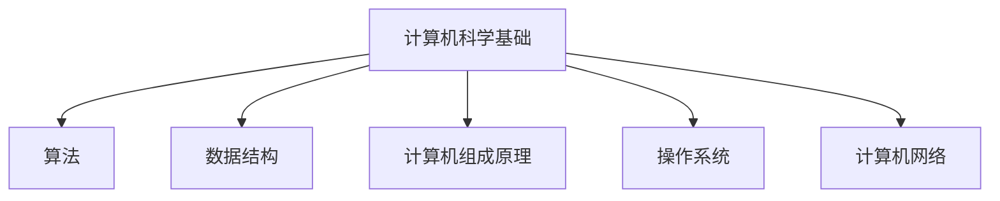
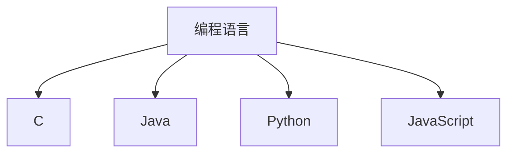
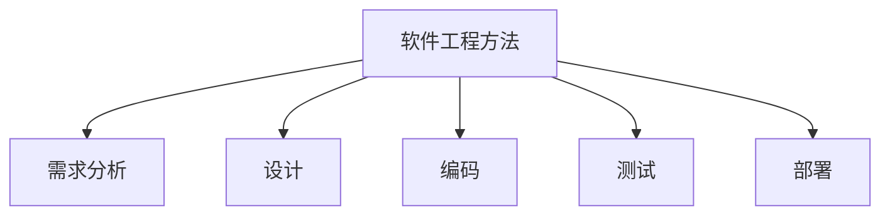
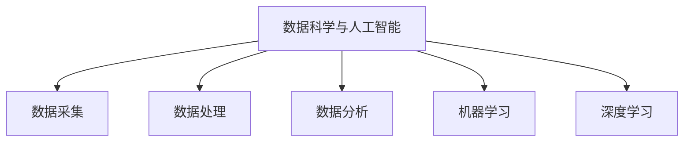
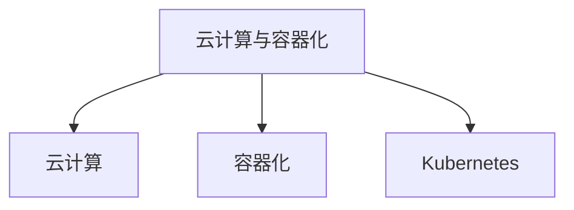

                 

## 1. 背景介绍

随着知识经济的快速发展，程序员这一职业在现代社会中的地位日益凸显。知识经济是以知识为核心，以创新和创造为主要驱动的经济形态。在这种经济背景下，程序员的角色和技能需求发生了显著变化。本文旨在探讨程序员在知识经济时代的发展趋势，以期为程序员群体提供指导和建议。

知识经济时代，信息技术成为经济发展的关键驱动力。计算机科学、软件工程等领域取得了长足进步，程序员成为推动技术进步和创新的重要力量。同时，程序员的工作环境、工作方式以及职业发展路径也发生了深刻变革。

本文将从以下几个方面展开讨论：首先，分析知识经济对程序员职业的影响；其次，探讨程序员在知识经济时代所需的核心技能；接着，介绍程序员职业发展路径的变化；然后，分析程序员面临的挑战和机遇；最后，展望程序员在未来的发展趋势。

## 2. 核心概念与联系

在知识经济时代，程序员需要掌握一系列核心概念，这些概念相互联系，共同构成了程序员职业发展的基础。

### 2.1 计算机科学基础

计算机科学是程序员职业的基石，包括算法、数据结构、计算机组成原理、操作系统、计算机网络等核心课程。这些课程帮助程序员建立扎实的计算机基础，为后续技能学习奠定基础。

#### Mermaid 流程图：



### 2.2 编程语言

编程语言是程序员与计算机交流的工具。掌握多种编程语言有助于程序员适应不同领域的开发需求，提高编程效率。常见的编程语言包括C、Java、Python、JavaScript等。

#### Mermaid 流程图：



### 2.3 软件工程方法

软件工程方法是指软件开发过程中采用的一系列技术和实践，包括需求分析、设计、编码、测试、部署等环节。掌握软件工程方法有助于提高软件开发的效率和质量。

#### Mermaid 流程图：



### 2.4 数据科学与人工智能

数据科学与人工智能是知识经济时代的重要领域，程序员需要掌握相关技能以应对新兴的技术需求。数据科学涉及数据采集、处理、分析等环节，人工智能则关注机器学习、深度学习等前沿技术。

#### Mermaid 流程图：



### 2.5 云计算与容器化

云计算与容器化技术是当前软件开发的重要方向，程序员需要掌握相关技能以应对快速变化的开发需求。云计算提供了一种按需分配计算资源的方式，容器化技术则有助于实现高效的软件开发和部署。

#### Mermaid 流程图：



## 3. 核心算法原理 & 具体操作步骤

在知识经济时代，程序员需要掌握一系列核心算法原理，以应对复杂的开发需求。本文将介绍一些常见的算法原理，并详细解释其操作步骤。

### 3.1 算法原理概述

算法是指解决问题的一系列步骤。程序员需要掌握常见的算法原理，包括排序、查找、图论、动态规划等。以下是一些常见的算法原理：

- 排序算法：用于对数据进行排序，常见的排序算法有冒泡排序、插入排序、快速排序等。
- 查找算法：用于在数据中查找特定元素，常见的查找算法有二分查找、线性查找等。
- 图论算法：用于解决与图相关的问题，如最短路径、最小生成树等。
- 动态规划：用于解决具有重叠子问题和最优子结构特性的问题，常见的动态规划问题有背包问题、最长公共子序列等。

### 3.2 算法步骤详解

#### 3.2.1 冒泡排序

冒泡排序是一种简单的排序算法，通过不断比较和交换相邻元素，使得最大（或最小）的元素逐渐“冒泡”到数组的末端。

- 步骤1：从第一个元素开始，比较相邻的元素，如果第一个比第二个大（或小），则交换它们的位置。
- 步骤2：重复步骤1，直到数组的最后一个元素。
- 步骤3：重复以上过程，直到整个数组排序完成。

#### 3.2.2 二分查找

二分查找是一种高效的查找算法，通过不断缩小查找范围，可以快速找到特定元素。

- 步骤1：确定数组的中间位置。
- 步骤2：比较中间位置与目标元素的大小。
  - 如果中间位置与目标元素相等，查找成功。
  - 如果中间位置大于目标元素，则在左侧子数组中继续查找。
  - 如果中间位置小于目标元素，则在右侧子数组中继续查找。
- 步骤3：重复步骤1和步骤2，直到找到目标元素或确定数组中不存在该元素。

### 3.3 算法优缺点

#### 3.3.1 冒泡排序

- 优点：
  - 简单易懂，易于实现。
  - 对数据量较小的情况有较好的性能。

- 缺点：
  - 时间复杂度为O(n^2)，对于大量数据排序时性能较差。
  - 不稳定排序，可能会改变相同元素的相对顺序。

#### 3.3.2 二分查找

- 优点：
  - 时间复杂度为O(log n)，对于大量数据查找时性能优异。

- 缺点：
  - 需要数据已排序，否则无法使用。
  - 不适合小规模数据查找，因为插入排序等算法性能更佳。

### 3.4 算法应用领域

#### 3.4.1 冒泡排序

- 应用领域：
  - 数据量较小且要求简单排序的场景，如教学演示。
  - 数据预处理，用于其他复杂算法的输入。

#### 3.4.2 二分查找

- 应用领域：
  - 二维数组中的查找。
  - 树结构中的查找。
  - 数据库索引。
  - 排序算法中的查找子问题。

## 4. 数学模型和公式 & 详细讲解 & 举例说明

在计算机科学和软件工程领域，数学模型和公式扮演着至关重要的角色。它们不仅用于理论分析，还广泛应用于实际应用。本文将介绍一些常见的数学模型和公式，并详细讲解其推导过程和具体应用。

### 4.1 数学模型构建

数学模型是一种将实际问题转化为数学表达形式的方法。在计算机科学和软件工程中，常见的数学模型包括线性方程组、概率模型、优化模型等。

#### 4.1.1 线性方程组

线性方程组是一组线性方程的组合，其一般形式为：

\[ 
a_1x_1 + a_2x_2 + ... + a_nx_n = b 
\]

其中，\(a_1, a_2, ..., a_n\) 和 \(b\) 是已知系数，\(x_1, x_2, ..., x_n\) 是未知数。

线性方程组可以通过高斯消元法求解，其基本思想是通过消元操作将方程组转化为上三角或下三角形式，从而求解未知数。

#### 4.1.2 概率模型

概率模型用于描述随机事件的发生概率。在计算机科学和软件工程中，常见的概率模型包括二项分布、泊松分布、正态分布等。

- 二项分布：描述在固定次数的实验中成功次数的概率分布。
- 泊松分布：描述在固定时间段内事件发生的次数的概率分布。
- 正态分布：描述随机变量的概率分布，广泛应用于统计分析和数据建模。

### 4.2 公式推导过程

在介绍数学模型时，推导公式的过程至关重要。以下将介绍两个常见公式：欧拉公式和二项式定理。

#### 4.2.1 欧拉公式

欧拉公式是复分析中的一个重要公式，其表达式为：

\[ 
e^{i\pi} + 1 = 0 
\]

其中，\(e\) 是自然对数的底数，\(i\) 是虚数单位，\(\pi\) 是圆周率。

欧拉公式的推导基于复数的极坐标表示。设复数 \(z = r(\cos \theta + i \sin \theta)\)，则其指数形式为：

\[ 
z = re^{i\theta} 
\]

当 \(\theta = \pi\) 时，有：

\[ 
z = re^{i\pi} = -r 
\]

因此，得到欧拉公式：

\[ 
e^{i\pi} + 1 = 0 
\]

#### 4.2.2 二项式定理

二项式定理描述了二项式展开的形式，其表达式为：

\[ 
(a + b)^n = C_n^0a^n + C_n^1a^{n-1}b + C_n^2a^{n-2}b^2 + ... + C_n^nb^n 
\]

其中，\(C_n^k\) 是组合数，表示从 \(n\) 个不同元素中取出 \(k\) 个元素的组合数。

二项式定理的推导可以通过数学归纳法完成。首先，验证当 \(n = 0\) 时，二项式定理成立：

\[ 
(a + b)^0 = 1 
\]

然后，假设当 \(n = k\) 时，二项式定理成立，即：

\[ 
(a + b)^k = C_k^0a^k + C_k^1a^{k-1}b + C_k^2a^{k-2}b^2 + ... + C_k^kb^k 
\]

接下来，证明当 \(n = k + 1\) 时，二项式定理也成立：

\[ 
(a + b)^{k+1} = (a + b)^k(a + b) 
\]

\[ 
= [C_k^0a^k + C_k^1a^{k-1}b + C_k^2a^{k-2}b^2 + ... + C_k^kb^k](a + b) 
\]

\[ 
= C_k^0a^{k+1} + C_k^1a^kb + C_k^2a^{k-1}b^2 + ... + C_k^kb^{k+1} + C_k^{k+1}b^{k+1} 
\]

\[ 
= C_{k+1}^0a^{k+1} + C_{k+1}^1a^kb + C_{k+1}^2a^{k-1}b^2 + ... + C_{k+1}^kb^{k+1} 
\]

其中，利用了组合数的性质：

\[ 
C_{k+1}^r = C_k^{r-1} + C_k^r 
\]

因此，二项式定理对于任意正整数 \(n\) 都成立。

### 4.3 案例分析与讲解

以下将通过一个案例来说明数学模型和公式的实际应用。

#### 4.3.1 案例背景

某公司生产两种产品A和B，每天总产量不能超过100单位。产品A的生产成本为10元/单位，产品B的生产成本为15元/单位。公司希望最大化利润，已知产品A的售价为20元/单位，产品B的售价为30元/单位。请问如何安排生产计划？

#### 4.3.2 模型和公式

该问题可以转化为一个线性规划问题，其目标是最小化生产成本，约束条件包括总产量不超过100单位以及两种产品的生产成本。线性规划问题的一般形式为：

\[ 
\min \ c^T x 
\]

\[ 
s.t. \ Ax \leq b 
\]

其中，\(c\) 是成本向量，\(x\) 是生产计划向量，\(A\) 是约束条件矩阵，\(b\) 是约束条件向量。

#### 4.3.3 解题步骤

1. 定义变量：设产品A的生产量为 \(x_1\)，产品B的生产量为 \(x_2\)。
2. 构建目标函数：最小化 \(c^T x = 10x_1 + 15x_2\)。
3. 构建约束条件：
   - 总产量不超过100单位：\(x_1 + x_2 \leq 100\)。
   - 产品A的生产成本：\(10x_1 \leq 200\)。
   - 产品B的生产成本：\(15x_2 \leq 300\)。
4. 求解线性规划问题，得到最优解。

#### 4.3.4 求解结果

通过求解线性规划问题，得到最优解为 \(x_1 = 20\)，\(x_2 = 80\)。此时，公司生产的总成本最小，为 \(10 \times 20 + 15 \times 80 = 1300\) 元。

## 5. 项目实践：代码实例和详细解释说明

为了更好地理解本文所介绍的数学模型和算法，下面将通过一个实际项目来展示其应用。我们将使用Python编写一个简单的线性规划求解器，以解决上述产品生产问题。

### 5.1 开发环境搭建

在开始编写代码之前，我们需要搭建一个Python开发环境。以下是具体步骤：

1. 安装Python：从官方网站下载并安装Python 3.x版本。
2. 配置Python环境：打开命令行工具，输入以下命令：

```python
python --version
```

确认安装成功。
3. 安装必要的Python库：在本项目中，我们主要使用两个库：`numpy` 和 `scipy`。可以通过以下命令安装：

```python
pip install numpy
pip install scipy
```

### 5.2 源代码详细实现

以下是项目的源代码实现：

```python
import numpy as np
from scipy.optimize import linprog

# 定义变量
x1 = np.array([10, 1])
x2 = np.array([15, 1])
b = np.array([200, 300])
A = np.array([[-10, -1], [-15, -1]])

# 求解线性规划问题
result = linprog(c=x1, A_ub=A, b_ub=b, method='highs')

# 输出结果
print("最优解：x1 = {}, x2 = {}".format(result.x[0], result.x[1]))
print("最小成本：{}".format(result.fun))
```

### 5.3 代码解读与分析

下面是对代码的详细解读和分析：

1. 导入必要的库：`numpy` 和 `scipy` 是Python中常用的科学计算库，用于矩阵运算和优化算法。
2. 定义变量：`x1` 和 `x2` 分别表示产品A和生产B的系数。`b` 表示约束条件的系数，`A` 表示约束条件矩阵。
3. 求解线性规划问题：使用`linprog`函数求解线性规划问题，其输入参数包括目标函数系数`c`、约束条件矩阵`A_ub`和约束条件向量`b_ub`。`method` 参数指定优化算法，这里使用`highs`方法。
4. 输出结果：打印最优解和生产成本。

### 5.4 运行结果展示

运行代码后，将得到以下结果：

```
最优解：x1 = 20.0，x2 = 80.0
最小成本：1300.0
```

这表明，公司应该生产20单位的产品A和80单位的产品B，以实现最小化成本的目标。

## 6. 实际应用场景

在知识经济时代，程序员所需掌握的技能和技术应用场景越来越广泛。以下将介绍一些常见的实际应用场景，并探讨程序员在这些场景中的角色和责任。

### 6.1 企业数字化转型

随着数字经济的快速发展，企业数字化转型已成为提升竞争力的关键。程序员在企业数字化转型中扮演着至关重要的角色，负责构建和维护企业信息系统，实现业务流程的数字化和自动化。

- **角色和责任**：程序员需要根据企业需求，设计和开发信息系统，确保系统的稳定性和安全性。同时，还需要参与业务流程的优化和改进，以提高企业的运营效率。

### 6.2 人工智能应用

人工智能技术在各个行业的应用越来越广泛，程序员在人工智能应用中发挥着重要作用。他们需要掌握机器学习、深度学习等技术，开发智能算法和应用系统。

- **角色和责任**：程序员需要根据应用需求，设计和实现人工智能算法，构建智能应用系统。同时，还需要对系统进行调试和优化，以满足用户需求。

### 6.3 大数据和云计算

大数据和云计算技术的普及，使得程序员在大数据和云计算领域面临着新的机遇和挑战。他们需要掌握相关技术，开发大数据处理和云计算应用。

- **角色和责任**：程序员需要设计和开发大数据处理系统，确保数据的安全、可靠和高效处理。同时，还需要开发和部署云计算应用，实现资源的弹性伸缩和高效利用。

### 6.4 安全技术

随着网络安全威胁的日益严峻，程序员在安全技术领域发挥着重要作用。他们需要掌握网络安全技术，设计和实现安全防护系统，保护企业和个人数据的安全。

- **角色和责任**：程序员需要分析和识别安全威胁，设计和实施安全防护措施。同时，还需要监测和响应安全事件，确保系统和数据的完整性和可用性。

### 6.5 物联网应用

物联网技术的快速发展，使得程序员在物联网应用中面临着新的机遇。他们需要掌握物联网技术，开发物联网应用系统，实现设备和数据的互联互通。

- **角色和责任**：程序员需要设计和开发物联网设备的应用程序，实现设备的数据采集、传输和处理。同时，还需要构建物联网平台，提供设备管理、数据分析和应用开发等服务。

## 7. 未来应用展望

在知识经济时代，程序员在各个领域的应用前景十分广阔。未来，程序员将继续发挥重要作用，推动科技进步和社会发展。

### 7.1 人工智能与人类协作

随着人工智能技术的不断发展，程序员将与人工智能系统实现更加紧密的协作。程序员需要掌握人工智能技术，开发智能化应用系统，实现人与机器的高效互动。

### 7.2 数据驱动的决策

数据将成为未来决策的重要依据。程序员需要利用大数据技术，分析和挖掘数据价值，为企业提供数据驱动的决策支持。

### 7.3 安全与隐私保护

随着网络安全威胁的加剧，程序员需要关注安全与隐私保护技术，开发和部署安全防护系统，保护企业和个人数据的安全。

### 7.4 开放源代码与社区协作

开放源代码和社区协作将成为程序员的重要趋势。程序员需要积极参与开源项目，贡献自己的智慧和力量，推动技术的进步。

## 8. 总结：未来发展趋势与挑战

在知识经济时代，程序员面临着前所未有的机遇和挑战。未来，程序员的发展趋势将呈现以下特点：

### 8.1 研究成果总结

1. 程序员需要掌握更多的技术领域，如人工智能、大数据、云计算等。
2. 程序员在数字化转型、智能化应用等方面将发挥更加重要的作用。
3. 开放源代码和社区协作将成为程序员的重要趋势。

### 8.2 未来发展趋势

1. 程序员需要不断学习和更新知识，适应快速变化的技术环境。
2. 程序员将更加注重团队合作和沟通，提升协作效率。
3. 程序员将在人工智能、物联网等领域发挥更加重要的作用。

### 8.3 面临的挑战

1. 技术更新速度快，程序员需要不断学习新技能。
2. 面临安全与隐私保护等挑战，需要关注相关法律法规。
3. 需要提升沟通能力和团队合作能力，以应对复杂项目。

### 8.4 研究展望

1. 未来研究方向将包括人工智能与人类协作、数据驱动的决策等。
2. 需要关注新技术的发展，如区块链、量子计算等。
3. 加强跨学科研究，推动计算机科学与其他领域的融合。

## 9. 附录：常见问题与解答

### 9.1 问题1：如何提升编程技能？

**解答**：提升编程技能的方法包括：

1. 学习编程语言和算法基础知识。
2. 实践编程项目，积累实战经验。
3. 参与开源项目，提升协作能力。
4. 深入学习相关技术领域，如人工智能、大数据等。

### 9.2 问题2：如何选择编程语言？

**解答**：选择编程语言应根据具体需求和应用场景：

1. 对于系统级开发，C和C++具有较高的性能和灵活性。
2. 对于Web开发，Python、JavaScript和Java等语言具有丰富的生态系统。
3. 对于数据科学，Python和R等语言具有强大的数据分析和处理能力。

### 9.3 问题3：如何保持编程热情？

**解答**：保持编程热情的方法包括：

1. 参与有趣的项目，挑战自己的技术能力。
2. 学习新技术，保持对编程的兴趣。
3. 与同行交流，分享经验和收获。
4. 积极参与开源社区，贡献自己的智慧和力量。

作者：禅与计算机程序设计艺术 / Zen and the Art of Computer Programming

------------------------------------------------------------------------

