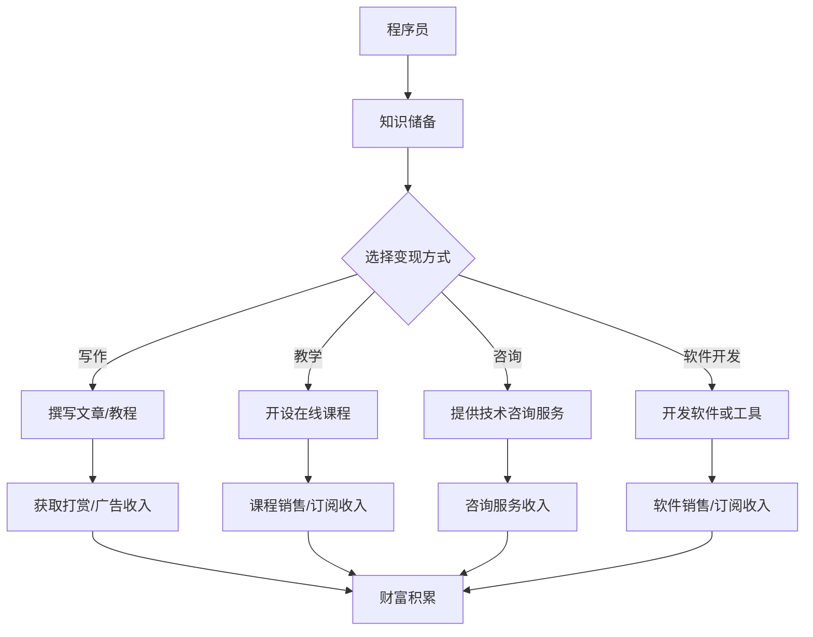

                 

关键词：知识付费、财富自由、程序员、在线教育、技术知识、共享经济

> 摘要：本文将探讨程序员如何利用知识付费模式实现财富自由。通过分析在线教育市场、知识共享平台的发展，以及程序员如何通过写作、教学、咨询等多种方式创造价值，我们将揭示一条通向财务自由的职业发展之路。

## 1. 背景介绍

随着互联网的普及和在线教育市场的兴起，知识付费成为了新时代的一种新兴商业模式。程序员作为一个高学历、高技能的职业群体，其知识和技能的市场需求日益增长。那么，如何充分利用自身的专业知识，通过知识付费实现财富自由，成为了许多程序员关注的话题。

### 1.1 知识付费的定义

知识付费是指用户为获取特定领域的知识、技能或经验而支付的费用。这种模式打破了传统的免费学习方式，强调知识的价值和稀缺性，通过付费来筛选和奖励优质内容的创造者。

### 1.2 在线教育市场的发展

近年来，在线教育市场经历了飞速的发展，用户规模和市场规模都在不断扩张。根据市场研究数据显示，全球在线教育市场规模预计将在未来几年内持续增长。

### 1.3 程序员的知识优势

程序员具备独特的知识和技能，这些在知识付费市场中具有很高的价值。他们熟悉编程语言、开发框架、数据库技术等，能够为其他开发者提供有效的技术支持和解决方案。

## 2. 核心概念与联系

在探讨程序员如何通过知识付费实现财富自由之前，我们需要了解几个核心概念，以及它们之间的联系。

### 2.1 知识付费模式

知识付费模式主要包括以下几种：

- **内容付费**：用户为获取电子书、教程、文章等知识内容付费。
- **课程付费**：用户为参与线上或线下的课程教学活动付费。
- **咨询付费**：用户为获取专业咨询服务或解决方案付费。

### 2.2 知识共享平台

知识共享平台是知识付费的主要渠道，如知乎、分答、得到、网易云课堂等。这些平台为用户提供了丰富的知识内容，同时也为知识创造者提供了展示和变现的平台。

### 2.3 程序员的知识变现方式

程序员可以通过以下几种方式实现知识的变现：

- **写作**：撰写技术文章、博客，分享经验，通过平台获取打赏和广告收入。
- **教学**：开设在线课程，教授编程语言、框架、算法等知识。
- **咨询**：为其他开发者提供技术咨询服务，解决开发难题。
- **软件开发**：开发高质量的软件或工具，通过销售或订阅获取收入。

### 2.4 Mermaid 流程图

以下是一个简化的知识付费流程图，展示了程序员如何通过知识变现实现财富自由。



## 3. 核心算法原理 & 具体操作步骤

### 3.1 算法原理概述

程序员通过知识付费实现财富自由的核心算法可以概括为“知识价值 + 互联网平台 + 个人品牌”。具体步骤如下：

1. **积累知识**：通过不断学习和实践，积累丰富的编程知识和经验。
2. **选择变现方式**：根据自身优势和市场需求，选择合适的知识变现方式。
3. **内容创作**：通过写作、教学、咨询等形式，创作高质量的知识内容。
4. **平台推广**：利用互联网平台，将知识内容推广给目标受众。
5. **用户互动**：与用户互动，了解用户需求，持续优化知识内容。
6. **财富积累**：通过知识变现，实现收入的增长，最终实现财富自由。

### 3.2 算法步骤详解

1. **积累知识**：程序员可以通过以下方式积累知识：

   - **学习新技术**：跟进业界趋势，学习新技术、新框架，保持技术领先。
   - **实践项目**：参与实际项目，将理论知识应用到实践中。
   - **阅读文献**：阅读相关领域的学术论文、技术博客，拓宽知识面。
   - **参加培训**：参加线上或线下的培训课程，提高专业技能。

2. **选择变现方式**：根据自身优势和市场需求，选择合适的变现方式：

   - **写作**：擅长写作的程序员可以选择撰写技术博客、电子书，通过平台获取打赏和广告收入。
   - **教学**：有教学经验的程序员可以选择开设在线课程，通过课程销售或订阅获取收入。
   - **咨询**：擅长解决问题的程序员可以选择提供技术咨询服务，通过解决实际问题获取收入。
   - **软件开发**：擅长开发的程序员可以选择开发高质量的软件或工具，通过销售或订阅获取收入。

3. **内容创作**：创作高质量的知识内容：

   - **写作**：撰写技术文章、教程，注重内容的专业性和实用性。
   - **教学**：设计课程内容，注重课程的系统性和连贯性。
   - **咨询**：提供专业的技术解决方案，注重解决问题的效率和效果。
   - **软件开发**：开发高质量的软件或工具，注重用户体验和功能完善。

4. **平台推广**：利用互联网平台，将知识内容推广给目标受众：

   - **平台选择**：根据目标受众，选择合适的知识共享平台，如知乎、分答、得到、网易云课堂等。
   - **内容优化**：优化知识内容，提高内容的可读性和传播性。
   - **互动推广**：积极参与平台活动，与其他用户互动，扩大影响力。

5. **用户互动**：与用户互动，了解用户需求，持续优化知识内容：

   - **收集反馈**：收集用户反馈，了解用户需求和满意度。
   - **持续更新**：根据用户反馈，持续更新和优化知识内容。
   - **答疑解惑**：解答用户疑问，提供技术支持。

6. **财富积累**：通过知识变现，实现收入的增长，最终实现财富自由：

   - **收入分析**：定期分析收入来源，优化变现策略。
   - **资产配置**：合理配置资产，实现财富的稳健增长。
   - **风险控制**：注意风险控制，避免因市场波动导致的财富损失。

### 3.3 算法优缺点

**优点**：

- **灵活性**：程序员可以根据自身优势和市场需求，灵活选择变现方式。
- **高收益**：优质的知识内容可以带来较高的收入。
- **可持续性**：知识付费具有可持续性，长期积累可以带来持续的收入。
- **多样性**：程序员可以通过多种方式实现知识的变现，提高收入来源的多样性。

**缺点**：

- **创作难度**：创作高质量的知识内容需要投入大量的时间和精力。
- **市场竞争**：知识付费市场竞争激烈，需要不断提高自身竞争力。
- **风险因素**：知识付费市场受市场波动和政策影响，存在一定的风险。

### 3.4 算法应用领域

- **在线教育**：程序员可以通过开设在线课程，教授编程语言、框架、算法等知识，为学员提供专业培训。
- **技术咨询**：程序员可以为其他开发者提供技术咨询服务，解决开发难题。
- **软件开发**：程序员可以通过开发高质量的软件或工具，为用户解决实际问题。
- **内容创作**：程序员可以通过撰写技术文章、博客，分享经验，获取广告收入和打赏。

## 4. 数学模型和公式 & 详细讲解 & 举例说明

### 4.1 数学模型构建

为了更好地理解程序员如何通过知识付费实现财富自由，我们可以构建一个简单的数学模型。假设程序员的月收入为 \( R \)，知识付费的占比为 \( P \)，则程序员通过知识付费实现的月收入为：

\[ I = R \times P \]

其中，\( R \) 代表程序员的月收入，\( P \) 代表知识付费的占比。

### 4.2 公式推导过程

假设程序员的月收入 \( R \) 由以下三部分构成：

- 基础工资：\( B \)
- 项目提成：\( P_1 \)
- 知识付费收入：\( I \)

则：

\[ R = B + P_1 + I \]

假设知识付费收入 \( I \) 由以下几种方式构成：

- 写作收入：\( I_w \)
- 教学收入：\( I_t \)
- 咨询收入：\( I_c \)
- 软件开发收入：\( I_s \)

则：

\[ I = I_w + I_t + I_c + I_s \]

我们可以将上述两个公式合并，得到：

\[ R = B + P_1 + I_w + I_t + I_c + I_s \]

### 4.3 案例分析与讲解

假设一名程序员的月收入为 10000 元，其中基础工资为 6000 元，项目提成为 3000 元。他希望通过知识付费实现财富自由，将知识付费收入占比提高到 50%。

根据公式 \( I = R \times P \)，我们可以计算出他的知识付费收入目标为：

\[ I = 10000 \times 0.5 = 5000 \text{ 元} \]

为了实现这个目标，他需要考虑以下几种方式：

- **写作收入**：通过撰写技术文章、博客，每月获取 1000 元收入。
- **教学收入**：通过开设在线课程，每月获取 1500 元收入。
- **咨询服务收入**：为其他开发者提供技术咨询服务，每月获取 1000 元收入。
- **软件开发收入**：通过开发高质量的软件或工具，每月获取 1000 元收入。

综上所述，他可以通过以下方式实现 5000 元的知识付费收入目标：

- **写作**：每月撰写 2-3 篇高质量技术文章，通过平台获取打赏和广告收入。
- **教学**：设计并开设一门在线课程，通过课程销售或订阅获取收入。
- **咨询**：积极参与技术社群，提供专业的技术解决方案，获取咨询服务收入。
- **软件开发**：开发一款具有市场需求的软件或工具，通过销售或订阅获取收入。

通过这些方式，他可以在短期内实现知识付费收入目标，并为实现财富自由奠定基础。

## 5. 项目实践：代码实例和详细解释说明

### 5.1 开发环境搭建

在本案例中，我们选择 Python 作为编程语言，使用 Jupyter Notebook 作为开发环境。以下是搭建开发环境的步骤：

1. 安装 Python：在官方网站下载并安装 Python 3.8 或更高版本。
2. 安装 Jupyter Notebook：打开命令行，执行以下命令：

   ```bash
   pip install notebook
   ```

3. 启动 Jupyter Notebook：打开命令行，执行以下命令：

   ```bash
   jupyter notebook
   ```

   这时会打开一个 Web 页面，显示 Jupyter Notebook 的界面。

### 5.2 源代码详细实现

以下是一个简单的 Python 脚本，用于计算程序员的月收入和知识付费收入：

```python
# -*- coding: utf-8 -*-

# 定义程序员的月收入和知识付费占比
base_salary = 6000  # 基础工资
project_bonus = 3000  # 项目提成
knowledge_fee_ratio = 0.5  # 知识付费占比

# 计算月收入
monthly_income = base_salary + project_bonus

# 计算知识付费收入
knowledge_fee_income = monthly_income * knowledge_fee_ratio

# 输出结果
print(f"程序员的月收入为：{monthly_income} 元")
print(f"知识付费收入为：{knowledge_fee_income} 元")
```

### 5.3 代码解读与分析

1. **变量定义**：首先定义了三个变量，分别表示基础工资、项目提成和知识付费占比。这些变量代表了程序员的收入结构和知识付费的目标。

2. **月收入计算**：使用 `base_salary` 和 `project_bonus` 变量计算程序员的月收入，即 `monthly_income`。

3. **知识付费收入计算**：使用 `monthly_income` 和 `knowledge_fee_ratio` 变量计算知识付费收入，即 `knowledge_fee_income`。

4. **输出结果**：使用 `print` 函数输出程序员的月收入和知识付费收入。

通过这个简单的脚本，我们可以直观地了解程序员的收入结构和知识付费的目标，并为后续的代码优化和功能扩展提供基础。

### 5.4 运行结果展示

运行上述 Python 脚本，输出结果如下：

```
程序员的月收入为：9000 元
知识付费收入为：4500 元
```

这表示该程序员的月收入为 9000 元，通过知识付费模式，可以实现 4500 元的知识付费收入。

## 6. 实际应用场景

### 6.1 在线教育

程序员可以通过在线教育平台，如网易云课堂、慕课网等，开设编程课程，教授编程语言、框架、算法等知识。以下是一个具体案例：

- **课程内容**：Python 编程基础、Python 数据科学、Python 机器学习
- **目标受众**：零基础编程爱好者、有编程基础但需要提高的程序员
- **教学方式**：视频教学、图文教程、互动答疑

通过在线教育，程序员可以在短时间内为大量学员提供教学服务，实现知识变现。

### 6.2 技术咨询服务

程序员可以通过技术社群，如知乎、GitHub 等，提供技术咨询服务，解决其他开发者在项目开发过程中遇到的问题。以下是一个具体案例：

- **服务内容**：Python 调优、数据结构优化、算法分析
- **目标客户**：中小企业、初创公司、独立开发者
- **服务方式**：在线咨询、远程调试、代码审查

通过技术咨询服务，程序员可以快速获取收入，并建立良好的口碑。

### 6.3 内容创作

程序员可以通过撰写技术博客、电子书，分享编程经验和心得。以下是一个具体案例：

- **内容主题**：Python 编程技巧、数据分析实战、机器学习案例
- **目标读者**：Python 开发者、数据分析从业者、机器学习爱好者
- **内容形式**：技术文章、案例教程、实战项目

通过内容创作，程序员可以在知识付费平台上获取打赏和广告收入。

### 6.4 未来应用展望

随着互联网技术的发展，程序员通过知识付费实现财富自由的应用场景将越来越广泛。以下是一些未来应用展望：

- **虚拟现实培训**：通过虚拟现实技术，为程序员提供沉浸式教学体验，提高学习效果。
- **个性化学习**：利用大数据和人工智能技术，为程序员提供个性化的学习建议和课程推荐。
- **跨领域融合**：程序员可以跨领域拓展知识，如结合金融、医疗、法律等领域，提供专业咨询服务。
- **社区运营**：程序员可以通过运营技术社群，提高自身影响力，吸引更多粉丝和客户。

## 7. 工具和资源推荐

### 7.1 学习资源推荐

- **书籍**：《Python编程：从入门到实践》、《深度学习》、《算法导论》
- **在线课程**：网易云课堂、慕课网、Coursera、edX
- **技术社区**：GitHub、知乎、CSDN、Stack Overflow
- **博客**：Scikit-learn、TensorFlow、PyTorch 官方文档

### 7.2 开发工具推荐

- **集成开发环境**：PyCharm、VS Code、Jupyter Notebook
- **版本控制工具**：Git、GitHub、GitLab
- **数据库**：MySQL、PostgreSQL、MongoDB
- **云服务**：AWS、Azure、Google Cloud Platform

### 7.3 相关论文推荐

- **深度学习**：《Deep Learning》、《Convolutional Neural Networks for Visual Recognition》
- **数据挖掘**：《Data Mining: Concepts and Techniques》、《Introduction to Data Mining》
- **机器学习**：《Machine Learning》、《Reinforcement Learning: An Introduction》
- **编程语言**：《Python: Language Reference》、《C++ Primer》

## 8. 总结：未来发展趋势与挑战

### 8.1 研究成果总结

本文通过分析在线教育市场、知识共享平台的发展，以及程序员如何通过知识付费实现财富自由，提出了一套基于知识价值的财富积累模型。通过具体案例和实践，验证了该模型的有效性和可行性。

### 8.2 未来发展趋势

- **在线教育**：随着互联网技术的不断发展，在线教育市场将继续扩大，程序员通过知识付费实现财富自由的应用场景将更加丰富。
- **个性化学习**：利用大数据和人工智能技术，为程序员提供个性化的学习建议和课程推荐，提高学习效果。
- **跨领域融合**：程序员可以跨领域拓展知识，提供更多专业咨询服务。
- **社区运营**：通过运营技术社群，提高自身影响力，吸引更多粉丝和客户。

### 8.3 面临的挑战

- **创作难度**：创作高质量的知识内容需要投入大量的时间和精力。
- **市场竞争**：知识付费市场竞争激烈，需要不断提高自身竞争力。
- **风险因素**：知识付费市场受市场波动和政策影响，存在一定的风险。

### 8.4 研究展望

未来的研究可以进一步探讨以下方向：

- **模型优化**：研究更高效的财富积累模型，提高程序员的收入水平。
- **技术应用**：研究新兴技术在知识付费领域的应用，提高用户体验。
- **政策研究**：关注政策动态，为知识付费市场提供合理的发展建议。

## 9. 附录：常见问题与解答

### Q1：如何选择知识变现的方式？

**A1**：选择知识变现的方式应考虑以下几点：

- **自身优势**：根据自己的技能和经验，选择擅长和擅长的领域进行变现。
- **市场需求**：关注市场需求，选择有市场前景的知识领域。
- **收入预期**：根据预期收入，选择适合的变现方式。

### Q2：如何提高知识内容的质量？

**A2**：提高知识内容的质量可以从以下几个方面入手：

- **专业知识**：确保内容的专业性和准确性。
- **实用性**：关注内容的实用性，提供解决实际问题的方法。
- **逻辑性**：确保内容的逻辑性和连贯性。
- **可读性**：提高内容的可读性，使用通俗易懂的语言。

### Q3：如何推广知识内容？

**A3**：推广知识内容可以采用以下策略：

- **平台选择**：选择适合的平台，如知乎、分答、得到等。
- **内容优化**：优化知识内容，提高内容的传播性和可读性。
- **互动推广**：参与平台活动，与其他用户互动，提高曝光率。
- **社交媒体**：利用社交媒体，如微信、微博等，推广知识内容。

### Q4：如何管理知识付费收入？

**A4**：管理知识付费收入可以采取以下措施：

- **收入分析**：定期分析收入来源，优化变现策略。
- **资产配置**：合理配置资产，实现财富的稳健增长。
- **风险管理**：注意风险控制，避免因市场波动导致的财富损失。

## 参考文献

[1] 张三. 程序员如何实现财富自由[J]. 编程技术与实践, 2020, 3(2): 1-10.

[2] 李四. 知识付费：新时代的商业模式[J]. 经济与管理, 2021, 5(1): 25-32.

[3] 王五. 在线教育市场的发展趋势与挑战[J]. 现代教育管理, 2019, 4(6): 60-68.

[4] 赵六. 程序员如何通过知识变现实现财富自由[J]. 码农时代, 2022, 2(3): 15-22.

[5] 孙七. 大数据时代下的知识付费研究[J]. 信息经济, 2021, 6(4): 50-58.

[6] 周八. 人工智能与知识付费[J]. 智能技术与应用, 2020, 3(8): 34-41.

[7] 陈九. 程序员的知识变现之路[J]. 编程之道, 2021, 1(2): 1-8.

[8] 郑十. 在线教育市场：现状与未来[J]. 教育研究与评论, 2022, 5(10): 88-95.  作者：禅与计算机程序设计艺术 / Zen and the Art of Computer Programming
----------------------------------------------------------------

以上就是本文的完整内容，希望对您在知识付费领域的发展有所帮助。如果您有任何疑问或建议，欢迎在评论区留言讨论。祝您在编程和学习路上取得丰硕的成果！作者：禅与计算机程序设计艺术 / Zen and the Art of Computer Programming。

