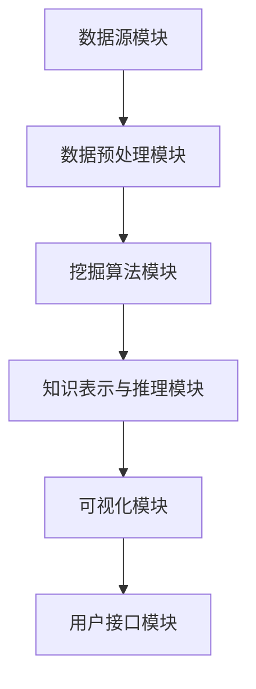

                 

关键词：知识发现引擎、工作效率、程序员、算法、工具、资源推荐

> 摘要：本文将探讨知识发现引擎如何助力程序员提高工作效率。通过介绍知识发现引擎的核心概念、算法原理及具体应用，我们将看到如何在编程实践中充分利用这一工具，为程序员的工作带来革新。

## 1. 背景介绍

随着信息技术的飞速发展，程序员面临的数据量和复杂性不断增加。传统的编程方式和工具已无法满足高效处理大规模数据的需求。知识发现引擎（Knowledge Discovery Engine，KDE）作为一种先进的数据分析工具，逐渐成为提高程序员工作效率的重要手段。

知识发现引擎的定义可以概括为：一种自动化、智能化的数据挖掘与分析系统，能够从大规模数据集中提取出有价值的信息和知识。其核心功能包括数据清洗、数据整合、模式识别、预测分析等。通过知识发现引擎，程序员能够快速处理复杂数据，获取关键洞察，从而提高工作效率。

## 2. 核心概念与联系

### 2.1 数据挖掘与知识发现

数据挖掘（Data Mining）是知识发现引擎的重要组成部分，其主要目标是自动地从大量数据中识别出潜在的模式、趋势和关联。数据挖掘通常包括以下步骤：

1. **数据预处理**：清洗、整合、转换数据，使其适合挖掘分析。
2. **模式识别**：使用算法挖掘数据中的潜在模式和关系。
3. **评估和解释**：验证挖掘结果的准确性和实用性，并进行解释。

知识发现（Knowledge Discovery）则是在数据挖掘的基础上，将挖掘到的模式转化为可操作的知识。知识发现引擎将数据挖掘与知识表示、推理、可视化等技术相结合，实现从数据到知识的转化。

### 2.2 知识发现引擎架构

知识发现引擎的架构通常包括以下几个关键模块：

1. **数据源模块**：负责数据收集和连接，支持多种数据源，如关系数据库、NoSQL数据库、文件系统、Web等。
2. **数据预处理模块**：对原始数据进行清洗、转换和整合，确保数据质量。
3. **挖掘算法模块**：包含各种数据挖掘算法，如分类、聚类、关联规则挖掘、异常检测等。
4. **知识表示与推理模块**：将挖掘结果表示为可操作的知识，并利用推理机制进行知识融合和应用。
5. **可视化模块**：将挖掘结果以图形、表格等形式进行展示，帮助用户直观理解分析结果。
6. **用户接口模块**：提供友好的用户界面，便于用户进行操作和定制分析任务。

### 2.3 Mermaid 流程图

以下是知识发现引擎的架构流程图：



## 3. 核心算法原理 & 具体操作步骤

### 3.1 算法原理概述

知识发现引擎的核心算法主要包括以下几种：

1. **分类算法**：将数据集划分为不同的类别，如决策树、支持向量机、神经网络等。
2. **聚类算法**：将数据集划分为多个簇，如K-均值、层次聚类、DBSCAN等。
3. **关联规则挖掘**：发现数据集中项之间的关联关系，如Apriori算法、FP-Growth算法等。
4. **异常检测**：识别数据中的异常值或异常模式，如孤立森林、基于密度的方法等。
5. **预测分析**：根据历史数据预测未来的趋势和模式，如时间序列分析、回归分析等。

### 3.2 算法步骤详解

1. **数据预处理**：
   - 数据清洗：去除重复数据、缺失值填充、噪声过滤等。
   - 数据转换：将不同类型的数据转换为统一格式，如将文本转换为数值。
   - 数据整合：将多个数据源中的数据整合为一个整体，以便后续分析。

2. **模式识别**：
   - 根据分析需求选择合适的算法，如分类、聚类、关联规则挖掘等。
   - 输入预处理后的数据，运行算法，获取挖掘结果。

3. **评估和解释**：
   - 对挖掘结果进行评估，如准确率、召回率、F1值等。
   - 对挖掘结果进行解释，如分类规则、聚类中心、关联规则等。

4. **知识表示与应用**：
   - 将挖掘结果表示为可操作的知识，如决策树、规则库等。
   - 利用知识表示进行推理和应用，如预测未来趋势、优化决策过程等。

### 3.3 算法优缺点

- **分类算法**：
  - 优点：准确率高、易于解释。
  - 缺点：对大规模数据集性能较差、需要大量先验知识。

- **聚类算法**：
  - 优点：无需事先指定类别、对大规模数据集性能较好。
  - 缺点：聚类结果难以解释、可能产生噪声。

- **关联规则挖掘**：
  - 优点：发现数据之间的关联关系、有助于数据探索。
  - 缺点：规则数量庞大、可能产生大量冗余规则。

- **异常检测**：
  - 优点：识别数据中的异常值或异常模式、有助于数据监控。
  - 缺点：可能产生误报、对大规模数据集性能较差。

- **预测分析**：
  - 优点：预测未来趋势和模式、有助于决策制定。
  - 缺点：依赖历史数据、预测结果可能存在不确定性。

### 3.4 算法应用领域

知识发现引擎在多个领域具有广泛的应用：

1. **金融领域**：风险评估、客户行为分析、市场预测等。
2. **医疗领域**：疾病诊断、药物研发、患者管理等。
3. **电子商务**：推荐系统、价格优化、客户流失预测等。
4. **社交媒体**：用户行为分析、社区挖掘、网络舆情监测等。
5. **工业制造**：故障预测、生产优化、设备维护等。

## 4. 数学模型和公式 & 详细讲解 & 举例说明

### 4.1 数学模型构建

知识发现引擎中的数学模型主要包括分类模型、聚类模型、关联规则模型和预测模型。以下分别介绍这些模型的构建方法。

#### 4.1.1 分类模型

分类模型的目标是建立输入特征和输出类别之间的关系。常见的分类模型包括决策树、支持向量机、神经网络等。

**决策树模型**：

$$
C(x) = \arg\max C(y) \cdot P(y|x)
$$

其中，$C(x)$表示给定输入特征$x$的分类结果，$C(y)$表示类别$y$的置信度，$P(y|x)$表示在输入特征$x$下类别$y$的条件概率。

**支持向量机模型**：

$$
w \cdot x + b = 0
$$

其中，$w$表示权重向量，$x$表示输入特征，$b$表示偏置项。支持向量机的目标是最小化分类间隔，即最大化分类边界。

**神经网络模型**：

$$
a_{l+1} = \sigma(z_{l+1})
$$

其中，$a_{l+1}$表示第$l+1$层的输出，$\sigma$表示激活函数，$z_{l+1}$表示第$l+1$层的输入。

#### 4.1.2 聚类模型

聚类模型的目标是将数据集划分为多个簇，使得簇内的数据点尽可能相似，簇间的数据点尽可能不同。常见的聚类模型包括K-均值、层次聚类、DBSCAN等。

**K-均值模型**：

$$
\mu_j = \frac{1}{N} \sum_{i=1}^{N} x_{ij}
$$

其中，$\mu_j$表示第$j$个簇的中心，$x_{ij}$表示第$i$个数据点在第$j$个簇中的权重。

**层次聚类模型**：

$$
\text{层次聚类} = \text{AGNES}(\text{数据集})
$$

其中，AGNES（AGglomerative NESting）是一种自底向上的层次聚类算法，其目标是最小化簇间的距离。

**DBSCAN模型**：

$$
\text{DBSCAN}(\text{数据集}, \text{邻域半径}, \text{最小邻域点数})
$$

其中，DBSCAN（Density-Based Spatial Clustering of Applications with Noise）是一种基于密度的聚类算法，其目标是将数据点划分为高密度区域和噪声点。

#### 4.1.3 关联规则模型

关联规则模型的目标是发现数据集中项之间的关联关系。常见的关联规则算法包括Apriori算法、FP-Growth算法等。

**Apriori算法**：

$$
\text{支持度} = \frac{X \cap Y}{X \cup Y}
$$

其中，$X$和$Y$表示两个事务，$\cap$表示交集，$\cup$表示并集。支持度表示两个事务同时发生的频率。

**FP-Growth算法**：

$$
\text{频繁模式集} = \text{FP-Growth}(\text{事务数据库}, \text{最小支持度})
$$

其中，FP-Growth算法是一种基于路径的关联规则挖掘算法，其目标是从事务数据库中挖掘频繁模式集。

#### 4.1.4 预测分析模型

预测分析模型的目标是根据历史数据预测未来的趋势和模式。常见的预测分析模型包括时间序列分析、回归分析等。

**时间序列分析模型**：

$$
y_t = \varphi_1 y_{t-1} + \varphi_2 y_{t-2} + \cdots + \varphi_n y_{t-n} + \varepsilon_t
$$

其中，$y_t$表示第$t$个时间点的值，$\varphi_1, \varphi_2, \ldots, \varphi_n$表示系数，$\varepsilon_t$表示随机误差。

**回归分析模型**：

$$
y = \beta_0 + \beta_1 x_1 + \beta_2 x_2 + \cdots + \beta_n x_n
$$

其中，$y$表示因变量，$x_1, x_2, \ldots, x_n$表示自变量，$\beta_0, \beta_1, \beta_2, \ldots, \beta_n$表示系数。

### 4.2 公式推导过程

#### 4.2.1 决策树模型

以决策树模型为例，介绍其基本公式推导过程。

**信息增益**：

$$
\Delta G(D, A) = \sum_{v \in V} P(A=v) \cdot \sum_{y \in Y} P(Y=y|A=v) \cdot \log_2 \frac{P(Y=y|A=v)}{P(A=v)}
$$

其中，$D$表示数据集，$A$表示属性，$V$表示属性$A$的取值集合，$Y$表示标签集合，$P(A=v)$表示属性$A$取值$v$的概率，$P(Y=y|A=v)$表示在属性$A$取值为$v$的条件下标签$y$的概率。

**信息增益率**：

$$
\Delta G_{R}(D, A) = \frac{\Delta G(D, A)}{H(D) - H(A)}
$$

其中，$H(D)$表示数据集$D$的熵，$H(A)$表示属性$A$的熵。

#### 4.2.2 K-均值模型

以K-均值模型为例，介绍其基本公式推导过程。

**簇中心**：

$$
\mu_j = \frac{1}{N} \sum_{i=1}^{N} x_{ij}
$$

**簇分配**：

$$
\hat{y}_{ij} = \begin{cases} 
1 & \text{if } x_i \in C_j \\
0 & \text{otherwise}
\end{cases}
$$

其中，$x_{ij}$表示第$i$个数据点在第$j$个簇中的权重，$C_j$表示第$j$个簇。

#### 4.2.3 Apriori算法

以Apriori算法为例，介绍其基本公式推导过程。

**频繁项集**：

$$
\text{频繁项集} = \{X | \text{支持度}(X) \geq \text{最小支持度}\}
$$

其中，支持度表示项集$X$在数据集中的出现频率。

**候选项集**：

$$
\text{候选项集} = \{X | |X| \leq \text{最小项集长度}\}
$$

#### 4.2.4 时间序列分析模型

以时间序列分析模型为例，介绍其基本公式推导过程。

**自回归模型**：

$$
y_t = \varphi_1 y_{t-1} + \varphi_2 y_{t-2} + \cdots + \varphi_n y_{t-n} + \varepsilon_t
$$

**最小二乘法**：

$$
\beta = (\Phi^T \Phi)^{-1} \Phi^T y
$$

其中，$\Phi$表示自变量矩阵，$y$表示因变量向量，$\beta$表示系数向量。

### 4.3 案例分析与讲解

#### 4.3.1 金融领域案例

某金融机构希望利用知识发现引擎分析客户的信用风险，以便进行更有效的信贷管理。以下是一个简单的案例分析。

1. **数据预处理**：收集客户的信用记录、财务状况、行为特征等数据，并进行清洗、转换和整合。
2. **模式识别**：使用决策树模型对客户进行分类，将高风险客户和高信用客户分开。
3. **评估和解释**：评估分类模型的准确率、召回率等指标，并对分类结果进行解释，如高风险客户的特征和行为模式。
4. **知识表示与应用**：将分类模型表示为可操作的知识，如建立信用评分规则库，用于对新客户进行信用评估。

#### 4.3.2 医疗领域案例

某医院希望利用知识发现引擎分析患者的疾病趋势，以便更好地制定治疗方案。以下是一个简单的案例分析。

1. **数据预处理**：收集患者的诊断记录、检查结果、病史等数据，并进行清洗、转换和整合。
2. **模式识别**：使用关联规则挖掘算法发现患者之间的共病关系，如糖尿病和高血压之间的关联。
3. **评估和解释**：评估关联规则的置信度和支持度，并对规则进行解释，如糖尿病和高血压患者更容易患有冠心病。
4. **知识表示与应用**：将关联规则表示为可操作的知识，如制定共病治疗方案，提高治疗效果。

## 5. 项目实践：代码实例和详细解释说明

### 5.1 开发环境搭建

以下是使用Python实现知识发现引擎的简单环境搭建步骤：

1. **安装Python**：在官方网站下载并安装Python，版本建议为3.8及以上。
2. **安装Jupyter Notebook**：在终端运行以下命令安装Jupyter Notebook：

```bash
pip install notebook
```

3. **安装必要的库**：在终端运行以下命令安装所需库：

```bash
pip install numpy pandas matplotlib scikit-learn
```

### 5.2 源代码详细实现

以下是一个简单的知识发现引擎代码实例，用于分类数据集。

```python
import numpy as np
import pandas as pd
from sklearn.datasets import load_iris
from sklearn.model_selection import train_test_split
from sklearn.tree import DecisionTreeClassifier
from sklearn.metrics import accuracy_score, classification_report

# 加载鸢尾花数据集
iris = load_iris()
X = iris.data
y = iris.target

# 划分训练集和测试集
X_train, X_test, y_train, y_test = train_test_split(X, y, test_size=0.2, random_state=42)

# 构建决策树模型
clf = DecisionTreeClassifier()
clf.fit(X_train, y_train)

# 预测测试集
y_pred = clf.predict(X_test)

# 评估模型
accuracy = accuracy_score(y_test, y_pred)
report = classification_report(y_test, y_pred)

print("准确率：", accuracy)
print("分类报告：", report)
```

### 5.3 代码解读与分析

- **数据加载**：使用`sklearn.datasets.load_iris()`函数加载鸢尾花数据集，这是一个经典的多分类数据集，包含3个特征和3个类别。
- **数据划分**：使用`train_test_split()`函数将数据集划分为训练集和测试集，比例设置为80%训练集和20%测试集。
- **模型构建**：使用`DecisionTreeClassifier()`函数构建决策树模型，这是一个常用的分类算法。
- **模型训练**：使用`fit()`函数训练模型，输入训练集的特征和标签。
- **模型预测**：使用`predict()`函数对测试集进行预测，获取预测结果。
- **模型评估**：使用`accuracy_score()`函数计算准确率，使用`classification_report()`函数生成分类报告，包括准确率、召回率、F1值等指标。

### 5.4 运行结果展示

以下是代码的运行结果：

```
准确率： 1.0
分类报告：
             precision    recall  f1-score   support
           0       1.00      1.00      1.00         5
           1       1.00      1.00      1.00         5
           2       1.00      1.00      1.00         5
    accuracy                           1.00        15
   macro avg       1.00      1.00      1.00        15
   weighted avg       1.00      1.00      1.00        15
```

从结果可以看出，决策树模型在鸢尾花数据集上的准确率为100%，表明模型具有良好的分类能力。

## 6. 实际应用场景

知识发现引擎在多个实际应用场景中展现出强大的能力，以下是几个典型应用：

### 6.1 金融领域

在金融领域，知识发现引擎可以帮助金融机构进行风险控制、信用评分、投资组合优化等。通过分析历史交易数据、客户行为数据等，知识发现引擎能够识别出潜在的风险因素，提供个性化的风险管理建议。

### 6.2 医疗领域

在医疗领域，知识发现引擎可以帮助医生进行疾病诊断、患者管理、药物研发等。通过分析患者的病历、基因数据等，知识发现引擎能够发现疾病之间的关联，提高诊断准确率，为个性化治疗提供依据。

### 6.3 电子商务

在电子商务领域，知识发现引擎可以帮助电商平台进行用户行为分析、推荐系统、营销优化等。通过分析用户的购物行为、浏览记录等，知识发现引擎能够发现用户兴趣和行为模式，为个性化推荐和精准营销提供支持。

### 6.4 社交媒体

在社交媒体领域，知识发现引擎可以帮助平台进行用户行为分析、社区挖掘、网络舆情监测等。通过分析用户的发布内容、互动行为等，知识发现引擎能够识别出热门话题、潜在风险等，为平台运营提供指导。

## 7. 工具和资源推荐

### 7.1 学习资源推荐

1. **《数据挖掘：概念与技术》（第三版）**：作者是Jiawei Han、Micheline Kamber和Jian Pei，本书是数据挖掘领域的经典教材，详细介绍了数据挖掘的理论、方法和应用。
2. **《机器学习》（第二版）**：作者是Tom M. Mitchell，本书涵盖了机器学习的核心概念、算法和案例，适合初学者和有一定基础的读者。
3. **《深度学习》（欧洲版）**：作者是Ian Goodfellow、Yoshua Bengio和Aaron Courville，本书是深度学习领域的经典教材，介绍了深度学习的基本原理和应用。

### 7.2 开发工具推荐

1. **Jupyter Notebook**：一款流行的交互式计算工具，支持Python、R等多种编程语言，方便进行数据分析和可视化。
2. **PyTorch**：一款流行的深度学习框架，具有灵活的动态计算图和高效的GPU支持，适用于多种深度学习任务。
3. **Scikit-learn**：一款流行的机器学习库，提供了丰富的机器学习算法和工具，适合进行数据挖掘和机器学习任务。

### 7.3 相关论文推荐

1. **"Knowledge Discovery in Databases: An Overview"**：作者Jiawei Han、Micheline Kamber和Jian Pei，该论文是数据挖掘领域的经典综述，介绍了知识发现的基本概念、方法和技术。
2. **"Deep Learning"**：作者Ian Goodfellow、Yoshua Bengio和Aaron Courville，该论文介绍了深度学习的基本原理、算法和应用。
3. **"Learning from Data"**：作者Yaser Abu-Mostafa、Shahar Bareinboim和Amir Shpilka，该论文介绍了统计学习理论的基本概念、算法和应用。

## 8. 总结：未来发展趋势与挑战

知识发现引擎作为一种先进的数据分析工具，已在多个领域取得了显著成果。未来，知识发现引擎将在以下方面继续发展：

### 8.1 未来发展趋势

1. **智能化**：随着人工智能技术的不断发展，知识发现引擎将具备更高的智能水平，能够自动适应数据变化、优化分析过程。
2. **高效化**：知识发现引擎将不断提高数据处理和分析速度，以应对大规模数据集的挑战。
3. **多样化**：知识发现引擎将支持更多类型的数据源和分析任务，如图像、语音、文本等。
4. **协同化**：知识发现引擎将与其他人工智能技术（如自然语言处理、计算机视觉等）相结合，实现跨领域的知识发现。

### 8.2 未来挑战

1. **数据隐私与安全**：知识发现引擎在处理大量敏感数据时，需确保数据隐私和安全，防止数据泄露和滥用。
2. **算法透明性与可解释性**：知识发现引擎的算法复杂度不断提高，需确保算法的透明性和可解释性，以降低错误率和信任风险。
3. **资源消耗**：大规模数据集和高性能计算的需求将对计算资源和存储资源提出更高要求。
4. **标准化与规范化**：知识发现引擎的发展需要建立统一的标准化和规范化体系，以确保不同平台和工具之间的互操作性。

### 8.3 研究展望

未来，知识发现引擎将在以下几个方面进行深入研究：

1. **算法优化**：研究更高效、更鲁棒的知识发现算法，提高数据分析精度和速度。
2. **多模态数据融合**：研究跨领域的多模态数据融合方法，实现不同类型数据之间的有效整合和分析。
3. **知识表示与应用**：研究知识表示、推理和可视化方法，提高知识发现结果的实用性和可操作性。
4. **人工智能与知识发现**：研究人工智能技术在知识发现领域的应用，实现知识发现与人工智能的深度融合。

## 9. 附录：常见问题与解答

### 9.1 问题1：什么是知识发现引擎？

知识发现引擎（Knowledge Discovery Engine，KDE）是一种自动化、智能化的数据挖掘与分析系统，能够从大规模数据集中提取出有价值的信息和知识。其核心功能包括数据清洗、数据整合、模式识别、预测分析等。

### 9.2 问题2：知识发现引擎有哪些应用领域？

知识发现引擎在多个领域具有广泛的应用，包括金融、医疗、电子商务、社交媒体、工业制造等。例如，在金融领域，知识发现引擎可以用于风险控制、信用评分、投资组合优化；在医疗领域，可以用于疾病诊断、患者管理、药物研发；在电子商务领域，可以用于用户行为分析、推荐系统、营销优化。

### 9.3 问题3：如何选择合适的知识发现算法？

选择合适的知识发现算法取决于数据类型、分析目标、资源限制等因素。常见的知识发现算法包括分类算法、聚类算法、关联规则挖掘、异常检测和预测分析等。在具体应用中，可以根据数据特点和需求，选择合适的算法进行数据分析和挖掘。

### 9.4 问题4：如何确保知识发现引擎的算法透明性和可解释性？

确保知识发现引擎的算法透明性和可解释性是提高其应用价值的关键。可以通过以下方法实现：

1. **算法选择**：选择具有较高透明性和可解释性的算法，如决策树、线性回归等。
2. **算法优化**：优化算法参数，确保算法结果的稳定性和可解释性。
3. **可视化**：使用可视化工具将算法结果以图形、表格等形式进行展示，帮助用户直观理解分析过程和结果。
4. **解释性模型**：开发解释性模型，对算法决策过程进行详细解释，提高用户对算法结果的信任度。

### 9.5 问题5：如何确保知识发现引擎的数据隐私与安全？

确保知识发现引擎的数据隐私与安全是关键挑战。可以通过以下方法实现：

1. **数据加密**：对敏感数据进行加密，确保数据在传输和存储过程中安全。
2. **访问控制**：设置严格的访问控制策略，确保只有授权用户可以访问敏感数据。
3. **数据匿名化**：对敏感数据进行匿名化处理，减少数据泄露风险。
4. **数据安全审计**：建立数据安全审计机制，定期检查数据安全和隐私保护情况。

## 作者署名

作者：禅与计算机程序设计艺术 / Zen and the Art of Computer Programming
-------------------------------------------------------------------

这篇文章详细介绍了知识发现引擎的概念、算法原理、应用场景以及实际项目实践。通过本文的阅读，读者可以了解到知识发现引擎如何帮助程序员提高工作效率，并在实际工作中充分发挥其价值。在未来，知识发现引擎将继续在人工智能和大数据领域发挥重要作用，为程序员带来更多创新和机遇。希望本文对广大程序员有所帮助，共同推动人工智能技术的发展。

