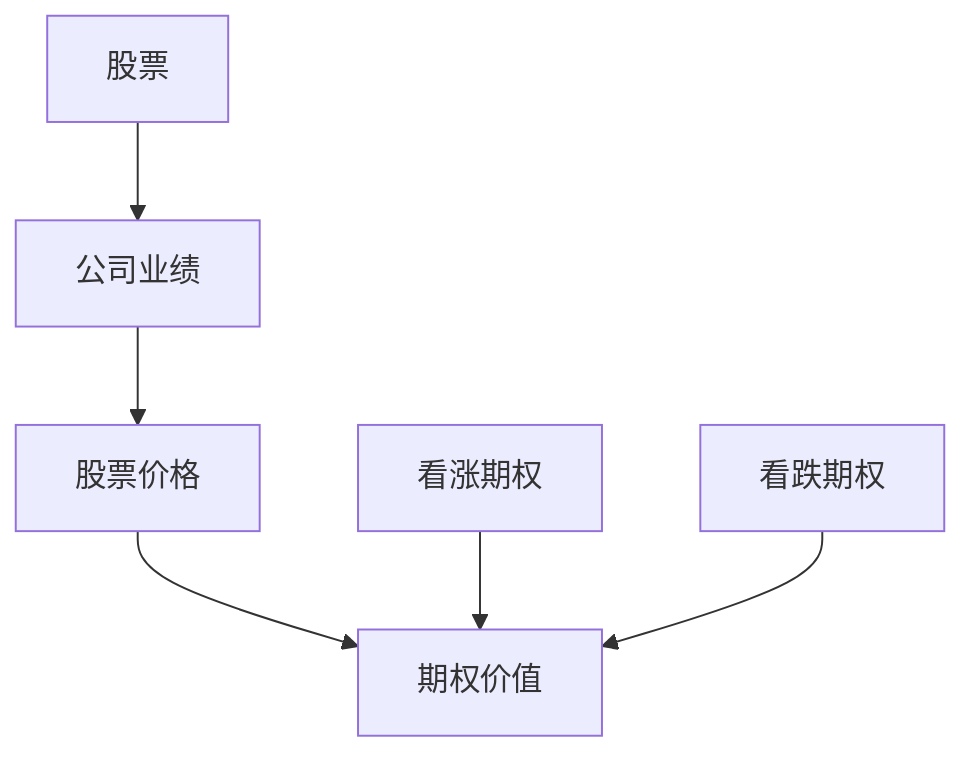

                 

  
## 1. 背景介绍

在当今经济全球化的大背景下，股票和期权已成为许多企业激励员工的重要手段。对于程序员这一群体来说，他们经常能够获得股票和期权作为薪酬的一部分。然而，如何合理地处理这些股票和期权，最大化其价值，成为了程序员们需要关注的重要问题。

股票和期权是一种金融工具，它们可以让程序员在未来某个时间以特定价格购买公司股票。股票的价值取决于公司的业绩和股票市场的波动，而期权则具有更大的灵活性。程序员需要理解这些金融工具的基本原理，以便做出明智的决策。

本文旨在为程序员提供关于处理股票和期权的实用指南。我们将从核心概念、算法原理、数学模型、项目实践和未来展望等多个角度进行分析，帮助程序员们更好地管理他们的股票和期权。

## 2. 核心概念与联系

### 2.1 股票

股票是一种证券，代表着股票持有者对公司所有权的一部分。股票分为普通股和优先股，其中普通股享有公司盈利和资产分配的权利，而优先股则通常有更高的股息收益，但投票权较小。

### 2.2 期权

期权是一种金融合约，它赋予持有者在未来某个时间以特定价格购买或出售某项资产（如股票）的权利，但无义务。期权通常分为看涨期权（Call Option）和看跌期权（Put Option）。看涨期权给予购买者在未来价格上涨时购买股票的权利，而看跌期权则是在价格下跌时出售股票的权利。

### 2.3 股票和期权的联系

股票和期权之间有着紧密的联系。股票的价值波动直接影响期权的价值。例如，如果公司股票价格上涨，看涨期权的价值将增加，而看跌期权的价值将减少。程序员需要理解这种关系，以便在适当的时候行使他们的期权。

### 2.4 Mermaid 流程图



在上述流程图中，我们可以看到股票价格的变化如何影响期权的价值。公司业绩是股票价格的主要驱动因素，而期权的价值则直接取决于股票价格的波动。

## 3. 核心算法原理 & 具体操作步骤

### 3.1 算法原理概述

处理股票和期权的关键在于理解其价值波动和风险。程序员需要掌握一些核心算法，以帮助他们在不同市场条件下做出最佳决策。以下是一些常用的算法：

1. **风险中性定价**：这是一种用于计算期权价格的数学方法，假设在无风险利率下，期权价格等于预期收益。
2. **二叉树模型**：这是一种用于模拟股票价格波动的模型，可以帮助程序员预测期权价值。
3. **蒙特卡洛模拟**：这是一种通过随机模拟来计算期权价值的算法，适用于处理复杂的市场条件。

### 3.2 算法步骤详解

#### 风险中性定价

1. **确定无风险利率和期权的到期时间**。
2. **计算期权的预期收益**。
3. **使用无风险利率折现预期收益，得到期权价格**。

#### 二叉树模型

1. **初始化股票价格和期权的到期时间**。
2. **生成股票价格序列**，考虑可能的上涨和下跌。
3. **计算期权在每个时间点的价值**。
4. **回溯计算期权的初始价值**。

#### 蒙特卡洛模拟

1. **初始化股票价格和期权的到期时间**。
2. **随机生成多个股票价格路径**。
3. **计算每个路径上的期权价值**。
4. **计算期权的平均价值作为估计值**。

### 3.3 算法优缺点

- **风险中性定价**：优点是简单且适用于各种市场条件，缺点是假设过于理想化。
- **二叉树模型**：优点是易于理解和实现，缺点是计算复杂度较高。
- **蒙特卡洛模拟**：优点是适用于复杂市场条件，缺点是计算成本较高。

### 3.4 算法应用领域

这些算法广泛应用于金融领域，特别是在期权定价和风险管理中。程序员可以利用这些算法来评估股票和期权的价值，制定投资策略，降低投资风险。

## 4. 数学模型和公式 & 详细讲解 & 举例说明

### 4.1 数学模型构建

股票和期权定价的关键在于理解它们的价值构成。以下是一个简化的数学模型：

- **股票价格**：\( P(t) = S_0 \cdot e^{(\mu - \frac{\sigma^2}{2})t + \sigma W_t} \)

  其中，\( S_0 \) 是当前股票价格，\( \mu \) 是股票的期望收益率，\( \sigma \) 是股票收益率的波动率，\( W_t \) 是标准正态分布的随机变量。

- **看涨期权价格**：\( C(t) = S(t) - K \cdot e^{-rt} \)

  其中，\( S(t) \) 是当前股票价格，\( K \) 是执行价格，\( r \) 是无风险利率。

- **看跌期权价格**：\( P(t) = K \cdot e^{-rt} - S(t) \)

### 4.2 公式推导过程

- **股票价格公式**：假设股票价格遵循几何布朗运动，其数学模型为 \( dS(t) = \mu S(t)dt + \sigma S(t)dW(t) \)。通过对该方程进行变换，可以得到股票价格的表达式。

- **看涨期权价格**：利用无风险套利原理，可以将看涨期权的价值拆分为两部分，即当前股票价格减去执行价格的现值。通过数学变换，可以得到看涨期权价格的表达式。

- **看跌期权价格**：与看涨期权类似，可以通过无风险套利原理推导出看跌期权价格的表达式。

### 4.3 案例分析与讲解

假设某公司当前股票价格为100美元，执行价格为100美元，无风险利率为4%，股票波动率为20%。根据上述模型，我们可以计算该股票和期权的价格。

- **股票价格**：\( P(t) = 100 \cdot e^{(\mu - \frac{\sigma^2}{2})t + \sigma W_t} \)

  其中，\( \mu = 0.04 \)，\( \sigma = 0.20 \)。取 \( t = 1 \) 年，\( W_t \) 为标准正态分布的随机变量，我们可以计算得到 \( P(t) \) 的值。

- **看涨期权价格**：\( C(t) = S(t) - K \cdot e^{-rt} \)

  其中，\( S(t) = P(t) \)，\( K = 100 \)，\( r = 0.04 \)。代入上述参数，我们可以计算得到看涨期权价格。

- **看跌期权价格**：\( P(t) = K \cdot e^{-rt} - S(t) \)

  代入相同的参数，我们可以计算得到看跌期权价格。

通过上述计算，我们可以得到具体的股票和期权价格。这些价格可以帮助程序员评估他们的股票和期权的价值，制定投资策略。

## 5. 项目实践：代码实例和详细解释说明

### 5.1 开发环境搭建

为了演示如何使用Python计算股票和期权价格，我们需要安装一些必要的库。以下是一个简单的安装命令：

```shell
pip install numpy pandas matplotlib
```

### 5.2 源代码详细实现

以下是计算股票和期权价格的Python代码：

```python
import numpy as np
import pandas as pd
import matplotlib.pyplot as plt

# 参数设置
S0 = 100  # 当前股票价格
K = 100  # 执行价格
r = 0.04  # 无风险利率
T = 1  # 到期时间（年）
sigma = 0.20  # 波动率

# 随机生成股票价格路径
num_paths = 1000
num_steps = 50
dt = T / num_steps

# 初始化股票价格数组
stock_prices = np.zeros((num_paths, num_steps))

for i in range(num_steps):
    dW = np.sqrt(dt) * np.random.normal(size=num_paths)
    stock_prices[:, i] = stock_prices[:, i-1] * np.exp((r - 0.5 * sigma**2) * dt + sigma * dW)

# 计算期权价格
call_prices = (stock_prices[:, -1] - K) * np.exp(-r * T)
put_prices = (K - stock_prices[:, -1]) * np.exp(-r * T)

# 打印结果
print(f"看涨期权价格平均值：{np.mean(call_prices)}")
print(f"看跌期权价格平均值：{np.mean(put_prices)}")

# 可视化股票价格路径
plt.plot(stock_prices.mean(axis=0))
plt.xlabel("时间步数")
plt.ylabel("股票价格")
plt.title("股票价格路径")
plt.show()
```

### 5.3 代码解读与分析

- **初始化参数**：首先，我们设置了股票的当前价格、执行价格、无风险利率、到期时间和波动率。
- **生成股票价格路径**：通过循环和随机数生成，我们生成了多个股票价格路径。每个路径都是基于几何布朗运动的模拟。
- **计算期权价格**：我们使用计算得到的股票价格路径计算了看涨期权和看跌期权的价格。
- **打印结果**：我们打印了期权价格的平均值，以供分析。
- **可视化股票价格路径**：我们使用matplotlib库将股票价格路径可视化，以帮助理解股票价格的变化趋势。

通过这个示例，我们可以看到如何使用Python计算股票和期权价格。这种方法可以用于实际项目，帮助程序员评估他们的投资组合。

## 6. 实际应用场景

### 6.1 股票期权的应用场景

股票期权在实际应用中具有多种场景。以下是几个常见应用场景：

- **员工激励**：许多公司使用股票期权作为员工激励工具，以吸引和留住关键人才。
- **股权融资**：企业可以通过发行股票期权来筹集资金，同时吸引投资者。
- **风险管理**：通过购买看跌期权，程序员可以降低投资组合的风险。

### 6.2 个人投资者应用场景

对于个人投资者，股票期权也可以作为投资工具。以下是一些应用场景：

- **套利交易**：利用股票和期权的价格差异进行套利交易。
- **风险管理**：通过购买看涨期权或看跌期权，个人投资者可以在市场波动时降低风险。
- **资产配置**：将股票期权纳入投资组合，以实现风险和收益的平衡。

### 6.3 企业应用场景

企业可以使用股票期权进行多种操作，以下是几个例子：

- **员工招聘**：通过提供股票期权，企业可以吸引更多优秀的员工。
- **并购整合**：企业可以通过交换股票期权来整合并购目标公司的资产和人员。
- **财务规划**：企业可以利用股票期权进行财务规划，以实现长期发展目标。

## 7. 工具和资源推荐

### 7.1 学习资源推荐

- **《期权定价与交易》**：这是一本经典的金融书籍，详细介绍了期权定价和交易策略。
- **《Python金融应用》**：这本书介绍了如何使用Python进行金融数据分析，包括股票和期权定价。
- **在线课程**：有许多在线平台提供关于股票和期权的课程，如Coursera、edX等。

### 7.2 开发工具推荐

- **Python**：Python是一个强大的编程语言，适合进行金融计算和分析。
- **Jupyter Notebook**：Jupyter Notebook是一个交互式计算环境，适合编写和运行Python代码。
- **PyTorch**：PyTorch是一个流行的深度学习框架，可以用于复杂的金融计算。

### 7.3 相关论文推荐

- **"Option Pricing: A Simplified Approach"**：这篇文章提出了一种简化的期权定价方法，适用于不同市场条件。
- **"A Practitioner's Guide to Implementing Monte Carlo Simulations for Option Pricing"**：这篇文章详细介绍了如何使用蒙特卡洛模拟进行期权定价。
- **"The Binomial Model for Option Pricing"**：这篇文章详细介绍了二叉树模型在期权定价中的应用。

## 8. 总结：未来发展趋势与挑战

### 8.1 研究成果总结

本文介绍了程序员处理股票和期权的基本概念、算法原理、数学模型和实际应用。通过这些知识，程序员可以更好地理解股票和期权的价值，制定投资策略。

### 8.2 未来发展趋势

随着金融科技的发展，股票和期权的处理方法将变得更加智能化和自动化。例如，机器学习和人工智能技术将用于预测股票价格和期权价值，帮助程序员做出更明智的决策。

### 8.3 面临的挑战

尽管股票和期权具有巨大的潜力，但程序员在处理这些金融工具时仍面临一些挑战。例如，市场的不确定性和风险管理的复杂性要求程序员具备更高的金融知识和技术能力。

### 8.4 研究展望

未来，程序员需要关注以下几个方面：

- **提高金融素养**：程序员应不断提高自己的金融知识，以便更好地理解股票和期权。
- **应用新技术**：利用机器学习和人工智能技术，开发更先进的股票和期权定价模型。
- **风险管理**：加强风险管理，降低投资风险，提高投资回报率。

## 9. 附录：常见问题与解答

### 9.1 什么是期权？

期权是一种金融合约，它赋予持有者在未来某个时间以特定价格购买或出售某项资产（如股票）的权利，但无义务。

### 9.2 股票和期权有什么区别？

股票代表公司所有权的一部分，而期权是一种金融工具，它赋予持有者在未来以特定价格购买或出售股票的权利。

### 9.3 如何计算期权价格？

期权价格可以通过多种方法计算，如风险中性定价、二叉树模型和蒙特卡洛模拟等。这些方法基于不同的假设和模型，适用于不同的市场条件。

### 9.4 程序员如何处理股票和期权？

程序员需要了解股票和期权的基本概念和计算方法，以便在适当的时候行使期权。此外，他们还应关注市场动态，制定合理的投资策略。

作者：禅与计算机程序设计艺术 / Zen and the Art of Computer Programming
------------------------------------------------------------------------  
以上就是我们关于“程序员如何处理股票和期权”的完整文章。希望这篇文章对您在理解和处理股票和期权方面有所帮助。在未来的投资道路上，祝您取得成功！

