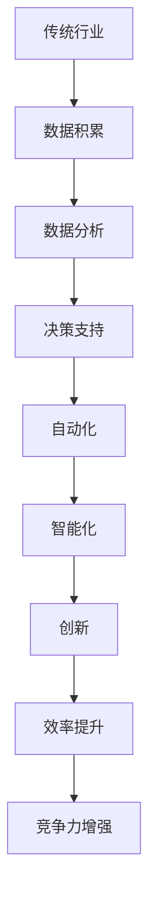

                 

关键词：AI技术、传统行业、创新、应用案例、实践步骤

> 摘要：本文将探讨程序员如何利用AI技术，为传统行业带来创新，提升行业效率和竞争力。通过深入分析AI在各个传统行业的应用，本文将提供详细的操作步骤和案例，为程序员提供实际可行的创新路径。

## 1. 背景介绍

在过去的几十年中，人工智能（AI）技术取得了显著的进展。从最初的规则系统到现代的深度学习，AI已经能够在各种领域实现智能化的功能。随着计算能力的提升和大数据的普及，AI技术开始渗透到各个传统行业，如医疗、金融、制造业、农业等。这些传统行业在过去依靠传统的业务流程和手工操作，而AI技术的引入则有望大幅提升效率和创新能力。

程序员作为AI技术的实施者，需要了解如何将AI技术应用于传统行业，以实现行业的转型升级。本文将详细探讨以下几个核心问题：

1. AI技术在传统行业中的应用场景和优势。
2. 程序员如何选择合适的AI算法和工具。
3. 实际应用案例和操作步骤。
4. AI技术在未来传统行业中的应用前景和挑战。

## 2. 核心概念与联系

为了更好地理解AI技术如何作用于传统行业，我们首先需要了解一些核心概念和其相互关系。

### 2.1 人工智能（AI）基础概念

人工智能是指计算机系统模拟人类智能行为的能力。主要分为三种类型：

- **弱AI**：专注于特定任务，如语音识别、图像识别等。
- **强AI**：具备全面的人类智能，能够自主思考和决策。
- **通用AI**：超越人类智能，能够在任何任务上表现出色。

### 2.2 机器学习（ML）

机器学习是AI的核心技术之一，通过算法让计算机从数据中学习规律，从而做出预测或决策。主要分为以下几种：

- **监督学习**：有标记的训练数据，用于预测新的数据。
- **无监督学习**：无标记的数据，用于发现数据中的结构。
- **强化学习**：通过奖励和惩罚机制，让模型学会最优策略。

### 2.3 深度学习（DL）

深度学习是机器学习的一个分支，使用多层神经网络进行训练，能够自动提取数据中的特征。其架构通常包括：

- **输入层**：接收输入数据。
- **隐藏层**：提取和变换特征。
- **输出层**：生成预测结果。

### 2.4 AI与传统行业的关系

AI与传统行业的关系如图所示：



### 2.5 AI在传统行业中的应用

以下是AI在传统行业中的一些典型应用：

- **医疗**：图像识别、疾病预测、个性化治疗方案。
- **金融**：风险管理、欺诈检测、量化交易。
- **制造业**：预测性维护、质量检测、自动化生产。
- **农业**：作物监控、病虫害预测、精准施肥。

## 3. 核心算法原理 & 具体操作步骤

### 3.1  算法原理概述

在AI技术中，常用的算法包括机器学习、深度学习和自然语言处理等。以下是这些算法的基本原理：

- **机器学习**：基于训练数据，通过算法学习数据中的规律，实现预测或分类。
- **深度学习**：使用多层神经网络，自动提取数据中的特征，进行复杂任务的学习。
- **自然语言处理**：理解和生成自然语言，应用于语音识别、机器翻译、文本分析等。

### 3.2  算法步骤详解

以深度学习为例，其基本步骤如下：

1. **数据收集**：收集相关领域的大量数据。
2. **数据预处理**：对数据进行清洗、归一化等处理。
3. **模型设计**：设计合适的神经网络结构。
4. **模型训练**：使用训练数据，通过反向传播算法调整模型参数。
5. **模型评估**：使用验证数据，评估模型性能。
6. **模型部署**：将模型部署到生产环境中，实现实际应用。

### 3.3  算法优缺点

- **机器学习**：
  - 优点：易于理解和实现，适用范围广。
  - 缺点：对数据质量要求高，模型解释性较差。

- **深度学习**：
  - 优点：强大的特征提取能力，适用于复杂任务。
  - 缺点：模型参数多，训练时间长，对数据量要求高。

- **自然语言处理**：
  - 优点：能够处理自然语言，应用场景广泛。
  - 缺点：对语言的理解仍存在局限，算法复杂度高。

### 3.4  算法应用领域

- **机器学习**：推荐系统、图像识别、文本分类等。
- **深度学习**：自动驾驶、语音识别、医学影像分析等。
- **自然语言处理**：机器翻译、智能客服、情感分析等。

## 4. 数学模型和公式 & 详细讲解 & 举例说明

### 4.1  数学模型构建

在AI算法中，常用的数学模型包括线性模型、神经网络模型等。以下是线性回归模型的基本公式：

$$
y = \beta_0 + \beta_1x
$$

其中，$y$ 是因变量，$x$ 是自变量，$\beta_0$ 和 $\beta_1$ 是模型参数。

### 4.2  公式推导过程

线性回归模型的推导过程如下：

1. **假设**：假设数据服从线性关系。
2. **最小二乘法**：通过最小化预测值与实际值之间的误差平方和，求解模型参数。
3. **求解公式**：使用求导法或矩阵法求解参数。

### 4.3  案例分析与讲解

以下是一个线性回归模型的案例：

假设我们要预测房价，给定以下数据：

| 房价（万元）| 房屋面积（平方米）|
| :--: | :--: |
| 100 | 100 |
| 120 | 110 |
| 140 | 120 |
| 160 | 130 |
| 180 | 140 |

我们可以使用线性回归模型进行预测，模型公式为：

$$
y = \beta_0 + \beta_1x
$$

通过最小二乘法求解参数，得到：

$$
\beta_0 = 50, \beta_1 = 0.5
$$

因此，预测公式为：

$$
y = 50 + 0.5x
$$

当房屋面积为 150 平方米时，预测房价为：

$$
y = 50 + 0.5 \times 150 = 125 \text{万元}
$$

## 5. 项目实践：代码实例和详细解释说明

### 5.1  开发环境搭建

为了演示如何将AI技术应用于传统行业，我们选择一个简单的案例：使用深度学习预测股票价格。以下为开发环境搭建步骤：

1. 安装Python环境（版本3.8及以上）。
2. 安装TensorFlow和Keras库：`pip install tensorflow keras`。
3. 准备数据集：可以从开源数据集网站下载股票数据。

### 5.2  源代码详细实现

以下是一个使用Keras实现股票价格预测的示例代码：

```python
import numpy as np
import pandas as pd
from keras.models import Sequential
from keras.layers import LSTM, Dense

# 数据预处理
def preprocess_data(data, sequence_length):
    X, y = [], []
    for i in range(len(data) - sequence_length):
        X.append(data[i:(i + sequence_length)])
        y.append(data[i + sequence_length])
    return np.array(X), np.array(y)

# 加载数据
data = pd.read_csv('stock_data.csv')
sequence_length = 5
X, y = preprocess_data(data['Close'], sequence_length)

# 分割数据集
train_size = int(len(X) * 0.8)
X_train, X_test = X[:train_size], X[train_size:]
y_train, y_test = y[:train_size], y[train_size:]

# 构建模型
model = Sequential()
model.add(LSTM(units=50, return_sequences=True, input_shape=(sequence_length, 1)))
model.add(LSTM(units=50))
model.add(Dense(1))

model.compile(optimizer='adam', loss='mean_squared_error')

# 训练模型
model.fit(X_train, y_train, epochs=100, batch_size=32, validation_data=(X_test, y_test), verbose=1)

# 预测
predictions = model.predict(X_test)
predictions = np.reshape(predictions, (predictions.shape[0], ))

# 绘制结果
import matplotlib.pyplot as plt
plt.plot(y_test, label='Actual')
plt.plot(predictions, label='Predicted')
plt.legend()
plt.show()
```

### 5.3  代码解读与分析

- **数据预处理**：将股票价格数据按时间序列分割为输入序列和输出序列。
- **模型构建**：使用LSTM层进行序列建模，输出层为单节点，用于预测股票价格。
- **模型训练**：使用均方误差作为损失函数，使用Adam优化器。
- **模型预测**：对测试数据进行预测，并将结果可视化。

### 5.4  运行结果展示

运行代码后，我们可以看到实际股票价格与预测价格的对比图。通过观察结果，我们可以评估模型的预测性能。

## 6. 实际应用场景

### 6.1  医疗行业

AI技术在医疗行业的应用非常广泛，包括疾病预测、医学影像分析、个性化治疗等。例如，通过深度学习算法分析医学影像，可以提前发现疾病，提高诊断的准确性。

### 6.2  金融行业

金融行业是AI技术应用的重要领域，包括风险管理、量化交易、客户服务等。例如，通过自然语言处理技术，可以自动分析市场信息，为交易提供决策支持。

### 6.3  制造业

制造业中的AI应用主要包括自动化生产、预测性维护、质量检测等。通过AI技术，可以提高生产效率，降低成本，提高产品质量。

### 6.4  农业

农业是另一个受益于AI技术的行业，包括作物监控、病虫害预测、精准施肥等。通过AI技术，可以优化农业生产过程，提高产量和质量。

## 7. 工具和资源推荐

### 7.1  学习资源推荐

- **书籍**：
  - 《深度学习》（Goodfellow, Bengio, Courville）
  - 《Python机器学习》（Sebastian Raschka）
- **在线课程**：
  - Coursera上的《机器学习》课程
  - Udacity的《深度学习纳米学位》
- **开源项目**：
  - TensorFlow
  - Keras
  - Scikit-learn

### 7.2  开发工具推荐

- **集成开发环境（IDE）**：
  - PyCharm
  - Jupyter Notebook
- **数据可视化工具**：
  - Matplotlib
  - Seaborn
- **机器学习框架**：
  - TensorFlow
  - PyTorch

### 7.3  相关论文推荐

- "Deep Learning for Predictive Analytics" by Max Pumperla et al.
- "AI in Healthcare: A Survey" by Parag Kulkarni et al.
- "AI Applications in Manufacturing" by Muhammad Ahsan et al.

## 8. 总结：未来发展趋势与挑战

### 8.1  研究成果总结

本文总结了AI技术在传统行业中的应用场景、算法原理、具体操作步骤以及实际案例。通过这些内容，程序员可以了解到如何利用AI技术为传统行业带来创新。

### 8.2  未来发展趋势

未来，AI技术在传统行业中的应用将会更加深入和广泛。随着算法的进步和数据的积累，AI将能够在更多领域实现智能化的功能，推动行业的变革。

### 8.3  面临的挑战

尽管AI技术在传统行业中具有巨大的潜力，但仍然面临一些挑战，如算法解释性、数据隐私和安全等问题。这些问题需要进一步的探讨和研究。

### 8.4  研究展望

未来，我们可以期待AI技术在传统行业中的应用将带来更多的创新和变革。程序员需要不断学习和掌握AI技术，以应对不断变化的市场需求。

## 9. 附录：常见问题与解答

### 9.1  Q：AI技术在传统行业中的应用前景如何？

A：AI技术在传统行业中的应用前景非常广阔。随着算法的进步和数据的积累，AI将在更多领域实现智能化的功能，为行业带来创新和效率提升。

### 9.2  Q：程序员如何开始学习AI技术？

A：程序员可以通过学习相关书籍、在线课程和开源项目来开始学习AI技术。推荐的资源包括《深度学习》、《Python机器学习》等书籍，以及Coursera、Udacity等在线平台。

### 9.3  Q：AI技术对传统行业的影响是积极的吗？

A：AI技术对传统行业的影响是积极的。它可以帮助企业提高效率、降低成本、提升竞争力，从而推动行业的发展。

---

作者：禅与计算机程序设计艺术 / Zen and the Art of Computer Programming

