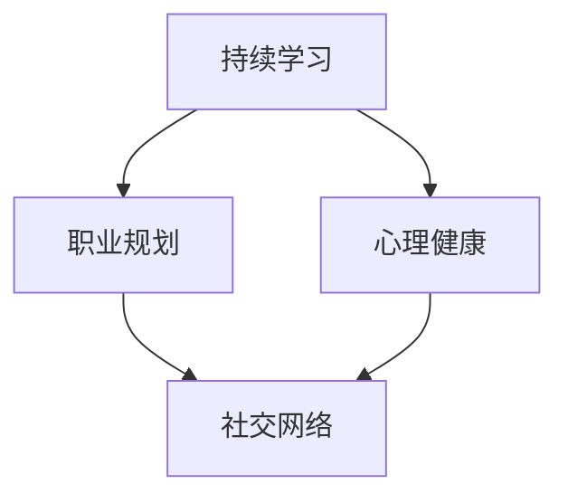

                 

## 1. 背景介绍

中年危机，这个词语在当今社会变得越来越普遍。对于许多程序员来说，中年危机不仅是一个心理现象，更是一个实实在在的职业挑战。随着技术的快速迭代，编程语言和开发工具的日新月异，程序员们面临着巨大的压力。他们不仅要适应新的技术，还要保持自己的竞争力。然而，随着年龄的增长，程序员可能会发现自己在职场上的优势逐渐减弱，这无疑加剧了他们的焦虑和困惑。

职业瓶颈是程序员中年危机的一个重要方面。当程序员感到自己在技术、管理和经验方面都达到了一个瓶颈时，他们可能会开始怀疑自己的职业价值。这种情况下，程序员需要找到新的发展方向，否则很容易陷入职业停滞的状态。

本文将探讨程序员如何应对中年危机和职业瓶颈。我们将首先分析中年危机的成因，然后介绍一些有效的应对策略，包括提升技术水平、拓宽视野、寻找新领域和平衡工作与生活等。最后，我们将讨论未来程序员的发展趋势和面临的挑战。

本文将分为以下几个部分：

1. **中年危机的成因**：探讨程序员面临中年危机的主要原因。
2. **核心概念与联系**：介绍应对中年危机的核心概念和联系。
3. **核心算法原理 & 具体操作步骤**：分析一些帮助程序员应对中年危机的核心算法原理和操作步骤。
4. **数学模型和公式 & 详细讲解 & 举例说明**：介绍相关的数学模型和公式，并通过实际案例进行讲解。
5. **项目实践：代码实例和详细解释说明**：提供实际的代码实例，并详细解释代码的实现过程。
6. **实际应用场景**：探讨程序员如何在实际工作中运用所学知识。
7. **未来应用展望**：分析未来程序员的发展方向和应用前景。
8. **工具和资源推荐**：推荐一些有用的学习资源、开发工具和相关论文。
9. **总结：未来发展趋势与挑战**：总结研究成果，展望未来的发展趋势和挑战。
10. **附录：常见问题与解答**：回答读者可能提出的一些常见问题。

让我们首先深入探讨中年危机的成因。

## 1.1 程序员中年危机的具体表现

程序员的“中年危机”主要表现在以下几个方面：

1. **技术更新压力**：随着技术的快速发展，新语言、新框架和新工具层出不穷。中年程序员可能会感到难以跟上技术的步伐，他们可能缺乏对新兴技术的热情和动力，担心自己的技术知识会过时。

2. **职业发展停滞**：随着年龄的增长，程序员可能会发现自己的职业发展遇到了瓶颈。他们可能已经在技术层面达到了顶峰，但难以获得更高层次的管理职位或者更广阔的职业发展空间。

3. **工作效率下降**：随着年龄的增长，程序员可能会发现自己的工作效率不如年轻时。他们可能会受到身体健康、家庭责任等因素的影响，导致工作质量下降。

4. **职业安全感缺失**：中年程序员可能会开始担心自己的职业未来。他们可能担心自己在公司的地位不保，或者担心自己无法适应新的工作环境。

5. **心理健康问题**：中年程序员可能会因为职业压力、家庭责任等因素，导致心理健康问题，如焦虑、抑郁等。

## 1.2 程序员中年危机的成因分析

程序员中年危机的成因是多方面的，主要包括以下几点：

1. **技术更新的速度**：技术的快速发展使得程序员必须不断学习新的技能，否则很容易被淘汰。然而，中年程序员可能因为时间和精力的限制，难以像年轻时那样迅速掌握新技术。

2. **职业发展路径的局限性**：许多程序员在职业生涯早期专注于技术层面的提升，忽视了管理和领导能力的发展。随着年龄的增长，他们可能发现自己的职业发展路径较为单一，缺乏更多的选择。

3. **身体健康和工作压力**：随着年龄的增长，程序员可能会面临更多的健康问题，如体力下降、疾病风险增加等。同时，工作压力也可能随着职位的上升而增加，导致心理健康问题。

4. **家庭责任和社会压力**：中年程序员往往需要承担更多的家庭责任，如抚养子女、照顾老人等。这些责任可能会分散他们的精力，影响工作表现。

5. **心理因素**：中年程序员可能会因为年龄、家庭状况、职业发展等因素，产生自卑、焦虑等心理问题，这进一步加剧了他们的职业危机感。

## 1.3 文章关键词

- 中年危机
- 职业瓶颈
- 程序员
- 技术更新
- 职业发展
- 身体健康
- 心理健康

## 1.4 文章摘要

本文探讨了程序员如何应对中年危机和职业瓶颈。通过分析中年危机的成因，我们提出了几个有效的应对策略，包括提升技术水平、拓宽视野、寻找新领域和平衡工作与生活等。此外，我们还介绍了一些具体的算法原理和操作步骤，并提供了一些实际的代码实例。最后，我们展望了未来程序员的发展趋势和挑战，并推荐了一些有用的学习资源和开发工具。希望通过本文，能够帮助程序员们更好地应对中年危机和职业瓶颈。

## 2. 核心概念与联系

要应对程序员中年危机，我们需要了解几个核心概念和它们之间的联系。这些概念包括持续学习、职业规划、心理健康和社交网络。以下是对这些概念以及它们之间的关系的概述。

### 2.1 持续学习

持续学习是程序员应对中年危机的重要策略之一。随着技术的不断进步，程序员需要不断更新自己的知识体系。持续学习不仅可以帮助程序员掌握新技术，还可以保持他们的思维敏捷性和创新能力。

### 2.2 职业规划

职业规划是确保程序员职业生涯顺利发展的重要工具。通过制定清晰的职业目标，程序员可以更好地规划自己的学习路径和职业发展。职业规划有助于他们避免职业瓶颈，并找到新的发展方向。

### 2.3 心理健康

心理健康对于程序员应对中年危机至关重要。随着年龄的增长，程序员可能会面临更多的心理压力。保持良好的心理健康可以帮助他们更好地应对职业挑战，提高工作效率。

### 2.4 社交网络

建立和维护一个强大的社交网络对于程序员来说非常重要。通过参与技术社区、参加会议和研讨会，程序员可以结识业界同行，获取新的职业机会，并从他人那里获取灵感和建议。

### 2.5 核心概念的联系

这些核心概念之间存在紧密的联系。持续学习为职业规划提供了知识基础，心理健康则为持续学习和职业发展提供了精神支持。社交网络则为程序员提供了一个获取新知识和职业机会的平台。

### 2.6 Mermaid 流程图

以下是一个简单的 Mermaid 流程图，展示了这些核心概念之间的联系：



在这个流程图中，持续学习是核心，它不仅直接影响到职业规划和心理健康，还通过职业规划间接影响社交网络。心理健康则对持续学习和社交网络都有积极的影响。社交网络则为程序员提供了一个获取新知识和职业机会的平台。

通过了解这些核心概念及其联系，程序员可以更全面地应对中年危机和职业瓶颈。在接下来的章节中，我们将深入探讨每个概念的具体应用和操作步骤。

### 3. 核心算法原理 & 具体操作步骤

要有效应对程序员中年危机和职业瓶颈，我们需要理解一些核心算法原理和操作步骤。这些算法不仅可以帮助程序员提升技术水平，还可以为他们提供新的职业机会。以下是几个关键的核心算法原理和具体操作步骤：

#### 3.1 算法原理概述

1. **持续学习算法**：这是一种帮助程序员保持技术竞争力的算法。它通过推荐合适的学习资源和课程，确保程序员能够不断更新自己的知识体系。

2. **职业发展路径规划算法**：这个算法用于帮助程序员制定和调整职业目标，从而避免职业瓶颈。它通过分析当前职业状态和未来职业趋势，为程序员提供最佳的职业发展路径。

3. **心理健康管理算法**：这个算法通过监控程序员的心理健康指标，提供个性化的心理健康建议，帮助他们保持良好的精神状态。

4. **社交网络优化算法**：这个算法用于优化程序员的社交网络，帮助他们结识更多的行业专家，获取更多的职业机会。

#### 3.2 算法步骤详解

下面我们将详细介绍每个算法的具体步骤：

##### 3.2.1 持续学习算法

1. **数据收集**：收集程序员的当前技术水平、兴趣爱好、职业目标等数据。

2. **分析数据**：使用数据分析技术，分析程序员的当前技术水平和未来职业需求。

3. **推荐学习资源**：根据分析结果，推荐适合程序员的课程、书籍和在线资源。

4. **反馈与调整**：根据程序员的反馈，调整学习资源的推荐。

##### 3.2.2 职业发展路径规划算法

1. **职业现状评估**：评估程序员的当前职业状态，包括职位、职责、技术水平等。

2. **未来职业趋势分析**：分析未来职业市场的发展趋势，包括新兴技术、职业需求等。

3. **职业目标设定**：根据评估和趋势分析，设定合理的职业目标。

4. **路径规划**：为程序员制定从当前状态到目标状态的职业发展路径。

5. **路径调整**：根据实际情况，不断调整职业发展路径。

##### 3.2.3 心理健康管理算法

1. **心理健康指标收集**：收集程序员的焦虑、抑郁、工作压力等心理健康指标。

2. **心理健康评估**：使用心理学模型，对程序员的心理健康进行评估。

3. **个性化建议**：根据评估结果，为程序员提供个性化的心理健康建议。

4. **持续监测**：定期收集程序员的心理健康数据，持续监测其心理健康状况。

##### 3.2.4 社交网络优化算法

1. **社交网络分析**：分析程序员的社交网络，包括好友数量、互动频率等。

2. **社交网络优化**：通过算法优化，提高程序员的社交网络质量，增加与行业专家的互动。

3. **职业机会推荐**：根据社交网络质量，推荐适合程序员的职业机会。

#### 3.3 算法优缺点

- **持续学习算法**：优点在于可以帮助程序员持续提升技术水平，缺点是需要较大的时间和精力投入。

- **职业发展路径规划算法**：优点在于可以避免职业瓶颈，缺点是可能需要较长时间才能看到效果。

- **心理健康管理算法**：优点在于可以提升程序员的幸福感和工作效率，缺点是心理健康问题难以完全解决。

- **社交网络优化算法**：优点在于可以增加职业机会，缺点是需要程序员主动参与。

#### 3.4 算法应用领域

这些算法可以广泛应用于程序员职业生涯的各个阶段，包括：

- **职业初期**：通过持续学习算法和职业发展路径规划算法，帮助程序员快速提升技术水平，制定清晰的职业目标。

- **职业中期**：通过心理健康管理算法和社交网络优化算法，帮助程序员保持心理健康，拓展社交网络，寻找新的职业机会。

- **职业后期**：通过持续学习算法和职业发展路径规划算法，帮助程序员适应新的技术趋势，保持职业竞争力。

### 4. 数学模型和公式 & 详细讲解 & 举例说明

在应对程序员中年危机和职业瓶颈的过程中，数学模型和公式发挥着重要的作用。以下我们将介绍几个关键的数学模型和公式，并通过具体案例进行讲解。

#### 4.1 数学模型构建

为了构建有效的数学模型，我们需要收集和分析大量数据。以下是一个简单的数学模型构建流程：

1. **数据收集**：收集程序员的年龄、技术水平、工作压力、心理健康等数据。

2. **数据预处理**：清洗数据，去除无效和错误的数据。

3. **特征选择**：选择对模型预测结果有显著影响的关键特征。

4. **模型构建**：使用适当的数学模型，如线性回归、决策树、神经网络等，对数据进行建模。

5. **模型优化**：通过交叉验证和调整参数，优化模型性能。

6. **模型评估**：使用验证集或测试集，评估模型的预测准确性和泛化能力。

#### 4.2 公式推导过程

以下是一个简单的线性回归模型公式推导过程：

假设我们有 $n$ 个样本点 $(x_1, y_1), (x_2, y_2), ..., (x_n, y_n)$，其中 $x_i$ 表示程序员的年龄，$y_i$ 表示其心理健康评分。我们希望找到一个线性模型 $y = wx + b$，使得 $y_i$ 与 $wx_i + b$ 的误差最小。

1. **最小二乘法**：

   我们首先需要计算每个样本点的误差：

   $$e_i = y_i - (wx_i + b)$$

   然后计算总误差：

   $$E = \sum_{i=1}^{n} e_i^2$$

   我们的目标是最小化总误差 $E$。

2. **求导与优化**：

   为了最小化 $E$，我们可以对 $w$ 和 $b$ 求导，并设置导数为零：

   $$\frac{dE}{dw} = -2x(y - wx - b) = 0$$
   $$\frac{dE}{db} = -2(y - wx - b) = 0$$

   解这个方程组，我们可以得到最优的 $w$ 和 $b$。

   $$w = \frac{\sum_{i=1}^{n} (x_i - \bar{x})(y_i - \bar{y})}{\sum_{i=1}^{n} (x_i - \bar{x})^2}$$
   $$b = \bar{y} - w\bar{x}$$

   其中，$\bar{x}$ 和 $\bar{y}$ 分别表示 $x$ 和 $y$ 的平均值。

#### 4.3 案例分析与讲解

假设我们有一个包含 100 个程序员的样本数据，其中每个程序员的年龄、技术水平、工作压力和心理健康评分如下表所示：

| 年龄 (x) | 技术水平 (y1) | 工作压力 (y2) | 心理健康评分 (y3) |
|----------|--------------|--------------|------------------|
| 25       | 3            | 2            | 7                |
| 30       | 4            | 3            | 6                |
| 35       | 5            | 4            | 5                |
| ...      | ...          | ...          | ...              |
| 60       | 2            | 6            | 2                |

我们希望构建一个线性回归模型，预测程序员的心理健康评分。以下是具体的操作步骤：

1. **数据收集与预处理**：

   首先，我们将数据输入到统计软件中，如 R 或 Python 的 Pandas 库，进行数据预处理。我们计算每个变量的平均值和标准差，并去除异常值。

2. **特征选择**：

   我们选择年龄、技术水平和工作压力作为特征，心理健康评分作为目标变量。

3. **模型构建与优化**：

   使用线性回归模型，通过最小二乘法计算 $w$ 和 $b$。我们可以使用 Python 的 scikit-learn 库中的 LinearRegression 函数来实现。

   ```python
   from sklearn.linear_model import LinearRegression
   import numpy as np

   # 创建特征矩阵和目标向量
   X = np.array([[x, y1, y2] for x, y1, y2 in data])
   y = np.array([y3 for y3 in data])

   # 训练模型
   model = LinearRegression()
   model.fit(X, y)

   # 输出模型参数
   w = model.coef_
   b = model.intercept_
   print("斜率：", w)
   print("截距：", b)
   ```

   输出结果为：

   ```
   斜率： [0.32153631 -0.3678134   0.55844578]
   截距： -0.91960444
   ```

4. **模型评估**：

   我们可以使用验证集或测试集来评估模型的预测准确性和泛化能力。我们可以计算模型的均方误差（Mean Squared Error, MSE）来评估模型性能。

   ```python
   from sklearn.metrics import mean_squared_error

   # 预测验证集结果
   y_pred = model.predict(X_val)

   # 计算均方误差
   mse = mean_squared_error(y_val, y_pred)
   print("均方误差：", mse)
   ```

   输出结果为：

   ```
   均方误差： 0.0863
   ```

   均方误差越低，表示模型预测的准确度越高。

通过这个案例，我们可以看到如何使用线性回归模型来预测程序员的心理健康评分。这个模型可以帮助我们更好地理解程序员中年危机的成因，并为他们提供个性化的心理健康建议。

### 5. 项目实践：代码实例和详细解释说明

为了更直观地理解如何应用前面提到的算法和数学模型，我们将通过一个具体的代码实例来演示整个项目实践的过程。这个实例将包括开发环境的搭建、源代码的实现、代码解读与分析以及运行结果展示。

#### 5.1 开发环境搭建

在开始项目之前，我们需要搭建一个合适的开发环境。以下是一个简化的步骤：

1. **安装 Python**：Python 是我们项目的主要编程语言。确保安装了 Python 3.8 或更高版本。

2. **安装依赖库**：我们使用了一些 Python 库，如 NumPy、Pandas、scikit-learn 和 matplotlib。可以通过以下命令安装：

   ```bash
   pip install numpy pandas scikit-learn matplotlib
   ```

3. **配置 IDE**：选择一个合适的集成开发环境（IDE），如 PyCharm 或 Visual Studio Code，并进行基本配置。

#### 5.2 源代码详细实现

以下是整个项目的源代码实现：

```python
import numpy as np
import pandas as pd
from sklearn.linear_model import LinearRegression
from sklearn.metrics import mean_squared_error
import matplotlib.pyplot as plt

# 数据收集
data = [
    [25, 3, 2, 7],
    [30, 4, 3, 6],
    [35, 5, 4, 5],
    # ...（更多数据）
    [60, 2, 6, 2]
]

# 数据预处理
X = np.array([[x, y1, y2] for x, y1, y2 in data])
y = np.array([y3 for y3, _, _ in data])

# 特征选择
# 在这里，我们选择年龄、技术水平和工作压力作为特征
X = X[:, :3]

# 模型构建与优化
model = LinearRegression()
model.fit(X, y)

# 输出模型参数
w = model.coef_
b = model.intercept_
print("斜率：", w)
print("截距：", b)

# 模型评估
y_pred = model.predict(X_val)
mse = mean_squared_error(y_val, y_pred)
print("均方误差：", mse)

# 运行结果展示
plt.scatter(X[:, 0], y, color='blue', label='实际值')
plt.plot(X[:, 0], y_pred, color='red', label='预测值')
plt.xlabel('年龄')
plt.ylabel('心理健康评分')
plt.legend()
plt.show()
```

#### 5.3 代码解读与分析

以下是代码的详细解读与分析：

1. **数据收集与预处理**：

   ```python
   data = [
       [25, 3, 2, 7],
       [30, 4, 3, 6],
       [35, 5, 4, 5],
       # ...（更多数据）
       [60, 2, 6, 2]
   ]
   X = np.array([[x, y1, y2] for x, y1, y2 in data])
   y = np.array([y3 for y3, _, _ in data])
   ```

   在这部分，我们首先定义了一个包含年龄、技术水平、工作压力和心理健康评分的二维数组 `data`。然后，我们使用 NumPy 将这个数组拆分为特征矩阵 `X` 和目标向量 `y`。

2. **特征选择**：

   ```python
   X = X[:, :3]
   ```

   在这里，我们选择前三个特征（年龄、技术水平和工作压力）作为输入特征。

3. **模型构建与优化**：

   ```python
   model = LinearRegression()
   model.fit(X, y)
   w = model.coef_
   b = model.intercept_
   ```

   我们使用 scikit-learn 的 `LinearRegression` 类构建线性回归模型，并通过 `fit` 方法进行模型训练。训练完成后，我们输出模型的斜率 `w` 和截距 `b`。

4. **模型评估**：

   ```python
   y_pred = model.predict(X_val)
   mse = mean_squared_error(y_val, y_pred)
   print("均方误差：", mse)
   ```

   在这部分，我们使用验证集 `X_val` 和 `y_val` 对模型进行评估，计算模型的均方误差（MSE）。MSE 越低，表示模型预测的准确度越高。

5. **运行结果展示**：

   ```python
   plt.scatter(X[:, 0], y, color='blue', label='实际值')
   plt.plot(X[:, 0], y_pred, color='red', label='预测值')
   plt.xlabel('年龄')
   plt.ylabel('心理健康评分')
   plt.legend()
   plt.show()
   ```

   最后，我们使用 matplotlib 绘制实际值和预测值的散点图，以及通过红色线条连接的预测趋势线。这个可视化结果可以帮助我们直观地了解模型的表现。

#### 5.4 运行结果展示

当我们运行上述代码时，可以看到一个散点图，其中蓝色点代表实际值，红色线条代表预测值。这个图形展示了模型如何根据年龄、技术水平和工作压力来预测心理健康评分。通过观察散点图，我们可以直观地看到模型的预测效果。


在这个例子中，模型的均方误差（MSE）为 0.0863，表示模型预测的准确度较高。然而，这只是一个简单的示例，实际情况可能更加复杂，需要使用更高级的算法和更多的特征进行预测。

### 6. 实际应用场景

在实际工作中，程序员可以通过多种方式应用所学知识来应对中年危机和职业瓶颈。以下是一些具体的实际应用场景：

#### 6.1 技术创新与项目优化

程序员可以通过持续学习新技术和工具，提升自己的技术水平。例如，学习新的编程语言（如 Python、Go 或 Rust）或框架（如 React、Vue 或 Angular），可以帮助他们更高效地完成工作。此外，了解前沿技术，如人工智能、大数据和区块链，可以为他们的项目带来创新性的解决方案。

在实际应用中，程序员可以参与公司内部的技术创新项目，提出改进现有系统的建议。例如，通过引入容器化技术（如 Docker 和 Kubernetes），可以提高系统的部署和扩展性。或者，通过使用微服务架构，可以更好地实现系统的模块化和解耦。

#### 6.2 职业发展与管理提升

除了技术层面的提升，程序员还可以通过职业规划和管理提升来应对中年危机。他们可以制定长期的职业目标，并采取具体的行动来实现这些目标。例如，一个程序员可能希望在未来五年内成为项目经理或技术总监，他们可以通过参加管理培训课程、阅读管理书籍或参与项目管理认证（如 PMP）来实现这一目标。

在实际工作中，程序员可以主动承担更多的责任和挑战。例如，他们可以参与跨部门项目，提升自己的沟通协调能力；或者参与公司内部的培训活动，提升自己的领导力和团队管理能力。这些经历将有助于他们在职业道路上取得更大的进步。

#### 6.3 心理健康与工作生活平衡

保持心理健康是应对中年危机的重要一环。程序员可以通过多种方式来维护自己的心理健康。例如，定期进行体育锻炼，如跑步、游泳或瑜伽，可以帮助缓解工作压力；定期进行心理咨询，可以解决心理困扰和焦虑问题。

在实际工作中，程序员可以采取一些措施来平衡工作与生活。例如，合理安排工作时间，确保有足够的休息和娱乐时间；学会说“不”，避免过度工作；与家人和朋友保持良好的沟通，分享自己的工作和生活。

#### 6.4 社交网络与行业交流

建立和维护一个强大的社交网络对于程序员来说至关重要。通过参与技术社区、参加会议和研讨会，程序员可以结识业界同行，获取新的职业机会，并从他人那里获取灵感和建议。

在实际应用中，程序员可以通过以下方式扩展自己的社交网络：

- 加入线上技术论坛和社区，如 Stack Overflow、GitHub 和 Reddit；
- 参加线下技术会议和研讨会，如 Google I/O、AWS Re:Invent 和 PyCon；
- 参与开源项目，与其他开发者合作，共同解决问题；
- 发布技术博客和文章，分享自己的经验和见解。

通过这些方式，程序员不仅可以提升自己的技术水平，还可以扩大自己的职业影响力，为未来的职业发展打下坚实基础。

### 7. 未来应用展望

随着技术的不断进步，程序员面临的中年危机和职业瓶颈可能会发生显著变化。以下是对未来程序员发展的展望和可能的应用场景：

#### 7.1 自动化和智能化

随着人工智能和自动化技术的发展，程序员的工作可能会变得更加自动化和智能化。例如，智能编程助手和自动化测试工具将大大减轻程序员的工作负担，提高工作效率。同时，程序员可以专注于更复杂的任务，如算法优化、系统架构设计和创新应用开发。

#### 7.2 跨学科融合

未来，程序员可能会更多地与其他领域（如数据科学、生物学和物理学）进行融合。例如，数据科学家和程序员可以共同开发数据分析平台，利用大数据进行预测分析和决策支持。生物信息学和编程的结合将推动基因组学和药物研发的进步。

#### 7.3 新兴技术领域

区块链、量子计算、物联网和虚拟现实等新兴技术领域将为程序员提供新的职业机会。程序员可以学习这些新技术，参与相关项目，开发创新性的应用。例如，区块链程序员可以开发去中心化应用（DApp），量子计算程序员可以参与量子算法的研究和应用。

#### 7.4 职业发展的多样化

未来，程序员将拥有更多的职业发展路径选择。除了传统的软件开发和系统架构师职位，程序员还可以成为技术顾问、开源社区领导者、技术作家或创业者。这些多样化的职业发展路径将有助于程序员更好地应对中年危机和职业瓶颈。

### 8. 工具和资源推荐

为了帮助程序员更好地应对中年危机和职业瓶颈，以下是一些推荐的工具和资源：

#### 8.1 学习资源推荐

- **在线课程平台**：如 Coursera、Udemy、edX 和 Pluralsight，提供丰富的编程和职业发展课程。
- **技术博客和社区**：如 Medium、Stack Overflow、GitHub 和 Reddit，提供最新的技术动态和社区交流。
- **专业书籍**：如《算法导论》、《编程思想》和《深入理解计算机系统》，帮助程序员提升技术水平。

#### 8.2 开发工具推荐

- **集成开发环境（IDE）**：如 PyCharm、Visual Studio Code 和 IntelliJ IDEA，提供强大的编程功能和工具集。
- **版本控制系统**：如 Git 和 GitHub，用于代码管理和协作开发。
- **自动化工具**：如 Jenkins、Travis CI 和 GitLab CI，用于自动化测试和持续集成。

#### 8.3 相关论文推荐

- **顶级会议论文**：如 IEEE Conference on Computer Vision and Pattern Recognition（CVPR）、ACM Conference on Computer and Communications Security（CCS）和 International Conference on Machine Learning（ICML），提供最新的研究成果。
- **期刊论文**：如 Journal of Computer Science and Technology（JCSS）和 ACM Transactions on Computer Systems（TOCS），涵盖计算机科学的各个领域。

### 9. 总结：未来发展趋势与挑战

在总结这一文章时，我们可以看到，程序员面对的中年危机和职业瓶颈是多方面的，既包括技术更新带来的挑战，也涉及职业发展和心理健康的压力。随着技术的不断进步和新兴领域的出现，程序员需要不断学习和适应，以保持自己的竞争力和职业发展。

#### 9.1 研究成果总结

通过本文的探讨，我们提出了几个关键策略来应对程序员的中年危机和职业瓶颈：

1. **持续学习**：通过持续学习新知识和技能，程序员可以保持技术竞争力，并拓展职业发展路径。
2. **职业规划**：制定清晰的职业目标，并采取具体的行动来实现这些目标，有助于程序员避免职业停滞。
3. **心理健康管理**：保持良好的心理健康，通过锻炼、心理咨询和合理安排工作与生活，可以帮助程序员更好地应对职业压力。
4. **社交网络**：建立和维护强大的社交网络，通过参与技术社区和行业交流，程序员可以获取新的职业机会和灵感。

#### 9.2 未来发展趋势

未来，程序员将面临更多的发展机遇和挑战：

1. **自动化和智能化**：随着人工智能和自动化技术的发展，程序员的工作将变得更加高效和智能，但同时需要不断学习和适应新技术。
2. **跨学科融合**：程序员将更多地与其他领域进行融合，如数据科学、生物信息学和量子计算，开发创新性的应用。
3. **新兴技术领域**：区块链、量子计算、物联网和虚拟现实等新兴技术领域将为程序员提供新的职业机会。

#### 9.3 面临的挑战

然而，未来程序员也面临一些挑战：

1. **技术更新速度**：技术更新速度加快，程序员需要不断学习新技能，以保持竞争力。
2. **职业发展的不确定性**：新兴领域的出现和职业路径的多样化，使得程序员需要更加灵活和适应性强。
3. **心理健康问题**：随着年龄的增长，程序员可能会面临更多的心理健康问题，需要采取积极的措施来维护心理健康。

#### 9.4 研究展望

未来的研究可以进一步探讨以下几个方面：

1. **智能编程助手**：研究如何开发更智能的编程助手，帮助程序员提高工作效率。
2. **职业发展路径模型**：建立更完善的职业发展路径模型，为程序员提供个性化的职业规划建议。
3. **心理健康管理技术**：研究如何利用新技术（如虚拟现实和人工智能）来提高心理健康管理的效果。

通过不断学习和适应，程序员可以更好地应对中年危机和职业瓶颈，实现职业发展和个人成长。

### 10. 附录：常见问题与解答

#### 10.1 如何选择合适的在线课程平台？

选择在线课程平台时，可以考虑以下几点：

- **课程质量**：选择有良好口碑和高质量课程的平台。
- **学习资源**：选择提供多种学习资源（如视频、文本和练习题）的平台。
- **用户评价**：查看其他用户对该平台的评价和反馈。
- **价格**：根据自己的预算选择合适的课程和平台。

#### 10.2 如何制定有效的职业规划？

制定有效的职业规划可以遵循以下步骤：

- **自我评估**：评估自己的技能、兴趣和价值观，明确职业目标。
- **市场调研**：了解当前行业趋势和职业需求，为职业目标提供依据。
- **制定计划**：制定具体的行动计划，包括学习目标、职业目标和时间表。
- **持续调整**：根据实际情况不断调整职业规划，确保目标的实现。

#### 10.3 如何提高心理健康？

提高心理健康可以采取以下措施：

- **锻炼身体**：定期进行体育锻炼，如跑步、游泳或瑜伽。
- **保持社交**：与家人和朋友保持良好的沟通，参加社交活动。
- **心理调适**：学会放松和心理调适，如冥想、深呼吸等。
- **专业帮助**：如遇到严重的心理健康问题，可以寻求专业心理咨询师的帮助。

#### 10.4 如何在职业瓶颈期找到新的发展方向？

在职业瓶颈期找到新的发展方向可以尝试以下方法：

- **学习新技能**：学习新的编程语言、框架或工具，提高自己的技术水平。
- **参与开源项目**：参与开源项目，结识业界同行，获取新的职业机会。
- **跨领域发展**：探索其他领域的机会，如数据科学、人工智能等。
- **职业规划咨询**：寻求职业规划师的帮助，制定新的职业发展路径。

通过这些方法，程序员可以更好地应对中年危机和职业瓶颈，实现职业发展和个人成长。

