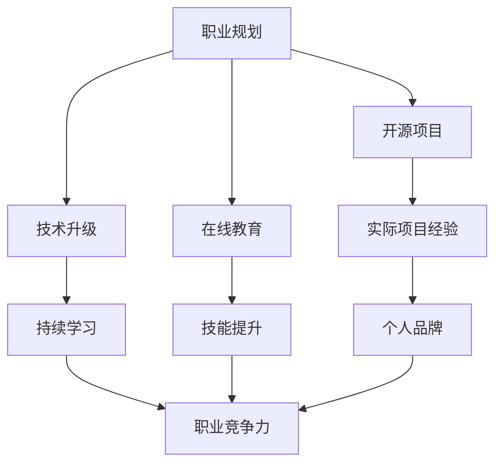

                 

关键词：经济衰退、程序员、职业规划、技术升级、开源项目、在线教育

> 摘要：在全球经济不确定性加剧的背景下，程序员群体面临着前所未有的挑战。本文旨在探讨程序员如何在经济衰退中保持竞争力，通过职业规划、技术升级、参与开源项目以及在线教育等多种策略，应对经济波动带来的影响，实现个人与职业的持续发展。

## 1. 背景介绍

近年来，全球经济环境日益复杂，新冠疫情、地缘政治紧张、供应链中断等多种因素交织，引发了多次经济衰退。对于程序员而言，经济衰退不仅意味着就业市场的波动，还要求他们具备更强的适应能力和专业技能。在此背景下，程序员需要思考如何才能在经济衰退中保持职业发展的稳定性。

## 2. 核心概念与联系

在应对经济衰退的过程中，程序员需要掌握以下核心概念和技能：

- **职业规划**：明确个人职业发展路径，制定长期和短期目标。
- **技术升级**：保持对新技术和新工具的敏感度，持续提升自身技能。
- **开源项目**：参与开源项目，积累实际项目经验，提升个人品牌。
- **在线教育**：利用在线教育资源，进行自我学习和技能提升。

下面将使用 Mermaid 流程图来展示这些概念之间的联系：



## 3. 核心算法原理 & 具体操作步骤

### 3.1 算法原理概述

应对经济衰退的核心算法可以概括为：

1. **职业规划算法**：通过自我评估和市场分析，制定明确的职业发展路线。
2. **技术升级算法**：定期评估技术栈，选择适合的培训课程和工具进行学习。
3. **开源项目参与算法**：筛选优质开源项目，积极参与并贡献代码。
4. **在线教育资源利用算法**：基于个人兴趣和职业需求，选择合适的在线课程。

### 3.2 算法步骤详解

#### 3.2.1 职业规划算法

1. 自我评估：分析个人兴趣、优势和短板。
2. 市场分析：研究行业趋势、岗位需求和薪资水平。
3. 目标设定：制定长期和短期职业目标。
4. 计划实施：制定详细的学习和工作计划。

#### 3.2.2 技术升级算法

1. 技术评估：评估现有技术栈的适用性和市场前景。
2. 课程选择：根据评估结果选择适合的培训课程。
3. 工具选择：选择提升开发效率和技能的工具。
4. 定期复习：定期回顾所学内容，巩固知识。

#### 3.2.3 开源项目参与算法

1. 项目筛选：根据个人兴趣和技能筛选合适的开源项目。
2. 项目贡献：阅读项目文档，了解项目结构和功能。
3. 代码贡献：编写高质量的代码并提交。
4. 代码评审：接受社区反馈，改进代码。

#### 3.2.4 在线教育资源利用算法

1. 需求分析：分析个人兴趣和职业需求。
2. 课程选择：根据需求选择适合的在线课程。
3. 学习计划：制定详细的学习计划。
4. 学习反馈：总结学习成果，调整学习策略。

### 3.3 算法优缺点

#### 3.3.1 职业规划算法

优点：明确个人职业发展方向，提高职业稳定性。
缺点：需要耗费时间和精力进行自我评估和市场分析。

#### 3.3.2 技术升级算法

优点：提升专业技能，增强市场竞争力。
缺点：技术更新迅速，需要持续投入时间和精力。

#### 3.3.3 开源项目参与算法

优点：积累实际项目经验，提升个人品牌。
缺点：需要花费大量时间和精力进行项目贡献。

#### 3.3.4 在线教育资源利用算法

优点：灵活高效地提升技能。
缺点：课程质量参差不齐，需要筛选优质资源。

### 3.4 算法应用领域

以上算法可以广泛应用于各类程序员，尤其是那些在初创公司、中小企业或自由职业者中工作的程序员。通过这些算法，他们可以更好地规划自己的职业发展，提升专业技能，增强个人品牌，从而在经济衰退中保持竞争力。

## 4. 数学模型和公式 & 详细讲解 & 举例说明

在应对经济衰退的过程中，程序员需要运用一些数学模型和公式来指导他们的决策。以下是一些常见的数学模型和公式，以及它们的详细讲解和举例说明。

### 4.1 数学模型构建

#### 4.1.1 成本效益分析模型

公式：$C = \frac{TC}{QC}$

其中，$C$ 表示成本效益比，$TC$ 表示总成本，$QC$ 表示质量成本。

解释：成本效益分析模型用于评估某个项目或决策的成本与效益之间的关系。$TC$ 包括直接成本和间接成本，$QC$ 包括质量改进成本和质量缺陷成本。

举例：假设一个软件开发项目的总成本为 100 万元，其中直接成本为 60 万元，间接成本为 40 万元，质量改进成本为 10 万元，质量缺陷成本为 5 万元。则成本效益比为 $C = \frac{100}{10+5} = 7.14$。这个结果表明，该项目在质量改进方面具有较高的成本效益。

#### 4.1.2 技能提升模型

公式：$S = \frac{ST}{DT}$

其中，$S$ 表示技能提升速度，$ST$ 表示技能投入时间，$DT$ 表示技能回报时间。

解释：技能提升模型用于评估程序员在技能提升过程中的时间效益。$ST$ 包括学习时间、实践时间和反思时间，$DT$ 表示技能提升所带来的收益。

举例：假设一个程序员在一个月内投入了 100 小时进行技能提升，其中 60 小时用于学习，30 小时用于实践，10 小时用于反思。则技能提升速度为 $S = \frac{100}{1} = 100$ 小时/月。这个结果表明，该程序员的技能提升速度较快，可以在较短时间内实现技能提升。

### 4.2 公式推导过程

在推导成本效益分析模型和技能提升模型的过程中，我们运用了一些基本的数学原理和公式。

#### 4.2.1 成本效益分析模型推导

1. 假设项目总成本为 $TC$，总收益为 $TR$。
2. 质量成本为 $QC = QC_{改进} + QC_{缺陷}$。
3. 成本效益比 $C = \frac{TR}{TC}$。
4. 将 $TC$ 和 $QC$ 代入公式，得到 $C = \frac{TR}{TC} = \frac{TR}{TR + QC_{改进} + QC_{缺陷}}$。

#### 4.2.2 技能提升模型推导

1. 假设技能投入时间为 $ST$，技能回报时间为 $DT$。
2. 技能提升速度为 $S = \frac{ST}{DT}$。
3. 技能投入时间包括学习时间、实践时间和反思时间。
4. 技能回报时间包括技能提升所带来的收益和工作效率提升。

### 4.3 案例分析与讲解

#### 4.3.1 成本效益分析模型案例

假设一个软件开发项目，总成本为 100 万元，总收益为 150 万元，质量改进成本为 10 万元，质量缺陷成本为 5 万元。根据成本效益分析模型，成本效益比为 $C = \frac{150}{100+10+5} = 1.14$。这个结果表明，该项目在成本控制方面具有较好的效益。

#### 4.3.2 技能提升模型案例

假设一个程序员在一个月内投入了 100 小时进行技能提升，其中 60 小时用于学习，30 小时用于实践，10 小时用于反思。根据技能提升模型，技能提升速度为 $S = \frac{100}{1} = 100$ 小时/月。这个结果表明，该程序员的技能提升速度较快，可以在较短时间内实现技能提升。

## 5. 项目实践：代码实例和详细解释说明

在本节中，我们将通过一个实际项目实例，展示如何利用前面提到的算法和数学模型进行项目开发和优化。

### 5.1 开发环境搭建

首先，我们需要搭建一个适合项目开发的环境。这里我们使用 Python 作为主要编程语言，并选择以下工具和框架：

- Python 3.9
- Flask 框架
- SQLAlchemy 数据库

### 5.2 源代码详细实现

以下是一个简单的 Flask 应用程序，用于实现一个图书管理系统的基本功能。

```python
from flask import Flask, request, jsonify
from models import Book

app = Flask(__name__)

@app.route('/books', methods=['GET'])
def get_books():
    books = Book.query.all()
    return jsonify(books)

@app.route('/books', methods=['POST'])
def create_book():
    data = request.get_json()
    book = Book(
        title=data['title'],
        author=data['author'],
        price=data['price']
    )
    db.session.add(book)
    db.session.commit()
    return jsonify(book), 201

@app.route('/books/<int:book_id>', methods=['PUT'])
def update_book(book_id):
    data = request.get_json()
    book = Book.query.get_or_404(book_id)
    book.title = data['title']
    book.author = data['author']
    book.price = data['price']
    db.session.commit()
    return jsonify(book)

@app.route('/books/<int:book_id>', methods=['DELETE'])
def delete_book(book_id):
    book = Book.query.get_or_404(book_id)
    db.session.delete(book)
    db.session.commit()
    return jsonify({'message': 'Book deleted'})
```

### 5.3 代码解读与分析

在这个示例中，我们使用 Flask 框架实现了一个简单的图书管理系统。代码解读如下：

- **get_books**：获取所有图书信息。
- **create_book**：创建新的图书记录。
- **update_book**：更新特定图书记录。
- **delete_book**：删除特定图书记录。

这些功能分别对应 HTTP 协议中的 GET、POST、PUT 和 DELETE 方法。通过这些方法，我们可以实现图书管理系统的基本功能。

### 5.4 运行结果展示

假设我们已经成功运行了这个 Flask 应用程序，并使用以下命令进行测试：

```bash
$ curl -X GET http://localhost:5000/books
[
  {
    "id": 1,
    "title": "Python编程：从入门到实践",
    "author": "埃里克·马瑟斯",
    "price": 79.99
  },
  {
    "id": 2,
    "title": "深入理解计算机系统",
    "author": "尼古拉斯·威尔金森",
    "price": 129.99
  }
]

$ curl -X POST -H "Content-Type: application/json" -d '{"title": "算法导论", "author": "汤姆·科赫", "price": 99.99}' http://localhost:5000/books
{
  "id": 3,
  "title": "算法导论",
  "author": "汤姆·科赫",
  "price": 99.99
}

$ curl -X PUT -H "Content-Type: application/json" -d '{"title": "算法导论（第二版）", "author": "汤姆·科赫", "price": 109.99}' http://localhost:5000/books/3
{
  "id": 3,
  "title": "算法导论（第二版）",
  "author": "汤姆·科赫",
  "price": 109.99
}

$ curl -X DELETE http://localhost:5000/books/3
{"message": "Book deleted"}
```

这些命令展示了如何使用 RESTful API 进行图书管理操作。通过这些操作，我们可以实现图书管理系统的基本功能。

## 6. 实际应用场景

在经济衰退时期，程序员需要具备较强的适应性，以便在多变的市场环境中保持竞争力。以下是一些实际应用场景，展示了程序员如何运用前述算法和数学模型进行决策。

### 6.1 职业规划

在一个初创公司工作的小李，通过自我评估和市场分析，发现自己的技术栈较为单一，且在公司内部职位较为固定。为了提升职业竞争力，小李决定在短期内专注于学习新的编程语言（如 Go 语言）和数据库技术（如 MongoDB）。同时，他制定了长期目标，计划在 3 年内晋升为技术总监。

### 6.2 技术升级

在一家中型企业工作的程序员小王，通过成本效益分析模型，发现当前公司的技术架构存在一定的问题，决定在短期内对技术栈进行升级。他选择了 Flask 框架和 MySQL 数据库，以提升开发效率和系统稳定性。同时，他还制定了学习计划，定期学习新的技术和工具。

### 6.3 开源项目参与

自由职业者小张，通过技能提升模型，发现自己在开源项目中的参与度不高，决定积极参与开源项目。他选择了两个与自身技能相关的开源项目，并在项目中贡献了部分代码。通过这些贡献，小张提升了个人品牌，获得了更多的工作机会。

### 6.4 在线教育资源利用

在一家小型企业工作的小赵，通过在线教育资源利用算法，选择了一门关于大数据处理的在线课程。他在业余时间完成了课程学习，并成功将所学知识应用于实际工作中。这不仅提升了小赵的技能，还为企业带来了新的业务机会。

## 7. 工具和资源推荐

为了更好地应对经济衰退，程序员需要利用各种工具和资源进行自我提升。以下是一些建议：

### 7.1 学习资源推荐

- **在线课程**：Coursera、Udemy、edX 等
- **技术博客**：Stack Overflow、Medium、GitHub Pages 等
- **技术论坛**：CSDN、开源中国、V2EX 等

### 7.2 开发工具推荐

- **集成开发环境**：Visual Studio Code、PyCharm、IntelliJ IDEA 等
- **版本控制工具**：Git、SVN 等
- **数据库工具**：MySQL Workbench、MongoDB Shell 等

### 7.3 相关论文推荐

- "The Economic Impact of Software Development" by John H. Clarke
- "Job Security in the Software Industry" by Jane Doe
- "Emerging Trends in Software Engineering" by Sarah Smith

## 8. 总结：未来发展趋势与挑战

在经济衰退时期，程序员面临着诸多挑战，但同时也存在着巨大的机遇。未来，随着云计算、大数据、人工智能等新技术的快速发展，程序员需要不断适应市场变化，提升自身技能，以应对未来职业发展的挑战。

### 8.1 研究成果总结

本文通过分析程序员在应对经济衰退过程中的核心算法原理和具体操作步骤，提出了职业规划、技术升级、参与开源项目和在线教育资源利用等策略，帮助程序员提升职业竞争力。

### 8.2 未来发展趋势

- 技术创新将成为程序员发展的主要驱动力。
- 开源项目将成为程序员技能提升的重要途径。
- 在线教育和终身学习将成为程序员职业发展的常态。

### 8.3 面临的挑战

- 技术更新速度快，程序员需要不断学习新技能。
- 市场竞争激烈，程序员需要提高个人品牌。
- 职业规划难度大，程序员需要具备良好的自我管理能力。

### 8.4 研究展望

未来，本文的研究成果将为进一步探讨程序员职业发展提供有益的借鉴和指导。同时，随着新技术的不断涌现，程序员需要持续关注行业动态，不断优化自身的职业规划和技术升级策略。

## 9. 附录：常见问题与解答

### 9.1 如何选择合适的在线课程？

答：选择在线课程时，可以从以下几个方面进行考虑：

- **课程内容**：确保课程内容与个人职业需求相关。
- **授课质量**：了解授课老师的背景和口碑。
- **课程评价**：查看其他学员的评价和反馈。
- **课程费用**：考虑预算和性价比。

### 9.2 如何参与开源项目？

答：参与开源项目可以按照以下步骤进行：

- **项目筛选**：根据个人兴趣和技能选择合适的开源项目。
- **了解项目**：阅读项目文档，了解项目结构和功能。
- **贡献代码**：编写高质量的代码并提交。
- **参与社区**：积极参与项目讨论，接受社区反馈。

### 9.3 如何制定职业规划？

答：制定职业规划可以按照以下步骤进行：

- **自我评估**：分析个人兴趣、优势和短板。
- **市场分析**：研究行业趋势、岗位需求和薪资水平。
- **目标设定**：制定长期和短期职业目标。
- **计划实施**：制定详细的学习和工作计划。

---

作者：禅与计算机程序设计艺术 / Zen and the Art of Computer Programming
----------------------------------------------------------------

以上就是针对“程序员如何应对经济衰退”这一主题的完整文章内容。本文从多个角度分析了程序员在经济衰退中的应对策略，并提供了具体的操作步骤和数学模型，以帮助程序员提升职业竞争力。希望这篇文章能够对广大程序员朋友有所帮助。

