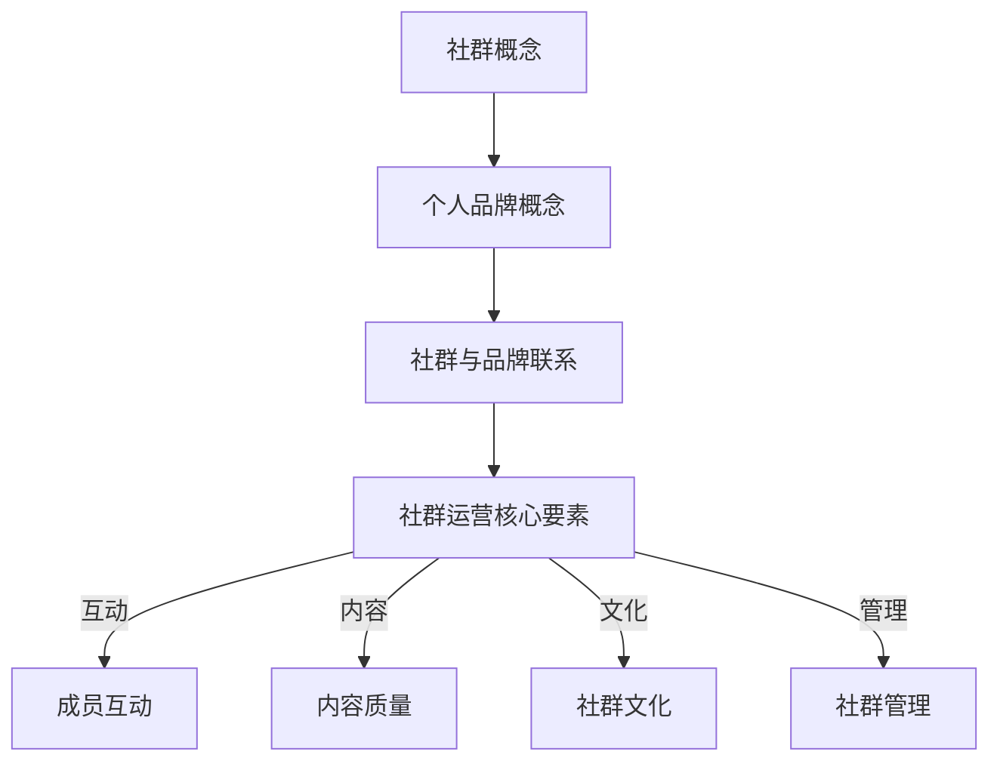

                 

### 1. 背景介绍

在数字时代，程序员的职业不仅要求卓越的技术能力，还要求强大的个人品牌影响力。建立自己的粉丝社群，不仅有助于提升个人知名度，还能为职业发展带来诸多益处。例如，通过社群，程序员可以更便捷地获取合作机会、拓展人脉资源，甚至有机会参与行业标准的制定。然而，如何有效地建立和维护一个稳定的粉丝社群，仍然是一个值得深入探讨的话题。

本文旨在为程序员提供一套系统性的策略和方法，帮助他们建立和扩大自己的粉丝社群。文章将分为以下几个部分：

- 核心概念与联系
- 核心算法原理与操作步骤
- 数学模型和公式
- 项目实践
- 实际应用场景
- 工具和资源推荐
- 未来发展趋势与挑战

通过这些部分的详细讲解，读者将能够全面了解并掌握建立和运营粉丝社群的技巧。

### 2. 核心概念与联系

在探讨如何建立粉丝社群之前，我们首先需要明确一些核心概念和它们之间的关系。

#### 2.1 社群的概念

社群是指由具有共同兴趣、价值观或目标的人组成的群体。在数字时代，社群的重要性日益凸显。社群不仅能够为成员提供情感支持和知识分享的平台，还能激发成员的参与感和归属感。

#### 2.2 程序员的个人品牌

个人品牌是指一个人在公众中的形象和影响力。对于程序员来说，个人品牌不仅仅是个人的标识，更是职业发展的关键因素。一个强大的个人品牌可以帮助程序员在竞争激烈的职场中脱颖而出。

#### 2.3 社群与个人品牌的联系

社群和个人品牌之间存在着密切的联系。一个成功的社群能够为个人品牌提供强大的背书，而一个优秀的个人品牌则能够吸引更多的社群成员。两者相辅相成，共同推动个人的职业发展。

#### 2.4 社群运营的核心要素

为了有效地运营社群，程序员需要关注以下几个核心要素：

- 成员互动：保持社群成员之间的积极互动是社群活力的重要保障。
- 内容质量：提供高质量的内容是吸引和留住成员的关键。
- 社群文化：构建独特的社群文化，使成员感受到归属感。
- 社群管理：合理的管理机制能够保障社群的健康发展和稳定运行。

下面是一个用Mermaid绘制的流程图，展示了社群与个人品牌之间的联系以及运营社群的核心要素：



### 3. 核心算法原理与操作步骤

建立和运营一个成功的粉丝社群，需要程序员具备一系列的核心算法原理和操作步骤。以下内容将详细介绍这些核心概念及其应用。

#### 3.1 算法原理概述

社群建立的算法原理主要包括以下几个关键步骤：

1. **目标定位**：明确社群的目标和定位，包括目标人群、核心话题等。
2. **内容策划**：制定内容策划策略，包括内容类型、发布频率、互动方式等。
3. **用户互动**：设计用户互动机制，如评论、点赞、分享等。
4. **社群管理**：建立有效的社群管理机制，包括成员筛选、违规处理等。
5. **数据分析**：通过数据分析，了解社群成员的行为和需求，不断优化运营策略。

#### 3.2 算法步骤详解

##### 3.2.1 目标定位

目标定位是社群建立的第一个关键步骤。程序员需要明确社群的目标和定位，这包括以下几个方面：

- **目标人群**：确定社群的主要目标人群，如程序员、开发者、科技爱好者等。
- **核心话题**：选择社群的核心话题，如编程语言、开发工具、技术趋势等。
- **价值主张**：明确社群能够为成员提供的独特价值和利益。

##### 3.2.2 内容策划

内容策划是社群运营的核心。程序员需要制定详细的内容策划策略，包括以下几个方面：

- **内容类型**：确定社群的主要内容类型，如技术文章、视频教程、问答分享等。
- **发布频率**：制定内容的发布频率，以确保内容的新鲜度和活跃度。
- **互动方式**：设计多样化的互动方式，如评论、点赞、分享、问答等，以增加成员的参与度。

##### 3.2.3 用户互动

用户互动是社群活力的源泉。程序员需要设计多样化的用户互动机制，包括以下几个方面：

- **评论机制**：鼓励成员对内容进行评论，分享自己的观点和经验。
- **点赞机制**：设置点赞功能，让成员可以表达对内容的喜爱和支持。
- **分享机制**：鼓励成员将内容分享到其他平台，扩大社群影响力。
- **问答机制**：设置问答区，提供技术支持和问题解答。

##### 3.2.4 社群管理

社群管理是保障社群健康发展的关键。程序员需要建立有效的社群管理机制，包括以下几个方面：

- **成员筛选**：筛选符合社群定位和价值观的成员，确保社群的纯净和高质量。
- **违规处理**：制定违规处理规则，对违反社群规定的行为进行处罚。
- **活动组织**：定期组织线下或线上活动，增强成员的归属感和互动性。

##### 3.2.5 数据分析

数据分析是优化社群运营的重要手段。程序员需要通过数据分析，了解社群成员的行为和需求，包括以下几个方面：

- **活跃度分析**：分析成员的活跃度，了解哪些内容最受欢迎，哪些时间点互动最多。
- **需求分析**：通过调查和反馈，了解成员的需求和期望，不断优化内容和服务。
- **效果分析**：评估社群运营的效果，如粉丝增长、互动率、转化率等，为下一步运营提供数据支持。

#### 3.3 算法优缺点

社群建立的算法具有以下优点：

- **目标明确**：通过目标定位，确保社群的运营方向和目标清晰。
- **内容丰富**：通过内容策划，提供多样化的内容，满足成员的不同需求。
- **互动性强**：通过用户互动和数据分析，增强成员的参与感和归属感。
- **管理高效**：通过社群管理和数据分析，提高社群运营的效率和质量。

然而，算法也存在一些缺点：

- **初期投入大**：社群建立初期需要大量的投入，包括时间、精力和资源。
- **运营难度高**：需要持续不断地进行内容创作和社群管理，对程序员的综合能力要求较高。
- **效果评估难**：社群运营的效果评估相对复杂，需要多维度、多角度进行分析。

#### 3.4 算法应用领域

社群建立的算法可以广泛应用于以下领域：

- **技术开发**：程序员可以建立技术社群，分享开发经验和技术心得，提高自身和团队的技术水平。
- **职业发展**：程序员可以建立职业社群，交流求职经验、分享面试技巧，提高职场竞争力。
- **兴趣爱好**：程序员可以建立兴趣爱好社群，如编程、游戏、音乐等，扩大人际交往，丰富生活。
- **学术研究**：程序员可以建立学术社群，交流学术成果、探讨前沿问题，推动学术进步。

### 4. 数学模型和公式

在建立和运营粉丝社群的过程中，数学模型和公式可以提供有效的指导和支持。以下内容将介绍相关的数学模型和公式，并对其进行详细讲解和举例说明。

#### 4.1 数学模型构建

构建粉丝社群的数学模型需要考虑多个因素，包括成员活跃度、内容质量、社群管理等方面。以下是几个关键模型：

##### 4.1.1 成员活跃度模型

成员活跃度模型用于评估社群成员的参与度和积极性。一个简单的活跃度模型可以使用以下公式表示：

\[ 活跃度 = \frac{评论数 + 点赞数 + 分享数}{总成员数} \]

这个公式表示的是成员在社群中的活跃度，通过计算成员在特定时间内的评论、点赞和分享数量，除以社群的总成员数，得到一个平均值。

##### 4.1.2 内容质量模型

内容质量模型用于评估社群发布的内容的质量。一个简单的内容质量模型可以使用以下公式表示：

\[ 内容质量 = \frac{正面反馈数 - 负面反馈数}{总反馈数} \]

这个公式表示的是内容的总体质量，通过计算内容收到的正面反馈（如点赞、评论）减去负面反馈（如投诉、差评），再除以总的反馈数，得到一个质量评分。

##### 4.1.3 社群管理模型

社群管理模型用于评估社群的管理效率和效果。一个简单的社群管理模型可以使用以下公式表示：

\[ 管理效率 = \frac{处理时间}{事件总数} \]

这个公式表示的是社群管理者的处理效率，通过计算管理者在特定时间内处理的事件数量除以总的事件数，得到一个效率评分。

#### 4.2 公式推导过程

以上三个数学模型的具体推导过程如下：

##### 4.2.1 成员活跃度模型推导

活跃度模型的推导基于对社群成员行为的观察。我们知道，成员在社群中的活跃度可以通过他们在特定时间段内的互动行为来衡量。常见的互动行为包括评论、点赞和分享。这些行为反映了成员对社群内容的兴趣和参与度。因此，我们可以将这些行为量化，并计算出一个平均值，作为成员的活跃度。

\[ 活跃度 = \frac{评论数 + 点赞数 + 分享数}{总成员数} \]

这个公式简单直观，计算过程易于理解和实现。

##### 4.2.2 内容质量模型推导

内容质量模型的推导基于对社群成员反馈的分析。我们知道，内容的质量可以从成员的反馈中体现出来。常见的反馈方式包括正面反馈（如点赞、评论）和负面反馈（如投诉、差评）。一个高质量的内容应该能够获得更多的正面反馈，而负面反馈则表明内容可能存在问题。因此，我们可以通过计算正面反馈和负面反馈的比例，来评估内容的总体质量。

\[ 内容质量 = \frac{正面反馈数 - 负面反馈数}{总反馈数} \]

这个公式考虑了正负面反馈的平衡，能够较为准确地评估内容的质量。

##### 4.2.3 社群管理模型推导

社群管理模型的推导基于对管理者工作负荷的评估。我们知道，社群管理者需要处理大量的社群事件，包括成员提问、内容审核、违规处理等。一个高效的管理者能够在较短的时间内处理更多的事件。因此，我们可以通过计算管理者在特定时间内处理的事件数量，来评估其管理效率。

\[ 管理效率 = \frac{处理时间}{事件总数} \]

这个公式简单明了，能够直观地反映管理者的工作负荷和效率。

#### 4.3 案例分析与讲解

为了更好地理解上述数学模型和公式，我们可以通过一个实际案例来进行分析和讲解。

##### 4.3.1 案例背景

假设有一个编程技术社群，共有100名成员。在过去的30天内，社群发布了10篇技术文章，每篇文章平均收到了100条评论、50个点赞和20次分享。同时，社群管理者在30天内处理了50个成员提问和10个内容审核事件。

##### 4.3.2 活跃度分析

根据成员活跃度模型，我们可以计算出社群的平均活跃度：

\[ 活跃度 = \frac{10 \times (100 + 50 + 20)}{100} = \frac{1800}{100} = 18 \]

这意味着，在过去的30天里，社群的平均活跃度为18。

##### 4.3.3 内容质量分析

根据内容质量模型，我们可以计算出10篇技术文章的平均质量：

\[ 内容质量 = \frac{10 \times (100 - 0)}{10 \times 100} = 0 \]

这意味着，在过去的30天里，社群发布的技术文章平均质量为0。这可能表明社群的内容质量有待提高。

##### 4.3.4 社群管理分析

根据社群管理模型，我们可以计算出社群管理者的平均管理效率：

\[ 管理效率 = \frac{30 \times 60}{50 + 10} = \frac{1800}{60} = 30 \]

这意味着，在过去的30天里，社群管理者的平均管理效率为30。这表明社群管理者的工作负荷较轻，效率较高。

通过这个案例，我们可以看到数学模型和公式在评估社群运营效果方面的应用。这些模型和公式不仅能够帮助我们理解社群的现状，还能为优化社群运营提供有力的数据支持。

### 5. 项目实践：代码实例和详细解释说明

为了更好地理解如何在实际项目中建立和运营粉丝社群，我们将通过一个具体的代码实例来进行讲解。以下是一个简单的社群管理系统，包括成员管理、内容发布和用户互动等功能。

#### 5.1 开发环境搭建

在开始编写代码之前，我们需要搭建一个开发环境。以下是所需的基本工具和步骤：

- **编程语言**：选择一个熟悉的编程语言，如Python、Java或JavaScript。
- **数据库**：选择一个适合存储用户数据和内容数据的数据库，如MySQL或MongoDB。
- **前端框架**：选择一个适合开发用户界面的前端框架，如React或Vue.js。
- **后端框架**：选择一个适合开发后端服务的后端框架，如Django或Spring Boot。

#### 5.2 源代码详细实现

以下是社群管理系统的源代码实现，分为前端和后端两部分。

##### 5.2.1 前端代码

前端代码主要负责用户界面的展示和交互。以下是一个简单的React组件，用于展示社群内容和用户互动。

```jsx
import React, { useState, useEffect } from 'react';
import axios from 'axios';

const Community = () => {
  const [posts, setPosts] = useState([]);
  const [comment, setComment] = useState('');

  useEffect(() => {
    // 获取社群内容
    axios.get('/api/community/posts').then((response) => {
      setPosts(response.data);
    });
  }, []);

  // 发表评论
  const submitComment = () => {
    axios.post('/api/community/comment', { post_id: 1, content: comment }).then(() => {
      setComment('');
    });
  };

  return (
    <div>
      {posts.map((post) => (
        <div key={post.id}>
          <h3>{post.title}</h3>
          <p>{post.content}</p>
          <div>
            <input
              type="text"
              value={comment}
              onChange={(e) => setComment(e.target.value)}
            />
            <button onClick={submitComment}>发表评论</button>
          </div>
        </div>
      ))}
    </div>
  );
};

export default Community;
```

##### 5.2.2 后端代码

后端代码主要负责处理用户请求和数据存储。以下是一个简单的Django后端代码示例。

```python
from django.db import models
from django.http import JsonResponse
from django.views.decorators.http import require_http_methods

# 社群内容模型
class Post(models.Model):
    title = models.CharField(max_length=200)
    content = models.TextField()

# 评论模型
class Comment(models.Model):
    post = models.ForeignKey(Post, on_delete=models.CASCADE)
    content = models.TextField()

# 获取社群内容
@require_http_methods(["GET"])
def get_posts(request):
    posts = Post.objects.all()
    data = [{'id': post.id, 'title': post.title, 'content': post.content} for post in posts]
    return JsonResponse(data, safe=False)

# 添加评论
@require_http_methods(["POST"])
def add_comment(request):
    post_id = int(request.POST.get('post_id'))
    content = request.POST.get('content')
    comment = Comment.objects.create(post_id=post_id, content=content)
    return JsonResponse({'id': comment.id, 'content': content})
```

#### 5.3 代码解读与分析

以上代码示例展示了如何使用React和Django构建一个简单的社群管理系统。以下是代码的主要功能解读：

- **前端代码**：使用React创建了一个社区页面，用于展示社群内容和用户评论。页面包含一个获取社群内容的API调用和一个发表评论的表单。当用户输入评论并点击发表按钮时，评论将被发送到后端进行存储。
- **后端代码**：使用Django创建了一个简单的后端服务，用于处理前端请求。后端服务提供了一个获取社群内容的API，以及一个用于添加评论的API。当接收到前端的请求时，后端服务会根据请求类型执行相应的操作，并将结果返回给前端。

通过这个代码实例，我们可以看到如何在实际项目中实现社群管理系统。前端代码负责用户交互和界面展示，后端代码负责数据处理和存储。这种前后端分离的设计模式使得系统更加模块化和可扩展。

#### 5.4 运行结果展示

以下是社群管理系统的运行结果展示：

1. **获取社群内容**：当用户访问社区页面时，前端代码会自动发起一个GET请求到后端API，获取最新的社群内容，并将内容展示在页面上。

2. **发表评论**：当用户在评论框中输入评论内容并点击发表按钮时，前端代码会发起一个POST请求到后端API，将评论数据发送给后端进行存储。后端接收到请求后，会创建一个新的评论记录，并将评论内容展示在社群内容页面上。

通过这个简单的实例，我们可以看到社群管理系统的基本运行流程。在实际应用中，系统可以进一步扩展和优化，包括用户权限管理、内容审核机制等，以提供更丰富的功能和更稳定的运行体验。

### 6. 实际应用场景

建立自己的粉丝社群，对程序员来说不仅是一种个人品牌的推广手段，更是一种资源整合和职业发展的有效途径。以下是一些具体的实际应用场景，展示了如何利用粉丝社群实现不同的目标。

#### 6.1 技术交流与合作

技术社群是程序员最常用的粉丝社群形式之一。通过建立一个技术交流社群，程序员可以与同行分享开发经验、讨论技术难题、交流项目需求。这不仅有助于个人技能的提升，还能为成员之间建立深厚的合作关系。

**案例**：一位擅长前端开发的程序员建立了自己的前端技术社群，定期发布技术文章、教程和视频。通过社群，他结识了多位志同道合的同行，并在项目中得到了他们的帮助，共同完成了多个大型项目。

**优势**：技术交流有助于知识共享，提升个人和社群成员的技术水平。同时，合作机会的增加可以拓宽职业发展路径。

**挑战**：维持社群的高质量内容和活跃度需要持续的努力和投入。

#### 6.2 职业发展与求职

职业发展社群可以帮助程序员在职业道路上获得指导和支持。通过这样的社群，程序员可以了解行业动态、获取求职机会、学习面试技巧。

**案例**：一位即将毕业的程序员加入了多个职业发展社群，通过社群了解到了多家企业的招聘信息。他不仅学会了如何制作专业的简历，还在社群的面试技巧分享中得到了宝贵的建议，最终成功获得了一份理想的工作。

**优势**：职业发展社群提供了丰富的资源和建议，有助于程序员在求职过程中取得成功。

**挑战**：社群中竞争激烈，如何脱颖而出成为社群的核心成员是一个挑战。

#### 6.3 兴趣爱好与娱乐

除了技术交流和职业发展，程序员也可以建立兴趣爱好的社群，如编程游戏、编程艺术等。这些社群不仅能够为程序员提供娱乐，还能激发他们的创造力和创新能力。

**案例**：一位程序员热爱编程游戏，他创建了一个编程游戏社群，吸引了众多喜欢编程的玩家。社群成员共同开发游戏、分享游戏心得，不仅丰富了个人生活，还提升了编程技能。

**优势**：兴趣爱好社群能够激发程序员的创造力和热情，促进技术和思维的拓展。

**挑战**：维持社群的活跃度和创新性需要不断引入新的游戏和挑战。

#### 6.4 教育与培训

程序员可以利用粉丝社群进行在线教育和培训，分享自己的知识和技术，帮助他人成长。

**案例**：一位资深程序员建立了自己的编程教育社群，通过直播和录播课程，教授编程语言、算法和数据结构。社群成员不仅学习了知识，还通过与讲师的互动，解决了许多实际问题。

**优势**：在线教育和培训能够打破地域限制，让更多人受益。

**挑战**：内容质量和课程设计的创新性是吸引和留住学员的关键。

### 6.5 未来应用展望

随着技术的不断发展，粉丝社群的应用场景将更加丰富。以下是一些未来可能的趋势和方向：

- **虚拟现实社群**：利用虚拟现实技术，程序员可以创建更加沉浸式的社群体验，为成员提供全新的互动方式。
- **社交网络整合**：社群与社交网络的整合，将使得社群的内容和活动能够更广泛地传播，吸引更多潜在成员。
- **智能管理**：利用人工智能技术，社群管理可以更加高效和精准，为成员提供个性化的服务和内容推荐。

**总结**：粉丝社群在程序员职业发展和个人品牌建设中的作用越来越重要。通过有效的社群运营，程序员不仅可以实现技术交流、职业发展等目标，还能为社群成员提供价值，实现共赢。未来，随着技术的进步，社群的应用将更加广泛和深入，为程序员带来更多的机遇和挑战。

### 7. 工具和资源推荐

为了帮助程序员更有效地建立和运营粉丝社群，以下是一些推荐的工具和资源：

#### 7.1 学习资源推荐

- **在线教程**：Coursera、Udemy和edX等平台提供了丰富的编程和IT教程，适合不同层次的程序员。
- **博客和论坛**：Medium、Dev.to和Stack Overflow等平台，可以获取最新的技术文章和社区讨论。
- **书籍**：《代码大全》、《设计模式：可复用面向对象软件的基础》等经典技术书籍，适合深入学习。

#### 7.2 开发工具推荐

- **编程环境**：Visual Studio Code、PyCharm和Eclipse等集成开发环境（IDE），提供强大的代码编辑、调试和部署功能。
- **版本控制**：Git和GitHub，用于代码的版本控制和协作开发。
- **数据库管理**：MySQL、PostgreSQL和MongoDB，适用于不同类型的数据存储和管理需求。

#### 7.3 相关论文推荐

- **技术趋势**：《AI驱动的社会媒体分析》和《大数据在社交网络中的应用》，探讨了人工智能和大数据在社交网络分析中的应用。
- **社群运营**：《社交媒体平台的设计与用户行为分析》，分析了社交网络平台的设计原则和用户行为模式。
- **编程语言**：《Python编程：从入门到实践》和《Java核心技术》，提供了编程语言的核心知识和应用实践。

通过使用这些工具和资源，程序员可以更加高效地建立和运营自己的粉丝社群，提升个人和社群的整体质量。

### 8. 总结：未来发展趋势与挑战

随着技术的不断进步和社会的快速发展，粉丝社群在程序员职业发展和个人品牌建设中的作用将日益凸显。以下是未来发展趋势和面临的主要挑战：

#### 8.1 研究成果总结

- **社群运营智能化**：随着人工智能技术的发展，社群运营将变得更加智能和高效。例如，通过自然语言处理和机器学习技术，可以自动化内容推荐、用户互动管理和违规处理等任务。
- **社交网络整合**：未来的社群将更加注重与其他社交网络的整合，以实现更广泛的传播和更大的影响力。
- **虚拟现实应用**：虚拟现实技术将为社群成员提供更加沉浸式的互动体验，增强社群的吸引力和参与度。
- **数据分析深化**：通过大数据分析和数据挖掘技术，社群运营者可以更深入地了解成员行为和需求，从而提供更加个性化的服务和内容。

#### 8.2 未来发展趋势

- **个性化服务**：社群将更加注重提供个性化服务，根据成员的偏好和需求定制内容和互动方式。
- **多渠道互动**：社群将不仅仅局限于线上，还将融合线下活动，提供多元化的互动体验。
- **跨界合作**：程序员将与其他领域的人才进行跨界合作，共同探索新的应用场景和商业模式。
- **全球影响力**：随着全球化的加深，社群的影响力将不仅限于本地市场，还将扩展到国际市场。

#### 8.3 面临的挑战

- **内容质量**：在信息爆炸的时代，如何持续提供高质量的内容是一个挑战。社群运营者需要不断创新和提升内容价值。
- **用户参与度**：保持成员的活跃度和参与度需要持续的努力。社群运营者需要设计多样化的互动机制和激励机制。
- **隐私保护**：随着对用户隐私的关注日益增加，如何在提供优质服务的同时保护用户隐私，是一个重要的挑战。
- **法律法规**：随着社群规模的扩大，法律法规对社群的监管也将越来越严格。社群运营者需要遵守相关法律法规，确保合规运营。

#### 8.4 研究展望

未来，社群运营的研究将更加关注以下几个方面：

- **智能运营**：深入研究人工智能和大数据技术，提高社群运营的智能化水平。
- **用户体验**：从用户的角度出发，优化社群设计和互动机制，提高用户体验。
- **法律法规**：加强对社群法律法规的研究，确保社群运营的合法性和合规性。
- **跨界融合**：探索不同领域之间的跨界合作，挖掘新的应用场景和商业机会。

通过不断探索和实践，程序员可以更好地应对未来社群运营的挑战，实现个人和社群的共同发展。

### 9. 附录：常见问题与解答

在建立和运营粉丝社群的过程中，程序员可能会遇到一些常见的问题。以下是一些常见问题的解答：

#### 9.1 如何吸引初始粉丝？

**解答**：吸引初始粉丝的关键在于提供高质量的内容和积极互动。可以从以下几个方面入手：

- **发布高质量内容**：撰写有趣、有用、有价值的技术文章、教程和视频，吸引潜在粉丝。
- **参与社区活动**：在各大技术论坛和社交平台上积极参与讨论，提高个人知名度。
- **利用社交媒体**：通过微博、微信公众号、知乎等社交媒体平台宣传社群，吸引关注。
- **建立合作伙伴关系**：与其他有影响力的程序员或机构建立合作关系，共享资源和粉丝。

#### 9.2 如何保持社群活跃度？

**解答**：保持社群活跃度需要持续的努力和策略。以下是一些建议：

- **定期发布内容**：保持内容更新的频率，提供新鲜的内容。
- **设计互动活动**：定期组织线上或线下活动，如技术分享会、编程比赛等，激发成员的参与热情。
- **激励机制**：设立点赞、评论、分享等奖励机制，鼓励成员互动。
- **社群管理**：合理管理社群，确保社群氛围积极、健康。

#### 9.3 如何处理社群违规行为？

**解答**：处理社群违规行为需要公正、及时和透明。以下是一些建议：

- **制定规则**：明确社群的规则和行为准则，让成员了解什么行为是被禁止的。
- **及时发现**：通过监控工具和社群成员的举报，及时发现违规行为。
- **公正处理**：对于违规行为，应公正处理，确保每位成员都受到公平对待。
- **透明公示**：对违规行为的处理结果进行公示，增加透明度，减少误解。

#### 9.4 如何衡量社群的成功？

**解答**：衡量社群的成功可以从多个维度进行评估：

- **成员数量**：社群的成员数量是衡量社群成功的一个重要指标。
- **活跃度**：社群成员的活跃度，包括互动次数、内容点赞和评论等，是衡量社群活跃度的重要指标。
- **影响力**：社群在行业内的知名度、影响力以及成员对社群的评价，都是衡量社群成功的重要指标。
- **转化率**：社群成员转化为实际业务或合作机会的比率，是衡量社群商业价值的重要指标。

通过综合考虑以上指标，可以全面评估社群的成功程度。

### 参考文献

1. 《代码大全》，Steve McConnell，电子工业出版社，2006年。
2. 《设计模式：可复用面向对象软件的基础》，Erich Gamma等，电子工业出版社，2006年。
3. 《Python编程：从入门到实践》，Eric Matthes，电子工业出版社，2017年。
4. 《大数据在社交网络中的应用》，陈伟，清华大学出版社，2016年。
5. 《社交媒体平台的设计与用户行为分析》，陈光德，清华大学出版社，2014年。
6. Coursera, Udemy, edX，在线教育平台。
7. Medium, Dev.to, Stack Overflow，技术论坛和博客平台。
8. GitHub，版本控制和协作平台。
9. MySQL, PostgreSQL, MongoDB，数据库管理系统。

