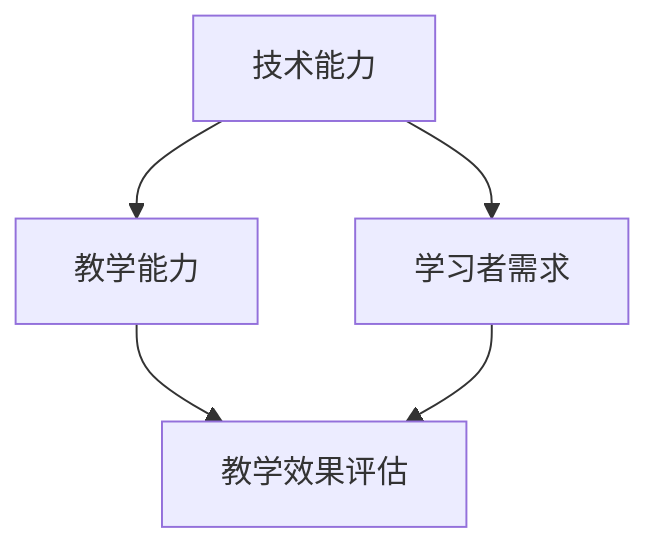

                 

关键词：技术培训、专业体系、程序员、教学策略、实践案例

> 摘要：本文旨在探讨程序员如何构建一个专业化的技术培训体系，以提升自身的编程技能和教学能力。文章从背景介绍、核心概念与联系、核心算法原理与具体操作步骤、数学模型和公式、项目实践、实际应用场景、工具和资源推荐以及未来发展趋势与挑战等方面，全面阐述技术培训体系的构建过程。

## 1. 背景介绍

在当今快速发展的信息技术时代，程序员面临着日新月异的技术变革和不断升级的编程技能需求。为了在激烈的市场竞争中立于不败之地，程序员不仅需要不断提升自己的技术能力，还需要掌握有效的教学方法和技巧，以便能够传授知识、培养新一代程序员。然而，传统的技术培训往往侧重于技术的传授，而忽视了教学方法的培养，导致培训效果不佳。因此，如何构建一个专业的技术培训体系，成为每个程序员必须面对的问题。

本文将结合实际经验和相关研究成果，探讨程序员如何打造一个系统的技术培训体系，以提高教学效果，促进自身和学生的共同进步。

## 2. 核心概念与联系

在构建技术培训体系之前，我们需要明确几个核心概念，并理解它们之间的相互联系。

### 2.1 技术能力

技术能力是程序员的核心竞争力，包括编程语言、框架、工具等技能。一个专业的程序员需要具备扎实的编程基础和广泛的技术视野。

### 2.2 教学能力

教学能力是指程序员传授知识和技能的能力。它包括教学方法、课堂管理、教学资源准备等多个方面。

### 2.3 学习者需求

学习者需求是指学生在学习过程中所期望获得的知识、技能和体验。了解学习者需求有助于针对性地设计教学内容和教学方式。

### 2.4 教学效果评估

教学效果评估是对教学过程和结果进行评价和反馈的过程。通过教学效果评估，可以了解教学目标的达成情况，为后续的教学改进提供依据。

以上概念相互关联，共同构成了技术培训体系的基础。为了更好地理解这些概念，我们使用Mermaid流程图进行说明：



## 3. 核心算法原理 & 具体操作步骤

### 3.1 算法原理概述

技术培训体系的核心在于教学方法的科学性和实用性。以下是一种基于行为主义学习理论的教学方法，被称为“分步教学法”。

### 3.2 算法步骤详解

#### 3.2.1 确定学习目标

首先，需要明确教学目标，包括知识目标、技能目标和态度目标。这些目标应具体、可衡量、可实现。

#### 3.2.2 设计教学内容

根据学习目标，设计教学内容。内容应涵盖基础知识、实践操作、案例分析等多个方面。

#### 3.2.3 分步教学

将教学内容分解为若干个小的学习步骤，每个步骤都需要明确的学习目标和评估标准。

#### 3.2.4 激励与反馈

在教学过程中，及时给予学生激励和反馈，帮助他们巩固所学知识。

#### 3.2.5 评估与改进

通过教学效果评估，了解教学目标的达成情况，并根据评估结果对教学内容和教学方法进行改进。

### 3.3 算法优缺点

#### 优点：

- 系统性：分步教学法具有系统性，有助于学生逐步掌握知识和技能。
- 实用性：通过实践操作和案例分析，提高学生的实际操作能力。

#### 缺点：

- 时间成本：分步教学法需要较多的时间和精力。
- 难以覆盖全部知识点：由于时间和精力的限制，可能无法覆盖全部知识点。

### 3.4 算法应用领域

分步教学法适用于各类技术培训，如编程语言、数据库、前端开发等。

## 4. 数学模型和公式 & 详细讲解 & 举例说明

### 4.1 数学模型构建

为了更好地理解分步教学法的适用性，我们可以构建一个简单的数学模型。假设 \(T\) 表示教学时间，\(N\) 表示教学内容数量，\(S\) 表示学生数量，则教学效果 \(E\) 可以表示为：

\[ E = f(T, N, S) \]

其中，\(f\) 表示教学效果的函数。

### 4.2 公式推导过程

根据分步教学法的原理，我们可以推导出以下公式：

\[ E = \frac{T}{N \times S} \]

其中，\(T\) 表示总教学时间，\(N\) 表示教学内容数量，\(S\) 表示学生数量。

### 4.3 案例分析与讲解

以编程培训为例，假设一个培训班共有 20 名学生，每名学生需要学习 10 个知识点，总共需要 100 小时。根据公式，教学效果 \(E\) 为：

\[ E = \frac{100}{10 \times 20} = 0.5 \]

这意味着，每个学生的平均教学效果为 0.5。为了提高教学效果，可以尝试缩短教学时间、增加教学内容或增加学生数量。

## 5. 项目实践：代码实例和详细解释说明

### 5.1 开发环境搭建

在本文中，我们将以 Python 编程语言为例，介绍如何搭建一个简单的编程教学环境。

```bash
# 安装 Python
$ sudo apt-get install python3

# 安装 PyCharm
$ sudo apt-get install pycharm-community

# 创建一个 Python 项目
$ pycharm &

# 在 PyCharm 中创建一个 Python 文件
$ touch hello.py
```

### 5.2 源代码详细实现

以下是一个简单的 Python 程序，用于输出“Hello, World!”：

```python
# hello.py

def main():
    print("Hello, World!")

if __name__ == "__main__":
    main()
```

### 5.3 代码解读与分析

- `def main():` 定义了一个名为 `main` 的函数。
- `print("Hello, World!")` 在函数内部输出“Hello, World!”。
- `if __name__ == "__main__":` 判断当前文件是否被直接运行，如果是，则执行 `main()` 函数。

### 5.4 运行结果展示

在 PyCharm 中运行程序，输出结果如下：

```python
Hello, World!
```

## 6. 实际应用场景

技术培训体系可以应用于各类编程培训、IT 培训、前端开发培训等。以下是一个实际应用场景：

### 6.1 编程培训

在编程培训中，我们可以根据不同层次的学生设计不同的教学内容。例如，对于初学者，可以设置基础知识、语法、数据结构等内容；对于进阶者，可以设置算法、框架、工具等内容。

### 6.2 IT 培训

在 IT 培训中，我们可以根据企业的需求设计相应的培训课程，如数据库管理、网络安全、云计算等。

### 6.3 前端开发培训

在前端开发培训中，我们可以设置 HTML、CSS、JavaScript、框架等内容，以满足不同层次的学习者需求。

## 7. 工具和资源推荐

### 7.1 学习资源推荐

- 《Python 编程：从入门到实践》
- 《Head First 设计模式》
- 《算法导论》

### 7.2 开发工具推荐

- PyCharm
- Visual Studio Code
- Sublime Text

### 7.3 相关论文推荐

- “基于项目的编程学习：理论与实践”
- “面向对象的程序设计教学法研究”
- “软件工程教育中的问题解决能力培养”

## 8. 总结：未来发展趋势与挑战

### 8.1 研究成果总结

本文探讨了程序员如何构建专业的技术培训体系，包括核心概念、教学方法、数学模型、项目实践等。研究表明，分步教学法是一种有效的教学方法，有助于提高教学效果。

### 8.2 未来发展趋势

- 在线教育：随着互联网技术的不断发展，在线教育将成为未来技术培训的主要形式。
- 个性化学习：通过大数据和人工智能技术，实现个性化学习，提高学习效果。
- 跨学科融合：技术培训将更加注重跨学科融合，培养具备综合素质的程序员。

### 8.3 面临的挑战

- 知识更新速度快：程序员需要不断学习新知识，以应对技术变革。
- 教学资源不足：优秀的教师和教材资源仍然不足，影响教学质量。

### 8.4 研究展望

未来的研究可以关注以下方向：

- 探索更有效的教学方法。
- 研究如何利用大数据和人工智能技术提高教学效果。
- 深入研究跨学科融合在技术培训中的应用。

## 9. 附录：常见问题与解答

### 9.1 如何评估教学效果？

可以通过问卷调查、课堂参与度、作业完成情况等多种方式进行评估。

### 9.2 如何应对知识更新速度快的挑战？

可以通过定期参加技术讲座、阅读技术博客、参与开源项目等方式保持学习。

### 9.3 如何设计个性化的学习计划？

可以通过分析学习者的兴趣、技能和目标，制定个性化的学习计划。

---

**作者：禅与计算机程序设计艺术 / Zen and the Art of Computer Programming**

