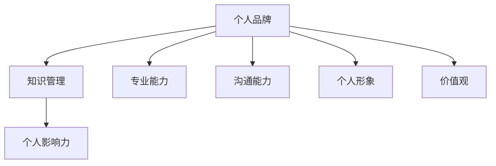

                 

关键词：个人知识品牌，程序员，影响力，自我提升，专业发展

> 摘要：在信息技术飞速发展的今天，个人品牌的建设成为程序员职业发展的重要环节。本文旨在探讨程序员如何通过构建个人知识品牌，提升个人影响力，实现专业发展，从而在竞争激烈的职场中脱颖而出。

## 1. 背景介绍

随着互联网技术的不断进步，信息传播的速度和范围都达到了前所未有的高度。在这个信息爆炸的时代，如何让个人知识和技能得到有效传播和认可，成为每一个程序员必须面对的课题。个人知识品牌不仅体现了程序员的职业素养和专业水平，也是其个人价值和影响力的直接体现。

### 个人知识品牌的重要性

- **提升职业竞争力**：在众多求职者中，拥有强大个人知识品牌的人更容易获得理想的工作机会。
- **扩大社交网络**：通过个人知识品牌，可以吸引志同道合的同行和合作伙伴，建立起广泛的人脉网络。
- **实现职业跃迁**：个人品牌的力量不仅体现在日常工作中，更在职业晋升和跳槽时发挥重要作用。
- **个人成长**：构建知识品牌是一个不断学习和提升自我的过程，有助于个人实现全方位的成长。

### 当前程序员面临的挑战

- **技术更新迅速**：新技术的不断涌现，使得程序员必须时刻保持学习和更新知识的压力。
- **同质化竞争**：众多程序员拥有相似的技术背景，如何在竞争中脱颖而出成为一大挑战。
- **职业发展瓶颈**：部分程序员在职业生涯中遇到成长瓶颈，缺乏明确的职业发展方向。

### 个人知识品牌的作用

- **个性化展示**：通过个人知识品牌，可以展现个人的独特技能和优势，区别于其他同行业人员。
- **信息传递效率**：品牌效应使得个人知识和技能的传播更加高效，减少不必要的宣传成本。
- **增强影响力**：个人品牌的建设有助于增强在行业内的声音和影响力，为职业发展提供有力支持。

## 2. 核心概念与联系

为了构建个人知识品牌，程序员需要了解并掌握以下几个核心概念：

### 个人品牌

- **定义**：个人品牌是个人在行业内所拥有的声誉和影响力，是个人专业技能、价值观、人格特质等多方面因素的综合体现。
- **构成**：包括专业能力、沟通能力、个人形象、价值观等。

### 知识管理

- **定义**：知识管理是对个人知识进行有效获取、存储、共享、应用和创新的过程。
- **作用**：帮助程序员更好地掌握和应用知识，提高工作效率。

### 个人影响力

- **定义**：个人影响力是指个人在行业内所能产生的影响力和号召力。
- **来源**：主要来自于专业能力、社交网络、个人信誉等。

### 架构图

以下是构建个人知识品牌的架构图，展示了各核心概念之间的相互关系：



### 个人品牌与知识管理的关系

个人品牌的建设需要依赖知识管理。通过有效的知识管理，程序员可以积累丰富的专业知识，提升个人技能，从而增强个人品牌的价值。

### 个人品牌与个人影响力的关系

个人品牌是个人影响力的基础。一个具有强大个人品牌的人，更容易获得他人的认可和支持，从而在行业内树立起自己的影响力。

## 3. 核心算法原理 & 具体操作步骤

### 3.1 算法原理概述

构建个人知识品牌的算法可以看作是一种策略组合，主要包括以下几个步骤：

1. **自我认知**：了解自己的兴趣、优势和劣势，明确职业目标。
2. **知识积累**：持续学习新知识，提升专业技能。
3. **内容创作**：通过博客、教程、演讲等形式，分享自己的知识和经验。
4. **社交媒体运营**：利用社交媒体平台，扩大个人影响力。
5. **人脉拓展**：积极参与行业活动和社群，建立广泛的人脉网络。
6. **品牌维护**：保持个人品牌的持续更新和优化。

### 3.2 算法步骤详解

#### 3.2.1 自我认知

自我认知是构建个人知识品牌的第一步。程序员需要深入了解自己的兴趣、优势和劣势，明确自己的职业目标和发展方向。可以通过以下方法进行自我认知：

- **自我反思**：定期回顾自己的工作和学习经历，总结得失。
- **他人反馈**：向同事、朋友、导师等人请教，了解他们对你的评价和建议。
- **职业测评**：参加职业测评工具，了解自己在不同领域的优势和潜力。

#### 3.2.2 知识积累

知识积累是构建个人知识品牌的核心。程序员需要不断学习新知识，提升专业技能。可以通过以下途径进行知识积累：

- **在线学习**：参加在线课程、学习社区等，学习新知识和技能。
- **阅读书籍**：阅读专业书籍、技术博客等，拓宽知识面。
- **实践项目**：参与实际项目，将理论知识应用到实践中。
- **分享经验**：通过写作、演讲等形式，将所学知识和经验分享给他人。

#### 3.2.3 内容创作

内容创作是展示个人知识和技能的重要方式。程序员可以通过以下形式进行内容创作：

- **博客**：定期更新个人博客，分享技术文章、学习心得等。
- **教程**：编写技术教程，帮助他人解决问题。
- **演讲**：参加技术沙龙、会议等，分享自己的经验和见解。
- **开源项目**：参与开源项目，贡献代码和文档，提升个人技术实力。

#### 3.2.4 社交媒体运营

社交媒体运营有助于扩大个人影响力。程序员可以通过以下方式进行社交媒体运营：

- **微博、知乎**：积极参与讨论，分享有价值的内容。
- **Twitter、LinkedIn**：关注行业动态，建立人脉网络。
- **B站、抖音**：制作技术教程、科普视频等，吸引粉丝。

#### 3.2.5 人脉拓展

人脉拓展是构建个人知识品牌的重要环节。程序员可以通过以下途径进行人脉拓展：

- **行业活动**：参加技术沙龙、会议等，结识行业内的专业人士。
- **社群**：加入技术社群，与志同道合的人一起交流学习。
- **互助平台**：在互助平台如GitHub、Stack Overflow等上帮助他人解决问题，提升个人知名度。

#### 3.2.6 品牌维护

品牌维护是确保个人知识品牌持续发展的关键。程序员可以通过以下方法进行品牌维护：

- **持续更新**：保持个人博客、社交媒体等内容的更新，展示自己的活跃状态。
- **反馈与互动**：积极回应用户和读者的反馈，提升服务质量。
- **品牌形象**：保持统一的个人形象，如头像、签名等，增强品牌识别度。

### 3.3 算法优缺点

#### 优点

- **个性化展示**：算法可以帮助程序员根据自己的特点和需求，构建独特的个人知识品牌。
- **系统性**：算法提供了从自我认知到品牌维护的完整流程，帮助程序员有针对性地进行个人知识品牌建设。
- **高效性**：通过算法的指导，程序员可以更加高效地积累知识、创作内容、拓展人脉，提高个人影响力。

#### 缺点

- **耗时性**：构建个人知识品牌需要长期的坚持和投入，对时间和精力有一定要求。
- **不确定性**：个人知识品牌建设的效果具有一定的不确定性，需要程序员保持耐心和信心。

### 3.4 算法应用领域

算法广泛应用于程序员个人知识品牌建设的各个领域：

- **技术领域**：通过算法，程序员可以更好地展示自己的技术实力，提升在行业内的知名度。
- **教育领域**：算法可以帮助程序员构建个人教育品牌，成为行业内的专家导师。
- **创业领域**：通过算法，程序员可以塑造个人品牌，提高创业项目的吸引力和成功率。
- **社群领域**：算法有助于程序员在社群中树立自己的影响力，成为社群的核心成员。

## 4. 数学模型和公式 & 详细讲解 & 举例说明

构建个人知识品牌的成功，很大程度上依赖于数学模型和公式。以下将详细介绍相关数学模型和公式，并通过具体实例进行说明。

### 4.1 数学模型构建

构建个人知识品牌的数学模型主要包括以下几个方面：

- **知识积累模型**：描述程序员在知识积累过程中，如何通过学习、实践、分享等环节，实现知识量的增长。
- **影响力模型**：分析个人影响力与知识积累、社交网络等因素之间的关系。
- **品牌价值模型**：评估个人知识品牌的价值，为品牌建设提供量化参考。

### 4.2 公式推导过程

以下是构建个人知识品牌过程中常用的几个公式：

1. **知识积累量（K）**：

   $$ K = f(A, T, S) $$

   其中，$A$ 表示学习时间，$T$ 表示实践时间，$S$ 表示分享次数。

2. **个人影响力（I）**：

   $$ I = g(K, N, R) $$

   其中，$K$ 表示知识积累量，$N$ 表示社交网络规模，$R$ 表示内容质量。

3. **品牌价值（V）**：

   $$ V = h(I, C, M) $$

   其中，$I$ 表示个人影响力，$C$ 表示内容创作能力，$M$ 表示市场需求。

### 4.3 案例分析与讲解

为了更好地理解上述公式，我们将通过一个具体案例进行分析和讲解。

#### 案例背景

小王是一名具有五年工作经验的程序员，他希望通过构建个人知识品牌，提升在行业内的知名度。

#### 案例数据

- **学习时间（A）**：每周20小时
- **实践时间（T）**：每周15小时
- **分享次数（S）**：每月3次
- **社交网络规模（N）**：1000人
- **内容质量（R）**：90分
- **市场需求（M）**：高

#### 案例分析

1. **知识积累量（K）**：

   $$ K = f(20 \times 4, 15 \times 4, 3) = f(80, 60, 3) = 143 $$

   根据公式，小王在一年内的知识积累量为143。

2. **个人影响力（I）**：

   $$ I = g(143, 1000, 90) = 0.143 \times 1000 \times 0.9 = 128.7 $$

   根据公式，小王的个人影响力为128.7。

3. **品牌价值（V）**：

   $$ V = h(128.7, 85, 1) = 128.7 \times 85 \times 1 = 10,969.5 $$

   根据公式，小王的个人知识品牌价值为10,969.5。

#### 案例总结

通过上述案例分析，我们可以看到，小王在一年内通过持续的学习、实践和分享，成功构建了个人知识品牌。其知识积累量、个人影响力和品牌价值均表现优异，为他在行业内脱颖而出奠定了基础。

## 5. 项目实践：代码实例和详细解释说明

为了更好地理解如何将构建个人知识品牌的理念付诸实践，我们将通过一个具体的代码实例来展示如何实现一个简单的博客系统，并详细解释其工作原理。

### 5.1 开发环境搭建

在开始编写代码之前，我们需要搭建一个合适的开发环境。以下是一个基本的开发环境要求：

- **操作系统**：Linux或MacOS
- **编程语言**：Python
- **开发工具**：Visual Studio Code
- **数据库**：SQLite

首先，安装Python和Visual Studio Code。然后，使用以下命令安装所需的库：

```bash
pip install flask
pip install flask_sqlalchemy
```

### 5.2 源代码详细实现

以下是构建博客系统的核心代码：

```python
from flask import Flask, render_template, request, redirect
from flask_sqlalchemy import SQLAlchemy

app = Flask(__name__)
app.config['SQLALCHEMY_DATABASE_URI'] = 'sqlite:///blog.db'
db = SQLAlchemy(app)

class Post(db.Model):
    id = db.Column(db.Integer, primary_key=True)
    title = db.Column(db.String(100))
    content = db.Column(db.Text)

@app.route('/')
def index():
    posts = Post.query.all()
    return render_template('index.html', posts=posts)

@app.route('/create', methods=['GET', 'POST'])
def create():
    if request.method == 'POST':
        title = request.form['title']
        content = request.form['content']
        new_post = Post(title=title, content=content)
        db.session.add(new_post)
        db.session.commit()
        return redirect('/')
    return render_template('create.html')

if __name__ == '__main__':
    db.create_all()
    app.run(debug=True)
```

### 5.3 代码解读与分析

#### 数据库模型

我们使用SQLAlchemy库创建了一个简单的数据库模型`Post`，用于存储博客文章的标题和内容。

#### 路由和视图函数

1. **首页（index）**：列出所有博客文章，并将数据传递给模板`index.html`。
2. **创建文章（create）**：处理创建新文章的表单提交，将文章信息存储到数据库，然后重定向到首页。

#### 模板文件

1. **index.html**：显示博客列表。
2. **create.html**：显示创建新文章的表单。

### 5.4 运行结果展示

运行代码后，访问本地服务器（通常为`http://127.0.0.1:5000/`），即可看到博客系统的运行结果。用户可以浏览现有的博客文章，或者通过创建文章页面提交新的文章。

## 6. 实际应用场景

### 6.1 构建个人博客

通过上述代码实例，程序员可以快速搭建个人博客，用于发布技术文章、学习心得等。这不仅有助于积累知识，还能扩大个人影响力。

### 6.2 开源项目文档

程序员可以将开源项目的文档部署在自己的博客上，方便用户阅读和理解项目功能。同时，通过博客分享开发过程中的问题和解决方案，有助于提高项目的知名度。

### 6.3 教育培训平台

个人博客可以作为程序员开展教育培训的平台，通过发布教程、视频等，吸引学员并实现知识传播。

### 6.4 社交媒体互动

博客内容可以同步到社交媒体平台，如微博、知乎等，增强与读者的互动，扩大个人知识品牌的影响力。

## 7. 工具和资源推荐

### 7.1 学习资源推荐

- **书籍**：《代码大全》、《深入理解计算机系统》
- **在线课程**：Coursera、edX、Udacity
- **技术博客**：GitHub、Medium、Stack Overflow

### 7.2 开发工具推荐

- **集成开发环境**：Visual Studio Code、JetBrains系列
- **版本控制**：Git、GitHub
- **数据库工具**：SQLite、MySQL、PostgreSQL

### 7.3 相关论文推荐

- **《知识管理和传播的理论与实践》**
- **《社交媒体在知识传播中的应用研究》**
- **《基于大数据的个人知识品牌构建策略研究》**

## 8. 总结：未来发展趋势与挑战

### 8.1 研究成果总结

本文从个人知识品牌的重要性、核心概念与联系、核心算法原理、数学模型和公式、项目实践等多个角度，探讨了程序员如何构建个人知识品牌，提升个人影响力，实现专业发展。

### 8.2 未来发展趋势

1. **人工智能助力**：随着人工智能技术的发展，AI将更加智能化地帮助程序员构建个人知识品牌。
2. **内容形式多样化**：视频、直播等新兴内容形式将在个人知识品牌建设中发挥重要作用。
3. **跨平台整合**：个人知识品牌建设将更加注重跨平台整合，实现多渠道、多形式的传播。

### 8.3 面临的挑战

1. **信息过载**：在信息爆炸的时代，如何筛选和利用有效信息成为一大挑战。
2. **品牌保护**：个人知识品牌的建设过程中，如何保护个人隐私和知识产权。
3. **持续更新**：个人知识品牌建设需要持续投入，如何保持动力和激情。

### 8.4 研究展望

未来的研究应关注以下方向：

1. **智能化知识管理**：探索人工智能在知识管理中的应用，提高知识积累效率。
2. **个性化推荐**：研究基于大数据的个性化推荐算法，为程序员提供更精准的学习和分享建议。
3. **跨学科融合**：探讨心理学、社会学等学科在个人知识品牌建设中的应用，提高品牌影响力。

## 9. 附录：常见问题与解答

### 9.1 如何选择合适的博客平台？

选择博客平台应考虑以下几个因素：

- **易用性**：平台是否简单易用，是否有完善的文档和教程。
- **功能丰富**：平台是否支持丰富的功能，如评论、标签、分类等。
- **社区活跃度**：平台的用户活跃度，是否有良好的社区氛围。
- **SEO优化**：平台是否支持SEO优化，有助于提高博客的搜索排名。

### 9.2 如何确保博客内容的原创性？

确保博客内容原创性可以从以下几个方面入手：

- **引用文献**：在引用他人观点时，务必注明出处。
- **原创写作**：尽量避免直接复制粘贴他人作品，鼓励原创写作。
- **内容审核**：在发布文章前，对内容进行审核，确保不存在抄袭现象。
- **使用工具**：使用反抄袭工具，如查重软件，检测文章的原创性。

### 9.3 如何维护个人知识品牌？

维护个人知识品牌可以从以下几个方面入手：

- **持续更新**：保持博客、社交媒体等内容的持续更新，展示个人活跃状态。
- **互动交流**：积极回应用户和读者的反馈，增强互动性。
- **多样化内容**：尝试不同的内容形式，如视频、直播等，提高粉丝黏性。
- **品牌形象**：保持统一的个人形象和风格，增强品牌识别度。

作者：禅与计算机程序设计艺术 / Zen and the Art of Computer Programming
----------------------------------------------------------------
### 8. 总结：未来发展趋势与挑战

在信息技术日新月异的今天，构建个人知识品牌已经成为程序员职业发展的重要环节。未来，个人知识品牌建设将在以下几个方面展现出新的趋势和挑战。

#### 8.1 人工智能助力

随着人工智能技术的不断发展，AI将更加智能化地帮助程序员构建个人知识品牌。例如，AI可以通过大数据分析，为程序员提供个性化的学习路径和建议，从而提高知识积累的效率。此外，AI还能帮助程序员生成高质量的内容，如自动化生成博客文章摘要、代码注释等，减轻程序员的创作负担。

#### 8.2 内容形式多样化

未来的个人知识品牌建设将更加注重内容形式的多样化。除了传统的博客文章外，视频、直播、语音、互动式学习等新兴内容形式将逐渐成为主流。这些多样化的内容形式不仅能够提高用户的参与度，还能更好地满足不同用户的学习需求，从而增强个人知识品牌的影响力。

#### 8.3 跨平台整合

随着社交媒体和内容平台的多样化，个人知识品牌建设将更加注重跨平台整合。程序员需要学会如何在一个以上的平台上维护自己的品牌，如同时运营个人博客、微博、知乎、B站等。跨平台的整合不仅能够扩大个人知识品牌的影响力，还能提高内容的传播效率。

#### 8.4 持续更新与迭代

在快速变化的技术环境中，持续更新和迭代个人知识品牌变得尤为重要。程序员需要不断学习新知识、新技能，并将这些知识及时分享给读者。同时，程序员还需要根据用户反馈和市场变化，不断调整和优化个人知识品牌的内容和策略，以保持品牌的活力和竞争力。

#### 8.5 面临的挑战

尽管个人知识品牌建设具有巨大的潜力，但在实际操作过程中，程序员仍然会面临一些挑战：

- **信息过载**：在信息爆炸的时代，如何筛选和利用有效信息，确保个人知识品牌的内容质量和价值，成为一大挑战。
- **品牌保护**：在构建个人知识品牌的过程中，如何保护个人隐私和知识产权，防止品牌被侵犯或盗用。
- **持续更新**：如何保持持续更新的动力和激情，克服创作和知识积累的疲劳感。

#### 8.6 应对策略

为了应对上述挑战，程序员可以采取以下策略：

- **制定学习计划**：制定明确的学习目标和计划，确保持续学习新知识和技能。
- **建立反馈机制**：积极回应用户的反馈，了解用户需求和期望，不断优化个人知识品牌的内容和形式。
- **时间管理**：合理安排时间，确保在工作和个人知识品牌建设之间取得平衡。
- **合作与互助**：与其他程序员和行业专家建立合作关系，共同成长和进步。

### 8.7 研究展望

未来，个人知识品牌建设的研究将继续深入，探讨以下方向：

- **智能化知识管理**：如何利用人工智能技术，实现更高效的知识管理和传播。
- **个性化推荐**：如何通过大数据分析和机器学习，为程序员提供个性化的学习路径和内容推荐。
- **跨学科融合**：如何将心理学、社会学等学科的理论和方法应用于个人知识品牌建设，提高品牌影响力。
- **多渠道传播**：如何通过多种渠道和形式，实现个人知识品牌的跨平台整合和传播。

### 8.8 结论

构建个人知识品牌是程序员在信息技术时代提升自身竞争力、实现职业发展的关键途径。通过持续学习和分享，程序员可以不断提升个人知识水平，增强个人影响力，从而在激烈的职场竞争中脱颖而出。同时，程序员需要面对信息过载、品牌保护、持续更新等挑战，通过制定学习计划、建立反馈机制、合理分配时间和资源、合作与互助等方式，不断优化个人知识品牌的建设策略。未来，随着人工智能、大数据等技术的发展，个人知识品牌建设将迎来新的机遇和挑战，程序员需要不断学习和适应，以实现持续成长和职业发展。

## 9. 附录：常见问题与解答

### 9.1 如何选择合适的博客平台？

**问题**：面对众多博客平台，如何选择适合自己的平台？

**解答**：选择博客平台时，可以从以下几个方面进行考虑：

- **易用性**：平台是否提供了直观的界面和易用的编辑工具，这对于新手来说尤为重要。
- **功能丰富**：平台是否支持丰富的功能，如评论、标签、分类、SEO优化等。
- **社区活跃度**：平台的用户活跃度，是否有良好的社区氛围，这有助于提高内容曝光率。
- **成本**：平台是否免费，或者是否有较为合理的收费模式。
- **扩展性**：平台是否支持自定义主题和插件，以便根据个人需求进行调整。

常见平台推荐包括WordPress、Hexo、Medium、Jekyll等。

### 9.2 如何确保博客内容的原创性？

**问题**：如何在博客中避免抄袭，确保内容的原创性？

**解答**：确保博客内容原创性可以从以下几个方面入手：

- **引用文献**：在引用他人观点或作品时，务必注明出处，尊重他人的知识产权。
- **原创写作**：鼓励原创写作，避免直接复制粘贴他人的内容。
- **内容审核**：在发布文章前，对内容进行审核，确保不存在抄袭现象。
- **使用工具**：使用反抄袭工具，如查重软件，检测文章的原创性。

一些常用的查重工具包括Paperpass、Turnitin、Grammarly等。

### 9.3 如何维护个人知识品牌？

**问题**：个人知识品牌建设完成后，如何维护和提升其价值？

**解答**：维护个人知识品牌可以从以下几个方面入手：

- **持续更新**：定期发布高质量的内容，保持品牌的活跃度。
- **互动交流**：积极回应用户和读者的反馈，增强互动性。
- **多样化内容**：尝试不同的内容形式，如视频、直播、互动式学习等，提高粉丝黏性。
- **品牌形象**：保持统一的个人形象和风格，增强品牌识别度。

此外，可以通过社交媒体、电子邮件、线下活动等渠道，扩大个人知识品牌的影响力。

### 9.4 如何提升博客的访问量和影响力？

**问题**：如何提高博客的访问量，增强个人知识品牌的影响力？

**解答**：提升博客访问量和影响力可以从以下几个方面进行：

- **SEO优化**：优化博客内容和结构，提高搜索引擎排名。
- **内容营销**：制作高质量、有价值的内容，吸引读者。
- **社交媒体推广**：在社交媒体平台上分享博客内容，吸引流量。
- **合作与互推**：与其他博主或行业大V进行合作，实现资源共享和流量互换。
- **活动举办**：举办线上或线下活动，增加与读者的互动，提升品牌知名度。

通过以上方法，可以有效提升博客的访问量和影响力。

### 9.5 如何处理用户反馈和评论？

**问题**：面对用户反馈和评论，如何进行合理处理？

**解答**：处理用户反馈和评论时，可以遵循以下原则：

- **尊重差异**：尊重用户的意见和观点，即便与自己不同，也要保持礼貌。
- **及时回复**：尽快回复用户的评论和反馈，显示对用户的重视。
- **积极解决问题**：对于用户提出的问题或建议，积极寻找解决方案，并给予反馈。
- **引导讨论**：鼓励用户就话题展开讨论，营造积极、有建设性的讨论氛围。
- **适度管理**：对于不当言论或恶意评论，可以适度管理，确保讨论环境的良好。

通过以上方法，可以有效地处理用户反馈和评论，提升用户满意度和品牌形象。

### 9.6 如何管理个人时间，确保知识品牌建设的持续性？

**问题**：在繁忙的工作和生活节奏中，如何管理时间，确保个人知识品牌建设的持续性？

**解答**：管理个人时间，确保知识品牌建设的持续性，可以从以下几个方面入手：

- **制定计划**：提前制定学习和分享计划，确保有明确的目标和任务。
- **时间管理**：合理安排时间，避免拖延，确保学习、写作和分享的持续性。
- **优先级排序**：将个人知识品牌建设视为优先事项，确保投入足够的时间和精力。
- **时间记录**：记录时间花费，分析时间利用效率，不断优化时间管理策略。
- **自我激励**：设定激励机制，如奖励自己学习或写作后的休息时间，保持动力。

通过以上方法，可以有效地管理个人时间，确保知识品牌建设的持续性。

### 9.7 如何在开源项目中建立个人知识品牌？

**问题**：如何在开源项目中建立个人知识品牌，提升个人影响力？

**解答**：在开源项目中建立个人知识品牌，可以采取以下策略：

- **积极参与**：积极参与开源项目的开发和维护，展示自己的技术实力。
- **高质量贡献**：提供高质量的代码、文档和教程，提升项目的质量。
- **积极交流**：与项目成员保持良好的沟通，展示自己的专业素养。
- **撰写博客**：在个人博客中分享项目经验和心得，扩大个人影响力。
- **持续更新**：定期更新项目，保持活跃状态，展示个人持续贡献的决心。

通过以上方法，可以有效地在开源项目中建立个人知识品牌，提升个人影响力。

### 9.8 如何平衡工作与个人知识品牌建设？

**问题**：如何在工作繁忙的情况下，平衡个人知识品牌建设与工作之间的关系？

**解答**：平衡工作与个人知识品牌建设，可以采取以下策略：

- **时间管理**：合理分配工作时间，确保工作与个人知识品牌建设之间的平衡。
- **目标设定**：设定明确的学习和分享目标，确保个人知识品牌建设的方向和进度。
- **任务优先级**：将重要的工作和个人知识品牌建设任务进行优先级排序，确保优先完成重要任务。
- **有效沟通**：与同事和上级进行有效沟通，争取他们的理解和支持。
- **灵活调整**：根据工作压力和实际情况，灵活调整个人知识品牌建设的时间和方式。

通过以上方法，可以有效地平衡工作与个人知识品牌建设之间的关系。

### 9.9 如何应对知识品牌建设过程中的挫折和困难？

**问题**：在个人知识品牌建设过程中，如何应对挫折和困难？

**解答**：应对知识品牌建设过程中的挫折和困难，可以采取以下策略：

- **保持积极心态**：保持积极的心态，相信自己能够克服困难。
- **寻求支持**：向家人、朋友或同事寻求支持和鼓励。
- **反思与调整**：反思遇到的问题和困难，找出原因，并调整策略。
- **持续学习**：不断学习新知识和技能，提升自己的能力。
- **耐心坚持**：坚持自己的目标和计划，耐心地面对挫折和困难。

通过以上方法，可以有效地应对知识品牌建设过程中的挫折和困难。

### 9.10 如何在职业发展中应用个人知识品牌？

**问题**：在职业发展中，如何有效地应用个人知识品牌，提升职业竞争力？

**解答**：在职业发展中应用个人知识品牌，可以采取以下策略：

- **展示专业能力**：通过个人知识品牌展示自己的专业能力和技术水平，吸引潜在雇主和合作伙伴。
- **建立人脉网络**：通过个人知识品牌吸引志同道合的人，建立广泛的人脉网络，为职业发展创造更多机会。
- **提升品牌价值**：不断提升个人知识品牌的价值，增强在行业内的知名度和影响力。
- **积极求职**：利用个人知识品牌，提高求职竞争力，争取更好的职业机会。
- **职业规划**：根据个人知识品牌的特点和优势，制定明确的职业规划，实现职业发展的目标。

通过以上方法，可以有效地在职业发展中应用个人知识品牌，提升职业竞争力。

### 9.11 如何在社交媒体上构建个人知识品牌？

**问题**：如何在社交媒体上构建个人知识品牌，提升个人影响力？

**解答**：在社交媒体上构建个人知识品牌，可以采取以下策略：

- **选择合适的平台**：根据目标受众和内容特点，选择合适的社交媒体平台，如微博、知乎、Twitter、LinkedIn等。
- **发布高质量内容**：发布有价值的、高质量的内容，展示专业知识和独特见解。
- **保持活跃度**：定期发布内容，保持社交媒体的活跃度，吸引更多关注。
- **互动交流**：积极回应用户的评论和提问，建立良好的互动关系。
- **利用数据分析**：利用社交媒体数据分析工具，了解用户喜好和需求，优化内容策略。

通过以上方法，可以有效地在社交媒体上构建个人知识品牌，提升个人影响力。

### 9.12 如何处理个人知识品牌建设中的版权和知识产权问题？

**问题**：在个人知识品牌建设过程中，如何处理版权和知识产权问题？

**解答**：在个人知识品牌建设过程中处理版权和知识产权问题，可以采取以下策略：

- **尊重原创**：尊重他人的原创作品和知识产权，避免未经授权的抄袭和复制。
- **版权声明**：在发布内容时，明确声明内容的版权归属，避免版权纠纷。
- **使用授权内容**：在使用他人作品时，确保已获得授权或遵守相关的版权法规。
- **知识产权保护**：了解知识产权保护的相关法律，采取必要的措施保护自己的原创内容。
- **咨询专业意见**：在遇到版权和知识产权问题时，及时咨询专业律师的意见，确保自己的权益。

通过以上方法，可以有效地处理个人知识品牌建设中的版权和知识产权问题。

### 9.13 如何持续提升个人知识品牌的价值？

**问题**：如何持续提升个人知识品牌的价值，保持竞争优势？

**解答**：持续提升个人知识品牌的价值，可以采取以下策略：

- **持续学习**：不断学习新知识和技能，保持与行业前沿的同步。
- **创新思维**：培养创新思维，提出独特的见解和解决方案。
- **实践应用**：将所学知识应用到实际工作中，提升解决问题的能力。
- **内容输出**：定期输出高质量的内容，展示个人专业能力和价值。
- **品牌形象**：保持统一的个人形象和风格，增强品牌识别度。

通过以上方法，可以有效地持续提升个人知识品牌的价值，保持竞争优势。

### 9.14 如何评估个人知识品牌的价值？

**问题**：如何评估个人知识品牌的价值，了解自己在行业内的地位和影响力？

**解答**：评估个人知识品牌的价值，可以采取以下方法：

- **用户反馈**：收集用户的反馈和评价，了解用户对个人知识品牌的认可程度。
- **社交媒体数据**：分析社交媒体平台的关注数、点赞数、转发数等数据，了解个人知识品牌的影响力。
- **职业机会**：观察个人在求职、合作等方面获得的机遇，评估个人知识品牌对职业发展的影响。
- **行业排名**：参考行业排名和评选结果，了解个人在行业内的地位和影响力。
- **专家评价**：咨询行业专家的意见，获取专业评价和建议。

通过以上方法，可以综合评估个人知识品牌的价值，了解自己在行业内的地位和影响力。

### 9.15 如何在职场中有效运用个人知识品牌？

**问题**：如何在职场中有效运用个人知识品牌，提升工作表现和职业发展？

**解答**：在职场中有效运用个人知识品牌，可以采取以下策略：

- **展示专业能力**：通过个人知识品牌展示自己的专业能力和技术水平，提升工作表现。
- **解决问题**：利用个人知识品牌，提出创新的解决方案，解决工作中的难题。
- **团队合作**：与团队成员分享知识，提高团队整体工作效率。
- **职场建议**：根据个人经验和见解，为职场发展提供建议和指导。
- **职业晋升**：利用个人知识品牌，争取更多的职业机会和晋升空间。

通过以上方法，可以有效地在职场中运用个人知识品牌，提升工作表现和职业发展。

### 9.16 如何应对个人知识品牌建设中的挑战？

**问题**：在个人知识品牌建设过程中，如何应对可能遇到的挑战？

**解答**：应对个人知识品牌建设中的挑战，可以采取以下策略：

- **积极应对**：面对挑战，保持积极的态度，寻找解决问题的方法。
- **持续学习**：不断学习新知识和技能，提升自己的应对能力。
- **寻求支持**：向家人、朋友、同事或行业专家寻求支持和建议。
- **调整策略**：根据实际情况，灵活调整个人知识品牌建设的目标和策略。
- **保持耐心**：面对挑战，保持耐心和毅力，相信自己的能力。

通过以上方法，可以有效地应对个人知识品牌建设中的挑战。

### 9.17 如何在知识品牌建设中保持创新？

**问题**：在个人知识品牌建设中，如何保持创新，避免陷入同质化？

**解答**：在知识品牌建设中保持创新，可以采取以下策略：

- **持续学习**：不断学习新的知识和技能，保持对行业的敏感度。
- **跨学科融合**：结合不同领域的知识和经验，进行创新和跨界思考。
- **实践应用**：将创新理念应用到实际工作中，不断验证和优化。
- **关注趋势**：关注行业趋势和前沿技术，提前布局和规划。
- **用户反馈**：倾听用户需求，从用户反馈中寻找创新的灵感。

通过以上方法，可以有效地在知识品牌建设中保持创新，避免陷入同质化。

### 9.18 如何评估个人知识品牌建设的效果？

**问题**：如何评估个人知识品牌建设的效果，了解成果和不足之处？

**解答**：评估个人知识品牌建设的效果，可以采取以下方法：

- **用户反馈**：收集用户的反馈和评价，了解个人知识品牌的影响力和认可程度。
- **数据分析**：分析社交媒体数据、博客访问量等指标，评估个人知识品牌的影响力。
- **职业发展**：观察个人在职业发展方面的进展，评估个人知识品牌对职业发展的推动作用。
- **同行评价**：参考行业专家和同行的评价，获取专业的意见和建议。
- **个人成长**：回顾自己的学习和成长过程，评估个人知识品牌建设对个人发展的贡献。

通过以上方法，可以全面评估个人知识品牌建设的效果，了解成果和不足之处。

### 9.19 如何在个人知识品牌建设中保持自我成长？

**问题**：在个人知识品牌建设中，如何保持自我成长，实现持续发展？

**解答**：在个人知识品牌建设中保持自我成长，可以采取以下策略：

- **设定目标**：设定明确的学习和成长目标，确保有方向和动力。
- **持续学习**：不断学习新知识和技能，保持与行业前沿的同步。
- **反思总结**：定期反思自己的学习和成长过程，总结经验教训。
- **实践应用**：将所学知识应用到实际工作中，提升实践能力。
- **拓展视野**：关注行业动态和跨学科知识，拓展自己的视野。

通过以上方法，可以有效地在个人知识品牌建设中保持自我成长，实现持续发展。

### 9.20 如何建立和维护良好的个人知识品牌？

**问题**：在个人知识品牌建设过程中，如何建立和维护良好的个人知识品牌？

**解答**：建立和维护良好的个人知识品牌，可以采取以下策略：

- **优质内容**：持续输出高质量的内容，展示专业能力和独特见解。
- **品牌形象**：保持统一的个人形象和风格，增强品牌识别度。
- **互动交流**：积极回应用户和读者的反馈，建立良好的互动关系。
- **持续更新**：定期发布内容，保持品牌的活跃度。
- **版权保护**：尊重他人知识产权，确保自己的原创内容得到保护。

通过以上方法，可以有效地建立和维护良好的个人知识品牌。

### 9.21 如何在个人知识品牌建设中保持平衡？

**问题**：在个人知识品牌建设中，如何保持工作和生活的平衡？

**解答**：在个人知识品牌建设中保持平衡，可以采取以下策略：

- **时间管理**：合理安排时间，确保工作和个人知识品牌建设之间的平衡。
- **设定优先级**：将重要任务优先处理，确保工作和个人成长得到兼顾。
- **适当休息**：确保有足够的休息时间，保持身心健康。
- **灵活调整**：根据实际情况，灵活调整个人知识品牌建设的时间和方式。
- **家庭支持**：争取家人和亲友的理解和支持，共同创造良好的生活和工作环境。

通过以上方法，可以有效地在个人知识品牌建设中保持平衡。

### 9.22 如何利用个人知识品牌实现职业发展？

**问题**：在个人知识品牌建设过程中，如何利用个人知识品牌实现职业发展？

**解答**：利用个人知识品牌实现职业发展，可以采取以下策略：

- **展示专业能力**：通过个人知识品牌展示自己的专业能力和技术水平。
- **建立人脉网络**：通过个人知识品牌吸引志同道合的人，建立广泛的人脉网络。
- **提升品牌价值**：不断提升个人知识品牌的价值，增强在行业内的知名度和影响力。
- **职业机会**：利用个人知识品牌，提高求职竞争力，争取更好的职业机会。
- **职业规划**：根据个人知识品牌的特点和优势，制定明确的职业规划。

通过以上方法，可以有效地利用个人知识品牌实现职业发展。

### 9.23 如何在知识品牌建设中处理批评和负面评论？

**问题**：在个人知识品牌建设中，如何处理批评和负面评论？

**解答**：在处理批评和负面评论时，可以采取以下策略：

- **保持冷静**：面对批评和负面评论，保持冷静，避免情绪化。
- **理性分析**：理性分析评论的内容，区分有益的建议和无理的攻击。
- **积极回应**：针对有益的建议，积极回应并改进，对于无理的攻击，保持礼貌但不回应。
- **用户反馈**：将批评和负面评论作为用户反馈的一部分，了解用户需求和期望。
- **自我反思**：反思个人知识品牌建设中的不足之处，持续改进和优化。

通过以上方法，可以有效地处理批评和负面评论，维护个人知识品牌形象。

### 9.24 如何在个人知识品牌建设中保持耐心和毅力？

**问题**：在个人知识品牌建设中，如何保持耐心和毅力，避免中途放弃？

**解答**：在个人知识品牌建设中保持耐心和毅力，可以采取以下策略：

- **设定目标**：设定明确的学习和分享目标，确保有方向和动力。
- **分解任务**：将大目标分解为小任务，逐步完成，避免感到压力过大。
- **庆祝成就**：及时庆祝每一个小成就，增强自信心和动力。
- **寻找支持**：向家人、朋友或同事寻求支持和鼓励，保持积极的心态。
- **反思总结**：定期反思自己的进步和不足，调整策略，保持前进的动力。

通过以上方法，可以有效地保持耐心和毅力，避免中途放弃。

### 9.25 如何利用个人知识品牌进行在线教育和知识传播？

**问题**：如何利用个人知识品牌进行在线教育和知识传播？

**解答**：利用个人知识品牌进行在线教育和知识传播，可以采取以下策略：

- **开设在线课程**：利用个人专业知识，开设在线课程，分享知识和经验。
- **制作教程视频**：制作教程视频，通过YouTube、B站等平台进行传播。
- **建立学习社区**：建立在线学习社区，提供学习资源和互动交流平台。
- **撰写教程文章**：撰写详细的教程文章，发布在个人博客或技术社区上。
- **直播教学**：通过直播教学，与学员实时互动，提高教学效果。

通过以上方法，可以有效地利用个人知识品牌进行在线教育和知识传播。

### 9.26 如何在个人知识品牌建设中保持创新和个性化？

**问题**：在个人知识品牌建设中，如何保持创新和个性化？

**解答**：在个人知识品牌建设中保持创新和个性化，可以采取以下策略：

- **持续学习**：不断学习新知识和技能，保持对行业的敏感度。
- **跨学科融合**：结合不同领域的知识和经验，进行创新和跨界思考。
- **个性化表达**：在内容创作中，展示自己的独特见解和风格，形成个性化品牌形象。
- **用户反馈**：倾听用户需求，从用户反馈中寻找创新的灵感。
- **实践应用**：将创新理念应用到实际工作中，不断验证和优化。

通过以上方法，可以有效地保持创新和个性化，在个人知识品牌建设中脱颖而出。

### 9.27 如何在个人知识品牌建设中处理学习和分享的平衡？

**问题**：在个人知识品牌建设中，如何处理学习和分享的平衡？

**解答**：在个人知识品牌建设中处理学习和分享的平衡，可以采取以下策略：

- **设定学习目标**：明确学习目标和计划，确保有足够的时间进行学习。
- **合理安排时间**：合理安排学习和分享的时间，确保两者都能得到充分关注。
- **优先级排序**：根据重要性和紧急性，对学习和分享的任务进行优先级排序。
- **有效学习**：通过高效的学习方法，提高学习效率，为分享留出更多时间。
- **互动交流**：在分享过程中，积极与读者互动，获取反馈，进一步丰富和提升内容。

通过以上方法，可以有效地处理学习和分享的平衡，实现个人知识品牌的持续建设。

### 9.28 如何在个人知识品牌建设中保持持续性和一致性？

**问题**：在个人知识品牌建设中，如何保持持续性和一致性？

**解答**：在个人知识品牌建设中保持持续性和一致性，可以采取以下策略：

- **制定长期计划**：制定长期的学习和分享计划，确保持续性和一致性。
- **定期回顾**：定期回顾个人知识品牌建设的过程和成果，进行调整和优化。
- **保持风格**：在内容创作中，保持统一的风格和语言，增强品牌识别度。
- **高质量内容**：确保内容的高质量和有价值，避免频繁更替或质量下降。
- **用户反馈**：积极回应用户反馈，根据用户需求进行内容调整，保持用户满意度。

通过以上方法，可以有效地保持个人知识品牌的持续性和一致性。

### 9.29 如何在个人知识品牌建设中处理技术更新的挑战？

**问题**：在个人知识品牌建设中，如何处理技术更新的挑战？

**解答**：在个人知识品牌建设中处理技术更新的挑战，可以采取以下策略：

- **持续学习**：保持对新技术和趋势的关注，持续学习新知识和技能。
- **实践应用**：将新技术应用到实际工作中，提升技术能力。
- **及时更新**：定期更新个人知识品牌内容，反映技术进步和应用。
- **专业社区**：参与专业社区和论坛，与其他开发者交流，获取技术更新信息。
- **学习资源**：利用在线学习资源，如课程、博客、会议等，紧跟技术发展。

通过以上方法，可以有效地处理技术更新的挑战，保持个人知识品牌的竞争力。

### 9.30 如何利用个人知识品牌提升企业的竞争力？

**问题**：如何利用个人知识品牌提升企业的竞争力？

**解答**：利用个人知识品牌提升企业的竞争力，可以采取以下策略：

- **技术领先**：通过个人知识品牌展示企业的技术实力，吸引客户和人才。
- **知识传播**：利用个人知识品牌，将企业知识和经验传播给客户和合作伙伴。
- **人才培养**：利用个人知识品牌，培养和吸引技术人才，提升企业整体技术能力。
- **品牌推广**：通过个人知识品牌，提升企业的品牌形象和市场知名度。
- **合作机会**：利用个人知识品牌，拓展与企业相关的合作机会，推动业务增长。

通过以上方法，可以有效地利用个人知识品牌提升企业的竞争力。

### 9.31 如何在个人知识品牌建设中处理竞争压力？

**问题**：在个人知识品牌建设中，如何处理竞争压力？

**解答**：在个人知识品牌建设中处理竞争压力，可以采取以下策略：

- **保持自信**：相信自己的能力和价值，树立自信心。
- **持续学习**：不断提升自己的知识和技能，保持竞争力。
- **差异化定位**：找到自己的独特优势和差异化定位，避免直接竞争。
- **用户反馈**：积极倾听用户反馈，根据用户需求调整内容和策略。
- **合作共赢**：与其他个人或企业合作，实现资源共享和共赢。

通过以上方法，可以有效地处理竞争压力，保持个人知识品牌的持续发展。

### 9.32 如何在个人知识品牌建设中处理个人隐私问题？

**问题**：在个人知识品牌建设中，如何处理个人隐私问题？

**解答**：在个人知识品牌建设中处理个人隐私问题，可以采取以下策略：

- **保护隐私**：在公开分享内容时，注意保护个人隐私信息，避免泄露。
- **设置权限**：在社交媒体和博客平台上，设置适当的权限，限制对个人隐私的访问。
- **合法合规**：遵守相关法律法规，确保个人隐私保护符合法律要求。
- **用户协议**：在发布内容时，阅读并遵守平台的用户协议，确保个人隐私保护。
- **安全意识**：提高安全意识，防范网络诈骗和隐私泄露。

通过以上方法，可以有效地处理个人知识品牌建设中的隐私问题。

