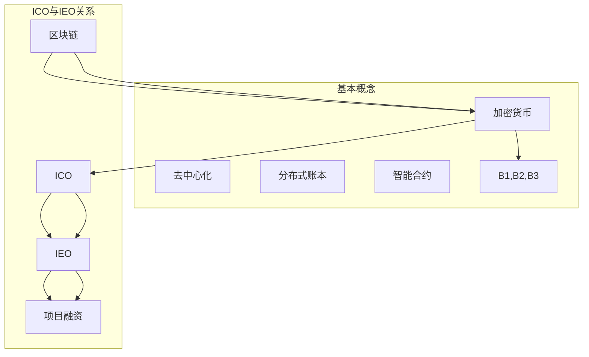

                 

关键词：ICO，IEO，区块链，加密货币，项目评估，投资策略，技术分析

> 摘要：本文将深入探讨程序员如何评估并参与ICO与IEO项目。通过对区块链技术和加密货币市场的基本了解，本文将提供一套系统的评估方法，帮助程序员在参与这类项目时做出明智的决策。

## 1. 背景介绍

随着区块链技术的兴起，加密货币市场在过去几年经历了爆炸性的增长。ICO（Initial Coin Offering）和IEO（Initial Exchange Offering）成为了初创公司筹集资金的重要方式。ICO指的是通过发行代币来募集资金，而IEO则是由加密货币交易所支持的代币发行活动。这两者在区块链项目的融资中扮演着重要角色。

程序员作为技术领域的专业人才，在评估和参与这些项目时具有独特的优势。他们不仅能够理解项目的技术实现，还能对项目的潜在风险和技术可行性进行深入分析。然而，面对繁杂的信息和市场波动，程序员也需要掌握一套系统的评估方法和策略，以确保投资的安全和回报。

本文将围绕以下几个方面展开讨论：

- **ICO与IEO的基本概念和区别**
- **程序员在评估项目时需要关注的关键因素**
- **具体的评估方法和步骤**
- **参与ICO与IEO项目的流程和策略**
- **技术分析和市场分析的应用**

通过本文的阅读，程序员可以更好地理解ICO与IEO项目，掌握有效的评估方法，从而在加密货币市场中找到合适的投资机会。

## 2. 核心概念与联系

在深入探讨ICO与IEO项目之前，我们首先需要了解一些核心概念，并展示它们之间的关系。以下是一个简化的Mermaid流程图，用于解释这些概念：



### 2.1. 加密货币

加密货币是一种数字或虚拟货币，使用密码学原理来确保交易安全，控制新币生成，并验证资金转移。比特币是第一个也是最为人熟知的加密货币，它基于区块链技术，具有去中心化的特点。加密货币市场的规模和参与度持续增长，吸引了大量投资者和开发者。

### 2.2. ICO

ICO是一种通过发行加密货币来募集资金的方式。项目发起人通常会设计一种代币，并承诺在项目成功后给予投资者相应的回报。ICO通常没有法律监管，因此存在较高的风险。然而，ICO也为初创公司提供了一种快速筹集资金的方式。

### 2.3. IEO

IEO则是由加密货币交易所支持的代币发行活动。与ICO相比，IEO通常具有更强的监管机制，因为交易所会在项目上线前进行审查。IEO项目的可信度通常更高，但也伴随着更高的费用。

### 2.4. 项目融资

ICO和IEO都是项目融资的两种形式。通过这些活动，项目发起人可以筹集到启动和扩展项目所需的资金。项目的成功与否不仅取决于资金筹集的多少，还取决于项目的实际执行和市场需求。

通过上述流程图和核心概念的介绍，我们可以更清晰地理解ICO与IEO项目的基本结构和运作机制。接下来，我们将深入探讨程序员在评估这类项目时需要关注的关键因素。

## 3. 核心算法原理 & 具体操作步骤

### 3.1. 算法原理概述

在评估ICO与IEO项目时，程序员需要掌握一些核心算法原理，这些原理有助于他们理解项目的技术实现和潜在风险。以下是几个关键算法原理：

#### 3.1.1. 哈希算法

哈希算法是一种将任意长度的数据转换成固定长度数据的算法，通常用于数据加密和身份验证。SHA-256是比特币中使用的一种哈希算法，它能够确保区块链中每个区块的唯一性和完整性。

#### 3.1.2. 零知识证明

零知识证明是一种密码学技术，允许一方（证明者）向另一方（验证者）证明某个陈述是真实的，而无需透露任何具体信息。这种技术广泛应用于区块链中的隐私保护和权限管理。

#### 3.1.3. 智能合约

智能合约是一种自动执行、控制和文档化合约的计算机协议。在区块链上，智能合约通常使用Solidity语言编写，它能够确保交易在满足特定条件时自动执行。

### 3.2. 算法步骤详解

为了更详细地说明这些算法原理，以下是每个算法的具体操作步骤：

#### 3.2.1. 哈希算法

1. **输入数据**：将任意长度的数据输入哈希算法。
2. **数据处理**：算法对输入数据进行一系列复杂的数学运算。
3. **输出哈希值**：算法输出一个固定长度的哈希值，通常为256位。

#### 3.2.2. 零知识证明

1. **证明构建**：证明者构建一个数学证明，证明某个陈述是真实的。
2. **证明验证**：验证者使用证明者提供的证明，验证陈述的真实性。
3. **隐私保护**：证明过程不透露任何具体信息，确保隐私。

#### 3.2.3. 智能合约

1. **编写合约**：程序员使用Solidity等语言编写智能合约代码。
2. **编译合约**：将智能合约代码编译成以太坊虚拟机（EVM）可执行的字节码。
3. **部署合约**：将编译后的智能合约部署到区块链上。
4. **执行合约**：交易触发智能合约的执行，合约按照预定的逻辑自动执行。

### 3.3. 算法优缺点

#### 3.3.1. 哈希算法

**优点**：
- 保证数据唯一性和完整性。
- 加密数据，防止篡改。

**缺点**：
- 加密过程可能较为复杂，计算成本高。

#### 3.3.2. 零知识证明

**优点**：
- 保护隐私，无需透露具体信息。
- 简化身份验证，提高效率。

**缺点**：
- 证明构建和验证过程复杂。

#### 3.3.3. 智能合约

**优点**：
- 自动执行，降低人为干预。
- 防篡改，保证合约执行结果。

**缺点**：
- 编写和调试困难。
- 可能存在漏洞，导致资金损失。

### 3.4. 算法应用领域

#### 3.4.1. 哈希算法

- 数据加密。
- 数字签名。
- 区块链交易验证。

#### 3.4.2. 零知识证明

- 隐私保护。
- 身份验证。
- 数字货币交易。

#### 3.4.3. 智能合约

- 资金托管。
- 自动化交易。
- 合规管理。

通过掌握这些核心算法原理和具体操作步骤，程序员可以更好地理解ICO与IEO项目的技术实现，从而在评估项目时具备更强的分析能力。接下来，我们将讨论如何将数学模型和公式应用于ICO与IEO项目评估。

## 4. 数学模型和公式 & 详细讲解 & 举例说明

在评估ICO与IEO项目时，数学模型和公式是非常有用的工具。这些模型和公式可以帮助程序员量化项目的技术可行性、市场潜力和投资回报。以下我们将介绍几个关键的数学模型和公式，并详细讲解其推导过程和应用实例。

### 4.1. 数学模型构建

#### 4.1.1. 投资回报率（ROI）

投资回报率是一个用于衡量投资项目收益与成本之间关系的指标。其数学模型如下：

$$
ROI = \frac{（投资收益 - 投资成本）}{投资成本} \times 100\%
$$

其中，投资收益包括项目成功后的代币增值和分红收益，投资成本则是参与ICO或IEO项目时投入的资金。

#### 4.1.2. 贝塔系数（Beta）

贝塔系数用于衡量一个项目相对于市场的波动性。其数学模型如下：

$$
Beta = \frac{（项目收益率 - 市场平均收益率）}{市场收益率方差}
$$

贝塔系数越高，项目的市场风险越大。通过计算贝塔系数，程序员可以评估项目的风险水平。

### 4.2. 公式推导过程

#### 4.2.1. 投资回报率（ROI）

投资回报率可以通过以下步骤推导：

1. **计算投资收益**：投资收益等于代币增值和分红收益的总和。假设项目成功后，代币增值为$V$，分红收益为$D$，则投资收益$R$为：
   $$
   R = V + D
   $$

2. **计算投资成本**：投资成本是参与ICO或IEO项目时投入的资金$C$。

3. **计算ROI**：根据ROI的数学模型，投资回报率为：
   $$
   ROI = \frac{（V + D - C）}{C} \times 100\%
   $$

#### 4.2.2. 贝塔系数（Beta）

贝塔系数的推导过程如下：

1. **计算项目收益率**：项目收益率是项目收益与投资成本的比值，即：
   $$
   Y = \frac{R}{C}
   $$

2. **计算市场平均收益率**：市场平均收益率是市场上所有项目的平均收益率。

3. **计算市场收益率方差**：市场收益率方差用于衡量市场收益率的波动性。

4. **计算Beta**：根据贝塔系数的数学模型，贝塔系数为：
   $$
   Beta = \frac{（Y - 平均收益率）}{市场收益率方差}
   $$

### 4.3. 案例分析与讲解

以下是一个具体的案例分析，用于说明如何使用这些数学模型和公式评估ICO与IEO项目。

#### 案例一：投资回报率（ROI）

假设程序员参与了某个ICO项目，投资成本为$10000美元。项目成功后，代币增值为$15000美元，分红收益为$2000美元。根据ROI的公式，投资回报率为：

$$
ROI = \frac{（15000 + 2000 - 10000）}{10000} \times 100\% = 50\%
$$

这个结果表明，该项目的投资回报率为50%，相对较高。

#### 案例二：贝塔系数（Beta）

假设市场上其他ICO项目的平均收益率为10%，市场收益率方差为0.05。该项目的收益率为15%，根据贝塔系数的公式，贝塔系数为：

$$
Beta = \frac{（15\% - 10\%）}{0.05} = 0.2
$$

这个结果表明，该项目的贝塔系数为0.2，相对较低，说明项目的市场风险相对较小。

通过这些数学模型和公式的应用，程序员可以更科学、客观地评估ICO与IEO项目的投资价值，从而做出更明智的决策。

## 5. 项目实践：代码实例和详细解释说明

### 5.1. 开发环境搭建

为了实践ICO与IEO项目评估，我们需要搭建一个合适的开发环境。以下是推荐的步骤：

1. **安装Node.js**：Node.js是一个用于执行JavaScript代码的运行时环境，许多ICO与IEO项目的评估工具都依赖于Node.js。可以从Node.js的官方网站（https://nodejs.org/）下载并安装。

2. **安装Truffle**：Truffle是一个用于智能合约开发、测试和部署的框架，支持以太坊和其他区块链平台。安装Truffle可以通过npm（Node Package Manager）进行，命令如下：
   $$
   npm install -g truffle
   $$

3. **安装Ganache**：Ganache是一个本地以太坊节点和测试区块链的搭建工具，用于智能合约的开发和测试。安装Ganache可以通过npm进行，命令如下：
   $$
   npm install -g ganache-cli
   $$

4. **创建项目目录**：在本地计算机上创建一个项目目录，用于存放所有相关代码和文件。

### 5.2. 源代码详细实现

以下是一个简单的智能合约代码实例，用于展示如何使用Truffle框架编写、测试和部署智能合约。智能合约代码通常使用Solidity编写，以下是示例代码：

```solidity
// SPDX-License-Identifier: MIT
pragma solidity ^0.8.0;

contract ICOProject {
    mapping(address => uint256) public balanceOf;
    uint256 public totalSupply;
    bool public isFundingOpen;

    event FundingStart();
    event FundingEnd();
    event Purchase(address buyer, uint256 amount);

    constructor() {
        totalSupply = 1000000;
        balanceOf[msg.sender] = totalSupply;
        isFundingOpen = false;
    }

    function startFunding() external {
        require(!isFundingOpen, "Funding is already open");
        isFundingOpen = true;
        emit FundingStart();
    }

    function endFunding() external {
        require(isFundingOpen, "Funding is not open");
        isFundingOpen = false;
        emit FundingEnd();
    }

    function purchaseTokens() external payable {
        require(isFundingOpen, "Funding is not open");
        uint256 amount = msg.value;
        balanceOf[msg.sender] += amount;
        totalSupply -= amount;
        emit Purchase(msg.sender, amount);
    }

    function withdrawFunds() external {
        require(!isFundingOpen, "Funding is still open");
        payable(msg.sender).transfer(address(this).balance);
    }
}
```

这段代码实现了一个简单的ICO项目，包括代币购买、余额查询、资金提取等功能。以下是对每个函数的简要说明：

- `constructor()`：合约构造函数，初始化总代币供应量、代币余额和ICO状态。
- `startFunding()`：启动ICO资金筹集，只有当ICO未开始时才能调用。
- `endFunding()`：结束ICO资金筹集，只有当ICO已经开始时才能调用。
- `purchaseTokens()`：购买代币，接收以太币并增加购买者余额，减少总代币供应量。
- `withdrawFunds()`：提取ICO筹集到的资金，只有当ICO已经结束时才能调用。

### 5.3. 代码解读与分析

这段代码的解读如下：

1. **代币余额和总供应量**：使用`mapping`数据结构来存储每个参与者的代币余额，使用`uint256`数据类型来存储总供应量和余额。
2. **ICO状态**：使用`bool`数据类型来表示ICO的状态（开启或关闭）。
3. **事件**：使用`event`来记录ICO的重要事件，如开始、结束和购买。
4. **函数访问权限**：使用`require`语句来确保函数只能在满足特定条件时调用，如ICO是否已经开始或结束。

### 5.4. 运行结果展示

为了测试和部署这段智能合约代码，我们使用Truffle和Ganache进行以下步骤：

1. **启动本地以太坊节点**：
   $$
   ganache-cli --port 7545
   $$

2. **配置Truffle项目**：
   在项目目录中创建`truffle-config.js`文件，配置Ganache节点的详细信息。

3. **编译智能合约**：
   $$
   truffle compile
   $$

4. **部署智能合约**：
   $$
   truffle migrate --reset
   $$

5. **运行合约交互脚本**：
   创建一个交互脚本，用于演示如何与智能合约进行交互。

```javascript
const ICOProject = artifacts.require("ICOProject");

async function main() {
    const instance = await ICOProject.deployed();
    console.log("ICO Project Address:", instance.address);

    // 启动ICO资金筹集
    await instance.startFunding();
    console.log("ICO Funding Started");

    // 购买代币
    const purchaseAmount = web3.utils.toWei("1", "ether");
    await instance.purchaseTokens({ value: purchaseAmount });
    console.log("Tokens Purchased");

    // 查询余额
    const myBalance = await instance.balanceOf.call(msg.sender);
    console.log("My Balance:", myBalance.toString());

    // 提取ICO筹集到的资金
    await instance.withdrawFunds();
    console.log("Funds Withdrawn");
}

main();
```

通过以上步骤，我们可以成功启动ICO资金筹集、购买代币、查询余额和提取资金，从而验证智能合约的功能和运行结果。

## 6. 实际应用场景

ICO与IEO项目在区块链领域具有广泛的应用场景，以下是一些典型的实际应用案例：

### 6.1. 去中心化金融（DeFi）

DeFi是区块链技术的一个重要应用领域，通过去中心化平台提供金融服务，如借贷、交易、支付等。许多ICO与IEO项目致力于构建DeFi平台，通过发行代币来激励用户参与网络并促进流动性。

**案例**：Aave是一个去中心化借贷平台，用户可以在这里提供资金并获得APR（年化收益率）作为回报。Aave在IEO平台上成功发行了Aave代币，募集资金用于平台的发展和技术创新。

### 6.2. 非同质化代币（NFT）

NFT是一种独特的数字资产，代表对特定物品的所有权或使用权。ICO与IEO项目常常发行NFT代币，用于艺术作品、游戏物品、虚拟房地产等的交易和所有权认证。

**案例**：OpenSea是一个NFT市场，用户可以在这里买卖、展示和交换NFT代币。OpenSea通过ICO筹集资金，用于平台的技术开发和用户体验优化。

### 6.3. 物联网（IoT）

区块链技术在物联网领域有着广泛的应用，通过区块链可以确保设备之间的通信和数据交换的安全性。ICO与IEO项目可以为物联网设备提供专属代币，促进设备和用户之间的互动。

**案例**：IoT Chain是一个基于区块链的物联网平台，旨在通过代币化方式连接设备和用户。IoT Chain通过ICO筹集资金，用于平台的开发和技术完善。

### 6.4. 未来应用展望

随着区块链技术的不断成熟，ICO与IEO项目的应用领域将继续扩展。以下是一些未来可能的应用趋势：

- **供应链管理**：利用区块链技术实现供应链的可追溯性和透明性，提高物流和供应链的效率。
- **数字身份认证**：通过区块链实现安全、去中心化的数字身份认证，减少欺诈和身份盗窃。
- **医疗健康**：利用区块链技术保护医疗数据的安全性和隐私，提高医疗服务的效率和质量。

总之，ICO与IEO项目在区块链领域的实际应用场景丰富多样，未来还有巨大的发展空间。程序员可以通过参与这些项目，不仅能够获得投资收益，还能为区块链技术的创新和应用贡献力量。

## 7. 工具和资源推荐

在评估ICO与IEO项目时，程序员需要使用一系列工具和资源来辅助分析。以下是一些推荐的工具和资源，涵盖了从技术文档到开发环境搭建的各个方面。

### 7.1. 学习资源推荐

1. **《精通区块链》**：作者Daniel Drescher，这本书详细介绍了区块链技术的基础知识和实际应用，非常适合初学者和进阶者。
2. **《智能合约开发指南》**：作者Andrei Belaruscu，这本书提供了深入讲解Solidity语言和智能合约开发的实用指南。
3. **《区块链应用开发实践》**：作者李树强，这本书涵盖区块链在不同领域的应用案例，对程序员具有很高的参考价值。

### 7.2. 开发工具推荐

1. **Truffle**：一个用于智能合约开发、测试和部署的框架，支持以太坊和其他区块链平台。
2. **Ganache**：一个本地以太坊节点和测试区块链的搭建工具，用于智能合约的开发和测试。
3. **Web3.js**：一个用于与以太坊区块链交互的JavaScript库，可用于编写前端代码和与智能合约进行交互。

### 7.3. 相关论文推荐

1. **"Bitcoin: A Peer-to-Peer Electronic Cash System"**：中本聪（Satoshi Nakamoto）的创世论文，详细介绍了比特币系统的设计原理。
2. **"The Design of the Bitcoin Transaction Protocol"**：Kraft，Laribal，Schmidt和Shamir的论文，对比特币协议进行了深入分析。
3. **"DeFi, Money, and Blockchains"**：作者David Schipper，该论文探讨了去中心化金融（DeFi）的基础概念和应用场景。

通过这些工具和资源，程序员可以更好地理解和评估ICO与IEO项目，提高其在区块链领域的专业能力和投资决策的科学性。

## 8. 总结：未来发展趋势与挑战

随着区块链技术的不断成熟和加密货币市场的持续繁荣，ICO与IEO项目在未来具有广阔的发展前景。以下是未来发展趋势与面临的挑战：

### 8.1. 研究成果总结

- **技术进步**：区块链技术的不断创新，如Sharding、闪电网络和Plasma等，将进一步提高区块链的性能和可扩展性，为ICO与IEO项目提供更高效的基础设施。
- **市场成熟**：随着更多机构投资者和传统金融公司的进入，ICO与IEO市场将更加规范，投资风险和不确定性有望降低。
- **多样化应用**：区块链技术将在更多领域得到应用，如供应链管理、数字身份认证和智能合约等领域，为ICO与IEO项目带来新的增长点。

### 8.2. 未来发展趋势

1. **去中心化金融（DeFi）的扩展**：DeFi将在金融领域发挥更大作用，为用户带来更多创新金融服务，如借贷、交易、保险等。
2. **区块链与实体经济的融合**：区块链技术将与传统实体经济更深入地结合，推动产业数字化和升级，为ICO与IEO项目提供更多应用场景。
3. **监管政策的逐步完善**：随着市场的成熟，各国政府和监管机构将逐步出台更为清晰的监管政策，规范ICO与IEO市场的运行，提高投资者信心。

### 8.3. 面临的挑战

1. **技术瓶颈**：区块链技术的性能和可扩展性问题仍需解决，尤其是在处理大规模交易时，区块链的吞吐量和延迟仍需提升。
2. **市场波动**：加密货币市场的高波动性仍然是ICO与IEO项目面临的主要风险，投资者需要具备一定的风险承受能力。
3. **法律和监管风险**：尽管监管政策逐步完善，但ICO与IEO项目仍面临法律和监管风险，特别是在不同国家和地区之间的法律差异和监管冲突。

### 8.4. 研究展望

未来，程序员在评估ICO与IEO项目时，需要更加关注以下几个方面：

- **技术创新**：紧跟区块链技术的最新进展，了解新兴技术和应用场景，以便做出更准确的评估。
- **市场分析**：深入研究加密货币市场动态，掌握市场趋势和风险因素，提高投资决策的科学性。
- **风险管理**：建立健全的风险管理机制，通过多样化投资和风险分散策略降低投资风险。

总之，ICO与IEO项目在未来具有巨大的发展潜力，但同时也面临诸多挑战。程序员需要不断学习和提升自身能力，以应对这些挑战，抓住机遇，实现投资价值。

## 9. 附录：常见问题与解答

### 9.1. 什么是ICO？

ICO（Initial Coin Offering）是一种通过发行代币来筹集资金的方式。项目发起人通常会设计一种代币，承诺在项目成功后给予投资者相应的回报。ICO通常没有法律监管，因此存在较高的风险。

### 9.2. 什么是IEO？

IEO（Initial Exchange Offering）是由加密货币交易所支持的代币发行活动。与ICO相比，IEO通常具有更强的监管机制，因为交易所会在项目上线前进行审查。IEO项目的可信度通常更高。

### 9.3. 程序员如何评估ICO与IEO项目？

程序员可以通过以下步骤评估ICO与IEO项目：

1. **了解项目背景**：研究项目的白皮书、团队背景、技术实现等。
2. **分析技术实现**：审查项目的智能合约代码，确保其安全和可靠性。
3. **评估市场潜力**：分析项目所在行业的发展趋势和市场需求。
4. **关注团队实力**：研究项目团队的组成、经验和专业背景。
5. **了解项目进展**：跟踪项目的开发和运营进度，评估其实现情况。

### 9.4. ICO与IEO项目的风险有哪些？

ICO与IEO项目的风险包括：

1. **市场波动风险**：加密货币市场波动性高，投资回报不确定。
2. **技术风险**：智能合约可能存在漏洞，导致资金损失。
3. **法律风险**：ICO与IEO项目在不同国家和地区可能面临不同的法律和监管挑战。
4. **项目失败风险**：项目可能因管理不善、技术问题或市场需求不足而失败。

### 9.5. 如何降低ICO与IEO项目的风险？

1. **多元化投资**：分散投资，降低单一项目的风险。
2. **深入研究**：仔细研究项目的各个方面，包括技术、市场和团队。
3. **风险管理**：建立风险控制机制，设置投资比例和止损点。
4. **关注监管动态**：了解不同国家和地区的监管政策，遵循法律法规。

通过上述常见问题与解答，程序员可以更好地理解ICO与IEO项目，提高评估和参与这些项目的有效性。

