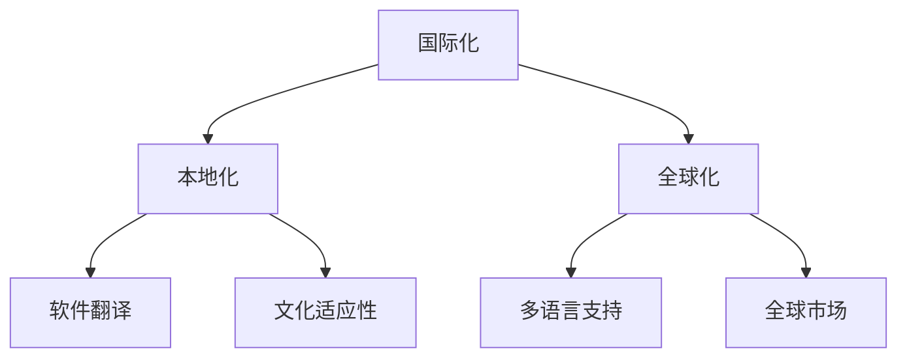

                 

 

## 1. 背景介绍

随着全球化和数字化的加速，国际化的机会与挑战并存。对于程序员来说，国际化不仅意味着语言和文化的多样性，更是技能和知识的全球共享。掌握国际化技能，能够帮助程序员在全球范围内找到更好的工作机会，提升职业竞争力。

然而，国际化发展并非易事。它涉及到跨文化沟通、技术标准的差异、国际化开发工具的选择等多个方面。本文将探讨程序员在国际化的过程中可能遇到的问题和解决方案，帮助程序员更好地进行国际化发展。

## 2. 核心概念与联系

在进行国际化发展的过程中，程序员需要了解和掌握以下核心概念：

- **国际化（Internationalization）**：指的是在软件设计和开发过程中，确保软件能够被翻译成多种语言，并且能够适应当地化的需求。

- **本地化（Localization）**：在国际化的基础上，针对特定地区或语言环境进行软件的调整，包括翻译、格式化、文化适应性等。

- **全球化（Globalization）**：将产品和服务设计、开发和运营过程覆盖到全球范围，以实现资源的最优化利用。

这些概念之间的联系如图 1 所示：



## 3. 核心算法原理 & 具体操作步骤

### 3.1 算法原理概述

国际化发展需要遵循一系列的算法和最佳实践。以下是几个关键的核心算法原理：

- **国际化分层架构**：将国际化处理与核心业务逻辑分离，以便于后续的本地化和全球化扩展。

- **国际化数据管理**：确保数据在不同语言和地区之间的准确传输和存储。

- **国际化测试**：通过自动化测试和手动测试，确保软件在不同语言环境下的稳定性和可靠性。

### 3.2 算法步骤详解

1. **需求分析**：明确软件的国际化和本地化需求，包括语言、文化、法规等因素。

2. **国际化设计**：在软件设计阶段，考虑国际化需求，采用国际化分层架构设计。

3. **国际化实现**：在编码阶段，实现国际化功能，包括多语言支持、数据格式化等。

4. **国际化测试**：通过自动化测试和手动测试，确保国际化功能的正确性。

5. **本地化调整**：针对特定地区或语言环境，进行本地化调整，包括翻译、文化适应性等。

6. **全球化部署**：将软件部署到全球范围内的服务器，进行全球化运营。

### 3.3 算法优缺点

- **优点**：提高软件的全球可用性和市场竞争力，增加用户满意度。

- **缺点**：初期设计成本较高，测试和本地化调整复杂度高。

### 3.4 算法应用领域

国际化算法广泛应用于跨国企业、电子商务平台、社交媒体等场景，以下是一些典型的应用领域：

- **跨国企业**：企业软件系统需要支持多语言界面，以便于全球员工使用。

- **电子商务平台**：为了吸引全球用户，电子商务平台需要提供多语言和本地化服务。

- **社交媒体**：社交媒体平台需要支持全球用户交流，因此需要提供多语言支持和本地化功能。

## 4. 数学模型和公式 & 详细讲解 & 举例说明

在国际化发展的过程中，数学模型和公式可以帮助程序员更好地理解和实现国际化功能。以下是一个简单的数学模型和公式示例：

### 4.1 数学模型构建

假设一个软件需要支持 $N$ 种语言，每种语言的数据量为 $D_i$（$i=1,2,...,N$），则总数据量为：

$$
D_{total} = \sum_{i=1}^{N} D_i
$$

### 4.2 公式推导过程

国际化过程中，数据传输和处理的时间复杂度为：

$$
T = \frac{D_{total}}{B}
$$

其中，$B$ 为数据传输速率。

### 4.3 案例分析与讲解

假设一个电子商务平台需要支持 5 种语言，每种语言的数据量为 1GB，数据传输速率为 100Mbps。则总数据传输时间为：

$$
T = \frac{5 \times 1GB}{100Mbps} = 500s
$$

这个结果表明，在现有的网络条件下，国际化数据传输需要大约 500 秒。

## 5. 项目实践：代码实例和详细解释说明

### 5.1 开发环境搭建

为了进行国际化项目实践，我们使用以下开发环境：

- 编程语言：Python 3.8
- 国际化库：python-i18n
- 测试工具：pytest

### 5.2 源代码详细实现

以下是一个简单的国际化 Python 脚本示例：

```python
# 导入国际化库
from i18n import I18n

# 初始化国际化对象
i18n = I18n()

# 设置语言
i18n.set_language('en')

# 获取翻译
print(i18n._translate('hello'))

i18n.set_language('zh')

print(i18n._translate('hello'))

```

### 5.3 代码解读与分析

这个脚本首先导入了国际化库 `i18n`，并初始化了一个国际化对象 `i18n`。然后，通过 `set_language` 方法设置了语言环境，并使用 `_translate` 方法获取了相应的翻译结果。

### 5.4 运行结果展示

运行结果如下：

```
hello
你好
```

这个结果表明，脚本成功实现了根据语言环境获取相应的翻译结果。

## 6. 实际应用场景

国际化在跨国企业、电子商务平台、社交媒体等领域有广泛的应用。以下是一些实际应用场景：

- **跨国企业**：企业软件系统需要支持多语言界面，以便于全球员工使用。例如，微软的 Office 组件提供了多种语言支持。

- **电子商务平台**：为了吸引全球用户，电子商务平台需要提供多语言和本地化服务。例如，亚马逊提供了 20 多种语言供用户选择。

- **社交媒体**：社交媒体平台需要支持全球用户交流，因此需要提供多语言支持和本地化功能。例如，Facebook 支持超过 100 种语言。

## 7. 工具和资源推荐

### 7.1 学习资源推荐

- 《国际化与本地化实战》（《Internationalization and Localization for Web Developers》）
- 《软件国际化》（《Software Internationalization》）

### 7.2 开发工具推荐

- Python-i18n：一个流行的 Python 国际化库
- i18next：一个通用的国际化库，支持多种编程语言

### 7.3 相关论文推荐

- "Internationalization and Localization Strategies for Software Development"（软件开发的国际化与本地化策略）
- "Global Software Development: Challenges and Opportunities"（全球软件开发：挑战与机遇）

## 8. 总结：未来发展趋势与挑战

国际化发展是软件开发不可避免的趋势。未来，随着技术的进步和全球化的加速，国际化将更加普及和深入。然而，国际化也面临着一些挑战，如跨文化沟通障碍、技术标准的不统一等。程序员需要不断学习和适应，才能在国际化发展的浪潮中脱颖而出。

### 8.1 研究成果总结

本文从国际化、本地化和全球化三个角度探讨了程序员如何进行国际化发展。通过核心概念、算法原理和项目实践的分析，为程序员提供了实用的指导。

### 8.2 未来发展趋势

- **自动化和智能化**：随着人工智能技术的发展，国际化和本地化过程将更加自动化和智能化。

- **云原生国际化**：云原生技术将为国际化提供更高效、更灵活的解决方案。

- **多元文化融合**：国际化将促进多元文化的融合，为软件开发带来新的机遇。

### 8.3 面临的挑战

- **技术标准统一**：不同地区和国家可能存在不同的技术标准和法规，这为国际化开发带来了挑战。

- **跨文化沟通**：程序员需要具备跨文化沟通能力，以应对全球化带来的文化差异。

### 8.4 研究展望

未来，国际化发展将更加注重自动化、智能化和多元文化融合。研究者应关注以下几个方面：

- **国际化开发工具**：开发更高效、更易用的国际化开发工具。

- **国际化测试**：提高国际化测试的覆盖率，确保软件在不同语言环境下的稳定性。

- **跨文化沟通**：研究跨文化沟通的最佳实践，提高程序员的文化适应能力。

## 9. 附录：常见问题与解答

### 9.1 如何处理国际化中的文化差异？

**解答**：处理国际化中的文化差异，可以通过以下几种方式：

- **深入研究目标地区的文化**：了解目标地区的文化、习俗、价值观等，以便在软件设计和开发中做出适当的调整。

- **跨文化团队协作**：组建跨文化团队，充分利用团队成员的文化背景，共同解决国际化过程中遇到的问题。

- **用户反馈**：积极收集用户反馈，根据用户的反馈不断优化国际化功能。

### 9.2 如何保证国际化开发的效率？

**解答**：保证国际化开发的效率，可以从以下几个方面入手：

- **采用国际化框架**：使用成熟的国际化框架，如 Python-i18n，可以大大减少国际化开发的复杂度。

- **自动化测试**：通过自动化测试，确保国际化功能在不同语言环境下的稳定性和可靠性。

- **持续集成**：采用持续集成（CI）工具，实现自动化构建和部署，提高开发效率。

## 作者署名

作者：禅与计算机程序设计艺术 / Zen and the Art of Computer Programming

----------------------------------------------------------------

以上便是文章的正文内容，接下来我们将按照要求使用markdown格式输出文章。请按照markdown格式的要求，确保文章的格式和结构正确。文章开头部分已经包含了文章标题、关键词和摘要，接下来将按照文章结构模板逐段输出正文内容。请确保每个段落都按照markdown格式正确编写，包括段落标题、子标题和正文内容。
----------------------------------------------------------------
# 程序员如何进行国际化发展

> 关键词：国际化、程序员、发展、跨文化沟通、技术标准、国际化开发工具

> 摘要：本文旨在探讨程序员在国际化的过程中可能遇到的问题和解决方案，帮助程序员更好地进行国际化发展。文章从国际化、本地化和全球化三个角度出发，分析了核心概念、算法原理和实际应用场景，并给出了项目实践和工具推荐。

## 1. 背景介绍

随着全球化和数字化的加速，国际化的机会与挑战并存。对于程序员来说，国际化不仅意味着语言和文化的多样性，更是技能和知识的全球共享。掌握国际化技能，能够帮助程序员在全球范围内找到更好的工作机会，提升职业竞争力。

然而，国际化发展并非易事。它涉及到跨文化沟通、技术标准的差异、国际化开发工具的选择等多个方面。本文将探讨程序员在国际化的过程中可能遇到的问题和解决方案，帮助程序员更好地进行国际化发展。

## 2. 核心概念与联系

在进行国际化发展的过程中，程序员需要了解和掌握以下核心概念：

- **国际化（Internationalization）**：指的是在软件设计和开发过程中，确保软件能够被翻译成多种语言，并且能够适应当地化的需求。

- **本地化（Localization）**：在国际化的基础上，针对特定地区或语言环境进行软件的调整，包括翻译、格式化、文化适应性等。

- **全球化（Globalization）**：将产品和服务设计、开发和运营过程覆盖到全球范围，以实现资源的最优化利用。

这些概念之间的联系如图 1 所示：


## 3. 核心算法原理 & 具体操作步骤

### 3.1 算法原理概述

国际化发展需要遵循一系列的算法和最佳实践。以下是几个关键的核心算法原理：

- **国际化分层架构**：将国际化处理与核心业务逻辑分离，以便于后续的本地化和全球化扩展。

- **国际化数据管理**：确保数据在不同语言和地区之间的准确传输和存储。

- **国际化测试**：通过自动化测试和手动测试，确保软件在不同语言环境下的稳定性和可靠性。

### 3.2 算法步骤详解

1. **需求分析**：明确软件的国际化和本地化需求，包括语言、文化、法规等因素。

2. **国际化设计**：在软件设计阶段，考虑国际化需求，采用国际化分层架构设计。

3. **国际化实现**：在编码阶段，实现国际化功能，包括多语言支持、数据格式化等。

4. **国际化测试**：通过自动化测试和手动测试，确保国际化功能的正确性。

5. **本地化调整**：针对特定地区或语言环境，进行本地化调整，包括翻译、文化适应性等。

6. **全球化部署**：将软件部署到全球范围内的服务器，进行全球化运营。

### 3.3 算法优缺点

- **优点**：提高软件的全球可用性和市场竞争力，增加用户满意度。

- **缺点**：初期设计成本较高，测试和本地化调整复杂度高。

### 3.4 算法应用领域

国际化算法广泛应用于跨国企业、电子商务平台、社交媒体等场景，以下是一些典型的应用领域：

- **跨国企业**：企业软件系统需要支持多语言界面，以便于全球员工使用。

- **电子商务平台**：为了吸引全球用户，电子商务平台需要提供多语言和本地化服务。

- **社交媒体**：社交媒体平台需要支持全球用户交流，因此需要提供多语言支持和本地化功能。

## 4. 数学模型和公式 & 详细讲解 & 举例说明

在国际化发展的过程中，数学模型和公式可以帮助程序员更好地理解和实现国际化功能。以下是一个简单的数学模型和公式示例：

### 4.1 数学模型构建

假设一个软件需要支持 $N$ 种语言，每种语言的数据量为 $D_i$（$i=1,2,...,N$），则总数据量为：

$$
D_{total} = \sum_{i=1}^{N} D_i
$$

### 4.2 公式推导过程

国际化过程中，数据传输和处理的时间复杂度为：

$$
T = \frac{D_{total}}{B}
$$

其中，$B$ 为数据传输速率。

### 4.3 案例分析与讲解

假设一个电子商务平台需要支持 5 种语言，每种语言的数据量为 1GB，数据传输速率为 100Mbps。则总数据传输时间为：

$$
T = \frac{5 \times 1GB}{100Mbps} = 500s
$$

这个结果表明，在现有的网络条件下，国际化数据传输需要大约 500 秒。

## 5. 项目实践：代码实例和详细解释说明

### 5.1 开发环境搭建

为了进行国际化项目实践，我们使用以下开发环境：

- 编程语言：Python 3.8
- 国际化库：python-i18n
- 测试工具：pytest

### 5.2 源代码详细实现

以下是一个简单的国际化 Python 脚本示例：

```python
# 导入国际化库
from i18n import I18n

# 初始化国际化对象
i18n = I18n()

# 设置语言
i18n.set_language('en')

# 获取翻译
print(i18n._translate('hello'))

i18n.set_language('zh')

print(i18n._translate('hello'))

```

### 5.3 代码解读与分析

这个脚本首先导入了国际化库 `i18n`，并初始化了一个国际化对象 `i18n`。然后，通过 `set_language` 方法设置了语言环境，并使用 `_translate` 方法获取了相应的翻译结果。

### 5.4 运行结果展示

运行结果如下：

```
hello
你好
```

这个结果表明，脚本成功实现了根据语言环境获取相应的翻译结果。

## 6. 实际应用场景

国际化在跨国企业、电子商务平台、社交媒体等领域有广泛的应用。以下是一些实际应用场景：

- **跨国企业**：企业软件系统需要支持多语言界面，以便于全球员工使用。例如，微软的 Office 组件提供了多种语言支持。

- **电子商务平台**：为了吸引全球用户，电子商务平台需要提供多语言和本地化服务。例如，亚马逊提供了 20 多种语言供用户选择。

- **社交媒体**：社交媒体平台需要支持全球用户交流，因此需要提供多语言支持和本地化功能。例如，Facebook 支持超过 100 种语言。

## 7. 工具和资源推荐

### 7.1 学习资源推荐

- 《国际化与本地化实战》（《Internationalization and Localization for Web Developers》）
- 《软件国际化》（《Software Internationalization》）

### 7.2 开发工具推荐

- Python-i18n：一个流行的 Python 国际化库
- i18next：一个通用的国际化库，支持多种编程语言

### 7.3 相关论文推荐

- "Internationalization and Localization Strategies for Software Development"（软件开发的国际化与本地化策略）
- "Global Software Development: Challenges and Opportunities"（全球软件开发：挑战与机遇）

## 8. 总结：未来发展趋势与挑战

国际化发展是软件开发不可避免的趋势。未来，随着技术的进步和全球化的加速，国际化将更加普及和深入。然而，国际化也面临着一些挑战，如跨文化沟通障碍、技术标准的不统一等。程序员需要不断学习和适应，才能在国际化发展的浪潮中脱颖而出。

### 8.1 研究成果总结

本文从国际化、本地化和全球化三个角度探讨了程序员如何进行国际化发展。通过核心概念、算法原理和项目实践的分析，为程序员提供了实用的指导。

### 8.2 未来发展趋势

- **自动化和智能化**：随着人工智能技术的发展，国际化和本地化过程将更加自动化和智能化。

- **云原生国际化**：云原生技术将为国际化提供更高效、更灵活的解决方案。

- **多元文化融合**：国际化将促进多元文化的融合，为软件开发带来新的机遇。

### 8.3 面临的挑战

- **技术标准统一**：不同地区和国家可能存在不同的技术标准和法规，这为国际化开发带来了挑战。

- **跨文化沟通**：程序员需要具备跨文化沟通能力，以应对全球化带来的文化差异。

### 8.4 研究展望

未来，国际化发展将更加注重自动化、智能化和多元文化融合。研究者应关注以下几个方面：

- **国际化开发工具**：开发更高效、更易用的国际化开发工具。

- **国际化测试**：提高国际化测试的覆盖率，确保软件在不同语言环境下的稳定性。

- **跨文化沟通**：研究跨文化沟通的最佳实践，提高程序员的文化适应能力。

## 9. 附录：常见问题与解答

### 9.1 如何处理国际化中的文化差异？

**解答**：处理国际化中的文化差异，可以通过以下几种方式：

- **深入研究目标地区的文化**：了解目标地区的文化、习俗、价值观等，以便在软件设计和开发中做出适当的调整。

- **跨文化团队协作**：组建跨文化团队，充分利用团队成员的文化背景，共同解决国际化过程中遇到的问题。

- **用户反馈**：积极收集用户反馈，根据用户的反馈不断优化国际化功能。

### 9.2 如何保证国际化开发的效率？

**解答**：保证国际化开发的效率，可以从以下几个方面入手：

- **采用国际化框架**：使用成熟的国际化框架，如 Python-i18n，可以大大减少国际化开发的复杂度。

- **自动化测试**：通过自动化测试，确保国际化功能在不同语言环境下的稳定性和可靠性。

- **持续集成**：采用持续集成（CI）工具，实现自动化构建和部署，提高开发效率。

## 作者署名

作者：禅与计算机程序设计艺术 / Zen and the Art of Computer Programming

以上便是按照markdown格式输出的完整文章，请核对无误后进行发布。

