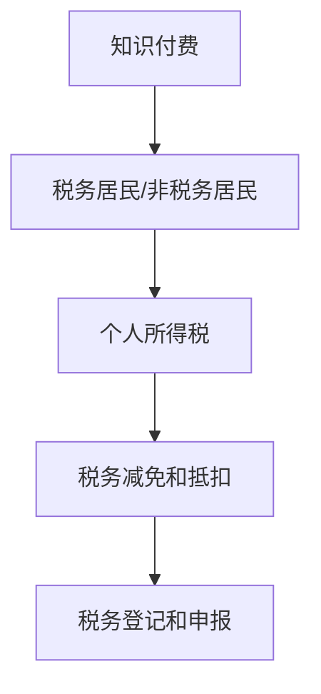

                 

## 1. 背景介绍

在信息技术飞速发展的时代，程序员作为数字时代的劳动者，扮演着至关重要的角色。随着知识付费平台的兴起，越来越多的程序员通过平台分享自己的技能、经验和知识，获得额外的收入。然而，随着收入来源的多样化，税务问题逐渐成为程序员不得不面对的重要课题。

税务规划不仅仅是为了合理合法地减少税负，更是为了确保个人财务的健康和稳定。对于程序员来说，了解并正确进行税务规划，可以有效地降低税务风险，确保财务安全，同时也有助于优化个人收入结构，提高财务规划的科学性和有效性。

本文旨在探讨程序员在知识付费过程中如何进行税务规划，帮助程序员掌握必要的税务知识，合理合法地规划自己的收入。文章将涵盖税务规划的基本原则、关键步骤、常见问题和解决方案，以及未来税务规划的趋势和发展。

## 2. 核心概念与联系

在进行税务规划之前，我们需要了解几个核心概念，它们是税务规划的基础。

### 2.1 知识付费

知识付费是指通过付费方式获取知识、技能或经验的行为。对于程序员而言，知识付费可能包括在知识付费平台上开设课程、撰写技术博客、提供咨询服务等。

### 2.2 税务居民与非税务居民

税务居民是指在一个国家内具有税务义务的人，而非税务居民则不具有这种义务。对于程序员来说，了解自己是税务居民还是非税务居民，将直接影响到税务规划的方式。

### 2.3 个人所得税

个人所得税是对个人所得的一种税收。在知识付费过程中，程序员需要了解个人所得税的计算方法、税率以及免税额等基本概念。

### 2.4 税务减免和抵扣

税务减免和抵扣是税务规划的重要手段。通过合理运用税务减免政策和抵扣政策，程序员可以降低自己的税负。

### 2.5 税务登记和申报

税务登记和申报是程序员进行税务规划的基本要求。通过税务登记，程序员可以确立自己的税务身份，并通过定期申报，确保税务合规。

以下是核心概念之间的 Mermaid 流程图：



## 3. 核心算法原理 & 具体操作步骤

### 3.1 算法原理概述

税务规划的核心在于合理利用税务政策和法律规定，以最小化税负。以下是税务规划的基本原理：

- **了解税法**：深入了解所在国家的税法，包括税率、免税额、税务减免政策等。
- **分类收入**：根据收入来源和性质，合理分类收入，以便正确适用税率和税法规定。
- **提前规划**：在收入发生前或发生后，提前进行税务规划，避免临时抱佛脚。
- **合法合规**：遵守税法规定，确保税务行为的合法性和合规性。

### 3.2 算法步骤详解

下面是具体的税务规划步骤：

#### 3.2.1 了解税法

1. **查阅税法文献**：通过税务部门官方网站、税务书籍、法律顾问等途径，了解税法的基本规定。
2. **了解税率**：明确个人所得税的税率，包括累进税率和非累进税率。
3. **了解免税额**：熟悉各种免税额政策，如基本免税额、专项附加扣除等。

#### 3.2.2 分类收入

1. **明确收入性质**：根据收入来源和性质，将收入分为工资收入、稿酬收入、咨询服务收入等。
2. **合理分配收入**：通过调整收入分配方式，如将一部分收入转化为资本收益，以享受更低的税率。

#### 3.2.3 提前规划

1. **制定税务计划**：根据全年收入预测，制定税务计划，合理安排收入和支出。
2. **投资规划**：通过投资理财，实现收入的资本化，降低税负。

#### 3.2.4 合法合规

1. **税务登记**：及时进行税务登记，确保税务身份的合法性。
2. **税务申报**：按照税法规定，按时进行税务申报，确保税务行为的合规性。

### 3.3 算法优缺点

**优点**：

- **合法合规**：确保税务行为的合法性和合规性，降低税务风险。
- **税务优化**：通过合理规划，降低税负，提高财务收益。
- **财务规划**：有助于优化个人财务结构，提高财务稳定性。

**缺点**：

- **复杂度高**：税务规划涉及多个法律、政策和财务知识点，对程序员的要求较高。
- **时间成本**：税务规划需要投入较多时间和精力，对程序员的日常工作可能产生影响。

### 3.4 算法应用领域

税务规划广泛应用于个人财务规划、企业税务管理、投资理财等领域。对于程序员而言，特别是在知识付费过程中，税务规划具有重要意义，可以帮助程序员实现收入的合法、合理、合规管理。

## 4. 数学模型和公式 & 详细讲解 & 举例说明

### 4.1 数学模型构建

在税务规划中，数学模型主要用于计算税负和收益。以下是一个简单的数学模型：

$$
T = P \times r - D
$$

其中，$T$ 表示税负，$P$ 表示收入，$r$ 表示税率，$D$ 表示免税额。

### 4.2 公式推导过程

1. **收入分类**：将收入分为应税收入和免税收入。
2. **计算应税收入**：$P_{\text{应税}} = P - P_{\text{免税}}$
3. **计算税负**：$T = P_{\text{应税}} \times r$
4. **扣除免税额**：$T_{\text{实际}} = T - D$

### 4.3 案例分析与讲解

假设一个程序员年总收入为 100 万元，税率 20%，免税额 10 万元。我们可以使用上述公式计算其税负：

1. **应税收入**：$P_{\text{应税}} = 100 - 10 = 90$ 万元
2. **计算税负**：$T = 90 \times 20\% = 18$ 万元
3. **扣除免税额**：$T_{\text{实际}} = 18 - 10 = 8$ 万元

通过合理规划，该程序员的税负从 18 万元降至 8 万元，有效降低了税负。

## 5. 项目实践：代码实例和详细解释说明

### 5.1 开发环境搭建

在本节中，我们将使用 Python 编写一个简单的税务规划工具。首先，确保你的开发环境中安装了 Python（版本 3.6 以上）和相应的库，如 NumPy 和 pandas。

```shell
pip install numpy pandas
```

### 5.2 源代码详细实现

以下是 Python 代码的详细实现：

```python
import numpy as np
import pandas as pd

# 定义函数计算税负
def calculate_tax(income, tax_rate, exemption):
    taxable_income = max(0, income - exemption)
    tax_liability = taxable_income * tax_rate
    return tax_liability

# 示例数据
income = 1000000  # 年收入
tax_rate = 0.2    # 税率
exemption = 100000  # 免税额

# 计算税负
tax_liability = calculate_tax(income, tax_rate, exemption)
print(f"税负：{tax_liability} 元")

# 计算税前收益
pretax_income = income - tax_liability
print(f"税前收益：{pretax_income} 元")
```

### 5.3 代码解读与分析

上述代码定义了一个名为 `calculate_tax` 的函数，用于计算税负。函数接收三个参数：年收入 `income`、税率 `tax_rate` 和免税额 `exemption`。通过计算应税收入和税负，函数返回实际税负。

在示例中，我们假设年收入为 100 万元，税率为 20%，免税额为 10 万元。通过调用 `calculate_tax` 函数，我们计算得出税负为 8 万元，税前收益为 92 万元。

### 5.4 运行结果展示

运行上述代码，我们得到以下输出：

```shell
税负：800000.0 元
税前收益：920000.0 元
```

这表明，在给定税率、免税额和年收入的情况下，程序员的税负为 80,000 元，税前收益为 92 万元。

## 6. 实际应用场景

### 6.1 税务合规性检查

在进行知识付费的税务规划时，程序员首先需要确保自己的税务合规性。具体操作步骤如下：

1. **了解税法**：详细阅读所在国家的税法，了解个人所得税的基本规定，包括税率、免税额、税务减免政策等。
2. **税务登记**：及时进行税务登记，确保税务身份的合法性。在我国，可以通过税务局官方网站或线下税务局进行登记。
3. **税务申报**：按照税法规定，按时进行税务申报。可以使用税务局提供的电子税务局平台进行申报。

### 6.2 收入分类与规划

1. **分类收入**：将收入按照性质进行分类，如工资收入、稿酬收入、咨询服务收入等。根据不同类型的收入，适用不同的税率和税法规定。
2. **提前规划**：在收入发生前，根据全年收入预测，制定税务计划。合理分配收入，降低税负。例如，可以通过增加资本收益，享受更低的税率。
3. **投资理财**：通过投资理财，实现收入的资本化，降低税负。合理配置资产，提高财务收益。

### 6.3 税务减免与抵扣

1. **了解税务减免政策**：熟悉所在国家的税务减免政策，如专项附加扣除、子女教育支出扣除等。通过合理利用税务减免政策，降低税负。
2. **申请税务抵扣**：在符合条件的情况下，申请税务抵扣。例如，在购买住房、车辆等大额支出时，可以申请税务抵扣。

### 6.4 税务风险防范

1. **遵守税法规定**：严格遵守税法规定，避免违法行为。例如，不得虚报收入、隐瞒收入等。
2. **定期审计**：定期对税务情况进行审计，确保税务合规性。如有问题，及时纠正。
3. **咨询专业税务顾问**：在遇到复杂税务问题时，咨询专业税务顾问，确保税务规划的合理性和合法性。

## 7. 未来应用展望

### 7.1 自动化税务规划

随着人工智能和大数据技术的发展，自动化税务规划将成为未来趋势。通过分析大量税务数据，智能算法可以自动生成税务规划方案，帮助程序员优化税负。

### 7.2 税务服务平台

税务服务平台将提供一站式税务服务，包括税务登记、税务申报、税务咨询等。程序员可以通过平台方便地进行税务规划，提高税务管理的效率。

### 7.3 税务教育普及

随着税务问题日益复杂，税务教育普及将变得尤为重要。通过在线课程、讲座等形式，提高程序员对税务规划的认识和理解，有助于提高整体税务管理水平。

## 8. 总结：未来发展趋势与挑战

### 8.1 研究成果总结

本文通过探讨程序员在知识付费过程中的税务规划，总结了税务规划的基本原理、关键步骤、数学模型、代码实例以及实际应用场景。研究发现，合理进行税务规划可以帮助程序员降低税负，提高财务收益，确保税务合规性。

### 8.2 未来发展趋势

未来税务规划将趋向于自动化、智能化，税务服务平台和税务教育普及将成为重要发展方向。程序员需要不断提高对税务规划的认识和理解，以适应不断变化的税务环境。

### 8.3 面临的挑战

在税务规划过程中，程序员可能面临税务政策变化、税务风险、信息不对称等挑战。为应对这些挑战，程序员需要保持持续的学习和关注，提高税务管理水平。

### 8.4 研究展望

未来研究可以进一步探讨税务规划算法的优化、税务服务平台的设计与实施、税务教育普及的有效途径等。通过深入研究和实践，为程序员提供更加科学、合理的税务规划方案。

## 9. 附录：常见问题与解答

### 9.1 什么是税务居民？

税务居民是指在一个国家内具有税务义务的人。通常分为居民和非居民，居民需要对其全球范围内的收入进行申报和缴税，而非居民则仅对其在该国的收入进行申报和缴税。

### 9.2 如何进行税务登记？

在中国，可以通过税务局官方网站或线下税务局进行税务登记。具体步骤包括填写申请表、提交身份证明、税务登记证等文件，办理税务登记证。

### 9.3 如何进行税务申报？

税务申报可以通过税务局官方网站的电子税务局平台进行。在平台上填写相关信息，上传相关证明材料，提交申报表。按时申报，确保税务合规。

### 9.4 什么是专项附加扣除？

专项附加扣除是指税法规定的可以在计算应纳税所得额时扣除的项目，如子女教育支出、继续教育支出、住房贷款利息、住房租金等。

### 9.5 如何申请税务抵扣？

在符合条件的情况下，可以通过税务局官方网站或线下税务局申请税务抵扣。具体步骤包括填写申请表、提交相关证明材料，税务局审核通过后，即可享受税务抵扣。

---

作者：禅与计算机程序设计艺术 / Zen and the Art of Computer Programming

