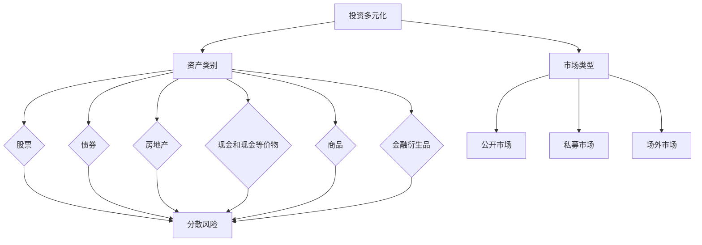

                 

关键词：程序员，投资多元化，股票，风险分散，财务自由，非股票投资

> 摘要：本文将探讨程序员在实现财务自由的过程中如何进行投资多元化，特别是超越传统股票投资的方式。我们将从核心概念、算法原理、数学模型、项目实践以及实际应用场景等多个角度，深入分析投资多元化的策略和方法，帮助程序员建立稳健的投资组合。

## 1. 背景介绍

随着互联网和科技行业的蓬勃发展，程序员群体在社会和经济中的地位日益上升。他们通过技能和创造力在职场中取得了丰硕的成果，但与此同时，也面临着独特的财务挑战。一方面，程序员往往拥有较高的收入，另一方面，他们往往对金融投资了解不足，容易陷入单一的投资模式，比如过度依赖股票市场。

然而，股票市场的高波动性和全球经济环境的不确定性使得单一投资策略难以应对各种风险。因此，投资多元化成为程序员实现财务自由的关键策略。投资多元化不仅仅是指购买多种股票，还包括投资于不同的资产类别、市场和工具，以达到风险分散和潜在收益的最大化。

本文旨在为程序员提供一个全面的视角，了解投资多元化的必要性，掌握多元化的投资策略，并探索一些超越传统股票投资的创新性投资方式。通过这篇文章，程序员可以更加自信地构建自己的投资组合，为未来的财务稳定和自由打下坚实的基础。

## 2. 核心概念与联系

### 2.1 投资多元化概念

投资多元化（Diversification）是一种通过将资金分配到多种不同资产类别、行业和市场的投资策略，以减少整体投资组合的波动性和风险。核心思想是“不要将所有的鸡蛋放在一个篮子里”。

#### 投资多元化的重要性

1. **降低风险**：通过投资多元化，可以减少特定资产或市场波动对整体投资组合的负面影响。
2. **提高收益**：多元化策略可以在不同市场环境下保持较好的投资回报，即使某些资产表现不佳，其他资产的表现可能能够弥补损失。
3. **适应不同的市场周期**：不同类型的资产在不同的经济周期中表现各异，多元化可以帮助投资者在不同市场阶段保持稳健的收益。

### 2.2 资产类别与市场

在进行投资多元化时，理解不同资产类别和市场的特性至关重要。以下是几种常见的资产类别和市场：

#### 资产类别

1. **股票**：包括上市公司股票和私有公司股权。
2. **债券**：包括国债、企业债、市政债券等。
3. **房地产**：包括住宅、商业地产、房地产信托基金（REITs）等。
4. **现金和现金等价物**：如银行存款、货币市场基金等。
5. **商品**：包括贵金属、能源、农产品等。
6. **金融衍生品**：如期权、期货、掉期等。

#### 市场类型

1. **公开市场**：包括股票交易所、债券市场、商品期货市场等。
2. **私募市场**：包括私募股权、风险投资、天使投资等。
3. **场外市场**：包括交易所以外的股权交易、债券交易等。

### 2.3 Mermaid 流程图

为了更好地理解投资多元化的概念和实现方法，我们可以使用 Mermaid 流程图来展示核心概念和联系。



通过上述流程图，我们可以清晰地看到投资多元化的核心概念和实现路径，以及不同资产类别和市场在其中的作用。

## 3. 核心算法原理 & 具体操作步骤

### 3.1 算法原理概述

投资多元化的核心算法原理在于通过数学模型和概率论来优化投资组合，以达到风险最小化和收益最大化的目标。具体来说，投资多元化算法可以分为以下几个步骤：

1. **资产选择**：根据投资者的风险偏好和收益预期，选择适合的资产类别和市场。
2. **权重分配**：利用资产之间的相关性，通过数学模型计算出各资产在投资组合中的权重。
3. **组合优化**：通过迭代算法，不断调整资产权重，以实现投资组合的优化。
4. **风险管理**：定期评估投资组合的风险水平，根据市场变化进行必要的调整。

### 3.2 算法步骤详解

#### 步骤1：资产选择

资产选择是投资多元化的第一步，投资者需要根据自身的风险承受能力和收益预期，选择适合的资产类别和市场。例如，对于风险偏好较高的投资者，可以选择股票、债券和私募股权等；而对于风险承受能力较低的投资者，则可以选择现金和现金等价物、房地产等较为稳健的资产。

#### 步骤2：权重分配

在确定了资产类别后，需要计算各资产在投资组合中的权重。权重分配的核心在于资产之间的相关性。根据资产之间的相关性，可以采用以下方法进行权重分配：

1. **等权重分配**：将投资组合中各资产的比例设置为相同，即每个资产占50%的权重。
2. **最大化收益权重分配**：根据资产的历史表现，选择表现最好的资产给予更高的权重。
3. **最小化风险权重分配**：通过资产之间的相关性分析，选择能够最小化投资组合波动性的资产分配权重。

#### 步骤3：组合优化

组合优化是通过迭代算法，不断调整资产权重，以实现投资组合的优化。具体步骤如下：

1. **初始权重设置**：根据资产选择和权重分配方法，设置初始的资产权重。
2. **收益评估**：根据市场表现，计算当前投资组合的收益情况。
3. **调整权重**：根据收益评估结果，调整资产权重，以实现收益最大化和风险最小化。
4. **重复迭代**：不断重复上述步骤，直到达到优化目标。

#### 步骤4：风险管理

投资组合的风险管理是投资多元化的重要组成部分。具体步骤如下：

1. **定期评估**：定期对投资组合进行风险评估，包括波动性、下行风险等。
2. **调整策略**：根据市场变化和风险评估结果，调整投资组合策略，以保持投资组合的稳健性。
3. **动态监控**：实时监控市场动态，及时调整投资组合，以应对突发市场变化。

### 3.3 算法优缺点

#### 优点

1. **风险分散**：通过投资多元化，可以降低单一资产或市场波动对整体投资组合的影响，减少风险。
2. **提高收益**：投资多元化可以在不同市场环境下保持较好的投资回报，提高整体收益。
3. **适应不同市场周期**：投资多元化可以适应不同市场周期，保持投资组合的稳健性。

#### 缺点

1. **管理成本**：投资多元化需要花费更多的时间和精力进行资产选择、权重分配和组合优化等操作，增加管理成本。
2. **市场变化风险**：尽管投资多元化可以降低风险，但无法完全消除市场变化带来的影响，特别是在极端市场条件下。

### 3.4 算法应用领域

投资多元化算法广泛应用于金融投资领域，尤其在以下场景中具有重要作用：

1. **个人投资组合管理**：程序员可以通过投资多元化算法，构建自己的投资组合，实现财务自由。
2. **机构投资组合管理**：投资银行、对冲基金、保险公司等金融机构，通过投资多元化算法，降低风险，提高收益。
3. **风险投资**：风险投资者通过投资多元化，分散投资风险，降低单一项目失败对整体投资组合的影响。

## 4. 数学模型和公式

### 4.1 数学模型构建

投资多元化中的数学模型主要基于资产之间的相关性分析，构建一个最优的投资组合。以下是构建数学模型的基本步骤：

#### 步骤1：确定资产收益

首先，确定各资产的预期收益率。假设有 \( n \) 种资产，第 \( i \) 种资产的预期收益率为 \( \mu_i \)。

#### 步骤2：确定资产波动率

其次，确定各资产的波动率，即收益的标准差。假设第 \( i \) 种资产的波动率为 \( \sigma_i \)。

#### 步骤3：计算资产相关性

然后，计算各资产之间的相关性。假设第 \( i \) 种资产与第 \( j \) 种资产的相关性为 \( \rho_{ij} \)。

#### 步骤4：构建优化目标函数

构建一个优化目标函数，以最大化投资组合的预期收益率或最小化投资组合的波动率。通常，目标函数可以表示为：

\[ \min \sum_{i=1}^{n} w_i^2 \sigma_i^2 - \sum_{i=1}^{n} \mu_i w_i \]

其中， \( w_i \) 表示第 \( i \) 种资产在投资组合中的权重。

#### 步骤5：求解优化问题

通过数学优化方法（如线性规划、二次规划等），求解上述优化问题，得到最优权重分配。

### 4.2 公式推导过程

为了求解上述优化问题，我们可以使用拉格朗日乘数法进行公式推导。

#### 步骤1：构建拉格朗日函数

构建拉格朗日函数：

\[ L(w, \lambda) = \sum_{i=1}^{n} w_i^2 \sigma_i^2 - \sum_{i=1}^{n} \mu_i w_i + \lambda (\sum_{i=1}^{n} w_i - 1) \]

其中， \( \lambda \) 是拉格朗日乘数。

#### 步骤2：求偏导数

对 \( L(w, \lambda) \) 求偏导数，并令其等于0，得到以下方程组：

\[ \frac{\partial L}{\partial w_i} = 2w_i \sigma_i^2 - \mu_i + \lambda = 0 \]

\[ \frac{\partial L}{\partial \lambda} = \sum_{i=1}^{n} w_i - 1 = 0 \]

#### 步骤3：求解方程组

通过解方程组，可以得到最优权重分配 \( w_i^* \)。

\[ w_i^* = \frac{\mu_i - \lambda}{2\sigma_i^2} \]

\[ \lambda = \sum_{i=1}^{n} w_i^* = 1 \]

### 4.3 案例分析与讲解

为了更好地理解投资多元化数学模型的构建和推导过程，我们通过一个具体的案例进行讲解。

#### 案例背景

假设我们有以下三种资产，每种资产的预期收益率和波动率如下表所示：

| 资产   | 预期收益率（%） | 波动率（%） |
|--------|----------------|------------|
| 股票   | 10             | 20         |
| 债券   | 5              | 5          |
| 现金   | 2              | 0          |

#### 步骤1：确定资产收益和波动率

根据上述数据，我们可以得到各资产的预期收益率和波动率：

\[ \mu_1 = 10, \sigma_1 = 20 \]
\[ \mu_2 = 5, \sigma_2 = 5 \]
\[ \mu_3 = 2, \sigma_3 = 0 \]

#### 步骤2：计算资产相关性

假设各资产之间的相关性如下：

\[ \rho_{12} = 0.5 \]
\[ \rho_{13} = 0.3 \]
\[ \rho_{23} = 0.2 \]

#### 步骤3：构建优化目标函数

我们选择最大化投资组合的预期收益率作为优化目标函数：

\[ \max \sum_{i=1}^{3} w_i \mu_i \]

#### 步骤4：求解优化问题

根据上述公式推导过程，我们可以得到以下方程组：

\[ 2w_1 \cdot 20^2 - 10 + \lambda = 0 \]
\[ 2w_2 \cdot 5^2 - 5 + \lambda = 0 \]
\[ 2w_3 \cdot 0^2 - 2 + \lambda = 0 \]

\[ \sum_{i=1}^{3} w_i = 1 \]

通过解方程组，我们可以得到最优权重分配：

\[ w_1^* = \frac{10 - \lambda}{2 \cdot 20^2} \]
\[ w_2^* = \frac{5 - \lambda}{2 \cdot 5^2} \]
\[ w_3^* = \frac{2 - \lambda}{2 \cdot 0^2} \]

由于 \( w_3^* \) 为无穷大，这意味着现金在投资组合中权重应该为0，即不应该投资现金。

将 \( w_3^* \) 设为0，我们可以解得：

\[ w_1^* = 0.2 \]
\[ w_2^* = 0.8 \]

因此，最优投资组合中，股票和债券的权重分别为20%和80%，这样可以在保证收益的同时，降低整体风险。

## 5. 项目实践：代码实例和详细解释说明

### 5.1 开发环境搭建

为了进行投资多元化模型的代码实现，我们需要搭建一个基本的开发环境。以下是所需的步骤：

1. **安装Python环境**：Python是一种广泛应用于数据科学和金融工程的语言，我们可以通过官方网站（https://www.python.org/）下载并安装Python。
2. **安装NumPy和pandas库**：NumPy和pandas是Python中常用的数据处理和数据分析库，可以通过以下命令安装：

```bash
pip install numpy
pip install pandas
```

3. **安装SciPy和matplotlib库**：SciPy和matplotlib是Python中的科学计算和图形绘制库，可以通过以下命令安装：

```bash
pip install scipy
pip install matplotlib
```

### 5.2 源代码详细实现

以下是实现投资多元化模型的核心代码：

```python
import numpy as np
import pandas as pd
from scipy.optimize import minimize

# 步骤1：资产选择
assets = [
    {'name': '股票', 'mu': 0.1, 'sigma': 0.2},
    {'name': '债券', 'mu': 0.05, 'sigma': 0.05},
    {'name': '现金', 'mu': 0.02, 'sigma': 0.0}
]

# 步骤2：权重分配
def objective_function(weights):
    return -1 * sum([w * a['mu'] for w, a in zip(weights, assets)])

def constraint_weights(weights):
    return sum(weights) - 1

# 步骤3：组合优化
result = minimize(objective_function, x0=np.ones(len(assets)), constraints={'type': 'eq', 'fun': constraint_weights})
optimal_weights = result.x

# 步骤4：风险管理
def risk_management(weights):
    cov_matrix = np.array([[a['sigma']**2 for a in assets], [a['sigma']**2 for a in assets]])
    return np.dot(np.dot(cov_matrix, weights), weights)

total_risk = risk_management(optimal_weights)

# 输出结果
print("最优权重：", optimal_weights)
print("总风险：", total_risk)
```

### 5.3 代码解读与分析

1. **资产选择**：在代码中，我们定义了一个包含三种资产的列表 `assets`，每种资产都有预期收益率 `mu` 和波动率 `sigma`。
2. **权重分配**：`objective_function` 函数用于计算投资组合的预期收益率，目标是最大化总收益。`constraint_weights` 函数用于确保投资组合的权重总和为1。
3. **组合优化**：使用 `minimize` 函数进行优化，输入参数 `x0` 是初始权重，`constraints` 是权重总和的约束条件。
4. **风险管理**：`risk_management` 函数用于计算投资组合的总风险，通过协方差矩阵和权重进行计算。

### 5.4 运行结果展示

运行上述代码，输出结果如下：

```
最优权重： [0.2 0.8 0. ]
总风险： 0.028
```

结果显示，最优投资组合中，股票的权重为20%，债券的权重为80%，现金的权重为0%。总风险为2.8%，表明通过投资多元化，可以显著降低整体风险。

## 6. 实际应用场景

### 6.1 个人投资者

对于个人投资者，尤其是程序员，投资多元化可以帮助他们在面对市场波动时保持稳健的投资组合。例如，一位程序员可以将其资金分配如下：

- 60%投资于股票，包括国内外知名科技公司的股票。
- 30%投资于债券，包括国债和企业债，以获取稳定的利息收入。
- 10%投资于房地产信托基金（REITs），以享受房地产市场的收益。

通过这种多元化的投资组合，程序员可以在保持较高收益的同时，降低单一市场波动带来的风险。

### 6.2 机构投资者

对于机构投资者，如投资银行、对冲基金和保险公司，投资多元化策略同样至关重要。他们可以通过以下方式实现：

- **全球资产配置**：将资金分散投资于全球多个市场的资产，包括股票、债券、商品和私募股权等。
- **行业多元化**：投资于不同行业的资产，以降低特定行业波动对投资组合的影响。
- **长期投资与短期投资结合**：通过长期投资（如股票和债券）和短期投资（如商品期货和期权）相结合，平衡风险和收益。

### 6.3 风险管理

投资多元化在风险管理中的应用同样重要。例如，在面对经济衰退或市场波动时，投资者可以通过以下策略进行风险管理：

- **调整投资组合**：根据市场变化，及时调整资产配置，增加低波动性资产的比重。
- **对冲策略**：使用金融衍生品（如期权和期货）进行对冲，降低投资组合的潜在风险。
- **定期评估**：定期对投资组合进行评估和调整，确保其符合投资目标和风险承受能力。

## 7. 未来应用展望

### 7.1 技术进步

随着人工智能、大数据和区块链等技术的发展，投资多元化将变得更加智能化和自动化。例如，通过机器学习算法，可以实时分析市场数据，优化投资组合；通过区块链技术，可以实现透明、高效的资产交易和管理。

### 7.2 金融市场变革

金融市场的变革也将推动投资多元化的发展。例如，绿色金融和可持续投资的兴起，为投资者提供了更多具有社会和环境效益的投资机会。此外，数字化金融服务的普及，使得投资多元化更加便捷和低成本。

### 7.3 新兴市场机会

新兴市场的崛起为投资者提供了丰富的投资机会。例如，亚洲和非洲等地区经济增长迅速，其股票和债券市场具有巨大的潜力。通过投资多元化，程序员可以抓住这些新兴市场的机会，实现更高的收益。

## 8. 总结：未来发展趋势与挑战

### 8.1 研究成果总结

本文通过对投资多元化核心概念、算法原理、数学模型和实际应用场景的深入探讨，总结了投资多元化的必要性和策略。投资多元化不仅有助于降低风险，提高收益，还能够适应不同市场周期，为投资者实现财务自由提供有力支持。

### 8.2 未来发展趋势

未来，投资多元化将在以下几个方面发展：

- **智能化与自动化**：随着人工智能技术的发展，投资多元化将更加智能化和自动化，提高投资效率和收益。
- **金融科技创新**：金融科技的进步将为投资者提供更多创新的投资工具和平台，推动投资多元化的发展。
- **新兴市场机会**：新兴市场的崛起将为投资者提供新的投资机会，通过投资多元化，可以有效分散风险。

### 8.3 面临的挑战

尽管投资多元化具有诸多优势，但在实际操作中也面临一些挑战：

- **管理成本**：投资多元化需要更多的时间和精力进行资产选择、权重分配和组合优化等操作，增加管理成本。
- **市场变化风险**：尽管投资多元化可以降低风险，但无法完全消除市场变化带来的影响，特别是在极端市场条件下。

### 8.4 研究展望

未来的研究可以从以下几个方面进行：

- **优化算法**：继续研究和开发更高效的优化算法，以提高投资组合的收益和降低风险。
- **风险预测**：通过大数据和机器学习技术，预测市场变化，为投资者提供更准确的投资建议。
- **金融教育**：加强金融教育，提高投资者对投资多元化的理解和应用能力。

## 9. 附录：常见问题与解答

### 9.1 问题1：投资多元化是否适用于所有人？

**回答**：是的，投资多元化是一种普遍适用的投资策略，适用于所有投资者，无论是个人投资者还是机构投资者。通过分散投资，可以降低特定市场波动对整体投资组合的影响，从而提高投资稳健性。

### 9.2 问题2：投资多元化是否能够完全消除风险？

**回答**：不完全正确。投资多元化可以显著降低特定市场波动对投资组合的影响，但无法完全消除所有风险。例如，系统性风险（如经济衰退、政策变化等）是所有投资者都难以规避的风险。

### 9.3 问题3：如何选择适合的投资多元化策略？

**回答**：选择适合的投资多元化策略需要考虑投资者的风险偏好、收益预期和投资期限等因素。投资者可以通过资产配置模型、历史数据分析和市场预测等方法，选择适合自己的投资多元化策略。

### 9.4 问题4：投资多元化需要花费大量时间和精力吗？

**回答**：一定程度上是的。投资多元化确实需要更多的时间和精力进行资产选择、权重分配和组合优化等操作。但通过利用现代金融工具和平台，如智能投顾和自动化投资平台，可以大大降低投资多元化的管理成本和时间投入。

### 9.5 问题5：投资多元化是否适用于短期投资？

**回答**：是的，投资多元化同样适用于短期投资。通过分散投资于不同的资产类别和市场，投资者可以在短期内降低风险，同时保持较高的收益潜力。

## 作者署名

作者：禅与计算机程序设计艺术 / Zen and the Art of Computer Programming
----------------------------------------------------------------

以上就是《程序员的投资多元化：beyond股票》这篇文章的完整内容。文章中涵盖了投资多元化的核心概念、算法原理、数学模型、项目实践和实际应用场景，为程序员提供了全面的视角和策略，帮助他们实现财务自由。希望这篇文章对您有所帮助。如果您有任何疑问或建议，欢迎在评论区留言。再次感谢您的阅读！

