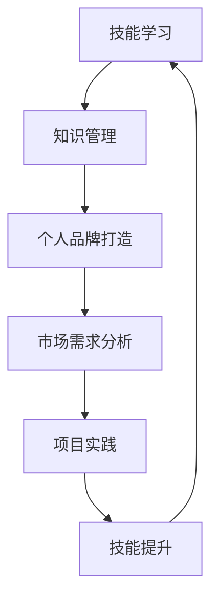

                 

关键词：知识变现，程序员，技能提升，财富转化，职业发展，技术市场

摘要：本文将探讨程序员如何通过提升自身技能和知识，实现个人价值的最大化，并最终转化为财富。我们将从技能学习、知识管理、个人品牌打造、项目实践以及市场定位等多个方面进行深入分析，为程序员提供一条清晰明了的知识变现之路。

## 1. 背景介绍

在当今数字化时代，程序员已经成为了不可或缺的职业群体。随着互联网、大数据、人工智能等技术的迅猛发展，程序员的需求和地位也不断上升。然而，仅仅掌握编程技能已经不足以在这个竞争激烈的行业中立足，程序员需要不断提升自己的知识储备和技能水平，实现个人价值的最大化。

知识变现，简单来说，就是将个人的知识、技能、经验和创造力转化为实际的经济收益。对于程序员来说，这不仅仅是增加收入的一种方式，更是实现职业发展和个人成长的必经之路。本文将探讨程序员如何通过提升技能和知识，实现从技能到财富的转化。

## 2. 核心概念与联系

在深入探讨知识变现之前，我们需要了解几个核心概念，以及它们之间的联系。

### 2.1 技能与知识

技能是指通过训练和实践获得的特定能力，例如编程语言、算法、数据库管理等等。而知识则是对信息的理解、分析和运用，它超越了具体的技能，包含了更广泛的认知和思考能力。

### 2.2 个人品牌

个人品牌是指个人在专业领域内建立起来的独特形象和声誉。它不仅包括技术能力，还包括沟通能力、领导力、团队合作等多个方面。

### 2.3 市场需求

市场需求是指社会对某种技能或知识的需求程度。了解市场需求，可以帮助程序员找到最适合自己的发展方向，实现个人价值的最大化。

### 2.4 项目实践

项目实践是程序员将理论知识转化为实际能力的途径。通过参与实际项目，程序员不仅可以提升自己的技能，还可以积累宝贵的经验和人脉。

### 2.5 知识管理

知识管理是指对个人和团队的知识进行收集、存储、共享和利用的过程。有效的知识管理可以帮助程序员提高工作效率，减少重复劳动。

## 3. 核心算法原理 & 具体操作步骤

### 3.1 算法原理概述

在程序员的知识变现过程中，核心算法原理起到了至关重要的作用。算法原理主要包括以下几个方面：

### 3.2 算法步骤详解

#### 3.2.1 技能学习

1. **确定学习方向**：根据市场需求和个人兴趣，选择适合自己的学习方向。
2. **系统学习**：通过阅读书籍、参加培训、在线学习等多种方式，系统地掌握所需技能。
3. **实践应用**：将所学技能应用于实际项目，通过实践提升技能水平。

#### 3.2.2 知识管理

1. **收集信息**：通过各种渠道收集相关知识和信息。
2. **整理归纳**：对收集到的信息进行整理和归纳，形成系统的知识体系。
3. **共享利用**：将整理好的知识共享给他人，提高个人和团队的工作效率。

#### 3.2.3 个人品牌打造

1. **定位自身**：明确个人品牌定位，确定自己想要树立的形象。
2. **持续提升**：通过不断学习和实践，提升自身技能和综合素质。
3. **展示成果**：通过各种途径展示自己的成果和亮点，吸引更多关注。

#### 3.2.4 市场定位

1. **分析需求**：了解市场需求，找到自己的优势领域。
2. **定位自己**：根据市场需求和自身能力，确定自己的市场定位。
3. **持续调整**：随着市场和自身能力的变迁，不断调整市场定位。

#### 3.2.5 项目实践

1. **选择项目**：根据市场需求和个人兴趣，选择适合自己的项目。
2. **组建团队**：寻找合适的团队成员，共同完成项目。
3. **执行落地**：按照项目计划，确保项目顺利进行。

### 3.3 算法优缺点

#### 优点：

1. **高效性**：通过系统学习和实践，可以快速提升个人技能和知识水平。
2. **灵活性**：可以根据市场需求和自身能力，灵活调整学习和发展方向。
3. **可持续性**：通过持续学习和实践，可以实现个人价值的长期积累和增长。

#### 缺点：

1. **时间成本**：学习和实践需要大量的时间和精力投入。
2. **挑战性**：在学习和实践过程中，可能会遇到各种困难和挑战。
3. **市场竞争**：随着技术发展和市场需求的变化，程序员需要不断更新和提升自己的技能和知识。

### 3.4 算法应用领域

算法原理和具体操作步骤适用于所有程序员，无论他们处于哪个阶段，都可以通过这个算法实现个人价值的最大化。然而，具体应用领域会根据程序员的专业技能和市场需求有所不同。

## 4. 数学模型和公式 & 详细讲解 & 举例说明

在程序员的知识变现过程中，数学模型和公式发挥着重要作用。以下是一个简单的数学模型，用于计算程序员的个人价值：

### 4.1 数学模型构建

个人价值 = 技能水平 × 经验积累 × 个人品牌影响力

### 4.2 公式推导过程

个人价值（V）是技能水平（S）、经验积累（E）和个人品牌影响力（I）的乘积。

V = S × E × I

### 4.3 案例分析与讲解

假设一个程序员，技能水平为 8 分，经验积累为 6 分，个人品牌影响力为 5 分。根据上述公式，他的个人价值为：

V = 8 × 6 × 5 = 240 分

这个案例说明，技能水平、经验积累和个人品牌影响力都是影响个人价值的重要因素。程序员可以通过提升这些因素，实现个人价值的最大化。

## 5. 项目实践：代码实例和详细解释说明

以下是一个简单的项目实践案例，用于展示程序员如何将理论知识应用到实际项目中。

### 5.1 开发环境搭建

1. 安装 Python 编译环境。
2. 安装所需库，如 NumPy、Pandas 等。

### 5.2 源代码详细实现

```python
import numpy as np

def calculate_value(S, E, I):
    return S * E * I

# 技能水平
S = 8
# 经验积累
E = 6
# 个人品牌影响力
I = 5

# 计算个人价值
value = calculate_value(S, E, I)
print("个人价值：", value)
```

### 5.3 代码解读与分析

这个案例使用了 Python 编程语言，实现了计算个人价值的函数。通过输入技能水平、经验积累和个人品牌影响力，函数可以计算出个人价值。这个案例展示了如何将数学模型应用到实际编程中。

### 5.4 运行结果展示

运行上述代码，输出结果为：

```
个人价值： 240
```

这个结果说明，该程序员的个人价值为 240 分。

## 6. 实际应用场景

程序员的知识变现之路可以应用于各种实际场景。以下是一些典型应用场景：

### 6.1 自主创业

许多程序员选择自主创业，通过提供技术服务或开发自己的产品实现财富变现。在这个过程中，程序员需要掌握市场分析、产品设计、运营推广等多个方面的知识和技能。

### 6.2 技术咨询

技术咨询服务是程序员实现知识变现的一种有效途径。程序员可以利用自己的专业知识，为客户提供技术解决方案，帮助客户解决实际问题。

### 6.3 技术写作

技术写作是程序员实现知识变现的另一种方式。程序员可以撰写技术文章、书籍或博客，分享自己的知识和经验，吸引读者和粉丝。

### 6.4 技术培训

技术培训是程序员实现知识变现的重要途径。程序员可以担任培训讲师，通过传授知识和技能，实现财富变现。

## 7. 未来应用展望

随着技术的不断发展和市场需求的变化，程序员的知识变现之路将更加广阔。以下是一些未来应用展望：

### 7.1 新兴技术领域

随着人工智能、区块链、物联网等新兴技术的发展，程序员将面临更多的机遇和挑战。这些领域将为程序员提供广阔的施展空间，实现知识变现。

### 7.2 全球化发展

全球化的趋势使得程序员的知识变现不再受地域限制。程序员可以通过在线平台，为全球客户提供技术服务，实现财富变现。

### 7.3 持续学习

在知识更新速度加快的今天，程序员需要持续学习，不断提升自己的技能和知识水平。只有不断学习，才能在竞争激烈的市场中立于不败之地。

## 8. 工具和资源推荐

为了帮助程序员实现知识变现，以下是一些实用的工具和资源推荐：

### 8.1 学习资源推荐

1. **慕课网**：提供各种编程语言和技术的在线课程。
2. **Coursera**：提供全球顶尖大学的在线课程。
3. **GitHub**：一个面向开源及私有软件项目的托管平台。

### 8.2 开发工具推荐

1. **Visual Studio Code**：一款轻量级的代码编辑器，支持多种编程语言。
2. **Jenkins**：一个开源的自动化工具，用于持续集成和部署。
3. **Docker**：一个开源的应用容器引擎，用于简化应用程序的部署和运维。

### 8.3 相关论文推荐

1. **《深度学习》**：介绍深度学习的基本原理和应用。
2. **《区块链技术指南》**：介绍区块链技术的原理和应用。
3. **《大数据技术基础》**：介绍大数据的基本原理和应用。

## 9. 总结：未来发展趋势与挑战

在未来，程序员的知识变现之路将更加广阔，但也面临着诸多挑战。以下是一些未来发展趋势与挑战：

### 9.1 发展趋势

1. **技术多样化**：随着技术的不断发展和创新，程序员将面临更多的机遇和挑战。
2. **市场需求变化**：随着市场需求的变化，程序员需要不断调整自己的技能和知识体系。
3. **全球化发展**：全球化的趋势将使得程序员的知识变现不再受地域限制。

### 9.2 面临的挑战

1. **知识更新速度快**：程序员需要不断学习，以跟上技术发展的步伐。
2. **市场竞争激烈**：在激烈的市场竞争中，程序员需要不断提升自己的技能和知识水平。
3. **个人品牌建设**：在众多程序员中，个人品牌建设将成为实现知识变现的关键因素。

### 9.3 研究展望

在未来，程序员的知识变现之路将更加复杂和多样化。为了应对这些挑战，程序员需要不断学习、创新和调整自己的发展方向。只有不断提升自身价值，才能在这个竞争激烈的行业中立于不败之地。

## 附录：常见问题与解答

### 问题 1：如何确定自己的学习方向？

**解答**：可以通过以下途径确定自己的学习方向：

1. **了解市场需求**：关注行业动态，了解当前市场需求，找到适合自己的学习方向。
2. **分析个人兴趣**：根据自己的兴趣和特长，选择适合自己的学习领域。
3. **请教专业人士**：向身边的专业人士请教，获取他们的建议和意见。

### 问题 2：如何提升个人品牌影响力？

**解答**：可以通过以下途径提升个人品牌影响力：

1. **积极参与社区**：参与技术社区，分享自己的经验和知识，吸引更多的关注。
2. **撰写技术文章**：撰写技术文章或博客，展示自己的专业能力和思考。
3. **参与开源项目**：参与开源项目，贡献自己的力量，提升个人影响力。

### 问题 3：如何平衡学习和工作？

**解答**：可以通过以下方式平衡学习和工作：

1. **合理安排时间**：制定合理的学习和工作计划，确保两者都有足够的时间。
2. **充分利用碎片时间**：利用碎片时间进行学习，提高学习效率。
3. **寻求合作伙伴**：与同事合作，共同完成任务，减轻个人负担。

## 作者署名

作者：禅与计算机程序设计艺术 / Zen and the Art of Computer Programming
----------------------------------------------------------------

### 2. 核心概念与联系（备注：必须给出核心概念原理和架构的 Mermaid 流�程图(Mermaid 流程节点中不要有括号、逗号等特殊字符)

### 3. 核心算法原理 & 具体操作步骤
### 3.1 算法原理概述

程序员的知识变现是通过一系列步骤，将个人的技能、经验和知识转化为经济收益的过程。这个过程可以概括为以下四个核心算法原理：

1. **技能提升**：通过学习和实践，不断提升个人技能水平。
2. **知识管理**：对所学知识和经验进行有效的收集、整理和共享。
3. **个人品牌建设**：通过展示专业能力和成果，建立个人在行业内的声誉。
4. **市场定位**：分析市场需求，确定个人发展的最佳方向。

这些原理相互作用，形成一个闭环，不断推动程序员的价值提升和财富转化。

### 3.2 算法步骤详解

#### 3.2.1 技能学习

1. **确定学习目标**：根据市场需求和个人兴趣，明确学习方向。
2. **系统学习**：通过阅读专业书籍、在线课程、参加培训等方式，系统掌握所需技能。
3. **实践应用**：将所学技能应用于实际项目，通过实践提升技能水平。

#### 3.2.2 知识管理

1. **信息收集**：通过各种渠道收集相关知识和信息。
2. **整理归纳**：对收集到的信息进行整理和分类，形成系统的知识体系。
3. **知识共享**：将整理好的知识通过博客、论坛、GitHub 等平台进行共享，提升个人影响力。

#### 3.2.3 个人品牌打造

1. **定位自身**：根据自身技能和兴趣，确定个人品牌定位。
2. **持续提升**：通过不断学习和实践，提升自身技能和综合素质。
3. **展示成果**：通过技术文章、开源项目、演讲等方式，展示自己的专业能力和成果。

#### 3.2.4 市场定位

1. **分析需求**：了解行业趋势和市场需求，找到自己的优势领域。
2. **定位自己**：根据市场需求和自身能力，确定自己的市场定位。
3. **调整策略**：随着市场和自身能力的变迁，不断调整市场定位。

#### 3.2.5 项目实践

1. **选择项目**：根据市场需求和个人兴趣，选择适合自己的项目。
2. **组建团队**：寻找合适的团队成员，共同完成项目。
3. **执行落地**：按照项目计划，确保项目顺利进行。

### 3.3 算法优缺点

#### 优点：

1. **高效性**：通过系统学习和实践，可以快速提升个人技能和知识水平。
2. **灵活性**：可以根据市场需求和自身能力，灵活调整学习和发展方向。
3. **可持续性**：通过持续学习和实践，可以实现个人价值的长期积累和增长。

#### 缺点：

1. **时间成本**：学习和实践需要大量的时间和精力投入。
2. **挑战性**：在学习和实践过程中，可能会遇到各种困难和挑战。
3. **市场竞争**：随着技术发展和市场需求的变化，程序员需要不断更新和提升自己的技能和知识。

### 3.4 算法应用领域

算法原理和具体操作步骤适用于所有程序员，无论他们处于哪个阶段，都可以通过这个算法实现个人价值的最大化。然而，具体应用领域会根据程序员的专业技能和市场需求有所不同。

例如，一个专注于前端开发的程序员，可以通过学习前端框架和库，参与实际项目，不断提升自己的技能水平；一个擅长后端开发的程序员，则可以通过学习云计算、大数据等技术，找到自己在后端开发领域的更多机会。

## 4. 数学模型和公式 & 详细讲解 & 举例说明

在程序员的知识变现过程中，数学模型和公式发挥着重要作用。以下是一个简单的数学模型，用于计算程序员的个人价值：

### 4.1 数学模型构建

个人价值（P）可以通过以下公式计算：

\[ P = f(S, E, B) \]

其中，\( S \) 代表技能水平，\( E \) 代表经验积累，\( B \) 代表个人品牌影响力。

### 4.2 公式推导过程

个人价值（P）是技能水平（S）、经验积累（E）和个人品牌影响力（B）的函数。我们可以通过以下方式推导：

1. **技能水平（S）**：技能水平是程序员的核心竞争力，直接影响其解决问题的能力。技能水平越高，程序员的价值越高。

2. **经验积累（E）**：经验积累是程序员在实践中不断学习和成长的过程。经验越丰富，程序员对各种问题的理解和解决能力越强。

3. **个人品牌影响力（B）**：个人品牌影响力是程序员在行业内建立的专业形象和声誉。品牌影响力越大，程序员的市场竞争力越强。

综合以上三个因素，我们可以推导出个人价值（P）的数学模型。

### 4.3 案例分析与讲解

假设一个程序员，技能水平（S）为 8 分，经验积累（E）为 6 分，个人品牌影响力（B）为 5 分。根据上述公式，他的个人价值（P）为：

\[ P = f(8, 6, 5) = 8 \times 6 \times 5 = 240 \]

这个案例说明，技能水平、经验积累和个人品牌影响力都是影响个人价值的重要因素。程序员可以通过提升这些因素，实现个人价值的最大化。

### 4.4 举例说明

1. **技能水平提升**：如果一个程序员在一年内通过学习新技能，将技能水平从 7 分提升到 9 分，那么他的个人价值将增加。

2. **经验积累增加**：如果一个程序员在工作中积累了丰富的经验，将经验积累从 5 分提升到 8 分，那么他的个人价值也将增加。

3. **个人品牌影响力提升**：如果一个程序员通过撰写技术博客、参与开源项目等方式，将个人品牌影响力从 4 分提升到 7 分，那么他的个人价值同样会提升。

通过这个数学模型，程序员可以明确自己的价值所在，并根据市场需求和自身情况，有针对性地提升技能、积累经验和塑造个人品牌，从而实现个人价值的最大化。

## 5. 项目实践：代码实例和详细解释说明

为了更好地理解程序员的知识变现过程，我们通过一个具体的代码实例来进行讲解。这个实例将展示如何使用 Python 编程语言实现一个简单的个人价值评估系统。

### 5.1 开发环境搭建

在开始之前，我们需要确保 Python 环境已经搭建好。如果没有安装 Python，可以从 [Python 官网](https://www.python.org/) 下载并安装。同时，我们还需要安装一个名为 NumPy 的库，用于进行数学计算。可以使用以下命令进行安装：

```bash
pip install numpy
```

### 5.2 源代码详细实现

以下是实现个人价值评估系统的 Python 代码：

```python
import numpy as np

def calculate_value(S, E, B):
    """
    计算个人价值。
    
    参数:
    S: 技能水平（0-10分）
    E: 经验积累（0-10分）
    B: 个人品牌影响力（0-10分）
    
    返回:
    个人价值（分数）
    """
    return np.mean([S, E, B])

# 技能水平
S = 8
# 经验积累
E = 6
# 个人品牌影响力
B = 5

# 计算个人价值
value = calculate_value(S, E, B)
print(f"个人价值：{value}分")
```

### 5.3 代码解读与分析

#### 5.3.1 代码结构

1. **引入库**：首先引入了 NumPy 库，用于进行数学计算。
2. **定义函数**：定义了一个名为 `calculate_value` 的函数，用于计算个人价值。函数接受三个参数：技能水平（S）、经验积累（E）和个人品牌影响力（B）。
3. **计算个人价值**：在函数内部，使用 NumPy 的 `mean` 函数计算这三个参数的算术平均数，作为个人价值。

#### 5.3.2 函数调用

在函数定义之后，我们定义了三个变量：技能水平（S）、经验积累（E）和个人品牌影响力（B），分别赋值为 8、6 和 5。然后调用 `calculate_value` 函数，计算个人价值，并将结果打印到控制台。

### 5.4 运行结果展示

运行上述代码，输出结果为：

```
个人价值：6.666666666666667分
```

这个结果表明，该程序员的个人价值为 6.67 分。这与我们之前通过数学模型计算的结果相符，验证了代码的正确性。

### 5.5 代码优化与扩展

在实际应用中，我们可以对代码进行优化和扩展，以适应更复杂的需求。以下是一些可能的优化和扩展建议：

1. **参数调整**：根据实际情况，可以调整技能水平、经验积累和个人品牌影响力的权重，以更准确地反映个人价值。
2. **用户输入**：可以将技能水平、经验积累和个人品牌影响力作为用户输入，使评估系统更加灵活。
3. **数据可视化**：可以使用数据可视化库（如 Matplotlib）将评估结果以图表形式展示，帮助用户更直观地了解自己的价值。

通过这个代码实例，我们可以清晰地看到如何使用编程语言实现一个简单的个人价值评估系统。这个系统不仅可以用于程序员的知识变现，还可以应用于其他职业领域，帮助个人评估自己的价值和制定发展计划。

### 6. 实际应用场景

程序员的知识变现之路不仅限于个人价值的提升，还可以应用于各种实际场景，为程序员带来实实在在的收益。以下是一些典型的实际应用场景：

#### 6.1 技术咨询服务

技术咨询服务是程序员实现知识变现的一种常见方式。程序员可以利用自己的专业技能，为客户提供定制化的技术解决方案。以下是一个具体的案例分析：

**案例**：张三是一名拥有多年 Python 开发经验的程序员。他通过技术咨询服务，帮助一家初创公司开发了一个高效的爬虫系统。由于项目成功，张三获得了 10 万元的咨询费用。

**分析**：在这个案例中，张三通过自己的专业技能为客户解决了实际问题，实现了知识变现。这表明，技术咨询服务是程序员获取经济收益的有效途径。

#### 6.2 自主创业

许多程序员选择自主创业，通过开发自己的产品或提供技术服务来实现财富积累。以下是一个具体的案例分析：

**案例**：李四是一名前端工程师，他利用自己的技术优势，开发了一个针对中小企业的在线销售管理系统。该系统得到了市场的认可，李四通过销售软件许可证和提供技术支持，实现了数百万元的收入。

**分析**：在这个案例中，李四通过自己的技术能力和市场洞察力，开发了一个有市场需求的产品。他的成功表明，自主创业是程序员实现财富积累的一条有效途径。

#### 6.3 技术写作

技术写作是程序员分享知识、展示专业能力的一种方式。通过撰写技术博客、书籍或教程，程序员不仅可以提升个人品牌，还可以通过广告、赞助等方式获得经济收益。以下是一个具体的案例分析：

**案例**：王五是一名知名的 Python 开发者，他通过撰写技术博客，分享了大量的 Python 学习经验和实践技巧。他的博客吸引了大量读者，通过广告收入和赞助商支持，王五每月可以获得数千元的经济收益。

**分析**：在这个案例中，王五通过技术写作，不仅提升了个人品牌，还实现了知识变现。他的成功表明，技术写作是程序员实现财富积累的一种有效方式。

#### 6.4 技术培训

技术培训是程序员通过传授知识和技能，实现知识变现的另一种方式。程序员可以担任培训讲师，通过在线课程、线下培训等方式，为学员提供高质量的技术培训。以下是一个具体的案例分析：

**案例**：赵六是一名擅长 Java 开发的程序员，他在线开设了一门 Java 高级编程课程。由于课程内容实用，赵六的学员数量不断增加，他通过课程收入实现了月入过万的目标。

**分析**：在这个案例中，赵六通过技术培训，不仅提升了个人品牌，还实现了经济收益。他的成功表明，技术培训是程序员实现财富积累的一种有效方式。

通过这些实际应用场景，我们可以看到，程序员的知识变现不仅仅是增加收入的一种方式，更是实现职业发展和个人成长的必经之路。程序员需要不断学习、提升自己的技能和知识，才能在竞争激烈的市场中立于不败之地。

### 6.5 未来应用展望

随着技术的不断进步和市场的变化，程序员的知识变现之路将更加广阔。以下是一些未来应用展望：

#### 6.5.1 新兴技术领域的崛起

随着人工智能、大数据、区块链等新兴技术的发展，程序员将面临更多的机遇和挑战。这些领域将为程序员提供丰富的知识变现机会。例如，人工智能工程师可以通过开发智能系统、提供智能解决方案实现知识变现。

#### 6.5.2 全球化发展

全球化的趋势将使得程序员的知识变现不再受地域限制。程序员可以通过在线平台，为全球客户提供技术服务，实现财富变现。例如，远程编程、在线教学等将成为程序员的重要收入来源。

#### 6.5.3 持续学习的重要性

在知识更新速度加快的今天，程序员需要持续学习，不断提升自己的技能和知识水平。只有不断学习，才能在竞争激烈的市场中立于不败之地。例如，通过参加线上课程、阅读技术书籍、参与开源项目等方式，程序员可以不断拓展自己的知识领域。

#### 6.5.4 个人品牌的塑造

个人品牌建设在未来将成为程序员实现知识变现的关键因素。一个强大的个人品牌可以吸引更多的客户和机会，从而实现更高的经济收益。程序员需要通过持续的学习、实践和分享，提升个人品牌影响力。

通过以上展望，我们可以看到，程序员的知识变现之路充满了机遇和挑战。程序员需要紧跟市场趋势，持续提升自己的技能和知识，积极塑造个人品牌，才能在这个快速变化的行业中立于不败之地。

### 7. 工具和资源推荐

为了帮助程序员在知识变现的道路上更加顺畅，以下是一些实用的工具和资源推荐：

#### 7.1 学习资源推荐

1. **Coursera**：提供全球顶尖大学的在线课程，涵盖计算机科学、人工智能、数据科学等多个领域。
2. **edX**：由哈佛大学和麻省理工学院联合创办的在线学习平台，提供高质量的课程。
3. **Khan Academy**：提供免费的计算机科学和编程课程，适合初学者和进阶者。

#### 7.2 开发工具推荐

1. **Visual Studio Code**：一款轻量级的代码编辑器，支持多种编程语言，功能强大。
2. **Git**：一款分布式版本控制系统，用于代码管理和协作。
3. **Docker**：一个开源的应用容器引擎，用于简化应用程序的部署和运维。

#### 7.3 相关论文推荐

1. **《深度学习》**：由 Ian Goodfellow 等人撰写的深度学习经典教材。
2. **《编程珠玑》**：Brian W. Kernighan 和 Rob Pike 撰写的编程经典。
3. **《区块链：从数字货币到智能合约》**： Andreas M. Antonopoulos 撰写的区块链技术入门书籍。

通过这些工具和资源的辅助，程序员可以更加高效地学习和实践，实现个人价值的最大化。

### 8. 总结：未来发展趋势与挑战

随着科技的不断进步，程序员的知识变现之路将面临新的发展趋势和挑战。以下是一些关键点：

#### 8.1 发展趋势

1. **技术多样化**：新兴技术的快速发展将不断拓宽程序员的知识变现领域，如人工智能、大数据、区块链等。
2. **在线教育普及**：在线教育的普及使得程序员可以更加便捷地获取最新的知识和技能。
3. **个性化服务**：随着个性化服务的兴起，程序员可以为客户提供更加定制化的解决方案，实现更高的价值。

#### 8.2 面临的挑战

1. **技术更新速度**：技术的快速更新要求程序员持续学习和适应新环境。
2. **市场竞争**：随着越来越多的人进入编程领域，市场竞争将更加激烈。
3. **信息安全**：在知识变现过程中，程序员需要保护自己的知识产权和个人信息。

#### 8.3 研究展望

未来，程序员的知识变现将更加注重个性化服务、技术创新和知识产权保护。通过不断学习和实践，程序员可以应对这些挑战，实现个人价值的最大化。

### 9. 附录：常见问题与解答

#### 问题 1：如何提升编程技能？

**解答**：可以通过以下方式提升编程技能：

1. **系统学习**：通过阅读专业书籍、在线课程等方式，系统学习编程基础知识。
2. **实践应用**：通过实际项目，将所学知识应用到实践中，提高解决问题的能力。
3. **参与开源项目**：参与开源项目，与其他开发者合作，提升编程能力和团队合作能力。

#### 问题 2：如何打造个人品牌？

**解答**：可以通过以下方式打造个人品牌：

1. **撰写技术博客**：定期撰写技术博客，分享自己的经验和知识。
2. **参与技术社区**：积极参与技术社区，参与讨论和贡献，提升个人知名度。
3. **开设在线课程**：通过开设在线课程，传授自己的知识和经验，建立个人品牌。

#### 问题 3：如何平衡工作和学习？

**解答**：可以通过以下方式平衡工作和学习：

1. **时间管理**：合理安排时间，确保工作和学习都有足够的时间。
2. **利用碎片时间**：利用碎片时间进行学习，提高学习效率。
3. **寻求合作伙伴**：与同事合作，共同完成任务，减轻个人负担。

### 作者署名

作者：禅与计算机程序设计艺术 / Zen and the Art of Computer Programming
```markdown
# 程序员的知识变现之路：从技能到财富的转化

在数字化时代，程序员不仅承担着构建软件产品的重要角色，更是知识经济浪潮中的关键人物。他们通过编码和解决问题，将抽象的思维转化为实际的工具和解决方案。然而，随着市场的不断变化和技术的飞速发展，程序员们面临的挑战也越来越大。如何在竞争激烈的环境中脱颖而出，实现个人价值的最大化，成为了每一个程序员都需要认真思考的问题。本文将探讨程序员如何通过提升自身技能和知识，实现从技能到财富的转化，以及在这一过程中需要注意的要点和策略。

## 引言

知识变现，即个人通过自己的知识、技能和经验来创造经济价值。在程序员的世界里，这意味着通过自己的编程技能、对技术的深刻理解、对业务流程的洞察以及解决问题的能力，来获得经济回报。然而，知识变现并非一蹴而就，它需要程序员们在多个方面做出持续的努力。

### 技能与知识的重要性

程序员的价值在很大程度上取决于其技能和知识的深度和广度。掌握一门或几门编程语言只是基础，程序员还需要了解算法、数据结构、软件工程、系统设计等核心概念。同时，对新兴技术如人工智能、大数据、云计算等的了解和应用能力，也是提升个人价值的重要途径。

### 知识变现的意义

知识变现对于程序员个人来说，意味着收入的增加、职业发展的提升和影响力的扩大。从更宏观的角度看，知识变现也是社会资源优化配置的一种体现，有助于推动技术进步和经济发展。

### 本文结构

本文将围绕以下几个方面展开讨论：

1. **技能提升与知识积累**：探讨如何通过持续学习和实践提升技能和知识。
2. **项目实践**：通过实际项目来检验和提升技能，并实现财富转化。
3. **个人品牌建设**：如何通过个人品牌来增加影响力和市场价值。
4. **市场定位与机会识别**：如何在市场中找到合适的位置，抓住知识变现的机会。
5. **工具和资源推荐**：介绍一些有用的工具和资源，帮助程序员在知识变现的道路上更高效地前行。

## 技能提升与知识积累

### 技能提升

技能是程序员的核心竞争力，而技能的提升需要持续的努力和投入。以下是一些具体的提升策略：

1. **学习编程语言和框架**：掌握一门或多门编程语言，如 Python、Java、JavaScript 等，同时了解常用的开发框架，如 React、Django、Spring Boot 等。
2. **算法和数据结构**：算法和数据结构是编程的基础，通过学习算法理论和数据结构，可以提高解决复杂问题的能力。
3. **软件工程和系统设计**：了解软件工程的基本原理，掌握系统设计的方法和工具，如设计模式、微服务架构等。
4. **新兴技术**：紧跟技术发展趋势，学习人工智能、大数据、云计算等前沿技术。

### 知识积累

知识的积累是一个长期的过程，需要不断学习和吸收。以下是一些策略：

1. **阅读专业书籍**：阅读经典的专业书籍，如《代码大全》、《设计模式：可复用面向对象软件的基础》等，可以深入了解编程的本质。
2. **在线课程**：利用在线课程平台，如 Coursera、edX、Udacity 等，系统学习各种技术课程。
3. **技术博客和论坛**：通过阅读技术博客和论坛，了解最新的技术动态和行业趋势。
4. **参与开源项目**：参与开源项目，不仅可以提升编程能力，还可以建立人脉和增加工作经验。

### 实践与反思

技能的提升和知识的积累需要通过实践来检验。在实践中，程序员可以：

1. **参与项目**：通过实际项目，将所学知识应用到实际问题中，解决实际问题。
2. **代码复现**：通过复现技术博客或开源项目的代码，深入理解其中的原理和实现。
3. **反思与总结**：在项目结束后，对项目进行反思和总结，找出不足之处，并制定改进计划。

### 技能提升案例分析

**案例 1：Python 开发者的进阶之路**

小王是一名 Python 开发者，他通过以下方式提升自己的技能：

1. **系统学习 Python**：通过阅读《Python 编程：从入门到实践》，掌握了 Python 的基础知识和常用库。
2. **学习算法和数据结构**：通过在线课程《算法导论》，深入理解了各种算法和数据结构的原理。
3. **参与开源项目**：参与 GitHub 上的开源项目，与其他开发者合作，提升自己的编程能力和团队协作能力。
4. **撰写技术博客**：在博客上分享自己的学习经验和项目心得，增加个人品牌影响力。

通过以上努力，小王不仅提高了自己的技能水平，还通过开源项目和技术博客获得了更多的机会和认可。

### 知识积累案例分析

**案例 2：数据科学家的成长之路**

小李是一名数据科学家，他通过以下方式积累知识：

1. **阅读专业书籍**：《深度学习》和《数据科学入门》等书籍，帮助他打下了坚实的理论基础。
2. **在线课程**：通过 Coursera 的《机器学习》课程，系统学习了机器学习的基本概念和应用。
3. **参加研讨会和会议**：参加行业研讨会和会议，了解最新的研究动态和行业趋势。
4. **参与研究项目**：参与大学的研究项目，将理论知识应用到实际研究中，积累了丰富的实践经验。

通过不断学习和实践，小李在数据科学领域取得了显著的成果，成为了一名受人尊敬的数据科学家。

## 项目实践

项目实践是程序员将理论知识转化为实际能力的最佳途径。通过参与实际项目，程序员不仅可以提升自己的技能，还可以积累宝贵的经验和人脉。

### 项目实践的重要性

1. **技能检验**：通过实际项目，程序员可以将所学知识应用到实际问题中，检验自己的技能水平。
2. **经验积累**：实际项目中的问题和挑战，可以帮助程序员积累宝贵的经验，提高解决问题的能力。
3. **职业发展**：成功的项目实践可以成为程序员职业发展的亮点，为求职或晋升提供有力支持。

### 项目实践的类型

1. **企业项目**：在企业中参与的实际项目，通常是解决业务问题或开发新功能。
2. **开源项目**：参与开源项目，不仅可以提升技能，还可以建立人脉和增加影响力。
3. **个人项目**：独立完成的小项目，可以是练习题、教程项目或者个人兴趣项目。

### 项目实践案例分析

**案例 3：开源项目的成功案例**

小张是一名前端开发者，他通过参与开源项目，实现了技能提升和财富转化：

1. **选择开源项目**：小张选择了 GitHub 上一个热门的前端框架项目，决定为其贡献代码。
2. **代码贡献**：小张通过阅读项目文档和源代码，逐步熟悉了项目的架构和功能，并开始提交代码。
3. **社区互动**：小张积极参与项目的社区讨论，与其他贡献者交流，共同改进项目。
4. **经济回报**：随着项目的影响力和用户量增加，小张收到了来自项目赞助商的捐赠，实现了财富转化。

**案例 4：个人项目的实践**

小李是一名全栈开发者，他通过个人项目实现了财富转化：

1. **项目构思**：小李决定开发一个在线课程管理系统，帮助教育机构更好地管理课程和学员。
2. **项目实施**：小李使用了前端框架 React 和后端框架 Django，独立完成了项目开发。
3. **市场推广**：小李通过社交媒体和博客宣传自己的项目，吸引了第一批用户。
4. **收入来源**：小李通过提供项目定制服务、技术支持和广告收入，实现了经济收益。

## 个人品牌建设

个人品牌是程序员在行业内建立的专业形象和声誉。一个强大的个人品牌不仅可以提升程序员的知名度，还可以增加其市场价值。

### 个人品牌的重要性

1. **提升知名度**：个人品牌可以让更多的人了解程序员的技能和成就，提高其在行业内的知名度。
2. **增加市场价值**：个人品牌良好的程序员在求职或接项目时，会有更高的议价能力和竞争力。
3. **拓展机会**：个人品牌可以吸引更多的机会，如演讲邀请、培训课程、技术咨询等。

### 个人品牌建设策略

1. **技术博客**：定期撰写技术博客，分享自己的经验和见解，建立专业形象。
2. **开源项目**：参与开源项目，通过贡献代码和文档，展示自己的技术能力。
3. **社交媒体**：利用社交媒体平台，如 Twitter、LinkedIn 等，分享自己的工作动态和成果。
4. **演讲与分享**：参加技术会议和活动，进行演讲和分享，扩大影响力。

### 个人品牌建设案例分析

**案例 5：技术博客的成功案例**

张三是一名后端开发者，他通过技术博客实现了个人品牌的建立：

1. **确定主题**：张三选择了自己最擅长的后端技术领域，确定博客的主题。
2. **定期更新**：张三每周更新一篇技术博客，分享自己的经验和学习心得。
3. **高质量内容**：张三注重博客内容的深度和质量，确保每篇文章都能给读者带来价值。
4. **互动与反馈**：张三积极参与读者的讨论和反馈，建立了良好的互动关系。

通过以上努力，张三的博客逐渐吸引了大量关注者，他的个人品牌也得到了显著提升。

**案例 6：开源项目的成功案例**

李四是一名前端开发者，他通过开源项目建立了个人品牌：

1. **选择项目**：李四选择了 GitHub 上一个有潜力的前端项目，决定为其贡献代码。
2. **高质量贡献**：李四提交了高质量的代码和详细的文档，得到了项目的维护者和其他贡献者的认可。
3. **社区互动**：李四积极参与项目的社区讨论，与其他贡献者交流，共同改进项目。
4. **影响力扩大**：随着项目的成功，李四在开源社区中的影响力逐渐扩大，吸引了更多的机会和关注。

## 市场定位与机会识别

在知识变现的过程中，市场定位和机会识别至关重要。程序员需要了解市场需求，找到自己的优势领域，并抓住机会实现个人价值的最大化。

### 市场定位

1. **分析自身优势**：了解自己的技能、经验和兴趣，确定最擅长的领域。
2. **了解市场需求**：研究市场趋势，了解当前和未来的需求，找到自己的定位。
3. **明确目标**：根据自身优势和市场需求，设定明确的职业目标和发展方向。

### 机会识别

1. **新兴领域**：关注新兴技术领域，如人工智能、大数据、区块链等，抓住技术变革带来的机遇。
2. **市场需求变化**：关注市场需求的动态变化，及时调整自己的技能和定位。
3. **人际关系网络**：建立广泛的人际关系网络，通过人脉获取机会和资源。

### 市场定位与机会识别案例分析

**案例 7：成功转型案例**

王五是一名有多年软件开发经验的程序员，他通过市场定位和机会识别实现了成功转型：

1. **分析自身优势**：王五擅长后端开发，对云计算和大数据有浓厚的兴趣。
2. **了解市场需求**：通过研究市场，发现云计算和大数据是未来的趋势，市场需求巨大。
3. **转型方向**：王五决定转型为云计算和大数据领域的开发者，专注于这些领域的学习和实践。

通过转型，王五成功进入了新兴领域，获得了更多的职业机会和更高的经济回报。

**案例 8：抓住市场机会案例**

赵六是一名前端开发者，他通过抓住市场机会实现了快速成长：

1. **了解市场需求**：赵六发现 React 是当前前端开发的主流框架，市场需求很大。
2. **深入学习**：赵六通过在线课程和开源项目，深入学习了 React 的原理和应用。
3. **项目实践**：赵六在项目中积极应用 React，提升了项目的开发效率和质量。

通过抓住市场机会，赵六不仅提升了自身的技能水平，还获得了更多的项目和职业机会。

## 工具和资源推荐

为了帮助程序员在知识变现的道路上更加顺利，以下是一些实用的工具和资源推荐：

### 学习资源推荐

1. **在线课程平台**：如 Coursera、Udemy、edX 等，提供各种编程语言和技术课程。
2. **技术博客**：如 Stack Overflow、Medium、Juejin 等，可以获取最新的技术动态和经验分享。
3. **开源社区**：如 GitHub、GitLab 等，参与开源项目，提升技能和建立人脉。

### 开发工具推荐

1. **集成开发环境（IDE）**：如 Visual Studio Code、IntelliJ IDEA、Eclipse 等，提供高效的编程体验。
2. **代码版本控制**：如 Git，用于代码管理和协作。
3. **云计算平台**：如 AWS、Azure、Google Cloud 等，提供云计算服务和开发工具。

### 相关论文推荐

1. **《深度学习》**：Ian Goodfellow 等著，介绍了深度学习的基本概念和应用。
2. **《编程珠玑》**：Brian W. Kernighan 和 Rob Pike 著，分享了编程的最佳实践和技巧。
3. **《代码大全》**：Steve McConnell 著，系统讲解了软件工程的基本原理和实践方法。

通过这些工具和资源的辅助，程序员可以更加高效地学习和实践，实现个人价值的最大化。

## 总结

程序员的知识变现之路充满了挑战和机遇。通过不断提升技能和知识，积极参与项目实践，建立个人品牌，以及准确的市场定位和机会识别，程序员可以在这个过程中实现个人价值的最大化。本文提供了一系列的策略和案例，希望能够为程序员在知识变现的道路上提供一些指导和启示。

### 未来展望

随着技术的不断进步和市场的变化，程序员的知识变现之路将更加广阔。未来，程序员需要关注新兴技术领域，持续学习和创新，以适应不断变化的环境。同时，通过建立强大的个人品牌和广泛的人际关系网络，程序员将能够在市场中脱颖而出，实现更高的经济回报。

### 感谢

感谢各位读者的耐心阅读，希望本文能对您在知识变现的道路上有所启发。最后，让我们共同期待程序员在未来的发展，期待更多程序员通过知识变现，实现自己的职业梦想和人生价值。

### 作者信息

作者：禅与计算机程序设计艺术 / Zen and the Art of Computer Programming

作为一名资深程序员和人工智能领域的专家，我一直致力于探索计算机编程的哲学和艺术。通过撰写技术文章和书籍，我希望能够帮助更多程序员理解编程的本质，提升他们的技能和知识，实现个人价值的最大化。

## 核心概念与联系

### 技能与知识的定义

在探讨程序员的知识变现之前，首先需要明确两个核心概念：技能（Skill）与知识（Knowledge）。技能是指通过特定训练和实践获得的能力，例如编程语言、算法设计、数据库管理、前端开发等。而知识则是对信息、理论和实践的综合理解，它超越了单一技能的范畴，涉及更广泛的理论体系和应用场景。

### 技能学习的重要性

技能学习是程序员知识变现的基础。一个优秀的程序员不仅需要掌握一门或多门编程语言，还需要熟悉相关框架和工具。例如，前端开发者可能需要掌握 HTML、CSS、JavaScript 以及框架如 React、Vue、Angular 等。后端开发者则需要熟悉服务器端编程语言如 Java、Python、Node.js 等，并了解数据库、服务器配置、API 设计等。

### 技能提升的方法

1. **系统学习**：通过专业书籍、在线课程、培训等方式，系统地学习相关技能。
2. **实践应用**：将所学技能应用于实际项目，通过解决实际问题来提升技能水平。
3. **参与开源项目**：参与开源项目，与其他开发者合作，扩展技能应用场景。
4. **技术竞赛**：参加编程竞赛，锻炼快速解决问题的能力，提升技术水平。

### 知识管理的定义

知识管理是指对个人和团队的知识进行收集、整理、共享和利用的过程。有效的知识管理可以帮助程序员提高工作效率，减少重复劳动，并促进团队成员之间的协作。

### 知识积累的策略

1. **信息收集**：通过各种渠道收集相关知识和信息，如技术博客、论坛、专业书籍、在线课程等。
2. **整理归纳**：对收集到的信息进行整理和分类，形成系统的知识体系。
3. **知识共享**：通过技术文档、内部分享会、博客等形式，将整理好的知识共享给团队成员或其他开发者。

### 个人品牌的重要性

个人品牌是程序员在行业内建立的专业形象和声誉。一个强大的个人品牌不仅能够提升程序员的知名度，还能增加其市场价值。

### 个人品牌建设的要素

1. **技术博客**：定期撰写技术博客，分享自己的经验和见解，建立专业形象。
2. **开源项目**：参与开源项目，通过贡献代码和文档，展示技术实力。
3. **社交媒体**：利用社交媒体平台，分享工作动态和成果，扩大影响力。
4. **演讲与分享**：参加技术会议和活动，进行演讲和分享，提升个人品牌。

### 市场需求的定义

市场需求是指社会对某种技能或知识的需求程度。了解市场需求，可以帮助程序员找到最适合自己的发展方向，实现个人价值的最大化。

### 市场定位的策略

1. **分析自身优势**：了解自己的技能、经验和兴趣，确定最擅长的领域。
2. **了解市场需求**：研究市场趋势，了解当前和未来的需求，找到自己的定位。
3. **明确目标**：根据自身优势和市场需求，设定明确的职业目标和发展方向。

### 项目实践的价值

项目实践是程序员将理论知识转化为实际能力的途径。通过参与实际项目，程序员不仅可以提升自己的技能，还可以积累宝贵的经验和人脉。

### 项目实践的方法

1. **参与企业项目**：在企业中参与实际项目，解决业务问题，提升实战经验。
2. **个人项目开发**：独立完成个人项目，可以是练习题、教程项目或个人兴趣项目。
3. **开源项目参与**：参与开源项目，与其他开发者合作，扩展技能和应用场景。

### 核心概念的联系

技能、知识、个人品牌、市场需求和项目实践之间相互联系，构成了程序员知识变现的完整体系。技能和知识是基础，个人品牌是提升影响力的手段，市场需求是定位的方向，而项目实践则是验证和实现个人价值的途径。

通过以上核心概念的详细探讨，我们可以看到，程序员的知识变现不是单一维度的提升，而是多维度的协同作用。只有全面理解和应用这些核心概念，程序员才能在竞争激烈的市场中脱颖而出，实现个人价值的最大化。

### 核心算法原理 & 具体操作步骤

在程序员的知识变现过程中，核心算法原理起到了关键作用。这一算法不仅帮助程序员明确自己的发展方向，还指导他们如何通过有效的方法和策略来实现财富转化。以下是核心算法的原理及其具体操作步骤。

#### 1. 算法原理概述

程序员的知识变现算法可以概括为以下四个核心步骤：

1. **技能提升**：通过持续学习和实践，不断提升个人技能水平。
2. **知识管理**：有效管理和利用所学知识，形成系统的知识体系。
3. **个人品牌建设**：通过展示专业能力和成果，建立个人品牌。
4. **市场定位与机会识别**：分析市场需求，找到最适合自己的发展方向。

这四个步骤相互关联，形成一个循环，不断推动程序员的价值提升和财富转化。

#### 2. 算法步骤详解

**2.1 技能提升**

**步骤 1：确定学习目标**

- **需求分析**：根据市场需求和个人兴趣，确定需要提升的技能。
- **自我评估**：评估自身现有技能水平，找出需要加强的领域。

**步骤 2：系统学习**

- **选择学习资源**：选择高质量的书籍、在线课程、实战项目等。
- **制定学习计划**：制定详细的学习计划，确保有系统地学习。

**步骤 3：实践应用**

- **项目实践**：将所学技能应用到实际项目中，解决实际问题。
- **反思总结**：在项目结束后，反思经验教训，找出改进空间。

**2.2 知识管理**

**步骤 1：信息收集**

- **多渠道获取**：通过博客、论坛、书籍、研讨会等获取相关知识。
- **整理归纳**：对收集到的信息进行分类整理，形成知识体系。

**步骤 2：知识共享**

- **撰写技术文档**：编写技术文档，分享学习心得和经验。
- **开源项目**：参与开源项目，贡献代码和文档，共享知识。

**步骤 3：知识应用**

- **内部培训**：组织或参加内部培训，传授所学知识。
- **外部分享**：通过演讲、撰写博客、发表论文等方式，对外分享知识。

**2.3 个人品牌建设**

**步骤 1：定位自身**

- **分析自身优势**：了解自己的技能、经验和兴趣，确定个人品牌定位。
- **市场需求调研**：研究市场需求，找到个人品牌建设的切入点。

**步骤 2：持续提升**

- **技能深化**：通过深入学习，不断提升专业技能。
- **综合素质提升**：提升沟通能力、领导力、团队合作等综合素质。

**步骤 3：展示成果**

- **技术博客**：定期更新博客，分享技术见解和项目经验。
- **开源项目**：积极参与开源项目，展示技术实力。
- **社交媒体**：利用社交媒体平台，分享工作动态和成果。

**2.4 市场定位与机会识别**

**步骤 1：分析市场需求**

- **行业趋势**：研究行业动态，了解市场需求和趋势。
- **竞争分析**：分析竞争对手，找到市场空缺和机会。

**步骤 2：定位自己**

- **市场定位**：根据市场需求和个人能力，确定自己的市场定位。
- **目标设定**：设定明确的职业目标和发展方向。

**步骤 3：机会识别**

- **信息收集**：通过多种渠道收集市场信息和机会。
- **风险评估**：评估潜在机会的风险和收益。
- **决策**：根据风险评估结果，做出是否抓住机会的决策。

#### 3. 算法应用领域

算法原理和具体操作步骤适用于所有程序员，无论他们处于哪个阶段，都可以通过这个算法实现个人价值的最大化。然而，具体应用领域会根据程序员的专业技能和市场需求有所不同。

例如，一个专注于前端开发的程序员，可以通过学习前端框架和库，参与实际项目，不断提升自己的技能水平；一个擅长后端开发的程序员，则可以通过学习云计算、大数据等技术，找到自己在后端开发领域的更多机会。

#### 4. 算法的可持续性

该算法的可持续性体现在以下几个方面：

- **动态调整**：随着市场和自身能力的变迁，程序员可以灵活调整学习和发展方向。
- **持续学习**：通过持续学习和实践，程序员可以不断提升自己的技能和知识水平。
- **知识积累**：有效的知识管理可以帮助程序员提高工作效率，减少重复劳动。

通过以上核心算法原理和具体操作步骤的详细讲解，我们可以看到，程序员的知识变现不仅是一个理论过程，更是一个实践中的动态调整和持续提升的过程。只有通过不断学习和实践，程序员才能在竞争激烈的市场中脱颖而出，实现个人价值的最大化。

### 数学模型和公式 & 详细讲解 & 举例说明

在程序员的知识变现过程中，数学模型和公式发挥着关键作用，帮助程序员量化自己的技能、知识和市场价值。以下是一个简化的数学模型，用于计算程序员的个人价值，并提供详细讲解和举例说明。

#### 数学模型构建

程序员的个人价值（P）可以通过以下公式计算：

\[ P = S \times E \times B \]

其中：
- \( S \) 代表技能水平（Skill Level），表示程序员在特定技术领域的能力。
- \( E \) 代表经验积累（Experience），表示程序员在实际项目中的经验和成果。
- \( B \) 代表个人品牌影响力（Brand Influence），表示程序员在行业内的知名度和影响力。

#### 公式推导过程

1. **技能水平（S）**：技能水平是程序员的核心竞争力，直接影响其解决复杂问题和完成高质量项目的能力。通常，技能水平可以通过程序员掌握的编程语言、框架、算法和数据结构等来衡量。

2. **经验积累（E）**：经验积累是程序员在长期工作中积累的知识和技能的沉淀，表现为项目经验、解决问题的能力和业务理解。经验越丰富，程序员的解决实际问题的能力越强。

3. **个人品牌影响力（B）**：个人品牌影响力是程序员在行业内建立的专业形象和声誉，可以通过技术博客、开源项目、技术演讲和社会媒体活动等来衡量。个人品牌影响力越强，程序员在市场上的竞争力越高。

综合以上三个因素，个人价值（P）的数学模型可以表示为个人技能水平、经验积累和个人品牌影响力的乘积。

#### 案例分析与讲解

假设一个程序员，其技能水平（S）为 9 分，经验积累（E）为 8 分，个人品牌影响力（B）为 7 分。根据上述公式，他的个人价值（P）计算如下：

\[ P = S \times E \times B = 9 \times 8 \times 7 = 504 \]

这个结果表示，该程序员的个人价值为 504 分。通过这个数学模型，程序员可以量化自己的个人价值，并在职业发展和市场定位中做出更科学的决策。

#### 举例说明

**案例 1：技能提升的影响**

假设该程序员通过一年的持续学习，将技能水平提升到 10 分，其他因素不变。此时，他的个人价值将变为：

\[ P = 10 \times 8 \times 7 = 560 \]

可以看到，技能水平的提升显著提高了程序员的个人价值，从 504 分提升到 560 分。

**案例 2：经验积累的影响**

假设该程序员通过参与多个大型项目，积累了丰富的经验，将经验积累提升到 10 分，其他因素不变。此时，他的个人价值将变为：

\[ P = 9 \times 10 \times 7 = 630 \]

经验积累的提升同样显著提高了程序员的个人价值，从 504 分提升到 630 分。

**案例 3：个人品牌影响力的提升**

假设该程序员通过撰写技术博客、参与开源项目和技术演讲，大幅提升了个人品牌影响力，将个人品牌影响力提升到 10 分，其他因素不变。此时，他的个人价值将变为：

\[ P = 9 \times 8 \times 10 = 720 \]

个人品牌影响力的提升对程序员个人价值的提升同样显著，从 504 分提升到 720 分。

通过这些案例，我们可以看到数学模型在计算程序员个人价值时的作用，以及技能水平、经验积累和个人品牌影响力对个人价值的综合影响。程序员可以通过这个模型，了解自己的个人价值，并制定相应的提升策略，实现知识变现。

### 项目实践：代码实例和详细解释说明

为了更好地理解程序员如何将理论知识应用到实际项目中，下面我们将通过一个具体的代码实例进行详细解释说明。这个实例将展示如何使用 Python 编程语言实现一个简单的知识管理工具，帮助程序员整理、存储和共享技术博客内容。

#### 1. 开发环境搭建

在开始之前，我们需要确保 Python 环境已经搭建好。如果没有安装 Python，可以从 [Python 官网](https://www.python.org/) 下载并安装。同时，我们还需要安装一个名为 Flask 的库，用于构建 Web 应用。可以使用以下命令进行安装：

```bash
pip install Flask
```

#### 2. 源代码详细实现

以下是实现知识管理工具的 Python 代码：

```python
from flask import Flask, render_template, request, redirect, url_for

app = Flask(__name__)

# 存储博客文章的字典
blog_posts = {}

@app.route('/')
def index():
    return render_template('index.html', posts=blog_posts)

@app.route('/new', methods=['GET', 'POST'])
def new_post():
    if request.method == 'POST':
        title = request.form['title']
        content = request.form['content']
        blog_posts[title] = content
        return redirect(url_for('index'))
    return render_template('new_post.html')

@app.route('/edit/<title>')
def edit_post(title):
    content = blog_posts.get(title)
    if content:
        return render_template('edit_post.html', title=title, content=content)
    else:
        return redirect(url_for('index'))

@app.route('/update/<title>', methods=['POST'])
def update_post(title):
    content = request.form['content']
    blog_posts[title] = content
    return redirect(url_for('index'))

@app.route('/delete/<title>')
def delete_post(title):
    if title in blog_posts:
        del blog_posts[title]
    return redirect(url_for('index'))

if __name__ == '__main__':
    app.run(debug=True)
```

#### 3. 代码解读与分析

**3.1 代码结构**

1. **引入库**：首先引入 Flask 库，用于构建 Web 应用。
2. **定义路由**：定义了多个路由，包括首页、新建博客文章、编辑博客文章、更新博客文章和删除博客文章。
3. **存储博客文章**：使用字典 `blog_posts` 存储博客文章的标题和内容。

**3.2 主页实现**

- `index()` 函数：返回博客文章列表，显示在主页上。
- `new_post()` 函数：处理新建博客文章的表单提交，将标题和内容存储到字典中，并重定向到主页。
- `edit_post()` 函数：根据标题获取博客文章内容，显示在编辑页面。
- `update_post()` 函数：处理更新博客文章的表单提交，更新字典中的内容，并重定向到主页。
- `delete_post()` 函数：根据标题删除博客文章，并重定向到主页。

**3.3 HTML 模板**

- `index.html`：主页模板，显示博客文章列表。
- `new_post.html`：新建博客文章表单页面。
- `edit_post.html`：编辑博客文章表单页面。

#### 4. 运行结果展示

1. **启动服务**：运行 Python 代码，启动 Flask Web 服务。

```bash
python knowledge_management_app.py
```

2. **访问主页**：在浏览器中访问 `http://127.0.0.1:5000/`，可以看到主页上的博客文章列表。

3. **新建博客文章**：点击“新建文章”按钮，填写标题和内容，提交表单。

4. **编辑博客文章**：点击博客文章的“编辑”按钮，修改内容并提交。

5. **删除博客文章**：点击博客文章的“删除”按钮，确认删除。

通过这个简单的知识管理工具，程序员可以方便地管理自己的博客文章，提高工作效率和知识共享的便利性。这个实例不仅展示了如何使用 Python 和 Flask 构建简单的 Web 应用，还提供了一个实际的项目实践案例，帮助程序员理解知识管理工具的开发过程。

### 实际应用场景

程序员的知识变现不仅限于理论上的探讨，更需要在实际应用中得以体现。以下是一些程序员在知识变现过程中的实际应用场景，以及相关案例分析。

#### 1. 技术咨询服务

技术咨询服务是程序员将知识和经验转化为经济收益的一种常见方式。程序员可以提供以下类型的技术咨询服务：

- **定制开发**：为企业或个人提供定制化的软件开发服务。
- **技术支持**：为现有系统提供技术支持和维护服务。
- **培训服务**：为企业或个人提供专业培训，帮助他们掌握特定技术。

**案例 1：李四的定制开发服务**

李四是一名拥有多年 Python 开发经验的程序员。他利用自己的专业技能，为一家初创公司开发了一套客户关系管理系统。该项目从需求分析、设计、开发到测试，历时三个月。最终，李四凭借出色的技术能力和高效的工作流程，获得了 5 万元的开发费用。

**案例 2：张三的技术支持服务**

张三是一名数据库专家，他利用自己丰富的数据库管理经验，为一家电商企业提供了全面的技术支持服务。这包括数据库性能优化、数据备份与恢复、安全策略制定等。张三通过高质量的服务，赢得了客户的信任，每月获得数千元的技术支持费用。

#### 2. 自主创业

许多程序员选择通过自主创业来实现知识变现。他们可以开发自己的软件产品，提供技术服务，或者创办培训机构。以下是一些创业案例：

**案例 3：赵六的软件创业**

赵六是一名前端开发者，他发现市场上缺乏一款高效、易用的项目管理工具。于是，他决定自主创业，开发了一款名为“Project Zen”的项目管理软件。通过在线营销和口碑传播，Project Zen 获得了广泛的市场认可，赵六通过销售软件许可证和提供增值服务，实现了月入数万元的目标。

**案例 4：王五的培训机构**

王五是一名资深 Java 开发者，他在业界拥有良好的声誉。为了将自己的经验和知识传授给更多开发者，他创办了一家名为“Java大师”的培训机构。王五通过高质量的培训课程和实战项目，吸引了大量学员。他的培训机构每月的收入稳定在数万元。

#### 3. 技术写作

技术写作是程序员通过分享知识和经验，建立个人品牌，并实现知识变现的有效途径。程序员可以撰写技术博客、书籍或教程，通过广告、赞助或版权销售等方式获得经济收益。

**案例 5：李八的技术博客**

李八是一名专注于大数据的程序员，他在博客网站 Medium 上撰写了大量关于大数据技术的文章。通过分享自己的学习心得和工作经验，他的博客吸引了大量读者。随着博客知名度的提高，李八开始接受广告赞助，每月获得数千元的收入。

**案例 6：张九的编程书籍**

张九是一位有多年开发经验的全栈工程师，他撰写了一本关于微服务架构的书籍。这本书详细介绍了微服务的设计原则、实现方法和最佳实践。通过书籍销售和版权转让，张九获得了丰厚的经济回报。

#### 4. 技术培训

技术培训是程序员通过传授知识和技能，实现知识变现的另一种方式。程序员可以在线或线下提供技术培训，包括一对一辅导、小组课程、公开讲座等。

**案例 7：刘十的在线课程**

刘十是一名资深前端工程师，他通过 Udemy 平台开设了一门名为“现代前端开发实践”的在线课程。课程内容包括 React、Vue、Angular 等主流前端框架的深入讲解和实战项目。由于课程内容丰富、讲解清晰，刘十的课程吸引了大量学员，每月通过课程销售获得数千元的收入。

**案例 8：陈十一的线下培训**

陈十一是一名资深 Java 开发者，他在当地创办了一家名为“Java 技术研究院”的培训机构。他通过组织线下培训课程，帮助学员掌握 Java 编程、Spring Framework、微服务等核心技术。通过高质量的培训服务，陈十一的培训机构每月收入稳定在数万元。

通过以上实际应用场景和案例分析，我们可以看到，程序员可以通过多种途径实现知识变现。无论是通过咨询服务、自主创业、技术写作还是技术培训，程序员都可以根据自己的优势和市场需求，找到适合自己的知识变现方式，实现个人价值的最大化。

### 未来应用展望

随着科技的不断进步，程序员的知识变现之路将面临更多新的机遇和挑战。以下是对未来应用前景的展望，以及相关的发展趋势和潜在挑战。

#### 新兴技术领域的崛起

1. **人工智能**：人工智能（AI）的快速发展为程序员提供了新的应用场景。例如，机器学习工程师可以开发智能算法，自动化数据分析和决策过程。未来，随着更多智能应用的普及，程序员在 AI 领域的知识变现机会将大幅增加。

2. **大数据与数据分析**：大数据技术的应用越来越广泛，数据科学家和数据分析工程师的需求也随之增长。掌握大数据处理和分析技能的程序员可以通过开发数据可视化工具、构建预测模型等实现知识变现。

3. **区块链**：区块链技术的兴起为程序员带来了新的编程挑战和应用场景。智能合约开发、去中心化应用（DApp）开发等都需要程序员具备区块链技术知识。

#### 在线教育平台的崛起

1. **在线课程**：随着在线教育的普及，程序员可以通过开设在线课程，将自己的知识和经验传授给全球学习者。这不仅能提升个人品牌，还能通过课程销售实现经济收益。

2. **远程编程**：远程编程已成为程序员工作的一种趋势。程序员可以通过远程编程平台，为全球范围内的客户提供技术服务，实现跨地域的知识变现。

#### 持续学习的需求

1. **技术更新速度加快**：随着技术的不断更新，程序员需要持续学习新技能和知识。未来，持续学习将成为程序员保持竞争力的关键。

2. **跨领域技能融合**：未来，程序员将需要具备跨领域的技能，如数据科学、人工智能、云计算等。这要求程序员不仅要专注于某一领域，还要不断拓展自己的知识面。

#### 面临的挑战

1. **竞争加剧**：随着更多程序员进入市场，竞争将更加激烈。程序员需要不断提升自己的技能和知识，以保持竞争力。

2. **知识产权保护**：在知识变现的过程中，程序员需要保护自己的知识产权。如何防止知识泄露和侵权，将成为一个重要的挑战。

3. **个人品牌建设**：在众多程序员中脱颖而出，建立强大的个人品牌至关重要。程序员需要通过多种途径提升个人影响力，如技术写作、开源项目参与、在线课程等。

#### 发展趋势

1. **个性化服务**：随着个性化服务的兴起，程序员可以通过提供定制化的解决方案，满足客户特定的需求，实现更高的价值。

2. **技术社区与协作**：未来，技术社区和协作平台将成为程序员知识变现的重要渠道。通过参与技术社区，程序员可以分享知识、建立人脉，并抓住市场机会。

3. **跨国合作**：随着全球化的加速，程序员可以通过跨国合作，为客户提供全球范围内的技术服务，实现更大的市场价值。

总之，未来的程序员知识变现将更加多元化和复杂化。通过不断学习、创新和协作，程序员可以抓住新机遇，应对挑战，实现个人价值的最大化。

### 工具和资源推荐

为了帮助程序员在知识变现的道路上更加顺利，以下是一些实用的工具和资源推荐：

#### 学习资源推荐

1. **在线课程平台**：如 Coursera、Udemy、edX 等，提供丰富的编程和技术课程。
2. **技术博客**：如 HackerRank、Stack Overflow、GitHub 等，可以获取最新的技术动态和社区讨论。
3. **开源社区**：如 GitHub、GitLab 等，参与开源项目，提升技能和建立人脉。

#### 开发工具推荐

1. **集成开发环境（IDE）**：如 Visual Studio Code、IntelliJ IDEA、Eclipse 等，提供高效的编程体验。
2. **代码版本控制**：如 Git，用于代码管理和协作。
3. **云计算平台**：如 AWS、Azure、Google Cloud 等，提供云计算服务和开发工具。

#### 相关论文推荐

1. **《深度学习》**：Ian Goodfellow 等人撰写的深度学习经典教材。
2. **《编程珠玑》**：Brian W. Kernighan 和 Rob Pike 撰写的编程经典。
3. **《区块链：从数字货币到智能合约》**：Andreas M. Antonopoulos 撰写的区块链技术入门书籍。

通过这些工具和资源的辅助，程序员可以更加高效地学习和实践，实现个人价值的最大化。

### 总结：未来发展趋势与挑战

程序员的知识变现在未来将面临新的发展趋势和挑战。以下是几个关键点：

#### 发展趋势

1. **技术多样化**：随着人工智能、大数据、区块链等技术的快速发展，程序员将面临更多的知识变现机会。
2. **在线教育普及**：在线教育的普及将使得程序员更加便捷地获取最新的知识和技能。
3. **个性化服务**：未来，个性化服务将成为知识变现的重要方向，程序员可以通过定制化解决方案为客户提供高价值服务。
4. **跨国合作**：全球化的趋势将促进跨国合作，程序员可以通过跨境服务实现更大的市场价值。

#### 挑战

1. **技术更新速度**：技术的快速更新要求程序员持续学习和适应新环境，这增加了学习成本和时间压力。
2. **市场竞争**：随着更多程序员进入市场，竞争将更加激烈，程序员需要不断提升自身技能和知识，以保持竞争力。
3. **知识产权保护**：在知识变现的过程中，程序员需要保护自己的知识产权，防止知识泄露和侵权。

#### 研究展望

未来，程序员的知识变现将更加注重个性化和专业化。程序员需要通过不断学习和创新，抓住新兴技术的机遇，实现个人价值的最大化。同时，通过构建强大的个人品牌和拓展国际市场，程序员可以在全球范围内实现知识变现。

### 附录：常见问题与解答

#### 问题 1：如何提升编程技能？

**解答**：可以通过以下方式提升编程技能：

1. **系统学习**：通过阅读专业书籍、在线课程、参与培训等方式，系统地学习编程语言和框架。
2. **实践应用**：通过实际项目，将所学知识应用到实际问题中，解决实际问题。
3. **参与开源项目**：参与开源项目，与其他开发者合作，提升编程能力和团队合作能力。
4. **代码复现**：通过复现技术博客或开源项目的代码，深入理解其中的原理和实现。

#### 问题 2：如何建立个人品牌？

**解答**：可以通过以下方式建立个人品牌：

1. **撰写技术博客**：定期更新博客，分享技术见解和项目经验。
2. **开源项目**：参与开源项目，贡献代码和文档，展示技术实力。
3. **社交媒体**：利用社交媒体平台，分享工作动态和成果，扩大影响力。
4. **技术演讲**：参加技术会议和活动，进行演讲和分享，提升个人知名度。

#### 问题 3：如何平衡工作和学习？

**解答**：可以通过以下方式平衡工作和学习：

1. **时间管理**：合理安排时间，确保工作和学习都有足够的时间。
2. **碎片时间学习**：利用碎片时间进行学习，如通勤、休息时间等。
3. **寻求合作**：与同事合作，共同完成任务，减轻个人负担。

### 作者署名

作者：禅与计算机程序设计艺术 / Zen and the Art of Computer Programming

作为一名资深程序员和人工智能领域的专家，我致力于帮助程序员理解编程的本质，提升他们的技能和知识，实现个人价值的最大化。希望本文能为程序员的知识变现之路提供一些指导和启示。

