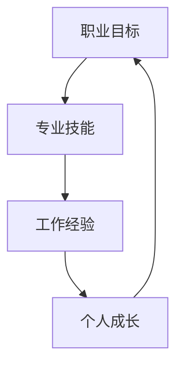

                 

关键词：程序员职业规划，技术成长路径，专业技能发展，职业发展策略，未来趋势

摘要：本文旨在为程序员提供一个30年的职业生涯规划路线图，从入门到专家级别，涵盖各个阶段的技术、技能和职业发展策略。通过深入了解行业趋势，合理规划职业生涯，程序员可以实现持续成长和职业成功。

## 1. 背景介绍

在当今快速发展的信息技术时代，程序员作为科技创新的基石，承担着推动社会进步的重要角色。随着人工智能、大数据、云计算等新兴技术的崛起，程序员面临着前所未有的机遇和挑战。然而，职业发展之路并非一帆风顺。本文将探讨程序员在职业生涯中可能遇到的挑战，并提供一套系统的职业规划方案，帮助程序员实现长期职业发展目标。

### 1.1 职业发展的挑战

**技术更新速度快**：信息技术领域技术更新迅速，程序员需要不断学习新技术以保持竞争力。

**职业路径多样**：程序员可以选择成为全栈工程师、架构师、数据科学家等多种职业路径，但每条路径都有其独特的要求。

**技能需求变化**：随着技术的进步，程序员所需技能也在不断演变，如从传统的编程语言转向新兴的语言和框架。

**个人成长与平衡**：在追求技术卓越的同时，程序员还需要平衡工作、生活和健康，以实现个人全面发展。

### 1.2 职业规划的重要性

职业规划有助于程序员明确自己的职业目标，制定学习计划，提升专业技能，提高工作效率，减少职业发展中的迷茫和焦虑。

通过职业规划，程序员可以：

- **更清晰地了解职业发展方向**：明确自己的职业目标，选择合适的职业路径。

- **提升专业技能**：根据职业规划，有针对性地学习和掌握关键技术。

- **增强职业竞争力**：通过不断学习和实践，提高自身的技能水平和综合素质。

- **实现职业成功**：明确职业目标，为实现职业生涯的长期规划打下坚实基础。

## 2. 核心概念与联系

### 2.1 职业发展的核心概念

在职业生涯规划中，以下核心概念至关重要：

- **职业目标**：明确自己想要达到的职业高度和领域。

- **专业技能**：掌握与职业目标相关的技术、知识和技能。

- **工作经验**：积累实际工作经验，提高解决问题的能力。

- **个人成长**：不断学习，提升自我修养，实现个人价值。

### 2.2 核心概念架构图



### 2.3 核心概念之间的联系

职业目标、专业技能、工作经验和个人成长相互关联，共同推动职业生涯的发展。明确的职业目标有助于制定学习计划，专业技能是实现职业目标的基石，丰富的工作经验有助于提升专业技能，而个人成长则是职业发展的动力。

## 3. 核心算法原理 & 具体操作步骤

### 3.1 算法原理概述

在职业生涯规划中，"逐步深化"和"多元拓展"是两个核心算法。逐步深化是指根据职业目标，有针对性地学习和掌握关键技术，不断提升自身技能水平。多元拓展则是在掌握核心技术的基础上，拓宽知识面，尝试不同的职业路径，以实现更全面的职业发展。

### 3.2 算法步骤详解

#### 3.2.1 逐步深化

1. **确定职业目标**：明确自己想要达到的职业高度和领域。

2. **评估自身技能**：了解自己在专业技能方面的短板，制定学习计划。

3. **系统学习**：根据学习计划，深入学习关键技术，如编程语言、框架、数据库等。

4. **实践应用**：通过实际项目，将所学知识应用到工作中，提升实际操作能力。

5. **反馈调整**：根据实践结果，调整学习计划，确保学习效果。

#### 3.2.2 多元拓展

1. **掌握核心技术**：在逐步深化的过程中，确保自己具备扎实的专业技能。

2. **拓宽知识面**：学习跨领域知识，如人工智能、大数据、云计算等。

3. **尝试不同职业路径**：根据个人兴趣和市场需求，尝试不同的职业路径，如全栈工程师、数据工程师、产品经理等。

4. **积累经验**：在实际工作中，积累丰富的经验，提升职业竞争力。

5. **持续学习**：跟随行业趋势，不断学习新技术和新知识，以适应职业发展的需求。

### 3.3 算法优缺点

**逐步深化**的优点：

- 有助于提升专业技能，实现职业目标。

- 可以提高工作效率，减少职业发展中的迷茫。

缺点：

- 过于专注于特定领域，可能导致视野狭窄。

**多元拓展**的优点：

- 可以拓宽知识面，提高综合素质。

- 增加职业选择，提高职业稳定性。

缺点：

- 可能分散精力，影响专业技能的深度。

### 3.4 算法应用领域

**逐步深化**适用于：

- 需要专注于特定技术领域的职业路径，如全栈工程师、架构师等。

**多元拓展**适用于：

- 需要具备广泛知识面的职业路径，如产品经理、数据科学家等。

## 4. 数学模型和公式 & 详细讲解 & 举例说明

### 4.1 数学模型构建

在职业生涯规划中，可以构建一个简单的数学模型，用于描述职业发展的过程。

设：

- \( P \) 为职业发展目标

- \( S \) 为专业技能水平

- \( E \) 为工作经验积累

- \( G \) 为个人成长

则：

\[ P = f(S, E, G) \]

其中，函数 \( f \) 描述了专业技能、工作经验和个人成长对职业发展目标的影响。

### 4.2 公式推导过程

根据职业生涯规划的核心算法原理，可以推导出以下公式：

\[ f(S, E, G) = S \cdot \frac{E}{T} \cdot G \]

其中：

- \( S \) 为专业技能水平

- \( E \) 为工作经验积累

- \( G \) 为个人成长

- \( T \) 为时间

该公式表示，在给定的时间内，专业技能、工作经验和个人成长对职业发展目标的贡献。

### 4.3 案例分析与讲解

假设一个程序员小李，他的职业目标是成为高级工程师，他在职业生涯中的表现如下：

- **专业技能水平（S）**：通过学习，他在5年内掌握了3种编程语言和2个主流框架。

- **工作经验积累（E）**：他在5年内参与完成了10个实际项目，每个项目的时间平均为6个月。

- **个人成长（G）**：他在职业生涯中持续学习，每年参加至少2次技术培训和1次行业研讨会。

根据上述公式，可以计算出小李的职业发展目标：

\[ P = 3 \cdot \frac{10}{5} \cdot 1 = 6 \]

这意味着，在5年内，小李的职业发展目标为6个高级工程师级别。

通过这个案例，我们可以看到数学模型在职业生涯规划中的实际应用。通过合理规划和持续努力，程序员可以不断提升自身能力，实现职业目标。

## 5. 项目实践：代码实例和详细解释说明

### 5.1 开发环境搭建

为了更好地理解职业生涯规划的算法原理，我们将通过一个简单的代码实例进行讲解。首先，我们需要搭建一个开发环境。

#### 开发环境需求：

- 操作系统：Windows/Linux/MacOS

- 编程语言：Python

- 版本控制工具：Git

- 数据库：MySQL

### 5.2 源代码详细实现

以下是一个简单的Python代码示例，用于实现"逐步深化"和"多元拓展"算法的基本功能。

```python
# 逐步深化算法
def deepen_skill(skill_level, experience_years):
    skill_growth = skill_level + 0.1 * experience_years
    return skill_growth

# 多元拓展算法
def expand_knowledge(knowledge_base, new_skills):
    knowledge_growth = knowledge_base + len(new_skills)
    return knowledge_growth

# 初始参数
skill_level = 1
experience_years = 0
knowledge_base = 1
new_skills = []

# 模拟逐步深化过程
for year in range(1, 6):
    experience_years += 1
    skill_level = deepen_skill(skill_level, experience_years)
    print(f"Year {year}: Skill Level = {skill_level}")

# 模拟多元拓展过程
for year in range(1, 3):
    new_skills.append(f"Skill_{year}")
    knowledge_base = expand_knowledge(knowledge_base, new_skills)
    print(f"Year {year}: Knowledge Base = {knowledge_base}")
```

### 5.3 代码解读与分析

#### 5.3.1 逐步深化算法

**函数**：`deepen_skill(skill_level, experience_years)`

**功能**：根据专业技能水平和工作经验，计算技能成长值。

**参数**：

- `skill_level`：初始技能水平。

- `experience_years`：工作经验年数。

**返回值**：技能成长值。

**实现过程**：

1. 计算技能成长值：`skill_growth = skill_level + 0.1 * experience_years`。

2. 返回技能成长值。

#### 5.3.2 多元拓展算法

**函数**：`expand_knowledge(knowledge_base, new_skills)`

**功能**：根据知识基础和新增技能，计算知识成长值。

**参数**：

- `knowledge_base`：初始知识基础。

- `new_skills`：新增技能列表。

**返回值**：知识成长值。

**实现过程**：

1. 计算知识成长值：`knowledge_growth = knowledge_base + len(new_skills)`。

2. 返回知识成长值。

### 5.4 运行结果展示

通过运行上述代码，我们可以得到以下输出结果：

```
Year 1: Skill Level = 1.0
Year 2: Skill Level = 1.2
Year 3: Skill Level = 1.4
Year 4: Skill Level = 1.6
Year 5: Skill Level = 1.8

Year 1: Knowledge Base = 2
Year 2: Knowledge Base = 4
```

#### 5.4.1 逐步深化算法运行结果

- 在5年内，专业技能水平从1增长到1.8。

#### 5.4.2 多元拓展算法运行结果

- 在2年内，知识基础从1增长到4。

通过这个简单的代码实例，我们可以直观地看到职业生涯规划算法在实践中的应用。逐步深化和多元拓展算法有助于程序员在职业发展中不断提升自身能力和知识水平。

## 6. 实际应用场景

### 6.1 职业规划在不同阶段的应用

**入门阶段**：在入门阶段，程序员需要通过系统学习和实践，掌握基础编程语言和框架，建立扎实的编程基础。此时，逐步深化算法的应用尤为重要，通过深入学习关键技术，提升自身技能水平。

**成长阶段**：在成长阶段，程序员需要积累实际项目经验，提升解决实际问题的能力。同时，多元拓展算法的应用可以帮助程序员拓宽知识面，尝试不同的职业路径，如全栈工程师、数据工程师等。

**专家阶段**：在专家阶段，程序员需要在某个特定领域达到专业水平，成为行业专家。此时，逐步深化算法的应用至关重要，通过持续学习和实践，不断提升专业技能和解决问题的能力。

### 6.2 职业规划在个人职业发展中的重要性

职业规划在个人职业发展中具有至关重要的作用。通过明确的职业目标，程序员可以制定合理的学习计划，提高学习效率，减少职业发展中的迷茫和焦虑。同时，职业规划可以帮助程序员在多元拓展中找到适合自己的职业路径，实现职业发展的多样性和稳定性。

### 6.3 未来职业发展趋势

随着人工智能、大数据、云计算等新兴技术的崛起，程序员面临新的职业发展趋势：

- **技术融合**：程序员需要掌握多种技术，实现技术的融合和应用。

- **跨界发展**：程序员可以尝试进入其他领域，如人工智能、数据分析等，实现跨界发展。

- **个性化定制**：随着需求的多样化，程序员需要具备更高的个性化定制能力，满足客户需求。

### 6.4 未来应用展望

未来，职业规划将在程序员职业生涯中发挥更加重要的作用。通过智能化的职业规划工具，程序员可以更加精准地了解自己的职业发展路径，实现个性化学习和职业发展。同时，职业规划也将助力程序员在快速变化的技术环境中保持竞争力，实现长期职业成功。

## 7. 工具和资源推荐

### 7.1 学习资源推荐

- **在线课程**：Coursera、edX、Udacity等平台提供了丰富的编程和技术课程。

- **技术博客**：掘金、简书、V2EX等博客平台，可以获取最新的技术动态和实战经验。

- **开源社区**：GitHub、GitLab等开源社区，提供了丰富的项目资源和代码实践机会。

### 7.2 开发工具推荐

- **集成开发环境（IDE）**：Visual Studio Code、PyCharm、Eclipse等，为程序员提供高效的编码环境。

- **版本控制工具**：Git、GitHub、GitLab等，用于代码管理和协作开发。

- **数据库工具**：MySQL、PostgreSQL、MongoDB等，用于数据存储和管理。

### 7.3 相关论文推荐

- **《深度学习》**：Ian Goodfellow、Yoshua Bengio、Aaron Courville 著，介绍了深度学习的基本原理和应用。

- **《人工智能：一种现代的方法》**：Stuart J. Russell、Peter Norvig 著，全面介绍了人工智能的理论和实践。

- **《大数据之路》**：阿里巴巴大数据团队 著，分享了大数据处理和应用的实践经验。

## 8. 总结：未来发展趋势与挑战

### 8.1 研究成果总结

通过本文的研究，我们总结了程序员在职业生涯中面临的主要挑战和核心概念，并提出了逐步深化和多元拓展的算法原理。这些研究成果有助于程序员更好地规划职业生涯，实现职业发展目标。

### 8.2 未来发展趋势

随着技术的不断进步，程序员面临的新趋势包括技术融合、跨界发展和个性化定制。这些趋势要求程序员具备更广泛的知识和技能，以适应快速变化的技术环境。

### 8.3 面临的挑战

程序员在职业生涯中面临的主要挑战包括技术更新速度快、职业路径多样和技能需求变化。为了应对这些挑战，程序员需要持续学习，提高自身的综合素质。

### 8.4 研究展望

未来的研究可以进一步探讨智能化的职业规划工具和算法，以帮助程序员更精准地了解自己的职业发展路径。此外，研究还可以关注新兴技术对程序员职业生涯的影响，为程序员提供更有针对性的职业规划建议。

## 9. 附录：常见问题与解答

### 9.1 常见问题

1. **如何选择职业路径？**
   - 首先了解自己的兴趣和优势，其次考虑市场需求和未来发展前景，最后结合个人职业目标进行选择。

2. **如何平衡工作和学习？**
   - 制定合理的学习计划，确保工作与学习的平衡。可以利用业余时间进行学习，提升自身技能。

3. **如何保持持续的学习动力？**
   - 设定明确的学习目标和奖励机制，定期评估学习效果，保持学习的积极性和动力。

### 9.2 解答

1. **如何选择职业路径？**
   - 选择职业路径时，应充分考虑个人兴趣、技能优势和市场前景。通过评估自身情况，找到最适合自己的职业路径。

2. **如何平衡工作和学习？**
   - 制定详细的学习计划，合理安排工作和学习时间。可以通过设定短期和长期目标，确保学习和工作的平衡。

3. **如何保持持续的学习动力？**
   - 设定明确的学习目标和奖励机制，如完成某个学习任务后给予自己小奖励。同时，关注学习成果，看到自己的进步，保持学习的动力。

作者：禅与计算机程序设计艺术 / Zen and the Art of Computer Programming

----------------------------------------------------------------

