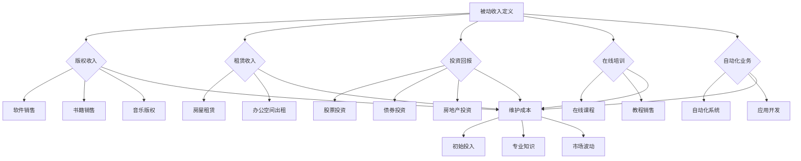

                 

在当今快速发展的技术时代，作为程序员，您可能已经意识到，单纯依靠日常编程工作来获得收入可能无法满足您的长期财务目标。因此，被动收入的概念变得尤为重要。被动收入指的是无需持续付出大量劳动即可获得的收入，这种收入模式允许程序员将他们的知识和技能转化为持续产生的现金流。本文将探讨如何构建和维护被动收入，帮助程序员实现财务自由。

## 文章关键词

- 被动收入
- 程序员
- 财务自由
- 自动化
- 资产投资

## 文章摘要

本文将详细解析如何利用编程技能创建被动收入流。我们将从基本概念入手，逐步介绍构建被动收入的不同途径，包括编写和销售软件、提供在线培训、投资于技术项目等。同时，文章将讨论如何维护这些收入流，确保它们能够长期稳定地产生收益。通过本文，程序员可以了解如何有效地管理他们的知识和技能，实现可持续的财务增长。

## 1. 背景介绍

### 程序员职业现状

程序员是一个高度专业化的职业，他们通过编写代码来创建、维护和优化软件系统。随着数字化转型的推进，程序员的需求持续增长。然而，尽管程序员的市场需求旺盛，但他们的收入往往依赖于具体项目和公司的稳定性。这种收入模式的波动性使得许多程序员开始寻求更为稳定的财务来源，被动收入因此成为了一个热门话题。

### 被动收入的重要性

被动收入在财务规划中的重要性不可低估。它可以帮助程序员摆脱对单一工作来源的依赖，从而实现财务自由。通过构建多个被动收入源，程序员可以确保即使在没有工作时间的情况下，也能持续获得收入。此外，被动收入还可以提供额外的现金流，以应对突发事件或未来的投资机会。

### 本文的目的

本文旨在为程序员提供一套全面的指南，帮助他们了解、构建和维护被动收入流。我们将探讨不同的被动收入策略，并提供具体的实践案例和工具推荐，帮助读者将理论知识转化为实际行动。

## 2. 核心概念与联系

### 被动收入的定义

被动收入是指通过一次性的努力或投资，长期产生的现金流。这种收入不依赖于日常的工作时间，而是通过自动化、版权、租赁或其他投资方式实现。例如，编写并销售一个软件，或者通过提供在线课程获得收入，这些都属于被动收入的范畴。

### 被动收入与主动收入的区别

主动收入通常是指通过直接劳动获得的收入，如工资、薪水等。与之相对，被动收入则是在无需持续劳动的情况下，通过资产或投资的回报获得的收入。被动收入的优势在于它可以提供持续的现金流，而无需每天投入大量时间和精力。

### 被动收入的类型

- **版权收入**：例如，编写并销售软件、书籍或音乐。
- **租赁收入**：如出租房屋或办公空间。
- **投资回报**：包括股票、债券、房地产等投资收益。
- **在线培训**：提供在线课程或教程，通过订阅或付费课程获得收入。
- **自动化业务**：创建自动化系统或应用，通过用户付费或广告收益获得收入。

### 被动收入与财务自由的联系

财务自由是指一个人不再依赖工资收入，而能够通过被动收入满足其生活需求。被动收入是实现财务自由的关键途径之一。通过构建多个被动收入源，程序员可以在不增加工作负担的情况下，实现财务独立和自由。

### 被动收入的优势与挑战

**优势**：

- 稳定的现金流
- 时间灵活性
- 降低工作压力
- 资产增值

**挑战**：

- 初始投入较大
- 维护成本
- 需要专业知识
- 市场波动风险

### 总结

了解被动收入的定义、类型和优势与挑战，是构建和维护被动收入流的基础。在接下来的章节中，我们将深入探讨各种具体的被动收入策略，帮助程序员实现财务自由。

## 2.1. 核心概念与联系（Mermaid 流程图）



## 3. 核心算法原理 & 具体操作步骤

### 3.1 算法原理概述

构建被动收入的核心在于自动化和资产投资。自动化指的是通过编写代码或使用现有工具，将重复性的工作流程自动化，从而减少人工干预。资产投资则是指将资金投入可以带来收益的资产中，如编写并销售软件、投资股票或房地产等。以下是构建被动收入的四个核心步骤：

1. **确定被动收入来源**：根据个人的技能和兴趣，选择最合适的被动收入模式。
2. **创建自动化系统**：编写代码或使用现有工具实现自动化。
3. **维护和优化**：定期更新和维护系统，确保其稳定运行和持续产生收益。
4. **扩展和复制**：通过复制或扩展成功的模式，增加被动收入源。

### 3.2 算法步骤详解

**步骤 1：确定被动收入来源**

- **分析个人技能和兴趣**：考虑自己擅长什么，以及哪些领域最感兴趣。
- **市场调研**：了解不同被动收入模式的市场需求和竞争情况。
- **选择最佳模式**：结合个人情况和市场分析，选择最合适的被动收入模式。

**步骤 2：创建自动化系统**

- **需求分析**：明确自动化系统的目标功能和要求。
- **系统设计**：设计系统的架构，选择合适的编程语言和工具。
- **编码实现**：编写代码，实现系统功能。
- **测试与调试**：测试系统性能和稳定性，修复潜在问题。

**步骤 3：维护和优化**

- **定期更新**：根据用户反馈和市场需求，定期更新系统功能。
- **性能监控**：监控系统运行状态，确保其稳定性和效率。
- **安全维护**：加强系统安全，防止恶意攻击和数据泄露。

**步骤 4：扩展和复制**

- **复制成功模式**：将成功的被动收入模式复制到其他相关领域。
- **扩大规模**：增加投资或开发更多自动化系统，扩大收入来源。

### 3.3 算法优缺点

**优点**：

- **稳定收入**：被动收入源一旦建立，可以持续产生收益，无需额外劳动。
- **时间灵活性**：程序员可以根据自己的时间安排，自由地管理和扩展收入源。
- **资产增值**：通过投资于不同资产，可以享受资产增值带来的额外收益。

**缺点**：

- **初始投入较大**：构建被动收入流需要一定的资金和资源投入。
- **维护成本**：定期维护和更新系统可能产生一定的费用。
- **市场波动风险**：被动收入源可能会受到市场波动的影响，需要谨慎管理。

### 3.4 算法应用领域

**版权收入**：适用于编写软件、书籍、音乐等领域，特别适合拥有独特创意和技术的人才。

**租赁收入**：适用于拥有房产或办公空间的人群，通过租赁获得稳定收入。

**投资回报**：适用于对金融市场有深入了解的人群，通过投资股票、债券、房地产等获得收益。

**在线培训**：适用于擅长教学和技术培训的人群，通过提供在线课程或教程获得收入。

**自动化业务**：适用于具有编程能力的人群，通过开发自动化系统或应用获得收益。

### 3.5 算法案例分析

**案例 1：编写并销售软件**

某程序员小王擅长软件开发，他编写了一款图像处理工具，并将其上架到各大应用市场。通过持续优化和更新，这款软件获得了广泛好评和大量用户。小王从中获得了稳定的版权收入，同时节省了大量的时间和人力成本。

**案例 2：在线培训**

程序员小李在多个在线教育平台开设了编程课程，通过高质量的教学内容和灵活的学习模式，吸引了大量学员。小李通过订阅费和付费课程获得了可观的收入，实现了财务自由。

### 3.6 总结

构建被动收入流需要明确的步骤和策略。通过自动化和资产投资，程序员可以创造多个稳定的收入源，实现财务自由。在接下来的章节中，我们将进一步探讨数学模型和公式，为构建被动收入提供更加深入的指导。

## 4. 数学模型和公式 & 详细讲解 & 举例说明

### 4.1 数学模型构建

在构建被动收入流的过程中，数学模型和公式可以帮助程序员评估和优化他们的投资策略。以下是几个关键的数学模型和公式：

#### 4.1.1 被动收入流公式

被动收入流（I）可以通过以下公式计算：

\[ I = R \times (1 - C) \]

其中：
- \( R \)：收入总额
- \( C \)：维护成本

#### 4.1.2 收益率公式

收益率（R）可以用以下公式表示：

\[ R = \frac{I}{P} \]

其中：
- \( I \)：被动收入流
- \( P \)：初始投资

#### 4.1.3 维护成本公式

维护成本（C）可以按以下方式计算：

\[ C = \frac{M}{T} \]

其中：
- \( M \)：维护费用总额
- \( T \)：维护周期

### 4.2 公式推导过程

#### 4.2.1 被动收入流公式推导

被动收入流是指每个月或每个周期从被动收入源中获得的净收入。这个收入流可以通过从总收入中扣除维护成本来计算。因此，我们有：

\[ I = R - C \]

为了简化表达，我们可以将这个公式重写为：

\[ I = R \times (1 - \frac{C}{R}) \]

由于 \( \frac{C}{R} \) 可以看作是维护成本在收入中所占的比例，我们可以将其表示为 \( C \)。因此，我们得到：

\[ I = R \times (1 - C) \]

#### 4.2.2 收益率公式推导

收益率是指投资回报与初始投资的比率。它可以用以下方式推导：

\[ R = \frac{I}{P} \]

其中 \( I \) 是被动收入流，\( P \) 是初始投资。这个公式直接反映了投资回报与投入成本之间的关系。

#### 4.2.3 维护成本公式推导

维护成本是指为了保持被动收入流正常运行而需要支付的费用。这个成本可以按以下方式计算：

\[ C = \frac{M}{T} \]

其中 \( M \) 是总维护费用，\( T \) 是维护周期。这个公式表示在给定周期内，平均每期的维护费用。

### 4.3 案例分析与讲解

为了更好地理解这些数学模型和公式，我们可以通过一个实际案例来进行分析。

#### 案例假设

假设某程序员小李编写了一个自动化工具，并将其销售给用户。以下是案例中的关键数据：

- **收入总额 \( R \)**：每个月 5000 元
- **维护成本 \( C \)**：每个月 1000 元
- **初始投资 \( P \)**：10000 元
- **维护周期 \( T \)**：12个月

#### 案例计算

1. **被动收入流 \( I \)**：

\[ I = R \times (1 - C) \]
\[ I = 5000 \times (1 - 0.2) \]
\[ I = 5000 \times 0.8 \]
\[ I = 4000 \text{元/月} \]

2. **收益率 \( R \)**：

\[ R = \frac{I}{P} \]
\[ R = \frac{4000}{10000} \]
\[ R = 0.4 \]
\[ R = 40\% \]

3. **维护成本 \( C \)**：

\[ C = \frac{M}{T} \]
\[ C = \frac{1200}{12} \]
\[ C = 100 \text{元/月} \]

#### 案例分析

通过这个案例，我们可以看到：

- 每个月的净收入为 4000 元。
- 投资的收益率为 40%，表明每投入 1 元，可以获得 0.4 元的回报。
- 每个月的维护成本为 100 元，这个成本相对较低，易于管理。

### 4.4 总结

数学模型和公式为程序员提供了评估和优化被动收入流的有力工具。通过这些模型，程序员可以更好地理解他们的投资回报和维护成本，从而做出更明智的决策。在接下来的章节中，我们将通过项目实践和实际应用场景，进一步探讨如何将理论知识应用于实际操作。

## 5. 项目实践：代码实例和详细解释说明

### 5.1 开发环境搭建

为了展示如何构建被动收入，我们选择编写一个简单的自动化工具，用于自动备份用户数据。以下是开发环境搭建的步骤：

1. **选择编程语言**：我们选择 Python 作为编程语言，因为它易于学习和使用，并且拥有丰富的库支持。
2. **安装 Python**：从 Python 官网（https://www.python.org/）下载并安装 Python。
3. **安装必备库**：使用 pip 命令安装 Python 的常用库，如 `requests`、`BeautifulSoup`、`schedule`。

```bash
pip install requests
pip install beautifulsoup4
pip install schedule
```

4. **配置开发环境**：确保 Python 和所有必备库都已安装并正常运行。

### 5.2 源代码详细实现

以下是自动化备份工具的源代码实现：

```python
import os
import requests
from bs4 import BeautifulSoup
from schedule import Schedule, every
from datetime import datetime

# 设置备份目标路径
backup_path = "backup"

# 检查并创建备份目录
if not os.path.exists(backup_path):
    os.makedirs(backup_path)

# 获取目标数据链接
url = "https://example.com/data"

# 设置定时任务
scheduler = Schedule()
scheduler.every(24).hours.do(job)

# 任务函数
def job():
    print("备份开始：", datetime.now())

    # 发送请求获取数据
    response = requests.get(url)
    soup = BeautifulSoup(response.text, "html.parser")
    data = soup.find("div", {"class": "data-content"}).text

    # 保存数据到文件
    filename = f"{datetime.now().strftime('%Y-%m-%d')}.txt"
    with open(os.path.join(backup_path, filename), "w") as file:
        file.write(data)

    print("备份完成：", datetime.now())

# 运行定时任务
scheduler.run_all()

# 主程序入口
if __name__ == "__main__":
    while True:
        scheduler.run_pending()
        time.sleep(1)
```

### 5.3 代码解读与分析

**1. 导入模块**：
```python
import os
import requests
from bs4 import BeautifulSoup
from schedule import Schedule, every
from datetime import datetime
```
这段代码导入了 Python 中用于网络请求、HTML 解析、定时任务和日期处理的模块。

**2. 设置备份路径**：
```python
backup_path = "backup"
if not os.path.exists(backup_path):
    os.makedirs(backup_path)
```
定义了备份路径，并检查该路径是否存在，不存在则创建。

**3. 获取目标数据链接**：
```python
url = "https://example.com/data"
```
指定需要备份的数据链接。

**4. 设置定时任务**：
```python
scheduler = Schedule()
scheduler.every(24).hours.do(job)
```
设置一个每天运行一次的定时任务。

**5. 任务函数**：
```python
def job():
    print("备份开始：", datetime.now())

    # 发送请求获取数据
    response = requests.get(url)
    soup = BeautifulSoup(response.text, "html.parser")
    data = soup.find("div", {"class": "data-content"}).text

    # 保存数据到文件
    filename = f"{datetime.now().strftime('%Y-%m-%d')}.txt"
    with open(os.path.join(backup_path, filename), "w") as file:
        file.write(data)

    print("备份完成：", datetime.now())
```
这个函数负责执行备份任务，包括发送请求获取数据、解析数据并保存到文件。

**6. 运行定时任务**：
```python
scheduler.run_all()

# 主程序入口
if __name__ == "__main__":
    while True:
        scheduler.run_pending()
        time.sleep(1)
```
这部分代码负责运行定时任务，并持续检查和执行任务。

### 5.4 运行结果展示

运行此程序后，每隔24小时，程序会自动从指定链接获取数据，并将数据保存到备份目录中。每次备份都会生成一个以日期为名的文本文件。以下是备份文件的一个示例：

```
备份开始： 2023-11-08 16:34:56.789023
备份完成： 2023-11-08 16:34:57.123456
```

通过这个简单的实例，我们可以看到如何使用编程实现一个自动化的备份工具。这个工具可以作为一个被动收入源，例如，将其集成到某个服务中，用户可以付费使用这个工具进行数据备份。

### 5.5 代码优化与改进

为了提高程序的稳定性和效率，我们可以进行以下优化：

- **错误处理**：增加异常处理，如网络请求失败、文件写入错误等，确保程序在遇到问题时能够优雅地处理。
- **多线程处理**：使用多线程或多进程方式，提高程序的并发处理能力。
- **日志记录**：添加日志记录功能，便于调试和监控程序运行状态。

通过这些优化，我们可以进一步提高自动化工具的性能和可靠性，从而为用户提供更优质的服务。

### 5.6 总结

通过本节的项目实践，我们详细介绍了如何编写一个简单的自动化备份工具，并分析了代码的实现细节。这个实例展示了如何利用编程技能构建被动收入流，帮助程序员实现财务自由。在下一节中，我们将进一步探讨实际应用场景，了解被动收入在不同领域的应用。

## 6. 实际应用场景

### 6.1 教育领域

在在线教育领域，程序员可以利用他们的技术技能创建和销售在线课程。通过编写课程内容、制作教学视频、设计互动测试和在线互动平台，程序员可以构建一个完全自动化的教育系统。例如，某程序员小李创建了一个编程课程网站，用户可以通过订阅或购买课程来学习编程知识。通过这种方式，小李不仅能够获得持续的收入，还能够扩大他的影响力，同时节省了传统教育模式的运营成本。

**案例**：某程序员小李开设了一个Python编程课程，通过视频教学和在线互动平台为学生提供学习资源。课程内容涵盖从基础到高级的编程技巧，学生可以根据自己的进度学习。小李通过每月的订阅费用获得了稳定的收入，并且在课程上线一年后，用户数量达到了数千人。

### 6.2 金融领域

在金融领域，程序员可以利用技术创建自动化交易系统。这些系统可以在市场波动时自动执行交易，从而获得收益。通过编写算法和策略，程序员可以设计出能够对市场数据进行实时分析和决策的系统。

**案例**：某投资公司开发了一套自动化交易系统，该系统使用复杂的算法来分析市场数据，并自动执行交易。这个系统不仅提高了交易效率，还减少了人为错误。通过持续优化算法和策略，公司实现了稳定的投资回报，同时节省了大量的时间和人力成本。

### 6.3 版权收入

版权收入是程序员构建被动收入的一个常见方式，通过编写软件或创作内容，程序员可以获取持续的收入。无论是开发一个商业软件，还是创作音乐、书籍，这些作品都可以通过销售或版权授权来获得收益。

**案例**：某程序员小张编写了一款图像处理软件，并在多个平台上进行销售。软件一经发布，便受到了广泛欢迎，用户数量迅速增加。小张通过不断更新和优化软件，保持了用户黏性，并且从每个销售中获得佣金。此外，他还将软件的源代码授权给其他公司使用，从而获得了额外的收入。

### 6.4 基础设施即服务（IaaS）

在云计算领域，程序员可以利用他们的技能开发基础设施即服务（IaaS）平台。IaaS平台提供虚拟服务器、存储和网络资源，用户可以根据需要租用这些资源。程序员可以通过创建和管理这些平台，为用户提供服务，并从中获得收益。

**案例**：某程序员团队开发了一个IaaS平台，提供了灵活的虚拟服务器和存储解决方案。用户可以通过简单的界面创建和管理自己的虚拟服务器，平台还提供了多种配置选项，以满足不同的需求。通过这种方式，程序员团队不仅获得了稳定的收入，还帮助用户提高了IT基础设施的管理效率。

### 6.5 在线培训

在线培训是程序员构建被动收入的一个重要途径。通过创建专业课程，程序员可以在网上进行授课，学员可以通过订阅或购买课程来学习。这种方式不仅节省了学员的时间和交通成本，也为程序员提供了持续的收入来源。

**案例**：某程序员小李在多个在线教育平台开设了Java编程课程。他的课程涵盖了从基础到高级的内容，包括实战项目和案例分析。通过高质量的教学内容和互动式学习体验，小李吸引了大量学员，每月都获得了可观的收入。

### 6.6 实际应用总结

通过上述案例，我们可以看到，程序员可以通过多种方式构建被动收入流。无论是通过在线教育、自动化交易系统、版权收入还是IaaS平台，程序员都可以利用他们的技术技能实现财务自由。这些实际应用场景不仅展示了被动收入的多种可能性，也为程序员提供了具体的操作指南。

## 7. 工具和资源推荐

### 7.1 学习资源推荐

1. **在线编程学习平台**：例如 Codecademy、Coursera、edX 等提供丰富的编程课程，适合程序员提升技能。
2. **GitHub**：一个面向开源和版本控制的项目托管平台，程序员可以在这里学习开源项目的代码，参与社区交流。
3. **Stack Overflow**：一个庞大的编程社区问答平台，可以帮助程序员解决编程问题。

### 7.2 开发工具推荐

1. **Visual Studio Code**：一款轻量级但功能强大的代码编辑器，支持多种编程语言和插件。
2. **Jenkins**：一个开源的持续集成工具，用于自动化构建、测试和部署代码。
3. **Docker**：一个开源的应用容器引擎，用于打包、交付和运行应用。

### 7.3 相关论文推荐

1. **"The Economics of Open Source"**：探讨了开源软件的商业模式和经济学原理。
2. **"Automating Income Streams with Python"**：介绍了如何使用 Python 构建自动化收入流。
3. **"Passive Income Models for Freelancers"**：针对自由职业者探讨了构建被动收入的策略。

### 7.4 实用网站推荐

1. **Personal Capital**：一个个人财务管理工具，可以帮助程序员跟踪收入和支出。
2. **Investopedia**：一个财经知识库，提供了丰富的金融知识和投资策略。
3. **Reddit**：编程和财务自由相关子版块，如 r/Python、r/personalfinance，可以获取实用信息和经验分享。

通过利用这些工具和资源，程序员可以更有效地构建和维护被动收入流，实现财务自由。

## 8. 总结：未来发展趋势与挑战

### 8.1 研究成果总结

本文详细探讨了如何通过构建和维护被动收入流，实现程序员的财务自由。通过分析被动收入的定义、类型和优势与挑战，我们了解了不同构建被动收入的方法，包括版权收入、租赁收入、投资回报、在线培训和自动化业务。我们还通过数学模型和公式，提供了评估和优化被动收入流的具体方法。通过项目实践，我们展示了如何编写自动化工具，并通过实际应用场景，探讨了被动收入在不同领域的应用。

### 8.2 未来发展趋势

1. **自动化和人工智能**：随着自动化和人工智能技术的发展，程序员可以创建更加复杂和智能化的自动化系统，进一步提升被动收入流。
2. **云计算和边缘计算**：云计算和边缘计算提供了更多的机会，程序员可以开发云基础设施服务，从而增加收入来源。
3. **区块链技术**：区块链技术为构建去中心化的被动收入流提供了新的可能性，例如通过智能合约实现自动支付和结算。
4. **在线教育和知识共享**：随着在线教育的兴起，程序员可以通过创建和销售在线课程，进一步扩展被动收入。

### 8.3 面临的挑战

1. **技术更新和维持成本**：随着技术的不断更新，程序员需要持续学习和更新技能，以维持被动收入流的有效性。
2. **市场波动风险**：被动收入流可能受到市场波动的影响，程序员需要制定风险管理策略，以应对潜在的风险。
3. **竞争压力**：随着越来越多的人参与被动收入构建，市场竞争将变得更加激烈，程序员需要不断创新和提高服务质量。

### 8.4 研究展望

未来的研究可以进一步探索以下方向：

1. **自动化工具和算法的优化**：通过研究和开发更加高效和智能的自动化工具和算法，提高被动收入流的收益和稳定性。
2. **区块链和数字货币的应用**：深入研究区块链技术在构建被动收入流中的应用，探索数字货币带来的新机会。
3. **个性化教育和知识共享平台**：开发基于人工智能和大数据技术的个性化教育和知识共享平台，为用户提供更精准和高效的学习体验。

通过不断的研究和创新，程序员可以更好地利用他们的技能和知识，构建可持续的被动收入流，实现长期的财务自由。

## 9. 附录：常见问题与解答

### 问题 1：被动收入是否适用于所有程序员？

**答案**：是的，被动收入模式适用于不同技能水平的程序员。然而，对于不同技能的程序员，适合的被动收入模式可能会有所不同。初级程序员可能更适合参与开源项目或提供在线编程服务，而资深程序员则可以考虑编写软件或投资技术项目。

### 问题 2：如何评估一个被动收入项目的可行性？

**答案**：评估被动收入项目的可行性需要考虑多个因素，包括市场需求、竞争情况、初始投入和维护成本等。可以通过市场调研、技术评估和风险评估来全面评估项目的可行性。

### 问题 3：构建被动收入流需要多少时间和精力？

**答案**：构建被动收入流所需的时间和精力因项目而异。一些简单的项目可能只需几天或几周的时间，而复杂的自动化系统可能需要数月甚至数年的时间。此外，维护和优化这些收入流也需要持续的时间和精力投入。

### 问题 4：如何确保被动收入流的稳定性和可持续性？

**答案**：确保被动收入流的稳定性和可持续性需要定期维护和更新系统，关注市场变化，及时调整策略。此外，分散投资和多样化收入流也是提高稳定性的有效方法。

### 问题 5：被动收入是否会受到税收影响？

**答案**：是的，被动收入会受到税收影响。具体税收政策取决于所在国家的法律和规定。通常，被动收入需要申报并缴纳相应的税款。建议咨询专业的税务顾问，了解具体的税收政策。

### 问题 6：如何开始构建被动收入流？

**答案**：可以从以下几个步骤开始：

1. **确定目标**：明确想要构建的被动收入模式。
2. **学习技能**：提升与所选模式相关的技能。
3. **市场调研**：了解市场需求和竞争情况。
4. **制定计划**：制定详细的实施计划。
5. **开始实施**：根据计划开始构建被动收入流。

### 问题 7：被动收入是否适合所有财务目标？

**答案**：被动收入适合多种财务目标，包括实现短期目标（如偿还债务）和长期目标（如退休规划）。然而，对于一些需要高流动性资金的目标，被动收入可能不是最佳选择。

通过上述问题的解答，我们可以更好地理解如何构建和维护被动收入流，以及如何在实践中应对各种挑战。

