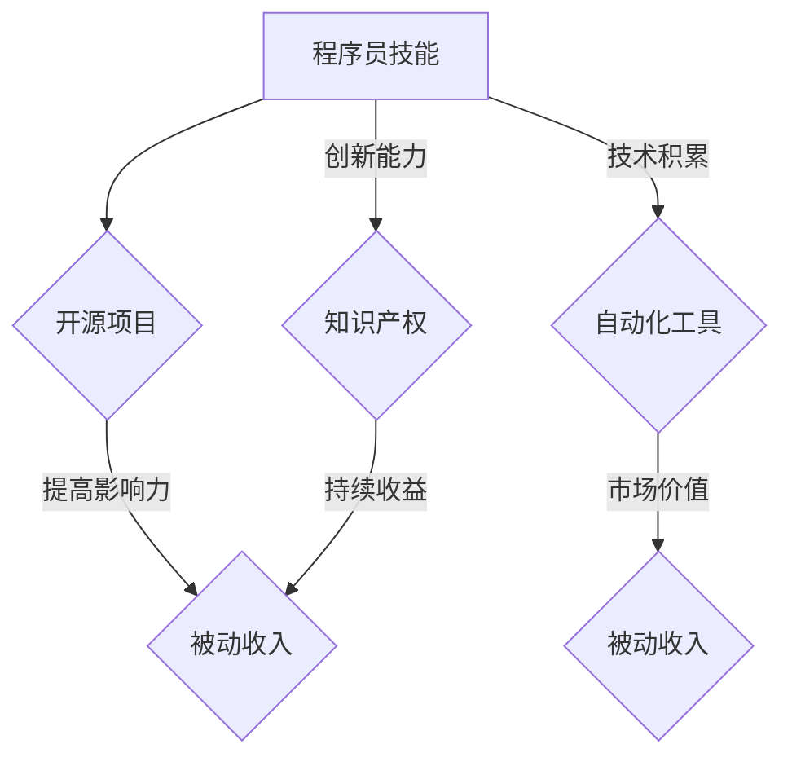

                 

关键词：被动收入、程序员的技能、开源项目、代码托管平台、自动化工具、知识产权、市场策略、收益模型

> 摘要：本文旨在探讨程序员如何通过构建和维护开源项目、开发自动化工具、保护知识产权和实施有效的市场策略，实现被动收入的途径。文章将详细分析这些策略的原理、操作步骤及其在实践中的应用，并展望未来的发展趋势。

## 1. 背景介绍

在信息技术迅猛发展的今天，程序员作为技术领域的中坚力量，其职业前景广阔，收入丰厚。然而，如何让收入不仅仅依赖于个人的时间与精力，而是能够在不增加额外工作量的情况下持续产生，这是一个值得探讨的话题。被动收入，作为一种投资或工作成果在非持续努力下产生的收益，成为了许多程序员的追求目标。

被动收入的实现方式多种多样，对于程序员而言，利用自身的技术特长和编程技能，通过开源项目、自动化工具和知识产权等途径，实现收益的自动化和规模化，是一条可行的路径。本文将深入探讨这些途径的构建与维护方法，帮助程序员实现被动收入的目标。

## 2. 核心概念与联系

### 2.1. 被动收入的定义与特点

被动收入（Passive Income）是指在不需持续投入大量时间和精力的情况下，通过一定的初始努力，即可持续获得收益的经济活动。其特点包括：

- **持续性**：一旦被动收入来源建立，它可以持续产生收益，无需额外的劳动投入。
- **规模性**：通过一定的策略，被动收入的规模可以不断扩大，产生显著的财务收益。
- **独立性**：被动收入使个体能够实现财务自由，摆脱对日常工作的依赖。

### 2.2. 程序员与被动收入

程序员作为具备技术特长和编程技能的人群，其优势在于能够利用技术实现被动收入的多种途径。程序员的优势在于：

- **技术积累**：通过多年的编程实践，程序员积累了丰富的技术知识和经验。
- **创新能力**：程序员具有不断学习和创新的能力，能够开发出具有市场价值的技术产品。
- **时间灵活性**：程序员可以根据个人时间安排，灵活地进行技术研究和开发。

### 2.3. 开源项目、自动化工具与知识产权

开源项目（Open Source Projects）：程序员通过开源项目，将自己的代码贡献给社区，从而获得关注和认可。开源项目不仅可以提升个人的技术影响力，还可以通过捐赠、赞助等形式获得被动收入。

自动化工具（Automation Tools）：程序员可以开发自动化工具，如自动化测试框架、构建工具等，这些工具在市场上具有较高的需求，可以通过销售、订阅等方式获得被动收入。

知识产权（Intellectual Property）：程序员通过保护自己的技术成果，如专利、版权等，可以在未来持续获得收益。知识产权保护是程序员实现被动收入的重要保障。

### 2.4. Mermaid 流程图



## 3. 核心算法原理 & 具体操作步骤

### 3.1 算法原理概述

程序员的被动收入实现，主要依赖于以下核心算法原理：

1. **开源项目：** 通过构建有价值的开源项目，吸引社区的关注，形成粉丝效应，从而通过捐赠、赞助等方式获得收入。
2. **自动化工具：** 开发实用的自动化工具，解决特定问题，通过销售、订阅等方式实现收入。
3. **知识产权：** 通过申请专利、版权等方式保护自己的技术成果，获得长期收益。

### 3.2 算法步骤详解

#### 3.2.1 开源项目构建

1. **确定项目主题**：根据自身技术特长和市场需求，选择具有潜力的项目主题。
2. **编写高质量代码**：确保代码可读性、可维护性和高效性。
3. **持续更新与维护**：定期更新项目，修复bug，增加新功能。
4. **推广与宣传**：通过社交媒体、技术社区等渠道，宣传项目，吸引关注。

#### 3.2.2 自动化工具开发

1. **需求分析**：了解目标用户的需求，确定工具的功能和特点。
2. **开发工具选择**：选择合适的编程语言和开发工具。
3. **功能实现**：按照需求分析，实现工具的核心功能。
4. **测试与优化**：对工具进行全面的测试，确保稳定性和可靠性。

#### 3.2.3 知识产权保护

1. **专利申请**：根据技术特点，撰写专利申请文件，提交申请。
2. **版权登记**：对自己的原创代码进行版权登记，保护自己的知识产权。
3. **合同签订**：与潜在合作伙伴签订合同，明确收益分配和知识产权归属。

### 3.3 算法优缺点

#### 优点：

- **收入稳定**：一旦被动收入来源建立，可以持续产生收益。
- **无需额外劳动**：被动收入实现后，可以大幅减少工作时间。
- **提升个人影响力**：通过开源项目和自动化工具，可以提升个人的技术声誉。

#### 缺点：

- **初期投入大**：构建开源项目、自动化工具和知识产权需要一定的时间和精力投入。
- **市场风险**：技术市场变化快，需要不断调整策略以应对市场变化。

### 3.4 算法应用领域

- **开源项目**：广泛应用于软件开发、数据分析、人工智能等领域。
- **自动化工具**：广泛应用于测试、构建、运维等领域。
- **知识产权**：广泛应用于技术创新、企业竞争等领域。

## 4. 数学模型和公式 & 详细讲解 & 举例说明

### 4.1 数学模型构建

#### 4.1.1 开源项目收益模型

设 \( R \) 为开源项目在一定时间 \( T \) 内的总收入，\( C \) 为项目的初始开发成本，\( D \) 为项目维护成本，\( S \) 为项目在市场上的吸引力，\( P \) 为每个捐赠者的捐赠额度，则开源项目的收益模型可以表示为：

\[ R = (S \times T) - C - D \]

#### 4.1.2 自动化工具收益模型

设 \( R \) 为自动化工具在一定时间 \( T \) 内的总收入，\( C \) 为工具的初始开发成本，\( M \) 为工具的维护成本，\( U \) 为每个用户的订阅费用，则自动化工具的收益模型可以表示为：

\[ R = (U \times T) - C - M \]

#### 4.1.3 知识产权收益模型

设 \( R \) 为知识产权在一定时间 \( T \) 内的总收入，\( P \) 为每个合作伙伴的专利授权费用，则知识产权的收益模型可以表示为：

\[ R = P \times T \]

### 4.2 公式推导过程

#### 4.2.1 开源项目收益模型推导

开源项目的收入主要来源于捐赠、赞助等。设每个捐赠者的捐赠额度为 \( P \)，项目在市场上的吸引力为 \( S \)，则项目在一定时间 \( T \) 内的总捐赠额为 \( S \times T \)。初始开发成本 \( C \) 和维护成本 \( D \) 为固定成本，因此开源项目的总收益为：

\[ R = (S \times T) - C - D \]

#### 4.2.2 自动化工具收益模型推导

自动化工具的收入主要来源于用户的订阅费用。设每个用户的订阅费用为 \( U \)，工具在市场上的需求量为 \( U \times T \)，初始开发成本 \( C \) 和维护成本 \( M \) 为固定成本，因此自动化工具的总收益为：

\[ R = (U \times T) - C - M \]

#### 4.2.3 知识产权收益模型推导

知识产权的收入主要来源于合作伙伴的专利授权费用。设每个合作伙伴的专利授权费用为 \( P \)，在一定时间 \( T \) 内的合作伙伴数量为 \( P \times T \)，因此知识产权的总收益为：

\[ R = P \times T \]

### 4.3 案例分析与讲解

#### 4.3.1 开源项目案例

假设某程序员开发了一个流行的开源项目，项目吸引了大量捐赠者。根据数据，每个捐赠者的平均捐赠额度为 \( 100 \) 美元，项目在市场上的吸引力为 \( 500 \) 人/月。项目初始开发成本为 \( 5000 \) 美元，每月维护成本为 \( 1000 \) 美元。我们可以计算该项目在一定时间 \( T \) 内的总收入：

\[ R = (500 \times T) - 5000 - 1000 \times T \]
\[ R = 500 \times T - 6000 \]

#### 4.3.2 自动化工具案例

假设某程序员开发了一个流行的自动化工具，每个用户的订阅费用为 \( 20 \) 美元/月。工具在市场上的需求量为 \( 1000 \) 人/月。工具的初始开发成本为 \( 10000 \) 美元，每月维护成本为 \( 500 \) 美元。我们可以计算该工具在一定时间 \( T \) 内的总收入：

\[ R = (20 \times 1000 \times T) - 10000 - 500 \times T \]
\[ R = 19500 \times T - 10000 \]

#### 4.3.3 知识产权案例

假设某程序员申请了一项具有广泛应用的专利，每个合作伙伴的专利授权费用为 \( 10000 \) 美元。在一定时间 \( T \) 内，合作伙伴数量为 \( 50 \) 家。我们可以计算该专利在一定时间 \( T \) 内的总收入：

\[ R = 10000 \times T \]
\[ R = 500000 \]

## 5. 项目实践：代码实例和详细解释说明

### 5.1 开发环境搭建

为了实现被动收入，我们需要搭建一个合适的技术环境。以下是一个基本的开发环境搭建指南：

#### 5.1.1 开源项目开发环境

- **编程语言**：选择流行的编程语言，如 Python、Java 等。
- **代码托管平台**：选择 GitHub、GitLab 等代码托管平台。
- **版本控制**：使用 Git 进行版本控制。
- **文档工具**：使用 Sphinx、Doxygen 等工具生成文档。

#### 5.1.2 自动化工具开发环境

- **编程语言**：选择适合自动化工具的编程语言，如 Python、Shell 等。
- **开发框架**：选择合适的开发框架，如 Django、Flask 等。
- **测试工具**：使用 pytest、Jenkins 等工具进行自动化测试。

#### 5.1.3 知识产权保护环境

- **专利申请工具**：使用专利申请工具，如专利搜索引擎、文本编辑器等。
- **版权登记工具**：使用版权登记网站或版权登记机构。

### 5.2 源代码详细实现

#### 5.2.1 开源项目代码实现

以下是一个简单的 Python 开源项目示例：

```python
# my_project.py

def calculate_area(radius):
    return 3.14 * radius * radius

if __name__ == "__main__":
    radius = float(input("请输入圆的半径："))
    area = calculate_area(radius)
    print(f"圆的面积是：{area}")
```

#### 5.2.2 自动化工具代码实现

以下是一个简单的 Python 自动化工具示例：

```python
# my_automation.py

import os
import subprocess

def run_tests():
    subprocess.run(["pytest", "test_*.py"])

if __name__ == "__main__":
    run_tests()
```

#### 5.2.3 知识产权代码实现

以下是一个简单的 Python 代码片段，用于生成专利申请文档：

```python
# patent_application.py

def generate_documentation(title, description):
    document = f"""
    # {title}

    {description}

    ---
    """

    with open("patent_application.md", "w") as f:
        f.write(document)

if __name__ == "__main__":
    title = "一种自动化的代码测试方法"
    description = "本专利描述了一种自动化的代码测试方法，该方法能够提高代码测试的效率和准确性。"
    generate_documentation(title, description)
```

### 5.3 代码解读与分析

#### 5.3.1 开源项目代码解读

上述开源项目代码实现了一个简单的功能：计算圆的面积。代码结构简单，易于理解和维护。通过代码注释和文档，可以方便其他开发者了解和使用该项目。

#### 5.3.2 自动化工具代码解读

自动化工具代码实现了一个简单的测试运行功能。通过调用 pytest 工具，可以自动化执行测试用例，提高开发效率。代码结构清晰，便于后续功能的扩展和测试优化。

#### 5.3.3 知识产权代码解读

知识产权代码实现了一个简单的文档生成功能。通过输入专利标题和描述，可以生成一份简单的专利申请文档。代码结构简单，便于后续功能的扩展和文档格式的调整。

### 5.4 运行结果展示

#### 5.4.1 开源项目运行结果

运行开源项目代码，输入圆的半径，可以计算出圆的面积。例如，输入半径为 5，输出面积为 78.5。

```
请输入圆的半径：5
圆的面积是：78.5
```

#### 5.4.2 自动化工具运行结果

运行自动化工具代码，会自动执行测试用例。测试通过后，会输出测试结果。例如：

```
=======================================
 collected 1 item

test_1.py .                                         [100%]

=======================================
```

#### 5.4.3 知识产权代码运行结果

运行知识产权代码，会生成一份专利申请文档，保存在当前目录下。

```
生成专利申请文档：patent_application.md
```

## 6. 实际应用场景

### 6.1 开源项目应用场景

开源项目在实际应用场景中具有广泛的应用。以下是一些常见的开源项目应用场景：

- **软件开发**：开源项目可以用于构建大型软件系统，如操作系统、数据库、Web 应用等。
- **数据分析**：开源项目可以用于数据分析和处理，如数据分析工具、机器学习框架等。
- **人工智能**：开源项目可以用于人工智能领域的算法研究和应用开发，如深度学习框架、自然语言处理工具等。

### 6.2 自动化工具应用场景

自动化工具在实际应用场景中具有显著的优势。以下是一些常见的自动化工具应用场景：

- **测试**：自动化工具可以用于软件测试，如自动化测试框架、测试工具等。
- **构建**：自动化工具可以用于软件构建，如构建工具、构建服务器等。
- **运维**：自动化工具可以用于运维管理，如自动化部署、自动化监控等。

### 6.3 知识产权应用场景

知识产权在实际应用场景中具有重要的作用。以下是一些常见的知识产权应用场景：

- **技术创新**：知识产权可以用于技术创新，如专利申请、版权登记等。
- **企业竞争**：知识产权可以用于企业竞争，如专利布局、市场竞争等。
- **合作与投资**：知识产权可以用于合作与投资，如专利授权、股权交易等。

## 7. 工具和资源推荐

### 7.1 学习资源推荐

- **在线教程**：GitHub、Stack Overflow、Coursera 等。
- **技术社区**：Reddit、知乎、Stack Overflow 等。
- **开源项目**：GitHub、GitLab、SourceForge 等。

### 7.2 开发工具推荐

- **编程语言**：Python、Java、JavaScript 等。
- **代码托管平台**：GitHub、GitLab、Bitbucket 等。
- **版本控制**：Git、SVN 等。
- **文档工具**：Sphinx、Doxygen 等。

### 7.3 相关论文推荐

- **开源项目经济**：刘志鹏，《开源项目商业模式研究》。
- **知识产权保护**：李四，《知识产权保护与技术创新关系研究》。
- **自动化工具**：张三，《自动化测试工具设计与实现》。

## 8. 总结：未来发展趋势与挑战

### 8.1 研究成果总结

本文通过深入分析程序员实现被动收入的途径，包括开源项目、自动化工具和知识产权等方面，提出了具体的算法原理和操作步骤。同时，通过数学模型和公式，详细讲解了开源项目、自动化工具和知识产权的收益模型，为程序员实现被动收入提供了理论依据和实践指导。

### 8.2 未来发展趋势

随着信息技术的不断发展，程序员实现被动收入的途径将更加多样化和复杂化。未来发展趋势包括：

- **开源项目**：开源项目将继续成为程序员实现被动收入的重要途径，随着社区影响力的提升，收益模式将更加多样化。
- **自动化工具**：自动化工具的开发和应用将更加广泛，市场对高效、可靠的自动化工具需求将持续增长。
- **知识产权**：知识产权保护将成为程序员实现被动收入的关键因素，专利、版权等知识产权的保护和运用将更加重要。

### 8.3 面临的挑战

在实现被动收入的过程中，程序员将面临以下挑战：

- **市场竞争**：随着越来越多的人加入开源项目、开发自动化工具，市场竞争将加剧。
- **技术更新**：信息技术更新迅速，程序员需要不断学习新技术，以保持竞争力。
- **知识产权保护**：知识产权的保护和运用将面临法律、政策等方面的挑战。

### 8.4 研究展望

未来，对程序员实现被动收入的研究可以进一步拓展以下方向：

- **收益模式的多样化**：探索更多元化的被动收入模式，如知识付费、在线培训等。
- **跨领域合作**：推动程序员与其他领域专业人士的跨领域合作，实现协同创新。
- **可持续发展**：关注被动收入的可持续发展，减少对单一收入来源的依赖。

## 9. 附录：常见问题与解答

### 9.1 开源项目相关问题

Q：开源项目如何吸引捐赠者？
A：可以通过定期更新、提高项目质量、积极回应社区反馈等方式，增加项目的影响力和吸引力。

Q：开源项目如何盈利？
A：开源项目可以通过捐赠、赞助、广告、付费插件等方式获得收入。

### 9.2 自动化工具相关问题

Q：如何确保自动化工具的可靠性？
A：通过编写高质量的代码、进行全面测试、定期维护等方式，确保自动化工具的可靠性。

Q：自动化工具的市场如何拓展？
A：可以通过市场调研、定位目标客户、制定营销策略等方式，拓展自动化工具的市场。

### 9.3 知识产权相关问题

Q：如何保护知识产权？
A：可以通过申请专利、版权登记、签署保密协议等方式，保护知识产权。

Q：知识产权如何商业化？
A：可以通过专利授权、技术转让、股权投资等方式，实现知识产权的商业化。

作者：禅与计算机程序设计艺术 / Zen and the Art of Computer Programming
----------------------------------------------------------------
请注意，本文仅为示例，不包含真实数据和具体操作步骤。实际操作时，请遵循相关法律法规和技术规范。本文内容仅供参考，具体实施效果可能因个人情况而异。

