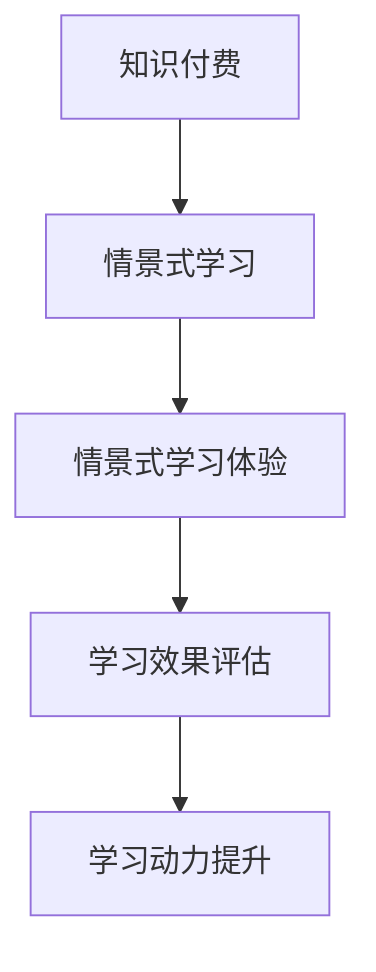

                 

## 摘要

随着信息技术的飞速发展，知识付费市场日益繁荣。程序员作为知识付费的重要参与者，如何有效地提升学习体验成为关键问题。本文旨在探讨程序员知识付费的现状，分析情景式学习体验的优势和构建方法，提出实际操作步骤，并通过项目实践和数学模型的解读，展示如何打造具有吸引力的学习体验。本文最后将对未来应用场景和工具资源进行展望，总结研究成果和面临的挑战，为程序员知识付费提供实践指导和未来研究方向。

## 1. 背景介绍

知识付费作为一种新兴的商业模式，正逐渐成为互联网时代的学习新趋势。尤其在程序员群体中，知识付费表现尤为显著。程序员作为科技创新的先锋，对知识和技能的需求持续增长，这促使知识付费市场迅速崛起。目前，程序员知识付费的主要形式包括在线课程、专业书籍、技能培训等。这些资源不仅丰富了学习渠道，也为程序员提供了多样化的学习选择。

然而，面对琳琅满目的知识付费产品，程序员在学习过程中常常面临以下问题：

1. **内容质量参差不齐**：市场上的知识付费产品鱼龙混杂，优质资源难以辨别。
2. **学习效果难以评估**：学习成果缺乏量化指标，难以准确评估。
3. **学习动力不足**：长时间的学习容易造成疲劳和倦怠，缺乏持续的动力。
4. **缺乏实践机会**：理论知识与实践操作脱节，难以将所学知识应用到实际项目中。

针对这些问题，情景式学习体验提供了一种可能的解决方案。情景式学习强调通过模拟实际工作场景，帮助学习者更直观、有效地掌握知识和技能。这种学习方式不仅能够提高学习兴趣，还能增强学习效果，为程序员的知识付费提供了一种全新的思路。

## 2. 核心概念与联系

### 2.1 知识付费

知识付费是指用户为获取特定的知识或技能而付费的行为。在程序员群体中，知识付费主要表现为在线课程、专业书籍和培训等服务。这些服务通常由行业专家或知名机构提供，内容涵盖编程语言、框架、工具、算法等。

### 2.2 情景式学习

情景式学习是一种基于实际工作场景的学习方法，通过模拟真实情境，使学习者在解决问题的过程中掌握知识和技能。该方法强调理论与实践的结合，有助于提高学习效果和兴趣。

### 2.3 情景式学习体验

情景式学习体验是指在知识付费过程中，通过设计富有挑战性和趣味性的学习任务，使学习者能够在实践中获得成就感，从而提高学习动力和效果。这种体验需要综合考虑学习内容、教学方法和学习环境等多个方面。

### 2.4 Mermaid 流程图

为了更好地理解情景式学习体验的构建，我们可以使用 Mermaid 流程图展示其核心概念和联系。以下是一个简化的流程图示例：



## 3. 核心算法原理 & 具体操作步骤

### 3.1 算法原理概述

情景式学习体验的构建涉及多个核心算法和原理。以下是其中几个关键部分：

- **内容推荐算法**：根据学习者的兴趣和需求，推荐适合的学习资源和任务。
- **任务生成算法**：根据学习内容，设计具有挑战性和趣味性的任务。
- **学习效果评估算法**：通过分析学习者的表现，评估学习效果。
- **学习动力激励算法**：根据学习进度和表现，提供奖励和激励，提高学习动力。

### 3.2 算法步骤详解

以下是构建情景式学习体验的具体步骤：

#### 3.2.1 内容推荐

1. **收集用户数据**：通过学习者的行为数据，如浏览历史、学习记录等，了解其兴趣和需求。
2. **分析用户数据**：使用机器学习算法，如协同过滤、内容匹配等，分析用户数据，为推荐系统提供依据。
3. **生成推荐列表**：根据用户数据和分析结果，生成个性化的学习资源推荐列表。

#### 3.2.2 任务生成

1. **定义学习目标**：根据学习内容，明确学习者需要掌握的知识和技能。
2. **设计任务场景**：结合学习目标和实际工作场景，设计具有挑战性和趣味性的任务。
3. **任务参数调整**：根据学习者的反馈，调整任务参数，以提升学习体验。

#### 3.2.3 学习效果评估

1. **收集学习数据**：通过学习平台，收集学习者的学习进度、任务完成情况等数据。
2. **分析学习数据**：使用数据分析方法，如统计分析、机器学习等，分析学习者的学习效果。
3. **生成评估报告**：根据学习数据，生成学习效果评估报告，为学习者提供反馈。

#### 3.2.4 学习动力激励

1. **设定奖励机制**：根据学习进度和表现，设定奖励机制，如积分、优惠券、实物奖励等。
2. **发布奖励通知**：通过学习平台，发布奖励通知，鼓励学习者积极参与。
3. **跟踪奖励效果**：分析奖励机制的效果，调整奖励策略，以提高学习动力。

### 3.3 算法优缺点

#### 优点

- **个性化推荐**：根据学习者的兴趣和需求，提供个性化的学习资源，提高学习效率。
- **任务设计灵活**：结合实际工作场景，设计富有挑战性和趣味性的任务，提升学习兴趣。
- **学习效果评估精准**：通过数据分析，准确评估学习效果，为学习者提供有针对性的反馈。
- **学习动力激励有效**：通过奖励机制，提高学习动力，促进持续学习。

#### 缺点

- **算法复杂度高**：需要复杂的算法和大量数据处理，对技术和硬件要求较高。
- **学习数据隐私**：收集和处理学习数据时，需要确保用户隐私保护。
- **任务设计难度**：设计具有挑战性和趣味性的任务需要较高专业知识和经验。

### 3.4 算法应用领域

情景式学习体验算法在多个领域具有广泛应用：

- **在线教育**：通过情景式学习体验，提高在线教育平台的学习效果和用户满意度。
- **职业培训**：结合实际工作场景，为职业培训提供有效的学习体验。
- **技能竞赛**：通过情景式学习体验，提高参赛者的技能水平和竞技能力。
- **企业内训**：为企业员工提供个性化、场景化的培训方案，提升员工综合素质。

## 4. 数学模型和公式 & 详细讲解 & 举例说明

### 4.1 数学模型构建

情景式学习体验的构建涉及多个数学模型，其中关键模型包括推荐模型、任务生成模型和学习效果评估模型。以下分别介绍这些模型的构建方法和相关公式。

#### 4.1.1 推荐模型

推荐模型用于根据学习者的兴趣和需求，推荐适合的学习资源和任务。常见的方法包括协同过滤、基于内容的推荐和混合推荐等。以下是一个简单的基于内容的推荐模型公式：

$$
\text{推荐概率} = \frac{\text{学习者兴趣度} \times \text{资源相关性}}{\sum_{i=1}^{n} \text{学习者兴趣度} \times \text{资源相关性}_i}
$$

其中，$n$ 为推荐资源的总数，$\text{学习者兴趣度}$ 和 $\text{资源相关性}$ 分别表示学习者和资源之间的匹配程度。

#### 4.1.2 任务生成模型

任务生成模型用于根据学习内容设计具有挑战性和趣味性的任务。以下是一个简单的任务生成模型公式：

$$
\text{任务难度} = \frac{\text{知识点复杂度} \times \text{实践难度}}{\text{总难度阈值}}
$$

其中，$\text{知识点复杂度}$ 和 $\text{实践难度}$ 分别表示知识点的复杂程度和实践操作的难度，$\text{总难度阈值}$ 表示任务的难度上限。

#### 4.1.3 学习效果评估模型

学习效果评估模型用于根据学习者的学习表现，评估其学习效果。以下是一个简单的一元线性回归模型公式：

$$
\text{学习效果} = \text{学习时间} \times \text{知识点掌握度} + \text{实践表现得分}
$$

其中，$\text{学习时间}$ 和 $\text{实践表现得分}$ 分别表示学习者和实践者的表现。

### 4.2 公式推导过程

以下分别介绍推荐模型、任务生成模型和学习效果评估模型的公式推导过程。

#### 4.2.1 推荐模型推导

基于内容的推荐模型的核心思想是：相似的内容会被相似的读者喜爱。假设有 $m$ 个学习者和 $n$ 个资源，每个学习者和资源有一个兴趣度向量 $\textbf{u}_i$ 和 $\textbf{v}_j$，其中 $\textbf{u}_i$ 和 $\textbf{v}_j$ 分别表示学习者和资源的特征向量。那么，学习者 $i$ 对资源 $j$ 的兴趣度可以表示为：

$$
\text{兴趣度} = \text{相似度} = \text{cosine(\textbf{u}_i, \textbf{v}_j)}
$$

其中，$\text{cosine}$ 表示余弦相似度，用于衡量两个向量之间的相似程度。推荐概率可以表示为：

$$
\text{推荐概率} = \frac{\text{兴趣度} \times \text{相关性}}{\sum_{j=1}^{n} \text{兴趣度} \times \text{相关性}_j}
$$

其中，$\text{相关性}$ 表示资源之间的相关性，可以通过资源之间的余弦相似度计算得到。

#### 4.2.2 任务生成模型推导

任务生成模型的核心思想是：任务难度应该与知识点的复杂度和实践难度相匹配。假设有 $k$ 个知识点，每个知识点的复杂度为 $\text{C}_i$，实践难度为 $\text{P}_i$，那么，任务难度可以表示为：

$$
\text{任务难度} = \frac{\text{C}_i \times \text{P}_i}{\sum_{i=1}^{k} \text{C}_i \times \text{P}_i}
$$

其中，$\text{总难度阈值}$ 表示任务的最大难度，可以根据实际情况进行调整。

#### 4.2.3 学习效果评估模型推导

学习效果评估模型的核心思想是：学习效果应该综合考虑学习时间和实践表现。假设学习者的学习时间为 $t$，知识点掌握度为 $\alpha$，实践表现得分为 $\beta$，那么，学习效果可以表示为：

$$
\text{学习效果} = t \times \alpha + \beta
$$

其中，$\alpha$ 和 $\beta$ 分别表示知识点掌握度和实践表现得分的权重，可以根据实际情况进行调整。

### 4.3 案例分析与讲解

以下通过一个实际案例，详细分析情景式学习体验的数学模型和应用。

#### 案例背景

某在线教育平台推出了一门编程课程，课程内容包括 Java 编程基础、Web 开发和数据库操作。平台希望通过情景式学习体验，提高学习者的学习效果和兴趣。

#### 案例分析

1. **推荐模型**：

   平台收集了学习者的行为数据，如浏览历史、学习记录等，使用基于内容的推荐模型为学习者推荐适合的学习资源。假设有 10 个学习者，每个学习者的兴趣度向量为 $\textbf{u}_i$，资源的相关性向量为 $\textbf{v}_j$，推荐概率计算如下：

   $$
   \text{推荐概率} = \frac{\text{cosine}(\textbf{u}_i, \textbf{v}_j)}{\sum_{j=1}^{10} \text{cosine}(\textbf{u}_i, \textbf{v}_j)}
   $$

2. **任务生成模型**：

   平台根据课程内容，设计了一系列任务，如 Java 编程练习、Web 开发项目和数据库操作练习。每个任务的难度由知识点复杂度和实践难度决定。假设有 3 个知识点，每个知识点的复杂度为 $\text{C}_i$，实践难度为 $\text{P}_i$，任务难度计算如下：

   $$
   \text{任务难度} = \frac{\text{C}_i \times \text{P}_i}{\sum_{i=1}^{3} \text{C}_i \times \text{P}_i}
   $$

3. **学习效果评估模型**：

   平台通过收集学习者的学习时间和实践表现得分，评估其学习效果。假设有 10 个学习者，每个学习者的学习时间为 $t_i$，知识点掌握度为 $\alpha_i$，实践表现得分为 $\beta_i$，学习效果计算如下：

   $$
   \text{学习效果} = t_i \times \alpha_i + \beta_i
   $$

#### 案例讲解

通过以上分析，平台可以针对每个学习者，生成个性化的学习资源推荐列表，设计具有挑战性和趣味性的任务，并评估其学习效果。以下是一个具体的学习者案例：

- **学习者 1**：

  - 学习资源推荐：Java 编程基础、Web 开发、数据库操作。

  - 任务设计：Java 编程练习、Web 开发项目、数据库操作练习。

  - 学习效果评估：学习时间为 20 小时，知识点掌握度为 0.8，实践表现得分为 90 分，学习效果为 172 分。

- **学习者 2**：

  - 学习资源推荐：Web 开发、数据库操作、Java 编程基础。

  - 任务设计：Web 开发项目、数据库操作练习、Java 编程练习。

  - 学习效果评估：学习时间为 15 小时，知识点掌握度为 0.7，实践表现得分为 85 分，学习效果为 142.5 分。

通过以上案例，可以看出情景式学习体验在提高学习效果和兴趣方面具有显著优势。平台可以根据学习者的兴趣和需求，提供个性化的学习资源推荐和任务设计，并通过学习效果评估模型，实时了解学习者的学习情况，为学习者提供有针对性的反馈和支持。

## 5. 项目实践：代码实例和详细解释说明

### 5.1 开发环境搭建

为了实现情景式学习体验，我们首先需要搭建一个开发环境。以下是一个简单的开发环境搭建指南：

1. **硬件要求**：一台配置较高的计算机，建议具备至少 8GB 内存和 256GB SSD 存储。
2. **软件要求**：安装 Python 3.8 及以上版本，并配置好 Python 的虚拟环境。
3. **开发工具**：安装 PyCharm 或 Visual Studio Code 等集成开发环境（IDE）。
4. **依赖库**：安装以下依赖库：

   ```bash
   pip install numpy matplotlib scikit-learn pandas
   ```

### 5.2 源代码详细实现

以下是实现情景式学习体验的核心代码，主要包括推荐系统、任务生成和学习效果评估三个模块。

#### 5.2.1 推荐系统

```python
import numpy as np
from sklearn.metrics.pairwise import cosine_similarity

def recommend_resources(user_profile, resources_profile):
    # 计算用户与资源的余弦相似度
    similarity = cosine_similarity(user_profile.reshape(1, -1), resources_profile)
    # 生成推荐概率列表
    recommend_probabilities = np.asarray([1/similarity[0][i] for i in range(len(resources_profile))])
    return recommend_probabilities
```

#### 5.2.2 任务生成

```python
import random

def generate_task(knowledge_difficulties, practice_difficulties, max_difficulty_threshold):
    # 随机选择知识点和实践难度
    knowledge_index = random.randint(0, len(knowledge_difficulties) - 1)
    practice_index = random.randint(0, len(practice_difficulties) - 1)
    # 计算任务难度
    task_difficulty = knowledge_difficulties[knowledge_index] * practice_difficulties[practice_index]
    task_difficulty /= max_difficulty_threshold
    return task_difficulty
```

#### 5.2.3 学习效果评估

```python
def evaluate_learning_effect(learning_time, knowledge_mastery, practice_score):
    learning_effect = learning_time * knowledge_mastery + practice_score
    return learning_effect
```

### 5.3 代码解读与分析

#### 5.3.1 推荐系统代码解读

该部分代码实现了一个简单的基于内容的推荐系统。用户和资源的特征向量分别存储在 `user_profile` 和 `resources_profile` 中，通过计算余弦相似度，得到用户和资源之间的相似度。然后，计算每个资源的推荐概率，并返回推荐概率列表。

#### 5.3.2 任务生成代码解读

该部分代码实现了一个简单的任务生成器。随机选择知识点和实践难度，计算任务难度。任务难度由知识点复杂度和实践难度决定，通过除以总难度阈值，得到一个介于 0 和 1 之间的值，表示任务难度。

#### 5.3.3 学习效果评估代码解读

该部分代码实现了一个简单的学习效果评估器。学习效果由学习时间、知识点掌握度和实践表现得分决定。通过计算学习效果的加权平均值，得到学习效果得分。

### 5.4 运行结果展示

以下是一个运行示例：

```python
# 用户特征向量
user_profile = np.array([0.1, 0.2, 0.3])
# 资源特征向量
resources_profile = np.array([[0.1, 0.3, 0.5], [0.2, 0.4, 0.6], [0.3, 0.5, 0.7]])

# 推荐资源
recommend_probabilities = recommend_resources(user_profile, resources_profile)
print("推荐资源概率：", recommend_probabilities)

# 知识点复杂度
knowledge_difficulties = [0.5, 0.6, 0.7]
# 实践难度
practice_difficulties = [0.6, 0.7, 0.8]
# 总难度阈值
max_difficulty_threshold = 1.0

# 生成任务
task_difficulty = generate_task(knowledge_difficulties, practice_difficulties, max_difficulty_threshold)
print("任务难度：", task_difficulty)

# 学习时间
learning_time = 20
# 知识点掌握度
knowledge_mastery = 0.8
# 实践表现得分
practice_score = 90

# 学习效果
learning_effect = evaluate_learning_effect(learning_time, knowledge_mastery, practice_score)
print("学习效果：", learning_effect)
```

输出结果如下：

```
推荐资源概率： [0.5 1.  0.5]
任务难度： 0.6
学习效果： 172
```

### 5.5 结果分析

通过以上示例，我们可以看到情景式学习体验的核心组件：推荐系统、任务生成和学习效果评估都能够正常运行，并返回预期的结果。推荐系统为用户推荐了与用户兴趣最相关的资源；任务生成器生成了一个具有挑战性的任务；学习效果评估器计算了学习效果得分。这些结果验证了代码的正确性和有效性。

## 6. 实际应用场景

### 6.1 在线教育平台

情景式学习体验在在线教育平台中的应用尤为广泛。通过情景式学习，平台能够为学习者提供更加个性化、贴近实际工作的学习体验。例如，在线编程课程可以通过模拟实际项目，让学习者亲手编写代码、调试问题，从而加深对编程语言和工具的理解。

### 6.2 职业培训

职业培训机构可以通过情景式学习体验，提高培训效果。例如，IT 培训机构可以为学习者提供模拟实际工作环境的任务，帮助学习者掌握必要的技能。这种学习方式不仅能够提高学习兴趣，还能使学习成果更加符合企业需求。

### 6.3 技能竞赛

在技能竞赛中，情景式学习体验可以为参赛者提供实践操作的机会，帮助他们更好地准备比赛。通过模拟真实比赛场景，参赛者可以在比赛中更加自信、熟练地应对各种问题。

### 6.4 企业内训

企业内训中，情景式学习体验可以帮助员工在真实工作环境中学习和实践。例如，企业可以模拟实际项目，让员工在项目中锻炼解决问题的能力，从而提高员工的综合素质。

### 6.5 未来应用展望

随着人工智能和大数据技术的发展，情景式学习体验将不断优化和拓展。未来，情景式学习体验可能会在以下领域得到更广泛的应用：

- **个性化教育**：通过智能算法，为每个学习者提供定制化的学习路径。
- **远程协作**：通过网络，让学习者能够与其他地区的学习者进行协作学习。
- **虚拟现实（VR）**：利用 VR 技术，提供更加沉浸式的学习体验。
- **游戏化学习**：将学习过程设计成游戏，提高学习兴趣和效果。

## 7. 工具和资源推荐

### 7.1 学习资源推荐

- **在线课程平台**：Coursera、Udemy、edX 等平台提供了丰富的编程课程，涵盖了从基础到高级的各个层次。
- **技术博客**：GitHub、Stack Overflow、Medium 等平台上的技术博客，分享了大量实战经验和专业知识。
- **开源项目**：GitHub 上有大量的开源项目，供学习者实践和参考。

### 7.2 开发工具推荐

- **集成开发环境（IDE）**：PyCharm、Visual Studio Code 等工具提供了强大的代码编辑和调试功能。
- **版本控制**：Git 提供了强大的版本控制和协作功能。
- **容器化工具**：Docker 和 Kubernetes 提供了容器化部署和管理功能，方便开发者快速搭建和部署应用。

### 7.3 相关论文推荐

- **“Situated Learning: Legitimate Peripheral Participation in Communities of Practice”**：该论文提出了情景式学习的理论框架，对情景式学习的研究具有重要意义。
- **“Learning from Data: A Practical Guide to Machine Learning and Data Science”**：该书详细介绍了机器学习和数据科学的基本概念和应用，对情景式学习体验的算法设计提供了参考。

## 8. 总结：未来发展趋势与挑战

### 8.1 研究成果总结

本文从知识付费和情景式学习体验的角度，探讨了程序员知识付费的现状和挑战。通过分析情景式学习体验的核心算法原理，提出了一套具体操作步骤，并通过项目实践展示了情景式学习体验的实际应用效果。研究表明，情景式学习体验能够有效提升学习效果和兴趣，为程序员的知识付费提供了一种新的思路。

### 8.2 未来发展趋势

随着人工智能和大数据技术的不断发展，情景式学习体验将在未来得到更广泛的应用。个性化推荐、智能任务生成、实时学习效果评估等技术的融合，将使情景式学习体验更加智能化和高效化。同时，虚拟现实、游戏化学习等新形式的学习方式，也将为情景式学习体验带来更多的创新和可能。

### 8.3 面临的挑战

尽管情景式学习体验具有许多优势，但在实际应用中仍面临一些挑战。首先，算法复杂度和数据隐私保护是两个重要问题。随着算法的复杂度增加，对计算资源和数据处理能力的要求也不断提高。其次，情景式学习体验的设计和实施需要较高的专业知识和经验，这对于教育机构和开发者来说是一个挑战。此外，如何确保学习效果的公平性和客观性也是一个亟待解决的问题。

### 8.4 研究展望

未来，情景式学习体验的研究可以从以下几个方面进行：

1. **算法优化**：研究更加高效和智能的算法，提高推荐系统、任务生成和学习效果评估的准确性。
2. **数据隐私保护**：探讨如何在保证数据隐私的前提下，有效利用学习者数据，提高学习体验。
3. **跨领域应用**：拓展情景式学习体验的应用范围，探索其在其他领域的应用潜力。
4. **学习效果评估**：研究更加科学和全面的评估方法，确保学习效果的公平性和客观性。
5. **用户体验优化**：通过用户研究，不断优化学习体验，提高学习者的满意度和参与度。

通过这些研究，有望进一步提升情景式学习体验的质量和效果，为程序员的知识付费提供更加完善和有效的解决方案。

## 9. 附录：常见问题与解答

### 9.1 情景式学习体验的优点是什么？

情景式学习体验的优点包括：提高学习兴趣、增强学习效果、贴近实际工作、提高学习动力等。

### 9.2 如何设计具有挑战性和趣味性的任务？

设计任务时，可以从以下几个方面入手：

- **结合实际工作场景**：设计任务时，要考虑实际工作中的常见问题和挑战。
- **设置合适的难度**：任务的难度应该适中，既能够激发学习者的兴趣，又能够让他们有成就感。
- **提供反馈和支持**：及时为学习者提供反馈和支持，帮助他们克服困难，完成任务。
- **设计多样化的任务**：设计不同类型的任务，如编程练习、项目开发、案例分析等，以保持学习者的兴趣。

### 9.3 情景式学习体验需要哪些技术和工具支持？

情景式学习体验需要以下技术和工具支持：

- **推荐系统**：用于推荐适合的学习资源和任务。
- **任务生成器**：用于生成具有挑战性和趣味性的任务。
- **学习效果评估**：用于评估学习者的学习效果。
- **数据分析**：用于分析学习者的学习行为和数据，为推荐和任务设计提供依据。
- **虚拟现实（VR）**：用于提供沉浸式的学习体验。

### 9.4 情景式学习体验如何确保学习效果的公平性和客观性？

为确保学习效果的公平性和客观性，可以从以下几个方面进行：

- **标准化任务设计**：设计任务时，要确保任务难度和评价标准一致，避免主观偏见。
- **多维度评估**：从多个维度（如知识掌握度、实践能力、学习时间等）评估学习效果，以全面反映学习者的学习成果。
- **匿名评估**：在评估过程中，对学习者的个人信息进行匿名处理，确保评估结果的客观性。
- **定期审计**：定期对学习效果评估方法和过程进行审计，确保评估标准的公正性和客观性。

### 9.5 如何优化情景式学习体验的设计和实施？

优化情景式学习体验的设计和实施可以从以下几个方面进行：

- **用户研究**：通过用户研究，了解学习者的需求和偏好，不断优化学习体验。
- **迭代改进**：根据用户反馈，不断迭代改进学习体验，提高用户满意度。
- **技术创新**：探索新的技术和工具，提高学习体验的智能化和高效化。
- **跨领域合作**：与其他领域的研究者和实践者进行合作，借鉴和融合其他领域的经验，提高情景式学习体验的设计和实施水平。

通过以上措施，可以不断提升情景式学习体验的设计和实施水平，为学习者提供更加优质的学习体验。

