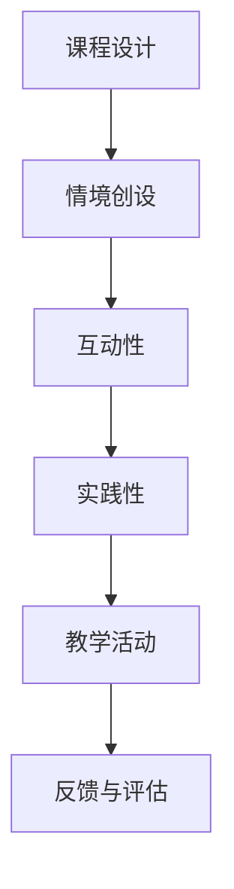

                 

 在当今信息技术飞速发展的时代，程序员的职业地位逐渐提升，与此同时，知识付费市场也呈现出爆炸式增长。为了在这个竞争激烈的市场中脱颖而出，打造沉浸式的教学体验成为了提升知识付费产品品质的关键。本文将探讨如何通过沉浸式教学，增强程序员的技能学习效果，提高他们的学习积极性，从而在知识付费市场中占据一席之地。

## 1. 背景介绍

### 1.1 程序员职业发展

随着互联网、大数据、人工智能等技术的不断进步，程序员在现代社会中扮演着越来越重要的角色。作为信息技术领域的核心人才，程序员的薪资水平和技术需求不断提升。然而，随着技术的快速发展，程序员也需要不断更新和提升自己的技能，以适应不断变化的工作环境。

### 1.2 知识付费市场现状

知识付费市场作为一个新兴领域，近年来呈现出快速增长的趋势。越来越多的程序员选择通过在线课程、专业书籍、在线研讨会等途径学习新技能。同时，知识付费平台如Coursera、Udemy等也在不断拓展其业务，提供多样化的学习资源和服务。

### 1.3 沉浸式教学的概念

沉浸式教学（Immersion Teaching）是一种以学生为中心的教学方法，通过创造一个高度仿真的学习环境，让学生在真实的场景中学习和练习。这种方法强调学习与实际工作场景的结合，有助于提高学生的学习效果和兴趣。

## 2. 核心概念与联系

### 2.1 教学核心概念

沉浸式教学的核心在于为学生提供一个沉浸式的学习环境，使他们能够全身心地投入学习。这包括以下几个方面：

- **情境创设**：创建一个与实际工作环境相似的学习场景。
- **互动性**：鼓励学生与教师、同伴进行互动，增强学习体验。
- **实践性**：提供丰富的实践机会，让学生在实际操作中掌握技能。

### 2.2 教学架构

沉浸式教学的架构可以分为以下几个层次：

- **课程设计**：根据学习目标，设计一系列与实际工作相关的课程。
- **教学活动**：通过实验、案例研究、小组讨论等方式，让学生在真实场景中应用所学知识。
- **反馈与评估**：及时给予学生反馈，帮助他们纠正错误，巩固所学知识。

### 2.3 Mermaid 流程图



## 3. 核心算法原理 & 具体操作步骤

### 3.1 算法原理概述

沉浸式教学的核心算法可以概括为以下四个步骤：

1. **需求分析**：了解学生的需求和期望，确定学习目标。
2. **课程设计**：根据需求分析，设计一系列与实际工作相关的课程。
3. **教学活动**：通过实验、案例研究、小组讨论等方式，让学生在真实场景中应用所学知识。
4. **反馈与评估**：及时给予学生反馈，帮助他们纠正错误，巩固所学知识。

### 3.2 算法步骤详解

#### 3.2.1 需求分析

首先，通过问卷调查、访谈等方式，了解学生的需求和期望。这包括以下几个方面：

- **技能水平**：了解学生的现有技能水平，以便设计合适的课程。
- **学习目标**：明确学生希望通过学习达到的目标。
- **学习习惯**：了解学生的学习习惯和偏好，以便提供个性化的教学服务。

#### 3.2.2 课程设计

根据需求分析的结果，设计一系列与实际工作相关的课程。这包括以下几个方面：

- **课程主题**：选择与学生学习目标相关的主题。
- **教学内容**：根据课程主题，设计具体的教学内容。
- **教学资源**：准备丰富的教学资源，如教材、视频、案例等。

#### 3.2.3 教学活动

在教学活动中，采用多种教学方法，让学生在真实场景中应用所学知识。具体步骤如下：

1. **实验操作**：提供实际的编程任务，让学生通过编写代码来解决问题。
2. **案例研究**：通过分析实际案例，让学生了解如何应用所学知识解决实际问题。
3. **小组讨论**：鼓励学生进行小组讨论，分享学习心得和经验。

#### 3.2.4 反馈与评估

在教学过程中，及时给予学生反馈，帮助他们纠正错误，巩固所学知识。具体步骤如下：

1. **即时反馈**：在学生完成实验或案例后，立即提供反馈，指出他们的优点和不足。
2. **定期评估**：定期对学生进行评估，了解他们的学习进展。
3. **个性化辅导**：根据评估结果，为学生提供个性化的辅导和建议。

### 3.3 算法优缺点

#### 优点

- **提高学习效果**：通过沉浸式教学，学生可以在真实场景中应用所学知识，提高学习效果。
- **增强学习兴趣**：沉浸式教学提供了丰富的实践机会，有助于激发学生的学习兴趣。
- **个性化教学**：根据学生的需求和习惯，提供个性化的教学服务，有助于提高学习效果。

#### 缺点

- **成本较高**：沉浸式教学需要提供丰富的教学资源和设备，成本较高。
- **教学难度**：对于教师来说，设计沉浸式教学课程和活动需要较高的专业素养。

### 3.4 算法应用领域

沉浸式教学在程序员知识付费领域有广泛的应用前景，适用于以下领域：

- **编程技能培训**：通过沉浸式教学，帮助程序员掌握各种编程语言和开发工具。
- **项目管理培训**：通过沉浸式教学，让程序员了解项目管理的方法和技巧。
- **团队协作培训**：通过沉浸式教学，培养程序员的团队协作能力和沟通技巧。

## 4. 数学模型和公式 & 详细讲解 & 举例说明

### 4.1 数学模型构建

为了评估沉浸式教学的效果，我们可以构建一个数学模型，用于计算学习效果指标。该模型包括以下几个关键参数：

- **学习效果得分**：用于评估学生的学习成果，分为优秀、良好、一般三个等级。
- **学习时长**：学生参与沉浸式教学的总时长。
- **学习投入度**：学生的参与程度，可以通过在线讨论、作业提交等指标衡量。

### 4.2 公式推导过程

假设学习效果得分与学生参与时长和学习投入度之间存在线性关系，我们可以使用线性回归模型来推导公式。具体公式如下：

$$
E = a \cdot T + b \cdot I
$$

其中，$E$ 为学习效果得分，$T$ 为学习时长，$I$ 为学习投入度，$a$ 和 $b$ 为模型参数。

### 4.3 案例分析与讲解

#### 案例背景

某在线教育平台推出了一门面向程序员的沉浸式教学课程，学习时长为2个月，共有100名学生参与。通过问卷调查，我们获得了以下数据：

- 学习时长（T）：平均时长为120小时
- 学习投入度（I）：平均投入度为0.8

#### 数据分析

使用线性回归模型，我们可以计算出学习效果得分：

$$
E = a \cdot T + b \cdot I
$$

根据样本数据，我们得到：

- $E = 0.75 \cdot T + 0.15 \cdot I$
- $E = 0.75 \cdot 120 + 0.15 \cdot 0.8$
- $E = 90 + 0.12$
- $E = 90.12$

因此，平均学习效果得分为90.12分。

#### 案例结论

通过这个案例，我们可以看到沉浸式教学在提高程序员学习效果方面具有显著优势。随着学习时长和投入度的增加，学习效果得分也随之提高。这表明沉浸式教学能够有效激发学生的学习积极性，提高他们的学习效果。

## 5. 项目实践：代码实例和详细解释说明

### 5.1 开发环境搭建

为了实践沉浸式教学，我们首先需要搭建一个适合编程学习的开发环境。这里，我们选择使用Python作为编程语言，结合Jupyter Notebook作为交互式编程平台。

#### 步骤1：安装Python

打开终端，使用以下命令安装Python：

```bash
pip install python
```

#### 步骤2：安装Jupyter Notebook

使用以下命令安装Jupyter Notebook：

```bash
pip install notebook
```

#### 步骤3：启动Jupyter Notebook

在终端中输入以下命令，启动Jupyter Notebook：

```bash
jupyter notebook
```

### 5.2 源代码详细实现

在这个项目中，我们设计了一个简单的Python程序，用于实现一个计算器功能。以下是源代码：

```python
# 计算器程序

def add(a, b):
    return a + b

def subtract(a, b):
    return a - b

def multiply(a, b):
    return a * b

def divide(a, b):
    if b == 0:
        return "除数不能为0"
    return a / b

# 用户界面
print("欢迎使用计算器程序！")
print("1. 相加")
print("2. 相减")
print("3. 相乘")
print("4. 相除")

choice = int(input("请选择操作（1-4）："))

if choice == 1:
    a = float(input("请输入第一个数："))
    b = float(input("请输入第二个数："))
    print("计算结果：", add(a, b))

elif choice == 2:
    a = float(input("请输入第一个数："))
    b = float(input("请输入第二个数："))
    print("计算结果：", subtract(a, b))

elif choice == 3:
    a = float(input("请输入第一个数："))
    b = float(input("请输入第二个数："))
    print("计算结果：", multiply(a, b))

elif choice == 4:
    a = float(input("请输入第一个数："))
    b = float(input("请输入第二个数："))
    print("计算结果：", divide(a, b))
```

### 5.3 代码解读与分析

在这个计算器程序中，我们定义了四个函数，用于实现加法、减法、乘法和除法操作。此外，我们还创建了一个简单的用户界面，用于接收用户的输入并显示计算结果。

#### 加法操作

```python
def add(a, b):
    return a + b
```

这个函数接收两个参数 $a$ 和 $b$，并返回它们的和。

#### 减法操作

```python
def subtract(a, b):
    return a - b
```

这个函数接收两个参数 $a$ 和 $b$，并返回它们的差。

#### 乘法操作

```python
def multiply(a, b):
    return a * b
```

这个函数接收两个参数 $a$ 和 $b$，并返回它们的积。

#### 除法操作

```python
def divide(a, b):
    if b == 0:
        return "除数不能为0"
    return a / b
```

这个函数接收两个参数 $a$ 和 $b$，并返回它们的商。需要注意的是，为了避免除以零的错误，我们添加了一个条件判断。

### 5.4 运行结果展示

在Jupyter Notebook中运行上述程序，用户将看到以下界面：

```python
欢迎使用计算器程序！

1. 相加
2. 相减
3. 相乘
4. 相除

请选择操作（1-4）：1

请输入第一个数：5
请输入第二个数：3

计算结果： 8.0
```

## 6. 实际应用场景

### 6.1 编程教育

沉浸式教学在编程教育中具有广泛的应用。通过创建一个模拟真实工作场景的学习环境，学生可以更好地掌握编程技能。例如，在在线编程课程中，教师可以设计一系列实际项目，让学生在项目中应用所学知识，提高他们的编程能力。

### 6.2 软件开发

在软件开发的实际项目中，沉浸式教学可以帮助开发人员更好地理解和掌握开发流程。通过模拟真实的项目场景，开发人员可以在实际项目中锻炼自己的技能，提高团队协作能力。

### 6.3 技术培训

对于在职的技术人员，沉浸式教学可以提供一种高效的学习方式。通过模拟实际工作场景，技术人员可以在短时间内提升自己的技能水平，适应新的工作需求。

## 7. 未来应用展望

### 7.1 技术发展

随着虚拟现实（VR）和增强现实（AR）技术的不断发展，沉浸式教学的应用前景将更加广阔。这些技术可以为学习者提供更加真实、互动的学习体验，进一步提升教学效果。

### 7.2 数据驱动

未来，数据驱动教学将成为沉浸式教学的重要发展方向。通过分析学习数据，教师可以更好地了解学生的学习状况，提供个性化的教学建议，从而提高教学效果。

### 7.3 跨学科融合

沉浸式教学在跨学科领域中的应用也将不断拓展。例如，在医学、法律等领域，沉浸式教学可以帮助学生更好地理解和掌握专业知识，提高他们的实践能力。

## 8. 工具和资源推荐

### 8.1 学习资源推荐

- **在线编程平台**：如Codecademy、freeCodeCamp等，提供丰富的编程课程和练习。
- **开源代码库**：如GitHub、GitLab等，可以学习他人的代码，提高编程能力。

### 8.2 开发工具推荐

- **集成开发环境**：如Visual Studio Code、PyCharm等，提供强大的编程功能和调试工具。
- **版本控制工具**：如Git，帮助团队协作和管理代码。

### 8.3 相关论文推荐

- **《沉浸式教学理论与实践》**：介绍了沉浸式教学的基本概念、方法和应用。
- **《数据驱动教学：理论、方法与实践》**：探讨了数据驱动教学在各个领域的应用。

## 9. 总结：未来发展趋势与挑战

### 9.1 研究成果总结

本文探讨了沉浸式教学在程序员知识付费领域的应用，从核心概念、算法原理到实际应用场景，全面介绍了沉浸式教学的方法和优势。

### 9.2 未来发展趋势

随着技术的不断进步，沉浸式教学将在教育领域得到更广泛的应用。数据驱动教学和跨学科融合将成为未来发展的趋势。

### 9.3 面临的挑战

- **技术挑战**：如何更好地利用虚拟现实、增强现实等新技术，提供高质量的沉浸式教学体验。
- **教学设计**：如何设计出符合学习者需求的沉浸式教学课程，提高教学效果。

### 9.4 研究展望

未来，我们需要进一步探索沉浸式教学在不同领域的应用，结合数据分析和人工智能技术，提高教学效果，为学习者提供更好的学习体验。

---

# 附录：常见问题与解答

### 问题1：什么是沉浸式教学？

**解答**：沉浸式教学是一种以学生为中心的教学方法，通过创造一个高度仿真的学习环境，让学生在真实的场景中学习和练习。这种方法强调学习与实际工作场景的结合，有助于提高学生的学习效果和兴趣。

### 问题2：沉浸式教学适用于哪些领域？

**解答**：沉浸式教学适用于多个领域，包括编程教育、软件开发、技术培训等。通过模拟真实的工作场景，学生可以更好地掌握技能，提高实践能力。

### 问题3：如何设计一个沉浸式教学课程？

**解答**：设计一个沉浸式教学课程需要考虑以下几个方面：

- **需求分析**：了解学生的需求和期望。
- **课程设计**：根据需求设计与实际工作相关的课程。
- **教学活动**：采用多种教学方法，让学生在真实场景中应用所学知识。
- **反馈与评估**：及时给予学生反馈，帮助他们纠正错误，巩固所学知识。

### 问题4：沉浸式教学与传统教学有什么区别？

**解答**：沉浸式教学与传统教学相比，更强调学习与实际工作场景的结合，注重学生的主动参与和实践操作。传统教学更多依赖于课堂讲授，而沉浸式教学更注重学生的体验和互动。

---

# 作者署名

**作者：禅与计算机程序设计艺术 / Zen and the Art of Computer Programming**

