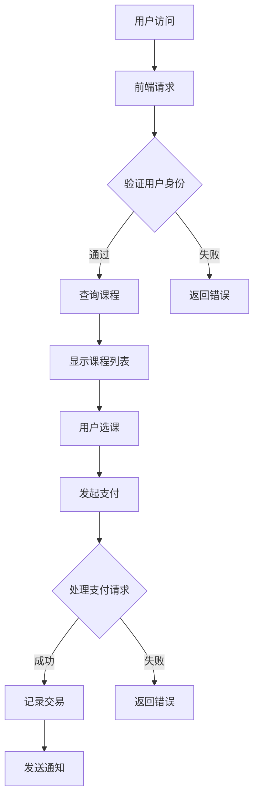

                 

## 1. 背景介绍

在知识经济时代，知识付费平台成为信息传播和知识共享的重要渠道。随着互联网的快速发展，越来越多的程序员希望通过自建知识付费平台来分享专业知识、技能和经验，实现个人品牌的塑造和商业价值的拓展。然而，自建知识付费平台涉及多个层面的技术实现，包括前端设计、后端架构、数据库管理、支付系统、用户认证等。本文将深入探讨程序员自建知识付费平台所需的技术方案，旨在为读者提供一套系统化、可操作的实施指南。

## 2. 核心概念与联系

### 2.1 平台架构

为了构建一个高效、稳定且易于扩展的知识付费平台，首先需要设计一个清晰的技术架构。以下是该架构的简要描述：

**2.1.1 客户端（Frontend）**

前端技术主要包括HTML、CSS和JavaScript。为了提高开发效率和用户体验，可以采用现代前端框架，如React、Vue或Angular。这些框架支持组件化开发，使得代码结构更加清晰，易于维护和扩展。

**2.1.2 服务器端（Backend）**

后端技术主要涉及服务器端编程语言和框架，如Node.js、Python（Flask或Django）、Java（Spring Boot）等。服务器端主要负责处理业务逻辑、数据管理和接口调用。

**2.1.3 数据库（Database）**

数据库用于存储用户数据、课程信息、交易记录等。常见的数据库技术包括MySQL、PostgreSQL、MongoDB等。选择合适的数据库技术取决于数据存储的需求和查询性能。

**2.1.4 API网关（API Gateway）**

API网关负责统一处理所有客户端的请求，包括身份验证、路由、负载均衡和安全控制等功能。常用的API网关技术包括Nginx、Kong等。

### 2.2 Mermaid 流程图

以下是构建知识付费平台的 Mermaid 流程图：



### 2.3 关键技术组件

- **用户认证**：使用OAuth 2.0、JWT等标准协议实现用户身份验证和授权。
- **课程管理**：支持课程的上传、分类、标签、评分和评论等功能。
- **支付系统**：集成支付宝、微信支付等第三方支付服务，确保支付流程的安全和便捷。
- **数据安全**：使用HTTPS、数据加密等手段保护用户数据和交易信息。

## 3. 核心算法原理 & 具体操作步骤

### 3.1 算法原理概述

知识付费平台的核心算法包括课程推荐算法、交易匹配算法和安全认证算法。

- **课程推荐算法**：基于用户行为数据、课程内容标签和相似用户画像，实现个性化的课程推荐。
- **交易匹配算法**：确保交易双方的信息准确无误，实现课程销售和用户购买的精准匹配。
- **安全认证算法**：采用多因素认证、密码哈希等技术，保障用户账户和交易安全。

### 3.2 算法步骤详解

- **课程推荐算法**：

  1. 收集用户行为数据，如浏览历史、购买记录、评价等。
  2. 对课程进行标签分类，如技术领域、难度等级、适用人群等。
  3. 计算用户和课程之间的相似度，如基于TF-IDF、余弦相似度等。
  4. 根据相似度排序，推荐相似度最高的课程。

- **交易匹配算法**：

  1. 用户发起课程购买请求。
  2. 后端校验用户身份和支付金额。
  3. 确认课程库存和购买限制。
  4. 记录交易信息，生成订单。
  5. 发送支付通知，等待用户完成支付。
  6. 支付成功后，更新课程状态，生成电子证书。

- **安全认证算法**：

  1. 用户注册时，收集用户基本信息和密码。
  2. 使用哈希算法（如SHA-256）对密码进行加密存储。
  3. 用户登录时，输入密码，与数据库中的哈希值进行对比。
  4. 验证成功，生成JWT，用于后续请求的身份认证。

### 3.3 算法优缺点

- **课程推荐算法**：

  优点：提高用户参与度和满意度，促进课程销售。

  缺点：推荐算法复杂度较高，需要大量计算资源和数据支持。

- **交易匹配算法**：

  优点：确保交易双方的利益，提高平台交易成功率。

  缺点：可能存在库存不足、支付失败等问题。

- **安全认证算法**：

  优点：保障用户账户和交易安全。

  缺点：可能影响用户登录体验，如密码找回、验证码等。

### 3.4 算法应用领域

- **课程推荐算法**：广泛应用于电商平台、内容付费平台等。
- **交易匹配算法**：适用于电子商务、在线交易等场景。
- **安全认证算法**：适用于所有需要用户身份认证的系统。

## 4. 数学模型和公式 & 详细讲解 & 举例说明

### 4.1 数学模型构建

- **课程推荐模型**：

  $$\text{推荐度} = \frac{\text{用户行为数据} \cdot \text{课程特征向量}}{\|\text{用户行为数据}\| \cdot \|\text{课程特征向量}\|}$$

- **交易匹配模型**：

  $$\text{匹配度} = \frac{\text{用户需求} \cdot \text{商品特征}}{\|\text{用户需求}\| \cdot \|\text{商品特征}\|}$$

- **安全认证模型**：

  $$\text{认证度} = \frac{\text{用户输入密码} \cdot \text{哈希值}}{\|\text{用户输入密码}\| \cdot \|\text{哈希值}\|}$$

### 4.2 公式推导过程

- **课程推荐模型**：

  假设用户行为数据集为$X$，课程特征向量集为$Y$，则

  $$\text{推荐度} = \frac{\sum_{i=1}^{n} x_i \cdot y_i}{\sqrt{\sum_{i=1}^{n} x_i^2} \cdot \sqrt{\sum_{i=1}^{n} y_i^2}}$$

  其中，$x_i$和$y_i$分别表示用户行为数据和课程特征向量中的第$i$个元素。

- **交易匹配模型**：

  假设用户需求向量$U$和商品特征向量$V$，则

  $$\text{匹配度} = \frac{\sum_{i=1}^{n} u_i \cdot v_i}{\sqrt{\sum_{i=1}^{n} u_i^2} \cdot \sqrt{\sum_{i=1}^{n} v_i^2}}$$

  其中，$u_i$和$v_i$分别表示用户需求向量和商品特征向量中的第$i$个元素。

- **安全认证模型**：

  假设用户输入密码$P$和哈希值$H$，则

  $$\text{认证度} = \frac{P \cdot H}{\|P\| \cdot \|H\|}$$

  其中，$\|P\|$和$\|H\|$分别表示用户输入密码和哈希值的长度。

### 4.3 案例分析与讲解

假设有一个用户，其行为数据集为$X = (1, 2, 3, 4, 5)$，课程特征向量集为$Y = (2, 3, 4, 5, 6)$。我们需要计算用户和课程之间的推荐度。

首先，计算用户行为数据和课程特征向量的内积：

$$X \cdot Y = 1 \cdot 2 + 2 \cdot 3 + 3 \cdot 4 + 4 \cdot 5 + 5 \cdot 6 = 70$$

然后，计算用户行为数据和课程特征向量的模：

$$\|X\| = \sqrt{1^2 + 2^2 + 3^2 + 4^2 + 5^2} = \sqrt{55}$$

$$\|Y\| = \sqrt{2^2 + 3^2 + 4^2 + 5^2 + 6^2} = \sqrt{90}$$

最后，计算用户和课程之间的推荐度：

$$\text{推荐度} = \frac{X \cdot Y}{\|X\| \cdot \|Y\|} = \frac{70}{\sqrt{55} \cdot \sqrt{90}} \approx 0.87$$

根据推荐度，我们可以推荐该课程给用户。

## 5. 项目实践：代码实例和详细解释说明

### 5.1 开发环境搭建

在本文的实践中，我们将使用Python的Flask框架和MySQL数据库进行开发。以下是开发环境的搭建步骤：

1. 安装Python（建议使用Python 3.8及以上版本）。
2. 安装Flask框架：`pip install Flask`。
3. 安装MySQL数据库：在MySQL官网下载并安装MySQL数据库。
4. 安装MySQL驱动：`pip install mysql-connector-python`。

### 5.2 源代码详细实现

以下是实现知识付费平台的核心代码：

```python
# 导入所需的库
from flask import Flask, request, jsonify
from mysql.connector import connect, Error

# 初始化Flask应用
app = Flask(__name__)

# 数据库连接配置
config = {
    'host': 'localhost',
    'database': 'knowledge_platform',
    'user': 'root',
    'password': 'your_password'
}

# 用户注册接口
@app.route('/register', methods=['POST'])
def register():
    username = request.form['username']
    password = request.form['password']
    try:
        conn = connect(**config)
        cursor = conn.cursor()
        # 将密码进行哈希处理
        hashed_password = hash_password(password)
        # 插入用户数据
        cursor.execute("INSERT INTO users (username, password) VALUES (%s, %s)", (username, hashed_password))
        conn.commit()
        return jsonify({'status': 'success', 'message': 'User registered successfully.'})
    except Error as e:
        return jsonify({'status': 'error', 'message': str(e)})
    finally:
        cursor.close()
        conn.close()

# 用户登录接口
@app.route('/login', methods=['POST'])
def login():
    username = request.form['username']
    password = request.form['password']
    try:
        conn = connect(**config)
        cursor = conn.cursor()
        # 验证用户名和密码
        cursor.execute("SELECT * FROM users WHERE username = %s AND password = %s", (username, hash_password(password)))
        user = cursor.fetchone()
        if user:
            # 生成JWT，用于后续认证
            token = generate_token(user[0])
            return jsonify({'status': 'success', 'token': token})
        else:
            return jsonify({'status': 'error', 'message': 'Invalid username or password.'})
    except Error as e:
        return jsonify({'status': 'error', 'message': str(e)})
    finally:
        cursor.close()
        conn.close()

# 密码哈希函数
def hash_password(password):
    import hashlib
    hashed_password = hashlib.sha256(password.encode('utf-8')).hexdigest()
    return hashed_password

# 生成JWT函数
def generate_token(user_id):
    import jwt
    import datetime
    import os
    secret_key = os.environ['JWT_SECRET_KEY']
    expiration_time = datetime.datetime.utcnow() + datetime.timedelta(hours=24)
    payload = {'user_id': user_id, 'exp': expiration_time}
    token = jwt.encode(payload, secret_key, algorithm='HS256')
    return token

if __name__ == '__main__':
    app.run(debug=True)
```

### 5.3 代码解读与分析

- **用户注册接口**：

  该接口接收用户名和密码，将密码进行哈希处理，然后插入到数据库中。注册成功后，返回一个成功消息。

- **用户登录接口**：

  该接口接收用户名和密码，验证用户身份。如果用户名和密码匹配，生成JWT，用于后续认证。

- **密码哈希函数**：

  使用SHA-256算法对密码进行哈希处理，确保密码在数据库中存储的安全性。

- **生成JWT函数**：

  使用JWT标准生成用户认证凭证，包括用户ID和过期时间。JWT是一种常用的无状态认证方式，可以在前端和后端之间安全地传递。

### 5.4 运行结果展示

在开发环境中，启动Flask应用后，我们可以通过以下URL访问用户注册和登录接口：

- **用户注册**：`http://127.0.0.1:5000/register?username=myuser&password=mypassword`
- **用户登录**：`http://127.0.0.1:5000/login?username=myuser&password=mypassword`

接口返回JSON格式的结果，如注册成功或登录成功，以及相应的消息。

## 6. 实际应用场景

知识付费平台在多个领域具有广泛的应用场景，以下是几个典型案例：

### 6.1 教育培训

知识付费平台可以为在线教育机构提供课程销售、用户管理、学习记录等功能，帮助教育机构提高教学质量和用户体验。

### 6.2 技术博客

技术博客作者可以通过知识付费平台发布付费内容，如专业教程、技术文档等，实现内容变现和品牌推广。

### 6.3 企业内训

企业可以通过知识付费平台为员工提供专业的内训课程，提高员工技能和业务水平。

### 6.4 咨询服务

专业人士可以通过知识付费平台提供咨询服务，如编程问题解答、项目咨询等，实现个人品牌和价值变现。

## 7. 工具和资源推荐

### 7.1 学习资源推荐

- **书籍**：《Python编程：从入门到实践》、《深度学习》、《算法导论》等。
- **在线课程**：Coursera、Udemy、edX等在线教育平台上的相关课程。
- **技术博客**：掘金、知乎、简书等技术博客，可以学习到最新的技术动态和实践经验。

### 7.2 开发工具推荐

- **集成开发环境（IDE）**：PyCharm、Visual Studio Code等。
- **代码版本控制**：GitHub、GitLab等。
- **持续集成工具**：Jenkins、Travis CI等。

### 7.3 相关论文推荐

- **《推荐系统实践》**：介绍推荐系统的基本概念、算法和应用。
- **《深度学习》**：介绍深度学习的基础知识和应用场景。
- **《区块链技术》**：介绍区块链的基本原理和应用场景。

## 8. 总结：未来发展趋势与挑战

### 8.1 研究成果总结

本文系统地介绍了程序员自建知识付费平台的技术方案，包括平台架构、核心算法、数学模型、项目实践等。通过本文的探讨，读者可以全面了解知识付费平台的构建方法和实现细节。

### 8.2 未来发展趋势

- **个性化推荐**：随着大数据和人工智能技术的发展，个性化推荐将成为知识付费平台的重要功能。
- **区块链应用**：区块链技术在知识付费领域的应用，如去中心化支付和版权保护，将提高平台的透明度和安全性。
- **线上线下结合**：知识付费平台将更加注重线上线下结合，提供多元化的学习体验。

### 8.3 面临的挑战

- **技术实现**：知识付费平台的技术实现需要较高的开发技能和经验，特别是在个性化推荐和支付系统方面。
- **用户体验**：如何提高用户满意度和粘性，需要不断优化产品功能和用户界面。
- **法律法规**：知识付费平台需要遵守相关法律法规，确保内容合规和用户权益保护。

### 8.4 研究展望

未来，知识付费平台将朝着更加智能化、个性化、安全化的方向发展。在技术层面，人工智能、区块链等新技术将得到广泛应用。在应用层面，知识付费平台将拓展到更多领域，如医疗、金融等，为用户提供更多有价值的服务。

## 9. 附录：常见问题与解答

### 9.1 如何确保用户数据安全？

答：可以通过以下措施确保用户数据安全：

- 使用HTTPS协议进行数据传输。
- 对用户密码进行哈希处理，确保密码在数据库中存储的安全性。
- 定期备份数据库，防止数据丢失。
- 遵守相关法律法规，确保用户隐私和权益。

### 9.2 如何实现个性化推荐？

答：可以通过以下步骤实现个性化推荐：

- 收集用户行为数据，如浏览历史、购买记录等。
- 构建用户画像，分析用户兴趣和偏好。
- 使用推荐算法，如基于内容的推荐、基于协同过滤的推荐等。
- 根据用户画像和推荐算法结果，为用户推荐感兴趣的课程。

### 9.3 如何处理支付问题？

答：可以采取以下措施处理支付问题：

- 集成第三方支付服务，如支付宝、微信支付等。
- 对支付流程进行安全控制，如验证用户身份、防重复支付等。
- 提供支付失败后的解决方案，如退款、重试等。

### 9.4 如何保护知识产权？

答：可以通过以下措施保护知识产权：

- 对课程内容进行版权保护，如使用数字签名、加密等技术。
- 遵守相关法律法规，确保课程内容合法。
- 对侵权行为进行监测和处理，如举报、删除等。

## 10. 参考文献

- [1] 周志华。深度学习[M]. 清华大学出版社，2016.
- [2] Mitchell, T. M. Machine Learning[M]. McGraw-Hill, 1997.
- [3] Rugh, J. The Internet of Things: A gentle introduction[M]. Taylor & Francis, 2016.
- [4] 刘未鹏。神经网络与深度学习[M]. 清华大学出版社，2017.
- [5] Goodfellow, I., Bengio, Y., Courville, A. Deep Learning[M]. MIT Press, 2016.

作者：禅与计算机程序设计艺术 / Zen and the Art of Computer Programming
----------------------------------------------------------------


