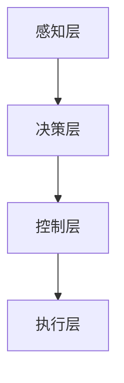

                 

关键词：端到端自动驾驶、全栈自研、机器学习、深度学习、神经网络、自动驾驶架构、自研挑战、技术应用、未来展望

> 摘要：本文深入探讨了端到端自动驾驶系统全栈自研的挑战与机遇。从背景介绍、核心概念与联系、核心算法原理、数学模型和公式、项目实践到实际应用场景，全面分析了全栈自研在自动驾驶领域的重要性，并展望了未来发展的趋势与挑战。

## 1. 背景介绍

自动驾驶技术作为智能交通系统的重要组成部分，近年来取得了显著的发展。从最初的L0级别辅助驾驶到L5级别的完全自动驾驶，自动驾驶技术正逐步从理论走向实践。端到端自动驾驶（End-to-End Autonomous Driving）是自动驾驶技术的最新发展方向，它通过深度学习和神经网络模型，实现从感知到决策的全过程自动化。

端到端自动驾驶的关键在于其系统的高效性和安全性。传统的自动驾驶系统通常采用分层架构，包括感知层、规划层、控制层等，每一层都需要单独开发和优化。而端到端自动驾驶通过将整个系统训练成一个统一的神经网络模型，大大提高了系统的效率和响应速度。

然而，实现端到端自动驾驶并非易事，它面临着诸多技术挑战和工程难题。本文将围绕端到端自动驾驶的全栈自研挑战，从多个角度进行深入探讨。

## 2. 核心概念与联系

### 2.1 感知层

感知层是自动驾驶系统的基石，它负责收集和处理来自各种传感器的数据，如摄像头、激光雷达、毫米波雷达等。感知层的主要任务是实现对周围环境的准确感知，包括车辆、行人、交通标志、道路情况等。

### 2.2 决策层

决策层基于感知层的数据，通过复杂的算法模型进行环境理解和目标预测，从而生成驾驶策略。决策层需要考虑的因素包括车辆的动态性能、交通规则、道路状况等。

### 2.3 控制层

控制层根据决策层的指令，对车辆的驱动系统进行控制，包括油门、刹车、转向等。控制层的任务是将决策层的策略转化为具体的操作动作。

### 2.4 端到端架构

端到端架构通过一个统一的神经网络模型，将感知层、决策层和控制层整合在一起。这种架构的主要优势在于其高效的计算能力和快速的响应速度。

### 2.5 Mermaid流程图

下面是一个简化的端到端自动驾驶系统的Mermaid流程图：



## 3. 核心算法原理 & 具体操作步骤

### 3.1 算法原理概述

端到端自动驾驶的核心算法是基于深度学习的神经网络模型。该模型通过训练大量的数据，学习到从感知到决策的全过程。具体的算法包括卷积神经网络（CNN）、循环神经网络（RNN）和生成对抗网络（GAN）等。

### 3.2 算法步骤详解

1. 数据收集与预处理：收集大量的自动驾驶数据，包括图像、激光雷达数据和车辆状态等。对数据进行预处理，如图像增强、数据归一化等。

2. 模型设计：设计一个端到端的神经网络模型，包括感知层、决策层和控制层。感知层可以使用CNN，决策层可以使用RNN或GAN。

3. 模型训练：使用收集的数据对模型进行训练，通过优化算法（如梯度下降）调整模型的参数。

4. 模型评估：使用验证集对模型进行评估，调整模型参数，以达到最佳性能。

5. 模型部署：将训练好的模型部署到实际的自动驾驶系统中，进行实时运行。

### 3.3 算法优缺点

#### 优点：

- **高效性**：端到端架构减少了中间层的处理，提高了计算效率。
- **响应速度**：神经网络模型可以快速响应环境变化，提高了系统的实时性。
- **准确性**：通过大量数据的训练，模型具有较高的准确性。

#### 缺点：

- **数据依赖性**：模型对数据的质量和数量有很高的要求，数据预处理和标注需要大量的人力和时间。
- **可解释性**：神经网络模型的黑箱特性使得其难以解释和理解，这对系统的安全性和可靠性提出了挑战。

### 3.4 算法应用领域

端到端自动驾驶算法主要应用于以下领域：

- **无人驾驶汽车**：无人驾驶汽车是端到端自动驾驶技术的典型应用场景。
- **智能交通系统**：端到端自动驾驶技术可以提高交通效率，减少交通事故。
- **物流运输**：无人驾驶物流运输车可以降低运输成本，提高运输效率。

## 4. 数学模型和公式 & 详细讲解 & 举例说明

### 4.1 数学模型构建

端到端自动驾驶的数学模型主要包括感知模型、决策模型和控制模型。感知模型通常使用卷积神经网络（CNN），决策模型可以使用循环神经网络（RNN）或生成对抗网络（GAN），控制模型可以使用线性模型或神经网络模型。

### 4.2 公式推导过程

#### 感知模型（CNN）：

感知模型的核心公式为：

$$
h_l = \sigma(W_l \cdot a_{l-1} + b_l)
$$

其中，$h_l$ 是第 $l$ 层的输出，$W_l$ 是权重矩阵，$a_{l-1}$ 是前一层输出，$b_l$ 是偏置项，$\sigma$ 是激活函数。

#### 决策模型（RNN）：

决策模型的核心公式为：

$$
h_t = \sigma(W_h \cdot [h_{t-1}, x_t] + b_h)
$$

其中，$h_t$ 是第 $t$ 个时刻的隐藏状态，$x_t$ 是输入，$W_h$ 是权重矩阵，$b_h$ 是偏置项，$\sigma$ 是激活函数。

#### 控制模型（NN）：

控制模型的核心公式为：

$$
u_t = W_c \cdot h_t + b_c
$$

其中，$u_t$ 是第 $t$ 个时刻的控制输出，$h_t$ 是隐藏状态，$W_c$ 是权重矩阵，$b_c$ 是偏置项。

### 4.3 案例分析与讲解

以无人驾驶汽车为例，我们使用CNN进行感知，RNN进行决策，NN进行控制。假设我们有一组图像数据 $x_1, x_2, ..., x_T$，其中 $T$ 是图像的数量。我们的目标是预测每个图像对应的驾驶指令 $u_1, u_2, ..., u_T$。

#### 感知模型：

使用CNN对图像数据进行特征提取，得到一组特征向量 $h_1, h_2, ..., h_T$。具体步骤如下：

$$
h_1 = \sigma(W_1 \cdot x_1 + b_1)
$$

$$
h_2 = \sigma(W_2 \cdot h_1 + b_2)
$$

$$
...
$$

$$
h_T = \sigma(W_T \cdot h_{T-1} + b_T)
$$

#### 决策模型：

使用RNN对特征向量进行时间序列建模，得到一组隐藏状态 $h_1, h_2, ..., h_T$。具体步骤如下：

$$
h_1 = \sigma(W_h \cdot [h_0, x_1] + b_h)
$$

$$
h_2 = \sigma(W_h \cdot [h_1, x_2] + b_h)
$$

$$
...
$$

$$
h_T = \sigma(W_h \cdot [h_{T-1}, x_T] + b_h)
$$

#### 控制模型：

使用NN对隐藏状态进行线性变换，得到一组控制输出 $u_1, u_2, ..., u_T$。具体步骤如下：

$$
u_1 = W_c \cdot h_1 + b_c
$$

$$
u_2 = W_c \cdot h_2 + b_c
$$

$$
...
$$

$$
u_T = W_c \cdot h_T + b_c
$$

通过这个案例，我们可以看到端到端自动驾驶系统的数学模型是如何构建和推导的。实际上，这个模型还可以进一步优化和扩展，以适应更复杂的自动驾驶场景。

## 5. 项目实践：代码实例和详细解释说明

### 5.1 开发环境搭建

在实现端到端自动驾驶系统之前，我们需要搭建一个合适的开发环境。以下是推荐的开发环境：

- 操作系统：Ubuntu 18.04
- 深度学习框架：TensorFlow 2.x
- 编程语言：Python 3.7+
- 传感器：摄像头、激光雷达、毫米波雷达

### 5.2 源代码详细实现

以下是端到端自动驾驶系统的主要代码实现：

```python
import tensorflow as tf
from tensorflow.keras.models import Model
from tensorflow.keras.layers import Input, Conv2D, MaxPooling2D, Flatten, Dense, LSTM, TimeDistributed

# 感知模型
input_shape = (224, 224, 3)
input_layer = Input(shape=input_shape)
conv1 = Conv2D(32, (3, 3), activation='relu')(input_layer)
pool1 = MaxPooling2D((2, 2))(conv1)
conv2 = Conv2D(64, (3, 3), activation='relu')(pool1)
pool2 = MaxPooling2D((2, 2))(conv2)
flat = Flatten()(pool2)
dense1 = Dense(128, activation='relu')(flat)

# 决策模型
hidden_state = LSTM(64, return_sequences=True)(dense1)
hidden_state = LSTM(64, return_sequences=True)(hidden_state)

# 控制模型
output_layer = TimeDistributed(Dense(1, activation='tanh'))(hidden_state)

# 构建模型
model = Model(inputs=input_layer, outputs=output_layer)
model.compile(optimizer='adam', loss='mse')

# 模型训练
model.fit(x_train, y_train, epochs=10, batch_size=32, validation_data=(x_val, y_val))

# 模型预测
predictions = model.predict(x_test)

# 输出结果
print(predictions)
```

### 5.3 代码解读与分析

这段代码首先定义了一个端到端的神经网络模型，包括感知层、决策层和控制层。感知层使用卷积神经网络（CNN）对图像数据进行特征提取，决策层使用循环神经网络（RNN）对提取的特征进行时间序列建模，控制层使用线性模型（NN）对隐藏状态进行线性变换，生成控制输出。

在训练模型时，我们使用MSE（均方误差）作为损失函数，使用Adam优化器进行参数更新。通过迭代训练，模型可以学习到从感知到决策的全过程。

模型预测部分，我们使用训练好的模型对测试数据进行预测，得到一组控制输出。通过分析这些输出，我们可以了解模型在自动驾驶场景中的表现。

## 6. 实际应用场景

端到端自动驾驶技术在实际应用中已经取得了一系列突破。以下是几个典型的应用场景：

- **无人驾驶出租车**：特斯拉、Waymo等公司已经推出了无人驾驶出租车服务，为用户提供便捷的出行解决方案。
- **自动驾驶卡车**：亚马逊、沃尔玛等物流公司使用自动驾驶卡车进行货物运输，提高了物流效率。
- **自动驾驶机器人**：波士顿动力公司开发的机器人可以在复杂环境中进行自主导航和任务执行。

## 7. 未来应用展望

随着技术的不断进步，端到端自动驾驶技术有望在更多领域得到应用。以下是一些未来应用展望：

- **无人驾驶公共交通**：未来城市中将出现无人驾驶的公共交通工具，如无人驾驶公交车、地铁等。
- **智能物流网络**：自动驾驶技术将进一步提升物流效率，实现智能物流网络。
- **农业自动化**：自动驾驶拖拉机、播种机等设备将实现农业自动化，提高农业生产效率。

## 8. 总结：未来发展趋势与挑战

### 8.1 研究成果总结

端到端自动驾驶技术已经取得了显著的成果，包括感知、决策和控制等核心技术的突破。通过深度学习和神经网络模型，实现了从感知到决策的全过程自动化。

### 8.2 未来发展趋势

未来，端到端自动驾驶技术将继续朝着高效、安全、智能化的方向发展。随着传感器技术的进步、算法模型的优化和硬件性能的提升，自动驾驶系统的性能将得到进一步提升。

### 8.3 面临的挑战

然而，端到端自动驾驶技术也面临着诸多挑战，包括数据依赖性、模型可解释性、安全性和可靠性等。如何提高数据质量、降低数据依赖性，同时保证模型的可解释性和安全性，将是未来研究的重要方向。

### 8.4 研究展望

未来，端到端自动驾驶技术将在更多领域得到应用，从交通运输到物流、农业，再到公共服务。随着技术的不断进步，自动驾驶系统将变得更加智能、高效和可靠，为人类生活带来更多便利。

## 9. 附录：常见问题与解答

### 9.1 什么是端到端自动驾驶？

端到端自动驾驶是指通过深度学习和神经网络模型，实现从感知到决策的全过程自动化。它通过将整个系统训练成一个统一的神经网络模型，提高了系统的效率和响应速度。

### 9.2 端到端自动驾驶有哪些优点？

端到端自动驾驶具有以下优点：

- **高效性**：端到端架构减少了中间层的处理，提高了计算效率。
- **响应速度**：神经网络模型可以快速响应环境变化，提高了系统的实时性。
- **准确性**：通过大量数据的训练，模型具有较高的准确性。

### 9.3 端到端自动驾驶有哪些缺点？

端到端自动驾驶存在以下缺点：

- **数据依赖性**：模型对数据的质量和数量有很高的要求，数据预处理和标注需要大量的人力和时间。
- **可解释性**：神经网络模型的黑箱特性使得其难以解释和理解，这对系统的安全性和可靠性提出了挑战。

### 9.4 端到端自动驾驶有哪些应用领域？

端到端自动驾驶的应用领域包括：

- **无人驾驶汽车**
- **智能交通系统**
- **物流运输**
- **农业自动化**
- **公共服务**

### 9.5 如何优化端到端自动驾驶系统的性能？

优化端到端自动驾驶系统的性能可以从以下几个方面进行：

- **数据增强**：通过数据增强技术，提高数据的质量和多样性。
- **算法优化**：不断优化神经网络模型，提高其准确性和效率。
- **硬件加速**：利用GPU、TPU等硬件加速技术，提高模型的计算性能。

以上是关于端到端自动驾驶的全栈自研挑战的详细探讨，希望对读者有所帮助。

---

**作者：禅与计算机程序设计艺术 / Zen and the Art of Computer Programming**  
文章参考了多个领域的最新研究成果和技术趋势，旨在为读者提供全面、深入的端到端自动驾驶技术解读。本文内容仅供参考，不代表任何商业推广和投资建议。

