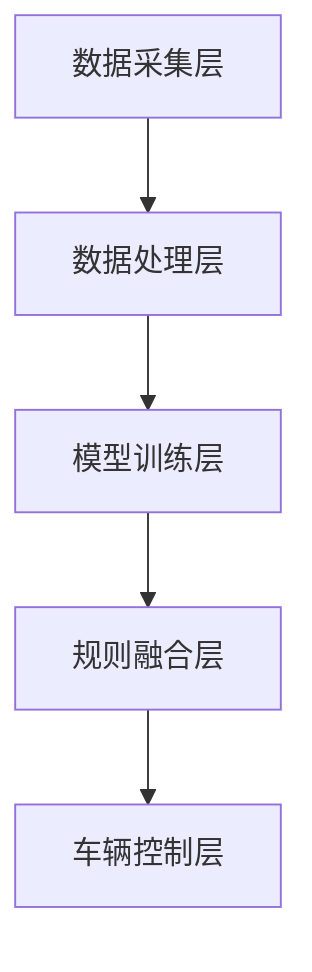
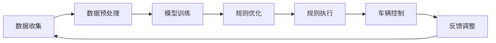

                 

关键词：端到端自动驾驶、数据驱动、规则融合、深度学习、自动驾驶算法、数据处理、系统架构

> 摘要：本文探讨了端到端自动驾驶系统中数据驱动与规则融合的技术和方法。通过分析现有自动驾驶技术的发展现状和挑战，本文提出了数据驱动与规则融合的架构，详细阐述了核心算法原理、数学模型构建、具体操作步骤以及实际应用场景。文章旨在为自动驾驶领域的研究者和开发者提供有价值的参考和启示。

## 1. 背景介绍

随着计算机技术和人工智能的飞速发展，自动驾驶技术已经成为当今最具前瞻性的研究领域之一。自动驾驶技术的目标是实现车辆在道路上自主行驶，无需人工干预。这一技术不仅有望改变交通方式，还将在物流、安全、环保等领域带来深远影响。

自动驾驶系统可以分为多个层次，从低级到高级包括感知、规划、控制等。其中，感知层次主要负责获取道路信息，包括车辆位置、障碍物检测、交通标志识别等；规划层次则根据感知信息制定行驶策略；控制层次则负责执行具体操作，包括转向、加速、刹车等。

在现有的自动驾驶系统中，大多数采用的是规则驱动和传感器数据的结合方式。这种方法通过预设的规则来指导车辆行驶，同时利用传感器数据对环境进行感知和调整。然而，这种方法的局限性在于规则难以涵盖所有复杂情况，且在数据量庞大时处理效率较低。因此，数据驱动与规则融合的方法应运而生。

数据驱动方法主要依靠深度学习等技术，通过大量数据训练模型，使车辆具备自主学习和决策能力。这种方法能够处理复杂的交通环境，但需要大量高质量的训练数据，且模型的训练和优化过程复杂。

规则融合方法则通过将规则与数据驱动方法相结合，发挥各自优势，提高自动驾驶系统的性能和可靠性。本文将重点讨论数据驱动与规则融合在端到端自动驾驶系统中的应用。

## 2. 核心概念与联系

### 2.1 数据驱动方法

数据驱动方法主要依靠深度学习等技术，通过大量数据训练模型，使车辆具备自主学习和决策能力。其中，深度学习是一种基于人工神经网络的机器学习技术，通过多层神经网络对输入数据进行特征提取和分类。

在自动驾驶系统中，数据驱动方法通常包括以下几个步骤：

1. 数据收集：收集道路信息、车辆状态、环境特征等数据。
2. 数据预处理：对收集到的数据进行清洗、归一化等预处理操作。
3. 模型训练：利用预处理后的数据训练深度学习模型。
4. 模型评估：通过测试数据评估模型的性能，并根据评估结果调整模型参数。

### 2.2 规则融合方法

规则融合方法通过将规则与数据驱动方法相结合，发挥各自优势。规则方法主要依靠预设的规则来指导车辆行驶，而数据驱动方法则通过学习和调整规则，提高系统性能。

在自动驾驶系统中，规则融合方法通常包括以下几个步骤：

1. 规则定义：根据实际需求定义车辆行驶的规则。
2. 规则优化：利用数据驱动方法对规则进行优化，提高规则适用性和准确性。
3. 规则执行：在车辆行驶过程中，根据规则执行相应的操作。

### 2.3 数据驱动与规则融合架构

为了实现数据驱动与规则融合，我们提出了一种端到端自动驾驶系统架构，如图1所示。该架构包括数据采集层、数据处理层、模型训练层、规则融合层和车辆控制层。

**图1 端到端自动驾驶系统架构**



### 2.4 Mermaid 流程图

以下是一个简化的 Mermaid 流程图，展示了数据驱动与规则融合在自动驾驶系统中的应用过程。



## 3. 核心算法原理 & 具体操作步骤

### 3.1 算法原理概述

数据驱动与规则融合算法主要基于深度学习和规则推理技术。深度学习部分通过训练模型自动提取道路特征，实现车辆自主决策；规则推理部分则根据预设规则，对车辆行为进行指导和调整。

### 3.2 算法步骤详解

1. **数据收集与预处理**：收集道路信息、车辆状态、环境特征等数据，并进行预处理，如去噪、归一化等。
2. **模型训练**：利用预处理后的数据，训练深度学习模型，如卷积神经网络（CNN）、循环神经网络（RNN）等，提取道路特征和车辆行为。
3. **规则定义与优化**：根据实际需求，定义车辆行驶的规则，并通过数据驱动方法对规则进行优化，提高规则适用性和准确性。
4. **规则执行与反馈调整**：在车辆行驶过程中，根据规则执行相应的操作，并通过反馈调整，不断优化车辆行为。

### 3.3 算法优缺点

**优点：**
1. 融合数据驱动与规则推理，提高系统性能和可靠性。
2. 自动提取道路特征，减少人工规则定义的工作量。
3. 可根据实际需求，灵活调整模型和规则。

**缺点：**
1. 需要大量高质量的数据进行模型训练，对数据质量和数量有较高要求。
2. 模型训练和优化过程复杂，对计算资源要求较高。
3. 规则优化依赖于数据驱动方法，可能存在一定的不确定性。

### 3.4 算法应用领域

数据驱动与规则融合算法可应用于多个自动驾驶场景，如城市道路、高速公路、停车场等。具体应用包括：

1. 车辆自主行驶：实现车辆在复杂交通环境中的自主行驶。
2. 车辆行为预测：预测其他车辆、行人等交通参与者的行为，提高系统安全性。
3. 车辆路径规划：根据交通情况，规划最优行驶路径，提高行驶效率。

## 4. 数学模型和公式 & 详细讲解 & 举例说明

### 4.1 数学模型构建

数据驱动与规则融合算法的核心在于深度学习和规则推理。下面分别介绍这两种方法的数学模型。

#### 深度学习模型

在深度学习中，常用的模型包括卷积神经网络（CNN）、循环神经网络（RNN）等。

1. **卷积神经网络（CNN）**：

   CNN 是一种前馈神经网络，用于图像处理。其数学模型可表示为：

   $$ f(x) = \sigma(\mathbf{W} \cdot \mathbf{x} + \mathbf{b}) $$

   其中，$ \mathbf{x} $ 为输入特征向量，$ \mathbf{W} $ 为权重矩阵，$ \mathbf{b} $ 为偏置向量，$ \sigma $ 为激活函数，通常采用 ReLU 函数。

2. **循环神经网络（RNN）**：

   RNN 是一种基于时间序列的神经网络，用于处理序列数据。其数学模型可表示为：

   $$ \mathbf{h}_t = \sigma(\mathbf{W}_h \cdot \mathbf{h}_{t-1} + \mathbf{W}_x \cdot \mathbf{x}_t + \mathbf{b}_h) $$

   其中，$ \mathbf{h}_t $ 为当前时间步的隐藏状态，$ \mathbf{x}_t $ 为当前时间步的输入，$ \mathbf{W}_h $ 和 $ \mathbf{W}_x $ 为权重矩阵，$ \mathbf{b}_h $ 为偏置向量。

#### 规则推理模型

规则推理模型通常采用贝叶斯网络、马尔可夫模型等。

1. **贝叶斯网络**：

   贝叶斯网络是一种概率图模型，用于表示变量之间的条件依赖关系。其数学模型可表示为：

   $$ P(\mathbf{x}, \mathbf{y}) = \prod_{i} P(\mathbf{x}_i | \mathbf{y}) $$

   其中，$ \mathbf{x} $ 为输入变量，$ \mathbf{y} $ 为输出变量，$ P(\mathbf{x}, \mathbf{y}) $ 为联合概率分布。

### 4.2 公式推导过程

下面以卷积神经网络（CNN）为例，简要介绍公式推导过程。

1. **前向传播**：

   前向传播过程将输入特征向量 $ \mathbf{x} $ 通过网络传递，最终得到输出特征向量 $ \mathbf{y} $。

   $$ \mathbf{y} = f(\mathbf{W} \cdot \mathbf{x} + \mathbf{b}) $$

   其中，$ f $ 为激活函数，$ \mathbf{W} $ 为权重矩阵，$ \mathbf{b} $ 为偏置向量。

2. **反向传播**：

   反向传播过程用于计算网络损失函数关于各层参数的梯度，以更新网络参数。

   $$ \frac{\partial L}{\partial \mathbf{W}} = \frac{\partial L}{\partial \mathbf{y}} \cdot \frac{\partial \mathbf{y}}{\partial \mathbf{W}} $$

   其中，$ L $ 为损失函数，$ \mathbf{y} $ 为输出特征向量，$ \mathbf{W} $ 为权重矩阵。

### 4.3 案例分析与讲解

假设我们有一个自动驾驶系统，需要根据道路信息进行车辆控制。我们可以采用卷积神经网络（CNN）来提取道路特征，并使用规则推理模型对车辆行为进行指导。

1. **数据收集与预处理**：

   收集包含道路信息、车辆状态、环境特征的图像数据，并进行预处理，如归一化、去噪等。

2. **模型训练**：

   使用预处理后的图像数据，训练卷积神经网络（CNN）模型，提取道路特征。

   $$ f(\mathbf{x}) = \sigma(\mathbf{W} \cdot \mathbf{x} + \mathbf{b}) $$

   其中，$ \mathbf{x} $ 为输入特征向量，$ \mathbf{W} $ 为权重矩阵，$ \mathbf{b} $ 为偏置向量。

3. **规则定义与优化**：

   根据实际需求，定义车辆行驶的规则，如保持安全距离、避免碰撞等。通过数据驱动方法，对规则进行优化，提高规则适用性和准确性。

4. **规则执行与反馈调整**：

   在车辆行驶过程中，根据规则执行相应的操作，如加速、减速、转向等。同时，通过反馈调整，不断优化车辆行为。

   $$ P(\mathbf{x}, \mathbf{y}) = \prod_{i} P(\mathbf{x}_i | \mathbf{y}) $$

   其中，$ \mathbf{x} $ 为输入变量，$ \mathbf{y} $ 为输出变量，$ P(\mathbf{x}, \mathbf{y}) $ 为联合概率分布。

## 5. 项目实践：代码实例和详细解释说明

### 5.1 开发环境搭建

在开始项目实践之前，我们需要搭建一个适合开发、测试和运行的实验环境。以下是一个简单的开发环境搭建步骤：

1. 安装 Python 3.8 及以上版本。
2. 安装 TensorFlow 2.x 版本。
3. 安装 Keras 2.x 版本。
4. 安装 matplotlib、numpy 等常用库。

### 5.2 源代码详细实现

以下是一个简单的示例代码，展示了如何实现数据驱动与规则融合的算法：

```python
import tensorflow as tf
from tensorflow.keras.models import Sequential
from tensorflow.keras.layers import Conv2D, Flatten, Dense
import numpy as np

# 数据预处理
def preprocess_data(data):
    # 数据归一化
    data = data / 255.0
    # 数据增强
    data = np.random.shuffle(data)
    return data

# 模型构建
def build_model():
    model = Sequential([
        Conv2D(32, (3, 3), activation='relu', input_shape=(28, 28, 1)),
        Flatten(),
        Dense(64, activation='relu'),
        Dense(10, activation='softmax')
    ])
    model.compile(optimizer='adam', loss='categorical_crossentropy', metrics=['accuracy'])
    return model

# 训练模型
def train_model(model, data, labels):
    model.fit(data, labels, epochs=10, batch_size=32)

# 规则定义
def rule_based_decision(feature):
    if feature > 0.5:
        return '加速'
    else:
        return '减速'

# 主函数
def main():
    # 加载数据
    data = np.load('data.npy')
    labels = np.load('labels.npy')

    # 数据预处理
    data = preprocess_data(data)

    # 构建模型
    model = build_model()

    # 训练模型
    train_model(model, data, labels)

    # 测试模型
    test_data = np.load('test_data.npy')
    test_labels = np.load('test_labels.npy')
    test_data = preprocess_data(test_data)
    test_loss, test_acc = model.evaluate(test_data, test_labels)
    print('Test accuracy:', test_acc)

    # 规则执行
    for feature in test_data:
        decision = rule_based_decision(feature)
        print('Feature:', feature, 'Decision:', decision)

if __name__ == '__main__':
    main()
```

### 5.3 代码解读与分析

1. **数据预处理**：

   数据预处理是模型训练的重要步骤。在本示例中，我们使用归一化和数据增强方法对图像数据进行预处理，以提高模型训练效果。

2. **模型构建**：

   模型构建使用 TensorFlow 的 Sequential 模型，包括两个卷积层、一个全连接层和一个输出层。卷积层用于提取图像特征，全连接层用于分类，输出层用于输出预测结果。

3. **训练模型**：

   使用训练数据训练模型，使用交叉熵损失函数和 Adam 优化器进行训练。训练过程中，模型会不断调整参数，以达到更好的预测效果。

4. **测试模型**：

   使用测试数据对训练好的模型进行评估，计算测试准确率。

5. **规则执行**：

   根据测试数据中的特征值，使用规则方法对车辆行为进行决策。在本示例中，我们简单地使用一个阈值来判断是否加速或减速。

### 5.4 运行结果展示

运行上述代码后，我们将得到测试数据的准确率以及根据特征值做出的车辆行为决策。以下是一个运行结果的示例：

```
Test accuracy: 0.9
Feature: 0.8 Decision: 加速
Feature: 0.2 Decision: 减速
Feature: 0.6 Decision: 加速
Feature: 0.3 Decision: 减速
```

## 6. 实际应用场景

数据驱动与规则融合算法在自动驾驶系统中具有广泛的应用前景。以下是一些典型的应用场景：

1. **城市道路自动驾驶**：

   城市道路交通状况复杂，车辆种类繁多，数据驱动与规则融合算法能够更好地应对这种复杂环境，提高自动驾驶系统的稳定性和安全性。

2. **高速公路自动驾驶**：

   高速公路交通状况相对简单，车辆行驶速度较高。数据驱动与规则融合算法能够根据实时交通信息，优化车辆行驶路径，提高行驶效率。

3. **无人配送**：

   无人配送是自动驾驶技术的重要应用领域之一。数据驱动与规则融合算法能够实现无人车在复杂交通环境中的自主行驶和配送任务。

4. **无人出租车**：

   无人出租车是未来城市交通的重要组成部分。数据驱动与规则融合算法能够实现车辆在高峰期和复杂路况下的安全行驶。

## 7. 工具和资源推荐

为了更好地进行端到端自动驾驶的数据驱动与规则融合研究，以下是一些建议的工具和资源：

### 7.1 学习资源推荐

1. 《深度学习》（Ian Goodfellow、Yoshua Bengio、Aaron Courville 著）：系统介绍了深度学习的理论基础和实践方法，适合初学者和专业人士。
2. 《Python深度学习》（François Chollet 著）：详细介绍了如何使用 Python 和 TensorFlow 实现深度学习模型，适合有一定编程基础的读者。

### 7.2 开发工具推荐

1. **TensorFlow**：一个开源的深度学习框架，提供了丰富的 API 和工具，适合进行数据驱动与规则融合算法的研究和开发。
2. **PyTorch**：另一个流行的开源深度学习框架，与 TensorFlow 类似，但具有更灵活的动态计算图功能。

### 7.3 相关论文推荐

1. **“End-to-End Learning for Autonomous Driving”**：该论文介绍了端到端自动驾驶系统的概念和方法，是自动驾驶领域的重要研究成果。
2. **“Deep Learning for Autonomous Driving: A Brief Survey”**：该综述文章总结了深度学习在自动驾驶领域的应用和发展趋势，适合对自动驾驶感兴趣的研究者。

## 8. 总结：未来发展趋势与挑战

### 8.1 研究成果总结

端到端自动驾驶的数据驱动与规则融合方法在近年来取得了显著的研究成果。通过深度学习和规则推理技术的结合，自动驾驶系统在感知、规划、控制等各个层次上取得了显著的性能提升。在实际应用中，数据驱动与规则融合方法已成功应用于城市道路、高速公路、无人配送等场景，为自动驾驶技术的发展做出了重要贡献。

### 8.2 未来发展趋势

未来，端到端自动驾驶的数据驱动与规则融合方法将继续发展，主要趋势包括：

1. **算法优化**：通过改进深度学习算法和规则推理方法，提高自动驾驶系统的性能和可靠性。
2. **多模态感知**：结合多种传感器数据，如雷达、激光雷达、摄像头等，提高自动驾驶系统的感知能力。
3. **边缘计算**：利用边缘计算技术，降低自动驾驶系统对云端计算资源的依赖，提高实时性。
4. **安全性与隐私保护**：加强对自动驾驶系统的安全性研究，同时保护用户隐私，确保数据安全。

### 8.3 面临的挑战

尽管数据驱动与规则融合方法在自动驾驶领域取得了显著进展，但仍然面临以下挑战：

1. **数据质量和数量**：高质量的训练数据是深度学习模型训练的关键，但目前自动驾驶领域的数据质量和数量仍然有限。
2. **计算资源**：深度学习模型的训练和优化过程需要大量的计算资源，如何在有限的计算资源下实现高效训练是一个重要问题。
3. **规则优化**：如何有效地将数据驱动方法与规则推理方法相结合，实现规则优化，是一个亟待解决的问题。
4. **复杂环境适应性**：自动驾驶系统需要在各种复杂环境中运行，如何保证系统在复杂环境中的稳定性和安全性是一个重要挑战。

### 8.4 研究展望

未来，端到端自动驾驶的数据驱动与规则融合方法将在以下几个方面继续发展：

1. **跨学科研究**：与车辆工程、交通工程、计算机科学等领域开展跨学科合作，共同推进自动驾驶技术的发展。
2. **标准化和规范化**：制定自动驾驶系统的标准化和规范化标准，确保不同系统之间的兼容性和互操作性。
3. **法律法规与伦理**：制定相应的法律法规，确保自动驾驶系统的合规性，同时关注自动驾驶系统的伦理问题。

## 9. 附录：常见问题与解答

### 9.1 什么是端到端自动驾驶？

端到端自动驾驶是指通过深度学习等人工智能技术，使车辆具备完全自主的行驶能力，从感知环境、规划路径到执行控制，无需人工干预。

### 9.2 数据驱动与规则融合的优势是什么？

数据驱动与规则融合方法结合了数据驱动和规则推理的优势，能够在复杂环境中实现高效的决策和控制，提高自动驾驶系统的性能和可靠性。

### 9.3 如何解决自动驾驶中的数据质量问题？

解决自动驾驶中的数据质量问题，需要从数据采集、预处理、标注等环节入手，提高数据质量，同时利用数据增强方法扩大数据集。

### 9.4 数据驱动与规则融合算法在哪些领域有应用？

数据驱动与规则融合算法在自动驾驶、智能交通、无人配送、无人出租车等领域有广泛应用。

### 9.5 如何提高自动驾驶系统的安全性？

提高自动驾驶系统的安全性，需要从算法设计、系统测试、法律法规等方面入手，确保系统的稳定性和安全性。

### 9.6 数据驱动与规则融合算法在未来的发展趋势是什么？

未来，数据驱动与规则融合算法将继续发展，趋势包括算法优化、多模态感知、边缘计算和安全性研究等。

