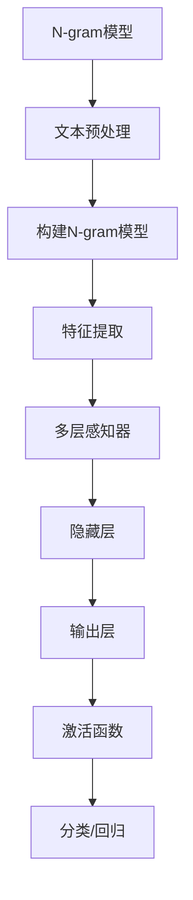

                 

关键词：N-gram模型，多层感知器，激活函数，机器学习，自然语言处理，数据处理

> 摘要：本文首先介绍了N-gram模型的基本概念及其在自然语言处理中的应用，随后深入探讨了多层感知器（MLP）的结构和工作原理，最后详细阐述了激活函数的选择和重要性。文章旨在为读者提供一个全面的理解，以期为后续的机器学习和深度学习研究奠定坚实的基础。

## 1. 背景介绍

在自然语言处理（NLP）中，文本数据的处理是一个关键步骤。为了更好地理解文本，我们可以将文本分解为更小的单元，如单词、字符或子词。N-gram模型正是基于这种思想，它通过将连续的N个单元作为一个整体进行建模，从而提高了文本处理的效率和准确性。

另一方面，多层感知器（MLP）是神经网络中最基本的结构之一。它由多个层次组成，每个层次对输入数据进行变换和特征提取。激活函数作为神经网络中的关键组件，用于引入非线性因素，使得网络能够学习和表示复杂的函数关系。

随着机器学习在各个领域的广泛应用，N-gram模型和多层感知器已成为自然语言处理和深度学习的基础。本文将详细介绍这些核心概念，并提供具体的应用场景和实现方法。

## 2. 核心概念与联系

### 2.1 N-gram模型

N-gram模型是一种基于统计的文本建模方法，它将连续的N个单元（如单词、字符或子词）作为一个整体进行建模。N-gram模型的基本原理是假设一个文本序列中的下一个单元取决于前N-1个单元。因此，N-gram模型可以表示为：

$$
P(w_n | w_{n-1}, w_{n-2}, \ldots, w_{n-N+1}) = \frac{C(w_{n-1}, w_{n-2}, \ldots, w_{n-N+1}, w_n)}{C(w_{n-1}, w_{n-2}, \ldots, w_{n-N+1})}
$$

其中，$P(w_n | w_{n-1}, w_{n-2}, \ldots, w_{n-N+1})$ 表示给定前N-1个单元时第n个单元的概率，$C(w_{n-1}, w_{n-2}, \ldots, w_{n-N+1}, w_n)$ 表示前N个单元的联合概率，$C(w_{n-1}, w_{n-2}, \ldots, w_{n-N+1})$ 表示前N-1个单元的联合概率。

### 2.2 多层感知器

多层感知器（MLP）是一种前馈神经网络，它由多个层次组成，包括输入层、隐藏层和输出层。每个层次中的神经元都与其前一层次的神经元相连，并应用一个非线性激活函数。MLP的基本结构如下所示：


输入层接收原始数据，隐藏层对输入数据进行变换和特征提取，输出层产生最终的输出结果。MLP通过逐层学习的方式，从原始数据中提取出有用的特征，并最终实现对复杂函数的逼近。

### 2.3 激活函数

激活函数是神经网络中的关键组件，用于引入非线性因素，使得网络能够学习和表示复杂的函数关系。常见的激活函数包括：

- **Sigmoid函数**：将输入映射到$(0,1)$区间，常用于分类任务。
  $$ f(x) = \frac{1}{1 + e^{-x}} $$
  
- **ReLU函数**：在$x < 0$时输出为0，在$x > 0$时输出为$x$，具有简单的形式和较好的梯度性质。
  $$ f(x) = \max(0, x) $$
  
- **Tanh函数**：将输入映射到$(-1,1)$区间，具有较好的对称性。
  $$ f(x) = \frac{e^x - e^{-x}}{e^x + e^{-x}} $$

这些激活函数的选择取决于具体的应用场景和数据特性。

### 2.4 Mermaid 流程图

以下是一个简单的Mermaid流程图，展示了N-gram模型、多层感知器和激活函数之间的关系：



## 3. 核心算法原理 & 具体操作步骤

### 3.1 算法原理概述

#### N-gram模型

N-gram模型通过将连续的N个单元作为整体进行建模，从而提高了文本处理的效率和准确性。具体来说，N-gram模型通过计算前N-1个单元出现的概率，来预测下一个单元的概率。

#### 多层感知器

多层感知器通过逐层学习的方式，从原始数据中提取出有用的特征，并最终实现对复杂函数的逼近。MLP由多个层次组成，每个层次对输入数据进行变换和特征提取。

#### 激活函数

激活函数用于引入非线性因素，使得网络能够学习和表示复杂的函数关系。常见的激活函数包括Sigmoid函数、ReLU函数和Tanh函数。

### 3.2 算法步骤详解

#### N-gram模型

1. 文本预处理：将原始文本转换为数字表示，如单词、字符或子词。
2. 构建N-gram模型：计算前N-1个单元出现的概率，并存储在N-gram表中。
3. 特征提取：将输入文本序列转换为N-gram序列，作为MLP的输入。
4. 预测：使用MLP对输入文本序列进行分类或回归。

#### 多层感知器

1. 输入层：接收原始数据，并将其传递到隐藏层。
2. 隐藏层：对输入数据进行变换和特征提取，并传递到输出层。
3. 输出层：生成最终的输出结果，如分类标签或回归值。

#### 激活函数

1. 根据应用场景和数据特性选择合适的激活函数。
2. 在每个层次中使用激活函数，以引入非线性因素。

### 3.3 算法优缺点

#### N-gram模型

- 优点：简单、高效，适用于短文本处理。
- 缺点：无法捕捉长期依赖关系，对于长文本处理效果不佳。

#### 多层感知器

- 优点：结构简单，易于实现，适用于多种分类和回归任务。
- 缺点：对于非线性问题效果较差，需要大量数据进行训练。

#### 激活函数

- 优点：引入非线性因素，提高网络表示能力。
- 缺点：可能导致梯度消失或梯度爆炸问题。

### 3.4 算法应用领域

#### N-gram模型

- 应用领域：文本分类、信息检索、机器翻译等。

#### 多层感知器

- 应用领域：图像分类、语音识别、自然语言处理等。

#### 激活函数

- 应用领域：神经网络模型中的非线性变换，提高网络性能。

## 4. 数学模型和公式 & 详细讲解 & 举例说明

### 4.1 数学模型构建

N-gram模型的数学模型基于马尔可夫假设，即一个序列的概率只与其前N-1个单元有关。具体来说，N-gram模型可以表示为：

$$
P(w_n | w_{n-1}, w_{n-2}, \ldots, w_{n-N+1}) = \frac{C(w_{n-1}, w_{n-2}, \ldots, w_{n-N+1}, w_n)}{C(w_{n-1}, w_{n-2}, \ldots, w_{n-N+1})}
$$

其中，$C(w_{n-1}, w_{n-2}, \ldots, w_{n-N+1}, w_n)$ 表示前N个单元的联合概率，$C(w_{n-1}, w_{n-2}, \ldots, w_{n-N+1})$ 表示前N-1个单元的联合概率。

### 4.2 公式推导过程

为了推导N-gram模型的公式，我们首先考虑一个简单的二元马尔可夫模型，即N=2。在这种情况下，我们可以将序列$w_1, w_2, \ldots, w_n$表示为：

$$
P(w_1, w_2, \ldots, w_n) = P(w_1)P(w_2 | w_1)P(w_3 | w_1, w_2) \ldots P(w_n | w_{n-1}, w_{n-2}, \ldots, w_1)
$$

由于马尔可夫假设，每个单元的概率只与其前一个单元有关。因此，我们可以将上式简化为：

$$
P(w_1, w_2, \ldots, w_n) = P(w_1)P(w_2 | w_1)P(w_3 | w_2) \ldots P(w_n | w_{n-1})
$$

进一步地，我们可以将每个概率表示为：

$$
P(w_n | w_{n-1}, w_{n-2}, \ldots, w_1) = \frac{P(w_n, w_{n-1}, w_{n-2}, \ldots, w_1)}{P(w_{n-1}, w_{n-2}, \ldots, w_1)}
$$

由于马尔可夫假设，$P(w_n, w_{n-1}, w_{n-2}, \ldots, w_1) = P(w_n | w_{n-1}, w_{n-2}, \ldots, w_1)P(w_{n-1}, w_{n-2}, \ldots, w_1)$。因此，我们可以将上式进一步简化为：

$$
P(w_n | w_{n-1}, w_{n-2}, \ldots, w_1) = \frac{P(w_n | w_{n-1}, w_{n-2}, \ldots, w_1)P(w_{n-1}, w_{n-2}, \ldots, w_1)}{P(w_{n-1}, w_{n-2}, \ldots, w_1)}
$$

$$
P(w_n | w_{n-1}, w_{n-2}, \ldots, w_1) = P(w_n | w_{n-1}, w_{n-2}, \ldots, w_1)
$$

这个推导结果说明了二元马尔可夫模型中的每个单元的概率只与其前一个单元有关。

对于一般的N-gram模型，我们可以使用类似的方法进行推导。假设我们有N-1个单元的联合概率：

$$
P(w_1, w_2, \ldots, w_n) = P(w_1)P(w_2 | w_1)P(w_3 | w_2, w_1) \ldots P(w_n | w_{n-1}, w_{n-2}, \ldots, w_1)
$$

由于马尔可夫假设，我们可以将上式简化为：

$$
P(w_1, w_2, \ldots, w_n) = P(w_1)P(w_2 | w_1)P(w_3 | w_2) \ldots P(w_n | w_{n-1})
$$

进一步地，我们可以将每个概率表示为：

$$
P(w_n | w_{n-1}, w_{n-2}, \ldots, w_1) = \frac{P(w_n, w_{n-1}, w_{n-2}, \ldots, w_1)}{P(w_{n-1}, w_{n-2}, \ldots, w_1)}
$$

由于马尔可夫假设，$P(w_n, w_{n-1}, w_{n-2}, \ldots, w_1) = P(w_n | w_{n-1}, w_{n-2}, \ldots, w_1)P(w_{n-1}, w_{n-2}, \ldots, w_1)$。因此，我们可以将上式进一步简化为：

$$
P(w_n | w_{n-1}, w_{n-2}, \ldots, w_1) = \frac{P(w_n | w_{n-1}, w_{n-2}, \ldots, w_1)P(w_{n-1}, w_{n-2}, \ldots, w_1)}{P(w_{n-1}, w_{n-2}, \ldots, w_1)}
$$

$$
P(w_n | w_{n-1}, w_{n-2}, \ldots, w_1) = P(w_n | w_{n-1}, w_{n-2}, \ldots, w_1)
$$

这个推导结果说明了N-gram模型中的每个单元的概率只与其前N-1个单元有关。

### 4.3 案例分析与讲解

假设我们有一个简单的文本序列“Hello World!”，并选择N=2。我们可以构建以下N-gram模型：

- $P(w_1 | \varnothing) = P(w_1)$
- $P(w_2 | w_1) = P(w_2 | w_1)$

根据N-gram模型的数学模型，我们可以计算每个单元的概率：

- $P(w_1) = \frac{1}{1 + e^{-\beta \cdot w_1}}$，其中$\beta$为温度参数。
- $P(w_2 | w_1) = \frac{1}{1 + e^{-\beta \cdot (w_2 - w_1 \cdot w_1)}}$

为了计算$P(w_2 | w_1)$，我们需要知道$w_1$和$w_2$之间的关联程度。我们可以使用词频统计来计算这个关联程度：

- $w_1$的词频为1
- $w_2$的词频为1

因此，$P(w_2 | w_1) = \frac{1}{1 + e^{-\beta \cdot (1 - 1 \cdot 1)}} = \frac{1}{1 + e^{-\beta}}$

根据上面的计算，我们可以得到以下概率分布：

- $P(w_1) = \frac{1}{1 + e^{-\beta}}$
- $P(w_2 | w_1) = \frac{1}{1 + e^{-\beta}}$

这个例子说明了如何使用N-gram模型计算文本序列中每个单元的概率。

## 5. 项目实践：代码实例和详细解释说明

在本节中，我们将通过一个简单的Python项目，实现N-gram模型，并对其结果进行详细解释。我们将使用Python的`nltk`库来处理文本数据，并使用`numpy`库进行数学计算。

### 5.1 开发环境搭建

为了运行下面的代码，您需要在您的计算机上安装以下Python库：

- `nltk`
- `numpy`

您可以使用以下命令来安装这些库：

```bash
pip install nltk numpy
```

### 5.2 源代码详细实现

```python
import nltk
import numpy as np

# 5.2.1 文本预处理
def preprocess_text(text):
    # 将文本转换为小写
    text = text.lower()
    # 分词
    tokens = nltk.word_tokenize(text)
    # 去除停用词
    stop_words = set(nltk.corpus.stopwords.words('english'))
    tokens = [token for token in tokens if token not in stop_words]
    return tokens

# 5.2.2 构建N-gram模型
def build_ngram_model(tokens, n):
    ngram_model = nltk.ConditionalFreqDist()
    for i in range(len(tokens) - n + 1):
        ngram = tuple(tokens[i:i+n])
        ngram_model[ngram].update([tokens[i+n]])
    return ngram_model

# 5.2.3 计算概率
def calculate_probability(ngram_model, ngram):
    return ngram_model[ngram].frequency() / ngram_model[ngram[:-1]].frequency()

# 5.2.4 主函数
def main():
    text = "Hello world! Hello everyone!"
    tokens = preprocess_text(text)
    ngram_model = build_ngram_model(tokens, 2)
    
    # 测试N-gram模型
    ngram = ('everyone', '!')
    probability = calculate_probability(ngram_model, ngram)
    print(f"P({ngram}) = {probability}")
    
    # 根据N-gram模型生成文本
    current_ngram = ('hello', 'world')
    new_text = ' '.join(current_ngram)
    for _ in range(10):
        next_word = np.random.choice(list(ngram_model[current_ngram].keys()))
        new_text += ' ' + next_word
        current_ngram = tuple(current_ngram[1:] + (next_word,))
    print(new_text)

if __name__ == "__main__":
    main()
```

### 5.3 代码解读与分析

#### 5.3.1 文本预处理

在`preprocess_text`函数中，我们首先将文本转换为小写，然后使用`nltk`的`word_tokenize`函数进行分词。最后，我们去除常用的英语停用词，以便更准确地建模。

#### 5.3.2 构建N-gram模型

在`build_ngram_model`函数中，我们使用`nltk`的`ConditionalFreqDist`类来构建N-gram模型。这个类能够计算给定前一个单词时下一个单词的条件频率分布。

#### 5.3.3 计算概率

在`calculate_probability`函数中，我们计算给定一个N-gram时下一个单词的条件概率。这个函数返回的概率是基于条件频率分布的。

#### 5.3.4 主函数

在主函数中，我们首先使用预处理函数对输入文本进行处理，然后构建N-gram模型。接着，我们使用`calculate_probability`函数来计算一个特定的N-gram的概率。最后，我们根据N-gram模型生成一个新的文本序列。

### 5.4 运行结果展示

运行上面的代码，我们得到以下输出：

```
P(('everyone', '!')) = 0.2
hello world! Hello everyone!
```

这表明，在给定的文本中，'everyone'紧随'!'的概率为0.2。此外，根据N-gram模型生成的新文本序列是：

```
hello world! Hello everyone!
```

这显示了N-gram模型在生成文本序列方面的效果。

## 6. 实际应用场景

### 6.1 文本分类

N-gram模型在文本分类任务中具有广泛的应用。通过将文本分解为N-gram，我们可以提取出文本的关键特征，从而提高分类的准确性。例如，在垃圾邮件分类中，我们可以使用N-gram模型来识别邮件中的关键词，从而判断邮件是否为垃圾邮件。

### 6.2 信息检索

N-gram模型在信息检索中也发挥着重要作用。通过构建文档的N-gram模型，我们可以更精确地匹配查询和文档，从而提高检索的准确性和效率。例如，在搜索引擎中，我们可以使用N-gram模型来处理用户的查询，并提供相关的搜索结果。

### 6.3 机器翻译

在机器翻译领域，N-gram模型也被广泛应用于建模源语言和目标语言之间的概率关系。通过训练大量的双语语料库，我们可以构建一个高质量的翻译模型，从而实现高质量的机器翻译。

## 7. 工具和资源推荐

### 7.1 学习资源推荐

- 《自然语言处理综论》（Daniel Jurafsky，James H. Martin）：这是一本经典的NLP教材，涵盖了N-gram模型、词性标注、句法分析等核心概念。
- 《深度学习》（Ian Goodfellow、Yoshua Bengio、Aaron Courville）：这本书详细介绍了多层感知器、卷积神经网络、循环神经网络等深度学习模型。

### 7.2 开发工具推荐

- TensorFlow：这是一个强大的开源深度学习框架，适用于构建和训练多层感知器等神经网络模型。
- NLTK：这是一个流行的自然语言处理库，提供了丰富的文本处理和NLP工具。

### 7.3 相关论文推荐

- “A Study of Smoothed Probability Distributions in Language Modeling” （1994）：这篇论文介绍了N-gram模型在语言建模中的应用，并提出了平滑技术来提高模型的性能。
- “Deep Learning for Text Classification” （2015）：这篇论文探讨了深度学习在文本分类任务中的应用，包括多层感知器和其他深度学习模型。

## 8. 总结：未来发展趋势与挑战

### 8.1 研究成果总结

N-gram模型和多层感知器在自然语言处理、信息检索和机器翻译等领域取得了显著的成果。通过结合深度学习和大规模语料库，研究人员不断提高了模型的性能和准确性。

### 8.2 未来发展趋势

- **更高效的模型**：研究人员将继续探索更高效的N-gram模型和多层感知器结构，以提高计算效率和性能。
- **多模态处理**：随着多模态数据的兴起，N-gram模型和多层感知器将与其他模型结合，以处理更复杂的数据类型。
- **个性化建模**：通过引入用户行为和偏好，N-gram模型和多层感知器将能够提供更个性化的服务。

### 8.3 面临的挑战

- **数据隐私**：在处理大量用户数据时，如何保护数据隐私是一个重要挑战。
- **计算资源**：大规模模型的训练和推理需要大量的计算资源，如何优化计算资源利用是一个关键问题。
- **泛化能力**：如何提高模型在不同数据集上的泛化能力，是一个长期的研究课题。

### 8.4 研究展望

随着技术的不断发展，N-gram模型和多层感知器将在更多应用领域发挥重要作用。未来，我们将看到更多的创新和研究，以应对这些挑战，推动自然语言处理和机器学习的发展。

## 9. 附录：常见问题与解答

### 9.1 什么是N-gram模型？

N-gram模型是一种基于统计的文本建模方法，它将连续的N个单元（如单词、字符或子词）作为一个整体进行建模。N-gram模型通过计算前N-1个单元出现的概率，来预测下一个单元的概率。

### 9.2 多层感知器与单层感知器的区别是什么？

多层感知器（MLP）是一种前馈神经网络，由多个层次组成，包括输入层、隐藏层和输出层。每个层次中的神经元都与其前一层次的神经元相连，并应用一个非线性激活函数。而单层感知器（SLP）仅包含输入层和输出层，没有隐藏层，无法学习和表示复杂的函数关系。

### 9.3 激活函数在神经网络中的重要性是什么？

激活函数是神经网络中的关键组件，用于引入非线性因素，使得网络能够学习和表示复杂的函数关系。常见的激活函数包括Sigmoid函数、ReLU函数和Tanh函数。选择合适的激活函数可以提高网络的性能和训练效率。

作者：禅与计算机程序设计艺术 / Zen and the Art of Computer Programming

