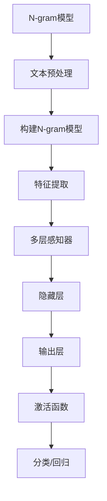

                 

关键词：N-gram模型，多层感知器，激活函数，机器学习，自然语言处理，数据处理

> 摘要：本文首先介绍了N-gram模型的基本概念及其在自然语言处理中的应用，随后深入探讨了多层感知器（MLP）的结构和工作原理，最后详细阐述了激活函数的选择和重要性。文章旨在为读者提供一个全面的理解，以期为后续的机器学习和深度学习研究奠定坚实的基础。

## 1. 背景介绍

在自然语言处理（NLP）中，文本数据的处理是一个关键步骤。为了更好地理解文本，我们可以将文本分解为更小的单元，如单词、字符或子词。N-gram模型正是基于这种思想，它通过将连续的N个单元作为一个整体进行建模，从而提高了文本处理的效率和准确性。

另一方面，多层感知器（MLP）是神经网络中最基本的结构之一。它由多个层次组成，每个层次对输入数据进行变换和特征提取。激活函数作为神经网络中的关键组件，用于引入非线性因素，使得网络能够学习和表示复杂的函数关系。

随着机器学习在各个领域的广泛应用，N-gram模型和多层感知器已成为自然语言处理和深度学习的基础。本文将详细介绍这些核心概念，并提供具体的应用场景和实现方法。

## 2. 核心概念与联系

### 2.1 N-gram模型

N-gram模型是一种基于统计的文本建模方法，它将连续的N个单元（如单词、字符或子词）作为一个整体进行建模。N-gram模型的基本原理是假设一个文本序列中的下一个单元取决于前N-1个单元。因此，N-gram模型可以表示为：

$$
P(w_n | w_{n-1}, w_{n-2}, \ldots, w_{n-N+1}) = \frac{C(w_{n-1}, w_{n-2}, \ldots, w_{n-N+1}, w_n)}{C(w_{n-1}, w_{n-2}, \ldots, w_{n-N+1})}
$$

其中，$P(w_n | w_{n-1}, w_{n-2}, \ldots, w_{n-N+1})$ 表示给定前N-1个单元时第n个单元的概率，$C(w_{n-1}, w_{n-2}, \ldots, w_{n-N+1}, w_n)$ 表示前N个单元的联合概率，$C(w_{n-1}, w_{n-2}, \ldots, w_{n-N+1})$ 表示前N-1个单元的联合概率。

### 2.2 多层感知器

多层感知器（MLP）是一种前馈神经网络，它由多个层次组成，包括输入层、隐藏层和输出层。每个层次中的神经元都与其前一层次的神经元相连，并应用一个非线性激活函数。MLP的基本结构如下所示：

输入层接收原始数据，隐藏层对输入数据进行变换和特征提取，输出层产生最终的输出结果。MLP通过逐层学习的方式，从原始数据中提取出有用的特征，并最终实现对复杂函数的逼近。

### 2.3 激活函数

激活函数是神经网络中的关键组件，用于引入非线性因素，使得网络能够学习和表示复杂的函数关系。常见的激活函数包括：

- **Sigmoid函数**：将输入映射到$(0,1)$区间，常用于分类任务。
  $$ f(x) = \frac{1}{1 + e^{-x}} $$
  
- **ReLU函数**：在$x < 0$时输出为0，在$x > 0$时输出为$x$，具有简单的形式和较好的梯度性质。
  $$ f(x) = \max(0, x) $$
  
- **Tanh函数**：将输入映射到$(-1,1)$区间，具有较好的对称性。
  $$ f(x) = \frac{e^x - e^{-x}}{e^x + e^{-x}} $$

这些激活函数的选择取决于具体的应用场景和数据特性。

### 2.4 Mermaid 流程图

以下是一个简单的Mermaid流程图，展示了N-gram模型、多层感知器和激活函数之间的关系：

## 3. 核心算法原理 & 具体操作步骤

### 3.1 算法原理概述

#### N-gram模型

N-gram模型通过将连续的N个单元作为整体进行建模，从而提高了文本处理的效率和准确性。具体来说，N-gram模型通过计算前N-1个单元出现的概率，来预测下一个单元的概率。

#### 多层感知器

多层感知器通过逐层学习的方式，从原始数据中提取出有用的特征，并最终实现对复杂函数的逼近。MLP由多个层次组成，每个层次对输入数据进行变换和特征提取。

#### 激活函数

激活函数用于引入非线性因素，使得网络能够学习和表示复杂的函数关系。常见的激活函数包括Sigmoid函数、ReLU函数和Tanh函数。

### 3.2 算法步骤详解

#### N-gram模型

1. 文本预处理：将原始文本转换为数字表示，如单词、字符或子词。
2. 构建N-gram模型：计算前N-1个单元出现的概率，并存储在N-gram表中。
3. 特征提取：将输入文本序列转换为N-gram序列，作为MLP的输入。
4. 预测：使用MLP对输入文本序列进行分类或回归。

#### 多层感知器

1. 输入层：接收原始数据，并将其传递到隐藏层。
2. 隐藏层：对输入数据进行变换和特征提取，并传递到输出层。
3. 输出层：生成最终的输出结果，如分类标签或回归值。

#### 激活函数

1. 根据应用场景和数据特性选择合适的激活函数。
2. 在每个层次中使用激活函数，以引入非线性因素。

### 3.3 算法优缺点

#### N-gram模型

- 优点：简单、高效，适用于短文本处理。
- 缺点：无法捕捉长期依赖关系，对于长文本处理效果不佳。

#### 多层感知器

- 优点：结构简单，易于实现，适用于多种分类和回归任务。
- 缺点：对于非线性问题效果较差，需要大量数据进行训练。

#### 激活函数

- 优点：引入非线性因素，提高网络表示能力。
- 缺点：可能导致梯度消失或梯度爆炸问题。

### 3.4 算法应用领域

#### N-gram模型

- 应用领域：文本分类、信息检索、机器翻译等。

#### 多层感知器

- 应用领域：图像分类、语音识别、自然语言处理等。

#### 激活函数

- 应用领域：神经网络模型中的非线性变换，提高网络性能。

## 4. 数学模型和公式 & 详细讲解 & 举例说明

### 4.1 数学模型构建

N-gram模型的数学模型基于马尔可夫假设，即一个序列的概率只与其前N-1个单元有关。具体来说，N-gram模型可以表示为：

$$
P(w_n | w_{n-1}, w_{n-2}, \ldots, w_{n-N+1}) = \frac{C(w_{n-1}, w_{n-2}, \ldots, w_{n-N+1}, w_n)}{C(w_{n-1}, w_{n-2}, \ldots, w_{n-N+1})}
$$

其中，$C(w_{n-1}, w_{n-2}, \ldots, w_{n-N+1}, w_n)$ 表示前N个单元的联合概率，$C(w_{n-1}, w_{n-2}, \ldots, w_{n-N+1})$ 表示前N-1个单元的联合概率。

### 4.2 公式推导过程

为了推导N-gram模型的公式，我们首先考虑一个简单的二元马尔可夫模型，即N=2。在这种情况下，我们可以将序列$w_1, w_2, \ldots, w_n$表示为：

$$
P(w_1, w_2, \ldots, w_n) = P(w_1)P(w_2 | w_1)P(w_3 | w_1, w_2) \ldots P(w_n | w_{n-1}, w_{n-2}, \ldots, w_1)
$$

由于马尔可夫假设，每个单元的概率只与其前一个单元有关。因此，我们可以将上式简化为：

$$
P(w_1, w_2, \ldots, w_n) = P(w_1)P(w_2 | w_1)P(w_3 | w_2) \ldots P(w_n | w_{n-1})
$$

进一步地，我们可以将每个概率表示为：

$$
P(w_n | w_{n-1}, w_{n-2}, \ldots, w_1) = \frac{P(w_n, w_{n-1}, w_{n-2}, \ldots, w_1)}{P(w_{n-1}, w_{n-2}, \ldots, w_1)}
$$

由于马尔可夫假设，$P(w_n, w_{n-1}, w_{n-2}, \ldots, w_1) = P(w_n | w_{n-1}, w_{n-2}, \ldots, w_1)P(w_{n-1}, w_{n-2}, \ldots, w_1)$。因此，我们可以将上式进一步简化为：

$$
P(w_n | w_{n-1}, w_{n-2}, \ldots, w_1) = \frac{P(w_n | w_{n-1}, w_{n-2}, \ldots, w_1)P(w_{n-1}, w_{n-2}, \ldots, w_1)}{P(w_{n-1}, w_{n-2}, \ldots, w_1)}
$$

$$
P(w_n | w_{n-1}, w_{n-2}, \ldots, w_1) = P(w_n | w_{n-1}, w_{n-2}, \ldots, w_1)
$$

这个推导结果说明了二元马尔可夫模型中的每个单元的概率只与其前一个单元有关。

对于一般的N-gram模型，我们可以使用类似的方法进行推导。假设我们有N-