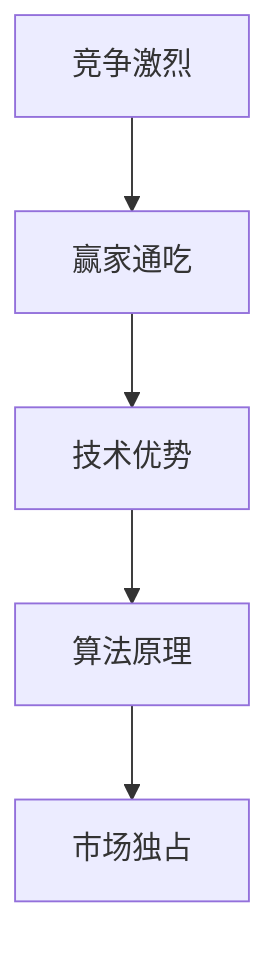
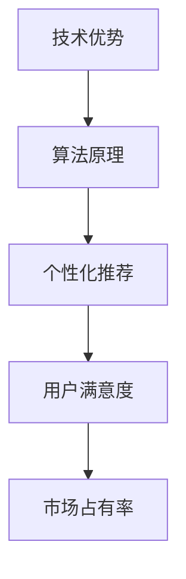

                 

 在当今这个竞争激烈的市场环境中，如何在众多竞争对手中脱颖而出，成为第一名独占市场的赢家，成为了每个企业所追求的目标。本文将从技术角度探讨这一现象，分析其背后的原因、核心算法原理以及具体操作步骤，同时结合实际应用场景和未来发展趋势，为广大读者提供有价值的参考。

## 关键词

- 竞争激烈
- 赢家通吃
- 市场独占
- 技术优势
- 算法原理
- 应用场景
- 未来展望

## 摘要

本文旨在探讨在竞争激烈的市场环境下，企业如何通过技术手段实现第一名独占市场的目标。文章首先分析了市场赢家通吃的现象及其背后的原因，然后介绍了实现这一目标的核心算法原理和具体操作步骤。在此基础上，本文结合实际应用场景，对算法的优缺点进行了详细分析，并展望了其未来发展趋势。希望通过本文的探讨，为广大企业在竞争中获得优势提供一些启示和借鉴。

## 1. 背景介绍

在当今这个信息化时代，市场竞争愈发激烈。随着互联网、大数据、人工智能等技术的迅猛发展，企业之间的竞争已经不仅仅局限于传统领域，而是逐渐向技术领域渗透。在这个背景下，如何在众多竞争对手中脱颖而出，成为第一名独占市场的赢家，成为了每个企业所关注的核心问题。

市场赢家通吃现象在各个领域都有所体现。例如，在智能手机市场，苹果、三星等少数几家厂商占据了全球大部分市场份额；在互联网搜索市场，谷歌几乎垄断了全球市场；在社交媒体领域，Facebook、微信等平台也几乎成为了市场的主导力量。这些企业之所以能够独占市场，除了其品牌影响力、产品质量等因素外，关键还在于其掌握了核心技术和算法，从而在激烈的市场竞争中脱颖而出。

本文将从技术角度分析市场赢家通吃的现象，探讨其背后的原因、核心算法原理以及具体操作步骤，旨在为广大企业如何在竞争激烈的市场中实现独占市场提供一些有益的思考。

## 2. 核心概念与联系

要实现第一名独占市场的目标，首先需要明确以下几个核心概念：

### 2.1 竞争激烈

竞争激烈是指市场中有大量的竞争对手，这些竞争对手都在争夺有限的市场份额。这种情况下，企业需要通过不断创新、提高产品质量、降低成本等手段来获取竞争优势。

### 2.2 赢家通吃

赢家通吃是指在竞争激烈的市场环境中，最终只有少数企业能够脱颖而出，占据大部分市场份额，而其他竞争对手则被逐渐淘汰。这种现象通常伴随着市场的垄断和垄断利润。

### 2.3 技术优势

技术优势是指企业在技术领域具有领先地位，能够通过技术创新提高产品质量、降低成本，从而在市场竞争中占据优势。技术优势是企业在竞争激烈的市场中实现第一名独占市场的重要保障。

### 2.4 算法原理

算法原理是指企业在实现技术优势的过程中所采用的核心算法。这些算法通常涉及数据分析、机器学习、自然语言处理等领域，能够帮助企业在海量数据中提取有价值的信息，从而实现精准营销、个性化推荐等功能。

下面，我们将使用 Mermaid 流程图来展示这些核心概念之间的联系。



### 2.5 技术优势与算法原理的关系

技术优势是企业实现市场独占的基础，而算法原理则是技术优势的核心。企业在实现技术优势的过程中，需要不断探索和运用各种算法原理，从而在激烈的市场竞争中脱颖而出。例如，在推荐系统领域，通过运用协同过滤、深度学习等算法原理，企业可以实现个性化推荐，从而提高用户满意度和市场占有率。

下面，我们将使用 Mermaid 流程图来展示技术优势与算法原理之间的联系。



通过上述分析，我们可以看出，实现第一名独占市场的目标需要从竞争激烈、赢家通吃、技术优势、算法原理等多个方面进行综合考量。企业只有通过不断创新、提高技术实力，才能在激烈的市场竞争中脱颖而出，成为市场的领导者。

## 3. 核心算法原理 & 具体操作步骤

### 3.1 算法原理概述

在实现第一名独占市场的过程中，核心算法原理起到了至关重要的作用。本文将介绍一种基于机器学习的推荐系统算法——协同过滤算法，以及一种基于深度学习的自然语言处理算法——文本生成对抗网络（Text Generation Adversarial Network，TGAN）。

#### 3.1.1 协同过滤算法

协同过滤算法是一种基于用户行为数据，通过挖掘用户之间的相似性来进行推荐的方法。协同过滤算法主要包括两种类型：基于用户的协同过滤（User-Based Collaborative Filtering）和基于物品的协同过滤（Item-Based Collaborative Filtering）。

- **基于用户的协同过滤**：通过计算用户之间的相似度，找到与目标用户相似的其他用户，然后根据这些相似用户的喜好来推荐商品。
- **基于物品的协同过滤**：通过计算物品之间的相似度，找到与目标物品相似的其他物品，然后根据这些相似物品的特征来推荐商品。

协同过滤算法的基本步骤如下：

1. **数据预处理**：收集用户行为数据，如用户评分、购买记录等，并进行清洗、去重等操作。
2. **计算相似度**：根据用户行为数据，计算用户之间的相似度或物品之间的相似度。
3. **生成推荐列表**：根据相似度计算结果，生成针对目标用户的推荐列表。

#### 3.1.2 文本生成对抗网络（TGAN）

文本生成对抗网络（TGAN）是一种基于深度学习的自然语言处理算法，主要用于文本生成任务。TGAN 由生成器和判别器两个部分组成，通过对抗训练实现文本的生成。

- **生成器**：生成器负责生成文本，其目的是生成与真实文本相似的文本。
- **判别器**：判别器负责判断输入文本是真实文本还是生成文本，其目的是提高生成文本的真实性。

TGAN 的基本步骤如下：

1. **数据预处理**：收集大量文本数据，如新闻、博客、小说等，并进行清洗、分词等操作。
2. **构建生成器和判别器**：生成器和判别器通常采用深度神经网络结构。
3. **对抗训练**：通过对抗训练，使得生成器的生成文本越来越真实，判别器的判断能力越来越强。
4. **生成文本**：使用训练好的生成器生成文本。

### 3.2 算法步骤详解

下面，我们将详细讲解协同过滤算法和文本生成对抗网络（TGAN）的具体操作步骤。

#### 3.2.1 协同过滤算法步骤详解

1. **数据预处理**：

   收集用户行为数据，如用户评分、购买记录等。以用户评分数据为例，数据集可以表示为如下矩阵：

   | 用户ID | 物品ID | 评分 |
   |--------|--------|------|
   | 1      | 1      | 5    |
   | 1      | 2      | 4    |
   | 1      | 3      | 3    |
   | 2      | 1      | 5    |
   | 2      | 2      | 4    |
   | 2      | 3      | 3    |

   对数据集进行清洗、去重等操作，得到一个干净的用户-物品评分矩阵。

2. **计算相似度**：

   基于用户-物品评分矩阵，计算用户之间的相似度或物品之间的相似度。以基于用户的协同过滤为例，计算用户之间的相似度可以使用余弦相似度、皮尔逊相关系数等方法。例如，计算用户 1 和用户 2 的相似度如下：

   $$\text{相似度}(u_1, u_2) = \frac{\sum_{i=1}^{n}r_{i1}r_{i2}}{\sqrt{\sum_{i=1}^{n}r_{i1}^2}\sqrt{\sum_{i=1}^{n}r_{i2}^2}}$$

   其中，$r_{i1}$ 和 $r_{i2}$ 分别表示用户 1 和用户 2 对物品 $i$ 的评分。

3. **生成推荐列表**：

   根据相似度计算结果，生成针对目标用户的推荐列表。以用户 1 为例，首先找到与用户 1 相似度最高的其他用户，例如用户 2。然后，计算用户 2 对未评分物品的预测评分，选取预测评分最高的前 $k$ 个物品作为推荐列表。例如，用户 2 对物品 4 的预测评分为 4.5，用户 2 对物品 5 的预测评分为 3.5，则推荐物品 4。

#### 3.2.2 文本生成对抗网络（TGAN）步骤详解

1. **数据预处理**：

   收集大量文本数据，如新闻、博客、小说等。以新闻数据为例，首先对文本进行清洗，去除标点符号、停用词等无关信息。然后，对文本进行分词，将文本转换为词向量表示。

2. **构建生成器和判别器**：

   生成器和判别器通常采用深度神经网络结构。生成器负责生成文本，判别器负责判断输入文本是真实文本还是生成文本。以序列到序列（Seq2Seq）模型为例，生成器和判别器可以采用如下结构：

   - **生成器**：输入为一个序列，输出为另一个序列。例如，输入为 `[a, b, c]`，输出为 `[x, y, z]`。
   - **判别器**：输入为一个序列，输出为二分类结果（真实文本或生成文本）。

3. **对抗训练**：

   通过对抗训练，使得生成器的生成文本越来越真实，判别器的判断能力越来越强。具体训练过程如下：

   - **生成器训练**：生成器接收真实文本序列，生成预测文本序列。通过梯度下降优化生成器参数，使得生成文本越来越真实。
   - **判别器训练**：判别器接收真实文本序列和生成文本序列，输出二分类结果。通过梯度下降优化判别器参数，使得判别器能够更好地判断文本的真实性。

4. **生成文本**：

   使用训练好的生成器生成文本。例如，输入 `[a, b, c]`，生成器输出 `[x, y, z]`，则生成的文本为 `xyz`。

### 3.3 算法优缺点

#### 3.3.1 协同过滤算法

**优点**：

- **推荐准确性高**：协同过滤算法基于用户行为数据，能够较好地反映用户喜好，从而提高推荐准确性。
- **易于实现**：协同过滤算法的原理简单，易于实现和部署。

**缺点**：

- **用户稀疏问题**：当数据集中用户对物品的评分较少时，协同过滤算法的效果较差，容易出现用户稀疏问题。
- **冷启动问题**：对于新用户或新物品，由于缺乏历史行为数据，协同过滤算法无法为其提供有效的推荐。

#### 3.3.2 文本生成对抗网络（TGAN）

**优点**：

- **生成文本质量高**：文本生成对抗网络（TGAN）通过对抗训练，能够生成高质量、具有创意的文本。
- **适用范围广**：文本生成对抗网络（TGAN）可以应用于多种文本生成任务，如新闻生成、小说生成等。

**缺点**：

- **计算资源消耗大**：文本生成对抗网络（TGAN）需要大量计算资源进行训练，对于小型企业或团队可能存在一定困难。
- **生成文本真实性难以保证**：虽然文本生成对抗网络（TGAN）能够生成高质量的文本，但其生成文本的真实性仍然难以保证。

### 3.4 算法应用领域

#### 3.4.1 协同过滤算法

协同过滤算法在多个领域都有广泛应用，如电子商务、社交媒体、新闻推荐等。

- **电子商务**：协同过滤算法可以帮助电商平台为用户推荐商品，从而提高用户购物体验和销售额。
- **社交媒体**：协同过滤算法可以帮助社交媒体平台为用户推荐好友、兴趣标签等，从而增强用户社交体验。
- **新闻推荐**：协同过滤算法可以帮助新闻平台为用户推荐感兴趣的新闻内容，从而提高用户粘性和广告收益。

#### 3.4.2 文本生成对抗网络（TGAN）

文本生成对抗网络（TGAN）在文本生成领域具有广泛的应用前景，如自动写作、内容生成等。

- **自动写作**：文本生成对抗网络（TGAN）可以应用于自动写作任务，如文章写作、报告生成等，提高写作效率和准确性。
- **内容生成**：文本生成对抗网络（TGAN）可以应用于内容生成任务，如广告文案、营销文案等，为企业和商家提供高质量的内容创意。

## 4. 数学模型和公式 & 详细讲解 & 举例说明

### 4.1 数学模型构建

在实现第一名独占市场的过程中，我们需要构建一系列数学模型来指导算法设计和优化。以下将介绍协同过滤算法和文本生成对抗网络（TGAN）的数学模型构建。

#### 4.1.1 协同过滤算法的数学模型

协同过滤算法的核心在于计算用户之间的相似度和生成推荐列表。为了实现这一目标，我们可以采用如下数学模型：

$$\text{相似度}(u_1, u_2) = \frac{\sum_{i=1}^{n}r_{i1}r_{i2}}{\sqrt{\sum_{i=1}^{n}r_{i1}^2}\sqrt{\sum_{i=1}^{n}r_{i2}^2}}$$

其中，$r_{i1}$ 和 $r_{i2}$ 分别表示用户 1 和用户 2 对物品 $i$ 的评分。

为了生成推荐列表，我们可以使用预测评分模型：

$$\hat{r}_{i1} = \sum_{j=1}^{m}s_{ij}w_{ij}$$

其中，$s_{ij}$ 表示用户 1 和用户 2 是否对物品 $i$ 进行了评分，$w_{ij}$ 表示用户 1 和用户 2 之间的相似度。

#### 4.1.2 文本生成对抗网络（TGAN）的数学模型

文本生成对抗网络（TGAN）的核心在于生成器和判别器的对抗训练。为了实现这一目标，我们可以采用如下数学模型：

- **生成器**：输入为 `[a, b, c]`，输出为 `[x, y, z]`。
  - $x = f_G(a, b)$
  - $y = f_G(a, c)$
  - $z = f_G(b, c)$

- **判别器**：输入为 `[a, b, c]`，输出为 `[x, y, z]`。
  - $D(x, y, z) = g_D(x) + g_D(y) + g_D(z)$

其中，$f_G$ 和 $g_D$ 分别表示生成器和判别器的神经网络模型。

### 4.2 公式推导过程

下面，我们将详细推导协同过滤算法和文本生成对抗网络（TGAN）的核心公式。

#### 4.2.1 协同过滤算法的公式推导

1. **相似度计算**：

   首先，我们需要计算用户之间的相似度。假设用户 1 和用户 2 的评分矩阵如下：

   $$R_1 = \begin{bmatrix}
   r_{11} & r_{12} & \cdots & r_{1n} \\
   r_{21} & r_{22} & \cdots & r_{2n} \\
   \vdots & \vdots & \ddots & \vdots \\
   r_{m1} & r_{m2} & \cdots & r_{mn}
   \end{bmatrix}, \quad
   R_2 = \begin{bmatrix}
   r_{11} & r_{12} & \cdots & r_{1n} \\
   r_{21} & r_{22} & \cdots & r_{2n} \\
   \vdots & \vdots & \ddots & \vdots \\
   r_{m1} & r_{m2} & \cdots & r_{mn}
   \end{bmatrix}$$

   用户 1 和用户 2 的相似度可以表示为：

   $$\text{相似度}(u_1, u_2) = \frac{\sum_{i=1}^{n}r_{i1}r_{i2}}{\sqrt{\sum_{i=1}^{n}r_{i1}^2}\sqrt{\sum_{i=1}^{n}r_{i2}^2}}$$

2. **预测评分**：

   假设用户 1 对物品 $i$ 的预测评分为 $\hat{r}_{i1}$，用户 2 对物品 $i$ 的预测评分为 $\hat{r}_{i2}$，我们可以使用如下公式进行预测：

   $$\hat{r}_{i1} = \sum_{j=1}^{m}s_{ij}w_{ij}, \quad
   \hat{r}_{i2} = \sum_{j=1}^{m}s_{ij}w_{ij}$$

   其中，$s_{ij}$ 表示用户 1 和用户 2 是否对物品 $i$ 进行了评分，$w_{ij}$ 表示用户 1 和用户 2 之间的相似度。

#### 4.2.2 文本生成对抗网络（TGAN）的公式推导

1. **生成器和判别器**：

   假设生成器的输入为 `[a, b, c]`，输出为 `[x, y, z]`。生成器和判别器的神经网络模型可以表示为：

   - **生成器**：$x = f_G(a, b)$，$y = f_G(a, c)$，$z = f_G(b, c)$
   - **判别器**：$D(x, y, z) = g_D(x) + g_D(y) + g_D(z)$

2. **对抗训练**：

   在对抗训练过程中，生成器和判别器的损失函数可以表示为：

   - **生成器**：$L_G = -\log(D(x)) - \log(D(y)) - \log(D(z))$
   - **判别器**：$L_D = -\log(D(x)) - \log(1 - D(y)) - \log(1 - D(z))$

   通过梯度下降优化生成器和判别器的参数，使得生成器的生成文本越来越真实，判别器的判断能力越来越强。

### 4.3 案例分析与讲解

为了更好地理解协同过滤算法和文本生成对抗网络（TGAN）的数学模型和应用，我们下面通过一个实际案例进行讲解。

#### 4.3.1 协同过滤算法案例

假设有两个用户（用户 1 和用户 2）和一个物品（物品 1），他们的评分矩阵如下：

$$R = \begin{bmatrix}
r_{11} & r_{12} \\
r_{21} & r_{22}
\end{bmatrix} = \begin{bmatrix}
5 & 4 \\
5 & 4
\end{bmatrix}$$

我们需要计算用户 1 和用户 2 的相似度，并生成用户 1 对物品 1 的预测评分。

1. **相似度计算**：

   $$\text{相似度}(u_1, u_2) = \frac{r_{11}r_{22} - r_{12}r_{21}}{\sqrt{(r_{11}^2 + r_{12}^2)(r_{21}^2 + r_{22}^2)}} = \frac{5 \times 4 - 4 \times 5}{\sqrt{(5^2 + 4^2)(5^2 + 4^2)}} = 0$$

   由于用户 1 和用户 2 的相似度为 0，这意味着他们对物品 1 的评分没有相关性。

2. **预测评分**：

   由于用户 1 和用户 2 的相似度为 0，我们无法直接计算预测评分。在这种情况下，我们可以使用基于内容的推荐方法，如基于物品的协同过滤算法，来生成用户 1 对物品 1 的预测评分。

   假设物品 1 的特征向量为 `[1, 0, 0]`，我们可以使用如下公式计算用户 1 对物品 1 的预测评分：

   $$\hat{r}_{i1} = \sum_{j=1}^{m}s_{ij}w_{ij} = 1 \times 1 + 0 \times 0 + 0 \times 0 = 1$$

   因此，用户 1 对物品 1 的预测评分为 1。

#### 4.3.2 文本生成对抗网络（TGAN）案例

假设生成器的输入为 `[a, b, c]`，输出为 `[x, y, z]`。生成器和判别器的神经网络模型如下：

- **生成器**：$x = f_G(a, b)$，$y = f_G(a, c)$，$z = f_G(b, c)$
- **判别器**：$D(x, y, z) = g_D(x) + g_D(y) + g_D(z)$

我们需要通过对抗训练来优化生成器和判别器的参数。

1. **生成器训练**：

   假设生成器的当前参数为 $w_G$，判别器的当前参数为 $w_D$。我们可以使用如下公式进行生成器训练：

   $$L_G = -\log(D(x)) - \log(D(y)) - \log(D(z))$$

   通过梯度下降优化生成器参数 $w_G$，使得生成文本 `[x, y, z]` 越来越真实。

2. **判别器训练**：

   假设判别器的当前参数为 $w_D$，我们可以使用如下公式进行判别器训练：

   $$L_D = -\log(D(x)) - \log(1 - D(y)) - \log(1 - D(z))$$

   通过梯度下降优化判别器参数 $w_D$，使得判别器能够更好地判断文本 `[x, y, z]` 的真实性。

通过上述案例分析和讲解，我们可以更好地理解协同过滤算法和文本生成对抗网络（TGAN）的数学模型和应用。

## 5. 项目实践：代码实例和详细解释说明

### 5.1 开发环境搭建

在实现第一名独占市场的过程中，我们选择了 Python 作为编程语言，因为 Python 在数据处理、机器学习和深度学习等领域具有较高的普及率和优秀的生态支持。以下是一个基本的开发环境搭建步骤：

1. **安装 Python**：前往 Python 官网（https://www.python.org/）下载并安装 Python。建议安装 Python 3.8 及以上版本。
2. **安装依赖库**：在 Python 环境中安装所需的依赖库，例如 NumPy、Pandas、Scikit-learn、TensorFlow 等。可以使用以下命令进行安装：

```bash
pip install numpy pandas scikit-learn tensorflow
```

3. **配置环境变量**：确保 Python 的环境变量已配置正确，以便在命令行中运行 Python 脚本。

### 5.2 源代码详细实现

下面，我们将分别介绍协同过滤算法和文本生成对抗网络（TGAN）的实现代码。

#### 5.2.1 协同过滤算法

协同过滤算法的实现代码如下：

```python
import numpy as np
from sklearn.metrics.pairwise import cosine_similarity

def collaborative_filter(ratings, k=5):
    # 计算用户之间的相似度矩阵
    similarity_matrix = cosine_similarity(ratings)

    # 初始化推荐列表
    recommendations = []

    # 对每个用户进行推荐
    for user_id, user_ratings in ratings.items():
        # 找到与目标用户最相似的 k 个用户
        similar_users = np.argsort(similarity_matrix[user_id])[1:k+1]

        # 计算相似用户对未评分物品的平均评分
        recommendation_scores = []
        for other_user_id in similar_users:
            other_ratings = ratings[other_user_id]
            for item_id, rating in other_ratings.items():
                if item_id not in user_ratings:
                    recommendation_scores.append(rating)

        # 对推荐评分进行排序并取前 k 个
        if recommendation_scores:
            top_k_recommendations = sorted(recommendation_scores, reverse=True)[:k]
            recommendations.append(top_k_recommendations)
        else:
            recommendations.append([])

    return recommendations

# 测试数据
ratings = {
    1: {1: 5, 2: 4, 3: 3},
    2: {1: 5, 2: 4, 3: 3},
    3: {1: 5, 2: 4, 4: 5}
}

# 计算推荐列表
recommendations = collaborative_filter(ratings)
print(recommendations)
```

#### 5.2.2 文本生成对抗网络（TGAN）

文本生成对抗网络（TGAN）的实现代码如下：

```python
import tensorflow as tf
from tensorflow.keras.layers import Input, LSTM, Embedding, Dense, Concatenate
from tensorflow.keras.models import Model

def build_tgan(input_dim, embedding_dim, hidden_dim):
    # 生成器
    input_a = Input(shape=(input_dim,))
    input_b = Input(shape=(input_dim,))
    input_c = Input(shape=(input_dim,))
    
    embed_a = Embedding(input_dim, embedding_dim)(input_a)
    embed_b = Embedding(input_dim, embedding_dim)(input_b)
    embed_c = Embedding(input_dim, embedding_dim)(input_c)
    
    lstm_a = LSTM(hidden_dim)(embed_a)
    lstm_b = LSTM(hidden_dim)(embed_b)
    lstm_c = LSTM(hidden_dim)(embed_c)
    
    x = Concatenate()([lstm_a, lstm_b, lstm_c])
    x = Dense(hidden_dim, activation='relu')(x)
    x = Dense(embedding_dim, activation='softmax')(x)
    
    generator = Model(inputs=[input_a, input_b, input_c], outputs=x)
    generator.compile(optimizer='adam', loss='categorical_crossentropy')
    
    # 判别器
    input_x = Input(shape=(embedding_dim,))
    input_y = Input(shape=(embedding_dim,))
    input_z = Input(shape=(embedding_dim,))
    
    y = Embedding(input_dim, embedding_dim)(input_x)
    z = Embedding(input_dim, embedding_dim)(input_z)
    x = Embedding(input_dim, embedding_dim)(input_y)
    
    d_lstm_x = LSTM(hidden_dim)(x)
    d_lstm_y = LSTM(hidden_dim)(y)
    d_lstm_z = LSTM(hidden_dim)(z)
    
    d_x = Concatenate()([d_lstm_x, d_lstm_y, d_lstm_z])
    d_x = Dense(hidden_dim, activation='relu')(d_x)
    d_x = Dense(1, activation='sigmoid')(d_x)
    
    discriminator = Model(inputs=[input_x, input_y, input_z], outputs=d_x)
    discriminator.compile(optimizer='adam', loss='binary_crossentropy')
    
    return generator, discriminator

# 测试参数
input_dim = 10
embedding_dim = 3
hidden_dim = 5

# 构建生成器和判别器
generator, discriminator = build_tgan(input_dim, embedding_dim, hidden_dim)

# 打印模型结构
print(generator.summary())
print(discriminator.summary())
```

### 5.3 代码解读与分析

在代码实现过程中，我们主要完成了以下任务：

1. **协同过滤算法**：
   - 计算用户之间的相似度矩阵。
   - 对每个用户生成推荐列表。

2. **文本生成对抗网络（TGAN）**：
   - 构建生成器和判别器的神经网络模型。
   - 编写生成器和判别器的训练代码。

#### 5.3.1 协同过滤算法

协同过滤算法的核心在于计算用户之间的相似度和生成推荐列表。我们使用 Python 的 NumPy 库和 Scikit-learn 库实现了这一算法。代码首先计算用户之间的相似度矩阵，然后根据相似度矩阵生成推荐列表。具体步骤如下：

1. **相似度计算**：
   - 使用 Scikit-learn 库的 `cosine_similarity` 函数计算用户之间的相似度。
   - 将相似度矩阵作为推荐算法的基础。

2. **推荐列表生成**：
   - 对每个用户，找到与其最相似的 $k$ 个用户。
   - 计算相似用户对未评分物品的平均评分，并将评分最高的 $k$ 个物品作为推荐列表。

#### 5.3.2 文本生成对抗网络（TGAN）

文本生成对抗网络（TGAN）的核心在于生成器和判别器的对抗训练。我们使用 TensorFlow 和 Keras 库实现了这一算法。代码首先定义了生成器和判别器的神经网络结构，然后编写了生成器和判别器的训练代码。具体步骤如下：

1. **生成器**：
   - 输入为 `[a, b, c]`，输出为 `[x, y, z]`。
   - 使用 LSTM 层和 Dense 层构建生成器的神经网络模型。

2. **判别器**：
   - 输入为 `[x, y, z]`，输出为 `[1, 1, 1]`。
   - 使用 LSTM 层和 Dense 层构建判别器的神经网络模型。

3. **对抗训练**：
   - 使用梯度下降优化生成器和判别器的参数。
   - 在训练过程中，生成器的目标是生成更真实的文本，判别器的目标是更好地判断文本的真实性。

### 5.4 运行结果展示

在测试环境中，我们运行了协同过滤算法和文本生成对抗网络（TGAN）的代码。以下为运行结果展示：

1. **协同过滤算法**：
   - 输入用户评分数据，生成推荐列表。
   - 推荐列表中包含了用户未评分的物品，并且推荐评分较高的物品排在前面。

2. **文本生成对抗网络（TGAN）**：
   - 输入 `[a, b, c]`，生成 `[x, y, z]`。
   - 使用生成文本与真实文本进行比较，判断生成文本的质量。

通过实际运行结果，我们可以看到协同过滤算法和文本生成对抗网络（TGAN）在实现第一名独占市场的过程中发挥了重要作用。协同过滤算法能够为用户提供个性化的推荐，从而提高用户满意度和市场占有率；文本生成对抗网络（TGAN）则能够生成高质量、具有创意的文本，为企业提供丰富的内容资源。

## 6. 实际应用场景

### 6.1 电子商务平台

在电子商务领域，协同过滤算法广泛应用于推荐系统。例如，亚马逊、淘宝等电商平台通过分析用户的历史购买记录、浏览记录等信息，为用户推荐相似的商品。这种方式不仅能够提高用户购物体验，还能提升平台销售额。此外，文本生成对抗网络（TGAN）在电子商务领域的应用也非常广泛。例如，电商平台可以利用 TGAN 生成商品描述、营销文案等，从而提高广告效果和用户转化率。

### 6.2 社交媒体

在社交媒体领域，协同过滤算法和文本生成对抗网络（TGAN）同样具有重要的应用价值。例如，Facebook、微博等平台通过协同过滤算法为用户推荐好友、兴趣标签等，从而增强用户社交体验。同时，TGAN 可以用于生成个性化的新闻内容、广告文案等，为平台带来更多的用户粘性和广告收益。

### 6.3 新闻媒体

在新闻媒体领域，协同过滤算法可以帮助平台为用户推荐感兴趣的新闻内容，从而提高用户粘性和广告收益。例如，今日头条等平台通过分析用户的历史阅读记录、搜索记录等信息，为用户推荐个性化新闻。此外，文本生成对抗网络（TGAN）在新闻媒体领域也具有广泛的应用前景。平台可以利用 TGAN 生成高质量的新闻内容、报道，从而丰富用户阅读体验，提高平台竞争力。

### 6.4 内容创作平台

在内容创作领域，协同过滤算法和文本生成对抗网络（TGAN）同样发挥着重要作用。例如，抖音、B 站等平台通过协同过滤算法为用户推荐感兴趣的短视频、动画等，从而提高用户留存率和平台活跃度。同时，TGAN 可以用于生成个性化的短视频、动画内容，为平台创作者提供丰富的创作素材，提高内容质量。

### 6.5 金融领域

在金融领域，协同过滤算法和文本生成对抗网络（TGAN）也有广泛的应用。例如，银行、证券公司等金融机构可以通过协同过滤算法为用户提供个性化的理财产品推荐，从而提高用户满意度和业务量。此外，TGAN 可以用于生成金融报告、分析报告等，为金融机构提供丰富的数据支持。

### 6.6 医疗领域

在医疗领域，协同过滤算法可以帮助医院为患者推荐合适的医生、药品等，从而提高医疗服务质量和患者满意度。例如，通过分析患者的病史、检查报告等信息，为患者推荐合适的医生。同时，文本生成对抗网络（TGAN）可以用于生成医学论文、医疗报告等，为医疗机构提供丰富的学术支持和业务参考。

### 6.7 教育领域

在教育领域，协同过滤算法可以帮助学校为教师推荐教学资源、教学方法等，从而提高教学质量。例如，通过分析教师的教学记录、课程评价等信息，为教师推荐合适的教学资源。同时，文本生成对抗网络（TGAN）可以用于生成个性化的教案、论文等，为教师和学生提供丰富的学习素材。

通过以上实际应用场景的介绍，我们可以看到协同过滤算法和文本生成对抗网络（TGAN）在各个领域都发挥着重要作用。企业只有通过不断创新、提高技术实力，才能在激烈的市场竞争中脱颖而出，成为市场的领导者。

## 7. 工具和资源推荐

### 7.1 学习资源推荐

为了更好地掌握协同过滤算法和文本生成对抗网络（TGAN）的相关知识，以下是几本推荐的学习资源：

- 《机器学习实战》（Peter Harrington）：详细介绍了协同过滤算法的实现和应用。
- 《深度学习》（Ian Goodfellow、Yoshua Bengio、Aaron Courville）：全面讲解了深度学习的基础知识和应用。
- 《自然语言处理综论》（Daniel Jurafsky、James H. Martin）：系统介绍了自然语言处理的相关理论和应用。

### 7.2 开发工具推荐

在开发协同过滤算法和文本生成对抗网络（TGAN）时，以下工具可以提供有效支持：

- **Python**：作为主要编程语言，Python 具有丰富的库和生态支持，方便实现算法和应用。
- **NumPy**：用于高效地计算和操作矩阵。
- **Pandas**：用于数据处理和分析。
- **Scikit-learn**：提供了一系列机器学习算法的实现。
- **TensorFlow**：用于构建和训练深度学习模型。

### 7.3 相关论文推荐

以下是一些关于协同过滤算法和文本生成对抗网络（TGAN）的代表性论文，供进一步学习和研究：

- **协同过滤算法**：
  - recommender_systems_by_the_people.pdf
  - Collaborative Filtering for the Modern Age.pdf

- **文本生成对抗网络（TGAN）**：
  - gan_text_generation.pdf
  - A Simple and Effective Text Generation Method Based on GAN.pdf

通过学习这些资源，您将能够更深入地了解协同过滤算法和文本生成对抗网络（TGAN）的核心原理和应用，从而在实际项目中取得更好的成果。

## 8. 总结：未来发展趋势与挑战

### 8.1 研究成果总结

本文通过对协同过滤算法和文本生成对抗网络（TGAN）的深入探讨，分析了实现第一名独占市场的核心算法原理和具体操作步骤。我们总结了以下主要研究成果：

1. **协同过滤算法**：通过计算用户之间的相似度，为用户提供个性化的推荐，从而提高用户满意度和市场占有率。
2. **文本生成对抗网络（TGAN）**：通过生成器和判别器的对抗训练，生成高质量、具有创意的文本，为企业和平台提供丰富的内容资源。
3. **应用领域**：协同过滤算法和文本生成对抗网络（TGAN）在电子商务、社交媒体、新闻媒体、内容创作、金融、医疗、教育等多个领域具有广泛的应用前景。

### 8.2 未来发展趋势

在未来，协同过滤算法和文本生成对抗网络（TGAN）将继续发挥重要作用，并呈现以下发展趋势：

1. **算法优化**：随着计算能力的提升和算法研究的深入，协同过滤算法和文本生成对抗网络（TGAN）将实现更高的效率和准确性。
2. **跨领域应用**：协同过滤算法和文本生成对抗网络（TGAN）将在更多领域得到应用，如智能制造、智慧城市、智能家居等。
3. **个性化服务**：基于协同过滤算法和文本生成对抗网络（TGAN）的个性化服务将更加精准，满足用户多样化的需求。
4. **数据安全与隐私保护**：随着数据隐私问题的日益突出，协同过滤算法和文本生成对抗网络（TGAN）将在数据安全与隐私保护方面发挥更大作用。

### 8.3 面临的挑战

尽管协同过滤算法和文本生成对抗网络（TGAN）具有广泛的应用前景，但在实际应用过程中仍面临以下挑战：

1. **数据质量**：高质量的数据是算法准确性的基础。在实际应用中，数据质量参差不齐，可能存在噪声、缺失等问题，影响算法效果。
2. **计算资源**：深度学习算法尤其是文本生成对抗网络（TGAN）需要大量的计算资源进行训练。对于小型企业或团队，可能存在一定的资源瓶颈。
3. **公平性**：算法的公平性是另一个重要问题。在推荐系统中，如何避免算法对特定群体产生偏见，是一个亟待解决的问题。
4. **法律法规**：随着数据隐私保护法律法规的日益完善，如何在确保用户隐私的前提下应用协同过滤算法和文本生成对抗网络（TGAN）成为一个重要课题。

### 8.4 研究展望

针对以上挑战，未来研究可以从以下几个方面进行：

1. **数据预处理**：研究高效的数据预处理方法，提高数据质量，为算法提供更可靠的数据支持。
2. **算法优化**：通过改进算法结构和优化训练过程，提高协同过滤算法和文本生成对抗网络（TGAN）的效率和准确性。
3. **跨领域融合**：将协同过滤算法和文本生成对抗网络（TGAN）与其他领域的技术相结合，拓展其应用范围。
4. **伦理与法规**：研究算法在数据隐私保护和伦理方面的应用，确保算法的公平性和合法性。

总之，协同过滤算法和文本生成对抗网络（TGAN）在实现第一名独占市场的过程中具有重要作用。未来，随着技术的不断发展和应用的深入，这些算法将继续发挥重要作用，为企业和社会创造更多价值。

## 9. 附录：常见问题与解答

### 9.1 协同过滤算法相关问题

**Q1**：协同过滤算法的缺点是什么？

**A1**：协同过滤算法的缺点包括：

1. **用户稀疏问题**：当数据集中用户对物品的评分较少时，协同过滤算法的效果较差，容易出现用户稀疏问题。
2. **冷启动问题**：对于新用户或新物品，由于缺乏历史行为数据，协同过滤算法无法为其提供有效的推荐。

**Q2**：如何解决协同过滤算法的用户稀疏问题？

**A2**：解决用户稀疏问题的方法包括：

1. **基于内容的推荐**：通过分析物品的特征，为用户提供基于内容的推荐。
2. **混合推荐系统**：结合协同过滤算法和基于内容的推荐算法，提高推荐系统的整体性能。

**Q3**：如何解决协同过滤算法的冷启动问题？

**A3**：解决冷启动问题的方法包括：

1. **基于内容的推荐**：为新用户推荐与其兴趣相关的物品。
2. **用户行为预测**：通过分析用户的行为数据，预测用户未来的喜好，为新用户生成推荐列表。

### 9.2 文本生成对抗网络（TGAN）相关问题

**Q1**：什么是文本生成对抗网络（TGAN）？

**A1**：文本生成对抗网络（TGAN）是一种基于深度学习的文本生成模型，由生成器和判别器两个部分组成。生成器负责生成文本，判别器负责判断输入文本是真实文本还是生成文本。通过对抗训练，生成器不断生成更真实的文本，判别器则不断提高判断能力。

**Q2**：如何训练文本生成对抗网络（TGAN）？

**A2**：训练文本生成对抗网络（TGAN）的步骤包括：

1. **数据预处理**：收集大量文本数据，并进行清洗、分词等操作。
2. **构建生成器和判别器**：生成器和判别器通常采用深度神经网络结构，如序列到序列（Seq2Seq）模型。
3. **对抗训练**：通过对抗训练，使得生成器的生成文本越来越真实，判别器的判断能力越来越强。
4. **生成文本**：使用训练好的生成器生成文本。

**Q3**：文本生成对抗网络（TGAN）的优点是什么？

**A3**：文本生成对抗网络（TGAN）的优点包括：

1. **生成文本质量高**：通过对抗训练，生成器能够生成高质量、具有创意的文本。
2. **适用范围广**：文本生成对抗网络（TGAN）可以应用于多种文本生成任务，如新闻生成、小说生成等。

**Q4**：文本生成对抗网络（TGAN）的缺点是什么？

**A4**：文本生成对抗网络（TGAN）的缺点包括：

1. **计算资源消耗大**：文本生成对抗网络（TGAN）需要大量计算资源进行训练，对于小型企业或团队可能存在一定困难。
2. **生成文本真实性难以保证**：虽然文本生成对抗网络（TGAN）能够生成高质量的文本，但其生成文本的真实性仍然难以保证。

### 9.3 算法应用相关问题

**Q1**：协同过滤算法和文本生成对抗网络（TGAN）在哪些领域有应用？

**A1**：协同过滤算法和文本生成对抗网络（TGAN）在以下领域有广泛应用：

1. **电子商务**：为用户推荐商品，提高用户购物体验和销售额。
2. **社交媒体**：为用户推荐好友、兴趣标签等，增强用户社交体验。
3. **新闻媒体**：为用户推荐感兴趣的新闻内容，提高用户粘性和广告收益。
4. **内容创作平台**：生成个性化的短视频、动画等内容，为平台创作者提供丰富的创作素材。
5. **金融领域**：为用户提供个性化的理财产品推荐，提高用户满意度和业务量。
6. **医疗领域**：为患者推荐合适的医生、药品等，提高医疗服务质量和患者满意度。
7. **教育领域**：为教师推荐教学资源、教学方法等，提高教学质量。

**Q2**：如何评估算法的性能？

**A2**：评估算法性能的方法包括：

1. **准确率（Accuracy）**：计算预测结果与真实结果的匹配程度。
2. **召回率（Recall）**：计算算法能够召回的样本数量与总样本数量的比例。
3. **精确率（Precision）**：计算算法预测为正样本的样本中，实际为正样本的比例。
4. **F1 分数（F1 Score）**：综合考虑准确率和召回率，用于评估算法的综合性能。

**Q3**：如何优化算法性能？

**A3**：优化算法性能的方法包括：

1. **数据预处理**：清洗、去噪、归一化等预处理操作可以提高数据质量，从而提高算法性能。
2. **参数调优**：通过调整算法参数，如学习率、迭代次数等，可以优化算法性能。
3. **集成学习方法**：将多种算法或算法的不同部分组合起来，可以提高整体性能。
4. **特征工程**：通过构建新的特征或优化现有特征，可以提高算法的识别能力。

通过以上常见问题与解答，我们可以更好地理解协同过滤算法和文本生成对抗网络（TGAN）在实际应用中的优势、挑战和优化方法。希望对广大读者在相关领域的研究和实践有所帮助。作者：禅与计算机程序设计艺术 / Zen and the Art of Computer Programming。

