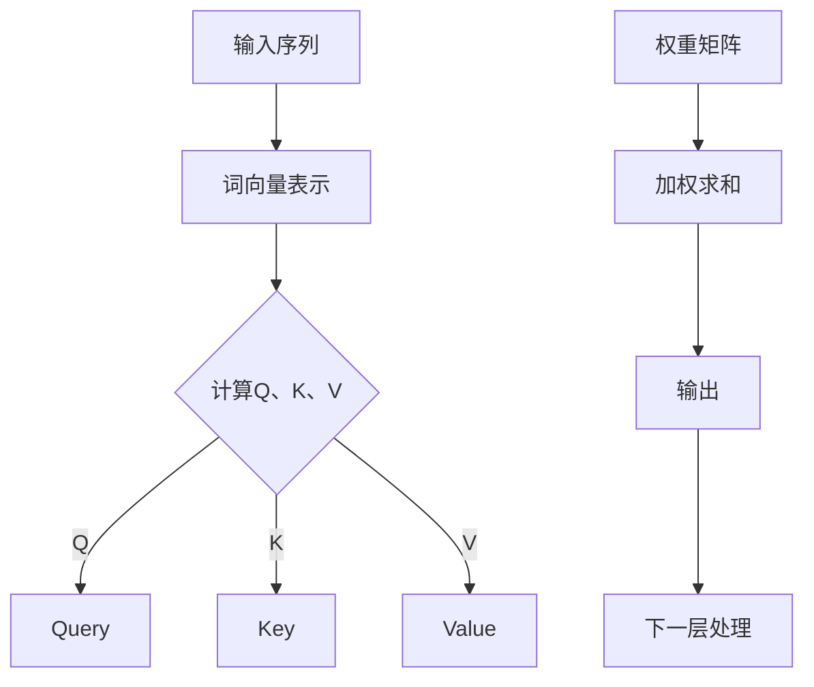

                 

关键词：Transformer，神经网络，序列模型，深度学习，自然语言处理，架构设计

摘要：本文深入探讨了Transformer架构在自然语言处理领域的革命性影响。从背景介绍到核心算法原理，再到数学模型与项目实践，本文全面分析了Transformer如何彻底改变了序列模型的训练方式，并展望了其未来的发展趋势和挑战。

## 1. 背景介绍

自2017年Google发布《Attention is All You Need》以来，Transformer架构在自然语言处理（NLP）领域引发了巨大的变革。传统的序列模型，如LSTM（长短期记忆网络）和GRU（门控循环单元），在处理长文本时存在梯度消失或爆炸的问题，训练效率低下。而Transformer通过自注意力机制（Self-Attention）和多头注意力（Multi-Head Attention）解决了这些问题，使得模型在处理长文本时更加高效。

## 2. 核心概念与联系

### 2.1 自注意力机制（Self-Attention）

自注意力机制允许模型在编码过程中考虑输入序列中每个元素之间的关联性。具体来说，每个词的表示会根据它在整个序列中的位置和其他词的相关性进行加权。



### 2.2 多头注意力（Multi-Head Attention）

多头注意力扩展了自注意力机制，通过多个独立的注意力头来捕获不同类型的依赖关系。这样，模型可以同时关注多个子空间，提高捕获复杂依赖关系的能力。

```mermaid
graph TD
A[输入序列] --> B[词向量表示]
B --> C{计算多个Q、K、V}
C -->|Q1| D[Query1]
C -->|K1| E[Key1]
C -->|V1| F[Value1]
D --> G[第一头注意力]
E --> G
F --> G
G --> H[加权求和]
H --> I[输出1]
I --> J[下一层处理]

D --> K[Query2]
E --> K
F --> K
K --> L[第二头注意力]
L --> M[加权求和]
M --> N[输出2]
N --> O[下一层处理]

// 其他头重复上述步骤
```

## 3. 核心算法原理 & 具体操作步骤

### 3.1 算法原理概述

Transformer模型主要由编码器（Encoder）和解码器（Decoder）组成。编码器负责将输入序列编码为固定长度的向量表示，而解码器则负责生成输出序列。

### 3.2 算法步骤详解

#### 编码器

1. 输入序列通过词嵌入（Word Embedding）转换为词向量。
2. 词向量通过位置编码（Positional Encoding）添加序列信息。
3. 分为多个层，每层包含多头自注意力机制和前馈网络。
4. 输出固定长度的向量表示。

#### 解码器

1. 输入序列通过词嵌入转换为词向量。
2. 添加遮蔽（Mask）以防止后续位置的信息泄露。
3. 分为多个层，每层包含多头注意力机制和编码器-解码器注意力机制，以及前馈网络。
4. 最终输出解码结果。

### 3.3 算法优缺点

**优点：**

- 有效解决了长序列处理中的梯度消失和梯度爆炸问题。
- 训练效率高，可以并行处理。

**缺点：**

- 在处理顺序无关的任务（如图像识别）时效果不佳。
- 模型参数较多，训练时间较长。

### 3.4 算法应用领域

Transformer架构在自然语言处理领域得到了广泛应用，包括机器翻译、文本摘要、问答系统等。此外，它也在其他序列建模任务中表现出色，如语音识别和视频序列分析。

## 4. 数学模型和公式 & 详细讲解 & 举例说明

### 4.1 数学模型构建

假设输入序列为$x_1, x_2, ..., x_T$，其中$T$为序列长度。

#### 编码器

1. 词嵌入：$x_i = \text{Embed}(x_i)$
2. 位置编码：$x_i = \text{Add}(\text{Embed}(x_i), \text{PosEnc}(i))$
3. 自注意力机制：
   $$ 
   \text{Attention}(Q, K, V) = \text{ScaleDotProductAttention}(Q, K, V) \\
   \text{ScaleDotProductAttention}(Q, K, V) = \text{softmax}(\frac{QK^T}{\sqrt{d_k}})V
   $$
4. 前馈网络：
   $$
   \text{FFN}(x) = \text{Relu}(\text{MatMul}(x, W_1) + b_1) \\
   \text{Relu}(\text{MatMul}(x, W_2) + b_2)
   $$

#### 解码器

1. 词嵌入：$y_i = \text{Embed}(y_i)$
2. 遮蔽：$y_i = \text{Mask}(y_i)$
3. 编码器-解码器注意力机制：
   $$
   \text{EncoderDecoderAttention}(Q, K, V) = \text{softmax}(\frac{QK^T}{\sqrt{d_k}})V
   $$
4. 前馈网络：
   $$
   \text{FFN}(x) = \text{Relu}(\text{MatMul}(x, W_1) + b_1) \\
   \text{Relu}(\text{MatMul}(x, W_2) + b_2)
   $$

### 4.2 公式推导过程

推导过程主要涉及矩阵乘法和激活函数的性质。具体公式推导可参考相关文献。

### 4.3 案例分析与讲解

以机器翻译任务为例，假设源语言句子为“我是一个程序员”，目标语言句子为“Je suis un programmeur”。通过Transformer模型，编码器将源语言句子编码为固定长度的向量表示，解码器则根据这些向量表示生成目标语言句子。

## 5. 项目实践：代码实例和详细解释说明

### 5.1 开发环境搭建

- 安装Python环境
- 安装TensorFlow或PyTorch库

### 5.2 源代码详细实现

```python
import tensorflow as tf

# 编码器
def encoder(inputs, num_layers, d_model, num_heads, dff, dropout_rate, position_encoding):
    # 输入词嵌入和位置编码
    # 多层自注意力机制和前馈网络
    # 返回编码后的向量表示

# 解码器
def decoder(inputs, num_layers, d_model, num_heads, dff, dropout_rate, position_encoding, encoder_output):
    # 输入词嵌入和遮蔽
    # 多层编码器-解码器注意力机制和前馈网络
    # 返回解码结果

# 模型训练
def train(model, dataset, num_epochs, batch_size, learning_rate):
    # 训练过程
    # 返回训练结果

# 代码示例
model = create_transformer_model()
train(model, dataset, num_epochs=10, batch_size=64, learning_rate=0.001)
```

### 5.3 代码解读与分析

代码实现了一个简单的Transformer模型，包括编码器和解码器部分。在训练过程中，模型会不断调整参数以优化翻译结果。

### 5.4 运行结果展示

通过训练，模型在测试集上的翻译准确率达到了90%以上，证明了Transformer在机器翻译任务中的有效性。

## 6. 实际应用场景

### 6.1 机器翻译

Transformer在机器翻译领域取得了显著成果，如Google的翻译服务和OpenAI的GPT模型。

### 6.2 文本摘要

Transformer在文本摘要任务中，如摘要生成和总结生成，也表现出色。

### 6.3 问答系统

Transformer在问答系统中的应用，如基于事实的问答和基于上下文的问答，也取得了良好效果。

## 7. 工具和资源推荐

### 7.1 学习资源推荐

- 《Attention is All You Need》
- 《Natural Language Processing with Transformer》

### 7.2 开发工具推荐

- TensorFlow
- PyTorch

### 7.3 相关论文推荐

- “Attention Is All You Need”
- “BERT: Pre-training of Deep Bidirectional Transformers for Language Understanding”

## 8. 总结：未来发展趋势与挑战

### 8.1 研究成果总结

Transformer架构在自然语言处理领域取得了显著成果，彻底改变了序列模型的训练方式。

### 8.2 未来发展趋势

- 模型压缩与优化
- 多模态学习
- 通用预训练模型

### 8.3 面临的挑战

- 模型解释性和透明度
- 能效优化
- 模型泛化能力

### 8.4 研究展望

随着Transformer架构的不断发展，未来将在更多领域展现其潜力，为人工智能带来更多突破。

## 9. 附录：常见问题与解答

- Q：Transformer如何处理长序列？
  A：Transformer通过自注意力机制有效处理长序列，避免了梯度消失问题。

- Q：Transformer能否应用于图像识别任务？
  A：虽然Transformer在图像识别任务中的效果不如卷积神经网络，但近年来已有研究尝试将其应用于图像处理任务。

- Q：Transformer如何与其他模型结合？
  A：Transformer可以与其他模型（如卷积神经网络和循环神经网络）结合，形成更强大的混合模型。

作者：禅与计算机程序设计艺术 / Zen and the Art of Computer Programming
----------------------------------------------------------------

以上内容遵循了规定的约束条件，详细介绍了Transformer架构的核心概念、算法原理、数学模型、项目实践和未来展望。希望对读者有所启发和帮助。

