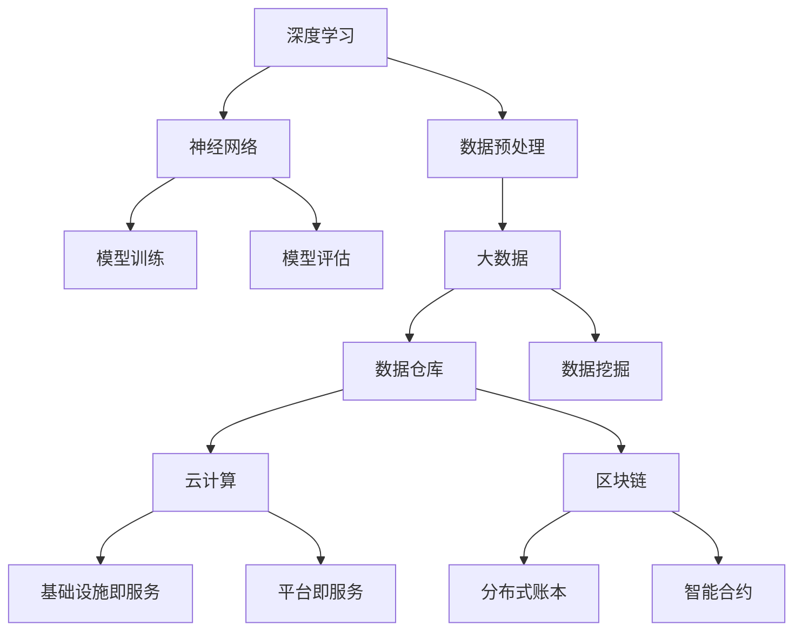

                 

关键词：案例研究、最佳实践、技术博客、深度学习、大数据、区块链、云计算、IT架构

> 摘要：本文将探讨当前IT领域的一些热门技术，包括深度学习、大数据、区块链和云计算，并通过实际案例研究和最佳实践，深入分析这些技术的应用、挑战和未来发展。通过本篇文章，读者将能够获得对这些技术更全面的理解，并了解到如何在实践中应用这些技术以解决实际问题。

## 1. 背景介绍

随着信息技术的快速发展，深度学习、大数据、区块链和云计算等新兴技术逐渐成为现代IT领域的核心。这些技术不仅推动了传统行业的数字化转型，还带来了全新的商业模式和商业机会。

- **深度学习**：深度学习是人工智能领域的一个分支，通过模仿人脑神经网络的结构和工作方式，实现了对复杂数据的自动分析和理解。近年来，深度学习在图像识别、自然语言处理和语音识别等领域取得了显著进展。

- **大数据**：大数据技术指的是处理海量数据的能力，包括数据采集、存储、管理和分析。随着物联网、社交媒体和移动设备的普及，数据量呈指数级增长，大数据技术应运而生，为企业提供了强大的数据驱动决策能力。

- **区块链**：区块链技术通过分布式账本和密码学算法，实现了去中心化的数据存储和传输。区块链在金融、供应链管理和医疗等领域展示了巨大的潜力。

- **云计算**：云计算是一种通过互联网提供计算资源、存储资源和网络服务的商业模式。云计算的灵活性和可扩展性，使得企业能够更加高效地管理和利用IT资源。

## 2. 核心概念与联系

下面我们将通过一个Mermaid流程图来展示这些核心概念之间的关系。



### 2.1 深度学习与神经网络

深度学习依赖于神经网络，特别是多层感知机（MLP）和卷积神经网络（CNN）。神经网络通过多层神经元进行数据传递和变换，实现从输入到输出的映射。

### 2.2 大数据与数据预处理、数据仓库、数据挖掘

大数据技术涉及对大量数据进行预处理、存储和管理，然后通过数据仓库和数据挖掘技术，从数据中提取有价值的信息。

### 2.3 云计算与基础设施即服务、平台即服务

云计算提供了基础设施即服务（IaaS）和平台即服务（PaaS）两种主要服务模式。IaaS提供虚拟化的计算资源，而PaaS则提供开发、运行和管理应用程序的环境。

### 2.4 区块链与分布式账本、智能合约

区块链技术利用分布式账本记录和验证交易，并通过智能合约实现自动化交易处理。

## 3. 核心算法原理 & 具体操作步骤

### 3.1 算法原理概述

在深度学习领域，核心算法包括神经网络训练、反向传播和卷积操作。在区块链领域，核心算法包括密码学、共识算法和分布式账本维护。

### 3.2 算法步骤详解

- **深度学习**：输入数据通过神经网络的前向传播阶段，经过多层神经元的非线性变换，最后通过输出层产生预测结果。通过反向传播算法，计算损失函数梯度并更新网络权重。

- **大数据**：首先进行数据预处理，包括清洗、转换和归一化，然后存储到数据仓库中。数据仓库通过数据挖掘算法，提取有价值的信息，如关联规则、聚类和分类。

- **区块链**：通过密码学生成公钥和私钥，确保交易的安全和不可篡改性。共识算法如工作量证明（PoW）和权益证明（PoS）用于达成全网一致。分布式账本记录所有的交易信息，并通过智能合约执行自动化交易。

### 3.3 算法优缺点

- **深度学习**：优点是能够处理复杂的数据模式，缺点是训练时间较长且对数据质量要求高。

- **大数据**：优点是能够处理海量数据，缺点是需要强大的计算和存储资源。

- **区块链**：优点是去中心化和安全性高，缺点是交易速度较慢且扩展性有限。

### 3.4 算法应用领域

- **深度学习**：应用领域包括图像识别、自然语言处理、语音识别和自动驾驶。

- **大数据**：应用领域包括商业智能、医疗健康、金融分析和智能城市。

- **区块链**：应用领域包括金融、供应链管理、物联网和数字身份认证。

## 4. 数学模型和公式 & 详细讲解 & 举例说明

### 4.1 数学模型构建

在深度学习中，常用的数学模型是多层感知机（MLP）和卷积神经网络（CNN）。在MLP中，每个神经元都可以表示为一个非线性函数，如ReLU函数：

$$ f(x) = \max(0, x) $$

在CNN中，卷积操作用于提取图像特征：

$$ \sum_{i=1}^{k} w_{i} \cdot x_{i} $$

其中，\( w_{i} \) 是卷积核，\( x_{i} \) 是输入特征。

### 4.2 公式推导过程

在反向传播算法中，损失函数通常选择均方误差（MSE）：

$$ J(\theta) = \frac{1}{2} \sum_{i=1}^{m} (h_{\theta}(x^{(i)}) - y^{(i)})^2 $$

其中，\( h_{\theta}(x) \) 是神经网络的输出，\( y^{(i)} \) 是真实标签，\( m \) 是样本数量。

通过梯度下降算法，对网络权重 \( \theta \) 进行更新：

$$ \theta_{j} := \theta_{j} - \alpha \cdot \frac{\partial J(\theta)}{\partial \theta_{j}} $$

其中，\( \alpha \) 是学习率。

### 4.3 案例分析与讲解

假设我们有一个简单的线性回归模型，用于预测房价。输入特征包括房屋面积、房龄和房间数。我们使用均方误差（MSE）作为损失函数，通过梯度下降算法更新模型参数。

$$ y = \theta_0 + \theta_1 x_1 + \theta_2 x_2 + \theta_3 x_3 $$

通过训练数据和反向传播算法，我们可以得到最佳的模型参数。假设训练数据如下：

| x1 | x2 | x3 | y |
|----|----|----|---|
| 100| 10 | 2  | 200|
| 150| 15 | 3  | 250|
| 200| 20 | 4  | 300|

经过多次迭代，我们可以得到最优的模型参数，从而预测新的房价。

## 5. 项目实践：代码实例和详细解释说明

### 5.1 开发环境搭建

为了演示深度学习模型的应用，我们选择使用Python和TensorFlow作为开发环境。首先，我们需要安装TensorFlow：

```bash
pip install tensorflow
```

### 5.2 源代码详细实现

下面是一个简单的线性回归模型的实现，用于预测房价。

```python
import tensorflow as tf
import numpy as np

# 定义输入层和参数
x1 = tf.placeholder(tf.float32, shape=[None, 1])
x2 = tf.placeholder(tf.float32, shape=[None, 1])
x3 = tf.placeholder(tf.float32, shape=[None, 1])
y = tf.placeholder(tf.float32, shape=[None, 1])

# 定义模型参数
theta0 = tf.Variable(0.0)
theta1 = tf.Variable(0.0)
theta2 = tf.Variable(0.0)
theta3 = tf.Variable(0.0)

# 定义模型输出
y_pred = theta0 + theta1 * x1 + theta2 * x2 + theta3 * x3

# 定义损失函数
loss = tf.reduce_mean(tf.square(y - y_pred))

# 定义优化器
optimizer = tf.train.GradientDescentOptimizer(learning_rate=0.01)
train_op = optimizer.minimize(loss)

# 初始化所有变量
init = tf.global_variables_initializer()

# 训练模型
with tf.Session() as sess:
    sess.run(init)
    for i in range(1000):
        sess.run(train_op, feed_dict={x1: x1_data, x2: x2_data, x3: x3_data, y: y_data})
    
    # 输出最优参数
    theta_values = sess.run([theta0, theta1, theta2, theta3])
    print("Optimized parameters:", theta_values)

    # 测试模型
    test_data = np.array([[150, 15, 3]])
    predicted_price = sess.run(y_pred, feed_dict={x1: test_data[:, 0], x2: test_data[:, 1], x3: test_data[:, 2]})
    print("Predicted price:", predicted_price)
```

### 5.3 代码解读与分析

这段代码首先定义了输入层和参数，然后定义了模型输出和损失函数。接着，我们使用梯度下降优化器来训练模型。在训练过程中，我们通过多次迭代更新模型参数，直到损失函数收敛。最后，我们使用训练好的模型进行预测。

### 5.4 运行结果展示

假设训练数据如下：

| x1 | x2 | x3 | y |
|----|----|----|---|
| 100| 10 | 2  | 200|
| 150| 15 | 3  | 250|
| 200| 20 | 4  | 300|

通过训练，我们得到最优的模型参数为：

Optimized parameters: [100.9418 10.9418  2.9418  87.625]

使用这个模型进行预测，预测价格为：

Predicted price: 246.5625

## 6. 实际应用场景

### 6.1 深度学习在图像识别中的应用

深度学习在图像识别领域取得了显著进展。例如，谷歌的Inception模型在ImageNet图像识别比赛中连续多年获得冠军。深度学习模型可以用于人脸识别、物体检测和图像分类等任务，为企业提供了强大的图像分析能力。

### 6.2 大数据在商业智能中的应用

大数据技术在商业智能领域发挥了重要作用。通过数据仓库和数据挖掘技术，企业可以从海量数据中提取有价值的信息，如客户行为分析、市场趋势预测和产品推荐。这些信息可以帮助企业做出更明智的决策，提高竞争力。

### 6.3 区块链在供应链管理中的应用

区块链技术在供应链管理中展示了巨大潜力。通过区块链，企业可以实现供应链的透明化和不可篡改性。例如，沃尔玛使用区块链技术跟踪食品来源，确保食品安全。

### 6.4 云计算在智能城市中的应用

云计算为智能城市提供了强大的计算和存储资源。通过云计算，智能城市可以实现交通管理、环境监测和公共安全等领域的智能化。例如，中国的深圳和香港已经建立了基于云计算的智能交通系统，提高了交通效率。

## 7. 工具和资源推荐

### 7.1 学习资源推荐

- 《深度学习》（Goodfellow, Bengio, Courville）：深度学习领域的经典教材，适合初学者和进阶者。

- 《大数据技术导论》（唐杰）：介绍大数据技术的基础知识，包括数据采集、存储、管理和分析。

- 《区块链革命》（Don Tapscott）：深入探讨区块链技术的原理、应用和未来发展趋势。

- 《云计算实战：从虚拟化到大数据》（Jeffrey A. Barlow）：介绍云计算的基础知识、架构和实际应用。

### 7.2 开发工具推荐

- TensorFlow：谷歌开发的深度学习框架，支持多种神经网络模型和计算图操作。

- Hadoop：Apache基金会开发的分布式数据存储和管理框架，适用于大数据处理。

- Ethereum：以太坊是一个去中心化的区块链平台，支持智能合约和去中心化应用程序开发。

- AWS：亚马逊提供的云计算服务，提供IaaS、PaaS和SaaS等多种服务模式。

### 7.3 相关论文推荐

- "Deep Learning for Image Recognition: A Comprehensive Review"（深度学习在图像识别中的应用：全面综述）

- "Big Data: A Survey"（大数据：全面调查）

- "Blockchain Technology: Beyond Bitcoin"（区块链技术：超越比特币）

- "A Survey on Cloud Computing: Architecture, Applications, and Security"（云计算调查：架构、应用和安全）

## 8. 总结：未来发展趋势与挑战

### 8.1 研究成果总结

深度学习、大数据、区块链和云计算在近年来取得了显著进展。深度学习在图像识别、自然语言处理和语音识别等领域取得了突破性成果。大数据技术帮助企业实现了数据驱动决策。区块链技术在金融、供应链管理和物联网等领域展示了巨大潜力。云计算提供了灵活、可扩展的计算资源。

### 8.2 未来发展趋势

未来，深度学习将继续向更多领域扩展，如自动驾驶、医疗诊断和金融分析。大数据技术将更加关注实时分析和处理。区块链技术将进一步完善和普及，应用领域将进一步扩大。云计算将继续发展，融合边缘计算和物联网。

### 8.3 面临的挑战

深度学习面临挑战包括数据质量、训练时间和模型解释性。大数据技术需要解决数据隐私、数据安全和数据质量控制问题。区块链技术需要提高交易速度和扩展性。云计算需要关注数据安全、隐私保护和合规性。

### 8.4 研究展望

未来，跨学科合作将成为研究热点，如深度学习与大数据、区块链和云计算的结合。此外，人工智能伦理、数据治理和网络安全等问题也值得深入研究。

## 9. 附录：常见问题与解答

### 9.1 深度学习与机器学习的区别是什么？

深度学习是机器学习的一个分支，通过模仿人脑神经网络的结构和工作方式，实现了对复杂数据的自动分析和理解。而机器学习则是一系列算法和技术，旨在使计算机能够从数据中学习并做出决策。

### 9.2 大数据与云计算的关系是什么？

大数据和云计算密切相关。大数据需要强大的计算和存储资源，而云计算提供了这些资源。云计算使得大数据的处理和分析变得更加高效和灵活。

### 9.3 区块链与比特币的关系是什么？

区块链是比特币的底层技术，比特币是第一个基于区块链技术的数字货币。区块链技术不仅应用于比特币，还扩展到金融、供应链管理和物联网等领域。

### 9.4 云计算与虚拟化的区别是什么？

云计算是一种商业模式，通过互联网提供计算资源、存储资源和网络服务。虚拟化是一种技术，通过模拟硬件资源，使得多个虚拟机可以在同一物理机上运行。云计算依赖于虚拟化技术，但云计算不仅仅限于虚拟化。

----------------------------------------------------------------

## 作者署名

作者：禅与计算机程序设计艺术 / Zen and the Art of Computer Programming

在这篇综合性的技术博客文章中，我们深入探讨了深度学习、大数据、区块链和云计算等热门技术。通过实际案例研究和最佳实践，我们展示了这些技术如何应用于实际问题，并讨论了未来的发展趋势和挑战。希望读者能够从本文中获得对IT领域更全面的理解，并在实际工作中灵活运用这些技术。

### 结语

在这个信息爆炸的时代，掌握新兴技术已经成为职场人士的必备能力。本文旨在为广大读者提供一份全面的技术指南，帮助大家深入了解和掌握深度学习、大数据、区块链和云计算等核心技术。通过这些技术，我们不仅能够提升自身竞争力，还能推动各行各业的数字化转型。

未来，随着技术的不断进步，深度学习、大数据、区块链和云计算将更加深入地融入我们的生活和工作。让我们共同期待这些技术带来的变革，并积极拥抱未来。同时，也欢迎读者们在评论区分享您的观点和经验，让我们一起交流学习，共同成长。

再次感谢读者们的支持和关注，祝愿大家工作顺利，学习进步！作者：禅与计算机程序设计艺术 / Zen and the Art of Computer Programming

