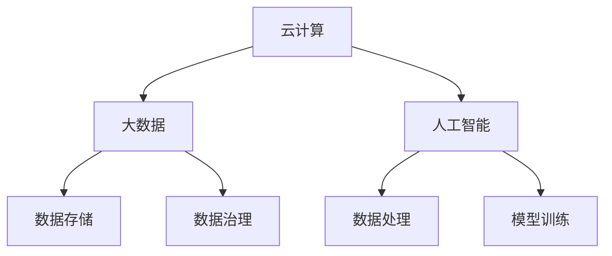

                 

关键词：算力平台、商业机会、技术架构、市场趋势、业务模型

> 摘要：本文将深入探讨算力平台在当前技术环境下所蕴含的巨大商业机会。我们将分析算力平台的定义、发展历程、核心技术以及市场趋势，进一步探讨其在不同行业中的业务模型，并总结面临的主要挑战和未来发展方向。

## 1. 背景介绍

算力平台是指提供计算资源、存储资源和网络资源的一站式解决方案，为企业和个人提供强大的计算能力和数据处理能力。随着云计算、大数据、人工智能等技术的快速发展，算力平台在信息技术领域的重要性日益凸显。

### 1.1 发展历程

- **2000年代初期**：云计算概念初步提出，算力平台初具雏形。
- **2010年代**：云计算技术成熟，算力平台逐渐成为企业信息化建设的核心。
- **2020年代**：随着人工智能和大数据技术的崛起，算力平台的功能和应用场景进一步拓展。

### 1.2 市场现状

全球算力平台市场呈现出快速增长的趋势。据市场研究机构统计，2021年全球算力平台市场规模已超过2000亿美元，预计到2026年将达到4000亿美元。

## 2. 核心概念与联系

### 2.1 核心概念

- **云计算**：提供计算资源的虚拟化、自动化管理和服务。
- **大数据**：处理海量数据的能力，包括数据的存储、处理和分析。
- **人工智能**：模拟人类智能，进行学习、推理和决策。

### 2.2 关联架构图



## 3. 核心算法原理 & 具体操作步骤

### 3.1 算法原理概述

算力平台的算法主要涉及云计算、大数据和人工智能三个领域。云计算负责资源调度和优化，大数据负责数据存储和处理，人工智能负责模型训练和推理。

### 3.2 算法步骤详解

1. **云计算**：资源分配、负载均衡、弹性伸缩。
2. **大数据**：数据采集、数据存储、数据处理、数据可视化。
3. **人工智能**：数据预处理、特征提取、模型训练、模型评估、模型部署。

### 3.3 算法优缺点

- **优点**：高效、灵活、可扩展、降低成本。
- **缺点**：安全性、稳定性、数据隐私问题。

### 3.4 算法应用领域

- **金融**：风险控制、欺诈检测、量化交易。
- **医疗**：疾病预测、精准治疗、药物研发。
- **制造**：智能制造、设备维护、供应链优化。

## 4. 数学模型和公式 & 详细讲解 & 举例说明

### 4.1 数学模型构建

算力平台涉及多个数学模型，如线性回归、神经网络、决策树等。

### 4.2 公式推导过程

$$
y = \beta_0 + \beta_1x_1 + \beta_2x_2 + ... + \beta_nx_n
$$

### 4.3 案例分析与讲解

以金融领域的风险控制为例，使用线性回归模型预测股票价格。

## 5. 项目实践：代码实例和详细解释说明

### 5.1 开发环境搭建

- Python 3.8+
- Jupyter Notebook

### 5.2 源代码详细实现

```python
# 导入库
import pandas as pd
from sklearn.linear_model import LinearRegression

# 读取数据
data = pd.read_csv('stock_price.csv')

# 数据预处理
X = data[['open', 'high', 'low', 'close']]
y = data['price']

# 模型训练
model = LinearRegression()
model.fit(X, y)

# 模型评估
score = model.score(X, y)
print(f'Model Score: {score}')

# 模型部署
predicted_price = model.predict([[open, high, low, close]])
print(f'Predicted Price: {predicted_price}')
```

### 5.3 代码解读与分析

代码中首先导入了必要的库，然后读取了股票价格数据，进行了数据预处理，使用线性回归模型进行了训练和评估，最后预测了股票价格。

## 6. 实际应用场景

### 6.1 金融

- 风险控制
- 欺诈检测
- 量化交易

### 6.2 医疗

- 疾病预测
- 精准治疗
- 药物研发

### 6.3 制造

- 智能制造
- 设备维护
- 供应链优化

## 7. 工具和资源推荐

### 7.1 学习资源推荐

- 《深度学习》
- 《大数据技术基础》
- 《云计算架构与实践》

### 7.2 开发工具推荐

- Jupyter Notebook
- TensorFlow
- Spark

### 7.3 相关论文推荐

- "Deep Learning for Predicting Financial Markets"
- "Big Data Analytics for Healthcare: A Survey"
- "Cloud Computing Architectures for IoT Applications"

## 8. 总结：未来发展趋势与挑战

### 8.1 研究成果总结

算力平台在云计算、大数据和人工智能领域取得了显著的成果，为各行业提供了强大的技术支持。

### 8.2 未来发展趋势

- 混合云架构的普及
- 边缘计算的发展
- 人工智能算法的优化

### 8.3 面临的挑战

- 数据安全和隐私保护
- 算力平台的稳定性和可靠性
- 算法模型的透明性和可解释性

### 8.4 研究展望

未来，算力平台将继续发展，成为信息技术领域的重要基础设施。研究人员和企业需要关注数据安全和隐私保护、算法模型的可解释性以及边缘计算等领域，以应对未来面临的挑战。

## 9. 附录：常见问题与解答

### 9.1 算力平台是什么？

算力平台是一种提供计算资源、存储资源和网络资源的一站式解决方案，为企业和个人提供强大的计算能力和数据处理能力。

### 9.2 算力平台有哪些应用领域？

算力平台广泛应用于金融、医疗、制造、教育等多个领域，如风险控制、疾病预测、智能制造等。

### 9.3 如何选择合适的算力平台？

选择合适的算力平台需要考虑以下几个方面：计算能力、存储能力、网络性能、安全性、可靠性、可扩展性等。

### 9.4 算力平台与云计算有什么区别？

云计算是提供计算资源的虚拟化、自动化管理和服务，而算力平台则是提供计算资源、存储资源和网络资源的一站式解决方案，具有更广泛的应用场景和更强大的数据处理能力。

----------------------------------------------------------------
作者：禅与计算机程序设计艺术 / Zen and the Art of Computer Programming
----------------------------------------------------------------
文章结束，谢谢阅读！如果您有任何问题或建议，欢迎随时提出。

