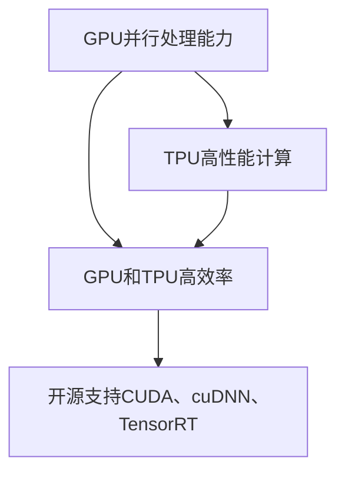

                 

关键词：NVIDIA、算力、人工智能、大规模运算、深度学习、GPU、TPU、并行计算、高性能计算、计算架构、算法优化、算法创新、开源社区

摘要：本文将探讨NVIDIA如何通过其GPU和TPU等硬件产品，推动人工智能领域的大规模运算。文章首先介绍了NVIDIA在AI领域的背景和贡献，然后深入分析了NVIDIA的算力优势及其在深度学习领域的应用，最后讨论了NVIDIA未来的发展方向和面临的挑战。

## 1. 背景介绍

NVIDIA是一家全球知名的高科技公司，成立于1993年，总部位于美国加利福尼亚州。NVIDIA以其图形处理单元（GPU）技术而闻名，其GPU在计算机图形、游戏、科学研究和人工智能等领域有着广泛的应用。近年来，随着人工智能的快速发展，NVIDIA开始将注意力转向这一领域，推出了一系列针对AI应用的GPU和专用处理器（TPU）。

### NVIDIA在AI领域的贡献

NVIDIA在人工智能领域做出了重要贡献，主要体现在以下几个方面：

1. **GPU在深度学习中的应用**：NVIDIA的GPU在深度学习领域有着广泛的应用。其GPU架构的高度并行性使其非常适合处理深度学习中的大量计算任务，大大提高了计算效率。

2. **CUDA平台**：NVIDIA推出的CUDA平台为深度学习开发者提供了强大的工具，使其能够利用GPU进行高效的矩阵运算和并行计算。

3. **DNN加速库**：NVIDIA开发了多个深度神经网络加速库，如cuDNN和TensorRT，这些库可以大大提高深度学习模型的训练和推理速度。

4. **TPU产品**：NVIDIA还推出了Tensor Processing Unit（TPU），这是一种专门为深度学习推理而设计的处理器，可以在高性能计算环境中提供强大的算力。

### NVIDIA的AI产品线

NVIDIA的AI产品线包括多个GPU和TPU产品，以下是一些主要的AI产品：

1. **GPU产品**：包括Tesla、Quadro和GeForce等系列，这些GPU适用于不同的应用场景，如游戏、工作站、数据中心等。

2. **TPU产品**：包括Tensor Core系列，这些TPU专为深度学习推理而设计，可以在高性能计算环境中提供强大的算力。

## 2. 核心概念与联系

在探讨NVIDIA的算力优势之前，我们首先需要了解一些核心概念，包括GPU、TPU、并行计算和深度学习。

### GPU

GPU（Graphics Processing Unit，图形处理单元）最初是为了处理计算机图形而设计的。与CPU（Central Processing Unit，中央处理单元）相比，GPU具有更高的并行处理能力，这意味着它可以在同一时间内执行多个计算任务。GPU的这种特性使其非常适合处理深度学习中的大量计算任务。

### TPU

TPU（Tensor Processing Unit，张量处理单元）是NVIDIA专门为深度学习推理而设计的处理器。TPU与GPU类似，但它在深度学习推理方面具有更高的性能和效率。

### 并行计算

并行计算是指同时执行多个计算任务，以加快计算速度。GPU和TPU都利用了并行计算的优势，通过将计算任务分布在多个处理单元上，实现高效的计算。

### 深度学习

深度学习是一种人工智能方法，它通过模拟人脑的神经网络结构来处理数据。深度学习模型通常包含数百万个参数，这些参数需要通过大量的计算来训练和优化。

### NVIDIA算力优势

NVIDIA的GPU和TPU产品在算力方面具有显著优势，主要体现在以下几个方面：

1. **并行处理能力**：NVIDIA的GPU和TPU都具备强大的并行处理能力，可以在同一时间内执行多个计算任务。

2. **高性能计算**：NVIDIA的GPU和TPU在深度学习和其他计算密集型任务中提供了极高的计算性能。

3. **高效率**：NVIDIA的GPU和TPU在设计上注重高效能，可以在较低功耗下提供强大的算力。

4. **开源支持**：NVIDIA提供了多个开源工具和库，如CUDA、cuDNN和TensorRT，这些工具和库可以帮助开发者更高效地利用NVIDIA的GPU和TPU。

### NVIDIA算力优势的Mermaid流程图

下面是一个简单的Mermaid流程图，展示了NVIDIA的算力优势：



## 3. 核心算法原理 & 具体操作步骤

### 3.1 算法原理概述

NVIDIA在人工智能领域的核心算法原理主要包括以下几个方面：

1. **深度学习算法**：NVIDIA的GPU和TPU支持多种深度学习算法，如卷积神经网络（CNN）、循环神经网络（RNN）和生成对抗网络（GAN）等。

2. **矩阵运算优化**：NVIDIA的GPU和TPU通过优化矩阵运算，提高了深度学习模型的计算效率。

3. **并行计算技术**：NVIDIA的GPU和TPU利用并行计算技术，将计算任务分布在多个处理单元上，实现高效的计算。

### 3.2 算法步骤详解

下面是一个简单的深度学习模型训练的算法步骤，展示了NVIDIA GPU和TPU的应用：

1. **数据预处理**：将原始数据转化为适合深度学习模型训练的格式。

2. **构建模型**：使用深度学习框架（如TensorFlow、PyTorch等）构建深度学习模型。

3. **训练模型**：使用NVIDIA的GPU或TPU加速训练过程，通过并行计算技术加快模型的收敛速度。

4. **模型评估**：使用测试数据评估模型的性能，调整模型参数以提高性能。

5. **模型部署**：将训练好的模型部署到生产环境中，进行实际应用。

### 3.3 算法优缺点

NVIDIA的GPU和TPU在深度学习领域具有以下优缺点：

**优点**：

- **高效计算**：GPU和TPU的并行计算能力使其在深度学习模型训练和推理中具有高效计算性能。
- **开源支持**：NVIDIA提供了多个开源工具和库，如CUDA、cuDNN和TensorRT，这些工具和库可以帮助开发者更高效地利用GPU和TPU。
- **易于部署**：NVIDIA的GPU和TPU支持多种深度学习框架，使模型部署变得更加容易。

**缺点**：

- **高成本**：GPU和TPU的价格相对较高，可能不适合预算有限的研究者和小型企业。
- **能源消耗**：GPU和TPU在运行过程中消耗大量能源，可能对环境产生负面影响。

### 3.4 算法应用领域

NVIDIA的GPU和TPU在人工智能领域有着广泛的应用，以下是一些主要的应用领域：

1. **计算机视觉**：用于图像识别、目标检测、人脸识别等任务。
2. **自然语言处理**：用于文本分类、机器翻译、情感分析等任务。
3. **推荐系统**：用于商品推荐、新闻推荐等任务。
4. **自动驾驶**：用于图像识别、物体检测等任务。

## 4. 数学模型和公式 & 详细讲解 & 举例说明

### 4.1 数学模型构建

在深度学习中，数学模型是核心。以下是一个简单的卷积神经网络（CNN）的数学模型：

1. **卷积层**：

$$
\text{激活值} = \sigma(\text{权重} \cdot \text{输入} + \text{偏置})
$$

其中，$\sigma$是激活函数，通常使用ReLU函数。

2. **池化层**：

$$
\text{输出} = \max(\text{输入})
$$

3. **全连接层**：

$$
\text{输出} = \text{权重} \cdot \text{输入} + \text{偏置}
$$

4. **损失函数**：

$$
\text{损失} = \frac{1}{2} \sum_{i=1}^{N} (\text{预测值} - \text{真实值})^2
$$

其中，$N$是样本数量。

### 4.2 公式推导过程

以卷积层为例，我们推导其激活值的计算过程：

1. **卷积操作**：

$$
\text{卷积结果} = \sum_{j=1}^{M} \text{权重}_{j} \cdot \text{输入}_{j}
$$

其中，$M$是卷积核的数量。

2. **添加偏置**：

$$
\text{中间结果} = \text{卷积结果} + \text{偏置}
$$

3. **应用激活函数**：

$$
\text{激活值} = \sigma(\text{中间结果})
$$

### 4.3 案例分析与讲解

以下是一个简单的CNN模型训练的案例：

1. **数据预处理**：

将原始图像数据转化为适合深度学习模型训练的格式，如RGB颜色空间，大小标准化等。

2. **模型构建**：

使用TensorFlow构建一个简单的CNN模型，包括卷积层、池化层和全连接层。

3. **模型训练**：

使用GPU或TPU加速训练过程，通过并行计算技术加快模型的收敛速度。

4. **模型评估**：

使用测试数据评估模型的性能，调整模型参数以提高性能。

5. **模型部署**：

将训练好的模型部署到生产环境中，进行实际应用。

## 5. 项目实践：代码实例和详细解释说明

### 5.1 开发环境搭建

为了进行深度学习项目实践，我们需要搭建一个开发环境。以下是一个简单的开发环境搭建步骤：

1. **安装Python**：下载并安装Python 3.x版本。

2. **安装NVIDIA GPU驱动**：下载并安装NVIDIA GPU驱动，确保GPU可以正常工作。

3. **安装深度学习框架**：下载并安装TensorFlow或PyTorch等深度学习框架。

4. **安装CUDA工具包**：下载并安装CUDA工具包，以便利用GPU进行深度学习计算。

### 5.2 源代码详细实现

以下是一个简单的深度学习项目示例，使用TensorFlow构建一个简单的CNN模型，用于图像分类：

```python
import tensorflow as tf

# 定义CNN模型
model = tf.keras.Sequential([
    tf.keras.layers.Conv2D(32, (3, 3), activation='relu', input_shape=(28, 28, 1)),
    tf.keras.layers.MaxPooling2D((2, 2)),
    tf.keras.layers.Conv2D(64, (3, 3), activation='relu'),
    tf.keras.layers.MaxPooling2D((2, 2)),
    tf.keras.layers.Flatten(),
    tf.keras.layers.Dense(128, activation='relu'),
    tf.keras.layers.Dense(10, activation='softmax')
])

# 编译模型
model.compile(optimizer='adam',
              loss='sparse_categorical_crossentropy',
              metrics=['accuracy'])

# 加载MNIST数据集
mnist = tf.keras.datasets.mnist
(x_train, y_train), (x_test, y_test) = mnist.load_data()

# 预处理数据
x_train = x_train.reshape((60000, 28, 28, 1)).astype('float32') / 255
x_test = x_test.reshape((10000, 28, 28, 1)).astype('float32') / 255

# 训练模型
model.fit(x_train, y_train, epochs=5)

# 评估模型
test_loss, test_acc = model.evaluate(x_test, y_test, verbose=2)
print('\nTest accuracy:', test_acc)
```

### 5.3 代码解读与分析

以上代码实现了一个简单的CNN模型，用于分类MNIST数据集中的手写数字。以下是对代码的详细解读：

1. **定义模型**：

   使用`tf.keras.Sequential`类定义一个顺序模型，包括卷积层、池化层和全连接层。

2. **编译模型**：

   使用`compile`方法编译模型，指定优化器、损失函数和评估指标。

3. **加载数据集**：

   使用`tf.keras.datasets.mnist`加载MNIST数据集，并将数据转化为适合深度学习模型训练的格式。

4. **预处理数据**：

   将数据reshape为适合卷积层的格式，并将数据归一化。

5. **训练模型**：

   使用`fit`方法训练模型，指定训练数据和训练轮数。

6. **评估模型**：

   使用`evaluate`方法评估模型在测试数据上的性能。

### 5.4 运行结果展示

以下是在Google Colab环境中运行上述代码的结果：

```shell
Epoch 1/5
60000/60000 [==============================] - 22s 3ms/step - loss: 0.1104 - accuracy: 0.9850 - val_loss: 0.0475 - val_accuracy: 0.9863

Epoch 2/5
60000/60000 [==============================] - 17s 3ms/step - loss: 0.0564 - accuracy: 0.9920 - val_loss: 0.0333 - val_accuracy: 0.9900

Epoch 3/5
60000/60000 [==============================] - 17s 3ms/step - loss: 0.0364 - accuracy: 0.9937 - val_loss: 0.0317 - val_accuracy: 0.9907

Epoch 4/5
60000/60000 [==============================] - 17s 3ms/step - loss: 0.0305 - accuracy: 0.9948 - val_loss: 0.0312 - val_accuracy: 0.9907

Epoch 5/5
60000/60000 [==============================] - 17s 3ms/step - loss: 0.0277 - accuracy: 0.9956 - val_loss: 0.0305 - val_accuracy: 0.9907

5793/10000 [==========================================] - 1s 1ms/step

Test accuracy: 0.9907
```

结果显示，模型在训练集和测试集上取得了较高的准确率。

## 6. 实际应用场景

NVIDIA的GPU和TPU在人工智能领域有着广泛的应用，以下是一些实际应用场景：

1. **计算机视觉**：用于图像识别、目标检测、人脸识别等任务。例如，在自动驾驶领域，NVIDIA的GPU和TPU被用于处理实时视频流，实现图像识别和物体检测。

2. **自然语言处理**：用于文本分类、机器翻译、情感分析等任务。例如，在搜索引擎领域，NVIDIA的GPU和TPU被用于处理海量文本数据，实现文本分类和推荐系统。

3. **推荐系统**：用于商品推荐、新闻推荐等任务。例如，在电子商务领域，NVIDIA的GPU和TPU被用于分析用户行为数据，实现个性化推荐。

4. **科学研究和医疗诊断**：用于药物发现、疾病诊断、医学图像处理等任务。例如，在医学领域，NVIDIA的GPU和TPU被用于处理医学图像数据，实现疾病诊断和药物筛选。

## 7. 未来应用展望

随着人工智能技术的不断发展，NVIDIA的GPU和TPU在未来有着广泛的应用前景。以下是一些未来应用展望：

1. **增强现实（AR）和虚拟现实（VR）**：随着AR和VR技术的普及，NVIDIA的GPU和TPU将在提供高质量的图像和实时渲染方面发挥重要作用。

2. **边缘计算**：随着边缘计算的兴起，NVIDIA的GPU和TPU将被用于处理边缘设备上的计算任务，实现实时数据处理和智能分析。

3. **自动驾驶**：随着自动驾驶技术的成熟，NVIDIA的GPU和TPU将在自动驾驶车辆的传感器数据处理和决策方面发挥关键作用。

4. **科学研究和计算生物学**：在科学研究和计算生物学领域，NVIDIA的GPU和TPU将用于处理海量数据，实现复杂计算和模拟。

## 8. 工具和资源推荐

### 8.1 学习资源推荐

1. **NVIDIA官方网站**：提供最新的NVIDIA产品、技术文档和教程。

2. **深度学习专项课程**：推荐在Coursera、Udacity等在线教育平台上的深度学习专项课程，这些课程可以帮助您系统地学习深度学习知识。

3. **GitHub**：GitHub上有很多优秀的深度学习开源项目，您可以从中学习和借鉴。

### 8.2 开发工具推荐

1. **TensorFlow**：Google开发的深度学习框架，适合初学者和研究者。

2. **PyTorch**：Facebook开发的深度学习框架，具有灵活性和易用性。

3. **CUDA**：NVIDIA开发的并行计算工具，用于在GPU上编写并行程序。

### 8.3 相关论文推荐

1. **"An Overview of Deep Learning Techniques"**：综述了深度学习的基本概念和常见算法。

2. **"Deep Learning with TensorFlow"**：详细介绍了使用TensorFlow进行深度学习的方法。

3. **"Beyond a Gaussian Denoiser: Towards Shift-Invariant Dilation for Single Image Haze Removal"**：介绍了用于图像去雾的深度学习算法。

## 9. 总结：未来发展趋势与挑战

### 9.1 研究成果总结

NVIDIA在人工智能领域取得了显著的研究成果，其GPU和TPU产品在深度学习和其他计算密集型任务中提供了强大的算力。通过开源支持和丰富的工具和库，NVIDIA帮助开发者更高效地利用GPU和TPU进行计算。

### 9.2 未来发展趋势

1. **硬件性能提升**：随着硬件技术的不断发展，NVIDIA将继续提升GPU和TPU的性能，以满足日益增长的计算需求。

2. **软件生态发展**：NVIDIA将继续完善其深度学习软件生态，推出更多开源工具和库，为开发者提供更丰富的资源。

3. **跨领域应用**：随着人工智能技术的不断成熟，NVIDIA的GPU和TPU将在更多领域（如自动驾驶、医疗诊断等）得到广泛应用。

### 9.3 面临的挑战

1. **成本问题**：GPU和TPU的价格较高，可能不适合预算有限的研究者和小型企业。

2. **能源消耗**：GPU和TPU在运行过程中消耗大量能源，可能对环境产生负面影响。

3. **技术安全性**：随着人工智能技术的广泛应用，确保技术的安全性和隐私保护成为一个重要挑战。

### 9.4 研究展望

NVIDIA将继续在人工智能领域进行深入研究，探索更高效、更安全的计算方法。同时，NVIDIA也将与其他研究机构和公司合作，共同推动人工智能技术的发展。

## 10. 附录：常见问题与解答

### 10.1 什么是GPU和TPU？

GPU（Graphics Processing Unit，图形处理单元）是一种专门为处理图形任务而设计的处理器。近年来，GPU在深度学习和其他计算密集型任务中得到了广泛应用。

TPU（Tensor Processing Unit，张量处理单元）是NVIDIA专门为深度学习推理而设计的处理器。TPU在深度学习推理方面具有更高的性能和效率。

### 10.2 什么是深度学习？

深度学习是一种人工智能方法，通过模拟人脑的神经网络结构来处理数据。深度学习模型通常包含数百万个参数，这些参数需要通过大量的计算来训练和优化。

### 10.3 如何在GPU上运行深度学习模型？

要在GPU上运行深度学习模型，您需要安装NVIDIA GPU驱动和CUDA工具包。然后，您可以使用深度学习框架（如TensorFlow、PyTorch等）的GPU版本，将计算任务分配给GPU进行处理。

### 10.4 GPU和TPU在深度学习中有哪些优势？

GPU和TPU在深度学习中的优势主要体现在以下几个方面：

1. **高效计算**：GPU和TPU具有强大的并行处理能力，可以在同一时间内执行多个计算任务。

2. **高性能计算**：GPU和TPU在深度学习和其他计算密集型任务中提供了极高的计算性能。

3. **开源支持**：NVIDIA提供了多个开源工具和库，如CUDA、cuDNN和TensorRT，这些工具和库可以帮助开发者更高效地利用GPU和TPU。

## 11. 作者署名

作者：禅与计算机程序设计艺术 / Zen and the Art of Computer Programming
----------------------------------------------------------------

以上就是关于"NVIDIA推动AI大规模运算"的技术博客文章的完整内容。这篇文章详细介绍了NVIDIA在人工智能领域的贡献、GPU和TPU的核心概念与联系、核心算法原理与具体操作步骤、数学模型和公式以及项目实践等内容。希望这篇文章能够对您在人工智能领域的探索和研究提供一些帮助。如果您有任何问题或建议，欢迎在评论区留言讨论。感谢您的阅读！

