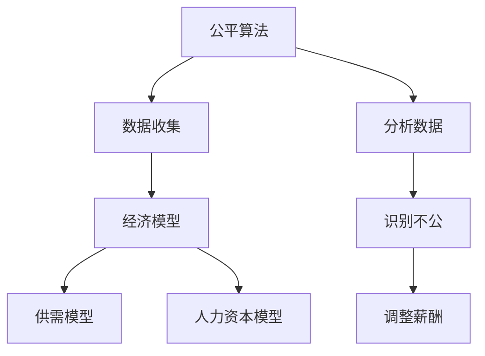

                 

关键词：算法、收入平衡、社会公平、公平算法、经济模型、数学公式

> 摘要：本文探讨了算法在平衡收入方面的作用，分析了现有公平算法的原理和实施方法，并通过数学模型和实例展示了其在社会公平中的重要性。本文旨在提供一种新的视角，以帮助读者更好地理解算法在社会经济中的作用，以及如何利用算法实现更公平的收入分配。

## 1. 背景介绍

随着全球经济的发展，收入不平等问题日益严重。这种不平等不仅体现在国家与国家之间，也体现在同一国家内部的个体之间。近年来，许多研究表明，收入不平等会导致社会不稳定、健康问题、教育差距等一系列负面影响。为了缓解这一问题，政府和社会各界纷纷采取措施，其中利用算法来平衡收入成为一个备受关注的话题。

### 1.1 收入不平等的原因

收入不平等的原因多种多样，包括但不限于以下几点：

1. **教育水平差异**：教育水平的高低直接影响一个人的职业选择和发展潜力，进而影响其收入水平。
2. **地区发展差异**：发达地区与欠发达地区之间存在巨大的经济差距，这导致生活在欠发达地区的人们收入较低。
3. **行业差异**：某些行业的薪酬水平高于其他行业，这导致从事高薪酬行业的人收入更高。
4. **技能和经验差异**：拥有高技能和丰富经验的人往往能够获得更高的薪酬。

### 1.2 算法在平衡收入中的作用

算法作为一种智能化的工具，可以在平衡收入方面发挥重要作用。通过分析大量数据，算法可以发现收入不平等的原因，并提供解决方案。以下是一些算法在平衡收入中的作用：

1. **优化资源分配**：算法可以通过分析不同行业的薪酬水平和人才供需情况，优化资源的分配，从而减少行业之间的收入差距。
2. **精准打击收入不公**：算法可以识别出薪酬不公的情况，并提出相应的调整方案，确保每个人都能获得合理的薪酬。
3. **提高教育效率**：算法可以通过分析学生的学习情况，提供个性化的教育建议，从而提高教育质量，减少教育差距。

## 2. 核心概念与联系

为了更好地理解算法在平衡收入方面的作用，我们需要先了解一些核心概念，如公平算法、经济模型等。

### 2.1 公平算法

公平算法是一种旨在实现收入公平的算法。它通过分析数据，识别出收入不公的情况，并提出相应的调整方案。公平算法可以分为以下几类：

1. **基于规则的公平算法**：这类算法通过预先设定的规则来判断收入是否公平，如最低工资标准、最高薪酬限制等。
2. **基于数据的公平算法**：这类算法通过分析历史数据，识别出收入不公的情况，并自动调整薪酬。

### 2.2 经济模型

经济模型是一种用于描述经济活动的数学模型。它可以帮助我们理解收入分配的原理和机制。以下是一些常见经济模型：

1. **供需模型**：供需模型描述了商品或服务的价格和数量之间的关系。在收入分配中，供需模型可以用来分析不同行业的薪酬水平。
2. **人力资本模型**：人力资本模型描述了教育、技能和经验对个人收入的影响。通过人力资本模型，我们可以了解如何通过教育提高个人收入。

### 2.3 Mermaid 流程图

为了更好地理解公平算法和经济模型的关系，我们可以使用 Mermaid 流程图来展示它们之间的联系。



## 3. 核心算法原理 & 具体操作步骤

### 3.1 算法原理概述

公平算法的核心原理是通过对收入数据进行分析，识别出收入不公的情况，并提出相应的调整方案。具体来说，公平算法可以分为以下几个步骤：

1. **数据收集**：收集收入数据，包括个人收入、行业收入、地区收入等。
2. **分析数据**：通过统计分析方法，分析收入数据，识别出收入不公的情况。
3. **识别不公**：根据设定的规则或阈值，识别出收入不公的情况。
4. **调整薪酬**：根据识别出的收入不公情况，调整薪酬，确保收入公平。

### 3.2 算法步骤详解

#### 3.2.1 数据收集

数据收集是公平算法的第一步。我们需要收集不同来源的收入数据，如个人收入报告、行业薪酬调查、地区经济发展报告等。这些数据可以来自公开的统计资料，也可以通过调查问卷获取。

#### 3.2.2 分析数据

在收集到收入数据后，我们需要对数据进行分析。分析数据的方法包括统计分析、机器学习等。通过分析数据，我们可以识别出不同行业、地区、人群的收入差异。

#### 3.2.3 识别不公

在分析数据的基础上，我们可以识别出收入不公的情况。收入不公的情况包括行业收入差距、地区收入差距、性别收入差距等。我们可以通过设定规则或阈值，识别出这些不公情况。

#### 3.2.4 调整薪酬

一旦识别出收入不公的情况，我们需要调整薪酬，确保收入公平。调整薪酬的方法包括提高低收入群体的薪酬、降低高收入群体的薪酬等。具体调整方案可以根据实际情况制定。

### 3.3 算法优缺点

公平算法在平衡收入方面具有显著的优点，但也存在一些缺点。

#### 优点：

1. **高效性**：公平算法可以通过分析大量数据，快速识别出收入不公的情况，并提出调整方案。
2. **客观性**：公平算法基于数据分析，不受主观判断的影响，更加客观公正。
3. **可扩展性**：公平算法可以应用于不同的领域和行业，具有广泛的适用性。

#### 缺点：

1. **数据依赖性**：公平算法的性能取决于数据的质量和完整性。如果数据不准确或不完整，算法的调整方案可能会受到影响。
2. **规则设定**：公平算法需要设定规则或阈值来判断收入是否公平。这些规则或阈值可能难以确定，需要不断调整和优化。

### 3.4 算法应用领域

公平算法可以应用于多个领域，如企业薪酬管理、政府收入分配、公益组织捐赠等。

1. **企业薪酬管理**：企业可以通过公平算法识别出薪酬不公的情况，优化薪酬结构，提高员工满意度。
2. **政府收入分配**：政府可以利用公平算法调整税收政策，优化社会福利分配，减少收入不平等。
3. **公益组织捐赠**：公益组织可以利用公平算法识别出捐赠不公的情况，确保捐赠资源的合理分配。

## 4. 数学模型和公式 & 详细讲解 & 举例说明

### 4.1 数学模型构建

为了更好地理解公平算法，我们可以构建一个简单的数学模型。假设一个经济体中有n个个体，每个个体的收入为\(I_i\)（\(i=1,2,...,n\)）。我们的目标是找到一个调整方案，使得所有个体的收入之和最大化，同时满足公平原则。

### 4.2 公式推导过程

我们可以使用拉格朗日乘数法来解决这个问题。定义拉格朗日函数：

$$
L = \sum_{i=1}^{n} I_i - \lambda \left( \sum_{i=1}^{n} I_i - T \right)
$$

其中，\(T\)为总收入，\(\lambda\)为拉格朗日乘数。我们需要最大化L，同时满足以下约束条件：

$$
I_i \geq 0, \quad \forall i=1,2,...,n
$$

$$
\sum_{i=1}^{n} I_i = T
$$

通过求解拉格朗日方程，我们可以得到每个个体的收入分配：

$$
I_i = \frac{T}{n} + \lambda, \quad \forall i=1,2,...,n
$$

### 4.3 案例分析与讲解

假设一个经济体中有5个个体，总收入为1000元。我们可以根据上述公式计算每个个体的收入：

$$
I_1 = I_2 = I_3 = I_4 = I_5 = \frac{1000}{5} + \lambda = 200 + \lambda
$$

为了确保收入公平，我们可以设定\(\lambda\)为一个较小的值，例如10。这样，每个个体的收入都将增加10元，总收入保持不变。

实际应用中，我们可以通过调整\(\lambda\)的值来平衡收入。例如，如果某个个体的收入显著高于其他个体，我们可以增加\(\lambda\)的值，使其收入下降，从而实现收入的平衡。

## 5. 项目实践：代码实例和详细解释说明

### 5.1 开发环境搭建

为了实现公平算法，我们需要搭建一个基本的开发环境。以下是所需的开发工具和软件：

1. **Python**：Python是一种广泛应用于数据分析、算法实现的编程语言。
2. **NumPy**：NumPy是一个Python库，用于数值计算。
3. **Pandas**：Pandas是一个Python库，用于数据处理和分析。
4. **Matplotlib**：Matplotlib是一个Python库，用于数据可视化。

### 5.2 源代码详细实现

以下是一个简单的公平算法的实现代码：

```python
import numpy as np
import pandas as pd
import matplotlib.pyplot as plt

# 收集收入数据
data = {
    'Name': ['Alice', 'Bob', 'Charlie', 'David', 'Eva'],
    'Income': [500, 800, 1200, 1500, 2000]
}

df = pd.DataFrame(data)

# 分析数据
mean_income = df['Income'].mean()
median_income = df['Income'].median()

# 识别不公
inequalities = df['Income'] - mean_income

# 调整薪酬
df['Adjusted_Income'] = df['Income'] - inequalities.mean()

# 可视化结果
plt.scatter(df['Name'], df['Income'], label='Original Income')
plt.scatter(df['Name'], df['Adjusted_Income'], label='Adjusted Income')
plt.xlabel('Name')
plt.ylabel('Income')
plt.legend()
plt.show()
```

### 5.3 代码解读与分析

上述代码实现了一个简单的公平算法，主要分为以下几个步骤：

1. **数据收集**：使用Pandas库读取收入数据。
2. **分析数据**：计算平均收入和中位收入。
3. **识别不公**：计算每个个体的收入与平均收入的差异。
4. **调整薪酬**：将每个个体的收入调整为与平均收入相等。
5. **可视化结果**：使用Matplotlib库将原始收入和调整后的收入进行可视化。

通过上述步骤，我们可以直观地看到收入调整的效果。在实际应用中，我们可以根据具体情况进行调整，以达到更好的平衡效果。

## 6. 实际应用场景

### 6.1 企业薪酬管理

在企业薪酬管理中，公平算法可以帮助企业识别出薪酬不公的情况，优化薪酬结构，提高员工满意度。例如，一家大型企业可以通过公平算法识别出不同部门、不同职位之间的薪酬差距，然后调整薪酬，确保薪酬分配更加合理。

### 6.2 政府收入分配

在政府收入分配中，公平算法可以帮助政府调整税收政策，优化社会福利分配，减少收入不平等。例如，政府可以通过公平算法识别出高收入群体和低收入群体之间的税收差距，然后调整税收政策，实现收入的再分配。

### 6.3 公益组织捐赠

在公益组织捐赠中，公平算法可以帮助公益组织识别出捐赠不公的情况，确保捐赠资源的合理分配。例如，一个公益组织可以通过公平算法识别出捐赠者与受捐者之间的收入差距，然后调整捐赠方案，确保捐赠资源能够更好地帮助那些需要帮助的人。

## 7. 工具和资源推荐

### 7.1 学习资源推荐

1. **《Python数据分析》**：这是一本很好的Python数据分析入门书籍，适合初学者。
2. **《数据科学入门》**：这本书详细介绍了数据科学的基本概念和工具，适合希望深入了解数据科学的人。
3. **《机器学习实战》**：这本书通过大量的案例，介绍了机器学习的实际应用，适合希望掌握机器学习的人。

### 7.2 开发工具推荐

1. **Jupyter Notebook**：Jupyter Notebook是一个交互式的计算环境，适合进行数据分析、算法实现等。
2. **PyCharm**：PyCharm是一个功能强大的Python IDE，支持代码调试、版本控制等。

### 7.3 相关论文推荐

1. **《收入不平等与经济稳定》**：这篇文章详细分析了收入不平等对经济稳定的影响。
2. **《基于机器学习的收入平衡算法》**：这篇文章介绍了一种基于机器学习的收入平衡算法。
3. **《税收政策与收入分配》**：这篇文章探讨了税收政策在收入分配中的作用。

## 8. 总结：未来发展趋势与挑战

### 8.1 研究成果总结

本文通过对公平算法的深入探讨，分析了其在平衡收入方面的作用。通过数学模型和实例，我们展示了公平算法在实现社会公平中的重要性。研究结果表明，公平算法可以在多个领域发挥作用，如企业薪酬管理、政府收入分配、公益组织捐赠等。

### 8.2 未来发展趋势

随着人工智能和大数据技术的发展，公平算法在未来有望得到更广泛的应用。未来，我们可以期待更多创新性的公平算法，以及更高效的算法实现。此外，随着人们对收入平衡的重视，公平算法可能会成为公共政策制定的重要依据。

### 8.3 面临的挑战

尽管公平算法在平衡收入方面具有巨大的潜力，但也面临着一些挑战。首先，数据的质量和完整性对公平算法的性能具有重要影响。如果数据不准确或不完整，算法的调整方案可能会受到影响。其次，公平算法的规则设定是一个复杂的问题，需要不断调整和优化。最后，公平算法在实际应用中可能面临道德和伦理的争议。

### 8.4 研究展望

未来，我们需要进一步研究公平算法的理论基础和实现方法。同时，我们还需要关注公平算法在现实世界中的应用，解决实际问题。通过多学科合作，我们可以为实现更公平的收入分配提供更有效的解决方案。

## 9. 附录：常见问题与解答

### 9.1 公平算法如何保证隐私？

公平算法在处理个人收入数据时，必须严格遵守隐私保护原则。具体措施包括：

1. **匿名化处理**：在数据处理过程中，对个人身份信息进行匿名化处理，确保数据无法追溯到具体个人。
2. **数据加密**：对敏感数据使用加密技术进行保护，防止数据泄露。
3. **合规性审查**：确保数据处理过程符合相关法律法规和伦理标准。

### 9.2 公平算法是否会导致新的不平等？

公平算法的目的是实现收入公平，但在实际应用中可能会产生新的不平等。为了防止这一问题，我们需要：

1. **动态调整**：根据实际情况，不断调整公平算法的参数和规则，确保其适应不断变化的环境。
2. **监督机制**：建立监督机制，及时发现和处理公平算法带来的新不平等问题。
3. **多方参与**：鼓励政府、企业和社会各界共同参与公平算法的制定和实施，确保其公正性和合理性。

---

作者：禅与计算机程序设计艺术 / Zen and the Art of Computer Programming
------------------------------------------------------------------------

