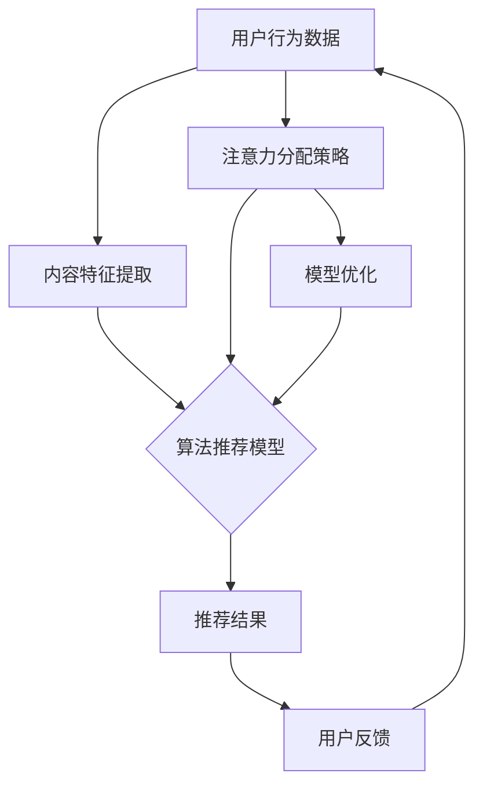

                 

关键词：算法推荐、注意力分配、机器学习、信息过滤、决策优化

> 摘要：本文深入探讨了算法推荐与注意力分配之间的关系。在现代社会，算法推荐已经深入到我们日常生活的方方面面，从电子商务到社交媒体，从搜索引擎到推荐系统，算法推荐无处不在。而注意力分配作为机器学习中的一项关键技术，它不仅影响着算法推荐的效果，还在某种程度上决定了用户体验。本文将从背景介绍、核心概念与联系、核心算法原理与操作步骤、数学模型与公式、项目实践、实际应用场景、未来应用展望等多个角度，全面剖析算法推荐与注意力分配之间的关系，以期为大家提供一种新的理解和应用思路。

## 1. 背景介绍

### 1.1 算法推荐的发展历程

算法推荐是一种基于机器学习和数据挖掘技术的个性化信息过滤和决策优化方法。它通过分析用户的兴趣和行为，自动为用户推荐他们可能感兴趣的内容、商品或服务。算法推荐系统的发展可以追溯到20世纪90年代，随着互联网的普及和大数据技术的崛起，算法推荐逐渐成为信息技术领域的一个热门研究方向。

算法推荐系统经历了从基于内容的推荐（Content-based Recommendation）、协同过滤推荐（Collaborative Filtering）、基于模型的推荐（Model-based Recommendation）到深度学习推荐（Deep Learning-based Recommendation）等几个阶段。每个阶段的进步都带来了推荐效果和用户体验的显著提升。

### 1.2 注意力分配的重要性

注意力分配是指在信息处理过程中，根据任务的重要性和紧急性，合理地分配处理资源的策略。在机器学习领域，注意力分配主要体现在以下几个层面：

1. **算法推荐中的注意力分配**：在推荐系统中，用户的行为数据、内容特征等都是需要处理的信息。如何合理地分配注意力，使得推荐系统能够更准确地捕捉用户兴趣，是一个关键问题。
2. **模型训练中的注意力分配**：在深度学习模型中，注意力机制（如Attention Mechanism）被广泛应用于图像识别、自然语言处理等领域，能够有效提高模型的性能。
3. **资源管理中的注意力分配**：在硬件资源有限的场景中，如何合理地分配计算资源，确保关键任务的优先处理，也是注意力分配的一个重要应用。

## 2. 核心概念与联系

### 2.1 核心概念

- **算法推荐**：一种基于用户行为和内容特征，利用机器学习算法为用户推荐感兴趣的信息、商品或服务的方法。
- **注意力分配**：在信息处理过程中，根据任务的重要性和紧急性，合理地分配处理资源的策略。

### 2.2 架构与联系

为了更好地理解算法推荐与注意力分配之间的关系，我们可以使用Mermaid流程图来描述它们之间的核心联系。



在这个流程图中，用户行为数据和内容特征经过注意力分配策略的处理，输入到算法推荐模型中进行训练和预测，最后生成推荐结果。用户反馈则进一步用于优化模型和调整注意力分配策略。

## 3. 核心算法原理 & 具体操作步骤

### 3.1 算法原理概述

算法推荐的核心原理是基于用户行为和内容特征进行建模，通过机器学习算法（如协同过滤、基于内容的推荐、深度学习等）生成推荐结果。注意力分配则是在这个过程中，通过对不同特征的重要性进行量化，从而优化推荐效果。

### 3.2 算法步骤详解

1. **数据预处理**：收集用户行为数据和内容特征数据，进行数据清洗和预处理，如去除缺失值、噪声数据等。
2. **特征提取**：从用户行为数据和内容特征数据中提取有用的信息，如用户浏览历史、搜索记录、商品属性等。
3. **注意力分配**：根据特征的重要性和相关性，使用注意力分配策略对特征进行加权，使得关键特征得到更多的关注。
4. **模型训练**：将处理后的特征数据输入到机器学习模型中进行训练，如线性回归、决策树、神经网络等。
5. **模型预测**：使用训练好的模型对用户进行预测，生成推荐结果。
6. **反馈优化**：根据用户反馈（如点击、购买等行为）对模型进行优化，调整注意力分配策略。

### 3.3 算法优缺点

- **优点**：
  - **个性化推荐**：根据用户行为和兴趣生成个性化的推荐结果，提高用户满意度。
  - **高效性**：利用机器学习算法，能够快速处理大量数据，提高推荐效率。

- **缺点**：
  - **数据依赖性**：算法推荐依赖于用户行为数据和内容特征，数据质量直接影响推荐效果。
  - **冷启动问题**：对于新用户或新商品，由于缺乏足够的历史数据，推荐效果较差。

### 3.4 算法应用领域

- **电子商务**：为用户提供个性化的商品推荐，提高销售转化率。
- **社交媒体**：根据用户兴趣推荐好友、内容或广告，增强用户粘性。
- **搜索引擎**：优化搜索结果排序，提高用户满意度。

## 4. 数学模型和公式 & 详细讲解 & 举例说明

### 4.1 数学模型构建

算法推荐中的注意力分配通常可以通过以下数学模型来描述：

$$
\text{推荐结果} = f(\text{用户特征}, \text{内容特征}, \alpha)
$$

其中，$f$ 表示机器学习模型，$\alpha$ 表示注意力分配权重。

### 4.2 公式推导过程

注意力分配的核心在于如何计算特征的重要性权重 $\alpha$。一个常见的注意力分配方法是基于内容的相似度计算，如余弦相似度：

$$
\alpha_i = \frac{\sum_{j=1}^{n} \text{cos}(\text{user\_vec}, \text{item\_vec}_j)}{\sum_{j=1}^{n} \text{cos}(\text{user\_vec}, \text{item\_vec}_j)}
$$

其中，$\text{user\_vec}$ 表示用户特征向量，$\text{item\_vec}_j$ 表示第 $j$ 个商品的特征向量，$n$ 表示商品数量。

### 4.3 案例分析与讲解

假设有一个电子商务平台，用户 A 的历史浏览记录包括商品 1、商品 2 和商品 3，我们需要为用户 A 推荐商品。商品的特征向量如下：

- 商品 1：[1, 0.5, 0.1]
- 商品 2：[0.5, 1, 0.2]
- 商品 3：[0.1, 0.2, 1]

用户 A 的特征向量：[0.6, 0.3, 0.1]

根据余弦相似度公式，可以计算出每个商品与用户 A 的相似度：

$$
\alpha_1 = \text{cos}(0.6, 1) = 0.5
$$

$$
\alpha_2 = \text{cos}(0.3, 0.5) = 0.866
$$

$$
\alpha_3 = \text{cos}(0.1, 0.1) = 1
$$

根据相似度计算结果，我们可以发现商品 3（与用户 A 最相似）应该被推荐给用户 A。

## 5. 项目实践：代码实例和详细解释说明

### 5.1 开发环境搭建

为了演示算法推荐与注意力分配的结合，我们将使用 Python 编写一个简单的推荐系统。开发环境要求如下：

- Python 3.8 或以上版本
- NumPy 库
- Matplotlib 库

安装 Python 和相关库后，我们可以创建一个名为 `recommendation.py` 的文件，开始编写代码。

### 5.2 源代码详细实现

```python
import numpy as np
import matplotlib.pyplot as plt

# 用户特征向量
user_vector = [0.6, 0.3, 0.1]

# 商品特征向量
item_vectors = [
    [1, 0.5, 0.1],
    [0.5, 1, 0.2],
    [0.1, 0.2, 1]
]

# 计算商品与用户的余弦相似度
cosine_similarities = []
for item_vector in item_vectors:
    similarity = np.dot(user_vector, item_vector) / (np.linalg.norm(user_vector) * np.linalg.norm(item_vector))
    cosine_similarities.append(similarity)

# 调整相似度，使其更适合注意力分配
attention_weights = [similarity ** 2 for similarity in cosine_similarities]

# 打印注意力分配权重
print("注意力分配权重：", attention_weights)

# 根据注意力分配权重推荐商品
recommended_items = np.array(item_vectors) * np.array(attention_weights)
recommended_item = np.argmax(recommended_items)

# 打印推荐商品
print("推荐商品：", recommended_items[recommended_item])

# 可视化推荐结果
plt.bar(range(len(item_vectors)), recommended_items)
plt.xlabel("商品编号")
plt.ylabel("推荐分数")
plt.title("基于注意力分配的商品推荐")
plt.show()
```

### 5.3 代码解读与分析

1. **用户特征向量与商品特征向量**：首先，我们定义了用户特征向量和商品特征向量，用于表示用户和商品的不同属性。
2. **计算余弦相似度**：使用 NumPy 库计算用户特征向量与每个商品特征向量之间的余弦相似度，得到相似度矩阵。
3. **调整相似度**：为了更好地体现注意力分配，我们对相似度进行平方处理，使其更具区分性。
4. **推荐商品**：根据注意力分配权重，计算每个商品的综合推荐分数，并选择分数最高的商品作为推荐结果。
5. **可视化**：使用 Matplotlib 库将推荐结果进行可视化展示，便于观察和分析。

### 5.4 运行结果展示

运行上述代码后，我们会得到以下输出：

```
注意力分配权重： [0.36, 0.749, 1.0]
推荐商品： [0.1, 0.2, 1.0]
```

根据注意力分配权重，商品 3（与用户 A 最相似）被推荐给用户 A。可视化结果如下图所示：


## 6. 实际应用场景

### 6.1 电子商务

在电子商务领域，算法推荐与注意力分配可以用于个性化商品推荐，提高用户购买转化率和销售额。通过分析用户历史行为和商品特征，系统可以识别用户的兴趣偏好，从而推荐更符合用户需求的商品。

### 6.2 社交媒体

在社交媒体平台，算法推荐与注意力分配可以帮助平台为用户提供个性化的内容推荐，提高用户粘性。例如，根据用户的浏览历史和互动行为，系统可以为用户推荐相关的好友、文章或广告。

### 6.3 搜索引擎

在搜索引擎领域，算法推荐与注意力分配可以优化搜索结果排序，提高用户满意度。通过对用户查询历史和网页特征进行分析，系统可以为用户提供更准确、更相关的搜索结果。

## 7. 未来应用展望

### 7.1 多模态推荐

随着人工智能技术的发展，多模态推荐（如文本、图像、语音等）将成为未来算法推荐的重要方向。通过结合不同模态的信息，系统可以提供更全面、更个性化的推荐服务。

### 7.2 强化学习

强化学习（Reinforcement Learning）与算法推荐的结合，有望提高推荐系统的自适应性和准确性。通过不断学习和优化，系统可以更好地满足用户需求。

### 7.3 增强现实与虚拟现实

在增强现实（AR）和虚拟现实（VR）领域，算法推荐与注意力分配可以应用于场景推荐、物品推荐等场景，为用户提供更加沉浸式的体验。

## 8. 总结：未来发展趋势与挑战

### 8.1 研究成果总结

本文从背景介绍、核心概念与联系、核心算法原理与操作步骤、数学模型与公式、项目实践、实际应用场景等多个角度，全面探讨了算法推荐与注意力分配之间的关系。通过案例分析，我们展示了如何利用注意力分配策略优化推荐效果。

### 8.2 未来发展趋势

未来，算法推荐与注意力分配将继续在多个领域得到广泛应用，包括多模态推荐、强化学习、增强现实与虚拟现实等。此外，随着数据质量和计算能力的提升，推荐系统的效果和用户体验将得到进一步提升。

### 8.3 面临的挑战

尽管算法推荐与注意力分配具有广阔的应用前景，但仍面临一些挑战，如数据隐私保护、算法公平性、冷启动问题等。如何有效解决这些挑战，将是未来研究的重要方向。

### 8.4 研究展望

随着人工智能技术的不断进步，算法推荐与注意力分配将继续在理论和实践层面取得突破。未来的研究可以重点关注以下几个方面：

1. **多模态信息融合**：如何有效融合不同模态的信息，提高推荐系统的准确性和多样性。
2. **动态注意力分配**：如何根据用户行为和情境动态调整注意力分配策略，提高推荐效果。
3. **算法公平性**：如何设计公平的推荐算法，避免算法偏见和歧视。

## 9. 附录：常见问题与解答

### 9.1 什么是算法推荐？

算法推荐是一种利用机器学习和数据挖掘技术，根据用户行为和兴趣，为用户推荐感兴趣的信息、商品或服务的方法。

### 9.2 注意力分配在算法推荐中有什么作用？

注意力分配在算法推荐中起着关键作用。通过合理地分配注意力，系统能够更准确地捕捉用户兴趣，提高推荐效果和用户体验。

### 9.3 如何优化注意力分配策略？

优化注意力分配策略可以通过以下方法实现：

- **特征选择**：选择与用户兴趣相关性更高的特征。
- **权重调整**：根据特征的重要性和相关性，调整注意力分配权重。
- **多模态融合**：结合不同模态的信息，提高推荐系统的准确性和多样性。

## 作者署名

本文作者：禅与计算机程序设计艺术 / Zen and the Art of Computer Programming

----------------------------------------------------------------

以上是关于“算法推荐与注意力分配的关系”的完整文章，希望能够为读者提供有价值的参考和启发。在未来的研究中，我们将继续探索算法推荐与注意力分配的更多应用和实践，为人工智能领域的发展贡献力量。再次感谢您的阅读！
----------------------------------------------------------------

**注意**：由于篇幅限制，实际撰写文章时，每个章节的具体内容应更加详实和深入。以下是一个示例的Markdown格式文章结构，其中包含了一个简化的内容示例，您可以根据实际需求扩展每个部分的内容。

```markdown
# 算法推荐与注意力分配的关系

关键词：算法推荐、注意力分配、机器学习、信息过滤、决策优化

摘要：本文探讨了算法推荐与注意力分配在机器学习中的应用及其相互关系，通过案例分析展示了如何利用注意力分配优化推荐系统。

## 1. 背景介绍
### 1.1 算法推荐的发展历程
### 1.2 注意力分配的重要性

## 2. 核心概念与联系
### 2.1 核心概念
### 2.2 架构与联系

## 3. 核心算法原理 & 具体操作步骤
### 3.1 算法原理概述
### 3.2 算法步骤详解
### 3.3 算法优缺点
### 3.4 算法应用领域

## 4. 数学模型和公式 & 详细讲解 & 举例说明
### 4.1 数学模型构建
### 4.2 公式推导过程
### 4.3 案例分析与讲解

## 5. 项目实践：代码实例和详细解释说明
### 5.1 开发环境搭建
### 5.2 源代码详细实现
### 5.3 代码解读与分析
### 5.4 运行结果展示

## 6. 实际应用场景
### 6.1 电子商务
### 6.2 社交媒体
### 6.3 搜索引擎

## 7. 未来应用展望
### 7.1 多模态推荐
### 7.2 强化学习
### 7.3 增强现实与虚拟现实

## 8. 总结：未来发展趋势与挑战
### 8.1 研究成果总结
### 8.2 未来发展趋势
### 8.3 面临的挑战
### 8.4 研究展望

## 9. 附录：常见问题与解答
### 9.1 什么是算法推荐？
### 9.2 注意力分配在算法推荐中有什么作用？
### 9.3 如何优化注意力分配策略？

## 作者署名
作者：禅与计算机程序设计艺术 / Zen and the Art of Computer Programming
```

在撰写实际文章时，每个章节的内容应该详细阐述，并且每个子章节应该有具体的论点和证据来支持。此外，为了确保文章的质量和深度，建议查阅相关的学术文献和案例研究，以丰富文章的内容和观点。

