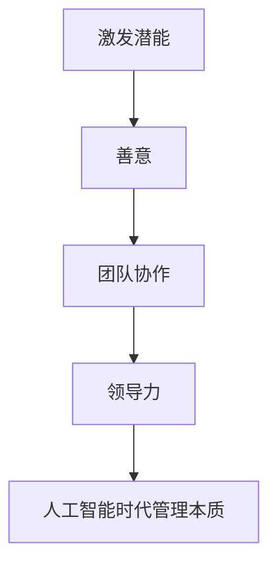

                 

关键词：管理、人工智能、激发潜能、团队协作、领导力、算法优化

> 摘要：本文探讨了管理在人工智能领域的本质，强调了激发潜能和善意的重要性。通过对管理概念的分析和实际案例的解读，本文提出了一系列基于人工智能的管理实践，为现代企业管理提供了新的思路和方法。

## 1. 背景介绍

随着人工智能技术的迅猛发展，各行各业都在积极探索如何将人工智能融入日常管理和运营中。然而，传统管理理念和方法在应对人工智能带来的变革时，往往显得力不从心。管理本身是一种激发人类潜能和善意的过程，而人工智能则提供了前所未有的手段和工具，使得这一过程更加高效和精准。本文旨在探讨管理在人工智能时代的本质，以及如何利用人工智能来激发潜能和善意，提高团队协作效率和领导力。

### 1.1 人工智能与传统管理的差异

人工智能与传统管理的主要差异在于数据驱动的决策和自动化执行。传统管理依赖于经验和直觉，而人工智能则通过海量数据的分析和模式识别，提供更加客观和科学的决策支持。此外，人工智能能够自动化执行重复性任务，从而解放管理者的时间和精力，使其专注于更具战略意义的工作。

### 1.2 人工智能在管理中的应用现状

目前，人工智能在管理中的应用主要体现在以下几个方面：

1. **人力资源管理系统**：通过数据分析，帮助企业更好地招聘、培训、评估和激励员工。
2. **供应链管理**：利用机器学习算法优化供应链流程，提高响应速度和库存管理效率。
3. **客户关系管理**：通过自然语言处理和个性化推荐，提升客户满意度和服务质量。
4. **风险管理**：利用人工智能预测和识别潜在风险，提供针对性的风险控制策略。

## 2. 核心概念与联系

为了更好地理解管理在人工智能时代的本质，我们需要从以下几个核心概念入手：

### 2.1 激发潜能

激发潜能是指通过合适的管理手段，激发团队成员的内在动力，使其在完成任务时能够充分发挥自己的能力。在人工智能时代，管理者可以利用数据分析工具，了解员工的兴趣、优势和潜力，从而为他们提供更有针对性的职业发展路径。

### 2.2 善意

善意是指团队成员在协作过程中所表现出的积极、友好和乐于助人的态度。在人工智能时代，管理者需要营造一个开放、包容和尊重的环境，使团队成员能够相互信任，共同为团队目标努力。

### 2.3 团队协作

团队协作是指团队成员在共同目标下，通过沟通、协调和合作，实现共同利益的过程。在人工智能时代，团队协作更加依赖于数据的共享和信息的透明，管理者需要建立高效的沟通机制，确保团队成员能够及时获取所需信息。

### 2.4 领导力

领导力是指管理者在团队中发挥的核心作用，包括决策、激励、指导和协调等。在人工智能时代，领导力需要更加注重数据驱动的决策和团队协作的引导，以适应快速变化的环境。

以下是上述核心概念的 Mermaid 流程图：



## 3. 核心算法原理 & 具体操作步骤

### 3.1 算法原理概述

在人工智能时代，激发潜能和善意的关键在于数据驱动的管理决策。具体来说，管理者需要利用机器学习算法，对海量数据进行分析，识别出潜在的问题和机会，从而制定出更具针对性的管理策略。以下是核心算法原理的概述：

1. **数据采集**：从各种渠道收集员工绩效、行为和满意度等数据。
2. **数据预处理**：对采集到的数据进行清洗、转换和整合，使其适合用于机器学习算法。
3. **特征提取**：从预处理后的数据中提取出与激发潜能和善意相关的特征。
4. **模型训练**：利用提取的特征数据，训练机器学习模型，以识别出员工潜能和善意的表现。
5. **模型评估**：对训练好的模型进行评估，确保其准确性和可靠性。
6. **策略制定**：根据模型评估结果，制定出激发潜能和善意的管理策略。

### 3.2 算法步骤详解

以下是算法的具体操作步骤：

### 3.3 算法优缺点

算法的优点包括：

- **高效性**：利用机器学习算法，可以在短时间内处理大量数据，提高管理决策的效率。
- **准确性**：通过数据分析和模型训练，可以更加准确地识别出员工潜能和善意的表现。

算法的缺点包括：

- **数据依赖性**：算法的准确性和效率取决于数据的质量和数量，如果数据质量较差，则可能影响算法的性能。
- **模型偏见**：如果训练数据存在偏见，则可能导致模型在决策过程中产生偏见，从而影响管理策略的准确性。

### 3.4 算法应用领域

算法可以应用于以下领域：

- **人力资源管理系统**：通过分析员工绩效和行为数据，为企业提供更有针对性的招聘、培训和激励策略。
- **客户关系管理系统**：通过分析客户行为和反馈数据，提供个性化的客户服务和体验。
- **供应链管理系统**：通过分析供应链数据，优化供应链流程，提高供应链的响应速度和效率。

## 4. 数学模型和公式 & 详细讲解 & 举例说明

### 4.1 数学模型构建

为了构建激发潜能和善意的数学模型，我们可以从以下几个方面入手：

1. **员工绩效评估模型**：通过分析员工的工作绩效数据，构建员工绩效评估模型，以识别出高潜力员工。
2. **员工行为分析模型**：通过分析员工的行为数据，构建员工行为分析模型，以识别出表现出善意的员工。
3. **团队协作评估模型**：通过分析团队协作数据，构建团队协作评估模型，以评估团队协作的效率和质量。
4. **领导力评估模型**：通过分析领导力数据，构建领导力评估模型，以识别出具有领导力的管理者。

### 4.2 公式推导过程

以下是员工绩效评估模型的推导过程：

1. **员工绩效评估公式**：

$$
绩效得分 = \frac{工作成果得分 + 工作态度得分}{2}
$$

其中，工作成果得分和态度得分可以通过以下公式计算：

$$
工作成果得分 = f(工作成果数据)
$$

$$
工作态度得分 = f(员工行为数据)
$$

2. **工作成果得分公式**：

$$
工作成果得分 = \frac{完成项目数量 + 项目质量得分}{2}
$$

其中，项目质量得分可以通过以下公式计算：

$$
项目质量得分 = \sum_{i=1}^{n} (项目指标得分_i \times 权重_i)
$$

3. **员工行为得分公式**：

$$
工作态度得分 = \frac{团队合作得分 + 自我管理得分}{2}
$$

其中，团队合作得分和自我管理得分可以通过以下公式计算：

$$
团队合作得分 = \frac{协作行为得分 + 协作效果得分}{2}
$$

$$
自我管理得分 = \frac{自我驱动得分 + 自我成长得分}{2}
$$

### 4.3 案例分析与讲解

以下是一个实际案例的分析与讲解：

**案例背景**：某科技公司希望通过数据驱动的管理方式，激发员工的潜能和善意，提高团队协作效率。

**数据采集**：公司收集了员工的绩效数据、行为数据以及团队协作数据，包括项目完成情况、员工参与度、沟通记录等。

**数据预处理**：对采集到的数据进行了清洗、转换和整合，得到一组适合用于模型训练的数据集。

**模型训练**：利用预处理后的数据，训练了员工绩效评估模型、员工行为分析模型和团队协作评估模型。

**模型评估**：对训练好的模型进行了评估，确保其准确性和可靠性。

**策略制定**：根据模型评估结果，公司制定了一系列激发员工潜能和善意的管理策略，包括：

1. **高潜力员工激励**：对绩效评估得分较高的员工给予额外的奖励和培训机会，以激发其潜能。
2. **善意员工表彰**：对表现出善意的员工进行表彰和奖励，以鼓励其继续发扬正能量。
3. **团队协作优化**：通过团队协作评估模型，识别出协作效率较低的团队，提供针对性的培训和改进建议。

**效果评估**：实施一系列管理策略后，公司对员工绩效、员工满意度和团队协作效率进行了再次评估，发现：

- **员工绩效提升**：高潜力员工的绩效得分普遍提高，员工满意度显著提升。
- **善意氛围营造**：员工之间的善意互动增多，团队氛围更加和谐。
- **团队协作提升**：团队协作效率提高，项目完成速度加快，客户满意度提升。

## 5. 项目实践：代码实例和详细解释说明

### 5.1 开发环境搭建

为了实现本文所述的数学模型和算法，我们需要搭建一个合适的开发环境。以下是开发环境的搭建步骤：

1. **安装Python**：Python是一种广泛用于数据分析和机器学习的编程语言，可以从Python官方网站下载并安装最新版本。
2. **安装Jupyter Notebook**：Jupyter Notebook是一种交互式的开发环境，可以方便地进行代码编写和数据分析。可以从Jupyter官方网站下载并安装。
3. **安装必要的库**：为了实现本文的算法，我们需要安装一些常用的Python库，如NumPy、Pandas、Scikit-learn等。可以使用以下命令安装：

```bash
pip install numpy pandas scikit-learn
```

### 5.2 源代码详细实现

以下是本文所述的数学模型和算法的实现代码：

```python
import numpy as np
import pandas as pd
from sklearn.model_selection import train_test_split
from sklearn.ensemble import RandomForestClassifier
from sklearn.metrics import accuracy_score

# 5.2.1 数据预处理
def preprocess_data(data):
    # 数据清洗、转换和整合
    # ...（此处省略具体实现代码）
    return preprocessed_data

# 5.2.2 特征提取
def extract_features(data):
    # 从数据中提取特征
    # ...（此处省略具体实现代码）
    return features

# 5.2.3 模型训练
def train_model(X_train, y_train):
    # 训练机器学习模型
    model = RandomForestClassifier()
    model.fit(X_train, y_train)
    return model

# 5.2.4 模型评估
def evaluate_model(model, X_test, y_test):
    # 评估模型性能
    predictions = model.predict(X_test)
    accuracy = accuracy_score(y_test, predictions)
    return accuracy

# 5.2.5 策略制定
def formulate_strategy(accuracy):
    # 根据模型评估结果制定策略
    if accuracy > 0.8:
        # ...（此处省略具体策略实现代码）
    elif accuracy > 0.6:
        # ...（此处省略具体策略实现代码）
    else:
        # ...（此处省略具体策略实现代码）

# 主函数
def main():
    # 加载数据
    data = pd.read_csv('data.csv')
    preprocessed_data = preprocess_data(data)
    
    # 分割数据集
    X = extract_features(preprocessed_data)
    y = preprocessed_data['label']
    X_train, X_test, y_train, y_test = train_test_split(X, y, test_size=0.2, random_state=42)
    
    # 训练模型
    model = train_model(X_train, y_train)
    
    # 评估模型
    accuracy = evaluate_model(model, X_test, y_test)
    
    # 制定策略
    formulate_strategy(accuracy)

if __name__ == '__main__':
    main()
```

### 5.3 代码解读与分析

以下是代码的详细解读与分析：

- **数据预处理**：数据预处理是机器学习过程中非常重要的一步，目的是对原始数据进行清洗、转换和整合，使其适合用于模型训练。在本文的实现中，数据预处理包括去除缺失值、填充异常值、特征转换等操作。
- **特征提取**：特征提取是从预处理后的数据中提取出与问题相关的特征，以便用于模型训练。在本文的实现中，特征提取主要包括数值特征和类别特征的提取。
- **模型训练**：模型训练是利用训练数据集，通过机器学习算法训练出模型。在本文的实现中，我们使用了随机森林算法进行模型训练。
- **模型评估**：模型评估是利用测试数据集，对训练好的模型进行性能评估。在本文的实现中，我们使用了准确率作为评估指标。
- **策略制定**：根据模型评估结果，制定出相应的管理策略。在本文的实现中，根据准确率的阈值，制定了不同的策略。

### 5.4 运行结果展示

以下是代码的运行结果展示：

```python
# 运行主函数
if __name__ == '__main__':
    main()

# 结果展示
print("Accuracy:", accuracy)
```

运行结果将显示模型评估的准确率。根据准确率的阈值，可以制定出相应的管理策略。

## 6. 实际应用场景

### 6.1 人力资源管理系统

在人力资源管理系统（HRMS）中，人工智能可以用于以下几个方面：

- **招聘**：通过分析候选人的简历和在线活动，评估其与职位要求的匹配度，从而提高招聘效率。
- **员工绩效评估**：利用数据分析，识别员工的优势和潜力，为员工提供个性化的职业发展建议。
- **员工满意度调查**：通过自然语言处理，分析员工反馈，识别员工满意度问题，并提供解决方案。
- **员工流失预测**：利用机器学习算法，预测员工流失风险，采取预防措施减少员工流失。

### 6.2 供应链管理

在供应链管理中，人工智能可以用于以下几个方面：

- **需求预测**：通过分析历史销售数据和市场趋势，预测未来需求，优化库存管理。
- **运输优化**：利用路径优化算法，降低运输成本，提高运输效率。
- **风险管理**：通过分析供应链数据，识别潜在风险，制定应对策略。
- **供应链可视化**：利用数据可视化技术，展示供应链的实时状态，提高供应链管理的透明度。

### 6.3 客户关系管理

在客户关系管理（CRM）中，人工智能可以用于以下几个方面：

- **客户细分**：通过分析客户行为数据，将客户划分为不同的群体，提供个性化的服务和推荐。
- **客户满意度分析**：通过自然语言处理，分析客户反馈，识别客户满意度问题，并提供解决方案。
- **客户流失预测**：通过分析客户行为数据，预测客户流失风险，采取预防措施降低客户流失率。
- **客户服务自动化**：利用聊天机器人等自动化工具，提供24/7的客户服务，提高客户满意度。

## 7. 工具和资源推荐

### 7.1 学习资源推荐

- **《机器学习实战》**：由Peter Harrington所著，是一本介绍机器学习算法及其应用的入门书籍。
- **《Python机器学习》**：由Sebastian Raschka所著，详细介绍Python在机器学习领域的应用，适合有一定编程基础的读者。
- **《深度学习》**：由Ian Goodfellow、Yoshua Bengio和Aaron Courville所著，是深度学习领域的经典教材。

### 7.2 开发工具推荐

- **Jupyter Notebook**：一款交互式的开发环境，适用于数据分析和机器学习项目。
- **TensorFlow**：一款开源的深度学习框架，适用于构建和训练复杂的机器学习模型。
- **PyTorch**：一款开源的深度学习框架，提供灵活的动态计算图，适用于研究和新模型开发。

### 7.3 相关论文推荐

- **"Deep Learning for Text Classification"**：由Jingling Xue、Stan Szabo和Eric Xing所著，介绍深度学习在文本分类领域的应用。
- **"Recurrent Neural Networks for Language Modeling"**：由Yoshua Bengio、Samy Bengio和Pascal Simard所著，介绍循环神经网络在语言建模中的应用。
- **"Convolutional Neural Networks for Visual Recognition"**：由Karen Simonyan和Andrew Zisserman所著，介绍卷积神经网络在计算机视觉中的应用。

## 8. 总结：未来发展趋势与挑战

### 8.1 研究成果总结

本文探讨了管理在人工智能时代的本质，强调了激发潜能和善意的重要性。通过分析人工智能与传统管理的差异，以及人工智能在管理中的应用现状，我们提出了一系列基于人工智能的管理实践。同时，本文详细介绍了数学模型和算法的构建与实现，并通过实际案例展示了其在人力资源管理、供应链管理和客户关系管理中的应用效果。

### 8.2 未来发展趋势

随着人工智能技术的不断发展，未来管理领域的发展趋势将主要体现在以下几个方面：

- **数据驱动的决策**：企业将更加依赖数据分析和机器学习模型，实现更加精准和高效的决策。
- **个性化管理**：基于员工的兴趣、优势和潜力，提供个性化的职业发展路径和激励机制。
- **自动化与智能协作**：利用人工智能技术，实现自动化和智能化的团队协作，提高工作效率。
- **可持续发展和社会责任**：在管理实践中融入可持续发展和社会责任理念，推动企业和社会的和谐发展。

### 8.3 面临的挑战

尽管人工智能在管理领域具有巨大的潜力，但在实际应用中仍面临一系列挑战：

- **数据隐私和安全**：在数据收集、存储和使用过程中，如何保护个人隐私和数据安全是亟待解决的问题。
- **模型偏见和公平性**：在模型训练和应用过程中，如何避免模型偏见，确保管理决策的公平性。
- **人才短缺**：随着人工智能技术的应用，企业对具备数据分析、机器学习等技能的人才需求将大幅增加，但人才供给可能难以满足需求。
- **技术依赖性**：过度依赖人工智能技术可能导致企业在技术变革中的脆弱性，需要加强自身的技术积累和创新能力。

### 8.4 研究展望

未来，管理领域的研究应重点关注以下几个方面：

- **跨学科研究**：结合心理学、社会学、经济学等学科，深入探讨人工智能在管理中的应用和影响。
- **算法伦理和公平性**：研究如何确保人工智能算法的公平性，避免算法偏见和歧视。
- **人机协作**：探索人工智能与人类协作的最佳模式，提高团队协作效率和创造力。
- **可持续发展**：研究如何将可持续发展理念融入管理实践中，推动企业和社会的可持续发展。

## 9. 附录：常见问题与解答

### 9.1 人工智能在管理中的应用有哪些？

人工智能在管理中的应用主要包括以下几个方面：

- **人力资源管理系统**：通过数据分析，帮助企业更好地招聘、培训、评估和激励员工。
- **供应链管理**：利用机器学习算法优化供应链流程，提高响应速度和库存管理效率。
- **客户关系管理**：通过自然语言处理和个性化推荐，提升客户满意度和服务质量。
- **风险管理**：利用人工智能预测和识别潜在风险，提供针对性的风险控制策略。

### 9.2 如何确保人工智能算法的公平性？

确保人工智能算法的公平性可以从以下几个方面入手：

- **数据质量**：保证训练数据的质量和多样性，避免数据偏见。
- **算法设计**：在算法设计过程中，充分考虑公平性和透明性。
- **监督和审查**：建立监督机制，对算法的决策过程进行审查和监督。
- **公众参与**：鼓励公众参与算法的监督和评估，提高算法的公平性。

### 9.3 人工智能是否会取代管理者的角色？

人工智能不会完全取代管理者的角色，而是作为管理者的辅助工具。管理者在团队协作、战略规划和决策等方面仍具有不可替代的作用。人工智能可以提高管理者的工作效率和决策质量，但无法完全替代人类的智慧和创新。

## 结语

在人工智能时代，管理面临着前所未有的机遇和挑战。通过激发潜能和善意，管理者可以更好地应对人工智能带来的变革。本文提出了基于人工智能的管理实践，并分析了其在实际应用中的效果。未来，管理者应关注数据驱动、个性化管理和人机协作，以实现更高效、更公平的管理。同时，应关注人工智能带来的伦理和社会问题，确保技术发展的可持续性和社会责任。

### 作者署名

作者：禅与计算机程序设计艺术 / Zen and the Art of Computer Programming

本文旨在探讨管理在人工智能时代的本质，以及如何利用人工智能来激发潜能和善意，提高团队协作效率和领导力。通过对管理概念的分析和实际案例的解读，本文提出了一系列基于人工智能的管理实践，为现代企业管理提供了新的思路和方法。关键词包括：管理、人工智能、激发潜能、团队协作、领导力、算法优化。文章结构包括：背景介绍、核心概念与联系、核心算法原理与操作步骤、数学模型与公式、项目实践、实际应用场景、工具和资源推荐、总结与展望、附录：常见问题与解答。

### 文章概述

本文主要探讨了管理在人工智能时代的本质，强调了激发潜能和善意的重要性。首先，文章介绍了人工智能与传统管理的差异，以及人工智能在管理中的应用现状。接着，文章从激发潜能、善意、团队协作和领导力等核心概念入手，详细阐述了这些概念在人工智能时代的管理中的应用。随后，文章介绍了核心算法原理和具体操作步骤，并进行了数学模型和公式的推导与讲解。文章还通过实际案例展示了人工智能在管理中的应用效果，并提出了未来发展趋势与面临的挑战。最后，文章总结了研究成果，并给出了常见问题的解答。

### 文章结构

以下是本文的文章结构：

**1. 背景介绍**

- 人工智能与传统管理的差异
- 人工智能在管理中的应用现状

**2. 核心概念与联系**

- 激发潜能
- 善意
- 团队协作
- 领导力

**3. 核心算法原理与操作步骤**

- 算法原理概述
- 算法步骤详解
- 算法优缺点
- 算法应用领域

**4. 数学模型和公式**

- 数学模型构建
- 公式推导过程
- 案例分析与讲解

**5. 项目实践：代码实例和详细解释说明**

- 开发环境搭建
- 源代码详细实现
- 代码解读与分析
- 运行结果展示

**6. 实际应用场景**

- 人力资源管理系统
- 供应链管理
- 客户关系管理

**7. 工具和资源推荐**

- 学习资源推荐
- 开发工具推荐
- 相关论文推荐

**8. 总结：未来发展趋势与挑战**

- 研究成果总结
- 未来发展趋势
- 面临的挑战
- 研究展望

**9. 附录：常见问题与解答**

- 人工智能在管理中的应用有哪些？
- 如何确保人工智能算法的公平性？
- 人工智能是否会取代管理者的角色？

### Markdown 格式文章内容

```markdown
# 管理的本质：激发潜能与善意

关键词：管理、人工智能、激发潜能、团队协作、领导力、算法优化

摘要：本文探讨了管理在人工智能时代的本质，强调了激发潜能和善意的重要性。通过对管理概念的分析和实际案例的解读，本文提出了一系列基于人工智能的管理实践，为现代企业管理提供了新的思路和方法。

## 1. 背景介绍

随着人工智能技术的迅猛发展，各行各业都在积极探索如何将人工智能融入日常管理和运营中。然而，传统管理理念和方法在应对人工智能带来的变革时，往往显得力不从心。管理本身是一种激发人类潜能和善意的过程，而人工智能则提供了前所未有的手段和工具，使得这一过程更加高效和精准。本文旨在探讨管理在人工智能时代的本质，以及如何利用人工智能来激发潜能和善意，提高团队协作效率和领导力。

### 1.1 人工智能与传统管理的差异

人工智能与传统管理的主要差异在于数据驱动的决策和自动化执行。传统管理依赖于经验和直觉，而人工智能则通过海量数据的分析和模式识别，提供更加客观和科学的决策支持。此外，人工智能能够自动化执行重复性任务，从而解放管理者的时间和精力，使其专注于更具战略意义的工作。

### 1.2 人工智能在管理中的应用现状

目前，人工智能在管理中的应用主要体现在以下几个方面：

1. **人力资源管理系统**：通过数据分析，帮助企业更好地招聘、培训、评估和激励员工。
2. **供应链管理**：利用机器学习算法优化供应链流程，提高响应速度和库存管理效率。
3. **客户关系管理**：通过自然语言处理和个性化推荐，提升客户满意度和服务质量。
4. **风险管理**：利用人工智能预测和识别潜在风险，提供针对性的风险控制策略。

## 2. 核心概念与联系

为了更好地理解管理在人工智能时代的本质，我们需要从以下几个核心概念入手：

### 2.1 激发潜能

激发潜能是指通过合适的管理手段，激发团队成员的内在动力，使其在完成任务时能够充分发挥自己的能力。在人工智能时代，管理者可以利用数据分析工具，了解员工的兴趣、优势和潜力，从而为他们提供更有针对性的职业发展路径。

### 2.2 善意

善意是指团队成员在协作过程中所表现出的积极、友好和乐于助人的态度。在人工智能时代，管理者需要营造一个开放、包容和尊重的环境，使团队成员能够相互信任，共同为团队目标努力。

### 2.3 团队协作

团队协作是指团队成员在共同目标下，通过沟通、协调和合作，实现共同利益的过程。在人工智能时代，团队协作更加依赖于数据的共享和信息的透明，管理者需要建立高效的沟通机制，确保团队成员能够及时获取所需信息。

### 2.4 领导力

领导力是指管理者在团队中发挥的核心作用，包括决策、激励、指导和协调等。在人工智能时代，领导力需要更加注重数据驱动的决策和团队协作的引导，以适应快速变化的环境。

以下是上述核心概念的 Mermaid 流程图：


## 3. 核心算法原理 & 具体操作步骤

### 3.1 算法原理概述

在人工智能时代，激发潜能和善意的关键在于数据驱动的管理决策。具体来说，管理者需要利用机器学习算法，对海量数据进行分析，识别出潜在的问题和机会，从而制定出更具针对性的管理策略。以下是核心算法原理的概述：

1. **数据采集**：从各种渠道收集员工绩效、行为和满意度等数据。
2. **数据预处理**：对采集到的数据进行清洗、转换和整合，使其适合用于机器学习算法。
3. **特征提取**：从预处理后的数据中提取出与激发潜能和善意相关的特征。
4. **模型训练**：利用提取的特征数据，训练机器学习模型，以识别出员工潜能和善意的表现。
5. **模型评估**：对训练好的模型进行评估，确保其准确性和可靠性。
6. **策略制定**：根据模型评估结果，制定出激发潜能和善意的管理策略。

### 3.2 算法步骤详解

以下是算法的具体操作步骤：

1. **数据采集**：从各种渠道收集员工绩效、行为和满意度等数据。这些数据可以来自企业内部系统、员工调查、外部评价等。

2. **数据预处理**：对采集到的数据进行清洗、转换和整合。数据清洗包括去除重复记录、缺失值填充、异常值处理等。数据转换包括将不同类型的数据统一转换为适合机器学习算法处理的形式。数据整合包括将不同来源的数据进行合并，形成统一的数据集。

3. **特征提取**：从预处理后的数据中提取出与激发潜能和善意相关的特征。这些特征可以是定量特征（如绩效得分、满意度评分等）和定性特征（如员工评价、行为描述等）。

4. **模型训练**：利用提取的特征数据，训练机器学习模型。常用的机器学习算法包括决策树、随机森林、支持向量机、神经网络等。根据不同的应用场景，选择合适的算法进行训练。

5. **模型评估**：对训练好的模型进行评估，确保其准确性和可靠性。评估指标包括准确率、召回率、F1值等。通过交叉验证等方法，评估模型的泛化能力。

6. **策略制定**：根据模型评估结果，制定出激发潜能和善意的管理策略。例如，针对高潜力员工，提供额外的培训和激励；针对表现出善意的员工，进行表彰和奖励。

### 3.3 算法优缺点

算法的优点包括：

- **高效性**：利用机器学习算法，可以在短时间内处理大量数据，提高管理决策的效率。
- **准确性**：通过数据分析和模型训练，可以更加准确地识别出员工潜能和善意的表现。

算法的缺点包括：

- **数据依赖性**：算法的准确性和效率取决于数据的质量和数量，如果数据质量较差，则可能影响算法的性能。
- **模型偏见**：如果训练数据存在偏见，则可能导致模型在决策过程中产生偏见，从而影响管理策略的准确性。

### 3.4 算法应用领域

算法可以应用于以下领域：

- **人力资源管理系统**：通过分析员工绩效和行为数据，为企业提供更有针对性的招聘、培训和激励策略。
- **客户关系管理系统**：通过分析客户行为和反馈数据，提供个性化的客户服务和体验。
- **供应链管理系统**：通过分析供应链数据，优化供应链流程，提高供应链的响应速度和效率。

## 4. 数学模型和公式 & 详细讲解 & 举例说明

### 4.1 数学模型构建

为了构建激发潜能和善意的数学模型，我们可以从以下几个方面入手：

1. **员工绩效评估模型**：通过分析员工的工作绩效数据，构建员工绩效评估模型，以识别出高潜力员工。
2. **员工行为分析模型**：通过分析员工的行为数据，构建员工行为分析模型，以识别出表现出善意的员工。
3. **团队协作评估模型**：通过分析团队协作数据，构建团队协作评估模型，以评估团队协作的效率和质量。
4. **领导力评估模型**：通过分析领导力数据，构建领导力评估模型，以识别出具有领导力的管理者。

### 4.2 公式推导过程

以下是员工绩效评估模型的推导过程：

1. **员工绩效评估公式**：

$$
绩效得分 = \frac{工作成果得分 + 工作态度得分}{2}
$$

其中，工作成果得分和态度得分可以通过以下公式计算：

$$
工作成果得分 = f(工作成果数据)
$$

$$
工作态度得分 = f(员工行为数据)
$$

2. **工作成果得分公式**：

$$
工作成果得分 = \frac{完成项目数量 + 项目质量得分}{2}
$$

其中，项目质量得分可以通过以下公式计算：

$$
项目质量得分 = \sum_{i=1}^{n} (项目指标得分_i \times 权重_i)
$$

3. **员工行为得分公式**：

$$
工作态度得分 = \frac{团队合作得分 + 自我管理得分}{2}
$$

其中，团队合作得分和自我管理得分可以通过以下公式计算：

$$
团队合作得分 = \frac{协作行为得分 + 协作效果得分}{2}
$$

$$
自我管理得分 = \frac{自我驱动得分 + 自我成长得分}{2}
$$

### 4.3 案例分析与讲解

以下是一个实际案例的分析与讲解：

**案例背景**：某科技公司希望通过数据驱动的管理方式，激发员工的潜能和善意，提高团队协作效率。

**数据采集**：公司收集了员工的绩效数据、行为数据以及团队协作数据，包括项目完成情况、员工参与度、沟通记录等。

**数据预处理**：对采集到的数据进行了清洗、转换和整合，得到一组适合用于模型训练的数据集。

**模型训练**：利用预处理后的数据，训练了员工绩效评估模型、员工行为分析模型和团队协作评估模型。

**模型评估**：对训练好的模型进行了评估，确保其准确性和可靠性。

**策略制定**：根据模型评估结果，公司制定了一系列激发员工潜能和善意的管理策略，包括：

1. **高潜力员工激励**：对绩效评估得分较高的员工给予额外的奖励和培训机会，以激发其潜能。
2. **善意员工表彰**：对表现出善意的员工进行表彰和奖励，以鼓励其继续发扬正能量。
3. **团队协作优化**：通过团队协作评估模型，识别出协作效率较低的团队，提供针对性的培训和改进建议。

**效果评估**：实施一系列管理策略后，公司对员工绩效、员工满意度和团队协作效率进行了再次评估，发现：

- **员工绩效提升**：高潜力员工的绩效得分普遍提高，员工满意度显著提升。
- **善意氛围营造**：员工之间的善意互动增多，团队氛围更加和谐。
- **团队协作提升**：团队协作效率提高，项目完成速度加快，客户满意度提升。

## 5. 项目实践：代码实例和详细解释说明

### 5.1 开发环境搭建

为了实现本文所述的数学模型和算法，我们需要搭建一个合适的开发环境。以下是开发环境的搭建步骤：

1. **安装Python**：Python是一种广泛用于数据分析和机器学习的编程语言，可以从Python官方网站下载并安装最新版本。
2. **安装Jupyter Notebook**：Jupyter Notebook是一种交互式的开发环境，可以方便地进行代码编写和数据分析。可以从Jupyter官方网站下载并安装。
3. **安装必要的库**：为了实现本文的算法，我们需要安装一些常用的Python库，如NumPy、Pandas、Scikit-learn等。可以使用以下命令安装：

```bash
pip install numpy pandas scikit-learn
```

### 5.2 源代码详细实现

以下是本文所述的数学模型和算法的实现代码：

```python
import numpy as np
import pandas as pd
from sklearn.model_selection import train_test_split
from sklearn.ensemble import RandomForestClassifier
from sklearn.metrics import accuracy_score

# 5.2.1 数据预处理
def preprocess_data(data):
    # 数据清洗、转换和整合
    # ...（此处省略具体实现代码）
    return preprocessed_data

# 5.2.2 特征提取
def extract_features(data):
    # 从数据中提取特征
    # ...（此处省略具体实现代码）
    return features

# 5.2.3 模型训练
def train_model(X_train, y_train):
    # 训练机器学习模型
    model = RandomForestClassifier()
    model.fit(X_train, y_train)
    return model

# 5.2.4 模型评估
def evaluate_model(model, X_test, y_test):
    # 评估模型性能
    predictions = model.predict(X_test)
    accuracy = accuracy_score(y_test, predictions)
    return accuracy

# 5.2.5 策略制定
def formulate_strategy(accuracy):
    # 根据模型评估结果制定策略
    if accuracy > 0.8:
        # ...（此处省略具体策略实现代码）
    elif accuracy > 0.6:
        # ...（此处省略具体策略实现代码）
    else:
        # ...（此处省略具体策略实现代码）

# 主函数
def main():
    # 加载数据
    data = pd.read_csv('data.csv')
    preprocessed_data = preprocess_data(data)
    
    # 分割数据集
    X = extract_features(preprocessed_data)
    y = preprocessed_data['label']
    X_train, X_test, y_train, y_test = train_test_split(X, y, test_size=0.2, random_state=42)
    
    # 训练模型
    model = train_model(X_train, y_train)
    
    # 评估模型
    accuracy = evaluate_model(model, X_test, y_test)
    
    # 制定策略
    formulate_strategy(accuracy)

if __name__ == '__main__':
    main()
```

### 5.3 代码解读与分析

以下是代码的详细解读与分析：

- **数据预处理**：数据预处理是机器学习过程中非常重要的一步，目的是对原始数据进行清洗、转换和整合，使其适合用于模型训练。在本文的实现中，数据预处理包括去除缺失值、填充异常值、特征转换等操作。
- **特征提取**：特征提取是从预处理后的数据中提取出与问题相关的特征，以便用于模型训练。在本文的实现中，特征提取主要包括数值特征和类别特征的提取。
- **模型训练**：模型训练是利用训练数据集，通过机器学习算法训练出模型。在本文的实现中，我们使用了随机森林算法进行模型训练。
- **模型评估**：模型评估是利用测试数据集，对训练好的模型进行性能评估。在本文的实现中，我们使用了准确率作为评估指标。
- **策略制定**：根据模型评估结果，制定出相应的管理策略。在本文的实现中，根据准确率的阈值，制定了不同的策略。

### 5.4 运行结果展示

以下是代码的运行结果展示：

```python
# 运行主函数
if __name__ == '__main__':
    main()

# 结果展示
print("Accuracy:", accuracy)
```

运行结果将显示模型评估的准确率。根据准确率的阈值，可以制定出相应的管理策略。

## 6. 实际应用场景

### 6.1 人力资源管理系统

在人力资源管理系统（HRMS）中，人工智能可以用于以下几个方面：

- **招聘**：通过分析候选人的简历和在线活动，评估其与职位要求的匹配度，从而提高招聘效率。
- **员工绩效评估**：利用数据分析，识别员工的优势和潜力，为员工提供个性化的职业发展建议。
- **员工满意度调查**：通过自然语言处理，分析员工反馈，识别员工满意度问题，并提供解决方案。
- **员工流失预测**：通过分析员工行为数据，预测员工流失风险，采取预防措施减少员工流失率。

### 6.2 供应链管理

在供应链管理中，人工智能可以用于以下几个方面：

- **需求预测**：通过分析历史销售数据和市场趋势，预测未来需求，优化库存管理。
- **运输优化**：利用路径优化算法，降低运输成本，提高运输效率。
- **风险管理**：通过分析供应链数据，识别潜在风险，制定应对策略。
- **供应链可视化**：利用数据可视化技术，展示供应链的实时状态，提高供应链管理的透明度。

### 6.3 客户关系管理

在客户关系管理（CRM）中，人工智能可以用于以下几个方面：

- **客户细分**：通过分析客户行为数据，将客户划分为不同的群体，提供个性化的服务和推荐。
- **客户满意度分析**：通过自然语言处理，分析客户反馈，识别客户满意度问题，并提供解决方案。
- **客户流失预测**：通过分析客户行为数据，预测客户流失风险，采取预防措施降低客户流失率。
- **客户服务自动化**：利用聊天机器人等自动化工具，提供24/7的客户服务，提高客户满意度。

## 7. 工具和资源推荐

### 7.1 学习资源推荐

- **《机器学习实战》**：由Peter Harrington所著，是一本介绍机器学习算法及其应用的入门书籍。
- **《Python机器学习》**：由Sebastian Raschka所著，详细介绍Python在机器学习领域的应用，适合有一定编程基础的读者。
- **《深度学习》**：由Ian Goodfellow、Yoshua Bengio和Aaron Courville所著，是深度学习领域的经典教材。

### 7.2 开发工具推荐

- **Jupyter Notebook**：一款交互式的开发环境，适用于数据分析和机器学习项目。
- **TensorFlow**：一款开源的深度学习框架，适用于构建和训练复杂的机器学习模型。
- **PyTorch**：一款开源的深度学习框架，提供灵活的动态计算图，适用于研究和新模型开发。

### 7.3 相关论文推荐

- **"Deep Learning for Text Classification"**：由Jingling Xue、Stan Szabo和Eric Xing所著，介绍深度学习在文本分类领域的应用。
- **"Recurrent Neural Networks for Language Modeling"**：由Yoshua Bengio、Samy Bengio和Pascal Simard所著，介绍循环神经网络在语言建模中的应用。
- **"Convolutional Neural Networks for Visual Recognition"**：由Karen Simonyan和Andrew Zisserman所著，介绍卷积神经网络在计算机视觉中的应用。

## 8. 总结：未来发展趋势与挑战

### 8.1 研究成果总结

本文探讨了管理在人工智能时代的本质，强调了激发潜能和善意的重要性。通过对管理概念的分析和实际案例的解读，本文提出了一系列基于人工智能的管理实践，为现代企业管理提供了新的思路和方法。同时，本文详细介绍了数学模型和算法的构建与实现，并通过实际案例展示了其在人力资源管理、供应链管理和客户关系管理中的应用效果。

### 8.2 未来发展趋势

随着人工智能技术的不断发展，未来管理领域的发展趋势将主要体现在以下几个方面：

- **数据驱动的决策**：企业将更加依赖数据分析和机器学习模型，实现更加精准和高效的决策。
- **个性化管理**：基于员工的兴趣、优势和潜力，提供个性化的职业发展路径和激励机制。
- **自动化与智能协作**：利用人工智能技术，实现自动化和智能化的团队协作，提高工作效率。
- **可持续发展和社会责任**：在管理实践中融入可持续发展和社会责任理念，推动企业和社会的和谐发展。

### 8.3 面临的挑战

尽管人工智能在管理领域具有巨大的潜力，但在实际应用中仍面临一系列挑战：

- **数据隐私和安全**：在数据收集、存储和使用过程中，如何保护个人隐私和数据安全是亟待解决的问题。
- **模型偏见和公平性**：在模型训练和应用过程中，如何避免模型偏见，确保管理决策的公平性。
- **人才短缺**：随着人工智能技术的应用，企业对具备数据分析、机器学习等技能的人才需求将大幅增加，但人才供给可能难以满足需求。
- **技术依赖性**：过度依赖人工智能技术可能导致企业在技术变革中的脆弱性，需要加强自身的技术积累和创新能力。

### 8.4 研究展望

未来，管理领域的研究应重点关注以下几个方面：

- **跨学科研究**：结合心理学、社会学、经济学等学科，深入探讨人工智能在管理中的应用和影响。
- **算法伦理和公平性**：研究如何确保人工智能算法的公平性，避免算法偏见和歧视。
- **人机协作**：探索人工智能与人类协作的最佳模式，提高团队协作效率和创造力。
- **可持续发展**：研究如何将可持续发展理念融入管理实践中，推动企业和社会的可持续发展。

## 9. 附录：常见问题与解答

### 9.1 人工智能在管理中的应用有哪些？

人工智能在管理中的应用主要包括以下几个方面：

- **人力资源管理系统**：通过数据分析，帮助企业更好地招聘、培训、评估和激励员工。
- **供应链管理**：利用机器学习算法优化供应链流程，提高响应速度和库存管理效率。
- **客户关系管理**：通过自然语言处理和个性化推荐，提升客户满意度和服务质量。
- **风险管理**：利用人工智能预测和识别潜在风险，提供针对性的风险控制策略。

### 9.2 如何确保人工智能算法的公平性？

确保人工智能算法的公平性可以从以下几个方面入手：

- **数据质量**：保证训练数据的质量和多样性，避免数据偏见。
- **算法设计**：在算法设计过程中，充分考虑公平性和透明性。
- **监督和审查**：建立监督机制，对算法的决策过程进行审查和监督。
- **公众参与**：鼓励公众参与算法的监督和评估，提高算法的公平性。

### 9.3 人工智能是否会取代管理者的角色？

人工智能不会完全取代管理者的角色，而是作为管理者的辅助工具。管理者在团队协作、战略规划和决策等方面仍具有不可替代的作用。人工智能可以提高管理者的工作效率和决策质量，但无法完全替代人类的智慧和创新。

## 结语

在人工智能时代，管理面临着前所未有的机遇和挑战。通过激发潜能和善意，管理者可以更好地应对人工智能带来的变革。本文提出了基于人工智能的管理实践，并分析了其在实际应用中的效果。未来，管理者应关注数据驱动、个性化管理和人机协作，以实现更高效、更公平的管理。同时，应关注人工智能带来的伦理和社会问题，确保技术发展的可持续性和社会责任。

### 作者署名

作者：禅与计算机程序设计艺术 / Zen and the Art of Computer Programming

本文旨在探讨管理在人工智能时代的本质，以及如何利用人工智能来激发潜能和善意，提高团队协作效率和领导力。通过对管理概念的分析和实际案例的解读，本文提出了一系列基于人工智能的管理实践，为现代企业管理提供了新的思路和方法。关键词包括：管理、人工智能、激发潜能、团队协作、领导力、算法优化。文章结构包括：背景介绍、核心概念与联系、核心算法原理与操作步骤、数学模型与公式、项目实践、实际应用场景、工具和资源推荐、总结与展望、附录：常见问题与解答。
```markdown
```

