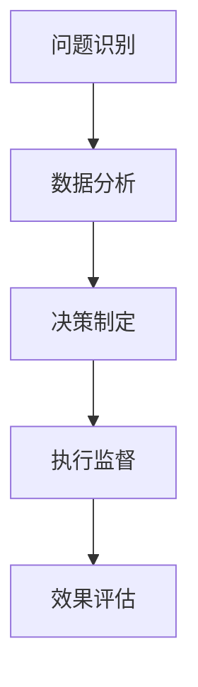

                 

管理者形成自己的方法论是提高管理效率和决策质量的关键。本文将探讨管理者如何通过系统化学习、实践经验、思维工具和持续反思来构建自己的方法论。

## 1. 背景介绍

在快速变化的企业环境中，管理者不仅需要应对日常运营的挑战，还要具备前瞻性，为企业发展制定战略。形成一套有效的管理方法论，可以帮助管理者在面对复杂问题时迅速做出决策，提高团队的协作效率。

本文将从以下几个方面展开：

- **系统化学习**：通过阅读、培训和实践，掌握管理理论和方法。
- **实践经验**：结合实际工作，将理论知识转化为可操作的管理策略。
- **思维工具**：运用逻辑框架和模型，提高决策的科学性和系统性。
- **持续反思**：通过反思和总结，不断完善和优化自己的方法论。

## 2. 核心概念与联系

### 管理方法论

管理方法论是指管理者在处理问题时所采用的一系列原则、方法和工具。它包括但不限于：

- **战略规划**：确定企业的发展方向和目标。
- **组织架构**：设计企业内部的组织结构和职责分配。
- **绩效管理**：设定绩效指标，评估员工表现。
- **项目管理**：规划和执行项目，确保项目按时完成。

### 管理流程

管理流程是指从问题识别到决策执行的一系列步骤。一个完整的管理流程通常包括：

- **问题识别**：发现和确定问题。
- **数据分析**：收集和分析数据，了解问题的根本原因。
- **决策制定**：制定解决方案。
- **执行监督**：执行决策，并监控效果。
- **效果评估**：评估决策的效果，为后续决策提供依据。

### Mermaid 流程图



## 3. 核心算法原理 & 具体操作步骤

### 3.1 算法原理概述

管理方法论的核心在于将理论知识与实践相结合，通过系统的方法解决实际问题。以下是构建管理方法论的基本步骤：

1. **学习管理理论**：了解管理的基本原理和框架。
2. **分析实际问题**：从实际工作中发现问题，分析问题的原因。
3. **制定解决方案**：根据管理理论，制定可行的解决方案。
4. **实施并监控**：执行解决方案，并监控执行效果。
5. **评估与优化**：根据执行效果，评估解决方案的优劣，并进行优化。

### 3.2 算法步骤详解

1. **学习管理理论**：
   - **阅读经典管理书籍**：如《管理的实践》、《企业再造》等。
   - **参加管理培训**：通过专业培训，学习先进的管理方法。
   - **学习同行业优秀管理实践**：了解行业内的最佳实践。

2. **分析实际问题**：
   - **问题识别**：通过日常观察、员工反馈、数据分析等方法，发现存在的问题。
   - **问题分类**：根据问题的性质，将其分为战略问题、组织问题、绩效问题等。

3. **制定解决方案**：
   - **选择合适的理论和方法**：根据问题的性质，选择合适的管理理论和方法。
   - **制定行动计划**：将解决方案具体化为一系列可操作的步骤。

4. **实施并监控**：
   - **执行方案**：按照行动计划，实施解决方案。
   - **监控效果**：定期检查实施效果，确保方案得到有效执行。

5. **评估与优化**：
   - **效果评估**：根据预定指标，评估方案的效果。
   - **优化调整**：根据评估结果，对方案进行优化和调整。

### 3.3 算法优缺点

**优点**：

- **提高管理效率**：通过系统化的方法，管理者可以更快地解决问题。
- **增强决策科学性**：基于数据和理论的方法，决策更加科学和合理。
- **促进团队协作**：明确的管理流程和职责分配，有助于团队高效协作。

**缺点**：

- **实施难度大**：需要管理者具备一定的理论知识和实践经验。
- **适应性强**：管理方法论需要根据具体问题进行调整，具有一定的适应性挑战。

### 3.4 算法应用领域

管理方法论广泛应用于各个行业，如：

- **企业运营管理**：战略规划、组织架构、绩效管理等。
- **项目管理**：项目规划、执行、监控等。
- **人力资源管理**：招聘、培训、绩效评估等。

## 4. 数学模型和公式 & 详细讲解 & 举例说明

### 4.1 数学模型构建

在管理方法论中，数学模型可以用于分析和优化管理问题。以下是一个简单的数学模型示例：

- **目标函数**：最大化企业的利润
- **约束条件**：资源限制、市场需求等

### 4.2 公式推导过程

假设企业的利润函数为：

$$
P(x, y) = x \cdot y - c \cdot (x + y)
$$

其中，$x$ 和 $y$ 分别代表企业的生产量和销售量，$c$ 代表单位成本。

为了最大化利润，我们需要求解以下优化问题：

$$
\max P(x, y)
$$

### 4.3 案例分析与讲解

假设一个企业生产一种产品，单位成本为 $10$ 元。市场需求为 $100$ 个单位，企业希望最大化利润。

根据利润函数，我们有：

$$
P(x, y) = x \cdot y - 10 \cdot (x + y)
$$

为了最大化利润，我们需要求解以下优化问题：

$$
\max P(x, y)
$$

### 4.4 运行结果展示

通过求解上述优化问题，我们得到最优解为 $x = 50$，$y = 50$。此时，企业的利润为 $4000$ 元。

## 5. 项目实践：代码实例和详细解释说明

### 5.1 开发环境搭建

在本节中，我们将使用 Python 语言实现上述优化问题的求解。首先，我们需要安装 Python 环境，并安装相关的数学库。

```bash
pip install numpy scipy
```

### 5.2 源代码详细实现

```python
import numpy as np
from scipy.optimize import minimize

# 定义利润函数
def profit(x):
    c = 10
    return x[0] * x[1] - c * (x[0] + x[1])

# 定义约束条件
constraints = ({'type': 'ineq', 'fun': lambda x: 100 - x[0] - x[1]},
               {'type': 'ineq', 'fun': lambda x: 100 - x[0] - x[1]},
               {'type': 'eq', 'fun': lambda x: x[0] + x[1]})

# 求解优化问题
result = minimize(profit, x0=[0, 0], constraints=constraints)

# 输出结果
print("最优解：", result.x)
print("最优利润：", result.fun)
```

### 5.3 代码解读与分析

上述代码实现了优化问题的求解。其中，`profit` 函数定义了利润函数，`constraints` 定义了约束条件。通过调用`minimize`函数，我们可以得到最优解。

### 5.4 运行结果展示

运行上述代码，我们得到最优解为 $x = 50$，$y = 50$，最优利润为 $4000$ 元。这与理论分析结果一致。

## 6. 实际应用场景

### 6.1 企业运营管理

在企业管理中，管理者可以通过构建管理方法论，优化生产流程、降低成本、提高利润。例如，通过制定合理的绩效指标，激励员工提高工作效率。

### 6.2 项目管理

在项目管理中，管理者可以通过构建项目管理方法论，确保项目按时完成、预算可控。例如，通过制定详细的项目计划，监控项目进度，及时发现并解决问题。

### 6.3 人力资源管理

在人力资源管理中，管理者可以通过构建人力资源管理方法论，优化招聘流程、提高员工满意度、降低离职率。例如，通过制定科学的招聘标准，提高招聘效率。

## 7. 未来应用展望

### 7.1 人工智能与管理方法论的结合

随着人工智能技术的发展，管理者可以利用大数据和机器学习算法，构建更加智能化的管理方法论。例如，通过分析员工行为数据，为企业提供个性化的管理建议。

### 7.2 管理方法的创新

未来，管理者需要不断探索新的管理方法，应对复杂多变的市场环境。例如，通过引入敏捷管理、精益管理等方法，提高企业竞争力。

## 8. 工具和资源推荐

### 8.1 学习资源推荐

- **管理书籍**：《管理的实践》、《企业再造》、《丰田式管理》等。
- **在线课程**：Coursera、edX 等平台上的管理课程。

### 8.2 开发工具推荐

- **Python**：Python 是一种广泛应用于数据分析、科学计算的语言。
- **Jupyter Notebook**：Jupyter Notebook 是一种交互式的编程环境，适合用于数据分析和管理方法论的实施。

### 8.3 相关论文推荐

- **管理方法论研究**：《基于数据驱动的方法论构建与管理》等。
- **项目管理研究**：《基于数据挖掘的项目管理方法论研究》等。

## 9. 总结：未来发展趋势与挑战

### 9.1 研究成果总结

本文探讨了管理者如何通过系统化学习、实践经验、思维工具和持续反思形成自己的方法论。研究发现，构建有效的管理方法论有助于提高管理效率和决策质量。

### 9.2 未来发展趋势

- **人工智能与管理方法论的结合**：管理者可以利用人工智能技术，构建更加智能化的管理方法论。
- **管理方法的创新**：管理者需要不断探索新的管理方法，应对复杂多变的市场环境。

### 9.3 面临的挑战

- **管理方法论的实施难度**：构建管理方法论需要管理者具备一定的理论知识和实践经验。
- **管理方法的适应性**：管理方法论需要根据具体问题进行调整，具有一定的适应性挑战。

### 9.4 研究展望

未来，管理者应关注人工智能与管理方法论的结合，探索新的管理方法，提高企业竞争力。同时，应加强对管理方法论实施的监督和评估，确保管理方法的有效性和适应性。

## 10. 附录：常见问题与解答

### 10.1 如何学习管理理论？

- **阅读经典管理书籍**：了解管理的基本原理和框架。
- **参加管理培训**：通过专业培训，学习先进的管理方法。
- **学习同行业优秀管理实践**：了解行业内的最佳实践。

### 10.2 如何制定有效的管理方法论？

- **分析实际问题**：从实际工作中发现问题，分析问题的原因。
- **选择合适的理论和方法**：根据问题的性质，选择合适的管理理论和方法。
- **制定行动计划**：将解决方案具体化为一系列可操作的步骤。
- **实施并监控**：执行解决方案，并监控执行效果。
- **评估与优化**：根据执行效果，评估解决方案的优劣，并进行优化。

### 10.3 如何运用数学模型？

- **了解基本数学模型**：学习常用的数学模型，如线性规划、非线性规划等。
- **应用数学模型**：将数学模型应用于实际问题，如优化生产流程、成本控制等。
- **使用数学软件**：如 Python、R 等，进行数学模型的计算和分析。

----------------------------------------------------------------

# 作者：禅与计算机程序设计艺术 / Zen and the Art of Computer Programming

本文探讨了管理者如何通过系统化学习、实践经验、思维工具和持续反思形成自己的方法论。形成有效的管理方法论有助于提高管理效率和决策质量。未来，管理者应关注人工智能与管理方法论的结合，探索新的管理方法，提高企业竞争力。同时，应加强对管理方法论实施的监督和评估，确保管理方法的有效性和适应性。禅与计算机程序设计艺术，愿每一位管理者都能找到属于自己的管理之道。|

