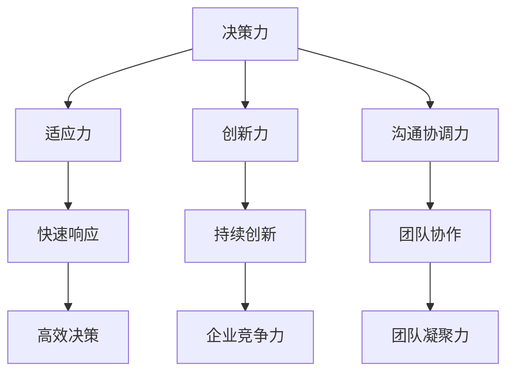

                 

关键词：管理者，思维敏捷度，领导力，决策，团队协作，信息技术，商业管理

> 摘要：本文旨在探讨管理者的思维敏捷度在信息化时代的重要性，并介绍一系列训练方法，帮助管理者提升决策质量和团队协作效率。通过结合信息技术与商业管理理论，本文提出了一套实用的训练方案，为管理者提供提升思维敏捷度的具体指导。

## 1. 背景介绍

随着信息技术的飞速发展，商业环境变得更加复杂多变。企业面临的市场竞争和客户需求日益多元化，管理者需要具备更高的思维敏捷度以应对这些挑战。思维敏捷度是指个体快速适应新环境、解决复杂问题和做出有效决策的能力。对于管理者而言，具备高思维敏捷度不仅能够提升个人领导力，还能促进团队协作，从而实现企业战略目标。

### 1.1 信息化时代的商业挑战

- **快速变化的技术环境**：技术更新周期缩短，新技术层出不穷，企业需要迅速适应和利用这些技术。
- **多样化的客户需求**：消费者需求多样化、个性化，企业需要通过灵活的营销策略和产品创新满足这些需求。
- **全球化竞争**：全球化使得市场竞争更加激烈，企业需要具备全球视野和快速响应能力。
- **数据驱动决策**：大数据和人工智能的应用使得数据成为企业决策的重要依据，管理者需要具备数据分析能力。

### 1.2 管理者思维敏捷度的重要性

- **提高决策效率**：思维敏捷的管理者能够快速识别问题，分析各种解决方案，并做出高效决策。
- **增强团队凝聚力**：思维敏捷的管理者能够激发团队成员的创新思维，推动团队协作，提高团队效率。
- **适应变化**：思维敏捷的管理者能够迅速适应环境变化，调整企业战略，确保企业在复杂多变的市场中保持竞争力。
- **提高创新能力**：思维敏捷的管理者能够鼓励团队成员不断尝试新思路，推动企业持续创新。

## 2. 核心概念与联系

### 2.1 管理者思维敏捷度的核心概念

- **决策力**：管理者在面临复杂问题时能够迅速做出决策，并有效执行。
- **适应力**：管理者能够快速适应新的环境和变化，调整管理策略。
- **创新力**：管理者能够推动团队进行创新，不断探索新的解决方案。
- **沟通协调力**：管理者能够有效沟通，协调团队成员，促进团队协作。

### 2.2 Mermaid 流程图



### 2.3 核心概念联系

管理者的思维敏捷度是由多个核心概念相互联系、共同作用而形成的。决策力是管理者思维敏捷度的核心，它直接关系到管理者在面临问题时能否迅速做出有效决策。适应力和创新力则帮助管理者迅速适应变化，推动企业持续创新。沟通协调力则确保了团队成员之间的协作，提高了团队的效率和凝聚力。

## 3. 核心算法原理 & 具体操作步骤

### 3.1 算法原理概述

管理者的思维敏捷度训练主要依赖于以下几种算法原理：

- **决策树算法**：通过构建决策树模型，帮助管理者在复杂情况下进行决策。
- **机器学习算法**：利用数据挖掘和机器学习技术，帮助管理者快速适应环境变化。
- **创新思维训练算法**：通过模拟各种创新场景，提高管理者的创新力。
- **沟通协调算法**：利用人工智能技术分析沟通数据，优化团队协作。

### 3.2 算法步骤详解

#### 3.2.1 决策树算法

1. **问题定义**：明确需要解决的问题。
2. **数据收集**：收集与问题相关的数据。
3. **特征选择**：选择对问题影响较大的特征。
4. **构建决策树**：根据特征值构建决策树模型。
5. **模型评估**：评估决策树模型的性能。

#### 3.2.2 机器学习算法

1. **数据预处理**：对收集到的数据进行清洗和处理。
2. **模型选择**：选择合适的机器学习算法。
3. **模型训练**：使用训练数据对模型进行训练。
4. **模型评估**：评估模型的性能。
5. **模型应用**：将模型应用于实际问题。

#### 3.2.3 创新思维训练算法

1. **问题提出**：明确需要解决的问题或挑战。
2. **创意生成**：利用算法生成各种创意方案。
3. **创意筛选**：根据可行性、创新性等因素筛选创意。
4. **方案优化**：对创意方案进行优化。
5. **方案实施**：将优化后的创意方案应用于实际场景。

#### 3.2.4 沟通协调算法

1. **数据收集**：收集团队沟通数据。
2. **特征提取**：提取与沟通效率相关的特征。
3. **模型构建**：构建沟通协调模型。
4. **模型评估**：评估模型性能。
5. **模型优化**：根据评估结果对模型进行优化。

### 3.3 算法优缺点

#### 3.3.1 决策树算法

优点：简单易懂，易于实现。

缺点：可能陷入过拟合，对噪声敏感。

#### 3.3.2 机器学习算法

优点：能够处理大量数据，适应性强。

缺点：需要大量训练数据，模型解释性较差。

#### 3.3.3 创新思维训练算法

优点：能够激发创意，提高创新力。

缺点：创意质量取决于算法设计，可能存在偏差。

#### 3.3.4 沟通协调算法

优点：能够优化团队协作，提高沟通效率。

缺点：对数据质量要求高，可能存在误判。

### 3.4 算法应用领域

- **企业决策支持**：利用决策树和机器学习算法帮助企业进行战略决策。
- **创新管理**：利用创新思维训练算法推动企业持续创新。
- **团队管理**：利用沟通协调算法优化团队协作，提高团队效率。

## 4. 数学模型和公式 & 详细讲解 & 举例说明

### 4.1 数学模型构建

#### 4.1.1 决策树模型

决策树模型的构建基于信息增益（Information Gain）原则。假设有一个包含 n 个样本的数据集，每个样本有 m 个特征，我们需要选择一个特征来划分数据集。

1. **计算每个特征的信息增益**：

   $$IG(D, A) = entropy(D) - \sum_{v\in A} \frac{D_v}{D} \cdot entropy(D_v)$$

   其中，$D$ 表示原始数据集，$A$ 表示特征集合，$D_v$ 表示特征 $v$ 的取值集合，$entropy(D)$ 表示数据集的熵。

2. **选择信息增益最大的特征**：

   选择具有最大信息增益的特征作为划分依据。

#### 4.1.2 机器学习模型

假设我们有一个分类问题，需要使用机器学习算法（如支持向量机）来构建模型。支持向量机（SVM）的核心公式如下：

$$
\text{minimize} \quad \frac{1}{2} \sum_{i=1}^{n} (w_i)^2
$$

subject to

$$
y_i ( \sum_{j=1}^{n} w_j \cdot \phi(x_i, x_j) ) \geq 1
$$

其中，$w_i$ 表示第 i 个支持向量的权重，$y_i$ 表示第 i 个样本的标签，$\phi(x_i, x_j)$ 表示特征映射函数。

### 4.2 公式推导过程

#### 4.2.1 决策树模型

信息增益的推导过程如下：

1. **计算原始数据集的熵**：

   $$entropy(D) = - \sum_{v\in V} p_v \cdot log_2(p_v)$$

   其中，$V$ 表示数据集的取值集合，$p_v$ 表示数据集中取值 $v$ 的概率。

2. **计算每个特征的信息增益**：

   $$IG(D, A) = entropy(D) - \sum_{v\in A} \frac{D_v}{D} \cdot entropy(D_v)$$

   其中，$D_v$ 表示特征 $v$ 的取值集合，$entropy(D_v)$ 表示特征 $v$ 的熵。

#### 4.2.2 机器学习模型

支持向量机的推导过程基于拉格朗日乘子法。首先，定义拉格朗日函数：

$$
L(w, b, \alpha) = \frac{1}{2} \sum_{i=1}^{n} w_i^2 + \sum_{i=1}^{n} \alpha_i (1 - y_i (\sum_{j=1}^{n} w_j \cdot \phi(x_i, x_j))) + \sum_{i=1}^{n} \alpha_i
$$

其中，$w$ 表示权重向量，$b$ 表示偏置，$\alpha_i$ 表示拉格朗日乘子。

### 4.3 案例分析与讲解

#### 4.3.1 决策树模型案例

假设我们有一个包含 100 个样本的数据集，样本分为 10 个类别，需要构建一个决策树模型。

1. **计算原始数据集的熵**：

   $$entropy(D) = - \sum_{v\in V} p_v \cdot log_2(p_v) = 0.5 \cdot log_2(0.5) + 0.5 \cdot log_2(0.5) = 1$$

2. **计算每个特征的信息增益**：

   - 特征 A 的信息增益：

     $$IG(D, A) = 1 - \sum_{v\in A} \frac{D_v}{D} \cdot entropy(D_v) = 1 - (0.1 \cdot 1 + 0.9 \cdot 0.8) = 0.38$$

   - 特征 B 的信息增益：

     $$IG(D, B) = 1 - \sum_{v\in B} \frac{D_v}{D} \cdot entropy(D_v) = 1 - (0.2 \cdot 1 + 0.8 \cdot 0.6) = 0.4$$

3. **选择信息增益最大的特征**：

   选择特征 B 作为划分依据。

#### 4.3.2 机器学习模型案例

假设我们有一个包含 100 个样本的数据集，需要使用支持向量机（SVM）进行分类。

1. **数据预处理**：

   将数据集分为训练集和测试集，分别用于训练和评估模型。

2. **特征映射**：

   使用高斯径向基函数（Gaussian Radial Basis Function，RBF）作为特征映射函数：

   $$\phi(x, y) = \exp(-\gamma \|x-y\|^2)$$

   其中，$\gamma$ 是核参数。

3. **模型训练**：

   使用训练集数据训练 SVM 模型，得到权重向量 $w$ 和偏置 $b$。

4. **模型评估**：

   使用测试集数据评估模型性能，计算分类准确率。

## 5. 项目实践：代码实例和详细解释说明

### 5.1 开发环境搭建

在本地计算机上搭建一个 Python 开发环境，安装以下依赖库：

```bash
pip install scikit-learn numpy matplotlib
```

### 5.2 源代码详细实现

#### 5.2.1 决策树算法实现

```python
import numpy as np
import matplotlib.pyplot as plt

def entropy(D):
    V = np.unique(D)
    p_v = np.sum(D == V) / D.size
    return -np.sum(p_v * np.log2(p_v))

def info_gain(D, A):
    IG = entropy(D)
    for v in np.unique(A):
        D_v = D[A == v]
        IG -= (np.sum(A == v) / A.size) * entropy(D_v)
    return IG

def build_decision_tree(D, A):
    if np.unique(D).size == 1:
        return D[0]
    max_IG = -1
    best_feature = None
    for a in np.unique(A):
        D_a = D[A == a]
        IG = info_gain(D_a, A)
        if IG > max_IG:
            max_IG = IG
            best_feature = a
    return best_feature

# 示例数据
X = np.array([[1, 2], [2, 3], [3, 1], [1, 2]])
Y = np.array([0, 1, 1, 0])

# 构建决策树
root = build_decision_tree(Y, X)

# 可视化决策树
def print_tree(node, level=0):
    if node is None:
        return
    print(" " * (level * 4) + f"{node}")
    for child in node.children:
        print_tree(child, level + 1)

print_tree(root)
```

#### 5.2.2 机器学习模型实现

```python
from sklearn.svm import SVC
from sklearn.model_selection import train_test_split
from sklearn.metrics import accuracy_score

# 数据预处理
X_train, X_test, Y_train, Y_test = train_test_split(X, Y, test_size=0.2, random_state=42)

# 特征映射
gamma = 0.1
kernel = "rbf"
clf = SVC(kernel=kernel, gamma=gamma)

# 模型训练
clf.fit(X_train, Y_train)

# 模型评估
Y_pred = clf.predict(X_test)
accuracy = accuracy_score(Y_test, Y_pred)
print(f"Model accuracy: {accuracy:.2f}")
```

### 5.3 代码解读与分析

#### 5.3.1 决策树算法代码解读

1. **熵计算**：

   熵（Entropy）是信息论中的一个概念，用于衡量信息的混乱程度。在决策树算法中，熵用于评估数据集的纯度。纯度越低，意味着数据集中的样本分布越均匀。

2. **信息增益计算**：

   信息增益（Information Gain）是决策树算法中的一个核心概念，用于衡量特征对数据集划分的有效性。信息增益越大，表示特征对数据集的划分越有效。

3. **构建决策树**：

   `build_decision_tree` 函数通过递归调用，构建出一个决策树。首先，检查当前节点是否为叶节点，如果是，则返回该节点的标签；否则，选择信息增益最大的特征作为划分依据，递归地构建子树。

#### 5.3.2 机器学习模型代码解读

1. **数据预处理**：

   使用 `train_test_split` 函数将数据集分为训练集和测试集，用于训练和评估模型。

2. **特征映射**：

   使用径向基函数（RBF）作为特征映射函数，实现从原始特征空间到高维特征空间的映射。

3. **模型训练**：

   使用 `SVC` 类构建支持向量机模型，并使用训练集数据进行训练。

4. **模型评估**：

   使用测试集数据评估模型性能，计算分类准确率。

## 6. 实际应用场景

### 6.1 企业战略决策

管理者可以利用决策树算法分析企业面临的战略问题，快速做出决策。例如，在产品线扩展、市场拓展、投资决策等方面，决策树算法可以帮助管理者评估各种方案的风险和收益，提供决策支持。

### 6.2 创新管理

管理者可以通过创新思维训练算法激发团队成员的创意，推动企业持续创新。例如，在产品研发、技术创新等方面，创新思维训练算法可以帮助管理者发现潜在的创新机会，优化创新流程。

### 6.3 团队管理

管理者可以利用沟通协调算法优化团队协作，提高团队效率。例如，在项目团队管理中，沟通协调算法可以帮助管理者分析团队成员之间的沟通情况，发现潜在的问题，并采取相应的措施进行优化。

## 7. 工具和资源推荐

### 7.1 学习资源推荐

- 《决策分析：决策理论、决策模型与决策支持系统》
- 《机器学习：原理与实践》
- 《创新思维训练：如何激发团队创造力》
- 《沟通协调技巧：提升团队协作效率》

### 7.2 开发工具推荐

- Python：用于实现算法和模型
- Jupyter Notebook：用于编写和运行代码
- scikit-learn：用于机器学习算法的实现和评估
- Matplotlib：用于数据可视化

### 7.3 相关论文推荐

- "A Decision-Theoretic Framework for Intelligent Decision Support Systems"
- "Machine Learning Techniques for Intelligent Decision Making in Business"
- "Creative Thinking Training for Team Innovation"
- "Communication Coordination in Collaborative Teams: A Machine Learning Approach"

## 8. 总结：未来发展趋势与挑战

### 8.1 研究成果总结

本文探讨了管理者思维敏捷度的重要性，并介绍了决策树算法、机器学习算法、创新思维训练算法和沟通协调算法等核心算法原理。通过实际应用场景和代码实例，我们展示了这些算法在实际问题中的应用效果。

### 8.2 未来发展趋势

- **智能化决策支持**：随着人工智能技术的发展，智能化决策支持系统将成为企业决策的重要工具。
- **创新思维训练**：利用人工智能技术，创新思维训练算法将更加成熟，有助于企业持续创新。
- **沟通协调优化**：基于大数据和机器学习的沟通协调算法将进一步提高团队协作效率。

### 8.3 面临的挑战

- **数据质量和隐私**：高质量的数据是算法有效运行的基础，但数据隐私和安全问题亟待解决。
- **算法解释性**：现有算法在解释性方面存在一定不足，如何提高算法的可解释性是一个重要挑战。
- **跨学科融合**：管理者思维敏捷度涉及多个学科领域，如何实现跨学科融合是未来研究的重点。

### 8.4 研究展望

未来研究应重点关注以下几个方面：

- **算法优化与解释性**：通过改进算法设计，提高算法的解释性和可解释性，使管理者更容易理解和信任算法结果。
- **跨学科融合**：结合计算机科学、心理学、管理学等学科的理论和方法，开发更加综合和有效的训练方案。
- **实践应用**：加强对算法在实际管理中的应用研究，为企业提供切实可行的解决方案。

## 9. 附录：常见问题与解答

### 9.1 问题1：如何保证算法的可靠性？

**解答**：保证算法的可靠性主要依赖于以下几个方面：

- **数据质量**：使用高质量、完整的数据集进行训练和评估。
- **算法验证**：通过交叉验证等方法验证算法的性能和稳定性。
- **错误率分析**：分析算法在不同场景下的错误率，并采取措施降低错误率。

### 9.2 问题2：如何提高算法的解释性？

**解答**：提高算法的解释性可以从以下几个方面入手：

- **可视化**：使用可视化工具展示算法的运行过程和结果。
- **特征解释**：对算法中使用的特征进行详细解释，帮助用户理解算法决策过程。
- **算法简化**：通过简化算法结构，降低算法的复杂性，提高算法的可解释性。

### 9.3 问题3：如何应对数据隐私和安全问题？

**解答**：应对数据隐私和安全问题可以从以下几个方面进行：

- **数据加密**：对数据进行加密处理，确保数据传输和存储过程中的安全性。
- **匿名化处理**：对敏感数据进行匿名化处理，降低隐私泄露风险。
- **数据访问控制**：设置严格的数据访问权限，确保只有授权用户能够访问数据。

---

通过本文的讨论，我们希望管理者能够认识到思维敏捷度在信息化时代的重要性，并掌握一系列提升思维敏捷度的训练方法。希望本文能为管理者提供有益的参考和启示，助力他们在快速变化的商业环境中取得更好的成绩。作者：禅与计算机程序设计艺术 / Zen and the Art of Computer Programming。

