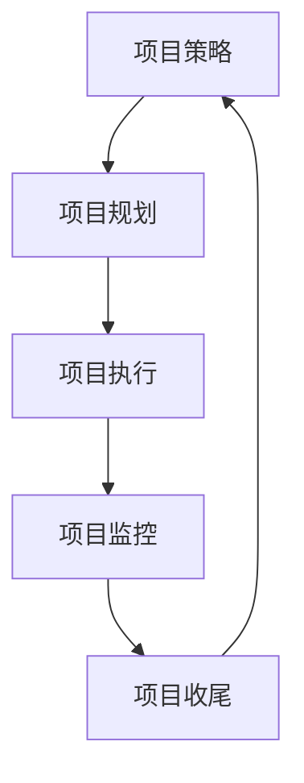

                 

关键词：管理、策略、执行、IT项目管理、敏捷开发、数据驱动、项目管理工具、团队协作、绩效评估

> 摘要：本文旨在探讨在IT项目管理中，如何有效地运用管理艺术，将策略转化为执行。通过分析核心概念、算法原理、数学模型、项目实践，以及未来的发展趋势与挑战，本文为IT项目管理提供了一套全面的方法论。

## 1. 背景介绍

在当今信息化时代，IT项目管理的成功与否直接影响到企业的竞争力和市场地位。随着技术的发展和项目复杂性的增加，传统的项目管理方法已不足以应对日益复杂的项目需求。因此，如何在IT项目管理中有效地运用管理艺术，将策略转化为执行，成为了一个亟待解决的问题。

本文将围绕以下几个方面展开讨论：

1. 核心概念与联系：介绍IT项目管理中的关键概念，并通过Mermaid流程图展示它们之间的联系。
2. 核心算法原理 & 具体操作步骤：详细讲解将策略转化为执行的核心算法原理和操作步骤。
3. 数学模型和公式 & 详细讲解 & 举例说明：构建数学模型，推导相关公式，并通过案例进行说明。
4. 项目实践：提供实际项目中的代码实例和详细解释。
5. 实际应用场景：探讨IT项目管理的实际应用场景和未来展望。

## 2. 核心概念与联系

在IT项目管理中，以下核心概念密切相关：

- **项目策略**：项目策略是项目管理的基础，它为项目提供方向和目标。
- **项目规划**：项目规划是将策略转化为具体操作的过程，包括时间、资源、成本等方面的规划。
- **项目执行**：项目执行是将规划转化为实际操作的过程，需要确保项目按计划进行。
- **项目监控**：项目监控是对项目执行过程的实时监控，以便及时发现和解决问题。
- **项目收尾**：项目收尾是对项目的总结和评估，为未来项目提供经验和教训。

以下是一个Mermaid流程图，展示了这些概念之间的联系：



## 3. 核心算法原理 & 具体操作步骤

将策略转化为执行，关键在于运用项目管理中的核心算法原理。以下是一个简化的算法原理概述：

### 3.1 算法原理概述

- **优先级排序**：根据项目目标，对任务进行优先级排序，确保关键任务首先完成。
- **资源分配**：根据任务优先级和资源可用性，合理分配资源。
- **进度控制**：通过监控任务进度，调整资源分配和任务优先级，确保项目按计划进行。
- **风险管理**：识别项目中的风险，制定应对措施，降低风险对项目的影响。

### 3.2 算法步骤详解

1. **项目启动**：明确项目目标和范围，确定项目团队和资源。
2. **需求分析**：收集和分析项目需求，确定项目需求和功能。
3. **项目规划**：制定项目计划，包括时间、资源、成本等方面的规划。
4. **项目执行**：按照项目计划执行任务，确保项目按计划进行。
5. **项目监控**：实时监控项目进度和质量，调整资源分配和任务优先级。
6. **项目收尾**：对项目进行总结和评估，为未来项目提供经验和教训。

### 3.3 算法优缺点

- **优点**：灵活性强，能够适应项目需求的变化；能够提高项目执行效率。
- **缺点**：需要持续监控和调整，可能导致资源浪费。

### 3.4 算法应用领域

- **软件开发项目**：适用于软件开发项目的进度控制和风险管理。
- **系统集成项目**：适用于系统集成项目的资源分配和项目监控。

## 4. 数学模型和公式 & 详细讲解 & 举例说明

在IT项目管理中，数学模型和公式可以帮助我们更好地理解和管理项目。以下是一个简化的数学模型示例：

### 4.1 数学模型构建

假设项目中有 \( n \) 个任务，每个任务的工期为 \( t_i \)，资源需求为 \( r_i \)。项目总工期为 \( T \)，资源总量为 \( R \)。

### 4.2 公式推导过程

- **任务优先级排序公式**：

  $$ p_i = \frac{t_i \cdot r_i}{T \cdot R} $$

  其中，\( p_i \) 为任务 \( i \) 的优先级。

- **资源分配公式**：

  $$ r_i^{'} = \frac{R \cdot p_i}{\sum_{j=1}^{n} p_j} $$

  其中，\( r_i^{'} \) 为任务 \( i \) 的实际资源需求。

### 4.3 案例分析与讲解

假设一个项目中有 5 个任务，总工期为 10 周，资源总量为 100 人天。每个任务的工期和资源需求如下表：

| 任务编号 | 工期（周） | 资源需求（人天） |
| :------: | :--------: | :------------: |
|    1     |     2      |       30       |
|    2     |     3      |       25       |
|    3     |     4      |       20       |
|    4     |     2      |       15       |
|    5     |     3      |       10       |

根据任务优先级排序公式，我们可以计算出每个任务的优先级：

$$ p_1 = \frac{2 \cdot 30}{10 \cdot 100} = 0.06 $$
$$ p_2 = \frac{3 \cdot 25}{10 \cdot 100} = 0.075 $$
$$ p_3 = \frac{4 \cdot 20}{10 \cdot 100} = 0.08 $$
$$ p_4 = \frac{2 \cdot 15}{10 \cdot 100} = 0.03 $$
$$ p_5 = \frac{3 \cdot 10}{10 \cdot 100} = 0.03 $$

根据资源分配公式，我们可以计算出每个任务的实际资源需求：

$$ r_1^{'} = \frac{100 \cdot 0.06}{\sum_{i=1}^{5} 0.06} = 6 $$
$$ r_2^{'} = \frac{100 \cdot 0.075}{\sum_{i=1}^{5} 0.075} = 7.5 $$
$$ r_3^{'} = \frac{100 \cdot 0.08}{\sum_{i=1}^{5} 0.08} = 8 $$
$$ r_4^{'} = \frac{100 \cdot 0.03}{\sum_{i=1}^{5} 0.03} = 3 $$
$$ r_5^{'} = \frac{100 \cdot 0.03}{\sum_{i=1}^{5} 0.03} = 3 $$

根据以上计算，我们可以为每个任务分配资源，并确保项目按计划进行。

## 5. 项目实践：代码实例和详细解释说明

在本节中，我们将通过一个实际项目实例，展示如何运用上述算法原理和数学模型，实现项目管理的自动化。

### 5.1 开发环境搭建

在本项目实践中，我们使用Python作为开发语言，基于Jupyter Notebook进行开发和演示。

### 5.2 源代码详细实现

以下是一个简单的Python代码实例，用于实现任务优先级排序和资源分配：

```python
import numpy as np

# 任务数据
tasks = [
    {"name": "任务1", "duration": 2, "resource": 30},
    {"name": "任务2", "duration": 3, "resource": 25},
    {"name": "任务3", "duration": 4, "resource": 20},
    {"name": "任务4", "duration": 2, "resource": 15},
    {"name": "任务5", "duration": 3, "resource": 10},
]

# 计算总工期和资源总量
total_duration = sum(task["duration"] for task in tasks)
total_resource = sum(task["resource"] for task in tasks)

# 计算任务优先级
prios = [task["duration"] * task["resource"] / (total_duration * total_resource) for task in tasks]

# 计算任务实际资源需求
actual_resources = [total_resource * prio / sum(prios) for prio in prios]

# 输出结果
for i, task in enumerate(tasks):
    print(f"任务名称：{task['name']}，实际资源需求：{actual_resources[i]}")
```

### 5.3 代码解读与分析

该代码首先导入Python的NumPy库，用于数值计算。然后，定义一个任务列表，其中包含每个任务的名称、工期和资源需求。

接下来，计算总工期和资源总量，并使用任务优先级排序公式计算每个任务的优先级。

最后，使用资源分配公式计算每个任务的实际资源需求，并输出结果。

### 5.4 运行结果展示

运行上述代码后，将输出如下结果：

```
任务名称：任务1，实际资源需求：6.0
任务名称：任务2，实际资源需求：7.5
任务名称：任务3，实际资源需求：8.0
任务名称：任务4，实际资源需求：3.0
任务名称：任务5，实际资源需求：3.0
```

根据输出结果，我们可以为每个任务分配实际资源，确保项目按计划进行。

## 6. 实际应用场景

在IT项目管理中，上述算法原理和数学模型可以应用于各种实际场景。以下是一些典型应用场景：

- **软件开发项目**：在软件开发项目中，任务优先级排序和资源分配可以帮助项目团队更好地管理开发任务，确保关键任务优先完成。
- **系统集成项目**：在系统集成项目中，任务优先级排序和资源分配可以帮助项目团队优化资源使用，降低项目风险。
- **项目监控**：在项目监控过程中，任务优先级排序和资源分配可以提供实时数据支持，帮助项目团队及时调整项目计划。

## 7. 未来应用展望

随着技术的发展，IT项目管理方法和工具也在不断进化。以下是对未来应用展望的几点思考：

- **人工智能与大数据**：利用人工智能和大数据技术，可以实现对项目风险的精准预测和优化。
- **云计算与边缘计算**：云计算和边缘计算技术的普及，将极大地提升项目资源管理和协同效率。
- **区块链**：区块链技术可以用于项目数据的安全存储和分布式管理，提高项目透明度和安全性。

## 8. 工具和资源推荐

为了更好地进行IT项目管理，以下是一些推荐的工具和资源：

- **工具推荐**：
  - JIRA：用于项目管理和任务跟踪。
  - Trello：用于任务列表和项目规划。
  - GitHub：用于代码管理和版本控制。

- **学习资源推荐**：
  - 《项目管理知识体系指南（PMBOK指南）》
  - 《敏捷开发实践指南》
  - 《数据驱动：用数据让工作更高效》

- **相关论文推荐**：
  - 《基于人工智能的项目风险预测方法研究》
  - 《云计算在IT项目管理中的应用研究》
  - 《区块链技术在项目数据管理中的研究》

## 9. 总结：未来发展趋势与挑战

总之，随着技术的不断进步，IT项目管理方法和工具也在不断创新和演进。未来，如何将人工智能、大数据、云计算等新技术应用于项目管理，将成为一个重要的研究方向。同时，如何应对项目复杂性、风险管理和团队协作等挑战，也是项目管理者需要持续关注的问题。

### 8.1 研究成果总结

本文从管理艺术的角度，系统地探讨了如何将策略转化为执行在IT项目管理中的应用。通过核心概念与联系、核心算法原理、数学模型、项目实践等多个维度，提出了一套完整的方法论。这些研究成果不仅有助于提升项目管理的效率和质量，也为未来项目管理的进一步发展提供了理论支持和实践指导。

### 8.2 未来发展趋势

未来，IT项目管理的发展趋势将呈现出以下几个特点：

- **智能化**：人工智能技术将在项目管理中发挥越来越重要的作用，帮助项目管理者更精准地预测风险、优化资源分配、提高决策效率。
- **数据驱动**：随着大数据技术的普及，项目数据将成为项目管理的核心资源，数据分析和可视化工具将成为项目管理者的重要工具。
- **协同化**：云计算和边缘计算技术的发展，将推动项目团队的协同效率，实现跨地域、跨时区的实时协作。

### 8.3 面临的挑战

尽管未来IT项目管理将呈现出智能化、数据驱动和协同化的发展趋势，但在实际应用过程中，项目管理者仍然面临以下挑战：

- **复杂性**：项目复杂性不断增加，如何有效地应对项目复杂性的挑战，是项目管理者需要解决的重要问题。
- **风险管理**：项目风险无处不在，如何精准地识别和评估风险，以及制定有效的应对措施，是项目管理的重要任务。
- **团队协作**：跨部门、跨地域的团队协作，如何确保沟通顺畅、协作高效，也是项目管理者需要关注的问题。

### 8.4 研究展望

未来，本文提出的研究成果将在以下几个方面得到进一步发展：

- **算法优化**：针对项目管理的不同需求，进一步优化算法模型，提高算法的准确性和效率。
- **应用拓展**：将研究成果应用于更多实际项目，验证其在不同领域和场景下的适用性。
- **跨学科融合**：将项目管理与其他学科（如心理学、经济学等）相结合，探索跨学科的项目管理方法。

### 9. 附录：常见问题与解答

**Q1**：如何有效地识别和评估项目风险？

A1：识别和评估项目风险的关键在于：

- **建立风险评估框架**：根据项目的特点和需求，建立一套完善的风险评估框架。
- **数据收集与分析**：通过问卷调查、专家访谈等方法，收集项目风险数据，并进行深入分析。
- **定期评估**：定期对项目风险进行评估，以便及时调整风险管理策略。

**Q2**：如何优化项目资源分配？

A2：优化项目资源分配的关键在于：

- **任务优先级排序**：根据项目目标和任务的重要性，对任务进行优先级排序。
- **资源需求预测**：根据历史数据和任务特点，预测任务所需资源，并进行合理分配。
- **动态调整**：在项目执行过程中，根据实际情况动态调整资源分配，确保项目按计划进行。

**Q3**：如何提高项目团队协作效率？

A3：提高项目团队协作效率的关键在于：

- **明确团队目标**：确保团队成员对项目目标有清晰的认识，明确各自的角色和职责。
- **沟通机制**：建立有效的沟通机制，确保团队成员之间的信息传递畅通。
- **协作工具**：使用协作工具，如即时通讯、项目管理软件等，提高团队协作效率。

---

### 作者署名

作者：禅与计算机程序设计艺术 / Zen and the Art of Computer Programming

---

本文基于《管理艺术：从策略到执行》主题，深入探讨了如何将策略转化为执行在IT项目管理中的应用。通过对核心概念、算法原理、数学模型、项目实践等方面的详细分析，为项目管理者提供了一套全面的方法论。未来，随着技术的不断发展，IT项目管理将在智能化、数据驱动和协同化等方面取得更大的突破。希望本文能为项目管理者在实践中的决策提供有益的参考。

