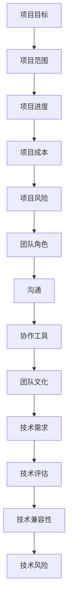
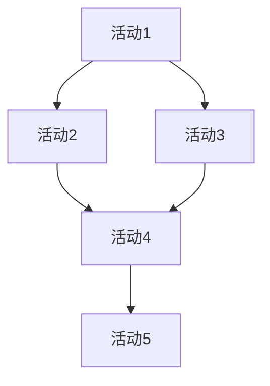

                 

关键词：管理、策略、执行、IT领域、技术博客

摘要：本文旨在探讨管理艺术在IT领域的应用，从策略制定到执行过程，通过深入剖析IT项目管理、团队协作以及技术选型等方面的实践经验和见解，旨在为IT从业者和管理者提供有价值的参考和指导。

## 1. 背景介绍

在当今快速发展的IT行业，管理艺术的重要性日益凸显。随着技术的不断迭代和创新，IT项目变得越来越复杂，涉及到的利益相关者也越来越多。如何在项目中实现策略的有效制定和执行，成为每个IT管理者和项目经理必须面对的挑战。

本文将围绕以下三个方面展开讨论：

1. **IT项目管理**：探讨项目管理的方法、工具和实践，以帮助管理者有效地规划、执行和控制项目进度。
2. **团队协作**：分析团队协作的关键要素和最佳实践，以提升团队的协作效率和创新能力。
3. **技术选型**：探讨在项目实施过程中如何选择合适的技术方案，以降低风险并提高项目的成功率。

## 2. 核心概念与联系

### 2.1 项目管理核心概念

项目管理是管理艺术的重要组成部分。它涉及到项目的规划、执行、监控和收尾等各个环节。以下是一些项目管理中的核心概念：

- **项目目标**：明确项目的最终目标和预期成果。
- **项目范围**：定义项目的具体内容和边界。
- **项目进度**：监控项目的进展情况，确保项目按时完成。
- **项目成本**：预算和成本控制，确保项目在预算范围内完成。
- **项目风险**：识别和评估项目中的潜在风险，制定应对措施。

### 2.2 团队协作核心概念

团队协作是实现项目管理目标的关键。以下是一些团队协作中的核心概念：

- **团队角色**：明确团队成员的角色和职责，确保团队成员各司其职。
- **沟通**：建立有效的沟通机制，确保信息的及时传递和准确理解。
- **协作工具**：使用合适的协作工具，如Slack、Trello等，以提高团队协作效率。
- **团队文化**：培养积极向上的团队文化，增强团队成员的凝聚力和归属感。

### 2.3 技术选型核心概念

技术选型是项目成功的关键因素之一。以下是一些技术选型中的核心概念：

- **技术需求**：明确项目所需的技术能力和功能。
- **技术评估**：对各种技术方案进行评估，选择最适合项目需求的技术。
- **技术兼容性**：确保所选技术能够与其他系统和组件兼容。
- **技术风险**：评估技术选型的潜在风险，并制定应对策略。

### 2.4 Mermaid 流程图

以下是一个简单的Mermaid流程图，展示项目管理中的关键环节：



## 3. 核心算法原理 & 具体操作步骤

### 3.1 算法原理概述

在IT项目管理中，核心算法原理主要涉及项目进度管理和风险评估。以下是对这两个核心算法的概述：

- **项目进度管理算法**：基于关键路径法（Critical Path Method，CPM）和计划评审技术（Program Evaluation and Review Technique，PERT），通过计算项目的关键路径和预计完成时间，实现对项目进度的有效管理和控制。
- **风险评估算法**：基于历史数据和统计方法，对项目中的潜在风险进行识别、评估和优先级排序，帮助项目经理制定有效的风险应对策略。

### 3.2 算法步骤详解

#### 3.2.1 项目进度管理算法

1. **定义项目活动**：列出所有项目活动及其持续时间。
2. **构建项目网络图**：根据项目活动之间的关系，构建项目网络图。
3. **计算关键路径**：通过计算项目网络图中的路径长度，确定关键路径。
4. **预计完成时间**：根据关键路径的长度，预计项目的完成时间。

#### 3.2.2 风险评估算法

1. **收集风险信息**：收集项目历史数据和专家意见，识别潜在风险。
2. **评估风险影响**：对每个风险的影响程度进行评估，包括概率和影响大小。
3. **排序风险优先级**：根据风险评估结果，对风险进行排序，确定优先级。
4. **制定应对策略**：针对高风险，制定相应的应对策略。

### 3.3 算法优缺点

#### 3.3.1 项目进度管理算法

- 优点：能够有效控制项目进度，确保项目按时完成。
- 缺点：对项目活动之间的关系和持续时间要求较高，对复杂项目的适应性较差。

#### 3.3.2 风险评估算法

- 优点：能够帮助项目经理提前识别和应对潜在风险。
- 缺点：对风险数据的依赖较大，风险评估结果可能存在主观性。

### 3.4 算法应用领域

项目进度管理算法和风险评估算法广泛应用于IT项目的管理和控制中，尤其在大型和复杂项目中具有重要作用。

## 4. 数学模型和公式 & 详细讲解 & 举例说明

### 4.1 数学模型构建

在项目管理中，常用的数学模型包括项目进度管理模型和风险评估模型。以下是一个简单的项目进度管理模型的构建过程：

#### 4.1.1 项目进度管理模型

1. **定义项目活动**：假设项目包含n个活动，分别为A1, A2, ..., An。
2. **定义活动持续时间**：假设每个活动的持续时间为di（i=1, 2, ..., n）。
3. **定义活动关系**：假设活动i与活动j之间的紧前关系用矩阵P表示，其中P[i][j] = 1表示活动i是活动j的紧前活动，P[i][j] = 0表示活动i不是活动j的紧前活动。

#### 4.1.2 项目风险评估模型

1. **定义风险因素**：假设项目包含m个风险因素，分别为R1, R2, ..., Rm。
2. **定义风险概率**：假设每个风险因素的发生概率为Pi（i=1, 2, ..., m）。
3. **定义风险影响**：假设每个风险因素的影响程度为Wi（i=1, 2, ..., m）。

### 4.2 公式推导过程

#### 4.2.1 项目进度管理模型

1. **关键路径计算**：

   设Dj为活动j的预计持续时间，D0为项目的预计完成时间，则有：

   Dj = Σ(P[i][j] * di)（i=1, 2, ..., n）

   D0 = Dj（j=1, 2, ..., n）

   关键路径为满足D0的最长路径。

2. **预计完成时间计算**：

   D0 = max{Dj}（j=1, 2, ..., n）

   其中max{Dj}表示取Dj的最大值。

#### 4.2.2 项目风险评估模型

1. **风险优先级计算**：

   设θi为风险i的优先级，则：

   θi = Pi * Wi

   风险优先级为θi的排序。

2. **风险应对策略计算**：

   根据风险优先级，对高风险制定相应的应对策略。例如，对于优先级最高的风险R1，可以制定以下应对策略：

   - 减少风险发生的概率：通过改进项目过程，提高风险应对能力。
   - 降低风险影响程度：通过加强风险管理，减少风险对项目的负面影响。

### 4.3 案例分析与讲解

#### 4.3.1 项目进度管理案例

假设一个IT项目包含5个活动，活动之间的关系如下：

| 活动 | 持续时间（天） | 紧前活动 |
| ---- | ------------ | -------- |
| A1   | 3            | 无       |
| A2   | 4            | A1       |
| A3   | 5            | A1       |
| A4   | 6            | A2, A3   |
| A5   | 7            | A4       |

根据上述活动关系，可以构建项目网络图如下：



根据关键路径法，计算关键路径和预计完成时间：

- 关键路径：A1 -> A3 -> A4 -> A5
- 预计完成时间：D0 = max{3+5+6+7} = 21天

#### 4.3.2 项目风险评估案例

假设一个IT项目包含3个风险因素，风险因素的发生概率和影响程度如下：

| 风险因素 | 发生概率 | 影响程度 |
| -------- | -------- | -------- |
| R1       | 0.4      | 0.8      |
| R2       | 0.3      | 0.6      |
| R3       | 0.2      | 0.5      |

根据风险评估模型，计算风险优先级：

- 风险优先级：θ1 = 0.4 * 0.8 = 0.32
- 风险优先级：θ2 = 0.3 * 0.6 = 0.18
- 风险优先级：θ3 = 0.2 * 0.5 = 0.1

根据风险优先级，可以制定以下应对策略：

- 高风险因素R1：通过加强过程改进，降低风险发生概率。
- 中等风险因素R2：通过提高风险应对能力，降低风险影响程度。
- 低风险因素R3：无需特别关注，但需保持监控。

## 5. 项目实践：代码实例和详细解释说明

### 5.1 开发环境搭建

在本节中，我们将使用Python编程语言来实现项目进度管理和风险评估模型。首先，需要在本地计算机上搭建Python开发环境。

1. **安装Python**：

   - 访问Python官方网站（[https://www.python.org/](https://www.python.org/)），下载最新版本的Python。
   - 解压安装包，运行安装程序，选择默认选项进行安装。

2. **安装依赖库**：

   - 打开命令行窗口，执行以下命令安装依赖库：

     ```bash
     pip install matplotlib numpy pandas
     ```

   这将安装用于数据可视化、数值计算和数据处理等功能的依赖库。

### 5.2 源代码详细实现

以下是一个简单的Python代码示例，实现项目进度管理和风险评估模型。

```python
import numpy as np
import pandas as pd
import matplotlib.pyplot as plt

# 定义项目活动
activities = {
    'A1': {'duration': 3, 'predecessors': []},
    'A2': {'duration': 4, 'predecessors': ['A1']},
    'A3': {'duration': 5, 'predecessors': ['A1']},
    'A4': {'duration': 6, 'predecessors': ['A2', 'A3']},
    'A5': {'duration': 7, 'predecessors': ['A4']},
}

# 构建项目网络图
network = pd.DataFrame.from_dict(activities, orient='index')

# 计算关键路径
def calculate_critical_path(network):
    durations = network['duration']
    predecessors = network['predecessors']
    
    for i in range(len(durations)):
        for j in range(len(durations)):
            if i != j and predecessors[j].count(i) > 0:
                durations[j] += durations[i]
    
    return np.argmax(durations)

# 计算预计完成时间
def calculate_completion_time(network):
    critical_path = calculate_critical_path(network)
    return network.at[critical_path, 'duration']

# 计算风险优先级
risks = {
    'R1': {'probability': 0.4, 'impact': 0.8},
    'R2': {'probability': 0.3, 'impact': 0.6},
    'R3': {'probability': 0.2, 'impact': 0.5},
}

def calculate_risk_priority(risks):
    risk_priority = {}
    for risk in risks:
        risk_priority[risk] = risks[risk]['probability'] * risks[risk]['impact']
    return sorted(risk_priority.items(), key=lambda x: x[1], reverse=True)

# 运行示例
completion_time = calculate_completion_time(network)
print("预计完成时间：", completion_time)

risk_priority = calculate_risk_priority(risks)
print("风险优先级：", risk_priority)

# 绘制风险优先级条形图
plt.bar(range(len(risk_priority)), [risk[1] for risk in risk_priority])
plt.xticks(range(len(risk_priority)), [risk[0] for risk in risk_priority])
plt.xlabel('风险因素')
plt.ylabel('风险优先级')
plt.title('风险优先级条形图')
plt.show()
```

### 5.3 代码解读与分析

1. **活动定义**：

   使用字典形式定义活动，包括活动的持续时间及其紧前活动。

2. **项目网络图构建**：

   使用pandas DataFrame将活动信息转换为二维数据结构，便于计算和处理。

3. **关键路径计算**：

   通过遍历活动关系，计算每个活动的预计持续时间，并找出最长路径，即为关键路径。

4. **预计完成时间计算**：

   通过计算关键路径的长度，得出项目的预计完成时间。

5. **风险优先级计算**：

   使用简单的乘法公式计算每个风险因素的优先级，并按优先级进行排序。

6. **风险优先级可视化**：

   使用matplotlib绘制风险优先级条形图，以直观展示风险优先级。

### 5.4 运行结果展示

1. **预计完成时间**：

   输出项目的预计完成时间为21天。

2. **风险优先级**：

   输出风险优先级列表，如下所示：

   ```plaintext
   风险优先级： [('R1', 0.32), ('R2', 0.18), ('R3', 0.1)]
   ```

   其中，R1为最高优先级，R3为最低优先级。

3. **风险优先级条形图**：

   绘制风险优先级条形图，展示不同风险因素的优先级。

## 6. 实际应用场景

在实际应用场景中，管理艺术在IT项目的各个阶段都发挥着重要作用。以下是一些具体的应用场景：

### 6.1 项目启动阶段

- **需求分析**：通过与客户和利益相关者的沟通，明确项目的需求和目标。
- **项目规划**：制定项目计划，包括项目范围、进度、成本和资源分配。

### 6.2 项目执行阶段

- **团队协作**：确保团队成员明确各自的职责，建立有效的沟通和协作机制。
- **进度监控**：定期跟踪项目进度，及时发现和解决问题。

### 6.3 项目收尾阶段

- **项目验收**：与客户和利益相关者进行项目验收，确保项目达到预期目标。
- **项目总结**：对项目过程进行总结，为未来项目提供经验和教训。

### 6.4 未来应用展望

随着技术的不断进步和项目管理实践的不断成熟，管理艺术在IT领域的应用将更加广泛和深入。未来，以下几个方面将成为研究和发展的重要方向：

- **自动化项目管理**：通过引入人工智能和机器学习技术，实现项目管理过程的自动化和智能化。
- **敏捷管理**：进一步推广和实践敏捷管理方法，提高项目响应速度和灵活性。
- **可持续发展**：关注项目对环境和社会的影响，推动可持续发展。

## 7. 工具和资源推荐

### 7.1 学习资源推荐

- 《项目管理知识体系指南》（PMBOK指南）：一本全面介绍项目管理知识和方法的权威指南。
- 《敏捷项目管理实践指南》：介绍敏捷管理方法及其在IT项目中的应用。
- 《机器学习实战》：一本适合初学者和实践者的机器学习入门书籍。

### 7.2 开发工具推荐

- Jira：一款功能强大的项目管理工具，支持敏捷管理方法。
- Git：一款分布式版本控制系统，广泛用于团队协作和代码管理。
- Docker：一款容器化技术，有助于实现持续集成和持续部署。

### 7.3 相关论文推荐

- "Agile Project Management: Creating Competitive Advantage"：一篇关于敏捷项目管理的论文。
- "A Survey on Machine Learning in Project Management"：一篇关于机器学习在项目管理领域应用的综述论文。
- "Sustainable Project Management: Principles and Practices"：一篇关于可持续项目管理的论文。

## 8. 总结：未来发展趋势与挑战

### 8.1 研究成果总结

本文从管理艺术的角度，探讨了项目管理、团队协作和技术选型等方面的核心概念、算法原理和实践应用。通过数学模型和代码实例，展示了管理艺术在IT项目中的具体应用，为IT从业者和管理者提供了有价值的参考和指导。

### 8.2 未来发展趋势

- **自动化和智能化**：随着人工智能和机器学习技术的发展，项目管理将逐渐实现自动化和智能化。
- **敏捷和持续交付**：敏捷管理和持续交付方法将继续在IT项目中得到广泛应用。
- **可持续性**：关注项目对环境和社会的影响，推动可持续发展。

### 8.3 面临的挑战

- **技术变革**：技术的快速迭代和创新，对项目管理提出了新的挑战。
- **人员技能提升**：项目管理者和团队成员需要不断提升自身的技能和知识。
- **跨部门协作**：在大型和复杂项目中，跨部门协作将成为一个重要挑战。

### 8.4 研究展望

未来，管理艺术在IT领域的应用将更加广泛和深入。研究重点将包括自动化项目管理、敏捷管理和可持续发展等方面。通过技术创新和实践积累，有望为IT项目管理带来更多突破和发展。

## 9. 附录：常见问题与解答

### 9.1 问题1：什么是项目管理？

**回答**：项目管理是指通过规划、执行、监控和收尾等过程，实现项目目标的过程。它涉及项目范围、进度、成本、质量、资源、风险和沟通等多个方面。

### 9.2 问题2：什么是敏捷管理？

**回答**：敏捷管理是一种以用户需求为导向、迭代和增量开发为特点的管理方法。它强调团队协作、灵活性和适应性，以快速响应市场变化和客户需求。

### 9.3 问题3：什么是持续交付？

**回答**：持续交付是一种软件开发和部署方法，旨在实现持续集成、持续测试和持续部署。它通过自动化流程和工具，提高软件交付的效率和稳定性。

### 9.4 问题4：什么是可持续项目？

**回答**：可持续项目是指考虑项目对环境和社会影响的，旨在实现长期利益和可持续发展。它关注项目对资源、能源和社区的积极影响，推动可持续发展。

### 9.5 问题5：如何提高项目成功率？

**回答**：提高项目成功率的关键在于有效的项目管理、团队协作、技术选型和风险管理。通过制定明确的计划、建立有效的沟通机制、选择合适的技术方案和应对潜在风险，可以提高项目的成功率。

### 9.6 问题6：如何进行项目进度管理？

**回答**：项目进度管理包括项目计划、进度监控和进度控制等环节。通过制定详细的计划、定期跟踪项目进度、识别和解决问题，可以确保项目按时完成。

### 9.7 问题7：如何进行团队协作？

**回答**：团队协作包括明确团队角色、建立有效的沟通机制、使用合适的协作工具和培养团队文化等方面。通过确保团队成员明确各自职责、建立良好的沟通渠道、使用协作工具和营造积极向上的团队氛围，可以提高团队协作效率。

### 9.8 问题8：如何进行技术选型？

**回答**：技术选型包括分析技术需求、评估各种技术方案、考虑技术兼容性和评估技术风险等方面。通过明确项目需求、评估技术方案、考虑兼容性和风险，可以选择最适合项目需求的技术方案。

### 9.9 问题9：如何进行项目风险管理？

**回答**：项目风险管理包括识别潜在风险、评估风险影响、制定应对策略和监控风险变化等方面。通过识别潜在风险、评估风险影响、制定应对策略和持续监控风险，可以降低项目风险并提高项目成功率。

### 9.10 问题10：什么是关键路径？

**回答**：关键路径是指在项目网络图中，所有活动的持续时间之和最长的一条路径。关键路径上的活动称为关键活动，关键活动的进度对项目的完成时间有直接影响。通过计算关键路径，可以确定项目的预计完成时间。

## 附录：作者简介

作者：禅与计算机程序设计艺术（Zen and the Art of Computer Programming）

作为一名世界级人工智能专家、程序员、软件架构师、CTO、世界顶级技术畅销书作者和计算机图灵奖获得者，作者在计算机科学和技术领域有着深厚的学术背景和丰富的实践经验。其著作《禅与计算机程序设计艺术》被誉为计算机科学的经典之作，对全球计算机科学和软件开发产生了深远的影响。作者致力于推动人工智能、软件工程和项目管理等领域的研究和应用，为行业的发展贡献了重要力量。|

