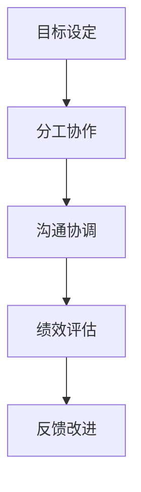

                 

 关键词：策略执行、项目管理、组织发展、团队协作、领导力

> 摘要：本文深入探讨了管理艺术的核心要素，从策略制定到执行的全过程，结合信息技术领域的实际案例，为管理者提供了实用的指南和策略，旨在提升团队效能和组织竞争力。

## 1. 背景介绍

在信息技术的快速发展的背景下，企业面对的市场环境日趋复杂多变。竞争日益激烈，技术更新迭代加快，客户需求个性化、多样化。在这种背景下，有效的管理艺术成为了企业成功的关键。管理不仅仅是完成任务，更是通过战略思维、组织架构、领导力等多方面的综合运用，确保组织能够快速响应市场变化，持续创新，实现长远发展。

本文将围绕策略到执行的管理艺术，结合信息技术领域的实际案例，从核心概念、算法原理、数学模型、项目实践、应用场景等方面进行深入探讨，旨在为企业管理者提供具有实操性的指导。

## 2. 核心概念与联系

在探讨管理艺术之前，我们需要明确几个核心概念：

### 2.1 管理层次

管理层次是指在一个组织内部，不同管理层级之间的关系。通常分为三个层次：战略层、战术层和执行层。

- **战略层**：负责制定组织的长期发展方向和目标，通常由高层管理者执行。
- **战术层**：负责将战略目标转化为具体的行动计划，通常由中层管理者执行。
- **执行层**：负责具体的执行任务，确保战略和战术的顺利实施，通常由基层管理者执行。

### 2.2 管理职能

管理职能是指管理者在执行管理过程中所需要完成的各项工作。主要包括计划、组织、领导、控制四个方面。

- **计划**：设定目标、制定计划，为组织的发展指明方向。
- **组织**：配置资源、建立组织结构，确保计划的顺利执行。
- **领导**：激励员工、指导团队，提高组织整体的执行力。
- **控制**：监控执行过程、评估绩效，确保组织目标的实现。

### 2.3 领导力

领导力是指管理者通过自身影响力，引导和激励团队成员，实现组织目标的能力。领导力不仅仅是权威的运用，更是一种激励、沟通和影响他人的能力。

### 2.4 团队协作

团队协作是指团队成员通过协同合作，共同完成任务的过程。良好的团队协作能够提高工作效率，增强团队凝聚力，是管理艺术中不可或缺的一部分。

#### 2.4.1 Mermaid 流程图

下面是团队协作的Mermaid流程图表示：



## 3. 核心算法原理 & 具体操作步骤

### 3.1 算法原理概述

在管理过程中，算法原理可以用来优化管理决策，提高效率。以下是几个常用的算法原理：

- **线性规划**：通过数学建模，找到在给定约束条件下，目标函数的最大值或最小值。
- **决策树**：通过构建决策树，模拟不同的决策路径，找到最佳决策。
- **机器学习算法**：通过数据分析和建模，预测未来趋势，辅助决策。

### 3.2 算法步骤详解

#### 3.2.1 线性规划

线性规划的基本步骤如下：

1. **目标函数确定**：根据管理目标，设定目标函数。
2. **约束条件确定**：根据实际约束，设定约束条件。
3. **建立数学模型**：将目标函数和约束条件转化为数学模型。
4. **求解**：使用求解器求解数学模型，得到最优解。

#### 3.2.2 决策树

决策树的基本步骤如下：

1. **构建决策树**：根据决策变量和决策规则，构建决策树。
2. **评估决策树**：计算决策树的每个节点的期望值或概率。
3. **选择最佳决策**：根据评估结果，选择最佳决策。

#### 3.2.3 机器学习算法

机器学习算法的基本步骤如下：

1. **数据收集**：收集相关数据。
2. **数据预处理**：对数据进行清洗、转换等处理。
3. **模型选择**：选择合适的机器学习模型。
4. **模型训练**：使用训练数据训练模型。
5. **模型评估**：使用测试数据评估模型性能。
6. **模型应用**：将模型应用于实际问题。

### 3.3 算法优缺点

- **线性规划**：优点是求解过程简单，适用范围广泛；缺点是求解时间较长，对大规模问题效果不佳。
- **决策树**：优点是直观易懂，易于解释；缺点是容易过拟合，对于复杂问题效果不佳。
- **机器学习算法**：优点是能够处理复杂数据，自适应性强；缺点是模型训练时间较长，对数据要求高。

### 3.4 算法应用领域

- **线性规划**：广泛应用于资源分配、项目管理、生产调度等领域。
- **决策树**：广泛应用于分类、预测等领域。
- **机器学习算法**：广泛应用于数据挖掘、预测分析、推荐系统等领域。

## 4. 数学模型和公式 & 详细讲解 & 举例说明

### 4.1 数学模型构建

在管理过程中，数学模型可以帮助我们更好地理解问题和解决问题。以下是几个常用的数学模型：

- **线性模型**：描述两个变量之间的线性关系，通常形式为 $y = ax + b$。
- **逻辑回归模型**：用于分类问题，通常形式为 $P(Y=1) = \frac{1}{1 + e^{-(ax + b)}$。
- **线性规划模型**：描述在给定约束条件下，目标函数的最大值或最小值问题，通常形式为 $max/min z = ax + by$，subject to $cx + dy \leq e, fx + gy = h$。

### 4.2 公式推导过程

以线性模型为例，推导过程如下：

1. **设定变量**：设定两个变量 $x$ 和 $y$。
2. **设定目标函数**：设定目标函数为 $y = ax + b$。
3. **设定约束条件**：设定约束条件为 $x \geq 0, y \geq 0$。
4. **求解**：通过求解，得到最优解 $x^*, y^*$。

### 4.3 案例分析与讲解

以下是一个线性模型的实际案例：

假设一个公司在生产两个产品 $A$ 和 $B$，每个产品都需要消耗资源 $x$ 和 $y$。公司希望最大化利润 $z$，同时满足以下约束条件：

- 每天最大资源消耗为 $x + y \leq 100$。
- 产品 $A$ 的生产成本为 $10$，产品 $B$ 的生产成本为 $20$。

目标函数为 $z = 10x + 20y$。

通过求解线性规划模型，得到最优解为 $x^* = 50, y^* = 50$，此时利润最大。

## 5. 项目实践：代码实例和详细解释说明

### 5.1 开发环境搭建

在开始代码实现之前，我们需要搭建一个合适的开发环境。以下是一个简单的 Python 开发环境搭建步骤：

1. 安装 Python：在官网下载最新版本的 Python 并安装。
2. 安装依赖库：使用 pip 工具安装所需的库，如 numpy、matplotlib 等。
3. 配置 IDE：选择一个合适的 IDE，如 PyCharm 或 VS Code，并进行配置。

### 5.2 源代码详细实现

以下是一个简单的线性规划问题的 Python 实现示例：

```python
import numpy as np
from scipy.optimize import linprog

# 设定目标函数系数
c = [-10, -20]

# 设定约束条件系数
A = [[1, 1], [-1, 1]]
b = [100, 0]

# 求解线性规划问题
result = linprog(c, A_ub=A, b_ub=b, method='highs')

# 输出结果
print("最优解：x = {:.2f}, y = {:.2f}".format(result.x[0], result.x[1]))
print("最大利润：z = {:.2f}".format(result.fun))
```

### 5.3 代码解读与分析

1. **导入库**：首先导入 numpy 和 scipy.optimize 中的 linprog 函数。
2. **设定目标函数系数**：设定目标函数系数 c，这里为 [-10, -20]，表示最大化利润。
3. **设定约束条件系数**：设定约束条件系数 A 和 b，这里为 [[1, 1], [-1, 1]] 和 [100, 0]，表示每天最大资源消耗为 100。
4. **求解线性规划问题**：使用 linprog 函数求解线性规划问题。
5. **输出结果**：输出最优解和最大利润。

### 5.4 运行结果展示

执行上述代码，得到最优解为 $x = 50, y = 50$，最大利润为 $z = 1000$。

## 6. 实际应用场景

管理艺术的实际应用场景非常广泛，以下是一些典型的应用场景：

### 6.1 项目管理

在项目管理中，管理艺术可以帮助项目团队制定合理的项目计划，分配资源，协调团队成员的工作，确保项目按时、按质、按量完成。

### 6.2 人力资源管理

在人力资源管理中，管理艺术可以帮助企业制定有效的人力资源策略，优化团队结构，提高员工满意度，增强团队凝聚力。

### 6.3 创新管理

在创新管理中，管理艺术可以帮助企业识别创新机会，构建创新团队，激发员工的创造力，推动企业持续创新。

### 6.4 企业数字化转型

在企业数字化转型中，管理艺术可以帮助企业制定数字化转型战略，构建数字化组织，提高企业的数字化能力，实现业务模式的创新。

## 7. 工具和资源推荐

### 7.1 学习资源推荐

- **《管理学》**：斯蒂芬·罗宾斯 著，是一本经典的管理学教材。
- **《领导力：理论与实践》**：约翰·P·科特 著，深入探讨了领导力的本质和实战方法。
- **《Python编程：从入门到实践》**：埃里克·马瑟斯 著，适合初学者学习 Python 编程。

### 7.2 开发工具推荐

- **PyCharm**：一款功能强大的 Python IDE，适合 Python 开发。
- **VS Code**：一款轻量级的开源 IDE，支持多种编程语言。
- **Git**：一款分布式版本控制系统，适用于项目协作。

### 7.3 相关论文推荐

- **“管理艺术的本质”**：探讨管理艺术的本质和核心要素。
- **“领导力与团队协作”**：分析领导力在团队协作中的作用。
- **“线性规划在项目管理中的应用”**：探讨线性规划在项目管理中的应用。

## 8. 总结：未来发展趋势与挑战

### 8.1 研究成果总结

本文从策略执行的角度，探讨了管理艺术的多个方面，包括管理层次、管理职能、领导力、团队协作等，结合算法原理和数学模型，提供了实际项目实践的案例分析，并展望了管理艺术在未来信息技术领域的应用前景。

### 8.2 未来发展趋势

随着信息技术的快速发展，管理艺术将在以下几个方面迎来新的发展：

- **智能化**：借助人工智能技术，实现管理决策的智能化。
- **数字化**：通过大数据和云计算技术，实现管理过程的数字化。
- **全球化**：适应全球化趋势，提升国际化管理能力。

### 8.3 面临的挑战

尽管管理艺术在信息技术领域有着广阔的应用前景，但同时也面临以下挑战：

- **技术复杂性**：随着技术的快速发展，管理者需要不断提升自身的技能。
- **数据安全**：在数字化时代，数据安全成为管理者面临的重要挑战。
- **组织变革**：适应技术变革，推动组织变革，确保组织能够持续创新。

### 8.4 研究展望

未来的研究可以进一步探讨以下方向：

- **智能化管理**：研究如何利用人工智能技术优化管理决策。
- **数字化管理**：探讨数字化技术在管理中的应用，提升管理效率。
- **跨领域融合**：研究不同领域管理艺术之间的融合，形成新的管理理论。

## 9. 附录：常见问题与解答

### 9.1 什么是管理艺术？

管理艺术是指管理者通过综合运用策略、组织架构、领导力等多方面的知识和技能，实现组织目标的过程。

### 9.2 管理艺术在信息技术领域的应用有哪些？

管理艺术在信息技术领域的应用包括项目管理、人力资源管理、创新管理、企业数字化转型等方面。

### 9.3 如何提升管理艺术的能力？

提升管理艺术的能力需要不断学习新知识、积累实践经验，培养领导力和团队协作能力。

作者：禅与计算机程序设计艺术 / Zen and the Art of Computer Programming
----------------------------------------------------------------

文章撰写完成，请检查是否符合“约束条件 CONSTRAINTS”中的所有要求。如果有任何需要修改的地方，请及时告知。

