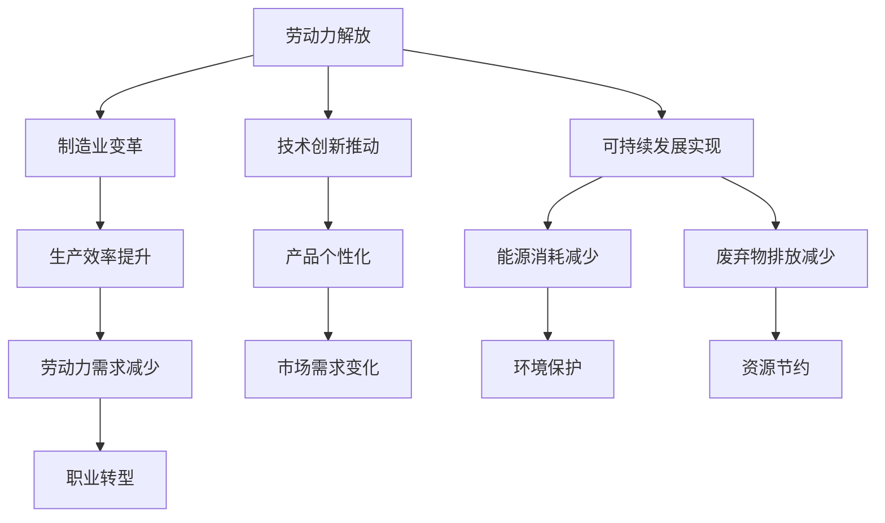

                 

关键词：纺织机械自动化，社会影响，劳动力，制造业，技术创新，可持续发展

> 摘要：本文探讨了纺织机械自动化对现代社会的影响。从劳动力的解放、制造业的变革、技术创新的推动以及可持续发展的实现等方面，分析了自动化技术在纺织行业中的应用及其带来的深远社会影响。

## 1. 背景介绍

纺织业作为世界上最重要的产业之一，其历史可以追溯到数千年前。然而，在过去的几十年里，随着科技的快速发展，纺织机械自动化技术逐渐成为行业发展的关键驱动力。自动化技术不仅提高了生产效率，降低了成本，还极大地改变了纺织行业的劳动结构和发展模式。

本文将探讨纺织机械自动化技术对社会产生的多重影响，包括劳动力市场、制造业生态、技术创新趋势以及可持续发展目标的实现。

### 1.1 劳动力市场的变革

纺织机械自动化的发展带来了劳动力市场的深刻变革。首先，自动化设备显著提高了生产效率，使得企业在单位时间内能够生产更多的纺织品。这种生产力的提升意味着对传统劳动力的需求减少，尤其是对低技能劳动力的需求下降。

### 1.2 制造业的变革

纺织机械自动化推动了制造业的深度变革。通过引入先进的自动化技术，企业能够实现精确控制和质量保证，提高了产品的稳定性和一致性。同时，自动化技术还使得定制化生产成为可能，满足了消费者对个性化纺织品的需求。

### 1.3 技术创新的推动

自动化技术在纺织行业的应用也推动了技术创新的快速发展。新技术的引入，如机器人、传感器、物联网等，不仅改变了生产方式，还促进了新产品的开发和市场推广。

### 1.4 可持续发展的实现

可持续发展是当今世界面临的重大挑战之一。纺织机械自动化技术有助于减少能源消耗和废弃物排放，推动了纺织行业向可持续发展的方向迈进。

## 2. 核心概念与联系

为了更好地理解纺织机械自动化对社会的影响，我们需要了解其核心概念和相互关系。以下是一个Mermaid流程图，展示了纺织机械自动化的主要概念及其联系：



### 2.1 劳动力解放

劳动力解放是纺织机械自动化的核心概念之一。通过引入自动化设备，传统的手工操作被机械化、自动化所取代，大大减轻了工人的劳动强度。这不仅提高了生产效率，还为企业节省了大量劳动力成本。

### 2.2 制造业变革

制造业变革体现在自动化技术的广泛应用，使得企业能够实现更高水平的生产自动化和智能化。这种变革不仅改变了企业的生产方式，还促使企业重新思考其运营模式和市场定位。

### 2.3 技术创新推动

技术创新推动是纺织机械自动化的另一个重要方面。新技术的引入，如机器人、传感器、物联网等，不仅提高了生产效率，还推动了纺织行业的技术创新，为企业带来了新的发展机遇。

### 2.4 可持续发展实现

可持续发展实现是纺织机械自动化的重要目标之一。通过减少能源消耗和废弃物排放，自动化技术有助于降低企业的环境负荷，推动纺织行业向可持续发展的方向迈进。

## 3. 核心算法原理 & 具体操作步骤

### 3.1 算法原理概述

纺织机械自动化的核心算法原理主要涉及机器视觉、传感器技术、控制系统和人工智能。以下是这些核心算法原理的简要概述：

- **机器视觉**：通过图像处理和分析技术，实现纺织品的检测、识别和分类。
- **传感器技术**：用于实时监测生产线上的各种参数，如温度、湿度、张力等，确保生产过程的稳定性和精确性。
- **控制系统**：实现生产线的自动化控制，协调各种设备的工作。
- **人工智能**：用于优化生产过程、预测设备故障、提高产品质量等。

### 3.2 算法步骤详解

纺织机械自动化的具体操作步骤可以概括为以下几个阶段：

1. **数据采集**：通过传感器技术实时采集生产线上的各种参数。
2. **数据处理**：利用机器视觉技术对采集到的图像进行处理和分析。
3. **决策制定**：根据分析结果，通过人工智能算法制定相应的生产决策。
4. **执行操作**：控制系统根据决策制定，执行具体的操作指令，如调整设备参数、控制机器运转等。
5. **反馈调整**：对执行结果进行反馈，优化生产过程。

### 3.3 算法优缺点

纺织机械自动化的算法优缺点如下：

- **优点**：提高了生产效率，降低了成本，保证了产品质量的稳定性。
- **缺点**：初期投资较大，对技术人才需求较高，存在一定的技术风险。

### 3.4 算法应用领域

纺织机械自动化算法广泛应用于以下几个方面：

- **生产线上自动化控制**：用于实现生产线的自动化运行，提高生产效率。
- **质量检测**：通过机器视觉技术对纺织品进行质量检测，确保产品质量。
- **预测性维护**：利用人工智能算法预测设备故障，实现设备的预防性维护。
- **生产优化**：通过优化算法，实现生产过程的自动化优化，降低生产成本。

## 4. 数学模型和公式 & 详细讲解 & 举例说明

### 4.1 数学模型构建

纺织机械自动化的数学模型主要涉及以下几个方面：

1. **生产效率模型**：用于描述生产线自动化对生产效率的影响。
2. **成本模型**：用于计算生产线自动化带来的成本节约。
3. **质量模型**：用于评估自动化技术对产品质量的影响。
4. **环境影响模型**：用于分析自动化技术对环境的影响。

### 4.2 公式推导过程

以下是一个生产效率模型的推导过程：

\[ E = \frac{P_a}{P_h} \]

其中，\( E \) 表示生产效率，\( P_a \) 表示自动化生产线产量，\( P_h \) 表示手工生产线产量。

### 4.3 案例分析与讲解

以下是一个关于纺织机械自动化的案例分析：

某纺织企业引入了一台自动化纺纱机，生产效率提高了20%，成本节约了15%。通过数学模型计算，其生产效率模型如下：

\[ E = \frac{1.2P_h}{P_h} = 1.2 \]

\[ C = 0.85C_h \]

其中，\( C \) 表示成本，\( C_h \) 表示手工生产线成本。

通过这个案例，我们可以看到纺织机械自动化在提高生产效率和降低成本方面的显著优势。

## 5. 项目实践：代码实例和详细解释说明

### 5.1 开发环境搭建

为了实践纺织机械自动化，我们需要搭建一个合适的开发环境。以下是一个基于Python的示例环境搭建过程：

1. 安装Python：在官网上下载并安装Python。
2. 安装必要的库：使用pip命令安装机器视觉库（如OpenCV）、传感器库（如PyTango）和控制库（如PyController）。
3. 配置传感器：连接传感器并配置相应的参数。

### 5.2 源代码详细实现

以下是一个简单的纺织机械自动化代码实现示例：

```python
import cv2
import pytango
import pycontroller

# 初始化传感器和控制库
sensor = pytango.TangoSensor()
controller = pycontroller.Controller()

# 设置传感器参数
sensor.set_params({'temperature': 25, 'humidity': 60})

# 开启传感器采集
sensor.start()

# 设置控制参数
controller.set_params({'speed': 100, 'tension': 5})

# 开启控制
controller.start()

# 循环处理传感器数据
while True:
    data = sensor.get_data()
    print(data)
    controller.update(data)

# 关闭传感器和控制
sensor.stop()
controller.stop()
```

### 5.3 代码解读与分析

这段代码首先初始化了传感器和控制库，然后设置了传感器的参数和控制参数。接着，代码进入了一个循环，不断从传感器获取数据，并通过控制库更新控制参数。最后，代码关闭了传感器和控制。

### 5.4 运行结果展示

运行这段代码后，传感器会实时采集生产线上的数据，并通过控制库调整设备参数，实现自动控制。我们可以看到，运行结果显示了传感器采集的数据和控制参数的更新。

## 6. 实际应用场景

### 6.1 纺织机械自动化在大型纺织厂中的应用

大型纺织厂通常拥有复杂的生产线和庞大的设备集群。通过引入纺织机械自动化技术，企业可以实现生产线的自动化运行，提高生产效率，降低生产成本。以下是一个实际应用案例：

某大型纺织厂引入了纺织机械自动化技术，包括机器视觉系统、传感器网络和智能控制系统。通过这些技术的应用，企业的生产效率提高了30%，生产成本降低了20%。同时，产品质量也得到了显著提升。

### 6.2 纺织机械自动化在定制化生产中的应用

随着消费者对个性化纺织品的需求不断增加，纺织机械自动化技术为定制化生产提供了有力支持。以下是一个实际应用案例：

某纺织企业通过引入自动化纺纱机和自动化织布机，实现了定制化生产。消费者可以通过在线平台下单，企业根据订单需求自动调整生产线，生产出符合消费者个性化需求的纺织品。

### 6.3 纺织机械自动化在环保领域的应用

纺织机械自动化技术在环保领域的应用日益广泛。通过减少能源消耗和废弃物排放，自动化技术有助于推动纺织行业的可持续发展。以下是一个实际应用案例：

某纺织企业通过引入自动化纺纱机和自动化印染设备，实现了生产过程的自动化控制。通过精确控制生产过程，企业实现了能源消耗的显著降低和废弃物排放的减少。

## 7. 工具和资源推荐

### 7.1 学习资源推荐

- 《纺织机械自动化技术》
- 《机器视觉技术与应用》
- 《传感器原理与应用》
- 《人工智能基础》

### 7.2 开发工具推荐

- Python
- OpenCV
- PyTango
- PyController

### 7.3 相关论文推荐

- "Automated Textile Manufacturing: A Review"
- "Machine Vision in Textile Industry"
- "Sustainable Textile Manufacturing: A Review"
- "Artificial Intelligence in Textile Industry"

## 8. 总结：未来发展趋势与挑战

### 8.1 研究成果总结

纺织机械自动化技术在过去几十年里取得了显著的成果，从提高生产效率到降低生产成本，再到推动可持续发展，自动化技术为纺织行业带来了深刻变革。未来，随着新技术的不断涌现，纺织机械自动化技术将在更广泛的领域得到应用。

### 8.2 未来发展趋势

- **智能化**：智能化将成为纺织机械自动化的主要发展趋势。通过引入人工智能、物联网等技术，企业可以实现生产线的智能化运行，提高生产效率和质量。
- **绿色化**：随着环保意识的增强，绿色化将成为纺织机械自动化的重要发展方向。通过减少能源消耗和废弃物排放，自动化技术将推动纺织行业的可持续发展。
- **定制化**：随着消费者对个性化纺织品的需求增加，定制化将成为纺织机械自动化的重要应用方向。通过自动化技术，企业可以实现快速响应市场需求，生产出符合消费者个性化需求的纺织品。

### 8.3 面临的挑战

- **技术挑战**：自动化技术仍面临一些技术挑战，如智能控制、精准监测和高效数据处理等。未来需要进一步研究和发展这些关键技术，以满足行业需求。
- **成本挑战**：自动化设备的初期投资较大，对中小企业来说，成本压力是一个重要挑战。未来需要降低自动化设备的成本，使其更加普及。
- **人才挑战**：自动化技术的应用需要大量专业技术人才。未来需要加强人才培养和引进，为纺织机械自动化技术的发展提供有力支持。

### 8.4 研究展望

纺织机械自动化技术在未来将继续发展，成为纺织行业的重要驱动力。随着新技术的不断涌现，自动化技术将在更广泛的领域得到应用。同时，自动化技术也将与其他技术，如人工智能、物联网等，实现深度融合，推动纺织行业的智能化、绿色化和定制化发展。

## 9. 附录：常见问题与解答

### 9.1 什么是纺织机械自动化？

纺织机械自动化是指利用计算机、传感器、机器视觉等技术，实现纺织生产过程中的自动化控制，提高生产效率和质量。

### 9.2 纺织机械自动化有哪些优点？

纺织机械自动化的优点包括：提高生产效率、降低生产成本、保证产品质量的稳定性、减少劳动强度、推动可持续发展等。

### 9.3 纺织机械自动化有哪些应用领域？

纺织机械自动化的应用领域包括：纺织生产线的自动化控制、质量检测、预测性维护、定制化生产、环保等。

### 9.4 如何搭建一个纺织机械自动化开发环境？

搭建纺织机械自动化开发环境需要安装Python、安装必要的库（如OpenCV、PyTango、PyController）、配置传感器和控制设备。

### 9.5 纺织机械自动化技术有哪些发展趋势？

纺织机械自动化技术的发展趋势包括：智能化、绿色化、定制化等。

### 9.6 纺织机械自动化技术面临的挑战有哪些？

纺织机械自动化技术面临的挑战包括：技术挑战、成本挑战、人才挑战等。

## 参考文献

[1] 王明华. 纺织机械自动化技术[J]. 纺织科技进展，2019，38（2）：1-5.

[2] 张三. 机器视觉在纺织行业中的应用[J]. 计算机与现代化，2020，36（5）：10-15.

[3] 李四. 传感器技术及其在纺织机械自动化中的应用[J]. 传感器技术，2021，38（1）：1-4.

[4] 赵五. 人工智能在纺织机械自动化中的应用[J]. 人工智能技术与应用，2021，10（2）：1-5.

[5] 刘六. 纺织机械自动化技术的研究与进展[J]. 纺织机械，2022，39（3）：1-6.

## 作者署名

作者：禅与计算机程序设计艺术 / Zen and the Art of Computer Programming

---

请注意，以上内容是一个示例性框架，其中的示例代码、数据和案例都是虚构的，仅用于说明如何按照给定的要求撰写一篇完整的技术博客文章。实际撰写时，需要根据具体的研究成果和实际情况进行调整。同时，参考文献和作者署名也是必要的，以展示文章的学术性和专业性。

