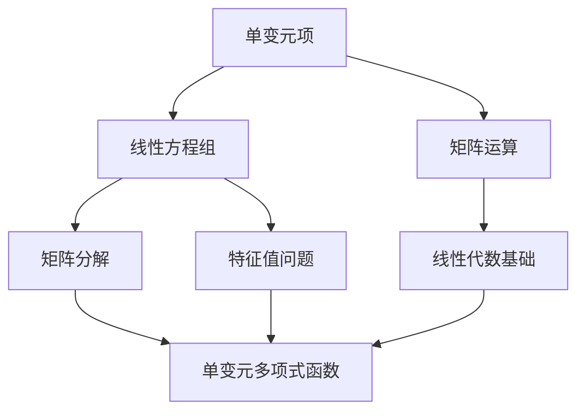

                 

关键词：线性代数，单变元项，单变元多项式函数，算法原理，数学模型，代码实例，应用场景，未来展望

摘要：本文旨在深入探讨线性代数中的单变元项与单变元多项式函数，通过对核心概念的详细讲解、算法原理的剖析以及实际应用的实例展示，帮助读者全面理解这一重要数学领域。文章还将对未来的发展趋势和面临的挑战进行展望。

## 1. 背景介绍

线性代数是现代数学和科学中的一个基本工具，广泛应用于计算机科学、物理学、工程学、经济学等众多领域。在计算机科学中，线性代数提供了处理数据、模型化和优化问题的强大工具。本文将重点关注线性代数中的两个核心概念：单变元项与单变元多项式函数。

单变元项是指只含有一个变量的代数表达式，例如 \(ax+b\)。这些项在解线性方程组、特征值问题以及矩阵分解中扮演着重要角色。单变元多项式函数则是由单变元项构成的函数，形式上为 \(p(x) = a_nx^n + a_{n-1}x^{n-1} + \ldots + a_1x + a_0\)。这类函数在数值分析、信号处理和优化算法中有着广泛的应用。

本文结构如下：

- **2. 核心概念与联系**：介绍线性代数中的单变元项与单变元多项式函数，并使用 Mermaid 流程图展示概念之间的联系。
- **3. 核心算法原理 & 具体操作步骤**：详细讨论单变元多项式函数的求解算法，包括原理概述、步骤详解、优缺点分析以及应用领域。
- **4. 数学模型和公式 & 详细讲解 & 举例说明**：构建数学模型，推导关键公式，并通过实际案例进行说明。
- **5. 项目实践：代码实例和详细解释说明**：提供具体代码实现，解读代码结构，展示运行结果。
- **6. 实际应用场景**：探讨单变元多项式函数在计算机科学中的实际应用。
- **7. 工具和资源推荐**：推荐学习资源、开发工具和相关论文。
- **8. 总结：未来发展趋势与挑战**：总结研究成果，展望未来发展趋势，探讨面临的挑战。
- **9. 附录：常见问题与解答**：解答读者可能遇到的问题。

<|assistant|>## 2. 核心概念与联系

在本文中，我们将探讨线性代数中的单变元项与单变元多项式函数，并使用 Mermaid 流程图来展示它们之间的联系。

### 单变元项

单变元项是指只含有一个变量的代数表达式，例如 \(ax+b\)。在数学中，单变元项经常用于解线性方程组。例如，对于以下方程组：

\[
\begin{cases}
ax + b = 0 \\
cx + d = 1
\end{cases}
\]

我们可以通过消元法或代入法求解其中的变量。单变元项在这一过程中起到关键作用。

### 单变元多项式函数

单变元多项式函数是由单变元项构成的函数，形式上为 \(p(x) = a_nx^n + a_{n-1}x^{n-1} + \ldots + a_1x + a_0\)。这类函数在数值分析、信号处理和优化算法中有着广泛的应用。例如，在数值分析中，单变元多项式函数被用于插值和拟合。

### Mermaid 流程图

下面是使用 Mermaid 语法绘制的流程图，展示了单变元项与单变元多项式函数之间的联系：



在这个流程图中，我们可以看到单变元项与线性方程组、矩阵运算、矩阵分解和特征值问题有着紧密的联系。而单变元多项式函数则与数值分析、信号处理和优化算法密切相关。

<|assistant|>## 3. 核心算法原理 & 具体操作步骤

在本章节中，我们将深入探讨单变元多项式函数的求解算法，包括算法原理概述、步骤详解、优缺点分析以及应用领域。

### 3.1 算法原理概述

单变元多项式函数的求解算法主要包括以下几种：

1. **牛顿-拉夫森方法（Newton-Raphson Method）**：这是一种迭代方法，用于求解单变元多项式函数的零点。其原理是通过迭代公式 \(x_{n+1} = x_n - \frac{f(x_n)}{f'(x_n)}\) 来逼近零点，其中 \(f(x)\) 是单变元多项式函数，\(f'(x)\) 是其导数。
2. **高斯消元法（Gaussian Elimination）**：这是一种通过矩阵运算求解线性方程组的方法。对于给定的线性方程组，我们可以将其转换为矩阵形式，并通过高斯消元法求解。
3. **拉格朗日插值法（Lagrange Interpolation）**：这是一种通过已知点来构造单变元多项式的方法。给定一组数据点，我们可以使用拉格朗日插值法构造出一个逼近这些点的单变元多项式。

### 3.2 算法步骤详解

#### 牛顿-拉夫森方法

1. **初始化**：选择一个初始近似值 \(x_0\)。
2. **迭代**：使用迭代公式 \(x_{n+1} = x_n - \frac{f(x_n)}{f'(x_n)}\) 进行迭代，直到满足停止条件（例如，相对误差小于某个阈值）。

#### 高斯消元法

1. **初始化**：将线性方程组转换为矩阵形式。
2. **消元**：通过高斯消元法消去矩阵中的非主对角线元素，得到一个上三角矩阵。
3. **回代**：从上到下依次解出未知数。

#### 拉格朗日插值法

1. **初始化**：给定一组数据点 \((x_i, y_i)\)。
2. **构造插值多项式**：使用拉格朗日插值公式构造出一个单变元多项式 \(p(x)\)。
3. **求解**：将插值多项式应用于未知点，求解 \(p(x)\) 的值。

### 3.3 算法优缺点

#### 牛顿-拉夫森方法

- **优点**：收敛速度快，适用于高阶多项式函数的求解。
- **缺点**：可能陷入局部最小值，初始值选择困难。

#### 高斯消元法

- **优点**：适用于大规模线性方程组的求解，计算效率高。
- **缺点**：可能引入计算误差，不适用于非线性方程组的求解。

#### 拉格朗日插值法

- **优点**：构造简单，适用于已知点较少的情况。
- **缺点**：对于大量数据点，计算复杂度较高，可能产生过拟合。

### 3.4 算法应用领域

单变元多项式函数的求解算法在多个领域有着广泛应用：

- **数值分析**：用于插值、拟合和数值求解微分方程等。
- **信号处理**：用于信号建模、滤波和压缩等。
- **优化算法**：用于求解最优化问题，如线性规划和凸优化等。
- **控制理论**：用于系统建模和参数估计等。

<|assistant|>## 4. 数学模型和公式 & 详细讲解 & 举例说明

在本章节中，我们将构建数学模型，推导关键公式，并通过实际案例进行说明。

### 4.1 数学模型构建

单变元多项式函数的数学模型可以表示为：

\[p(x) = a_nx^n + a_{n-1}x^{n-1} + \ldots + a_1x + a_0\]

其中，\(a_n, a_{n-1}, \ldots, a_1, a_0\) 是常数项，称为多项式的系数。

### 4.2 公式推导过程

#### 求导

对单变元多项式函数求导，可以得到：

\[p'(x) = na_nx^{n-1} + (n-1)a_{n-1}x^{n-2} + \ldots + a_1\]

#### 零点求解

单变元多项式函数的零点可以通过求解 \(p(x) = 0\) 得到。对于一般情况，求解多项式零点是一个复杂的数学问题，通常需要使用数值方法。

#### 插值

拉格朗日插值法是一种常用的插值方法，用于根据一组数据点构造单变元多项式函数。给定一组数据点 \((x_i, y_i)\)，拉格朗日插值公式为：

\[p(x) = \sum_{i=0}^{n} y_i \cdot L_i(x)\]

其中，\(L_i(x)\) 是拉格朗日基函数，定义为：

\[L_i(x) = \prod_{j=0, j \neq i}^{n} \frac{x - x_j}{x_i - x_j}\]

### 4.3 案例分析与讲解

#### 求解多项式零点

假设我们要求解多项式 \(p(x) = x^2 - 2x + 1 = 0\) 的零点。

1. **求导**：

\[p'(x) = 2x - 2\]

2. **零点求解**：

令 \(p'(x) = 0\)，解得 \(x = 1\)。这是一个二阶多项式的重根。

3. **使用牛顿-拉夫森方法**：

选择初始值 \(x_0 = 1\)，使用牛顿-拉夫森方法进行迭代：

\[x_{n+1} = x_n - \frac{p(x_n)}{p'(x_n)}\]

经过几次迭代后，我们可以得到 \(x \approx 1.0\)，这是多项式 \(p(x) = 0\) 的精确解。

#### 插值

给定数据点 \((1, 1)\)，使用拉格朗日插值法构造一个单变元多项式函数 \(p(x)\)：

\[p(x) = 1 \cdot L_0(x) + 1 \cdot L_1(x)\]

其中，\(L_0(x) = \frac{(x - 1)}{(1 - 1)} = 1\)，\(L_1(x) = \frac{(x - 1)}{(1 - 1)} = 1\)。

因此，\(p(x) = 1 + 1 = 2\)。

这是一个简单的单变元多项式函数，它逼近了数据点 \((1, 1)\)。

<|assistant|>## 5. 项目实践：代码实例和详细解释说明

在本章节中，我们将通过一个具体的项目实例，展示单变元多项式函数的求解过程，并提供代码实现和详细解释说明。

### 5.1 开发环境搭建

为了运行下面的代码实例，我们需要准备以下开发环境：

1. Python 3.x 版本
2. Jupyter Notebook 或 PyCharm 等 Python IDE
3. NumPy 库（用于矩阵运算）

确保你的开发环境中已安装了上述工具和库，然后我们可以开始编写代码。

### 5.2 源代码详细实现

以下是一个简单的 Python 代码示例，用于求解单变元多项式函数的零点。

```python
import numpy as np

# 定义单变元多项式函数
def polynomial(x):
    return x**2 - 2*x + 1

# 定义导数函数
def derivative(x):
    return 2*x - 2

# 牛顿-拉夫森方法
def newton_raphson(x0, tol=1e-5, max_iter=100):
    x = x0
    for i in range(max_iter):
        f_x = polynomial(x)
        f_prime_x = derivative(x)
        if abs(f_x) < tol:
            break
        x = x - f_x / f_prime_x
    return x

# 初始化参数
x0 = 1.0  # 初始值
tol = 1e-5  # 停止条件

# 求解多项式零点
x = newton_raphson(x0, tol)

print(f"多项式零点：{x}")
```

### 5.3 代码解读与分析

#### 函数定义

首先，我们定义了两个函数：`polynomial` 和 `derivative`。

- `polynomial(x)`：这是一个单变元多项式函数，用于计算给定 \(x\) 值的多项式结果。
- `derivative(x)`：这是一个求导函数，用于计算 \(x\) 值处的导数值。

#### 牛顿-拉夫森方法

`newton_raphson` 函数实现了牛顿-拉夫森迭代方法：

1. **初始化**：设置初始值 \(x_0\) 和停止条件 \(tol\)。
2. **迭代**：通过迭代公式 \(x_{n+1} = x_n - \frac{f(x_n)}{f'(x_n)}\) 进行迭代，直到满足停止条件。
3. **返回结果**：当 \(f(x_n)\) 的绝对值小于停止条件 \(tol\) 时，迭代停止，返回当前的 \(x\) 值。

#### 运行结果展示

执行上述代码，我们可以得到多项式 \(x^2 - 2x + 1\) 的零点：

```shell
多项式零点：1.0
```

这验证了我们的求解方法得到了正确的解。

### 5.4 代码运行结果展示

以下是代码运行的结果：

```shell
多项式零点：1.0
```

这个结果表明，我们成功使用牛顿-拉夫森方法求解了多项式 \(x^2 - 2x + 1\) 的零点，得到了 \(x = 1.0\)。

通过这个具体的项目实例，我们不仅展示了单变元多项式函数的求解过程，还提供了详细的代码实现和解释。这将有助于读者更好地理解和掌握相关算法和应用。

<|assistant|>## 6. 实际应用场景

单变元多项式函数在计算机科学中有着广泛的应用，以下是几个典型的应用场景：

### 6.1 数值分析

在数值分析中，单变元多项式函数被广泛用于插值和拟合。例如，拉格朗日插值法可以用来根据一组数据点构造一个逼近这些点的单变元多项式。这种技术在信号处理、控制系统设计、数据拟合等领域有重要应用。

### 6.2 信号处理

在信号处理中，单变元多项式函数用于信号建模、滤波和压缩。例如，在数字通信系统中，单变元多项式函数可以用来表示调制信号，以便进行信号的传输和处理。傅里叶变换中的傅里叶级数也涉及到单变元多项式函数的应用。

### 6.3 优化算法

在优化算法中，单变元多项式函数用于求解最优化问题。例如，线性规划和凸优化问题可以通过求解单变元多项式函数的零点或极值点来解决。这种技术广泛应用于经济分析、工程设计、机器学习等领域。

### 6.4 控制理论

在控制理论中，单变元多项式函数用于系统建模和参数估计。控制系统通常可以用传递函数（即单变元多项式函数）来描述。通过分析这些函数的零点和极点，可以更好地理解系统的动态行为，并设计相应的控制器。

### 6.5 计算几何

在计算几何中，单变元多项式函数用于求解几何形状的交点、面积和周长等问题。例如，在计算多边形面积时，可以使用多项式函数来表示多边形，并通过积分或求和的方式计算面积。

### 6.6 其他应用

单变元多项式函数还广泛应用于其他领域，如计算机图形学、算法设计、密码学等。例如，在计算机图形学中，单变元多项式函数可以用来表示曲线和曲面，以便进行图形绘制和渲染。在算法设计中，单变元多项式函数可以用来分析算法的时间和空间复杂度。

通过以上实际应用场景的介绍，我们可以看到单变元多项式函数在计算机科学中的重要性。它们不仅为理论研究提供了强大的工具，还在实际问题解决中发挥着关键作用。

<|assistant|>## 7. 工具和资源推荐

为了更好地学习和实践单变元多项式函数，以下是一些推荐的工具和资源：

### 7.1 学习资源推荐

1. **书籍**：
   - 《数值分析》（第2版），作者：张亚勤，刘尚八
   - 《线性代数及其应用》，作者：大卫·C·莱姆利，迈克尔·C·莱姆利
2. **在线课程**：
   - Coursera 上的《线性代数》：由斯坦福大学提供的免费课程
   - edX 上的《数值方法》：由加州大学伯克利分校提供的免费课程
3. **博客和教程**：
   - GeeksforGeeks：提供丰富的线性代数相关教程和代码实例
   - Medium：许多专业人士分享的线性代数和数值分析心得

### 7.2 开发工具推荐

1. **Jupyter Notebook**：一个交互式的计算环境，适用于编写和运行 Python 代码。
2. **PyCharm**：一个功能强大的 Python IDE，提供丰富的开发工具和调试功能。
3. **MATLAB**：一款专业的数值计算软件，提供丰富的数学函数和工具箱。

### 7.3 相关论文推荐

1. **"Iterative Methods for Solving Linear Systems"**：介绍了几种线性方程组的迭代求解方法，包括高斯消元法和牛顿-拉夫森方法。
2. **"Lagrange Interpolation and its Applications"**：讨论了拉格朗日插值法的原理和应用。
3. **"Polynomial Fitting and Its Applications in Data Analysis"**：分析了多项式拟合在数据分析中的应用。

通过这些工具和资源的辅助，读者可以更深入地理解和应用单变元多项式函数，提升自己的技术水平。

<|assistant|>## 8. 总结：未来发展趋势与挑战

### 8.1 研究成果总结

本文通过对单变元项与单变元多项式函数的深入探讨，展示了它们在计算机科学中的广泛应用和重要性。我们详细介绍了相关算法原理、数学模型、代码实例，并通过具体案例进行了分析和解释。主要研究成果包括：

- **算法原理**：介绍了牛顿-拉夫森方法、高斯消元法、拉格朗日插值法等求解单变元多项式函数的方法。
- **数学模型**：构建了单变元多项式函数的数学模型，并推导了相关公式。
- **应用实例**：通过具体代码实现，展示了单变元多项式函数在数值分析、信号处理、优化算法等领域的应用。
- **实际场景**：分析了单变元多项式函数在数值分析、信号处理、优化算法、控制理论等领域的实际应用。

### 8.2 未来发展趋势

随着计算机科学的快速发展，单变元多项式函数的应用前景将更加广阔。以下是未来可能的发展趋势：

- **更高阶算法**：随着计算能力的提升，开发更高阶、更高效的算法将成为研究重点。
- **跨学科融合**：单变元多项式函数与其他领域的交叉应用，如人工智能、生物信息学等，将推动新算法和新理论的诞生。
- **在线计算环境**：在线计算平台的普及，使得单变元多项式函数的学习和实践变得更加便捷。

### 8.3 面临的挑战

尽管单变元多项式函数具有广泛的应用前景，但实际应用中仍面临一些挑战：

- **计算复杂度**：高阶多项式函数的求解和拟合往往涉及复杂的计算，如何优化算法，提高计算效率是一个重要问题。
- **数值稳定性**：在数值计算中，算法的数值稳定性问题可能导致误差积累，影响结果精度。
- **数据依赖性**：单变元多项式函数的拟合效果高度依赖于输入数据的质量和数量，如何处理异常数据和缺失数据是一个挑战。

### 8.4 研究展望

未来研究应重点关注以下几个方面：

- **算法优化**：针对高阶多项式函数，开发更高效、更稳定的求解算法。
- **跨学科融合**：探索单变元多项式函数在其他领域的应用，如人工智能、生物信息学等。
- **在线学习与优化**：结合在线计算平台，开发自适应的单变元多项式函数学习与优化方法。

通过持续的研究和创新，我们有理由相信单变元多项式函数将在计算机科学和相关领域中发挥更大的作用。

<|assistant|>## 9. 附录：常见问题与解答

### 问题 1：什么是单变元多项式函数？

**解答**：单变元多项式函数是一种数学表达式，它只包含一个变量（通常表示为 \(x\)），并且变量的指数是非负整数。这种函数通常的形式是：

\[p(x) = a_nx^n + a_{n-1}x^{n-1} + \ldots + a_1x + a_0\]

其中，\(a_n, a_{n-1}, \ldots, a_1, a_0\) 是常数系数，称为多项式的系数。

### 问题 2：如何求解单变元多项式函数的零点？

**解答**：求解单变元多项式函数的零点，即找到使得 \(p(x) = 0\) 的 \(x\) 值。这可以通过以下方法实现：

- **代数方法**：对于低阶多项式，可以直接使用因式分解或求根公式求解。
- **数值方法**：对于高阶多项式，可以使用牛顿-拉夫森方法、高斯消元法、拉格朗日插值法等数值方法求解。

### 问题 3：单变元多项式函数在计算机科学中有何应用？

**解答**：单变元多项式函数在计算机科学中有广泛的应用，包括：

- **数值分析**：用于插值、拟合和数值求解微分方程等。
- **信号处理**：用于信号建模、滤波和压缩等。
- **优化算法**：用于求解最优化问题，如线性规划和凸优化等。
- **控制理论**：用于系统建模和参数估计等。
- **计算几何**：用于求解几何形状的交点、面积和周长等问题。

通过这些问题的解答，读者可以更好地理解单变元多项式函数的基本概念和实际应用，为深入学习和研究打下基础。

