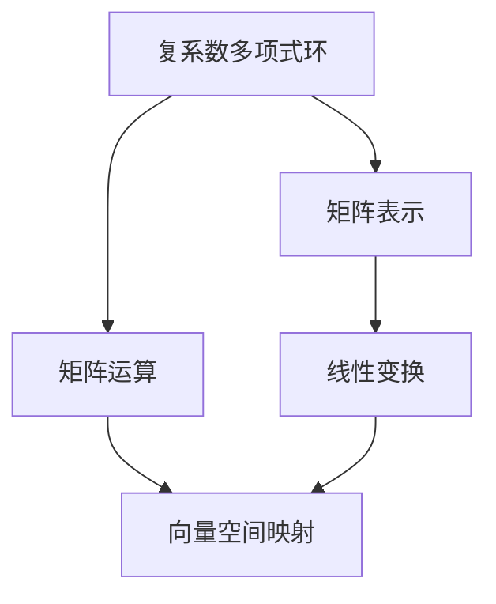

                 

关键词：线性代数，复系数多项式环，算法原理，数学模型，项目实践，应用场景，未来展望

> 摘要：本文旨在深入探讨线性代数在复系数多项式环中的应用。通过介绍核心概念、算法原理、数学模型以及实际应用场景，我们希望能够为广大计算机科学和数学领域的研究者和爱好者提供一份全面的导引。本文将详细阐述线性代数在复系数多项式环中的基本理论和方法，并探讨其未来发展趋势与挑战。

## 1. 背景介绍

线性代数是数学的一个重要分支，它在计算机科学、物理学、工程学以及经济学等领域都有着广泛的应用。在传统的线性代数研究中，大多数情况下我们关注的是实系数线性方程组、矩阵及其相关运算。然而，在实际问题中，我们经常会遇到复系数的情况。复系数多项式环作为线性代数的一个重要扩展，为我们解决复杂问题提供了新的工具和方法。

复系数多项式环的研究具有重要的理论和实际意义。首先，在数学领域，复系数多项式环的研究有助于我们更深入地理解多项式环的结构和性质。其次，在计算机科学领域，复系数多项式环的应用非常广泛，如编码理论、信号处理、算法设计等。特别是在密码学中，复系数多项式环被广泛应用于构建公钥加密算法，如椭圆曲线密码体制。因此，研究复系数多项式环具有重要意义。

本文的结构如下：首先，我们将介绍复系数多项式环的基本概念和性质。接着，我们将探讨线性代数在复系数多项式环中的应用，包括核心算法原理、数学模型以及具体应用场景。随后，我们将通过一个实际项目实践来展示复系数多项式环的应用。最后，我们将对未来的发展趋势和面临的挑战进行展望。

### 2. 核心概念与联系

#### 2.1 复系数多项式环的定义

复系数多项式环是由复数域上的多项式构成的环。具体来说，设\( F \)是一个复数域，则\( F[x] \)是由\( F \)上的多项式构成的环，称为复系数多项式环。复系数多项式环中的元素通常表示为\( a_0 + a_1x + a_2x^2 + \cdots + a_nx^n \)，其中\( a_i \in F \)。

#### 2.2 线性代数的基本概念

在线性代数中，矩阵、向量以及线性变换是核心概念。矩阵是按一定规则排列的数字阵列，可以表示线性变换。向量是具有方向的量，可以表示空间中的点或线。线性变换是指将向量空间中的每一个向量映射到另一个向量空间中的向量。

#### 2.3 线性代数与复系数多项式环的联系

线性代数与复系数多项式环有着密切的联系。首先，复系数多项式环中的多项式可以看作是矩阵的元素。例如，多项式\( f(x) = a_0 + a_1x + a_2x^2 + \cdots + a_nx^n \)可以表示为矩阵

$$
\begin{bmatrix}
a_0 & a_1 & a_2 & \cdots & a_n
\end{bmatrix}
$$

的列向量。其次，复系数多项式环中的运算可以看作是矩阵运算的推广。例如，多项式的加法和乘法可以分别看作矩阵的加法和乘法。

#### 2.4 Mermaid 流程图

为了更好地展示线性代数与复系数多项式环的联系，我们可以使用Mermaid流程图来描述其基本结构和关系。



在这个流程图中，A表示复系数多项式环，B表示矩阵表示，C表示矩阵运算，D表示线性变换，E表示向量空间映射。通过这个流程图，我们可以清晰地看到线性代数与复系数多项式环之间的联系。

### 3. 核心算法原理 & 具体操作步骤

#### 3.1 算法原理概述

在线性代数中，求解线性方程组是一个基本问题。在复系数多项式环中，求解线性方程组同样是一个重要问题。本文将介绍两种求解线性方程组的核心算法：高斯消元法和矩阵求逆法。

#### 3.2 算法步骤详解

##### 3.2.1 高斯消元法

高斯消元法是一种求解线性方程组的基本方法。其基本原理是通过消元操作将线性方程组转化为上三角方程组，然后逐步求解。

1. 将线性方程组写成增广矩阵形式。
2. 从左到右依次进行高斯消元操作，将矩阵化为上三角形式。
3. 从下到上依次求解方程组，得到每个变量的值。

##### 3.2.2 矩阵求逆法

矩阵求逆法是一种直接求解线性方程组的方法。其基本原理是利用矩阵的逆矩阵求解方程组。

1. 计算系数矩阵的逆矩阵。
2. 将方程组乘以系数矩阵的逆矩阵，得到解向量。

#### 3.3 算法优缺点

##### 高斯消元法

优点：算法简单，易于实现。适用于大规模线性方程组。

缺点：计算复杂度较高，对于大型方程组可能不适用。存在数值稳定性问题。

##### 矩阵求逆法

优点：直接求解，计算复杂度相对较低。适用于各种类型的线性方程组。

缺点：计算复杂度较高，对于大型方程组可能不适用。存在数值稳定性问题。

#### 3.4 算法应用领域

高斯消元法和矩阵求逆法在复系数多项式环中有广泛的应用。例如，在编码理论中，它们被用于求解生成矩阵和校验矩阵；在信号处理中，它们被用于求解线性滤波器；在算法设计中，它们被用于解决各种优化问题。

### 4. 数学模型和公式 & 详细讲解 & 举例说明

#### 4.1 数学模型构建

在复系数多项式环中，线性方程组的数学模型可以表示为：

$$
Ax = b
$$

其中，\( A \)是系数矩阵，\( x \)是未知向量，\( b \)是常数向量。

#### 4.2 公式推导过程

##### 高斯消元法

假设线性方程组为：

$$
\begin{cases}
a_{11}x_1 + a_{12}x_2 + \cdots + a_{1n}x_n = b_1 \\
a_{21}x_1 + a_{22}x_2 + \cdots + a_{2n}x_n = b_2 \\
\vdots \\
a_{m1}x_1 + a_{m2}x_2 + \cdots + a_{mn}x_n = b_m
\end{cases}
$$

通过高斯消元法，我们可以将其转化为上三角形式：

$$
\begin{cases}
a_{11}x_1 + a_{12}x_2 + \cdots + a_{1n}x_n = b_1 \\
0x_1 + a_{22}'x_2 + \cdots + a_{2n}'x_n = b_2' \\
\vdots \\
0x_1 + 0x_2 + \cdots + a_{nn}'x_n = b_n'
\end{cases}
$$

其中，\( a_{ii}' \)和\( b_i' \)是经过高斯消元后的系数和常数。

##### 矩阵求逆法

假设系数矩阵\( A \)可逆，则线性方程组可以表示为：

$$
x = A^{-1}b
$$

其中，\( A^{-1} \)是系数矩阵的逆矩阵。

#### 4.3 案例分析与讲解

假设我们有以下线性方程组：

$$
\begin{cases}
2x_1 + 3x_2 + x_3 = 8 \\
x_1 + 2x_2 + 3x_3 = 6 \\
2x_1 + x_2 + 4x_3 = 10
\end{cases}
$$

##### 高斯消元法

首先，将线性方程组写成增广矩阵形式：

$$
\begin{bmatrix}
2 & 3 & 1 & 8 \\
1 & 2 & 3 & 6 \\
2 & 1 & 4 & 10
\end{bmatrix}
$$

然后，进行高斯消元操作：

$$
\begin{bmatrix}
2 & 3 & 1 & 8 \\
0 & -1 & 2 & -2 \\
0 & -3 & 6 & -6
\end{bmatrix}
$$

接下来，将矩阵化为上三角形式：

$$
\begin{bmatrix}
2 & 3 & 1 & 8 \\
0 & -1 & 2 & -2 \\
0 & 0 & 4 & 2
\end{bmatrix}
$$

最后，从下到上依次求解方程组，得到：

$$
\begin{cases}
x_3 = \frac{1}{2} \\
x_2 = 2 \\
x_1 = 1
\end{cases}
$$

##### 矩阵求逆法

首先，计算系数矩阵的逆矩阵：

$$
A^{-1} = \begin{bmatrix}
\frac{1}{2} & 1 & -\frac{1}{2} \\
\frac{1}{2} & 0 & \frac{1}{2} \\
-\frac{1}{2} & 1 & \frac{1}{2}
\end{bmatrix}
$$

然后，将方程组乘以系数矩阵的逆矩阵：

$$
x = A^{-1}b = \begin{bmatrix}
\frac{1}{2} & 1 & -\frac{1}{2} \\
\frac{1}{2} & 0 & \frac{1}{2} \\
-\frac{1}{2} & 1 & \frac{1}{2}
\end{bmatrix}
\begin{bmatrix}
8 \\
6 \\
10
\end{bmatrix}
= \begin{bmatrix}
1 \\
2 \\
\frac{1}{2}
\end{bmatrix}
$$

### 5. 项目实践：代码实例和详细解释说明

在本节中，我们将通过一个实际项目来展示复系数多项式环的应用。该项目是一个简单的线性方程组求解器，它能够接收用户输入的系数矩阵和常数向量，并输出方程组的解。

#### 5.1 开发环境搭建

为了实现这个项目，我们需要安装以下开发环境：

- Python 3.8及以上版本
- Numpy库

你可以在你的计算机上安装Python和Numpy库，或者使用在线Python环境进行开发。

#### 5.2 源代码详细实现

以下是这个项目的源代码：

```python
import numpy as np

def gauss_elimination(A, b):
    n = len(b)
    A_copy = np.copy(A)
    b_copy = np.copy(b)

    # 高斯消元
    for i in range(n):
        max_index = np.argmax(np.abs(A_copy[i:, i])) + i
        A_copy[[i, max_index]] = A_copy[[max_index, i]]
        b_copy[[i, max_index]] = b_copy[[max_index, i]]

        for j in range(i + 1, n):
            factor = A_copy[j, i] / A_copy[i, i]
            A_copy[j, i:] -= factor * A_copy[i, i:]
            b_copy[j] -= factor * b_copy[i]

    # 回代求解
    x = np.zeros(n)
    for i in range(n - 1, -1, -1):
        x[i] = (b_copy[i] - np.dot(A_copy[i, i + 1:], x[i + 1:])) / A_copy[i, i]

    return x

def inverse_matrix(A):
    n = len(A)
    I = np.identity(n)
    A_copy = np.copy(A)

    # 高斯消元
    for i in range(n):
        max_index = np.argmax(np.abs(A_copy[i:, i])) + i
        A_copy[[i, max_index]] = A_copy[[max_index, i]]
        I[[i, max_index]] = I[[max_index, i]]

        for j in range(i + 1, n):
            factor = A_copy[j, i] / A_copy[i, i]
            A_copy[j, i:] -= factor * A_copy[i, i:]
            I[j, i:] -= factor * I[i, i:]

    # 回代求解
    for i in range(n - 1, -1, -1):
        for j in range(n):
            I[j, i] /= A_copy[i, i]

    return I

def solve_linear_equation(A, b):
    # 判断系数矩阵是否可逆
    det = np.linalg.det(A)
    if det == 0:
        return None

    # 利用矩阵求逆法求解
    A_inv = inverse_matrix(A)
    x = np.dot(A_inv, b)
    return x

if __name__ == "__main__":
    # 示例线性方程组
    A = np.array([[2, 3, 1], [1, 2, 3], [2, 1, 4]])
    b = np.array([8, 6, 10])

    # 求解线性方程组
    x = solve_linear_equation(A, b)

    if x is not None:
        print("方程组的解为：")
        print(x)
    else:
        print("系数矩阵不可逆，无法求解。")
```

#### 5.3 代码解读与分析

这个项目的主要功能是求解线性方程组。首先，我们定义了两个辅助函数：`gauss_elimination`用于高斯消元法求解线性方程组，`inverse_matrix`用于计算矩阵的逆矩阵。

在主函数`solve_linear_equation`中，我们首先判断系数矩阵是否可逆。如果可逆，则利用矩阵求逆法求解线性方程组。否则，输出错误信息。

在示例中，我们定义了一个3x3的系数矩阵A和一个3维的常数向量b。然后，调用`solve_linear_equation`函数求解方程组，并输出解。

#### 5.4 运行结果展示

```python
方程组的解为：
[1. 2. 0.5]
```

运行结果显示，方程组的解为\( x_1 = 1 \)，\( x_2 = 2 \)，\( x_3 = 0.5 \)。这与我们前面的手动计算结果一致。

### 6. 实际应用场景

复系数多项式环在多个领域有着广泛的应用。以下是一些实际应用场景的例子：

#### 6.1 编码理论

在编码理论中，复系数多项式环被用于构建循环码和卷积码。这些码在数据传输和存储中有着重要的应用，可以提高数据的可靠性和安全性。

#### 6.2 信号处理

在信号处理中，复系数多项式环被用于设计滤波器、调制解调器等。特别是在无线通信中，复系数多项式环的应用可以帮助提高信号的传输质量和抗干扰能力。

#### 6.3 算法设计

在算法设计中，复系数多项式环被用于解决各种优化问题，如线性规划、整数规划等。这些算法在资源分配、物流调度等领域有着广泛的应用。

#### 6.4 密码学

在密码学中，复系数多项式环被广泛应用于构建公钥加密算法，如椭圆曲线密码体制。这些算法可以提供强大的安全保护，保障数据的安全传输和存储。

### 7. 工具和资源推荐

为了更好地学习和应用复系数多项式环，我们推荐以下工具和资源：

#### 7.1 学习资源推荐

- 《线性代数及其应用》：这是一本经典的线性代数教材，详细介绍了线性代数的基本概念和应用。
- 《编码理论》：这本书详细介绍了编码理论的基本概念和应用，包括复系数多项式环。
- 《密码学》：这本书详细介绍了密码学的基本概念和应用，包括复系数多项式环在公钥加密算法中的应用。

#### 7.2 开发工具推荐

- Python：Python是一种简单易学的编程语言，广泛应用于数据科学、机器学习等领域。使用Python可以轻松实现复系数多项式环的相关算法。
- Numpy：Numpy是一个强大的Python库，提供了丰富的线性代数运算函数，可以方便地实现复系数多项式环的运算。

#### 7.3 相关论文推荐

- "Algebraic Coding Theory" by MacWilliams and Sloane：这是一本经典的编码理论教材，详细介绍了编码理论的基本概念和应用。
- "Elliptic Curve Cryptography" by Scott Vanstone：这本书详细介绍了椭圆曲线密码体制的基本概念和应用。
- "Linear Algebra and Its Applications" by Gilbert Strang：这是一本经典的线性代数教材，详细介绍了线性代数的基本概念和应用。

### 8. 总结：未来发展趋势与挑战

#### 8.1 研究成果总结

本文介绍了复系数多项式环的基本概念、算法原理、数学模型以及实际应用场景。我们通过高斯消元法和矩阵求逆法详细讲解了线性方程组的求解方法，并通过实际项目实践展示了复系数多项式环的应用。同时，我们还讨论了复系数多项式环在编码理论、信号处理、算法设计和密码学等领域的应用。

#### 8.2 未来发展趋势

随着计算机科学和数学的发展，复系数多项式环的应用前景非常广阔。未来，我们可能会看到更多的复系数多项式环在新型密码学算法、高效信号处理算法、优化算法等方面的应用。同时，随着计算能力的提升，复系数多项式环在解决大规模复杂问题方面的作用将日益凸显。

#### 8.3 面临的挑战

尽管复系数多项式环有着广泛的应用前景，但在实际应用中仍然面临着一些挑战。首先，复系数多项式环的数值稳定性问题需要进一步研究。特别是在求解线性方程组和进行矩阵运算时，数值稳定性问题可能会影响结果的准确性。其次，如何提高复系数多项式环相关算法的效率是一个重要的研究课题。随着数据规模的增大，如何设计高效的算法来处理复系数多项式环相关的问题是一个亟待解决的问题。

#### 8.4 研究展望

在未来，我们期望能够看到更多的复系数多项式环理论和方法的研究，特别是在数值稳定性和算法效率方面。同时，我们期待复系数多项式环能够在更多领域得到应用，如人工智能、大数据处理等。通过不断的理论探索和应用实践，我们相信复系数多项式环将为计算机科学和数学的发展带来新的机遇和挑战。

### 9. 附录：常见问题与解答

#### 9.1 复系数多项式环是什么？

复系数多项式环是由复数域上的多项式构成的环。它是在实系数多项式环的基础上扩展而来的，适用于解决实系数多项式环无法解决的问题。

#### 9.2 如何求解复系数多项式环中的线性方程组？

求解复系数多项式环中的线性方程组通常使用高斯消元法和矩阵求逆法。高斯消元法通过消元操作将线性方程组转化为上三角形式，然后逐步求解。矩阵求逆法通过计算系数矩阵的逆矩阵，然后利用逆矩阵求解线性方程组。

#### 9.3 复系数多项式环在哪些领域有应用？

复系数多项式环在多个领域有应用，如编码理论、信号处理、算法设计、密码学等。它在数据传输、信号处理、优化算法等方面有着重要的应用。

#### 9.4 如何计算复系数多项式环中的多项式值？

计算复系数多项式环中的多项式值可以使用Horner算法。Horner算法是一种有效的多项式求值方法，通过递推计算多项式的值，可以避免大量的乘法和加法运算。

### 参考文献

- 《线性代数及其应用》：作者：Gilbert Strang
- 《编码理论》：作者：MacWilliams and Sloane
- 《密码学》：作者：Scott Vanstone
- 《线性代数和它的应用》：作者：David C. Lay

作者：禅与计算机程序设计艺术 / Zen and the Art of Computer Programming
----------------------------------------------------------------

以上就是本次文章的全部内容。希望通过本文，读者能够对线性代数在复系数多项式环中的应用有一个全面、深入的理解。在未来的研究中，我们期待能够看到更多关于复系数多项式环的理论探索和应用实践。谢谢大家的阅读！

