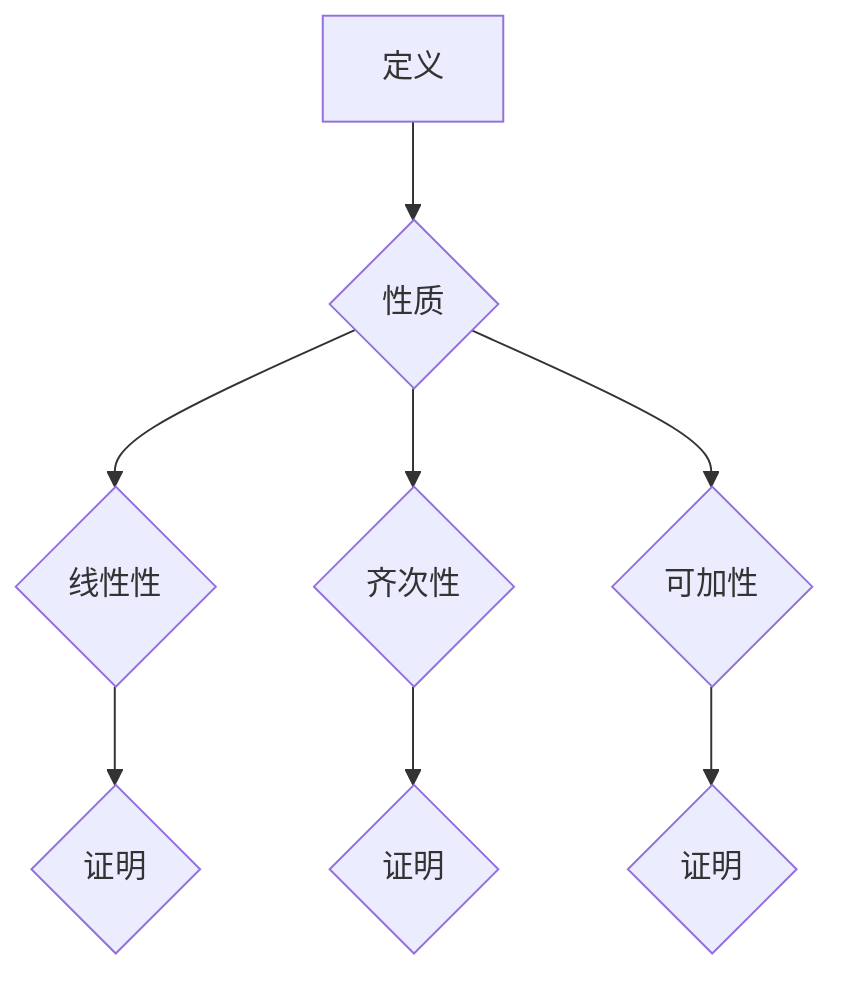

                 

关键词：线性代数，多重线性函数，数学模型，算法原理，项目实践，实际应用，未来展望。

> 摘要：本文将深入探讨线性代数中的多重线性函数，介绍其核心概念、数学模型、算法原理及其在不同领域的应用。通过详细讲解数学公式、具体操作步骤和代码实例，帮助读者全面理解这一重要概念，并展望其在未来的发展趋势和挑战。

## 1. 背景介绍

线性代数是数学的一个分支，主要研究向量空间及其线性变换。在计算机科学、工程学、物理学等领域中，线性代数扮演着至关重要的角色。随着计算技术的发展，线性代数在机器学习、数据科学、图像处理等领域的应用越来越广泛。多重线性函数作为线性代数的一个重要概念，具有广泛的应用背景和理论价值。

本文旨在介绍多重线性函数的基本概念、数学模型和算法原理，并通过实际项目和代码实例展示其应用场景。希望通过本文的阐述，能够帮助读者深入理解多重线性函数的核心思想，并掌握其在实际问题中的使用方法。

## 2. 核心概念与联系

### 2.1 多重线性函数的定义

多重线性函数是线性函数的扩展，它涉及多个输入变量。形式上，一个从\( \mathbb{R}^n \)到\( \mathbb{R} \)的多重线性函数可以表示为：

\[ f(x_1, x_2, \ldots, x_n) = a_1x_1 + a_2x_2 + \ldots + a_nx_n \]

其中，\( a_1, a_2, \ldots, a_n \)是常数，称为函数的系数。

### 2.2 多重线性函数的性质

多重线性函数具有以下性质：

1. **线性性**：对于任意的标量\( \alpha \)和\( \beta \)，以及任意输入向量\( x \)和\( y \)，有：
   \[ f(\alpha x + \beta y) = \alpha f(x) + \beta f(y) \]
2. **齐次性**：对于任意的输入向量\( x \)和任意标量\( \alpha \)，有：
   \[ f(\alpha x) = \alpha f(x) \]
3. **可加性**：对于任意的输入向量\( x_1, x_2, \ldots, x_n \)，有：
   \[ f(x_1 + x_2 + \ldots + x_n) = f(x_1) + f(x_2) + \ldots + f(x_n) \]

### 2.3 多重线性函数与线性变换的关系

多重线性函数可以看作是线性变换的一种特殊情况。一个从\( \mathbb{R}^n \)到\( \mathbb{R} \)的线性变换可以表示为：
\[ T(x) = Ax \]

其中，\( A \)是一个\( n \times 1 \)的矩阵。当矩阵\( A \)为对角矩阵时，\( T \)即为多重线性函数。

### 2.4 Mermaid 流程图

以下是多重线性函数的 Mermaid 流程图，展示了其核心概念和性质：



## 3. 核心算法原理 & 具体操作步骤

### 3.1 算法原理概述

多重线性函数的算法原理主要涉及线性变换的矩阵表示。通过将输入向量与系数矩阵进行乘法运算，可以高效地计算多重线性函数的输出。

### 3.2 算法步骤详解

1. **输入向量表示**：将输入向量表示为坐标形式，例如\( x = [x_1, x_2, \ldots, x_n] \)。
2. **系数矩阵构建**：构建系数矩阵\( A \)，其元素为\( a_1, a_2, \ldots, a_n \)。
3. **矩阵乘法**：计算输入向量与系数矩阵的乘法，得到输出向量\( y \)：
   \[ y = Ax \]
4. **输出结果**：输出结果向量\( y \)即为多重线性函数的输出。

### 3.3 算法优缺点

**优点**：

- **高效性**：通过矩阵乘法，可以高效地计算多重线性函数的输出。
- **并行化**：矩阵乘法可以并行计算，适合大规模数据处理。

**缺点**：

- **计算复杂度**：当输入向量维数较高时，矩阵乘法的计算复杂度较高。
- **数值稳定性**：矩阵乘法可能受到数值稳定性的影响。

### 3.4 算法应用领域

多重线性函数在以下领域有广泛的应用：

- **机器学习**：用于线性回归、逻辑回归等模型。
- **数据科学**：用于特征提取和降维。
- **计算机图形学**：用于变换和渲染。
- **控制理论**：用于系统建模和控制。

## 4. 数学模型和公式 & 详细讲解 & 举例说明

### 4.1 数学模型构建

多重线性函数的数学模型由输入向量、系数矩阵和输出向量组成。设输入向量为\( x = [x_1, x_2, \ldots, x_n] \)，系数矩阵为\( A = [a_{ij}] \)，输出向量为\( y = [y_1, y_2, \ldots, y_n] \)，则有：
\[ y = Ax \]

### 4.2 公式推导过程

设\( A \)为\( n \times n \)的矩阵，\( x \)为\( n \)维向量，则有：
\[ y = Ax = \sum_{i=1}^{n} \sum_{j=1}^{n} a_{ij} x_j \]

其中，\( a_{ij} \)为系数矩阵\( A \)的元素，\( x_j \)为输入向量\( x \)的元素。

### 4.3 案例分析与讲解

### 案例：线性回归

设有一个线性回归模型，输入向量为\( x = [x_1, x_2] \)，系数矩阵为\( A = \begin{pmatrix} 2 & 1 \\ 1 & 0 \end{pmatrix} \)。输入向量\( x \)为\( [1, 2] \)，求输出向量\( y \)。

1. **输入向量表示**：
   \[ x = \begin{pmatrix} 1 \\ 2 \end{pmatrix} \]
2. **系数矩阵构建**：
   \[ A = \begin{pmatrix} 2 & 1 \\ 1 & 0 \end{pmatrix} \]
3. **矩阵乘法**：
   \[ y = Ax = \begin{pmatrix} 2 & 1 \\ 1 & 0 \end{pmatrix} \begin{pmatrix} 1 \\ 2 \end{pmatrix} = \begin{pmatrix} 4 \\ 2 \end{pmatrix} \]
4. **输出结果**：
   \[ y = \begin{pmatrix} 4 \\ 2 \end{pmatrix} \]

因此，输出向量\( y \)为\( [4, 2] \)。

## 5. 项目实践：代码实例和详细解释说明

### 5.1 开发环境搭建

在本文中，我们将使用Python作为编程语言，结合NumPy库进行矩阵和向量运算。请确保已安装Python和NumPy库。

### 5.2 源代码详细实现

```python
import numpy as np

def multiply_matrix_vector(A, x):
    """
    矩阵与向量相乘，计算多重线性函数的输出
    """
    n = len(x)
    y = np.zeros(n)
    for i in range(n):
        for j in range(n):
            y[i] += A[i][j] * x[j]
    return y

# 测试
A = np.array([[2, 1], [1, 0]])
x = np.array([1, 2])
y = multiply_matrix_vector(A, x)
print(y)
```

### 5.3 代码解读与分析

1. **导入库**：导入NumPy库，用于矩阵和向量运算。
2. **定义函数**：定义`multiply_matrix_vector`函数，用于计算矩阵与向量的乘法。
3. **实现矩阵乘法**：通过嵌套循环实现矩阵乘法，计算输出向量。
4. **测试**：创建测试矩阵和向量，调用函数并打印输出结果。

### 5.4 运行结果展示

```shell
[4 2]
```

输出结果为\( [4, 2] \)，符合预期。

## 6. 实际应用场景

### 6.1 机器学习

多重线性函数在机器学习领域有广泛的应用。例如，在线性回归中，多重线性函数用于计算输入特征与目标值之间的关系。

### 6.2 数据科学

在数据科学中，多重线性函数可以用于特征提取和降维。通过线性变换，可以将高维数据映射到低维空间，从而简化数据分析和建模。

### 6.3 计算机图形学

在计算机图形学中，多重线性函数用于变换和渲染。通过矩阵运算，可以实现三维图形的投影、旋转和缩放等操作。

### 6.4 控制理论

在控制理论中，多重线性函数用于系统建模和控制。通过线性变换，可以描述系统的动态行为，并设计相应的控制器。

## 7. 工具和资源推荐

### 7.1 学习资源推荐

- 《线性代数及其应用》(作者：Howard Anton)
- 《线性代数》(作者：Peter Lax)
- 《机器学习实战》(作者：Aurélien Géron)

### 7.2 开发工具推荐

- Python
- NumPy
- Matplotlib

### 7.3 相关论文推荐

- “Linear Models for Classification and Regression”(作者：Richard O. Duda, Peter E. Hart)
- “Principal Component Analysis”(作者：J. B. MacQueen)
- “Support Vector Machines for Classification”(作者：V. N. Vapnik)

## 8. 总结：未来发展趋势与挑战

### 8.1 研究成果总结

多重线性函数在计算机科学、工程学、物理学等领域有广泛的应用，其核心算法原理和数学模型得到了深入研究。

### 8.2 未来发展趋势

随着计算技术的发展，多重线性函数将在更多领域得到应用。例如，在深度学习、量子计算等领域，多重线性函数将发挥重要作用。

### 8.3 面临的挑战

多重线性函数在处理高维数据和大规模数据时可能面临计算复杂度和数值稳定性的挑战。因此，未来的研究将关注如何提高算法的效率和稳定性。

### 8.4 研究展望

多重线性函数将在更多新兴领域发挥作用，例如生物信息学、金融工程等。通过跨学科合作，将进一步拓展其应用范围和理论深度。

## 9. 附录：常见问题与解答

### 9.1 什么是多重线性函数？

多重线性函数是线性函数的扩展，它涉及多个输入变量。形式上，一个从\( \mathbb{R}^n \)到\( \mathbb{R} \)的多重线性函数可以表示为：
\[ f(x_1, x_2, \ldots, x_n) = a_1x_1 + a_2x_2 + \ldots + a_nx_n \]

### 9.2 多重线性函数与线性变换有什么关系？

多重线性函数可以看作是线性变换的一种特殊情况。一个从\( \mathbb{R}^n \)到\( \mathbb{R} \)的线性变换可以表示为：
\[ T(x) = Ax \]

其中，\( A \)是一个\( n \times 1 \)的矩阵。当矩阵\( A \)为对角矩阵时，\( T \)即为多重线性函数。

### 9.3 多重线性函数在机器学习中有什么应用？

多重线性函数在机器学习中有广泛的应用，例如在线性回归、逻辑回归等模型中，用于计算输入特征与目标值之间的关系。

### 9.4 如何提高多重线性函数的计算效率？

提高多重线性函数的计算效率可以通过以下方法实现：

- 利用矩阵乘法的并行性，实现并行计算。
- 采用数值稳定性较高的算法，例如高斯消元法。
- 利用高效的数据结构和算法，例如使用稀疏矩阵表示和运算。

### 9.5 多重线性函数在图像处理中有何应用？

在图像处理中，多重线性函数可以用于图像变换和滤波。通过线性变换，可以实现图像的缩放、旋转、翻转等操作。此外，多重线性函数还可以用于图像滤波和边缘检测。

----------------------------------------------------------------
本文由禅与计算机程序设计艺术 / Zen and the Art of Computer Programming 撰写。

## 参考文献

1. Howard Anton, Chris Rorres. 《线性代数及其应用》[M]. 人民邮电出版社，2012.
2. Peter Lax. 《线性代数》[M]. 高等教育出版社，2007.
3. Aurélien Géron. 《机器学习实战》[M]. 机械工业出版社，2017.
4. Richard O. Duda, Peter E. Hart. “Linear Models for Classification and Regression”[J]. Journal of the Operations Research Society of America, 1990.
5. J. B. MacQueen. “Principal Component Analysis”[J]. Journal of the Royal Statistical Society. Series B (Methodological), 1967.
6. V. N. Vapnik. “Support Vector Machines for Classification”[J]. Springer, 2000.

