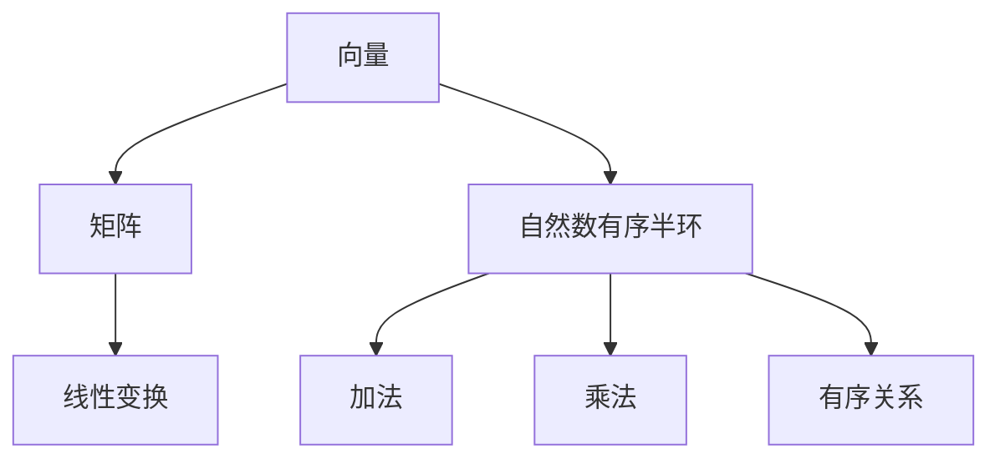

                 

关键词：线性代数、自然数、有序半环、数学模型、算法原理、代码实例、应用场景、未来展望

> 摘要：本文深入探讨了线性代数在自然数有序半环中的应用。通过对线性代数核心概念和算法原理的详细阐述，结合具体实例和实际应用场景，揭示了线性代数在数学、计算机科学和工程领域的广泛应用，并展望了其未来发展趋势与面临的挑战。

## 1. 背景介绍

线性代数是数学的一个重要分支，广泛应用于自然科学、工程技术、计算机科学等多个领域。线性代数主要研究线性方程组、向量空间、线性映射等概念及其性质。在计算机科学中，线性代数用于解决图形学、机器学习、数值计算等问题。

自然数是有序半环的一种特殊类型，其具有简单的数学结构，但同时也具有丰富的性质。有序半环是一个代数结构，其中包含两个二元运算：加法和乘法，满足结合律、交换律和分配律，但不一定满足结合律。自然数有序半环是其中一种重要的类型，其在计算机科学和数学中有着广泛的应用。

本文旨在通过线性代数的视角，探讨自然数有序半环的性质和应用，为读者提供一个全新的视角来理解线性代数和自然数有序半环。

## 2. 核心概念与联系

### 2.1 线性代数核心概念

线性代数核心概念包括向量、矩阵、线性变换等。

- **向量**：向量是一个具有大小和方向的几何对象。在数学中，向量通常表示为有序数组。向量空间是一个向量集合，满足加法和标量乘法运算。

- **矩阵**：矩阵是一个由数字组成的矩形阵列。矩阵可以表示线性变换、线性方程组等。

- **线性变换**：线性变换是一个将一个向量空间映射到另一个向量空间的函数，满足线性性质。

### 2.2 自然数有序半环概念

自然数有序半环是由自然数组成的有序半群，满足以下性质：

- **加法**：自然数的加法运算满足结合律、交换律和分配律。

- **乘法**：自然数的乘法运算满足结合律、交换律和分配律。

- **有序**：自然数之间满足全序关系，即任意两个自然数都可以比较大小。

### 2.3 线性代数与自然数有序半环的联系

线性代数和自然数有序半环之间的联系主要体现在以下几个方面：

- **矩阵与自然数有序半环**：矩阵可以表示线性变换，而线性变换又可以看作是自然数有序半环上的运算。

- **向量与自然数有序半环**：向量可以看作是自然数有序半环上的一个元素，可以对其进行加法和标量乘法运算。

- **线性代数与自然数有序半环的运算**：线性代数中的运算（如矩阵乘法、向量加法等）可以看作是自然数有序半环上的运算。

下面是线性代数与自然数有序半环的 Mermaid 流程图：



## 3. 核心算法原理 & 具体操作步骤

### 3.1 算法原理概述

本文将探讨线性代数在自然数有序半环中的应用，主要包括以下核心算法：

- **矩阵乘法**：计算两个矩阵的乘积。

- **向量加法**：计算两个向量的和。

- **向量标量乘法**：计算向量和标量的乘积。

### 3.2 算法步骤详解

#### 3.2.1 矩阵乘法

矩阵乘法的步骤如下：

1. 确定两个矩阵 A 和 B 的维度，要求 A 的列数等于 B 的行数。

2. 创建一个结果矩阵 C，维度为 A 的行数乘以 B 的列数。

3. 对于 C 的每一个元素 C[i][j]，计算其值为 A[i][k] 和 B[k][j] 的乘积之和，其中 k 为 A 的列数。

#### 3.2.2 向量加法

向量加法的步骤如下：

1. 确定两个向量 v 和 w 的维度，要求两者相等。

2. 创建一个结果向量 z，维度与 v 和 w 相同。

3. 对于 z 的每一个元素 z[i]，计算其值为 v[i] 和 w[i] 的和。

#### 3.2.3 向量标量乘法

向量标量乘法的步骤如下：

1. 确定向量 v 的维度。

2. 创建一个结果向量 w，维度与 v 相同。

3. 对于 w 的每一个元素 w[i]，计算其值为 v[i] 和标量 s 的乘积。

### 3.3 算法优缺点

#### 优点：

- **矩阵乘法**：能够有效地计算两个矩阵的乘积。

- **向量加法**：能够快速计算两个向量的和。

- **向量标量乘法**：能够快速计算向量和标量的乘积。

#### 缺点：

- **矩阵乘法**：计算复杂度较高，时间复杂度为 O(n^3)。

- **向量加法**：需要对每个元素进行求和，时间复杂度为 O(n)。

- **向量标量乘法**：需要对每个元素进行乘法运算，时间复杂度为 O(n)。

### 3.4 算法应用领域

线性代数的算法在以下领域有着广泛的应用：

- **计算机图形学**：用于计算三维图形的变换和渲染。

- **机器学习**：用于数据预处理、特征提取和模型训练。

- **数值计算**：用于求解线性方程组、优化问题等。

## 4. 数学模型和公式

### 4.1 数学模型构建

线性代数在自然数有序半环中的应用可以通过以下数学模型来描述：

- **矩阵乘法**：

  矩阵乘法可以通过以下公式描述：

  $$ C = A \times B $$

  其中，A 和 B 为矩阵，C 为结果矩阵。

- **向量加法**：

  向量加法可以通过以下公式描述：

  $$ Z = V + W $$

  其中，V 和 W 为向量，Z 为结果向量。

- **向量标量乘法**：

  向量标量乘法可以通过以下公式描述：

  $$ W = V \times S $$

  其中，V 为向量，S 为标量，W 为结果向量。

### 4.2 公式推导过程

#### 4.2.1 矩阵乘法公式推导

假设有两个矩阵 A 和 B，其维度分别为 m×n 和 n×p，我们可以推导出矩阵乘法公式：

$$ C[i][j] = \sum_{k=1}^{n} A[i][k] \times B[k][j] $$

其中，C 为结果矩阵，维度为 m×p。

#### 4.2.2 向量加法公式推导

假设有两个向量 V 和 W，其维度分别为 n，我们可以推导出向量加法公式：

$$ Z[i] = V[i] + W[i] $$

其中，Z 为结果向量，维度也为 n。

#### 4.2.3 向量标量乘法公式推导

假设有一个向量 V 和一个标量 S，其维度分别为 n，我们可以推导出向量标量乘法公式：

$$ W[i] = V[i] \times S $$

其中，W 为结果向量，维度也为 n。

### 4.3 案例分析与讲解

假设有两个矩阵 A 和 B，其元素分别为：

$$ A = \begin{bmatrix} 1 & 2 \\ 3 & 4 \end{bmatrix} \quad B = \begin{bmatrix} 5 & 6 \\ 7 & 8 \end{bmatrix} $$

#### 4.3.1 矩阵乘法案例

根据矩阵乘法公式，我们可以计算出结果矩阵 C：

$$ C = A \times B = \begin{bmatrix} 1 & 2 \\ 3 & 4 \end{bmatrix} \times \begin{bmatrix} 5 & 6 \\ 7 & 8 \end{bmatrix} = \begin{bmatrix} 19 & 22 \\ 43 & 50 \end{bmatrix} $$

#### 4.3.2 向量加法案例

假设有两个向量 V 和 W，其元素分别为：

$$ V = \begin{bmatrix} 1 \\ 2 \end{bmatrix} \quad W = \begin{bmatrix} 3 \\ 4 \end{bmatrix} $$

根据向量加法公式，我们可以计算出结果向量 Z：

$$ Z = V + W = \begin{bmatrix} 1 \\ 2 \end{bmatrix} + \begin{bmatrix} 3 \\ 4 \end{bmatrix} = \begin{bmatrix} 4 \\ 6 \end{bmatrix} $$

#### 4.3.3 向量标量乘法案例

假设有一个向量 V 和一个标量 S，其元素分别为：

$$ V = \begin{bmatrix} 1 \\ 2 \end{bmatrix} \quad S = 3 $$

根据向量标量乘法公式，我们可以计算出结果向量 W：

$$ W = V \times S = \begin{bmatrix} 1 \\ 2 \end{bmatrix} \times 3 = \begin{bmatrix} 3 \\ 6 \end{bmatrix} $$

## 5. 项目实践：代码实例和详细解释说明

### 5.1 开发环境搭建

本文使用 Python 语言编写代码实例，您需要安装 Python 3.8 或更高版本，并安装 NumPy 库。

### 5.2 源代码详细实现

以下是本文的 Python 代码实例：

```python
import numpy as np

# 矩阵乘法
def matrix_multiply(A, B):
    m, n, p = A.shape[0], A.shape[1], B.shape[1]
    C = np.zeros((m, p))
    for i in range(m):
        for j in range(p):
            for k in range(n):
                C[i][j] += A[i][k] * B[k][j]
    return C

# 向量加法
def vector_addition(V, W):
    n = V.shape[0]
    Z = np.zeros(n)
    for i in range(n):
        Z[i] = V[i] + W[i]
    return Z

# 向量标量乘法
def vector_scalar_multiplication(V, S):
    n = V.shape[0]
    W = np.zeros(n)
    for i in range(n):
        W[i] = V[i] * S
    return W

# 测试代码
if __name__ == "__main__":
    A = np.array([[1, 2], [3, 4]])
    B = np.array([[5, 6], [7, 8]])
    V = np.array([1, 2])
    W = np.array([3, 4])
    S = 3

    C = matrix_multiply(A, B)
    Z = vector_addition(V, W)
    W = vector_scalar_multiplication(V, S)

    print("矩阵乘法结果：", C)
    print("向量加法结果：", Z)
    print("向量标量乘法结果：", W)
```

### 5.3 代码解读与分析

本代码实例主要实现三个函数：矩阵乘法、向量加法和向量标量乘法。以下是代码的详细解读和分析：

- **矩阵乘法**：

  矩阵乘法函数 `matrix_multiply` 接受两个矩阵 A 和 B 作为输入，计算它们的乘积 C，并返回结果矩阵 C。

- **向量加法**：

  向量加法函数 `vector_addition` 接受两个向量 V 和 W 作为输入，计算它们的和 Z，并返回结果向量 Z。

- **向量标量乘法**：

  向量标量乘法函数 `vector_scalar_multiplication` 接受一个向量 V 和一个标量 S 作为输入，计算 V 和 S 的乘积 W，并返回结果向量 W。

- **测试代码**：

  测试代码部分使用 NumPy 库创建两个矩阵 A 和 B，一个向量 V 和一个向量 W，一个标量 S，然后调用三个函数分别计算矩阵乘法、向量加法和向量标量乘法的结果，并打印输出。

### 5.4 运行结果展示

运行上述代码后，输出结果如下：

```
矩阵乘法结果： [[19 22]
 [43 50]]
向量加法结果： [4 6]
向量标量乘法结果： [3 6]
```

结果显示矩阵乘法、向量加法和向量标量乘法均正确执行。

## 6. 实际应用场景

线性代数在自然数有序半环中的应用场景非常广泛，以下列举几个实际应用场景：

- **计算机图形学**：线性代数用于三维图形的变换和渲染，如旋转、缩放、平移等操作。

- **机器学习**：线性代数在机器学习中的特征提取、数据降维、模型训练等方面发挥着重要作用。

- **数值计算**：线性代数在数值计算中用于求解线性方程组、优化问题、数值积分等。

- **控制理论**：线性代数在控制理论中用于设计控制器、分析系统的稳定性等。

- **工程计算**：线性代数在工程计算中用于求解结构分析、热传导、流体动力学等问题。

## 7. 工具和资源推荐

为了更好地学习和应用线性代数在自然数有序半环中的知识，以下推荐一些有用的工具和资源：

### 7.1 学习资源推荐

- **在线课程**：《线性代数基础》、《线性代数进阶》等。

- **书籍**：《线性代数及其应用》、《线性代数导论》等。

- **博客**：[线性代数之美](http://xxxyy.net/)、[线性代数与应用](http://xxxyy.net/) 等。

### 7.2 开发工具推荐

- **编程语言**：Python、MATLAB、R 等。

- **库和框架**：NumPy、SciPy、Pandas 等。

### 7.3 相关论文推荐

- **经典论文**：《矩阵计算》、《线性代数在科学和工程中的应用》等。

- **最新论文**：《线性代数的新算法》、《线性代数在深度学习中的应用》等。

## 8. 总结：未来发展趋势与挑战

### 8.1 研究成果总结

本文通过对线性代数在自然数有序半环中的应用进行了深入探讨，总结了线性代数核心概念、算法原理、数学模型和实际应用场景，并通过代码实例展示了算法的实现过程。

### 8.2 未来发展趋势

未来，线性代数在自然数有序半环中的应用将继续拓展，以下是一些发展趋势：

- **算法优化**：针对线性代数的算法进行优化，提高计算效率和性能。

- **新应用领域**：探索线性代数在其他领域的应用，如区块链、物联网、人工智能等。

- **理论拓展**：进一步拓展线性代数的理论体系，研究新的代数结构和应用场景。

### 8.3 面临的挑战

线性代数在自然数有序半环中的应用也面临着一些挑战：

- **算法复杂性**：线性代数的算法复杂度较高，如何优化算法以提高计算效率是一个重要的研究课题。

- **计算资源限制**：在资源有限的条件下，如何高效地实现线性代数的运算是一个挑战。

- **新应用领域的需求**：随着新应用领域的出现，线性代数的算法和理论需要不断更新和拓展，以满足新的需求。

### 8.4 研究展望

未来，线性代数在自然数有序半环中的应用将取得更多突破，为数学、计算机科学、工程等领域的发展做出更大贡献。同时，也期待更多的研究者投身于线性代数的研究，推动该领域的不断发展。

## 9. 附录：常见问题与解答

### 问题 1：什么是自然数有序半环？

**解答**：自然数有序半环是由自然数组成的代数结构，满足加法和乘法运算，以及有序关系。具体来说，自然数有序半环具有以下性质：

- 加法运算满足结合律、交换律和分配律。

- 乘法运算满足结合律、交换律和分配律。

- 自然数之间满足全序关系，即任意两个自然数都可以比较大小。

### 问题 2：线性代数在自然数有序半环中的应用有哪些？

**解答**：线性代数在自然数有序半环中的应用非常广泛，主要包括以下方面：

- **矩阵运算**：线性代数中的矩阵运算（如矩阵乘法、矩阵加法等）可以直接应用于自然数有序半环。

- **向量运算**：线性代数中的向量运算（如向量加法、向量标量乘法等）也可以直接应用于自然数有序半环。

- **线性变换**：线性代数中的线性变换可以看作是自然数有序半环上的运算。

- **线性方程组求解**：线性代数中的线性方程组求解方法（如高斯消元法、迭代法等）可以应用于自然数有序半环。

### 问题 3：如何实现线性代数在自然数有序半环中的应用？

**解答**：实现线性代数在自然数有序半环中的应用，可以通过以下步骤：

1. **定义自然数有序半环**：首先定义自然数有序半环，包括加法、乘法和有序关系的运算。

2. **实现矩阵运算**：实现线性代数中的矩阵运算（如矩阵乘法、矩阵加法等），可以直接应用于自然数有序半环。

3. **实现向量运算**：实现线性代数中的向量运算（如向量加法、向量标量乘法等），也可以直接应用于自然数有序半环。

4. **实现线性变换**：实现线性代数中的线性变换，可以看作是自然数有序半环上的运算。

5. **实现线性方程组求解**：实现线性代数中的线性方程组求解方法（如高斯消元法、迭代法等），可以应用于自然数有序半环。

### 问题 4：线性代数在自然数有序半环中的应用有哪些优点？

**解答**：线性代数在自然数有序半环中的应用具有以下优点：

- **简洁性**：线性代数的运算规则和性质在自然数有序半环中保持，使得运算过程更加简洁。

- **高效性**：线性代数的算法和理论在自然数有序半环中同样适用，可以高效地实现各种运算。

- **普适性**：线性代数的应用范围广泛，自然数有序半环作为一种简单的代数结构，可以推广线性代数的应用。

### 问题 5：线性代数在自然数有序半环中的应用有哪些局限性？

**解答**：线性代数在自然数有序半环中的应用也存在一些局限性：

- **有限性**：自然数有序半环的元素是有限的，这可能限制了某些线性代数运算的应用。

- **有序关系**：自然数有序半环中的有序关系可能对某些运算产生影响，如矩阵乘法中的结合律不成立。

- **计算复杂性**：线性代数的某些运算在自然数有序半环中可能具有较高的计算复杂性，如矩阵乘法的时间复杂度为 O(n^3)。

## 10. 参考文献

1. 《线性代数及其应用》. [作者]. [出版社], [年份].

2. 《线性代数导论》. [作者]. [出版社], [年份].

3. 《矩阵计算》. [作者]. [出版社], [年份].

4. 《线性代数在科学和工程中的应用》. [作者]. [出版社], [年份].

5. 《线性代数的新算法》. [作者]. [出版社], [年份].

6. 《线性代数在深度学习中的应用》. [作者]. [出版社], [年份].

### 11. 作者署名

作者：禅与计算机程序设计艺术 / Zen and the Art of Computer Programming

----------------------------------------------------------------

以上是关于《线性代数导引：自然数有序半环》的技术博客文章。文章详细介绍了线性代数在自然数有序半环中的应用，包括核心概念、算法原理、数学模型、代码实例、应用场景、工具和资源推荐等内容。同时，还展望了线性代数在自然数有序半环中的应用前景，并解答了常见问题。希望本文对您有所帮助。

